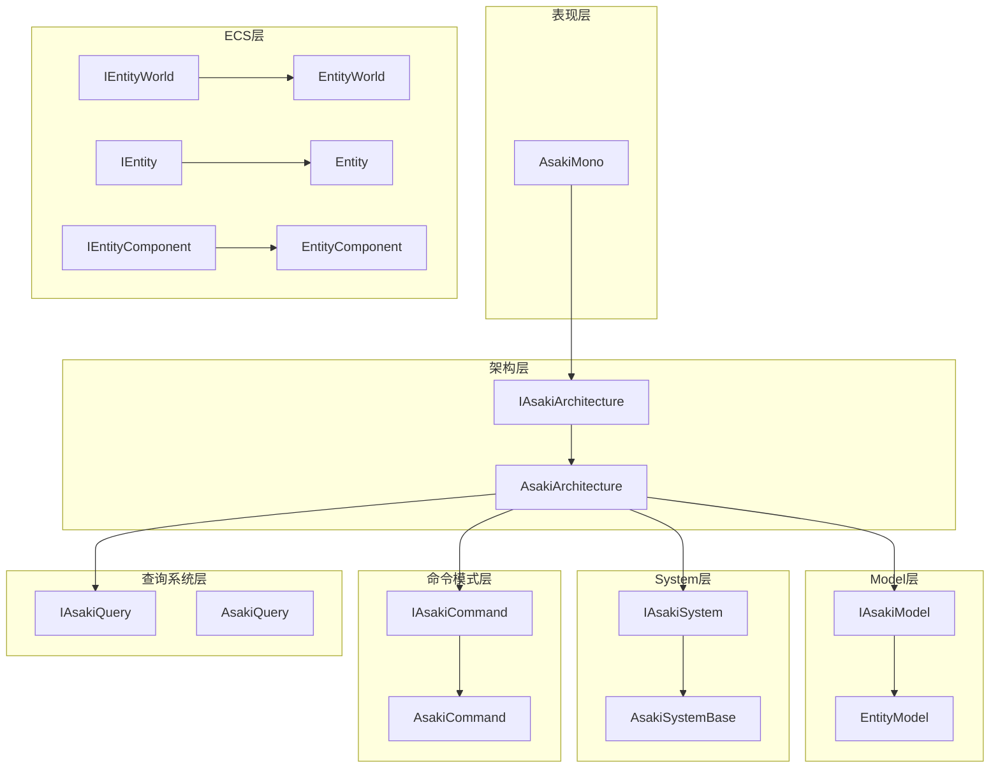
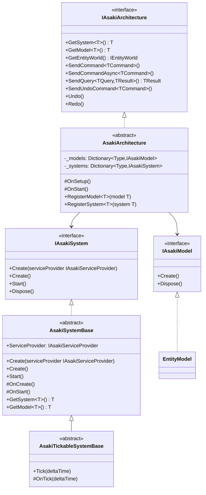
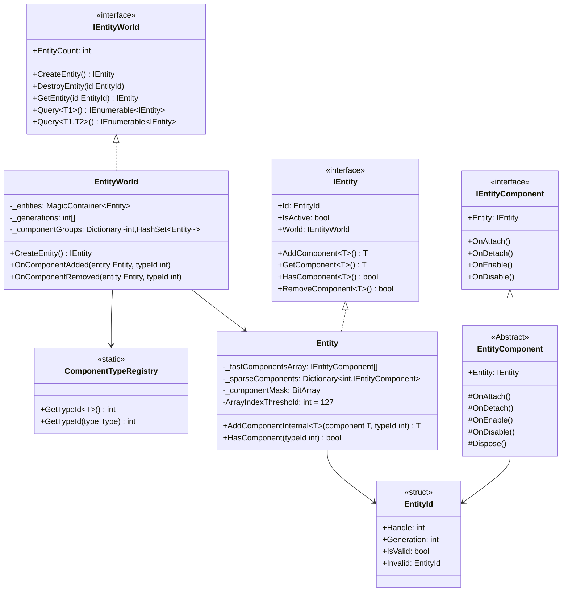
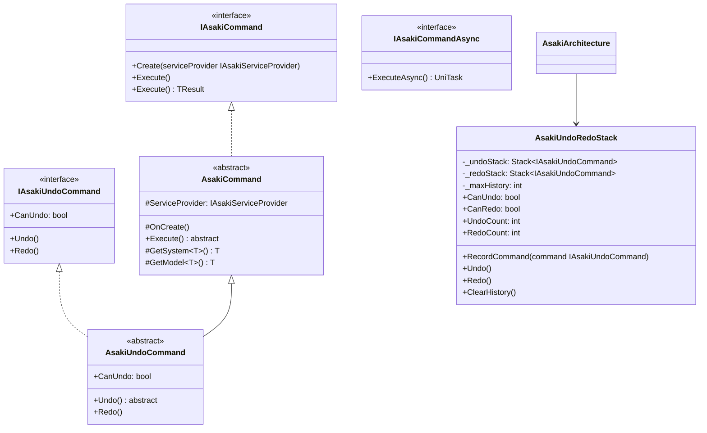
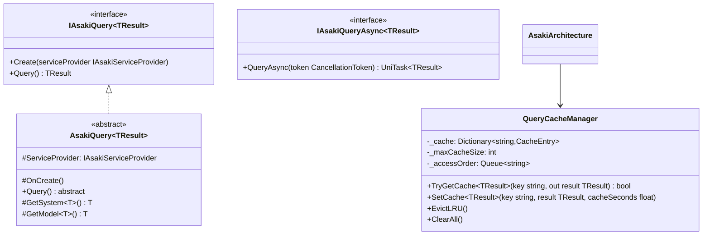
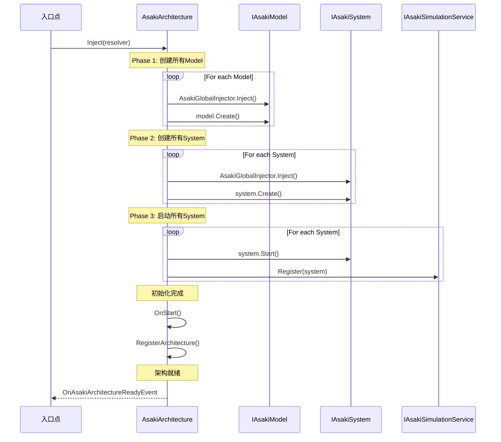
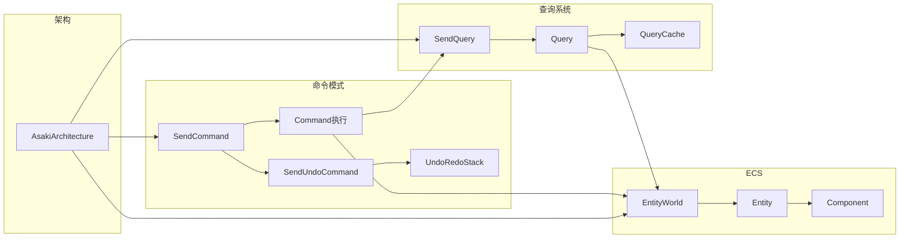

# Asaki Core/Architecture 模块架构文档

## 概述

Core/Architecture 是 Asaki Unity 框架的核心架构系统，负责管理游戏逻辑的组织方式。该模块采用了**命令模式（Command Pattern）**、**ECS（实体组件系统）**和**查询系统（Query System）**三大核心模式，为开发者提供了一套高性能、可扩展的游戏架构解决方案。

---

## 1. 设计理念（Design Philosophy）

### 1.1 架构设计目标

Asaki Architecture 的设计目标是为 Unity 游戏开发提供一个**数据驱动**、**高性能**、**可维护**的架构方案。传统的面向对象编程（OOP）在游戏开发中常会遇到以下问题：

- **紧耦合问题**：MonoBehaviour 之间通过 GetComponent 相互依赖，难以测试和维护
- **性能瓶颈**：频繁的 GameObject.Instantiate 和 Destroy 导致 GC 压力
- **数据分散**：游戏状态数据分散在各个 MonoBehaviour 中，难以统一管理和查询
- **逻辑混乱**：Update 逻辑与业务逻辑混合，代码可读性差

### 1.2 为什么选择命令模式 + ECS + 查询系统

#### 命令模式（Command Pattern）

命令模式将**请求封装为对象**，从而允许参数化不同请求、排队执行、撤销/重做等操作。在 Asaki 框架中，命令模式用于：

- **解耦请求与执行**：发送者无需知道命令如何执行
- **支持撤销/重做**：通过 UndoRedoStack 实现完整的撤销重做功能
- **对象池复用**：命令对象可重复使用，减少 GC 压力
- **日志与调试**：每个命令都是独立的可序列化对象，便于日志记录和调试

#### ECS（实体组件系统）

ECS 是一种数据导向设计（Data-Oriented Design）的架构模式，其核心思想是：

- **数据与逻辑分离**：组件（Component）存储数据，系统（System）处理逻辑
- **连续内存布局**：组件数据连续存储，提高 CPU 缓存命中率
- **灵活组合**：通过不同的组件组合创建不同类型的实体

Asaki 的 ECS 实现特点：

- **混合存储优化**：TypeId ≤ 127 使用数组直接索引，TypeId > 127 使用字典
- **代际管理**：通过 Generation 计数器防止 ABA 问题
- **组件组缓存**：O(1) 查询优化，避免全实体遍历

#### 查询系统（Query System）

查询系统是 ECS 的补充，提供了一种声明式的数据查询方式：

- **缓存机制**：TTL（Time To Live）+ LRU（最近最少使用）淘汰策略
- **对象池复用**：查询对象可重复使用
- **异步支持**：支持同步和异步查询

### 1.3 与传统 OOP 架构的对比

| 特性     | 传统 OOP                 | Asaki Architecture      |
| -------- | ------------------------ | ----------------------- |
| 数据存储 | 分散在各个 MonoBehaviour | 集中在 Entity/Component |
| 组件关系 | 继承树，强耦合           | 组合，灵活组装          |
| 查询方式 | 遍历 GameObject          | 组件组缓存 O(1)         |
| 内存布局 | 对象分散，GC压力大       | 连续内存，缓存友好      |
| 撤销重做 | 需手动实现               | 内置支持                |
| 多线程   | 困难                     | 数据导向，易并行        |

---

## 2. 软件架构（Software Architecture）

### 2.1 架构分层

Asaki Architecture 采用分层架构设计，主要分为以下层次：



### 2.2 核心类图与继承关系



### 2.3 ECS 实体组件系统类图



### 2.4 命令模式类图



### 2.5 查询系统类图



### 2.6 生命周期管理流程

Asaki Architecture 采用三阶段初始化流程，确保所有依赖在正确的时间点被满足：



**生命周期顺序**：

1. **Model Create** → 2. **System Create** → 3. **System Start** → 4. **Bind Simulation** → 5. **OnStart** → 6. **Register**

这种设计确保了：

- 所有 Model 在 System 创建之前完成初始化
- 所有 System 在 Start 之前完成 Create
- Simulation 注册在所有 System Start 之后，避免 System 未完全初始化就被 Tick

### 2.7 三大模式的协作关系



---

## 3. API 使用（API Reference）

### 3.1 核心架构接口

#### IAsakiArchitecture

架构接口，定义所有外部交互 API。

**命名空间**：`Asaki.Core.Architecture`

```csharp
public interface IAsakiArchitecture : IAsakiSceneService, IAsakiServiceProvider, IDisposable
```

##### 方法

| 方法名           | 描述             | 参数                            | 返回值         |
| ---------------- | ---------------- | ------------------------------- | -------------- |
| `GetSystem<T>`   | 获取已注册的系统 | `where T : class, IAsakiSystem` | `T`            |
| `GetModel<T>`    | 获取已注册的模型 | `where T : class, IAsakiModel`  | `T`            |
| `GetEntityWorld` | 获取实体世界     | 无                              | `IEntityWorld` |

##### 命令相关方法

| 方法名                                           | 描述                             | 参数                                                | 返回值             |
| ------------------------------------------------ | -------------------------------- | --------------------------------------------------- | ------------------ |
| `SendCommand<TCommand>()`                        | 执行同步命令（无返回值）         | `where TCommand : class, IAsakiCommand, new()`      | `void`             |
| `SendCommand<TCommand, TResult>()`               | 执行同步命令（有返回值）         | `TCommand : class, IAsakiCommand<TResult>, new()`   | `TResult`          |
| `SendCommand<TCommand>(configure)`               | 执行同步命令（带配置，无返回值） | `Action<TCommand> configure`                        | `void`             |
| `SendCommand<TCommand, TResult>(configure)`      | 执行同步命令（带配置，有返回值） | `Action<TCommand> configure`                        | `TResult`          |
| `SendCommandAsync<TCommand>()`                   | 执行异步命令（无返回值）         | `where TCommand : class, IAsakiCommandAsync, new()` | `UniTask`          |
| `SendCommandAsync<TCommand, TResult>()`          | 执行异步命令（有返回值）         | 泛型约束                                            | `UniTask<TResult>` |
| `SendCommandAsync<TCommand>(configure)`          | 执行异步命令（带配置，无返回值） | `Action<TCommand> configure`                        | `UniTask`          |
| `SendCommandAsync<TCommand, TResult>(configure)` | 执行异步命令（带配置，有返回值） | `Action<TCommand> configure`                        | `UniTask<TResult>` |
| `SendUndoCommand<TCommand>()`                    | 执行可撤销命令                   | `where TCommand : class, IAsakiUndoCommand, new()`  | `void`             |
| `SendUndoCommand<TCommand>(configure)`           | 执行可撤销命令（带配置）         | `Action<TCommand> configure`                        | `void`             |

##### 查询相关方法

| 方法名                                                     | 描述                         | 参数                                                | 返回值             |
| ---------------------------------------------------------- | ---------------------------- | --------------------------------------------------- | ------------------ |
| `SendQuery<TQuery, TResult>()`                             | 执行同步查询                 | `where TQuery : class, IAsakiQuery<TResult>, new()` | `TResult`          |
| `SendQuery<TQuery, TResult>(cacheSeconds)`                 | 执行同步查询（带缓存）       | `float cacheSeconds`                                | `TResult`          |
| `SendQuery<TQuery, TResult>(configure, cacheSeconds)`      | 执行同步查询（带配置和缓存） | `Action<TQuery> configure, float cacheSeconds`      | `TResult`          |
| `SendQueryAsync<TQuery, TResult>()`                        | 执行异步查询                 | 泛型约束                                            | `UniTask<TResult>` |
| `SendQueryAsync<TQuery, TResult>(cacheSeconds)`            | 执行异步查询（带缓存）       | `float cacheSeconds`                                | `UniTask<TResult>` |
| `SendQueryAsync<TQuery, TResult>(configure, cacheSeconds)` | 执行异步查询（带配置和缓存） | `Action<TQuery> configure, float cacheSeconds`      | `UniTask<TResult>` |

##### 撤销重做相关方法

| 方法名      | 描述                 | 返回值 |
| ----------- | -------------------- | ------ |
| `Undo()`    | 撤销上一步操作       | `void` |
| `Redo()`    | 重做上一步撤销的操作 | `void` |
| `CanUndo`   | 是否可以撤销         | `bool` |
| `CanRedo`   | 是否可以重做         | `bool` |
| `UndoCount` | 撤销栈中的命令数量   | `int`  |
| `RedoCount` | 重做栈中的命令数量   | `int`  |

#### IAsakiSceneService

场景上下文服务标记接口。

**命名空间**：`Asaki.Core.Context`

```csharp
/// <summary>
/// Asaki场景上下文服务标记接口。
/// </summary>
/// <remarks>
/// 实现此接口的服务是特定于场景的，通常由 AsakiSceneContext 管理。
/// 场景上下文服务的生命周期通常与场景相同，场景加载时创建，场景卸载时销毁。
/// </remarks>
public interface IAsakiSceneService : IAsakiService { }
```

---

#### AsakiArchitecture

核心架构类，管理工作流程。

**命名空间**：`Asaki.Core.Architecture`

```csharp
public abstract partial class AsakiArchitecture : IAsakiArchitecture, IAsakiInject, IDisposable
```

##### 受保护方法

| 方法名                      | 描述                                     |
| --------------------------- | ---------------------------------------- |
| `OnSetup()`                 | 抽象方法，子类实现以注册 Model 和 System |
| `OnStart()`                 | 虚方法，所有 System 启动完成后调用       |
| `RegisterModel<T>(model)`   | 注册数据模型                             |
| `RegisterSystem<T>(system)` | 注册业务系统                             |

##### 生命周期

1. **Inject** → 2. **OnSetup** → 3. **Model.Create** → 4. **System.Create** → 5. **System.Start** → 6. **BindSimulation** → 7. **OnStart** → 8. **RegisterArchitecture**

---

### 3.2 System 相关接口

#### IAsakiSystem

系统接口，定义所有业务系统的生命周期。

```csharp
public interface IAsakiSystem : IDisposable
{
    /// <summary>
    /// 系统创建时调用（依赖已注入）
    /// </summary>
    /// <param name="serviceProvider">服务提供者</param>
    void Create(IAsakiServiceProvider serviceProvider);

    /// <summary>
    /// 无参创建方法（用于兼容旧版本）
    /// </summary>
    void Create();

    /// <summary>
    /// 所有系统创建完成后调用（可安全访问其他系统）
    /// </summary>
    void Start();
}
```

#### AsakiSystemBase

系统基类，提供完整的生命周期管理。

```csharp
public abstract class AsakiSystemBase : IAsakiSystem
{
    /// <summary>
    /// 服务提供者
    /// </summary>
    protected IAsakiServiceProvider ServiceProvider { get; }

    /// <summary>
    /// 系统创建时调用（依赖注入后）
    /// </summary>
    /// <param name="serviceProvider">服务提供者</param>
    public virtual void Create(IAsakiServiceProvider serviceProvider)
    {
        ServiceProvider = serviceProvider;
        OnCreate();
    }

    /// <summary>
    /// 无参创建方法（用于兼容旧版本）
    /// </summary>
    public void Create() { }

    /// <summary>
    /// 系统创建时调用
    /// </summary>
    protected virtual void OnCreate() { }

    /// <summary>
    /// 所有系统创建完成后调用
    /// </summary>
    public virtual void Start() { }

    /// <summary>
    /// 启动完成后调用
    /// </summary>
    protected virtual void OnStart() { }

    /// <summary>
    /// 获取 System
    /// </summary>
    protected T GetSystem<T>() where T : class, IAsakiSystem;

    /// <summary>
    /// 获取 Model
    /// </summary>
    protected T GetModel<T>() where T : class, IAsakiModel;
}
```

##### 变体系统基类

| 类名                           | 描述                    | 抽象方法                            |
| ------------------------------ | ----------------------- | ----------------------------------- |
| `AsakiTickableSystemBase`      | 带 Tick 能力的系统      | `OnTick(float deltaTime)`           |
| `AsakiFixedTickableSystemBase` | 带 FixedTick 能力的系统 | `OnFixedTick(float fixedDeltaTime)` |
| `AsakiLateTickableSystemBase`  | 带 LateTick 能力的系统  | `OnLateTick(float lateDeltaTime)`   |

#### IAsakiTickable / IAsakiFixedTickable / IAsakiLateTickable

Tickable 接口定义，用于接收 Unity 更新循环回调。

**命名空间**：`Asaki.Core.Simulation`

```csharp
public interface IAsakiTickable
{
    /// <summary>
    /// 每帧更新（普通帧更新）
    /// </summary>
    /// <param name="deltaTime">帧时间增量（秒）</param>
    void Tick(float deltaTime);
}

public interface IAsakiFixedTickable
{
    /// <summary>
    /// 物理帧更新（固定时间间隔）
    /// </summary>
    /// <param name="fixedDeltaTime">固定帧时间增量（秒）</param>
    void FixedTick(float fixedDeltaTime);
}

public interface IAsakiLateTickable
{
    /// <summary>
    /// 延迟帧更新（在所有 Update 之后执行）
    /// </summary>
    /// <param name="lateDeltaTime">延迟帧时间增量（秒）</param>
    void LateTick(float lateDeltaTime);
}

/// <summary>
/// Tick 优先级枚举（数值越小越先执行）
/// </summary>
public enum TickPriority
{
    High = 0,       // Input, Sensors
    Normal = 1000,  // Game Logic, FSM
    Low = 2000,     // UI, Audio, View Sync
}
```

---

### 3.3 Model 相关接口

#### IAsakiModel

模型接口，数据层定义。继承自 IDisposable 接口。

```csharp
public interface IAsakiModel : IDisposable
{
    /// <summary>
    /// 创建模型
    /// </summary>
    void Create();
}
```

#### EntityModel

实体模型，管理实体世界的生命周期。

```csharp
public class EntityModel : IAsakiModel
{
    /// <summary>
    /// 实体世界
    /// </summary>
    public IEntityWorld World { get; }

    public void Create();
    public void Dispose();
}
```

---

### 3.4 命令模式 API

#### IAsakiCommand

同步命令接口。

```csharp
public interface IAsakiCommand
{
    /// <summary>
    /// 创建命令（依赖注入）
    /// </summary>
    void Create(IAsakiServiceProvider serviceProvider);

    /// <summary>
    /// 执行命令
    /// </summary>
    void Execute();
}

/// <summary>
/// 带返回值的同步命令
/// </summary>
public interface IAsakiCommand<out TResult>
{
    void Create(IAsakiServiceProvider serviceProvider);
    TResult Execute();
}
```

#### IAsakiCommandAsync

异步命令接口。

```csharp
public interface IAsakiCommandAsync
{
    void Create(IAsakiServiceProvider serviceProvider);
    UniTask ExecuteAsync();
}

public interface IAsakiCommandAsync<TResult>
{
    void Create(IAsakiServiceProvider serviceProvider);
    UniTask<TResult> ExecuteAsync(CancellationToken token = default);
}
```

#### IAsakiUndoCommand

可撤销命令接口。

```csharp
public interface IAsakiUndoCommand : IAsakiCommand
{
    /// <summary>
    /// 撤销操作
    /// </summary>
    void Undo();

    /// <summary>
    /// 重做操作
    /// </summary>
    void Redo();

    /// <summary>
    /// 是否可以撤销
    /// </summary>
    bool CanUndo { get; }
}
```

#### AsakiCommand

命令基类实现。

```csharp
public abstract class AsakiCommand : IAsakiCommand
{
    /// <summary>
    /// 服务提供者
    /// </summary>
    protected IAsakiServiceProvider ServiceProvider { get; }

    /// <summary>
    /// 创建时调用
    /// </summary>
    protected virtual void OnCreate() { }

    /// <summary>
    /// 执行命令（子类实现）
    /// </summary>
    public abstract void Execute();

    /// <summary>
    /// 获取 System
    /// </summary>
    protected T GetSystem<T>() where T : class, IAsakiSystem;

    /// <summary>
    /// 获取 Model
    /// </summary>
    protected T GetModel<T>() where T : class, IAsakiModel;

    /// <summary>
    /// 日志记录
    /// </summary>
    protected void Log(string message);
    protected void LogWarning(string message);
    protected void LogError(string message);
}
```

##### 泛型变体

| 类名                         | 描述                       |
| ---------------------------- | -------------------------- |
| `AsakiCommand<TResult>`      | 带返回值的命令基类         |
| `AsakiCommandAsync`          | 异步命令基类（无返回值）   |
| `AsakiCommandAsync<TResult>` | 带返回值的异步命令基类     |
| `AsakiUndoCommand`           | 可撤销命令基类（无返回值） |
| `AsakiUndoCommand<TResult>`  | 带返回值的可撤销命令基类   |

#### AsakiCommandPoolManager

命令对象池管理器（内部类），统一使用 AsakiArchitecturePoolManager 实现。

````csharp
internal static class AsakiCommandPoolManager
{
    /// <summary>
    /// 租借 Command 对象（用于预热场景）
    /// </summary>
    public static TCommand Rent<TCommand>() where TCommand : class, new();

    /// <summary>
    /// 异步租借 Command 对象（用于预热场景）
    /// </summary>
    public static async UniTask<TCommand> RentAsync<TCommand>(CancellationToken token = default)
        where TCommand : class, new();

    /// <summary>
    /// 尝试租借 Command 对象，如果池不存在则返回false
    /// </summary>
    public static bool TryRent<TCommand>(out TCommand cmd) where TCommand : class, new();

    /// <summary>
    /// 异步尝试租借 Command 对象
    /// </summary>
    public static async UniTask<(bool success, TCommand cmd)> TryRentAsync<TCommand>(
        CancellationToken token = default
    ) where TCommand : class, new();

    /// <summary>
    /// 归还 Command 对象到池（用于预热场景）
    /// </summary>
    public static bool Return<TCommand>(TCommand cmd) where TCommand : class;

    /// <summary>
    /// 尝试归还 Command 对象到池，如果池不存在则直接丢弃
    /// </summary>
    public static void TryReturn<TCommand>(TCommand cmd) where TCommand : class;

    /// <summary>
    /// 清空所有 Command 池
    /// </summary>
    public static void ClearAll();
}

#### AsakiUndoRedoStack

撤销重做栈（内部类）。

```csharp
public class AsakiUndoRedoStack
{
    /// <summary>
    /// 是否可以撤销
    /// </summary>
    public bool CanUndo { get; }

    /// <summary>
    /// 是否可以重做
    /// </summary>
    public bool CanRedo { get; }

    /// <summary>
    /// 撤销栈中的命令数量
    /// </summary>
    public int UndoCount { get; }

    /// <summary>
    /// 重做栈中的命令数量
    /// </summary>
    public int RedoCount { get; }

    /// <summary>
    /// 记录命令
    /// </summary>
    public void RecordCommand(IAsakiUndoCommand command);

    /// <summary>
    /// 撤销
    /// </summary>
    public void Undo();

    /// <summary>
    /// 重做
    /// </summary>
    public void Redo();

    /// <summary>
    /// 清空历史
    /// </summary>
    public void ClearHistory();
}
````

---

### 3.5 ECS API

#### IEntityWorld

实体世界接口。

```csharp
public interface IEntityWorld : IDisposable
{
    /// <summary>
    /// 创建实体
    /// </summary>
    IEntity CreateEntity();

    /// <summary>
    /// 销毁实体
    /// </summary>
    void DestroyEntity(EntityId id);

    /// <summary>
    /// 获取实体
    /// </summary>
    IEntity GetEntity(EntityId id);

    /// <summary>
    /// 尝试获取实体
    /// </summary>
    bool TryGetEntity(EntityId id, out IEntity entity);

    /// <summary>
    /// 获取所有实体
    /// </summary>
    IEnumerable<IEntity> GetAllEntities();

    /// <summary>
    /// 实体数量
    /// </summary>
    int EntityCount { get; }

    /// <summary>
    /// 通过索引获取实体
    /// </summary>
    IEntity GetEntityAt(int index);

    /// <summary>
    /// 查询具有指定组件的实体（1-6个组件）
    /// </summary>
    IEnumerable<IEntity> Query<T1>() where T1 : class, IEntityComponent;
    IEnumerable<IEntity> Query<T1, T2>() where T1 : class, IEntityComponent where T2 : class, IEntityComponent;
    IEnumerable<IEntity> Query<T1, T2, T3>() ... // 最多支持6个组件
}
```

#### IEntity

实体接口。

```csharp
public interface IEntity : IDisposable
{
    /// <summary>
    /// 实体唯一标识符
    /// </summary>
    EntityId Id { get; }

    /// <summary>
    /// 实体是否激活
    /// </summary>
    bool IsActive { get; set; }

    /// <summary>
    /// 实体所属的世界
    /// </summary>
    IEntityWorld World { get; }

    /// <summary>
    /// 添加组件
    /// </summary>
    T AddComponent<T>() where T : class, IEntityComponent, new();
    T AddComponent<T>(T component) where T : class, IEntityComponent;

    /// <summary>
    /// 获取组件
    /// </summary>
    T GetComponent<T>() where T : class, IEntityComponent;
    bool TryGetComponent<T>(out T component) where T : class, IEntityComponent;

    /// <summary>
    /// 检查是否具有指定组件
    /// </summary>
    bool HasComponent<T>() where T : class, IEntityComponent;
    bool HasComponent(Type componentType);

    /// <summary>
    /// 移除组件
    /// </summary>
    bool RemoveComponent<T>() where T : class, IEntityComponent;
    bool RemoveComponent(Type componentType);

    /// <summary>
    /// 获取所有组件
    /// </summary>
    IEnumerable<IEntityComponent> GetAllComponents();

    /// <summary>
    /// 组件数量
    /// </summary>
    int ComponentCount { get; }
}
```

#### IEntityComponent

组件接口。

```csharp
public interface IEntityComponent : IDisposable
{
    /// <summary>
    /// 所属实体
    /// </summary>
    IEntity Entity { get; set; }

    /// <summary>
    /// 组件被添加到实体时调用
    /// </summary>
    void OnAttach();

    /// <summary>
    /// 组件从实体移除时调用
    /// </summary>
    void OnDetach();

    /// <summary>
    /// 实体激活时调用
    /// </summary>
    void OnEnable();

    /// <summary>
    /// 实体禁用时调用
    /// </summary>
    void OnDisable();
}
```

#### EntityComponent

组件基类。

```csharp
public abstract class EntityComponent : IEntityComponent
{
    public IEntity Entity { get; set; }

    /// <summary>
    /// 组件被添加到实体时调用（可重写）
    /// </summary>
    public virtual void OnAttach() { }

    /// <summary>
    /// 组件从实体移除时调用（可重写）
    /// </summary>
    public virtual void OnDetach() { }

    /// <summary>
    /// 实体激活时调用（可重写）
    /// </summary>
    public virtual void OnEnable() { }

    /// <summary>
    /// 实体禁用时调用（可重写）
    /// </summary>
    public virtual void OnDisable() { }

    /// <summary>
    /// 释放组件资源（可重写）
    /// </summary>
    public virtual void Dispose() { }

    /// <summary>
    /// 获取同一实体的其他组件（便捷方法）
    /// </summary>
    protected T GetSibling<T>() where T : class, IEntityComponent;

    /// <summary>
    /// 检查同一实体是否有其他组件（便捷方法）
    /// </summary>
    protected bool HasSibling<T>() where T : class, IEntityComponent;
}

/// <summary>
/// 标签组件基类 - 无数据，仅作标记
/// </summary>
public abstract class TagComponent : EntityComponent { }
```

#### IAsakiEntitySystem / AsakiEntitySystemBase

ECS 系统接口和基类，提供实体世界的自动获取。

**命名空间**：`Asaki.Core.Architecture.Entities`

```csharp
public interface IAsakiEntitySystem : IAsakiSystem
{
    /// <summary>
    /// 设置实体世界
    /// </summary>
    void SetEntityWorld(IEntityWorld world);
}

public abstract class AsakiEntitySystemBase : AsakiSystemBase, IAsakiEntitySystem
{
    /// <summary>
    /// 实体世界引用
    /// </summary>
    protected IEntityWorld World { get; private set; }

    public void SetEntityWorld(IEntityWorld world)
    {
        World = world;
    }

    protected override void OnCreate()
    {
        base.OnCreate();
        // 自动从 ServiceProvider 获取 EntityWorld
        if (ServiceProvider is IAsakiArchitecture arch)
        {
            World = arch.GetEntityWorld();
        }
    }
}

/// <summary>
/// 带 Tick 能力的 ECS 系统基类
/// </summary>
public abstract class AsakiEntityTickableSystemBase : AsakiEntitySystemBase, IAsakiTickable
{
    private bool _isStarted;

    public override void Start()
    {
        base.Start();
        _isStarted = true;
    }

    public virtual void Tick(float deltaTime)
    {
        if (!_isStarted)
            return;
        OnEntityTick(deltaTime);
    }

    /// <summary>
    /// 每帧更新实体系统
    /// </summary>
    protected abstract void OnEntityTick(float deltaTime);
}

/// <summary>
/// 带 FixedTick 能力的 ECS 系统基类
/// </summary>
public abstract class AsakiEntityFixedTickableSystemBase : AsakiEntitySystemBase, IAsakiFixedTickable
{
    private bool _isStarted;

    public override void Start()
    {
        base.Start();
        _isStarted = true;
    }

    public virtual void FixedTick(float fixedDeltaTime)
    {
        if (!_isStarted)
            return;
        OnEntityFixedTick(fixedDeltaTime);
    }

    /// <summary>
    /// 物理帧更新实体系统
    /// </summary>
    protected abstract void OnEntityFixedTick(float fixedDeltaTime);
}

/// <summary>
/// 带 LateTick 能力的 ECS 系统基类
/// </summary>
public abstract class AsakiEntityLateTickableSystemBase : AsakiEntitySystemBase, IAsakiLateTickable
{
    private bool _isStarted;

    public override void Start()
    {
        base.Start();
        _isStarted = true;
    }

    public virtual void LateTick(float lateDeltaTime)
    {
        if (!_isStarted)
            return;
        OnEntityLateTick(lateDeltaTime);
    }

    /// <summary>
    /// 延迟帧更新实体系统
    /// </summary>
    protected abstract void OnEntityLateTick(float lateDeltaTime);
}
```

#### EntityId

实体标识符。

```csharp
public readonly struct EntityId : IEquatable<EntityId>
{
    /// <summary>
    /// 魔法容器句柄（索引）
    /// </summary>
    public readonly int Handle;

    /// <summary>
    /// 代际计数器 - 防止 ABA 问题
    /// </summary>
    public readonly int Generation;

    /// <summary>
    /// 是否为有效ID
    /// </summary>
    public bool IsValid { get; }

    /// <summary>
    /// 无效实体ID
    /// </summary>
    public static readonly EntityId Invalid;
}
```

#### ComponentTypeRegistry

组件类型注册表。

```csharp
public static class ComponentTypeRegistry
{
    /// <summary>
    /// 获取组件类型的 ID
    /// </summary>
    public static int GetTypeId<T>() where T : class, IEntityComponent;
    public static int GetTypeId(Type type);

    /// <summary>
    /// 通过 ID 获取类型
    /// </summary>
    /// <param name="typeId">组件类型 ID</param>
    /// <returns>组件类型，如果未注册则返回 null</returns>
    public static Type GetTypeById(int typeId);

    /// <summary>
    /// 获取已注册的类型数量
    /// </summary>
    public static int RegisteredTypeCount { get; }
}
```

---

### 3.6 查询系统 API

#### IAsakiQuery

同步查询接口。

```csharp
public interface IAsakiQuery<TResult>
{
    /// <summary>
    /// 创建查询（依赖注入）
    /// </summary>
    void Create(IAsakiServiceProvider serviceProvider);

    /// <summary>
    /// 执行查询
    /// </summary>
    TResult Query();
}
```

#### IAsakiQueryAsync

异步查询接口。

```csharp
public interface IAsakiQueryAsync<TResult>
{
    /// <summary>
    /// 创建查询（依赖注入）
    /// </summary>
    void Create(IAsakiServiceProvider serviceProvider);

    /// <summary>
    /// 异步执行查询
    /// </summary>
    /// <param name="token">取消令牌</param>
    /// <returns>异步查询结果</returns>
    UniTask<TResult> QueryAsync(CancellationToken token = default);
}
```

#### IAsakiCacheKeyProvider

为带参数的 Query 提供自定义缓存键接口。

```csharp
public interface IAsakiCacheKeyProvider
{
    /// <summary>
    /// 获取缓存键
    /// </summary>
    /// <returns>缓存键字符串</returns>
    string GetCacheKey();
}
```

#### AsakiQuery

查询基类实现。

```csharp
public abstract class AsakiQuery<TResult> : IAsakiQuery<TResult>
{
    /// <summary>
    /// 服务提供者
    /// </summary>
    protected IAsakiServiceProvider ServiceProvider { get; }

    /// <summary>
    /// 创建时调用
    /// </summary>
    protected virtual void OnCreate() { }

    /// <summary>
    /// 执行查询（子类实现）
    /// </summary>
    public abstract TResult Query();

    /// <summary>
    /// 获取 System
    /// </summary>
    protected T GetSystem<T>() where T : class, IAsakiSystem;

    /// <summary>
    /// 获取 Model
    /// </summary>
    protected T GetModel<T>() where T : class, IAsakiModel;
}
```

#### QueryCacheManager

查询缓存管理器（内部类）。

````csharp
internal class QueryCacheManager
{
    /// <summary>
    /// 尝试从缓存获取结果
    /// </summary>
    public bool TryGetCache<TResult>(string key, out TResult result);

    /// <summary>
    /// 设置缓存
    /// </summary>
    /// <param name="key">缓存键</param>
    /// <param name="result">缓存结果</param>
    /// <param name="cacheSeconds">缓存时长（秒）</param>
    public void SetCache<TResult>(string key, TResult result, float cacheSeconds);

    /// <summary>
    /// 清空所有缓存
    /// </summary>
    public void ClearAll();

    /// <summary>
    /// 移除特定缓存
    /// </summary>
    public void Remove(string key);

    /// <summary>
    /// 获取缓存统计信息
    /// </summary>
    public int GetCacheCount();
}

#### QueryPoolManager

Query 对象池管理器（内部类），统一使用 AsakiArchitecturePoolManager 实现。

```csharp
internal static class QueryPoolManager
{
    /// <summary>
    /// 租借 Query 对象（用于预热场景）
    /// </summary>
    public static TQuery Rent<TQuery>() where TQuery : class, new();

    /// <summary>
    /// 异步租借 Query 对象（用于预热场景）
    /// </summary>
    public static async UniTask<TQuery> RentAsync<TQuery>(CancellationToken token = default)
        where TQuery : class, new();

    /// <summary>
    /// 尝试租借 Query 对象，如果池不存在则返回false
    /// </summary>
    public static bool TryRent<TQuery>(out TQuery query) where TQuery : class, new();

    /// <summary>
    /// 异步尝试租借 Query 对象
    /// </summary>
    public static async UniTask<(bool success, TQuery query)> TryRentAsync<TQuery>(
        CancellationToken token = default
    ) where TQuery : class, new();

    /// <summary>
    /// 归还 Query 对象到池（用于预热场景）
    /// </summary>
    public static bool Return<TQuery>(TQuery query) where TQuery : class;

    /// <summary>
    /// 尝试归还 Query 对象到池，如果池不存在则直接丢弃
    /// </summary>
    public static void TryReturn<TQuery>(TQuery query) where TQuery : class;

    /// <summary>
    /// 清空所有 Query 池
    /// </summary>
    public static void ClearAll();
}
````

---

### 3.7 常量定义

#### AsakiArchitectureConstants

```csharp
public static class AsakiArchitectureConstants
{
    /// <summary>
    /// 默认撤销重做最大历史记录数
    /// </summary>
    public const int DefaultUndoRedoMaxHistory = 100;

    /// <summary>
    /// 默认撤销重做栈容量
    /// </summary>
    public const int DefaultUndoRedoStackCapacity = 64;

    /// <summary>
    /// 默认组件组容量
    /// </summary>
    public const int DefaultComponentGroupsCapacity = 64;

    /// <summary>
    /// 默认实体组件数组大小
    /// 用于预分配实体组件数组，提升访问性能
    /// </summary>
    public const int DefaultEntityComponentArraySize = 8;

    /// <summary>
    /// 实体组件数组索引的最大 TypeId 阈值
    /// TypeId <= 127 使用数组直接索引 (O(1) 性能)
    /// TypeId > 127 使用 Dictionary 存储 (避免内存浪费)
    /// </summary>
    public const int EntityComponentArrayIndexThreshold = 127;

    /// <summary>
    /// 组件类型注册表的最大 TypeId 上限
    /// </summary>
    public const int MaxComponentTypeId = 10000;
}
```

---

## 4. 好的示例（Good Examples）

### 4.1 创建自定义 Architecture

```csharp
using Asaki.Core.Architecture;
using Asaki.Core.Architecture.Entities;

namespace GameExample
{
    /// <summary>
    /// 游戏主架构
    /// </summary>
    public class GameArchitecture : AsakiArchitecture
    {
        // 1. 注册所有 Model
        protected override void OnSetup()
        {
            // 注册数据模型
            RegisterModel(new EntityModel());
            RegisterModel(new GameStateModel());
            RegisterModel(new InventoryModel());

            // 2. 注册所有 System
            RegisterSystem(new PlayerSystem());
            RegisterSystem(new CombatSystem());
            RegisterSystem(new SpawnSystem());
            RegisterSystem(new AISystem());
        }

        // 3. 自定义初始化逻辑
        protected override void OnStart()
        {
            base.OnStart();
            ALog.Info("Game Architecture started!");
        }
    }

    /// <summary>
    /// 游戏状态模型
    /// </summary>
    public class GameStateModel : IAsakiModel
    {
        public int Score { get; set; }
        public int Level { get; set; }
        public bool IsPaused { get; set; }

        public void Create()
        {
            Score = 0;
            Level = 1;
            IsPaused = false;
        }

        public void Dispose()
        {
            // 清理资源
        }
    }
}
```

### 4.2 创建自定义 System

```csharp
using Asaki.Core.Architecture;
using Asaki.Core.Architecture.Entities;

namespace GameExample
{
    /// <summary>
    /// 玩家系统 - 使用 TickableSystemBase 实现每帧更新
    /// </summary>
    public class PlayerSystem : AsakiTickableSystemBase
    {
        // 组件定义
        public class PlayerComponent : EntityComponent
        {
            public float MoveSpeed = 5f;
            public float Health = 100f;
            public Vector3 Position;
        }

        // 标签组件
        public class PlayerTag : TagComponent { }

        // 1. 创建阶段 - 可安全注入依赖
        protected override void OnCreate()
        {
            base.OnCreate();
            ALog.Info("PlayerSystem created");
        }

        // 2. 启动阶段 - 可安全访问其他 System
        protected override void OnStart()
        {
            base.OnStart();
            ALog.Info("PlayerSystem started");
        }

        // 3. 每帧更新
        protected override void OnTick(float deltaTime)
        {
            var world = GetModel<EntityModel>().World;
            var playerQuery = world.Query<PlayerComponent>();

            foreach (var entity in playerQuery)
            {
                var player = entity.GetComponent<PlayerComponent>();
                // 处理玩家逻辑
                ProcessPlayerMovement(player, deltaTime);
            }
        }

        private void ProcessPlayerMovement(PlayerComponent player, float deltaTime)
        {
            // 移动逻辑
            player.Position += Vector3.forward * player.MoveSpeed * deltaTime;
        }

        // 4. 释放资源
        public override void Dispose()
        {
            ALog.Info("PlayerSystem disposed");
        }
    }

    /// <summary>
    /// 战斗系统 - 处理玩家与敌人的战斗
    /// </summary>
    public class CombatSystem : AsakiTickableSystemBase
    {
        public class HealthComponent : EntityComponent
        {
            public float MaxHealth = 100f;
            public float CurrentHealth = 100f;
            public float DamageMultiplier = 1f;
        }

        public class DamageComponent : EntityComponent
        {
            public float Damage = 10f;
            public float AttackRate = 1f;
            private float _lastAttackTime;

            public bool CanAttack()
            {
                return Time.time - _lastAttackTime >= AttackRate;
            }

            public void RecordAttack()
            {
                _lastAttackTime = Time.time;
            }
        }

        protected override void OnTick(float deltaTime)
        {
            var world = GetModel<EntityModel>().World;

            // 查询有伤害能力的实体
            foreach (var attacker in world.Query<DamageComponent>())
            {
                var damageComp = attacker.GetComponent<DamageComponent>();
                if (!damageComp.CanAttack()) continue;

                // 简单的范围检测
                foreach (var target in world.Query<HealthComponent>())
                {
                    if (attacker == target) continue; // 跳过自己

                    float distance = Vector3.Distance(
                        attacker.GetComponent<Transform>()?.position ?? Vector3.zero,
                        target.GetComponent<Transform>()?.position ?? Vector3.zero
                    );

                    if (distance < 2f) // 攻击范围
                    {
                        ApplyDamage(target, damageComp.Damage);
                        damageComp.RecordAttack();
                    }
                }
            }
        }

        private void ApplyDamage(IEntity target, float damage)
        {
            var health = target.GetComponent<HealthComponent>();
            if (health != null)
            {
                health.CurrentHealth = Mathf.Max(0, health.CurrentHealth - damage);

                if (health.CurrentHealth <= 0)
                {
                    // 实体死亡
                    ALog.Info($"Entity {target.Id} died");
                }
            }
        }

        public override void Dispose() { }
    }
}
```

### 4.3 使用命令模式

```csharp
using Asaki.Core.Architecture;
using Asaki.Core.Architecture.Command;

namespace GameExample
{
    /// <summary>
    /// 移动命令
    /// </summary>
    public class MoveCommand : AsakiCommand
    {
        public float DeltaX { get; set; }
        public float DeltaZ { get; set; }

        protected override void OnCreate()
        {
            // 命令创建时的初始化
        }

        public override void Execute()
        {
            var world = GetModel<EntityModel>().World;
            var playerQuery = world.Query<PlayerSystem.PlayerComponent>();

            foreach (var entity in playerQuery)
            {
                var player = entity.GetComponent<PlayerSystem.PlayerComponent>();
                player.Position += new Vector3(DeltaX, 0, DeltaZ);
                Log($"Player moved to {player.Position}");
            }
        }
    }

    /// <summary>
    /// 可撤销的移动命令
    /// </summary>
    public class UndoableMoveCommand : AsakiUndoCommand
    {
        public float DeltaX { get; set; }
        public float DeltaZ { get; set; }

        private Vector3 _previousPosition;

        public override void Execute()
        {
            var world = GetModel<EntityModel>().World;
            var playerQuery = world.Query<PlayerSystem.PlayerComponent>();

            foreach (var entity in playerQuery)
            {
                var player = entity.GetComponent<PlayerSystem.PlayerComponent>();
                _previousPosition = player.Position;
                player.Position += new Vector3(DeltaX, 0, DeltaZ);
            }
        }

        public override void Undo()
        {
            var world = GetModel<EntityModel>().World;
            var playerQuery = world.Query<PlayerSystem.PlayerComponent>();

            foreach (var entity in playerQuery)
            {
                var player = entity.GetComponent<PlayerSystem.PlayerComponent>();
                player.Position = _previousPosition;
                Log($"Move undone, position restored to {player.Position}");
            }
        }
    }

    /// <summary>
    /// 异步加载命令
    /// </summary>
    public class AsyncLoadCommand : AsakiCommandAsync<int>
    {
        public string SceneName { get; set; }

        public override async UniTask<int> ExecuteAsync(CancellationToken token = default)
        {
            Log($"Loading scene: {SceneName}");

            // 模拟异步加载
            await UniTask.Delay(1000, cancellationToken: token);

            Log($"Scene {SceneName} loaded");
            return 1; // 返回加载结果
        }
    }

    /// <summary>
    /// 使用命令的示例
    /// </summary>
    public class CommandExample : MonoBehaviour
    {
        private IAsakiArchitecture _architecture;

        private void Start()
        {
            // 发送同步命令
            _architecture.SendCommand<MoveCommand>(cmd =>
            {
                cmd.DeltaX = 10f;
                cmd.DeltaZ = 5f;
            });

            // 发送可撤销命令
            _architecture.SendUndoCommand<UndoableMoveCommand>(cmd =>
            {
                cmd.DeltaX = 10f;
                cmd.DeltaZ = 0f;
            });

            // 撤销
            if (_architecture.CanUndo)
            {
                _architecture.Undo();
            }

            // 重做
            if (_architecture.CanRedo)
            {
                _architecture.Redo();
            }
        }

        private async void LoadSceneAsync()
        {
            // 发送异步命令
            var result = await _architecture.SendCommandAsync<AsyncLoadCommand>(cmd =>
            {
                cmd.SceneName = "GameScene";
            });
        }
    }
}
```

### 4.4 使用查询系统

```csharp
using Asaki.Core.Architecture;
using Asaki.Core.Architecture.Queries;
using System.Collections.Generic;

namespace GameExample
{
    /// <summary>
    /// 查询所有存活敌人
    /// </summary>
    public class GetAliveEnemiesQuery : AsakiQuery<List<IEntity>>
    {
        public override List<IEntity> Query()
        {
            var world = GetModel<EntityModel>().World;
            var result = new List<IEntity>();

            foreach (var entity in world.Query<EnemyComponent, HealthComponent>())
            {
                var health = entity.GetComponent<HealthComponent>();
                if (health.CurrentHealth > 0)
                {
                    result.Add(entity);
                }
            }

            return result;
        }
    }

    /// <summary>
    /// 查询系统使用示例
    /// </summary>
    public class QueryExample : AsakiTickableSystemBase
    {
        protected override void OnTick(float deltaTime)
        {
            // 1. 简单查询（无缓存）
            var enemies = SendQuery<GetAliveEnemiesQuery, List<IEntity>>();

            // 2. 带缓存的查询（缓存 1 秒）
            var cachedEnemies = SendQuery<GetAliveEnemiesQuery, List<IEntity>>(1f);

            // 3. 带配置和缓存
            var filteredEnemies = SendQuery<GetNearbyEnemiesQuery, List<IEntity>>(query =>
            {
                query.CenterPosition = transform.position;
                query.MaxDistance = 10f;
            }, 0.5f);

            foreach (var enemy in enemies)
            {
                // 处理敌人
            }
        }

        public override void Dispose() { }
    }

    /// <summary>
    /// 查询指定范围内的敌人
    /// </summary>
    public class GetNearbyEnemiesQuery : AsakiQuery<List<IEntity>>
    {
        public Vector3 CenterPosition { get; set; }
        public float MaxDistance { get; set; } = 10f;

        public override List<IEntity> Query()
        {
            var world = GetModel<EntityModel>().World;
            var result = new List<IEntity>();

            foreach (var entity in world.Query<EnemyComponent>())
            {
                // 注意：这里需要 Transform 组件
                // 实际使用中可以使用 Entity 的扩展方法
                var transform = entity.GetComponent<UnityEngine.Transform>();
                if (transform == null) continue;

                float distance = Vector3.Distance(CenterPosition, transform.position);
                if (distance <= MaxDistance)
                {
                    result.Add(entity);
                }
            }

            return result;
        }
    }
}
```

### 4.5 ECS 实体创建示例

```csharp
using Asaki.Core.Architecture;
using Asaki.Core.Architecture.Entities;

namespace GameExample
{
    /// <summary>
    /// 玩家组件
    /// </summary>
    public class PlayerComponent : EntityComponent
    {
        public string PlayerName;
        public float Score;
    }

    /// <summary>
    /// 敌人组件
    /// </summary>
    public class EnemyComponent : EntityComponent
    {
        public float AggroRange = 10f;
        public float ChaseSpeed = 3f;
    }

    /// <summary>
    /// 敌人标签
    /// </summary>
    public class EnemyTag : TagComponent { }

    /// <summary>
    /// 生物组件
    /// </summary>
    public class CreatureComponent : EntityComponent
    {
        public float Health;
        public float MaxHealth;
    }

    /// <summary>
    /// ECS 使用示例
    /// </summary>
    public class ECSExample : AsakiSystemBase
    {
        protected override void OnCreate()
        {
            var world = GetModel<EntityModel>().World;

            // 1. 创建玩家实体
            var player = world.CreateEntity();
            player.AddComponent<PlayerComponent>(c =>
            {
                c.PlayerName = "Hero";
                c.Score = 0;
            });

            // 2. 创建敌人实体
            var enemy = world.CreateEntity();
            enemy.AddComponent<EnemyComponent>(c =>
            {
                c.AggroRange = 15f;
                c.ChaseSpeed = 5f;
            });
            enemy.AddComponent<CreatureComponent>(c =>
            {
                c.Health = 50f;
                c.MaxHealth = 50f;
            });
            enemy.AddComponent<EnemyTag>(); // 标签组件

            // 3. 查询所有敌人
            var enemies = world.Query<EnemyComponent>();
            foreach (var e in enemies)
            {
                ALog.Info($"Found enemy: {e.Id}");
            }

            // 4. 查询同时有 EnemyComponent 和 CreatureComponent 的实体
            var combatEnemies = world.Query<EnemyComponent, CreatureComponent>();
            foreach (var e in combatEnemies)
            {
                var enemyComp = e.GetComponent<EnemyComponent>();
                var creatureComp = e.GetComponent<CreatureComponent>();
                ALog.Info($"Enemy {e.Id}: Health={creatureComp.Health}, Aggro={enemyComp.AggroRange}");
            }

            // 5. 使用组件生命周期
            var healthComp = enemy.GetComponent<CreatureComponent>();
            healthComp.Health -= 10f;

            if (healthComp.Health <= 0)
            {
                // 销毁实体
                world.DestroyEntity(enemy.Id);
            }
        }

        public override void Dispose() { }
    }
}
```

---

## 5. 坏的示例（Bad Examples）

### 5.1 错误的 System 依赖方式

```csharp
using Asaki.Core.Architecture;
using Asaki.Core.Architecture.Entities;

// 反模式：在 System 中直接创建其他 System 的实例
public class BadPlayerSystem : AsakiSystemBase
{
    private BadCombatSystem _combatSystem;

    protected override void OnCreate()
    {
        // 错误：不应该在 OnCreate 中直接创建其他 System
        // 这会导致循环依赖或初始化顺序问题
        _combatSystem = new BadCombatSystem(); // 错误！
    }
}

// 反模式：在 System Start 中访问未初始化的 System
public class BadSystemA : AsakiSystemBase
{
    protected override void OnStart()
    {
        // 错误：此时其他 System 可能尚未 Start
        // 应该使用事件或延迟访问
        var systemB = GetSystem<BadSystemB>(); // 可能失败！
    }

    public override void Dispose() { }
}

public class BadSystemB : AsakiSystemBase
{
    protected override void OnStart()
    {
        // SystemB 的初始化逻辑
    }

    public override void Dispose() { }
}
```

**正确做法**：使用事件或命令进行跨 System 通信

```csharp
// 正确做法：使用命令或事件
public class GoodPlayerSystem : AsakiTickableSystemBase
{
    protected override void OnTick(float deltaTime)
    {
        // 在 Tick 中可以安全地访问其他 System
        // 因为所有 System 的 Start 都已完成
    }
}
```

### 5.2 ECS 组件使用错误

```csharp
using Asaki.Core.Architecture;
using Asaki.Core.Architecture.Entities;

// 反模式：在组件中存储对实体的强引用
public class BadComponentA : EntityComponent
{
    // 错误：不应该存储 Entity 引用
    // Entity 已经有 Entity 属性，且可能导致循环引用
    public Entity BadReference; // 错误！

    public override void OnAttach()
    {
        // 使用 base.Entity 而不是自定义引用
    }
}

// 反模式：频繁添加移除组件
public class BadSystem : AsakiTickableSystemBase
{
    protected override void OnTick(float deltaTime)
    {
        var world = GetModel<EntityModel>().World;

        // 错误：每帧添加移除组件会产生巨大开销
        foreach (var entity in world.Query<SomeComponent>())
        {
            entity.RemoveComponent<SomeComponent>();
            entity.AddComponent<SomeComponent>(); // 错误！
        }
    }

    public override void Dispose() { }
}

// 反模式：忘记组件类型需要注册
public class BadComponentUsage : MonoBehaviour
{
    private void Start()
    {
        var world = new EntityWorld();
        var entity = world.CreateEntity();

        // 错误：泛型约束要求组件实现 IEntityComponent
        // 但普通类不实现此接口
        // entity.AddComponent<SomeRandomClass>(); // 错误！
    }
}
```

**正确做法**：确保组件正确实现接口

```csharp
// 正确：组件必须实现 IEntityComponent
public class GoodComponent : EntityComponent
{
    public float Value;

    // 使用 base.Entity 访问所属实体
    protected void AccessSibling()
    {
        var sibling = Entity?.GetComponent<OtherComponent>();
    }
}
```

### 5.3 命令使用错误

```csharp
using Asaki.Core.Architecture;
using Asaki.Core.Architecture.Command;

// 反模式：在命令中执行耗时操作
public class BadCommand : AsakiCommand
{
    public override void Execute()
    {
        // 错误：同步命令不应该执行耗时操作
        // 这会阻塞主线程
        System.Threading.Thread.Sleep(1000); // 错误！
    }
}

// 反模式：命令中创建大量对象
public class BadCommand2 : AsakiCommand
{
    public override void Execute()
    {
        // 错误：每帧创建大量对象导致 GC 压力
        for (int i = 0; i < 1000; i++)
        {
            var obj = new SomeObject(); // 错误！
        }
    }
}

// 反模式：撤销命令不完整
public class BadUndoCommand : AsakiUndoCommand
{
    private int _previousValue;

    public int Value { get; set; }

    public override void Execute()
    {
        var model = GetModel<SomeModel>();
        _previousValue = model.Value;
        model.Value = Value;
    }

    public override void Undo()
    {
        var model = GetModel<SomeModel>();
        // 错误：忘记恢复值
        // model.Value = _previousValue; // 遗漏！
    }
}
```

**正确做法**：使用异步命令处理耗时操作

```csharp
// 正确：使用异步命令处理耗时操作
public class GoodAsyncCommand : AsakiCommandAsync<int>
{
    public string Url { get; set; }

    public override async UniTask<int> ExecuteAsync(CancellationToken token = default)
    {
        // 使用异步操作
        using var client = new HttpClient();
        var response = await client.GetAsync(Url, token);
        return (int)response.StatusCode;
    }
}
```

### 5.4 查询使用错误

```csharp
using Asaki.Core.Architecture;
using Asaki.Core.Architecture.Queries;

// 反模式：查询中每帧创建新列表
public class BadQuery : AsakiQuery<List<Entity>>
{
    public override List<Entity> Query()
    {
        // 错误：每次查询都创建新列表
        // 应该复用或使用缓存
        return new List<Entity>(); // 错误！
    }
}

// 反模式：缓存时间设置过长
public class BadQueryUsage : AsakiSystemBase
{
    protected override void OnTick(float deltaTime)
    {
        // 错误：缓存时间过长（60秒）导致数据不更新
        var result = SendQuery<SomeQuery, SomeResult>(60f);
    }

    public override void Dispose() { }
}

// 反模式：在查询中执行复杂计算
public class BadQuery2 : AsakiQuery<int>
{
    public override int Query()
    {
        var world = GetModel<EntityModel>().World;
        int count = 0;

        // 错误：在查询中执行 O(n^2) 的复杂计算
        var allEntities = world.GetAllEntities();
        foreach (var a in allEntities)
        {
            foreach (var b in allEntities)
            {
                if (a != b)
                {
                    // 复杂计算...
                    count++;
                }
            }
        }

        return count;
    }
}
```

**正确做法**：合理使用缓存

```csharp
// 正确：合理设置缓存时间
public class GoodQueryUsage : AsakiSystemBase
{
    // 对于变化不频繁的数据，使用短缓存
    protected override void OnTick(float deltaTime)
    {
        // 缓存 0.1 秒，每秒更新 10 次
        var result = SendQuery<SomeQuery, SomeResult>(0.1f);
    }

    // 对于静态数据，可以使用更长缓存或不用缓存
    protected override void OnStart()
    {
        var staticData = SendQuery<StaticDataQuery, SomeData>(float.MaxValue);
    }

    public override void Dispose() { }
}
```

### 5.5 架构设计反模式

```csharp
using Asaki.Core.Architecture;

// 反模式：单一 System 承担过多职责
public class GodSystem : AsakiTickableSystemBase
{
    // 错误：处理玩家移动、AI、战斗、UI、存档...
    // 这违反了单一职责原则

    protected override void OnTick(float deltaTime)
    {
        // 几千行代码...
    }

    public override void Dispose() { }
}

// 反模式：Model 承担业务逻辑
public class BadModel : IAsakiModel
{
    public void Create()
    {
        // 错误：Model 不应该包含业务逻辑
        // Model 应该只存储数据
    }

    // 错误：在 Model 中处理游戏逻辑
    public void ProcessGameLogic()
    {
        // 这应该是 System 的职责
    }

    public void Dispose() { }
}

// 反模式：循环依赖
public class CircularDependencyA : AsakiSystemBase
{
    protected override void OnCreate()
    {
        var b = GetSystem<CircularDependencyB>();
        // 错误：A 依赖 B
    }

    public override void Dispose() { }
}

public class CircularDependencyB : AsakiSystemBase
{
    protected override void OnCreate()
    {
        var a = GetSystem<CircularDependencyA>();
        // 错误：B 依赖 A，形成循环
    }

    public override void Dispose() { }
}
```

**正确做法**：保持清晰的职责分离

```csharp
// 正确：每个 System 只负责一项职责
public class PlayerMovementSystem : AsakiTickableSystemBase
{
    protected override void OnTick(float deltaTime)
    {
        // 只处理玩家移动
    }

    public override void Dispose() { }
}

public class PlayerCombatSystem : AsakiTickableSystemBase
{
    protected override void OnTick(float deltaTime)
    {
        // 只处理战斗逻辑
    }

    public override void Dispose() { }
}

public class PlayerUIUpdateSystem : AsakiTickableSystemBase
{
    protected override void OnTick(float deltaTime)
    {
        // 只更新 UI
    }

    public override void Dispose() { }
}
```

---

## 附录

### 架构常量参考

| 常量名                               | 默认值 | 描述                   |
| ------------------------------------ | ------ | ---------------------- |
| `DefaultUndoRedoMaxHistory`          | 100    | 撤销重做最大历史记录数 |
| `DefaultUndoRedoStackCapacity`       | 64     | 撤销重做栈初始容量     |
| `DefaultComponentGroupsCapacity`     | 64     | 组件组初始容量         |
| `DefaultEntityComponentArraySize`    | 8      | 实体组件数组初始大小   |
| `EntityComponentArrayIndexThreshold` | 127    | 数组索引阈值           |
| `MaxComponentTypeId`                 | 10000  | 组件类型最大数量       |

### 性能优化建议

1. **组件存储**：频繁访问的组件使用小 TypeId（≤127）
2. **查询缓存**：变化不频繁的数据使用查询缓存
3. **命令池**：高频命令使用对象池复用
4. **批量操作**：ECS 批量添加/移除组件

### 常见问题

**Q：如何选择使用 Command 还是 System？**
A：Command 用于一次性操作（如玩家输入、存档加载），System 用于持续运行的逻辑（如 AI、移动）。

**Q：ECS 和传统 GameObject 如何选择？**
A：高性能需求场景（大量实体）使用 ECS，简单场景可继续使用 GameObject。

**Q：查询缓存适用于哪些场景？**
A：查询结果不经常变化、数据量大的场景（如敌人列表、UI 数据）。

---

_文档生成时间：2026-03-03_
_Asaki Unity Framework 版本：1.0+_
