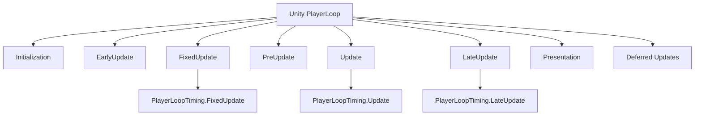
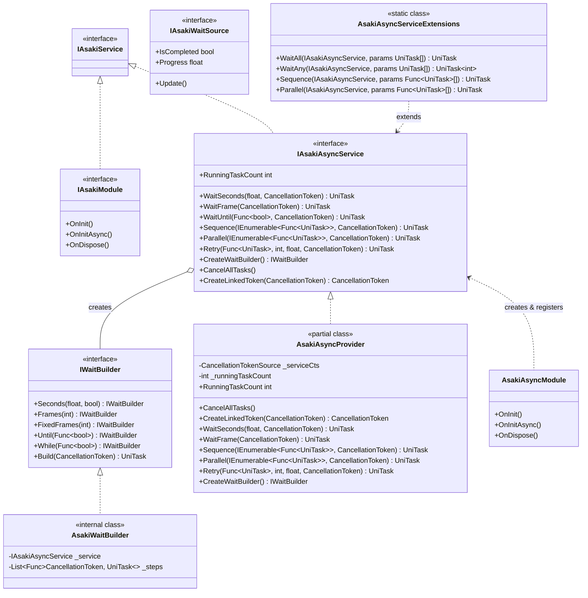
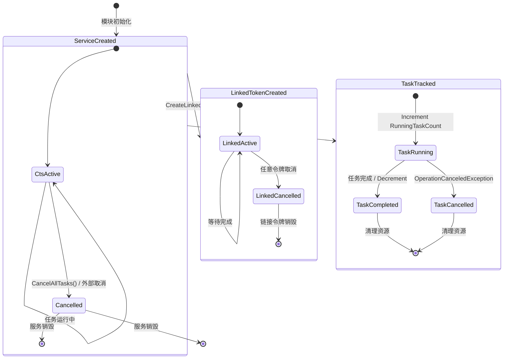
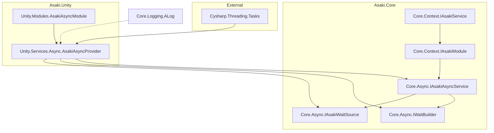

# Asaki Core/Async 模块架构文档

## 目录

1. [设计理念](#1-设计理念-design-philosophy)
2. [软件架构](#2-软件架构-software-architecture)
3. [API 参考](#3-api-参考-api-reference)
4. [好的示例](#4-好的示例-good-examples)
5. [坏的示例](#5-坏的示例-bad-examples)

---

## 1. 设计理念 (Design Philosophy)

### 1.1 为什么选择 UniTask 而非传统 Task

在 Unity 开发中，传统的 `System.Threading.Tasks` 存在几个关键问题：

| 特性 | System.Threading.Task | UniTask |
|------|------------------------|---------|
| 内存分配 | 每次创建 Task 都有堆分配 | 零分配（ValueTask 模式） |
| Unity 集成 | 需要 ConfigureAwait | 原生集成 PlayerLoop |
| 帧同步 | 可能跨多帧执行 | 可精确控制执行时机 |
| 线程上下文 | 依赖 .NET 线程池 | 可在主线程执行 |

**UniTask 的核心优势：**

1. **零分配异步**：UniTask 是 struct 类型，避免了 Task 的堆分配开销
2. **PlayerLoop 集成**：直接嵌入 Unity 的更新循环，避免协程与 Task 混用的复杂性
3. **精确的时间控制**：支持 `PlayerLoopTiming.Update`、`FixedUpdate`、`LateUpdate` 等
4. **CancellationToken 一致性**：统一的取消机制，与 Unity 生命周期完美配合

### 1.2 与 Unity PlayerLoop 集成的设计动机

Unity 的游戏循环由多个阶段组成：



**设计动机：**

1. **帧精确同步**：异步操作必须在正确的时机执行，确保游戏逻辑的一致性
2. **物理同步**：物理计算在 FixedUpdate 进行，等待操作需要在同一时机检查
3. **渲染同步**：LateUpdate 确保所有游戏逻辑完成后再进行渲染
4. **避免竞态条件**：通过 PlayerLoopTiming 避免多线程访问 Unity API 的问题

### 1.3 任务跟踪和资源管理策略

Asaki Async 模块采用以下策略确保资源安全：

1. **引用计数跟踪**：`RunningTaskCount` 属性实时反映正在运行的任务数量
2. **统一取消机制**：通过 `CancellationTokenSource` 管理所有任务的取消
3. **链接取消令牌**：支持外部令牌链接，实现精细化的取消控制
4. **自动资源释放**：IDisposable 实现确保资源正确释放

---

## 2. 软件架构 (Software Architecture)

### 2.1 架构分层

```
┌─────────────────────────────────────────────────────────────┐
│                      调用层 (User Code)                      │
│  MonoBehaviour / System / 其他模块                           │
└─────────────────────────────────────────────────────────────┘
                              │
                              ▼
┌─────────────────────────────────────────────────────────────┐
│                     扩展方法层 (Extensions)                    │
│  AsakiAsyncServiceExtensions (Asaki.Unity.Services.Async)    │
└─────────────────────────────────────────────────────────────┘
                              │
                              ▼
┌─────────────────────────────────────────────────────────────┐
│                    服务接口层 (Core Interfaces)               │
│  IAsakiAsyncService / IWaitBuilder / IAsakiWaitSource       │
└─────────────────────────────────────────────────────────────┘
                              │
                              ▼
┌─────────────────────────────────────────────────────────────┐
│                  服务实现层 (Unity Implementation)            │
│  AsakiAsyncProvider (Core / Time / Tasks)                   │
└─────────────────────────────────────────────────────────────┘
                              │
                              ▼
┌─────────────────────────────────────────────────────────────┐
│                   依赖库层 (External Dependencies)            │
│  Cysharp.Threading.Tasks (UniTask)                           │
└─────────────────────────────────────────────────────────────┘
```

### 2.2 核心类图和继承关系



### 2.3 CancellationToken 生命周期管理



**关键设计点：**

1. **服务级 CTS** (`_serviceCts`)：管理整个服务生命周期的取消
2. **链接令牌** (`CreateLinkedToken`)：支持外部取消令牌的级联取消
3. **任务追踪** (`Track` 方法)：原子计数确保 RunningTaskCount 准确
4. **安全释放** (`Dispose`)：确保服务销毁时取消所有挂起的任务

### 2.4 模块依赖关系



---

## 3. API 参考 (API Reference)

> **命名空间**: `Asaki.Core.Async`
> 
> 所有核心异步接口和类都位于 `Asaki.Core.Async` 命名空间下。

### 3.1 IAsakiAsyncService 完整 API

#### 3.1.1 时间等待方法

| 方法名 | 描述 | 参数 | 返回值 | 异常 |
|--------|------|------|--------|------|
| `WaitSeconds` | 等待指定秒数（缩放时间） | `seconds`: 秒数<br>`token`: 取消令牌 | `UniTask` | OperationCanceledException |
| `WaitSecondsUnscaled` | 等待指定秒数（不缩放时间） | `seconds`: 秒数<br>`token`: 取消令牌 | `UniTask` | OperationCanceledException |
| `WaitFrame` | 等待下一帧 | `token`: 取消令牌 | `UniTask` | OperationCanceledException |
| `WaitFrames` | 等待指定帧数 | `count`: 帧数<br>`token`: 取消令牌 | `UniTask` | OperationCanceledException |
| `WaitFixedFrame` | 等待下一个 FixedUpdate | `token`: 取消令牌 | `UniTask` | OperationCanceledException |
| `WaitFixedFrames` | 等待指定 FixedUpdate 帧数 | `count`: 帧数<br>`token`: 取消令牌 | `UniTask` | OperationCanceledException |

#### 3.1.2 条件等待方法

| 方法名 | 描述 | 参数 | 返回值 | 异常 |
|--------|------|------|--------|------|
| `WaitUntil` | 等待条件为 true | `predicate`: 条件函数<br>`token`: 取消令牌 | `UniTask` | OperationCanceledException |
| `WaitWhile` | 等待条件为 false | `predicate`: 条件函数<br>`token`: 取消令牌 | `UniTask` | OperationCanceledException |
| `WaitUntil` (重载) | 带超时的 WaitUntil | `predicate`: 条件函数<br>`timeoutSeconds`: 超时秒数<br>`token`: 取消令牌 | `UniTask<bool>`: 是否在超时前完成 | OperationCanceledException |
| `WaitWhile` (重载) | 带超时的 WaitWhile | `predicate`: 条件函数<br>`timeoutSeconds`: 超时秒数<br>`token`: 取消令牌 | `UniTask<bool>`: 是否在超时前完成 | OperationCanceledException |

#### 3.1.3 任务执行方法

| 方法名 | 描述 | 参数 | 返回值 | 异常 |
|--------|------|------|--------|------|
| `RunTask` | 执行异步任务（跟踪） | `taskFunc`: 异步函数<br>`token`: 取消令牌 | `UniTask` | OperationCanceledException |
| `RunTask<T>` | 执行异步任务并返回结果 | `taskFunc`: 异步函数<br>`token`: 取消令牌 | `UniTask<T>` | OperationCanceledException |
| `DelayedCall` | 延迟执行回调 | `delaySeconds`: 延迟秒数<br>`action`: 回调<br>`token`: 取消令牌<br>`unscaledTime`: 是否不缩放 | `UniTask` | OperationCanceledException |
| `NextFrameCall` | 下一帧执行回调 | `action`: 回调<br>`token`: 取消令牌 | `UniTask` | OperationCanceledException |
| `When` | 条件满足时执行回调 | `condition`: 条件函数<br>`action`: 回调<br>`token`: 取消令牌 | `UniTask` | OperationCanceledException |

#### 3.1.4 任务编排方法

| 方法名 | 描述 | 参数 | 返回值 | 异常 |
|--------|------|------|--------|------|
| `WaitAll` | 等待所有任务完成 | `tasks`: 任务集合<br>`token`: 取消令牌 | `UniTask` | OperationCanceledException |
| `WaitAny` | 等待任一任务完成 | `tasks`: 任务集合<br>`token`: 取消令牌 | `UniTask<int>`: 完成的任务索引 | OperationCanceledException |
| `Sequence` | 顺序执行任务序列 | `actions`: 任务函数集合<br>`token`: 取消令牌 | `UniTask` | OperationCanceledException |
| `Parallel` | 并行执行任务 | `actions`: 任务函数集合<br>`token`: 取消令牌 | `UniTask` | OperationCanceledException |
| `Retry` | 重试执行任务（失败时抛出异常） | `action`: 任务函数<br>`maxRetries`: 最大重试次数<br>`retryDelay`: 重试延迟<br>`token`: 取消令牌 | `UniTask`<br>（成功/失败通过异常传播） | OperationCanceledException |
| `WaitCustom` | 等待自定义数据源 | `waitSource`: 等待源<br>`token`: 取消令牌 | `UniTask` | OperationCanceledException |

#### 3.1.5 生命周期管理

| 方法名 | 描述 | 参数 | 返回值 |
|--------|------|------|--------|
| `CreateWaitBuilder` | 创建链式等待构建器 | 无 | `IWaitBuilder` |
| `CancelAllTasks` | 取消所有正在等待的任务 | 无 | `void` |
| `CreateLinkedToken` | 创建链接的取消令牌 | `externalToken`: 外部令牌 | `CancellationToken` |

#### 3.1.6 属性

| 属性名 | 类型 | 描述 |
|--------|------|------|
| `RunningTaskCount` | `int` | 当前正在运行的异步任务数量 |

### 3.2 IWaitBuilder 链式构建器

```csharp
public interface IWaitBuilder
{
    /// <summary>等待指定秒数（可选不缩放）</summary>
    IWaitBuilder Seconds(float seconds, bool unscaled = false);
    
    /// <summary>等待指定帧数</summary>
    IWaitBuilder Frames(int count);
    
    /// <summary>等待指定 FixedUpdate 帧数</summary>
    IWaitBuilder FixedFrames(int count);
    
    /// <summary>等待条件为 true</summary>
    IWaitBuilder Until(Func<bool> condition);
    
    /// <summary>等待条件为 false</summary>
    IWaitBuilder While(Func<bool> condition);
    
    /// <summary>执行构建的等待链</summary>
    UniTask Build(CancellationToken token = default);
}
```

### 3.3 扩展方法 (AsakiAsyncServiceExtensions)

| 方法名 | 描述 | 参数 | 返回值 |
|--------|------|------|--------|
| `WaitAll` | params 版 WaitAll | `service`: 服务实例<br>`tasks`: 任务数组 | `UniTask` |
| `WaitAny` | params 版 WaitAny | `service`: 服务实例<br>`tasks`: 任务数组 | `UniTask<int>` |
| `Sequence` | params 版 Sequence | `service`: 服务实例<br>`actions`: 任务函数数组 | `UniTask` |
| `Parallel` | params 版 Parallel | `service`: 服务实例<br>`actions`: 任务函数数组 | `UniTask` |

---

## 4. 好的示例 (Good Examples)

### 4.1 基础异步等待

```csharp
using UnityEngine;
using Asaki.Core.Async;
using Asaki.Core.Context;
using Cysharp.Threading.Tasks;

public class AsyncExample : MonoBehaviour
{
    private IAsakiAsyncService _asyncService;

    private void Start()
    {
        // 通过服务容器获取异步服务
        _asyncService = AsakiContext.Get<IAsakiAsyncService>();
        
        // 启动异步操作
        _ = ExecuteAsync();
    }

    private async UniTask ExecuteAsync()
    {
        Debug.Log("开始执行异步操作...");
        
        // 等待 2 秒（缩放时间）
        await _asyncService.WaitSeconds(2f);
        Debug.Log("已等待 2 秒");
        
        // 等待 3 帧
        await _asyncService.WaitFrames(3);
        Debug.Log("已等待 3 帧");
        
        // 使用 UnscaledTime 等待（不受 Time.timeScale 影响）
        await _asyncService.WaitSecondsUnscaled(1f);
        Debug.Log("已等待 1 秒（不缩放）");
        
        Debug.Log("异步操作完成");
    }
}
```

### 4.2 任务编排示例

```csharp
using UnityEngine;
using Asaki.Core.Async;
using Asaki.Core.Context;
using Cysharp.Threading.Tasks;
using System.Collections.Generic;

public class TaskOrchestrationExample : MonoBehaviour
{
    private IAsakiAsyncService _asyncService;

    private void Start()
    {
        _asyncService = AsakiContext.Get<IAsakiAsyncService>();
        _ = RunDemoAsync();
    }

    private async UniTask RunDemoAsync()
    {
        // 示例 1: 顺序执行 (Sequence)
        Debug.Log("=== Sequence 示例 ===");
        await _asyncService.Sequence(new[]
        {
            () => DoTask("Step 1"),
            () => DoTask("Step 2"),
            () => DoTask("Step 3")
        });
        Debug.Log("Sequence 完成");

        // 示例 2: 并行执行 (Parallel)
        Debug.Log("=== Parallel 示例 ===");
        await _asyncService.Parallel(new[]
        {
            () => DoTask("Task A"),
            () => DoTask("Task B"),
            () => DoTask("Task C")
        });
        Debug.Log("Parallel 完成");

        // 示例 3: 等待任意一个完成 (WaitAny)
        Debug.Log("=== WaitAny 示例 ===");
        var tasks = new List<UniTask>
        {
            _asyncService.WaitSeconds(5f),  // 5 秒
            _asyncService.WaitSeconds(2f),  // 2 秒
            _asyncService.WaitSeconds(3f)    // 3 秒
        };
        int completedIndex = await _asyncService.WaitAny(tasks);
        Debug.Log($"最早完成的任务索引: {completedIndex}");

        // 示例 4: 重试机制 (Retry)
        Debug.Log("=== Retry 示例 ===");
        await TryWithRetry();
        Debug.Log("重试流程完成");
    }

    private async UniTask DoTask(string name)
    {
        Debug.Log($"开始: {name}");
        await _asyncService.WaitSeconds(0.5f);
        Debug.Log($"完成: {name}");
    }

    private async UniTask TryWithRetry()
    {
        int attempt = 0;
        await _asyncService.Retry(async () =>
        {
            attempt++;
            Debug.Log($"尝试 #{attempt}");
            if (attempt < 3)
            {
                throw new System.Exception("模拟失败");
            }
            Debug.Log("操作成功!");
        }, maxRetries: 3, retryDelay: 0.5f);
    }
}
```

### 4.3 CancellationToken 使用

```csharp
using UnityEngine;
using Asaki.Core.Async;
using Asaki.Core.Context;
using Cysharp.Threading.Tasks;
using System.Threading;

public class CancellationExample : MonoBehaviour
{
    private IAsakiAsyncService _asyncService;
    private CancellationTokenSource _externalCts;

    private void Start()
    {
        _asyncService = AsakiContext.Get<IAsakiAsyncService>();
        
        // 启动带外部取消的操作
        _externalCts = new CancellationTokenSource();
        _ = RunWithCancellationAsync(_externalCts.Token);
        
        // 5 秒后自动取消
        _ = DelayedCancelAsync();
    }

    private async UniTask RunWithCancellationAsync(CancellationToken token)
    {
        try
        {
            Debug.Log("开始可取消的操作...");
            
            // 使用链接令牌
            var linkedToken = _asyncService.CreateLinkedToken(token);
            
            for (int i = 0; i < 10; i++)
            {
                await _asyncService.WaitSeconds(1f, linkedToken);
                Debug.Log($"进度: {i + 1}/10");
            }
            
            Debug.Log("操作完成");
        }
        catch (OperationCanceledException)
        {
            Debug.Log("操作已被取消");
        }
    }

    private async UniTask DelayedCancelAsync()
    {
        await _asyncService.WaitSeconds(5f);
        Debug.Log("触发取消...");
        _externalCts.Cancel();
    }

    private void OnDestroy()
    {
        // 重要：确保取消外部 CTS 并释放资源
        _externalCts?.Cancel();
        _externalCts?.Dispose();
    }
}
```

### 4.4 链式构建器示例

```csharp
using UnityEngine;
using Asaki.Core.Async;
using Asaki.Core.Context;
using Cysharp.Threading.Tasks;

public class WaitBuilderExample : MonoBehaviour
{
    private IAsakiAsyncService _asyncService;
    private bool _someCondition = false;

    private void Start()
    {
        _asyncService = AsakiContext.Get<IAsakiAsyncService>();
        _ = RunComplexWaitAsync();
        
        // 3 秒后设置条件为 true
        _ = SetConditionAsync();
    }

    private async UniTask RunComplexWaitAsync()
    {
        Debug.Log("开始复杂的等待链...");
        
        await _asyncService.CreateWaitBuilder()
            .Seconds(1f)           // 等待 1 秒
            .Frames(30)            // 等待 30 帧
            .Until(() => _someCondition)  // 等待条件满足
            .Seconds(0.5f, true); // 再等待 0.5 秒（不缩放）
        
        Debug.Log("等待链完成!");
    }

    private async UniTask SetConditionAsync()
    {
        await _asyncService.WaitSeconds(3f);
        _someCondition = true;
        Debug.Log("条件已设置为 true");
    }
}
```

---

## 5. 坏的示例 (Bad Examples)

### 5.1 常见错误用法

#### 错误 1: 忘记处理取消令牌

```csharp
// 错误示例：没有传递 CancellationToken
public async UniTask BadExample1()
{
    var asyncService = AsakiContext.Get<IAsakiAsyncService>();
    
    // 危险：无法取消这个等待
    await asyncService.WaitSeconds(100f);
    
    // 正确做法：始终接受 CancellationToken 参数
    // await asyncService.WaitSeconds(100f, someToken);
}
```

#### 错误 2: 不恰当的 PlayerLoopTiming

```csharp
// 错误示例：在 FixedUpdate 中等待缩放时间
public async UniTask BadExample2()
{
    var asyncService = AsakiContext.Get<IAsakiAsyncService>();
    
    // 建议：物理相关逻辑应该使用 WaitFixedFrame/WaitFixedFrames
    // 而不是 WaitSeconds，因为 WaitSeconds 默认在 Update 时机执行
    // 这样可以避免物理计算与等待逻辑不同步的问题
    
    // 正确做法：
    await asyncService.WaitFixedFrame(); // 等待下一个物理帧
}
```

#### 错误 3: 混用协程和 UniTask

```csharp
// 错误示例：混用协程和 UniTask
public class BadExample3 : MonoBehaviour
{
    private async void Start()
    {
        var asyncService = AsakiContext.Get<IAsakiAsyncService>();
        
        // 危险：混用协程和异步方法会导致执行顺序不确定
        StartCoroutine(BadCoroutine());
        await asyncService.WaitSeconds(1f);
    }

    private IEnumerator BadCoroutine()
    {
        yield return new WaitForSeconds(1f);
        // 这里的执行时机不确定
    }
    
    // 正确做法：统一使用 UniTask
    private async UniTask CorrectApproach()
    {
        var asyncService = AsakiContext.Get<IAsakiAsyncService>();
        await asyncService.WaitSeconds(1f);
    }
}
```

### 5.2 资源泄漏

#### 错误 4: 没有释放 CancellationTokenSource

```csharp
// 错误示例：创建 CTS 但不释放
public class BadExample4 : MonoBehaviour
{
    private async void Start()
    {
        var asyncService = AsakiContext.Get<IAsakiAsyncService>();
        
        // 危险：每次调用都创建新的 CTS 但从不释放
        var cts = new CancellationTokenSource();
        await asyncService.WaitSeconds(10f, cts.Token);
        
        // 正确做法：使用 using 语句或手动释放
        // using var cts = new CancellationTokenSource();
    }
}
```

#### 错误 5: 任务未跟踪导致 RunningTaskCount 不准确

```csharp
// 错误示例：直接调用 UniTask 方法，绕过跟踪
public class BadExample5 : MonoBehaviour
{
    private async void Start()
    {
        // 危险：绕过了 AsakiAsyncProvider 的任务跟踪
        // RunningTaskCount 不会反映这些任务
        await UniTask.Delay(5000);  // 危险！
        
        // 正确做法：使用服务方法
        // var asyncService = AsakiContext.Get<IAsakiAsyncService>();
        // await asyncService.WaitSeconds(5f);
    }
}
```

#### 错误 6: 在 OnDestroy 中没有取消任务

```csharp
// 错误示例：组件销毁时没有取消异步操作
public class BadExample6 : MonoBehaviour
{
    private async void Start()
    {
        var asyncService = AsakiContext.Get<IAsakiAsyncService>();
        
        // 危险：如果组件被销毁，异步操作可能继续运行
        // 导致访问已销毁的 MonoBehaviour
        while (true)
        {
            await asyncService.WaitSeconds(1f);
            // 组件已销毁时这里会报错
            transform.position = Vector3.zero;
        }
    }
}

// 正确做法：使用 CancellationToken 正确管理生命周期
public class BadExample6Corrected : MonoBehaviour
{
    private IAsakiAsyncService _asyncService;
    private CancellationTokenSource _cts;
    
    private void Start()
    {
        _asyncService = AsakiContext.Get<IAsakiAsyncService>();
        
        // 正确做法1：创建与组件生命周期绑定的 CTS
        _cts = new CancellationTokenSource(this);
        
        // 正确做法2：使用 MonoBehaviour 销毁时的取消令牌
        RunAsync(_cts.Token);
    }

    private async void RunAsync(CancellationToken ct)
    {
        try
        {
            while (!ct.IsCancellationRequested)
            {
                await _asyncService.WaitSeconds(1f, ct);
                if (!this) return;  // 检查对象是否有效
                transform.position = Vector3.zero;
            }
        }
        catch (OperationCanceledException)
        {
            // 正常取消，忽略异常
        }
    }
    
    private void OnDestroy()
    {
        // 重要：组件销毁时取消所有异步操作
        _cts?.Cancel();
        _cts?.Dispose();
    }
}
```

### 5.3 性能陷阱

#### 错误 7: 在 Update 中创建大量任务

```csharp
// 错误示例：每帧创建新任务
public class BadExample7 : MonoBehaviour
{
    private IAsakiAsyncService _asyncService;

    private void Update()
    {
        // 危险：每帧创建新任务导致 GC 压力
        _ = _asyncService.WaitSeconds(0.1f);
        
        // 正确做法：复用任务或使用对象池
    }
}
```

#### 错误 8: 无限等待没有超时

```csharp
// 错误示例：无限等待条件
public class BadExample8 : MonoBehaviour
{
    private async void Start()
    {
        var asyncService = AsakiContext.Get<IAsakiAsyncService>();
        
        // 危险：可能永远无法满足条件
        await asyncService.WaitUntil(() => SomeImpossibleCondition());
        
        // 正确做法：始终使用带超时的版本
        // bool completed = await asyncService.WaitUntil(
        //     () => SomeCondition(), 
        //     timeoutSeconds: 10f
        // );
    }
}
```

#### 错误 9: 不当使用 Parallel 导致过多并发

```csharp
// 错误示例：启动过多并行任务
public class BadExample9 : MonoBehaviour
{
    private async void Start()
    {
        var asyncService = AsakiContext.Get<IAsakiAsyncService>();
        
        // 危险：启动 1000 个并行任务
        var actions = new Func<UniTask>[1000];
        for (int i = 0; i < 1000; i++)
        {
            int index = i;
            actions[index] = () => DoWork(index);
        }
        
        await asyncService.Parallel(actions);  // 危险！
        
        // 正确做法：限制并发数量
        // await ParallelWithLimit(actions, maxConcurrent: 10);
    }
    
    private async UniTask DoWork(int index)
    {
        await UniTask.Delay(100);
    }
}
```

---

## 附录：模块注册信息

### 模块入口类

```csharp
[AsakiModule(100)]
public class AsakiAsyncModule : IAsakiModule
{
    public void OnInit()
    {
        // 创建并注册异步服务
        _asakiAsyncService = new AsakiAsyncProvider();
        AsakiContext.Register(_asakiAsyncService);
    }

    public UniTask OnInitAsync() => UniTask.CompletedTask;
    public void OnDispose() { }
}
```

### 服务获取方式

```csharp
// 方式 1: 通过 AsakiContext
var asyncService = AsakiContext.Get<IAsakiAsyncService>();

// 方式 2: 通过依赖注入（如果使用）
// [Inject] private IAsakiAsyncService _asyncService;
```

---

*文档生成时间: 2026-03-03*
*对应版本: Asaki Unity Framework*
