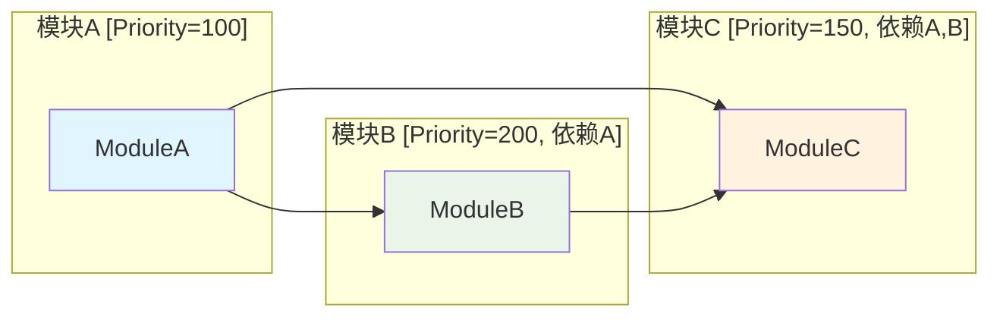
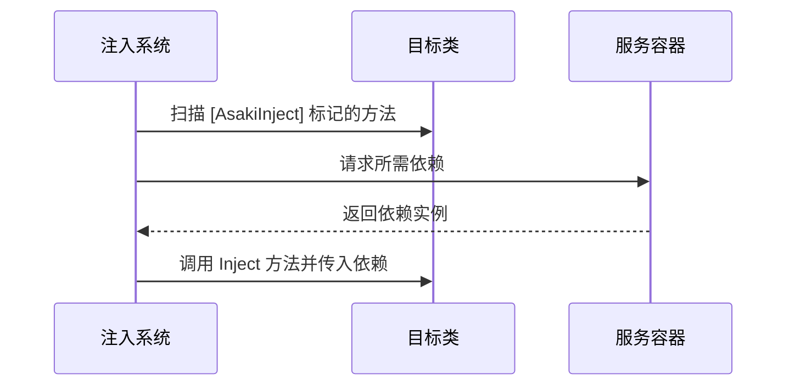

# Asaki Core/Attributes 模块架构文档

## 目录

1. [设计理念](#1-设计理念)
2. [软件架构](#2-软件架构)
3. [API参考](#3-api参考)
4. [好的示例](#4-好的示例)
5. [坏的示例](#5-坏的示例)

---

## 1. 设计理念

### 1.1 特性系统的核心价值

Asaki Attributes 模块是框架的"元编程"基础设施，通过特性（Attribute）实现声明式编程范式。该模块将大量重复性的样板代码转化为声明式标记，大幅提升开发效率：

- **依赖注入声明化**：`AsakiInjectAttribute` 将依赖声明与实现分离，代码更清晰
- **模块化架构**：`AsakiModuleAttribute` 实现声明式模块依赖管理，无需手动处理加载顺序
- **序列化增强**：`AsakiInterfaceAttribute`、`AsakiResourceTypeAttribute` 弥补 Unity 原生序列化对接口和抽象类型的不足
- **自动化代码生成**：UI 构建器、图编辑器等通过特性驱动实现自动化

### 1.2 特性分类体系

Asaki Attributes 按照功能划分为五大类别：

| 类别 | 特性 | 核心职责 |
|------|------|----------|
| **依赖注入** | `AsakiInjectAttribute` | 标记需要注入的方法 |
| **模块系统** | `AsakiModuleAttribute` | 声明模块及依赖关系 |
| **数据配置** | `AsakiConfigAttribute` | 标记配置表元数据 |
| **序列化增强** | `AsakiInterfaceAttribute`<br>`AsakiResourceTypeAttribute` | 增强 Unity 序列化能力 |
| **扩展特性** | `AsakiBindAttribute`<br>`AsakiMigrationAttribute`<br>`AsakiUIBuilderAttribute` | 支撑特定领域功能 |

### 1.3 设计原则

1. **单一职责**：每个特性只负责一项功能，避免功能耦合
2. **声明式优于命令式**：通过标记声明意图，由框架在运行时处理具体实现
3. **编译时安全**：尽可能在编译期或初始化时验证特性使用错误
4. **零运行时开销**（大部分特性）：特性本身仅作为元数据，不增加运行时性能开销

---

## 2. 软件架构

### 2.1 模块结构概览

```mermaid
graph TB
    subgraph "特性定义层 Attributes"
        DI[AsakiInjectAttribute]
        MB[AsakiModuleAttribute]
        CF[AsakiConfigAttribute]
        IF[AsakiInterfaceAttribute]
        RT[AsakiResourceTypeAttribute]
        BN[AsakiBindAttribute]
        MG[AsakiMigrationAttribute]
        UI[AsakiUIBuilderAttribute]
        GE[AsakiCustomGraphEditorAttribute]
        GC[AsakiGraphContextAttribute]
        NL[ANullAttribute]
    end

    subgraph "序列化支持 Serialization"
        SA[AsakiSaveAttribute]
        SM[AsakiSaveMemberAttribute]
    end

    subgraph "消费层 Consumers"
        CI[依赖注入系统]
        CM[模块加载器]
        CS[配置系统]
        UE[Unity Inspector]
        UG[图编辑器]
    end

    DI --> CI
    MB --> CM
    CF --> CS
    IF --> UE
    RT --> UE
    BN --> CI
    UI --> UG
    GE --> UG
    GC --> UG
    NL --> CI
    SA --> CS
    SM --> CS
```



### 2.2 特性类图

```mermaid
classDiagram
    class Attribute {
        <<abstract>>
    }

    class AsakiInjectAttribute {
        <<sealed>>
    }

    class AsakiModuleAttribute {
        +int Priority
        +Type[] Dependencies
        +bool Optional
        +int TimeoutMs
    }

    class AsakiConfigAttribute {
        +AsakiConfigLoadStrategy LoadStrategy
        +int Priority
        +bool Unloadable
        +Type[] Dependencies
    }

    class AsakiInterfaceAttribute {
        +Type InterfaceType
    }

    class AsakiResourceTypeAttribute {
    }

    class AsakiBindAttribute {
    }

    class AsakiMigrationAttribute {
        +Type DataType
        +int FromVersion
        +int ToVersion
    }

    class AsakiUIBuilderAttribute {
        +AsakiUIWidgetType Type
        +string Name
        +string Parent
        +string CustomPrefab
        +int Order
    }

    class AsakiCustomGraphEditorAttribute {
        +Type GraphType
    }

    class AsakiGraphContextAttribute {
        +Type GraphType
        +string Path
    }

    class ANullAttribute {
    }

    class AsakiSaveAttribute {
        +int Version
    }

    class AsakiSaveMemberAttribute {
        +string Key
        +int Order
    }

    Attribute <|-- AsakiInjectAttribute
    Attribute <|-- AsakiModuleAttribute
    Attribute <|-- AsakiConfigAttribute
    Attribute <|-- AsakiInterfaceAttribute
    Attribute <|-- AsakiResourceTypeAttribute
    Attribute <|-- AsakiBindAttribute
    Attribute <|-- AsakiMigrationAttribute
    Attribute <|-- AsakiUIBuilderAttribute
    Attribute <|-- AsakiCustomGraphEditorAttribute
    Attribute <|-- AsakiGraphContextAttribute
    Attribute <|-- ANullAttribute
    Attribute <|-- AsakiSaveAttribute
    Attribute <|-- AsakiSaveMemberAttribute
```



### 2.3 核心特性详情

#### AsakiModuleAttribute 模块特性

模块特性是 Asaki 架构的核心，定义了模块的启动顺序和依赖关系：



**关键设计点**：

- 依赖关系永远优先于优先级：即使模块 C 优先级更高（150 < 200），也会等待模块 B 初始化完成
- 可选模块机制：设置 `Optional = true` 后，初始化失败不会阻止系统启动
- 超时控制：防止某个模块卡死导致整个系统无法启动

#### AsakiInjectAttribute 注入特性

配合 `IAsakiInject<T>` 接口实现依赖注入：



### 2.4 命名空间组织

```
Asaki.Core.Attributes
├── 核心注入特性
│   ├── AsakiInjectAttribute.cs
│   └── ANullAttribute.cs
├── 模块系统特性
│   └── AsakiModuleAttribute.cs
├── 配置系统特性
│   ├── AsakiConfigAttribute.cs
│   └── AsakiSerializationAttributes.cs
├── 序列化增强特性
│   ├── AsakiInterfaceAttribute.cs
│   └── AsakiResourceTypeAttribute.cs
├── 数据绑定特性
│   └── AsakiBindAttribute.cs
├── 数据迁移特性
│   └── AsakiMigrationAttribute.cs
├── UI 构建特性
│   └── AsakiUIBuilderAttribute.cs
├── 图编辑器特性
│   ├── AsakiCustomGraphEditorAttribute.cs
│   └── AsakiGraphContextAttribute.cs
└── 模式特性
    └── AsakiSchemaAttribute.cs
```

---

## 3. API参考

### 3.1 AsakiInjectAttribute

依赖注入方法标记特性。

| 属性 | 值 |
|------|-----|
| `AttributeUsage` | `Method, Inherited = false, AllowMultiple = false` |
| 命名空间 | `Asaki.Core.Attributes` |

**使用说明**：

标记在方法上，配合 `IAsakiInject<T>` 接口使用。框架会自动调用该方法并注入声明的依赖。

---

### 3.2 AsakiModuleAttribute

模块声明特性。

| 属性 | 类型 | 默认值 | 描述 |
|------|------|--------|------|
| `Priority` | `int` | 1000 | 启动优先级，值越小越早初始化 |
| `Dependencies` | `Type[]` | `Array.Empty<Type>()` | 强依赖列表 |
| `Optional` | `bool` | false | 是否为可选模块 |
| `TimeoutMs` | `int` | 30000 | 超时时间（毫秒） |

| 构造方法 | 描述 |
|----------|------|
| `AsakiModuleAttribute(int priority = 1000, params Type[] dependencies)` | 创建模块特性实例 |

---

### 3.3 AsakiConfigAttribute

配置表元数据标记特性。

| 属性 | 类型 | 默认值 | 描述 |
|------|------|--------|------|
| `LoadStrategy` | `AsakiConfigLoadStrategy` | Auto | 加载策略 |
| `Priority` | `int` | 0 | 优先级（越高越先加载） |
| `Unloadable` | `bool` | true | 是否允许卸载 |
| `Dependencies` | `Type[]` | null | 依赖的其他配置表 |

---

### 3.4 AsakiInterfaceAttribute

接口序列化标记特性（继承自 `UnityEngine.PropertyAttribute`）。

| 属性 | 类型 | 描述 |
|------|------|------|
| `InterfaceType` | `Type` | 要显示的接口类型 |

| 构造方法 | 描述 |
|----------|------|
| `AsakiInterfaceAttribute(Type interfaceType)` | 创建接口序列化标记 |

**使用注意**：

- 需配合 `[SerializeReference]` 使用
- 在 Inspector 中显示接口实现的下拉选择列表

---

### 3.5 AsakiResourceTypeAttribute

资源类型序列化标记特性（继承自 `UnityEngine.PropertyAttribute`）。

| 属性 | 值 |
|------|-----|
| `AttributeUsage` | `Field` |
| 命名空间 | `Asaki.Core.Attributes` |

---

### 3.6 AsakiBindAttribute

绑定类标记特性。

| 属性 | 值 |
|------|-----|
| `AttributeUsage` | `Class, Inherited = false, AllowMultiple = false` |

**重要**：标记的类必须为 `partial` 类。

---

### 3.7 AsakiMigrationAttribute

数据迁移类标记特性。

| 属性 | 类型 | 描述 |
|------|------|------|
| `DataType` | `Type` | 迁移适用的数据类型 |
| `FromVersion` | `int` | 源版本号 |
| `ToVersion` | `int` | 目标版本号 |

| 构造方法 | 描述 |
|----------|------|
| `AsakiMigrationAttribute(Type dataType, int FromVersion, int ToVersion)` | 创建迁移特性实例 |

---

### 3.8 AsakiUIBuilderAttribute

UI 组件标记特性。

| 属性 | 类型 | 默认值 | 描述 |
|------|------|--------|------|
| `Type` | `AsakiUIWidgetType` | - | 组件类型 |
| `Name` | `string` | null | 生成的游戏物体名称 |
| `Parent` | `string` | null | 父级路径 |
| `CustomPrefab` | `string` | null | 自定义预制体名称（只读，只能通过构造函数传入） |
| `Order` | `int` | 0 | 生成顺序 |

**AsakiUIWidgetType 枚举值**：

| 值 | 描述 |
|-----|------|
| `Container` | 空容器 (RectTransform) |
| `Text` | 文本 (Legacy) |
| `TextMeshPro` | TextMeshPro |
| `Button` | 按钮 |
| `Image` | 图片 |
| `InputField` | 输入框 |
| `Dropdown` | 下拉菜单 |
| `ScrollView` | 滚动视图 |
| `Slider` | 滑动条 |
| `Toggle` | 开关 |
| `Custom` | 自定义（需指定 Prefab） |

---

### 3.9 AsakiCustomGraphEditorAttribute

自定义图编辑器标记特性。

| 属性 | 类型 | 描述 |
|------|------|------|
| `GraphType` | `Type` | 关联的图数据模型类型 |

| 构造方法 | 描述 |
|----------|------|
| `AsakiCustomGraphEditorAttribute(Type graphType)` | 创建图编辑器特性实例 |

**异常情况**：

- `ArgumentNullException`: graphType 为 null
- `ArgumentException`: graphType 不是 AsakiGraphAsset 的派生类型

---

### 3.10 AsakiGraphContextAttribute

图资产上下文标记特性。

| 属性 | 类型 | 描述 |
|------|------|------|
| `GraphType` | `Type` | 图类型 |
| `Path` | `string` | 路径 |

---

### 3.11 ANullAttribute

可空依赖标记特性。

| 属性 | 值 |
|------|-----|
| `AttributeUsage` | `Parameter, AllowMultiple = false` |

**使用说明**：

标记注入方法的参数为可空依赖。当使用 `[ANull]` 标记参数时，如果依赖在容器中不存在，会注入 null 而非抛出异常。

---

### 3.12 AsakiSaveAttribute / AsakiSaveMemberAttribute

序列化保存标记特性。

#### AsakiSaveAttribute

| 属性 | 类型 | 默认值 | 描述 |
|------|------|--------|------|
| `Version` | `int` | 1 | 版本号（用于版本控制） |

#### AsakiSaveMemberAttribute

| 属性 | 类型 | 默认值 | 描述 |
|------|------|--------|------|
| `Key` | `string` | null | 序列化时的 Key |
| `Order` | `int` | 0 | 排序顺序 |

---

## 4. 好的示例

### 4.1 基础依赖注入使用

```csharp
using Asaki.Core.Attributes;
using Asaki.Core.Context;
using Cysharp.Threading.Tasks;
using UnityEngine;

/// <summary>
/// 示例服务类
/// </summary>
public class ExampleService : MonoBehaviour, IAsakiService
{
    public void DoSomething()
    {
        Debug.Log("ExampleService working");
    }
}

/// <summary>
/// 使用依赖注入的示例类
/// </summary>
public class ConsumerExample : AsakiMono, IAsakiInject<ConsumerExample>
{
    // 私有字段存储依赖
    private IAsakiPoolService _poolService;
    private ExampleService _exampleService;

    /// <summary>
    /// 使用 AsakiInject 标记注入方法
    /// </summary>
    [AsakiInject]
    public void Inject(
        IAsakiPoolService poolService,
        [ANull] ExampleService exampleService // 可空依赖
    )
    {
        _poolService = poolService;
        _exampleService = exampleService;
    }

    protected override void OnStart()
    {
        // 依赖已注入，可以安全使用
        _poolService?.GetType();
        if (_exampleService != null)
        {
            _exampleService.DoSomething();
        }
    }
}
```

### 4.2 模块依赖声明示例

```csharp
using Asaki.Core.Attributes;
using Asaki.Core.Context;
using Cysharp.Threading.Tasks;
using UnityEngine;

/// <summary>
/// 基础模块 - 无依赖
/// </summary>
[AsakiModule(priority: 100)]
public class CoreModule : MonoBehaviour, IAsakiModule
{
    public void OnInit()
    {
        Debug.Log("CoreModule initialized");
    }
}

/// <summary>
/// 依赖 CoreModule 的服务模块
/// </summary>
[AsakiModule(priority: 200, dependencies: new[] { typeof(CoreModule) })]
public class ServiceModule : MonoBehaviour, IAsakiModule
{
    public void OnInit()
    {
        Debug.Log("ServiceModule initialized after CoreModule");
    }
}

/// <summary>
/// 可选模块 - 初始化失败不会阻止系统启动
/// </summary>
[AsakiModule(priority: 300, dependencies: new[] { typeof(ServiceModule) }, optional: true)]
public class OptionalFeatureModule : MonoBehaviour, IAsakiModule
{
    public void OnInit()
    {
        // 如果初始化失败，系统仍可继续启动
        Debug.Log("OptionalFeatureModule initialized");
    }
}
```

### 4.3 接口序列化示例

```csharp
using Asaki.Core.Attributes;
using UnityEngine;

/// <summary>
/// 示例接口
/// </summary>
public interface IDataProcessor
{
    void Process(string data);
}

/// <summary>
/// 接口实现A
/// </summary>
public class StringProcessor : IDataProcessor
{
    public void Process(string data)
    {
        Debug.Log($"Processing string: {data}");
    }
}

/// <summary>
/// 接口实现B
/// </summary>
public class JsonProcessor : IDataProcessor
{
    public void Process(string data)
    {
        Debug.Log($"Processing JSON: {data}");
    }
}

/// <summary>
/// 使用接口序列化的类
/// </summary>
public class DataManager : MonoBehaviour
{
    // 使用 AsakiInterfaceAttribute 在 Inspector 中选择接口实现
    [SerializeReference]
    [AsakiInterface(typeof(IDataProcessor))]
    private IDataProcessor _processor;
}
```

### 4.4 UI 构建器示例

```csharp
using Asaki.Core.Attributes;
using Asaki.Core.UI;
using UnityEngine;
using UnityEngine.UI;

/// <summary>
/// 使用 UI 构建器的窗口
/// </summary>
public class SampleUIWindow : AsakiMono
{
    // 自动生成按钮
    [AsakiUIBuilder(AsakiUIWidgetType.Button, Name = "ConfirmButton", Parent = "Content")]
    private Button _confirmButton;

    // 自动生成图片
    [AsakiUIBuilder(AsakiUIWidgetType.Image, Name = "Icon", Parent = "Content/Header")]
    private Image _icon;

    // 自动生成 TextMeshPro
    [AsakiUIBuilder(AsakiUIWidgetType.TextMeshPro, Name = "TitleText", Parent = "Content/Header")]
    private TMPro.TMP_Text _titleText;

    // 自动生成滚动视图
    [AsakiUIBuilder(AsakiUIWidgetType.ScrollView, Name = "ScrollView", Parent = "Content")]
    private ScrollRect _scrollView;

    protected override void OnStart()
    {
        // UI 元素已自动生成，可以直接使用
        _confirmButton.onClick.AddListener(OnConfirmClicked);
    }

    private void OnConfirmClicked()
    {
        Debug.Log("Confirm clicked");
    }
}
```

### 4.5 图编辑器注册示例

```csharp
using Asaki.Core.Attributes;
using Asaki.Core.Graphs;
using UnityEngine;

/// <summary>
/// 自定义图资产
/// </summary>
[AsakiGraphContext(typeof(BehaviorTreeGraph), "Assets/Graphs/BehaviorTrees")]
public class BehaviorTreeGraph : AsakiGraphAsset
{
    // 行为树特定数据
}

// 在 Editor 程序集中使用
#if UNITY_EDITOR
namespace MyGame.Editor
{
    /// <summary>
    /// 自定义图编辑器
    /// </summary>
    [AsakiCustomGraphEditor(typeof(BehaviorTreeGraph))]
    public class BehaviorTreeGraphEditor : AsakiGraphEditorWindow
    {
        protected override void OnGraphLoaded()
        {
            // 自定义行为树节点视图创建逻辑
            Debug.Log("Behavior Tree Editor loaded");
        }
    }
}
#endif
```

### 4.6 数据迁移示例

```csharp
using Asaki.Core.Attributes;
using System;

/// <summary>
/// 玩家数据（版本1）
/// </summary>
[AsakiSave(1)]
public class PlayerDataV1
{
    public string Name;
    public int Level;
}

/// <summary>
/// 玩家数据（版本2）
/// </summary>
[AsakiSave(2)]
public class PlayerDataV2
{
    public string Name;
    public int Level;
    public long Experience; // 新增字段
}

/// <summary>
/// 从V1到V2的迁移
/// </summary>
[AsakiMigration(typeof(PlayerDataV2), fromVersion: 1, toVersion: 2)]
public class PlayerDataMigrationV1ToV2 : IAsakiMigration<PlayerDataV2>
{
    public void Migrate(PlayerDataV2 data)
    {
        // V1 数据字段映射
        data.Experience = data.Level * 100; // 根据等级计算经验
    }
}
```

---

## 5. 坏的示例

### 5.1 非 partial 类使用 AsakiBindAttribute

```csharp
// 错误示例：未使用 partial 修饰符
[AsakiBind]
public class BadBindClass
{
    public int Value;
}

// 编译错误：AsakiBindAttribute 要求目标类必须为 partial

// 正确示例
[AsakiBind]
public partial class GoodBindClass
{
    public int Value;
}
```

### 5.2 在非方法上使用 AsakiInjectAttribute

```csharp
// 错误示例：标记在字段上
public class BadInjectClass : MonoBehaviour
{
    [AsakiInject]  // 错误：只能标记方法
    private IAsakiPoolService _poolService;
}

// 正确示例：标记在方法上
public class GoodInjectClass : MonoBehaviour, IAsakiInject<GoodInjectClass>
{
    [AsakiInject]
    public void Inject(IAsakiPoolService poolService)
    {
        // 注入逻辑
    }
}
```

### 5.3 模块循环依赖

```csharp
// 错误示例：循环依赖导致死锁
[AsakiModule(100, dependencies: new[] { typeof(ModuleB) })]
public class ModuleA : MonoBehaviour { }

[AsakiModule(100, dependencies: new[] { typeof(ModuleA) })]
public class ModuleB : MonoBehaviour { }

// 系统无法启动，抛出循环依赖异常

// 正确示例：移除循环依赖
[AsakiModule(100)]
public class ModuleA : MonoBehaviour { }

[AsakiModule(200, dependencies: new[] { typeof(ModuleA) })]
public class ModuleB : MonoBehaviour { }
```

### 5.4 AsakiInterfaceAttribute 未配合 SerializeReference 使用

```csharp
// 错误示例：缺少 SerializeReference
public class BadInterfaceClass : MonoBehaviour
{
    [AsakiInterface(typeof(IDataProcessor))]  // 无效
    private IDataProcessor _processor;  // Unity 不会序列化接口
}

// 正确示例：配合 SerializeReference 使用
public class GoodInterfaceClass : MonoBehaviour
{
    [SerializeReference]
    [AsakiInterface(typeof(IDataProcessor))]
    private IDataProcessor _processor;
}
```

### 5.5 错误的图编辑器类型

```csharp
#if UNITY_EDITOR
// 错误示例：GraphType 不是 AsakiGraphAsset 的子类
[AsakiCustomGraphEditor(typeof(MonoBehaviour))]  // 运行时异常
public class BadGraphEditor : AsakiGraphEditorWindow { }

// 正确示例：确保 GraphType 继承自 AsakiGraphAsset
[AsakiCustomGraphEditor(typeof(BehaviorTreeGraph))]
public class GoodGraphEditor : AsakiGraphEditorWindow { }
#endif
```

### 5.6 UI 构建器使用错误

```csharp
// 错误示例1：Type 为 Custom 时未指定 CustomPrefab
[AsakiUIBuilder(AsakiUIWidgetType.Custom)]  // 缺少预制体名称
private GameObject _customWidget;

// 错误示例2：非 Custom 类型指定了 CustomPrefab
[AsakiUIBuilder(AsakiUIWidgetType.Button, CustomPrefab = "MyButton")]  // 无效
private Button _button;

// 正确示例1：使用标准类型
[AsakiUIBuilder(AsakiUIWidgetType.Button, Name = "MyButton")]
private Button _myButton;

// 正确示例2：使用自定义类型
[AsakiUIBuilder("Custom/PrefabName")]
private GameObject _customWidget;
```

### 5.7 迁移版本号错误

```csharp
// 错误示例：FromVersion 大于或等于 ToVersion
[AsakiMigration(typeof(PlayerDataV2), fromVersion: 2, toVersion: 1)]  // 无效
public class BadMigration : IAsakiMigration<PlayerDataV2>
{
    public void Migrate(PlayerDataV2 data) { }
}

// 正确示例：FromVersion 必须小于 ToVersion
[AsakiMigration(typeof(PlayerDataV2), fromVersion: 1, toVersion: 2)]
public class GoodMigration : IAsakiMigration<PlayerDataV2>
{
    public void Migrate(PlayerDataV2 data)
    {
        data.Experience = data.Level * 100;
    }
}
```

### 5.8 模块优先级设置不当

```csharp
// 错误示例：优先级设置不当导致依赖模块未初始化
[AsakiModule(300)]  // 后初始化
public class BadModule : MonoBehaviour
{
    // 此时依赖的模块可能还未初始化
}

// 正确示例：根据依赖关系合理设置优先级
[AsakiModule(100)]  // 先初始化
public class DependencyModule : MonoBehaviour { }

[AsakiModule(200, dependencies: new[] { typeof(DependencyModule) })]  // 依赖100
public class GoodModule : MonoBehaviour { }

---

## 附录

### 相关文件路径

- 依赖注入特性: [AsakiInjectAttribute.cs](file:///e:/Projects/UnityGame/Asaki/Assets/Asaki/Core/Attributes/AsakiInjectAttribute.cs)
- 模块特性: [AsakiModuleAttribute.cs](file:///e:/Projects/UnityGame/Asaki/Assets/Asaki/Core/Attributes/AsakiModuleAttribute.cs)
- 配置特性: [AsakiConfigAttribute.cs](file:///e:/Projects/UnityGame/Asaki/Assets/Asaki/Core/Attributes/AsakiConfigAttribute.cs)
- 接口序列化特性: [AsakiInterfaceAttribute.cs](file:///e:/Projects/UnityGame/Asaki/Assets/Asaki/Core/Attributes/AsakiInterfaceAttribute.cs)
- 资源类型特性: [AsakiResourceTypeAttribute.cs](file:///e:/Projects/UnityGame/Asaki/Assets/Asaki/Core/Attributes/AsakiResourceTypeAttribute.cs)
- 绑定特性: [AsakiBindAttribute.cs](file:///e:/Projects/UnityGame/Asaki/Assets/Asaki/Core/Attributes/AsakiBindAttribute.cs)
- 迁移特性: [AsakiMigrationAttribute.cs](file:///e:/Projects/UnityGame/Asaki/Assets/Asaki/Core/Attributes/AsakiMigrationAttribute.cs)
- UI构建特性: [AsakiUIBuilderAttribute.cs](file:///e:/Projects/UnityGame/Asaki/Assets/Asaki/Core/Attributes/AsakiUIBuilderAttribute.cs)
- 图编辑器特性: [AsakiCustomGraphEditorAttribute.cs](file:///e:/Projects/UnityGame/Asaki/Assets/Asaki/Core/Attributes/AsakiCustomGraphEditorAttribute.cs)
- 图上下文特性: [AsakiGraphContextAttribute.cs](file:///e:/Projects/UnityGame/Asaki/Assets/Asaki/Core/Attributes/AsakiGraphContextAttribute.cs)
- 可空特性: [ANullAttribute.cs](file:///e:/Projects/UnityGame/Asaki/Assets/Asaki/Core/Attributes/ANullAttribute.cs)
- 序列化特性: [AsakiSerializationAttributes.cs](file:///e:/Projects/UnityGame/Asaki/Assets/Asaki/Core/Attributes/AsakiSerializationAttributes.cs)

### 相关接口

- [IAsakiInject.cs](file:///e:/Projects/UnityGame/Asaki/Assets/Asaki/Core/Context/IAsakiInject.cs)
- [IAsakiAutoInject.cs](file:///e:/Projects/UnityGame/Asaki/Assets/Asaki/Core/Context/IAsakiAutoInject.cs)
- [AsakiUIWidgetType.cs](file:///e:/Projects/UnityGame/Asaki/Assets/Asaki/Core/UI/AsakiUIWidgetType.cs)

---

_文档生成时间: 2026-03-03_
