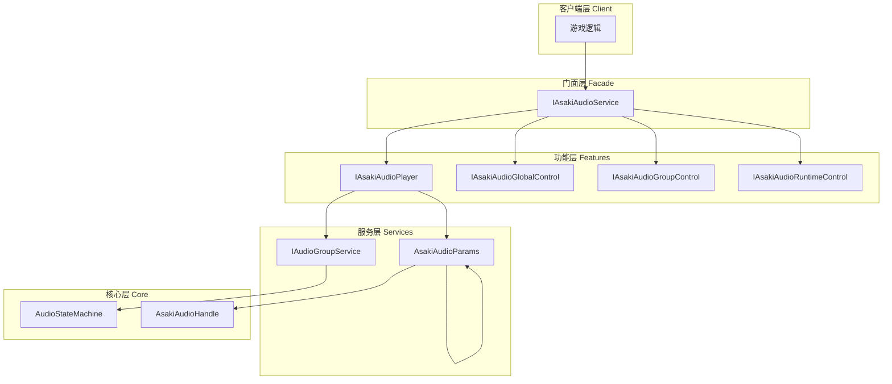
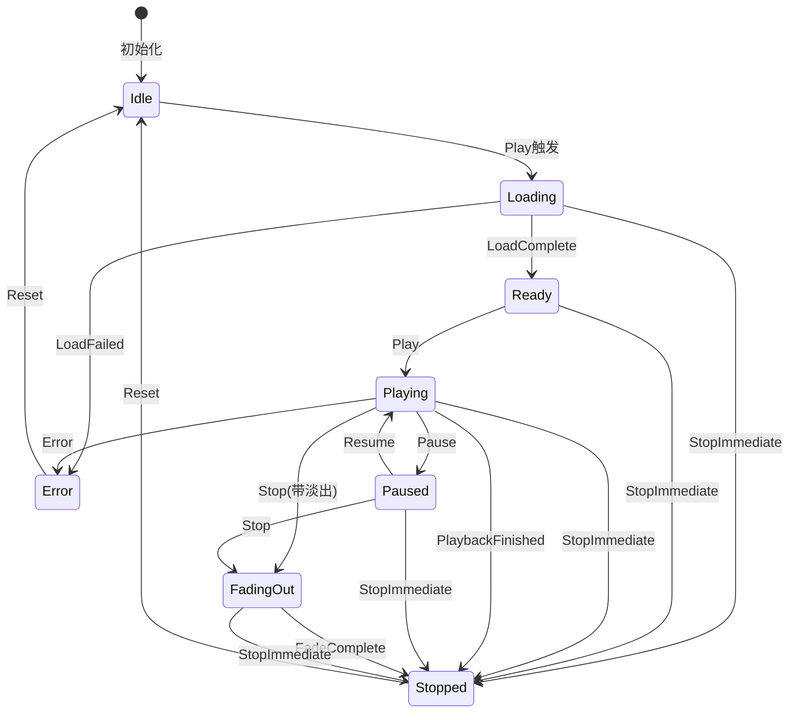
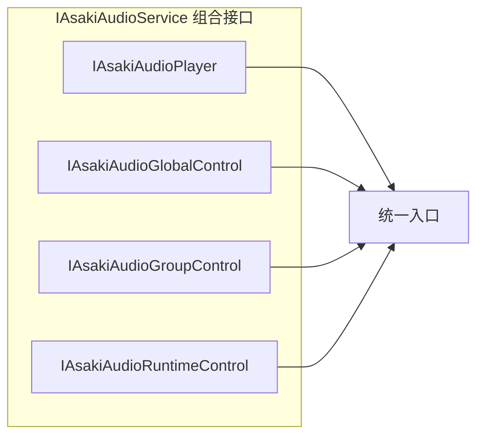
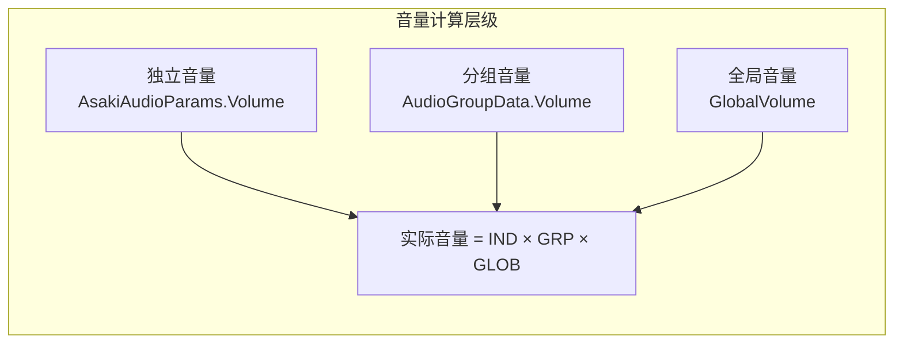

# Asaki Core/Audio 模块架构文档

## 目录

1. [设计理念](#1-设计理念)
2. [软件架构](#2-软件架构)
3. [API参考](#3-api参考)
4. [好的示例](#4-好的示例)
5. [坏的示例](#5-坏的示例)

---

## 1. 设计理念

### 1.1 为什么需要专门的音频系统

在Unity游戏开发中，音频管理是影响用户体验的关键因素。传统的音频实现方式存在以下问题：

- **资源管理混乱**：音频资源重复加载，内存占用高
- **状态管理复杂**：手动跟踪播放/暂停/停止状态，容易出现状态不一致
- **分组控制困难**：无法按类别（SFX/BGM/UI/Voice）统一控制音量
- **性能开销大**：频繁创建和销毁AudioSource对象

Asaki Audio模块通过以下设计解决这些问题：

- **对象池技术**：复用AudioSource对象，减少内存分配和GC压力
- **有限状态机**：规范化音频播放状态转换，防止非法状态变更
- **分组管理机制**：支持按音频组独立控制音量、静音、暂停
- **Facede模式**：提供统一的入口接口，简化API使用

### 1.2 音频句柄的设计动机

传统的音频系统通常直接返回AudioSource或AudioClip对象，这会导致以下问题：

1. **引用泄漏**：客户端持有AudioSource引用，无法判断是否已被回收
2. **野指针问题**：音频停止后，引用仍然存在但已无效
3. **状态不同步**：手动记录的状态与实际播放状态可能不一致

Asaki Audio采用**句柄（Handle）模式**解决这些问题：

- 使用不可变结构体 `AsakiAudioHandle` 作为音频标识
- 包含唯一ID和时间戳，用于验证句柄有效性
- 客户端通过句柄操作音频，无需关心底层实现细节
- 句柄失效后自动忽略操作，避免野指针问题

### 1.3 有限状态机的设计意图

音频播放涉及多种状态的转换，直接操作可能导致非法状态：

- 在未加载完成时调用暂停
- 在已停止后再次停止
- 播放完成后未正确清理资源

Asaki Audio实现了一个**确定性的有限状态机（FSM）**：

- 预定义所有合法的状态转换规则
- 通过 `StateTrigger` 触发器控制状态变更
- 每次转换前验证合法性，防止非法操作
- 状态变更时触发事件，便于上层逻辑响应

这种方法确保：

- 状态转换的安全性，所有变更都可追踪
- 易于调试，状态机日志清晰可见
- 易于扩展，新状态和转换规则可统一添加

### 1.4 分组控制的设计理念

游戏音频通常需要按类别独立控制：

- BGM：背景音乐，通常需要独立音量控制
- SFX：音效，可能需要全局静音但保留BGM
- UI：界面音效，某些场景需要全部静音
- Voice：语音对话，不能被其他音效覆盖

Asaki Audio实现了**分层音量控制**：

- 全局音量：影响所有音频
- 分组音量：影响特定类别的音频
- 独立音量：单个音频的音量

实际音量计算公式：`最终音量 = 独立音量 × 分组音量 × 全局音量`

---

## 2. 软件架构

### 2.1 架构层次概览



### 2.2 核心类图

```mermaid
classDiagram
    class IAsakiAudioService {
        <<interface>>
        +Play(int, AsakiAudioParams, CancellationToken) AsakiAudioHandle
        +Stop(AsakiAudioHandle, float)
        +Pause(AsakiAudioHandle)
        +Resume(AsakiAudioHandle)
        +IsPlaying(AsakiAudioHandle) bool
        +IsPaused(AsakiAudioHandle) bool
        +SetGlobalVolume(float)
        +GetGlobalVolume() float
        +StopAll(float)
        +PauseAll()
        +ResumeAll()
        +SetGroupVolume(int, float)
        +SetGroupVolumeWithFade(int, float, float, CancellationToken)
        +GetGroupVolume(int) float
        +GetGroupEffectiveVolume(int) float
        +SetGroupMuted(int, bool)
        +IsGroupMuted(int) bool
        +StopGroup(int, float)
        +PauseGroup(int)
        +ResumeGroup(int)
        +SetVolume(AsakiAudioHandle, float)
        +SetPitch(AsakiAudioHandle, float)
        +SetSpatialBlend(AsakiAudioHandle, float)
        +SetPosition(AsakiAudioHandle, Vector3)
        +SetLoop(AsakiAudioHandle, bool)
        +SetMuted(AsakiAudioHandle, bool)
        +SetPriority(AsakiAudioHandle, int)
        +GetState(AsakiAudioHandle) AudioPlaybackState
        +IsActive(AsakiAudioHandle) bool
        +IsError(AsakiAudioHandle) bool
        +GetCurrentVolume(AsakiAudioHandle) float
        +GetCurrentPitch(AsakiAudioHandle) float
        +GetPosition(AsakiAudioHandle) Vector3
        +GetPoolStatistics() string
        +GetStateStatistics() AudioStateStatistics
    }

    class IAsakiAudioPlayer {
        <<interface>>
        +Play(int, AsakiAudioParams, CancellationToken) AsakiAudioHandle
        +Stop(AsakiAudioHandle, float)
        +Pause(AsakiAudioHandle)
        +Resume(AsakiAudioHandle)
        +IsPlaying(AsakiAudioHandle) bool
        +IsPaused(AsakiAudioHandle) bool
    }

    class IAsakiAudioGlobalControl {
        <<interface>>
        +SetGlobalVolume(float)
        +GetGlobalVolume() float
        +StopAll(float)
        +PauseAll()
        +ResumeAll()
    }

    class IAsakiAudioGroupControl {
        <<interface>>
        +SetGroupVolume(int, float)
        +SetGroupVolumeWithFade(int, float, float, CancellationToken)
        +GetGroupVolume(int) float
        +GetGroupEffectiveVolume(int) float
        +SetGroupMuted(int, bool)
        +IsGroupMuted(int) bool
        +StopGroup(int, float)
        +PauseGroup(int)
        +ResumeGroup(int)
    }

    class IAsakiAudioRuntimeControl {
        <<interface>>
        +SetVolume(AsakiAudioHandle, float)
        +SetPitch(AsakiAudioHandle, float)
        +SetSpatialBlend(AsakiAudioHandle, float)
        +SetPosition(AsakiAudioHandle, Vector3)
        +SetLoop(AsakiAudioHandle, bool)
        +SetMuted(AsakiAudioHandle, bool)
        +SetPriority(AsakiAudioHandle, int)
    }

    class AsakiAudioHandle {
        <<struct>>
        +int Id
        +int Timestamp
        +IsValid bool
        +Equals(AsakiAudioHandle) bool
    }

    class AsakiAudioParams {
        <<struct>>
        +Vector3 Position
        +float Volume
        +float Pitch
        +float SpatialBlend
        +bool IsLoop
        +int Priority
        +Set3D(Vector3) AsakiAudioParams
        +SetVolume(float) AsakiAudioParams
        +SetPitch(float) AsakiAudioParams
        +SetLoop(bool) AsakiAudioParams
        +SetPriority(int) AsakiAudioParams
        +SetSpatialBlend(float) AsakiAudioParams
        +SetPosition(Vector3) AsakiAudioParams
    }

    class AudioStateMachine {
        +AudioPlaybackState CurrentState
        +AudioPlaybackState PreviousState
        +OnStateChanged event
        +TryTransition(StateTrigger) bool
        +CanTransition(StateTrigger) bool
        +Reset()
    }

    class AudioPlaybackState {
        <<enum>>
        +Idle
        +Loading
        +Ready
        +Playing
        +Paused
        +FadingOut
        +Stopped
        +Error
    }

    class AudioConstants {
        <<static>>
        +DefaultVolume: float
        +DefaultPitch: float
        +DefaultFadeDuration: float
        +GroupSFX: int
        +GroupBGM: int
        +GroupUI: int
        +GroupVoice: int
    }

    class IAudioGroupService {
        <<interface>>
        +OnGroupVolumeChanged event
        +OnGroupMuteChanged event
        +RegisterToGroup(int, AsakiAudioHandle, IAudioAgent)
        +UnregisterFromGroup(int, AsakiAudioHandle)
        +GetGroupAgents(int) IReadOnlyList$IAudioAgent
        +GetOrCreateGroup(int, string) AudioGroupData
        +GetGroupVolume(int) float
        +SetGroupVolume(int, float)
        +SetGroupVolumeWithFade(int, float, float, CancellationToken)
        +GetEffectiveVolume(int) float
        +IsGroupMuted(int) bool
        +SetGroupMuted(int, bool)
        +StopGroup(int, float)
        +PauseGroup(int)
        +ResumeGroup(int)
    }

    IAsakiAudioService --|> IAsakiAudioPlayer
    IAsakiAudioService --|> IAsakiAudioGlobalControl
    IAsakiAudioService --|> IAsakiAudioGroupControl
    IAsakiAudioService --|> IAsakiAudioRuntimeControl
    AudioStateMachine --> AudioPlaybackState
    AudioStateMachine --> AudioStateTransition
```



### 2.3 状态转换流程



### 2.4 接口组合关系



### 2.5 音量层级计算



---

## 3. API参考

### 3.1 IAsakiAudioService 接口

音频服务主接口，采用Facade模式组合所有音频子接口。

| 方法 | 描述 | 参数 | 返回值 |
|------|------|------|--------|
| `Play` | 播放音频 | `assetId`: 资源ID<br>`parameters`: 播放参数<br>`token`: 取消令牌 | `AsakiAudioHandle` |
| `Stop` | 停止音频 | `handle`: 音频句柄<br>`fadeDuration`: 淡出时长 | `void` |
| `Pause` | 暂停音频 | `handle`: 音频句柄 | `void` |
| `Resume` | 恢复音频 | `handle`: 音频句柄 | `void` |
| `IsPlaying` | 判断是否正在播放 | `handle`: 音频句柄 | `bool` |
| `IsPaused` | 判断是否已暂停 | `handle`: 音频句柄 | `bool` |
| `SetGlobalVolume` | 设置全局音量 | `volume`: 音量(0-1) | `void` |
| `GetGlobalVolume` | 获取全局音量 | 无 | `float` |
| `StopAll` | 停止所有音频 | `fadeDuration`: 淡出时长 | `void` |
| `PauseAll` | 暂停所有音频 | 无 | `void` |
| `ResumeAll` | 恢复所有音频 | 无 | `void` |
| `SetGroupVolume` | 设置分组音量 | `groupId`: 分组ID<br>`volume`: 音量 | `void` |
| `SetGroupVolumeWithFade` | 设置分组音量(渐变) | `groupId`: 分组ID<br>`targetVolume`: 目标音量<br>`duration`: 渐变时长<br>`token`: 取消令牌 | `void` |
| `GetGroupVolume` | 获取分组音量 | `groupId`: 分组ID | `float` |
| `GetGroupEffectiveVolume` | 获取分组有效音量 | `groupId`: 分组ID | `float` |
| `SetGroupMuted` | 设置分组静音 | `groupId`: 分组ID<br>`isMuted`: 是否静音 | `void` |
| `IsGroupMuted` | 获取分组静音状态 | `groupId`: 分组ID | `bool` |
| `StopGroup` | 停止分组音频 | `groupId`: 分组ID<br>`fadeDuration`: 淡出时长 | `void` |
| `PauseGroup` | 暂停分组音频 | `groupId`: 分组ID | `void` |
| `ResumeGroup` | 恢复分组音频 | `groupId`: 分组ID | `void` |
| `SetVolume` | 设置音量(运行时) | `handle`: 句柄<br>`volume`: 音量 | `void` |
| `SetPitch` | 设置音调(运行时) | `handle`: 句柄<br>`pitch`: 音调 | `void` |
| `SetSpatialBlend` | 设置空间混合 | `handle`: 句柄<br>`spatialBlend`: 混合值 | `void` |
| `SetPosition` | 设置3D位置 | `handle`: 句柄<br>`position`: 坐标 | `void` |
| `SetLoop` | 设置循环 | `handle`: 句柄<br>`isLoop`: 是否循环 | `void` |
| `SetMuted` | 设置静音 | `handle`: 句柄<br>`isMuted`: 是否静音 | `void` |
| `SetPriority` | 设置优先级 | `handle`: 句柄<br>`priority`: 优先级 | `void` |
| `GetState` | 获取播放状态 | `handle`: 句柄 | `AudioPlaybackState` |
| `IsActive` | 判断是否活跃 | `handle`: 句柄 | `bool` |
| `IsError` | 判断是否错误 | `handle`: 句柄 | `bool` |
| `GetCurrentVolume` | 获取当前音量 | `handle`: 句柄 | `float` |
| `GetCurrentPitch` | 获取当前音调 | `handle`: 句柄 | `float` |
| `GetPosition` | 获取位置 | `handle`: 句柄 | `Vector3` |
| `GetPoolStatistics` | 获取池统计 | 无 | `string` |
| `GetStateStatistics` | 获取状态统计 | 无 | `AudioStateStatistics` |

### 3.2 AsakiAudioHandle 结构

轻量级音频标识符，用于引用和管理音频播放实例。

| 属性 | 类型 | 描述 |
|------|------|------|
| `Id` | `int` | 唯一标识ID |
| `Timestamp` | `int` | 创建时间戳(帧号) |
| `IsValid` | `bool` | 是否有效(ID不为0) |
| `Invalid` | `AsakiAudioHandle` | 无效句柄静态实例 |

### 3.3 AsakiAudioParams 结构

音频播放参数包，使用Fluent API创建配置实例。

| 属性 | 类型 | 默认值 | 描述 |
|------|------|--------|------|
| `Position` | `Vector3` | Vector3.zero | 3D空间坐标 |
| `Volume` | `float` | 1.0 | 音量(0-1) |
| `Pitch` | `float` | 1.0 | 音调 |
| `SpatialBlend` | `float` | 0.0 | 2D/3D混合值(0=2D, 1=3D) |
| `IsLoop` | `bool` | false | 是否循环 |
| `Priority` | `int` | 128 | 优先级(0最高) |

| 方法 | 描述 | 返回值 |
|------|------|--------|
| `Set3D(Vector3 position)` | 设置3D位置，自动设置SpatialBlend=1 | `AsakiAudioParams` |
| `SetVolume(float volume)` | 设置音量 | `AsakiAudioParams` |
| `SetPitch(float pitch)` | 设置音调 | `AsakiAudioParams` |
| `SetLoop(bool isLoop)` | 设置循环状态 | `AsakiAudioParams` |
| `SetPriority(int priority)` | 设置优先级 | `AsakiAudioParams` |
| `SetSpatialBlend(float blend)` | 设置空间混合值 | `AsakiAudioParams` |
| `SetPosition(Vector3 position)` | 设置位置 | `AsakiAudioParams` |

### 3.4 AudioPlaybackState 枚举

| 值 | 描述 |
|------|------|
| `Idle` | 空闲状态 - 对象在池中或未初始化 |
| `Loading` | 正在加载音频资源 |
| `Ready` | 资源加载完成，准备播放 |
| `Playing` | 正在播放音频 |
| `Paused` | 音频已暂停 |
| `FadingOut` | 正在淡出停止 |
| `Stopped` | 已停止，等待清理 |
| `Error` | 发生错误 |

### 3.5 AudioStateMachine 类

音频播放状态机，管理状态转换。

| 属性 | 类型 | 描述 |
|------|------|------|
| `CurrentState` | `AudioPlaybackState` | 当前状态 |
| `PreviousState` | `AudioPlaybackState` | 前一个状态 |
| `OnStateChanged` | `event` | 状态改变事件 |

| 方法 | 描述 | 参数 | 返回值 |
|------|------|------|--------|
| `TryTransition` | 尝试触发状态转换 | `trigger`: 触发器 | `bool` |
| `CanTransition` | 检查是否可以转换 | `trigger`: 触发器 | `bool` |
| `Reset` | 重置状态机 | 无 | `void` |

### 3.6 StateTrigger 枚举

| 值 | 描述 |
|------|------|
| `Play` | 开始播放 |
| `LoadComplete` | 资源加载完成 |
| `LoadFailed` | 资源加载失败 |
| `Pause` | 暂停播放 |
| `Resume` | 恢复播放 |
| `Stop` | 停止播放(带淡出) |
| `StopImmediate` | 立即停止(无淡出) |
| `PlaybackFinished` | 播放完成(非循环音频) |
| `FadeComplete` | 淡出完成 |
| `Error` | 发生错误 |
| `Reset` | 重置/清理 |

### 3.7 AudioConstants 常量

| 常量 | 值 | 描述 |
|------|------|------|
| `DefaultVolume` | 1.0f | 默认音量 |
| `DefaultPitch` | 1.0f | 默认音调 |
| `DefaultFadeDuration` | 0.2f | 默认淡出时长(秒) |
| `DefaultStopAllFadeDuration` | 0.5f | 停止所有音频的默认淡出时长 |
| `Full2D` | 0.0f | 完全2D音效 |
| `Full3D` | 1.0f | 完全3D音效 |
| `GroupSFX` | 0 | SFX音频组ID |
| `GroupBGM` | 1 | BGM音频组ID |
| `GroupUI` | 2 | UI音频组ID |
| `GroupVoice` | 3 | 语音音频组ID |

### 3.8 IAudioGroupService 接口

音频分组服务接口，负责管理音频分组。

| 方法 | 描述 |
|------|------|
| `RegisterToGroup` | 注册音频到分组 |
| `UnregisterFromGroup` | 从分组注销音频 |
| `GetGroupAgents` | 获取分组内的所有代理 |
| `GetOrCreateGroup` | 获取或创建分组数据 |
| `HasGroup` | 检查分组是否存在 |
| `GetGroupVolume` | 获取分组音量 |
| `SetGroupVolume` | 设置分组音量(立即) |
| `SetGroupVolumeWithFade` | 设置分组音量(渐变) |
| `GetEffectiveVolume` | 获取分组实际音量 |
| `SetGlobalVolumeFactor` | 设置全局音量系数 |
| `IsGroupMuted` | 获取分组静音状态 |
| `SetGroupMuted` | 设置分组静音状态 |
| `StopGroup` | 停止分组内所有音频 |
| `PauseGroup` | 暂停分组内所有音频 |
| `ResumeGroup` | 恢复分组内所有音频 |
| `GetAllGroupIds` | 获取所有分组ID |
| `ClearAllGroups` | 清空所有分组 |

---

## 4. 好的示例

### 4.1 基础音频播放

```csharp
using Asaki.Core.Audio;
using Asaki.Core.Architecture;
using Cysharp.Threading.Tasks;
using UnityEngine;

/// <summary>
/// 基础音频播放示例
/// </summary>
public class BasicAudioExample : AsakiMono, IAsakiAutoInject
{
    private IAsakiAudioService _audioService;

    void IAsakiInject<IAsakiAudioService>.Inject(IAsakiAudioService audioService)
    {
        _audioService = audioService;
    }

    protected override void OnStart()
    {
        // 播放默认参数音频
        PlayDefaultAudio();

        // 播放自定义参数音频
        PlayCustomAudio();
    }

    /// <summary>
    /// 使用默认参数播放音频
    /// </summary>
    private void PlayDefaultAudio()
    {
        int bgmAssetId = 1001; // 从资源配置获取
        AsakiAudioHandle handle = _audioService.Play(bgmAssetId);

        if (handle.IsValid)
        {
            Debug.Log($"开始播放BGM，句柄: {handle}");
        }
    }

    /// <summary>
    /// 使用自定义参数播放音频
    /// </summary>
    private void PlayCustomAudio()
    {
        int sfxAssetId = 2001;

        // 使用Fluent API设置播放参数
        AsakiAudioParams parameters = AsakiAudioParams.Default
            .SetVolume(0.8f)
            .SetPitch(1.0f)
            .SetLoop(false)
            .SetPriority(64);

        AsakiAudioHandle handle = _audioService.Play(sfxAssetId, parameters);

        if (handle.IsValid)
        {
            Debug.Log($"开始播放音效，句柄: {handle}");
        }
    }

    /// <summary>
    /// 停止音频
    /// </summary>
    public void StopAudio(AsakiAudioHandle handle)
    {
        if (handle.IsValid)
        {
            // 0.2秒淡出停止
            _audioService.Stop(handle, 0.2f);
        }
    }

    /// <summary>
    /// 暂停音频
    /// </summary>
    public void PauseAudio(AsakiAudioHandle handle)
    {
        if (handle.IsValid && _audioService.IsPlaying(handle))
        {
            _audioService.Pause(handle);
        }
    }

    /// <summary>
    /// 恢复音频
    /// </summary>
    public void ResumeAudio(AsakiAudioHandle handle)
    {
        if (handle.IsValid && _audioService.IsPaused(handle))
        {
            _audioService.Resume(handle);
        }
    }
}
```

### 4.2 3D空间音频示例

```csharp
using Asaki.Core.Audio;
using Asaki.Core.Architecture;
using UnityEngine;

/// <summary>
/// 3D空间音频示例 - 脚步声、枪声等
/// </summary>
public class SpatialAudioExample : AsakiMono, IAsakiAutoInject
{
    private IAsakiAudioService _audioService;

    void IAsakiInject<IAsakiAudioService>.Inject(IAsakiAudioService audioService)
    {
        _audioService = audioService;
    }

    /// <summary>
    /// 在指定位置播放3D音效
    /// </summary>
    public void PlayFootstep(Vector3 footPosition)
    {
        int footstepAssetId = 3001;

        // 设置3D位置，自动启用3D空间混合
        AsakiAudioParams parameters = AsakiAudioParams.Default
            .Set3D(footPosition)
            .SetVolume(0.6f)
            .SetPitch(1.0f + Random.Range(-0.1f, 0.1f)); // 随机音高变化

        _audioService.Play(footstepAssetId, parameters);
    }

    /// <summary>
    /// 在敌人位置播放受伤音效
    /// </summary>
    public void PlayHurtSound(Vector3 enemyPosition)
    {
        int hurtAssetId = 3002;

        AsakiAudioParams parameters = AsakiAudioParams.Default
            .Set3D(enemyPosition)
            .SetVolume(0.7f)
            .SetSpatialBlend(1.0f); // 完全3D

        _audioService.Play(hurtAssetId, parameters);
    }

    /// <summary>
    /// 更新音频位置（用于移动声源）
    /// </summary>
    private void Update()
    {
        // 如果有需要持续更新的音频句柄，可以在这里更新位置
    }
}
```

### 4.3 音频分组控制示例

```csharp
using Asaki.Core.Audio;
using Asaki.Core.Architecture;
using Cysharp.Threading.Tasks;
using UnityEngine;

/// <summary>
/// 音频分组控制示例 - 音量设置面板
/// </summary>
public class AudioGroupControlExample : AsakiMono, IAsakiAutoInject
{
    private IAsakiAudioService _audioService;

    void IAsakiInject<IAsakiAudioService>.Inject(IAsakiAudioService audioService)
    {
        _audioService = audioService;
    }

    /// <summary>
    /// 立即设置BGM音量
    /// </summary>
    public void SetBGMVolume(float volume)
    {
        _audioService.SetGroupVolume(AudioConstants.GroupBGM, volume);
    }

    /// <summary>
    /// 渐变设置SFX音量（用于滑块平滑调整）
    /// </summary>
    public async UniTask SetSFXVolumeWithFadeAsync(float targetVolume)
    {
        // 0.3秒渐变到目标音量
        await _audioService.SetGroupVolumeWithFade(
            AudioConstants.GroupSFX,
            targetVolume,
            0.3f,
            this.GetCancellationTokenOnDestroy()
        );
    }

    /// <summary>
    /// 切换UI音效静音
    /// </summary>
    public void ToggleUIMute()
    {
        bool currentMute = _audioService.IsGroupMuted(AudioConstants.GroupUI);
        _audioService.SetGroupMuted(AudioConstants.GroupUI, !currentMute);
    }

    /// <summary>
    /// 停止所有背景音乐（场景切换时）
    /// </summary>
    public void StopAllBGM()
    {
        _audioService.StopGroup(AudioConstants.GroupBGM, 0.5f);
    }

    /// <summary>
    /// 暂停所有音效（进入设置菜单时）
    /// </summary>
    public void PauseAllSFX()
    {
        _audioService.PauseGroup(AudioConstants.GroupSFX);
    }

    /// <summary>
    /// 恢复所有音效
    /// </summary>
    public void ResumeAllSFX()
    {
        _audioService.ResumeGroup(AudioConstants.GroupSFX);
    }

    /// <summary>
    /// 获取分组有效音量（用于UI显示）
    /// </summary>
    public float GetBGMEffectiveVolume()
    {
        return _audioService.GetGroupEffectiveVolume(AudioConstants.GroupBGM);
    }
}
```

### 4.4 音频运行时控制示例

```csharp
using Asaki.Core.Audio;
using Asaki.Core.Architecture;
using UnityEngine;

/// <summary>
/// 音频运行时控制示例 - 动态音效调整
/// </summary>
public class RuntimeAudioControlExample : AsakiMono, IAsakiAutoInject
{
    private IAsakiAudioService _audioService;
    private AsakiAudioHandle _loopingHandle;

    void IAsakiInject<IAsakiAudioService>.Inject(IAsakiAudioService audioService)
    {
        _audioService = audioService;
    }

    /// <summary>
    /// 播放引擎声音并动态调整
    /// </summary>
    public void StartEngineSound()
    {
        int engineAssetId = 4001;

        // 循环播放引擎声音
        AsakiAudioParams parameters = AsakiAudioParams.Default
            .SetLoop(true)
            .SetVolume(0.5f)
            .SetPitch(0.8f);

        _loopingHandle = _audioService.Play(engineAssetId, parameters);
    }

    /// <summary>
    /// 根据车速调整引擎音调
    /// </summary>
    public void UpdateEnginePitch(float speedRatio)
    {
        // speedRatio: 0-1，音调从0.8到1.5
        if (_loopingHandle.IsValid)
        {
            float pitch = Mathf.Lerp(0.8f, 1.5f, speedRatio);
            _audioService.SetPitch(_loopingHandle, pitch);
        }
    }

    /// <summary>
    /// 根据距离调整3D音量
    /// </summary>
    public void UpdateVolumeByDistance(Vector3 playerPosition, Vector3 soundSourcePosition)
    {
        if (_loopingHandle.IsValid)
        {
            float distance = Vector3.Distance(playerPosition, soundSourcePosition);
            float volume = Mathf.Clamp01(1.0f - (distance / 50.0f)); // 50米外无声
            _audioService.SetVolume(_loopingHandle, volume);
        }
    }

    /// <summary>
    /// 停止引擎声音
    /// </summary>
    public void StopEngineSound()
    {
        if (_loopingHandle.IsValid)
        {
            _audioService.Stop(_loopingHandle, 0.3f);
            _loopingHandle = AsakiAudioHandle.Invalid;
        }
    }
}
```

### 4.5 事件订阅示例

```csharp
using Asaki.Core.Audio;
using Asaki.Core.Broker;
using UnityEngine;

/// <summary>
/// 音频事件订阅示例
/// </summary>
public class AudioEventExample : AsakiMono,
    IAsakiHandler<AsakiAudioFinishedEvent>,
    IAsakiHandler<GlobalVolumeChangedEvent>,
    IAsakiHandler<AudioGroupVolumeChangedEvent>
{
    protected override void OnEnable()
    {
        base.OnEnable();

        // 订阅音频播放完成事件
        AsakiBroker.Subscribe<AsakiAudioFinishedEvent>(this);

        // 订阅音量变化事件
        AsakiBroker.Subscribe<GlobalVolumeChangedEvent>(this);
        AsakiBroker.Subscribe<AudioGroupVolumeChangedEvent>(this);
    }

    protected override void OnDisable()
    {
        // 取消订阅
        AsakiBroker.Unsubscribe<AsakiAudioFinishedEvent>(this);
        AsakiBroker.Unsubscribe<GlobalVolumeChangedEvent>(this);
        AsakiBroker.Unsubscribe<AudioGroupVolumeChangedEvent>(this);

        base.OnDisable();
    }

    /// <summary>
    /// 音频播放完成回调
    /// </summary>
    public void OnEvent(in AsakiAudioFinishedEvent evt)
    {
        Debug.Log($"音频播放完成，AssetId: {evt.AssetId}, Handle: {evt.Handle}");

        // 播放完成后可以触发其他逻辑，如播放下一个
    }

    /// <summary>
    /// 全局音量变化回调
    /// </summary>
    public void OnEvent(in GlobalVolumeChangedEvent evt)
    {
        Debug.Log($"全局音量变化: {evt.Volume}");

        // 更新UI显示
    }

    /// <summary>
    /// 分组音量变化回调
    /// </summary>
    public void OnEvent(in AudioGroupVolumeChangedEvent evt)
    {
        Debug.Log($"分组 {evt.GroupId} 音量变化: {evt.Volume}, 渐变中: {evt.IsTransitioning}");

        // 更新对应分组的UI显示
    }
}
```

---

## 5. 坏的示例

### 5.1 句柄未验证

```csharp
// 错误示例：未验证句柄有效性
public class BadAudioExample1 : AsakiMono, IAsakiAutoInject
{
    private IAsakiAudioService _audioService;
    private AsakiAudioHandle _handle;

    void IAsakiInject<IAsakiAudioService>.Inject(IAsakiAudioService audioService)
    {
        _audioService = audioService;
    }

    protected override void OnStart()
    {
        _handle = _audioService.Play(1001); // 播放音频
    }

    private void StopAfterDelay()
    {
        // 问题：音频可能已经播放完毕或被停止，句柄已无效
        // 直接调用Stop可能导致异常或无效操作
        _audioService.Stop(_handle, 0.2f); // 未验证IsValid
    }

    // 正确示例：始终验证句柄
    private void StopAfterDelay_Correct()
    {
        if (_handle.IsValid)
        {
            // 再次验证音频是否仍在活跃
            if (_audioService.IsActive(_handle))
            {
                _audioService.Stop(_handle, 0.2f);
            }
        }
    }
}
```

### 5.2 状态操作时机错误

```csharp
// 错误示例：在错误的状态执行操作
public class BadAudioExample2 : AsakiMono, IAsakiAutoInject
{
    private IAsakiAudioService _audioService;
    private AsakiAudioHandle _handle;

    void IAsakiInject<IAsakiAudioService>.Inject(IAsakiAudioService audioService)
    {
        _audioService = audioService;
    }

    private void Start()
    {
        _handle = _audioService.Play(1001);

        // 问题：Play是异步的，音频可能还在Loading状态
        // 此时暂停可能无效或行为不确定
        _audioService.Pause(_handle); // 可能在Loading状态暂停
    }

    // 正确示例：等待音频进入Ready或Playing状态
    private async void Start_Correct()
    {
        _handle = _audioService.Play(1001);

        // 等待音频准备好或开始播放
        await UniTask.WaitUntil(() =>
            _audioService.GetState(_handle) == AudioPlaybackState.Playing ||
            _audioService.GetState(_handle) == AudioPlaybackState.Ready);

        // 现在可以安全暂停
        _audioService.Pause(_handle);
    }
}
```

### 5.3 参数值越界

```csharp
// 错误示例：参数值越界导致问题
public class BadAudioExample3 : AsakiMono, IAsakiAutoInject
{
    private IAsakiAudioService _audioService;

    void IAsakiInject<IAsakiAudioService>.Inject(IAsakiAudioService audioService)
    {
        _audioService = audioService;
    }

    private void PlayWithBadParams()
    {
        // 问题1：音量为负数或大于1
        AsakiAudioParams badParams1 = AsakiAudioParams.Default
            .SetVolume(-0.5f); // 无效：负数

        // 问题2：音调过低或过高
        AsakiAudioParams badParams2 = AsakiAudioParams.Default
            .SetPitch(0.01f); // 可能导致AudioSource错误

        AsakiAudioParams badParams3 = AsakiAudioParams.Default
            .SetPitch(10f); // 音调过高，声音失真

        // 问题3：空间混合值越界
        AsakiAudioParams badParams4 = AsakiAudioParams.Default
            .SetSpatialBlend(2.0f); // 超过1f

        _audioService.Play(1001, badParams1);
        _audioService.Play(1001, badParams2);
        _audioService.Play(1001, badParams3);
        _audioService.Play(1001, badParams4);
    }

    // 正确示例：使用Clamp确保值在有效范围内
    private void PlayWithCorrectParams()
    {
        float inputVolume = GetVolumeFromSlider(); // 0-1范围
        float inputPitch = GetPitchFromSlider();   // 可能超出范围

        AsakiAudioParams correctParams = AsakiAudioParams.Default
            .SetVolume(Mathf.Clamp01(inputVolume))  // 限制在0-1
            .SetPitch(Mathf.Clamp(inputPitch, AudioConstants.MinPitch, AudioConstants.MaxPitch))
            .SetSpatialBlend(Mathf.Clamp01(GetSpatialBlend()));

        _audioService.Play(1001, correctParams);
    }

    private float GetVolumeFromSlider() => 0.5f;
    private float GetPitchFromSlider() => 1.0f;
    private float GetSpatialBlend() => 1.0f;
}
```

### 5.4 音频句柄管理不当

```csharp
// 错误示例：句柄管理混乱，重复操作
public class BadAudioExample4 : AsakiMono, IAsakiAutoInject
{
    private IAsakiAudioService _audioService;
    private AsakiAudioHandle _currentHandle;

    void IAsakiInject<IAsakiAudioService>.Inject(IAsakiAudioService audioService)
    {
        _audioService = audioService;
    }

    private void OnTriggerEnter(Collider other)
    {
        // 问题：每次触发都播放新音频，但没有停止之前的
        _currentHandle = _audioService.Play(1001); // 可能同时播放多个
    }

    private void OnTriggerExit(Collider other)
    {
        // 问题：可能已经在其他地方停止了，句柄已无效
        _audioService.Stop(_currentHandle, 0.2f);
    }

    // 正确示例：管理音频生命周期
    private AsakiAudioHandle _activeHandle = AsakiAudioHandle.Invalid;
    private const int MaxConcurrentSounds = 3;

    private void OnTriggerEnter_Correct(Collider other)
    {
        // 检查是否超过最大并发数
        if (_activeHandle.IsValid && _audioService.IsActive(_activeHandle))
        {
            // 停止旧的播放新的
            _audioService.Stop(_activeHandle, 0.1f);
        }

        _activeHandle = _audioService.Play(1001);
    }

    private void OnTriggerExit_Correct(Collider other)
    {
        if (_activeHandle.IsValid)
        {
            _audioService.Stop(_activeHandle, 0.2f);
            _activeHandle = AsakiAudioHandle.Invalid;
        }
    }
}
```

### 5.5 忽略取消令牌

```csharp
// 错误示例：忽略取消令牌，导致潜在内存泄漏
public class BadAudioExample5 : AsakiMono, IAsakiAutoInject
{
    private IAsakiAudioService _audioService;
    private CancellationTokenSource _cts;

    void IAsakiInject<IAsakiAudioService>.Inject(IAsakiAudioService audioService)
    {
        _audioService = audioService;
    }

    private void PlayWithCancel()
    {
        _cts = new CancellationTokenSource();

        // 问题：传递了取消令牌，但在停止时没有使用
        _audioService.Play(1001, default, _cts.Token);

        // 场景切换时应该取消播放
        _cts.Cancel(); // 但Play方法可能已经完成

        // 问题：没有Dispose CancellationTokenSource
    }

    // 正确示例：正确管理取消令牌
    private async UniTask PlayWithCancel_Correct()
    {
        using var cts = new CancellationTokenSource();

        try
        {
            AsakiAudioHandle handle = _audioService.Play(
                1001,
                default,
                cts.Token
            );

            // 等待某些条件
            await UniTask.Delay(5000, cancellationToken: cts.Token);

            // 停止播放
            _audioService.Stop(handle, 0.2f);
        }
        catch (OperationCanceledException)
        {
            // 播放被取消
            Debug.Log("播放已取消");
        }
        // using自动Dispose
    }
}
```

### 5.6 全局控制误用

```csharp
// 错误示例：错误使用全局控制，影响所有音频
public class BadAudioExample6 : AsakiMono, IAsakiAutoInject
{
    private IAsakiAudioService _audioService;

    void IAsakiInject<IAsakiAudioService>.Inject(IAsakiAudioService audioService)
    {
        _audioService = audioService;
    }

    private void OnApplicationPause(bool pauseStatus)
    {
        if (pauseStatus)
        {
            // 问题：使用PauseAll会暂停所有音频，包括BGM
            _audioService.PauseAll();
        }
        else
        {
            _audioService.ResumeAll();
        }
    }

    // 正确示例：只暂停需要暂停的分组
    private void OnApplicationPause_Correct(bool pauseStatus)
    {
        if (pauseStatus)
        {
            // 只暂停SFX和UI音效，保留BGM
            _audioService.PauseGroup(AudioConstants.GroupSFX);
            _audioService.PauseGroup(AudioConstants.GroupUI);
            // 或者使用全局暂停BGM但保留语音
            _audioService.PauseGroup(AudioConstants.GroupBGM);
        }
        else
        {
            _audioService.ResumeGroup(AudioConstants.GroupSFX);
            _audioService.ResumeGroup(AudioConstants.GroupUI);
            _audioService.ResumeGroup(AudioConstants.GroupBGM);
        }
    }

    // 另一个正确示例：使用渐变停止而非立即停止所有
    private void StopAllForCutscene_Correct()
    {
        // 使用渐变时长停止所有，给用户平滑体验
        _audioService.StopAll(0.5f);
    }
}
```

---

## 附录

### 相关文件路径

- [IAsakiAudioService.cs](file:///e:/Projects/UnityGame/Asaki/Assets/Asaki/Core/Audio/IAsakiAudioService.cs)
- [IAsakiAudioPlayer.cs](file:///e:/Projects/UnityGame/Asaki/Assets/Asaki/Core/Audio/IAsakiAudioPlayer.cs)
- [IAsakiAudioGroupControl.cs](file:///e:/Projects/UnityGame/Asaki/Assets/Asaki/Core/Audio/IAsakiAudioGroupControl.cs)
- [IAsakiAudioGlobalControl.cs](file:///e:/Projects/UnityGame/Asaki/Assets/Asaki/Core/Audio/IAsakiAudioGlobalControl.cs)
- [IAsakiAudioRuntimeControl.cs](file:///e:/Projects/UnityGame/Asaki/Assets/Asaki/Core/Audio/IAsakiAudioRuntimeControl.cs)
- [AsakiAudioHandle.cs](file:///e:/Projects/UnityGame/Asaki/Assets/Asaki/Core/Audio/AsakiAudioHandle.cs)
- [AsakiAudioParams.cs](file:///e:/Projects/UnityGame/Asaki/Assets/Asaki/Core/Audio/AsakiAudioParams.cs)
- [AudioStateMachine.cs](file:///e:/Projects/UnityGame/Asaki/Assets/Asaki/Core/Audio/AudioStateMachine.cs)
- [AudioPlaybackState.cs](file:///e:/Projects/UnityGame/Asaki/Assets/Asaki/Core/Audio/AudioPlaybackState.cs)
- [AudioStateTransition.cs](file:///e:/Projects/UnityGame/Asaki/Assets/Asaki/Core/Audio/AudioStateTransition.cs)
- [AudioConstants.cs](file:///e:/Projects/UnityGame/Asaki/Assets/Asaki/Core/Audio/AudioConstants.cs)
- [AudioStateStatistics.cs](file:///e:/Projects/UnityGame/Asaki/Assets/Asaki/Core/Audio/AudioStateStatistics.cs)
- [AsakiAudioEvents.cs](file:///e:/Projects/UnityGame/Asaki/Assets/Asaki/Core/Audio/AsakiAudioEvents.cs)
- [IAudioGroupService.cs](file:///e:/Projects/UnityGame/Asaki/Assets/Asaki/Core/Audio/IAudioGroupService.cs)

---

_文档生成时间: 2026-03-03_
