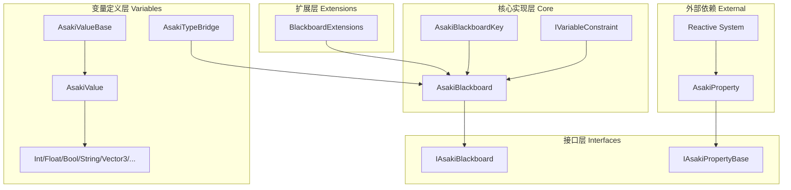
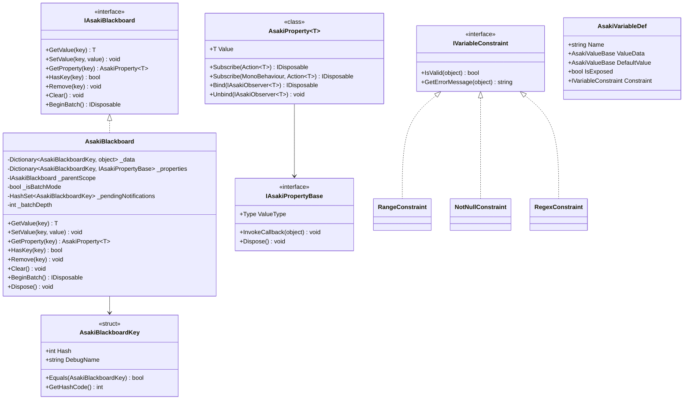
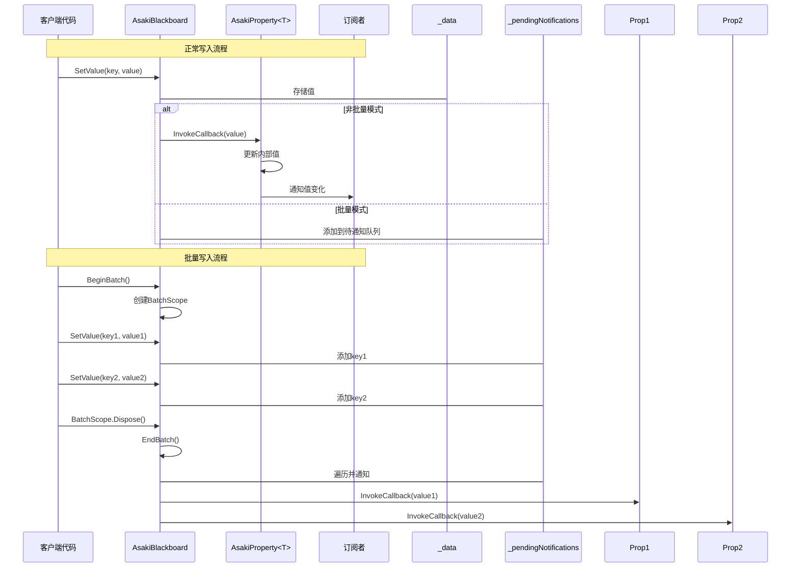
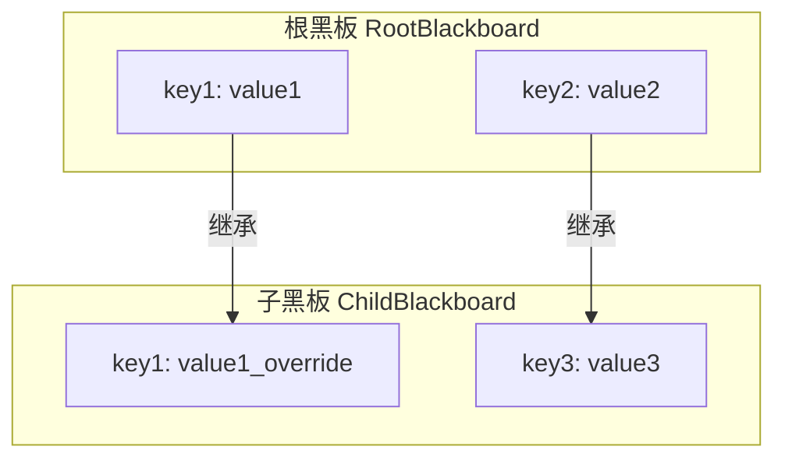

# Asaki Core/Blackboard 模块架构文档

## 目录

1. [设计理念](#1-设计理念)
2. [软件架构](#2-软件架构)
3. [API参考](#3-api参考)
4. [好的示例](#4-好的示例)
5. [坏的示例](#5-坏的示例)

---

## 1. 设计理念

### 1.1 为什么需要黑板系统

在游戏开发中，不同系统之间经常需要共享和传递数据。传统的做法是直接引用或使用单例，但这会导致：

- **紧耦合**：系统之间相互依赖，难以测试和替换
- **数据混乱**：全局变量泛滥，难以追踪数据来源和修改历史
- **扩展困难**：新增功能需要修改多个现有类

Asaki Blackboard（黑板系统）借鉴了黑板模式（Blackboard Pattern）的设计理念，提供了一个**集中式的数据共享空间**：

- 各系统可以独立读写黑板上的数据，无需相互引用
- 支持键值对存储，通过确定性哈希键实现高效查找
- 集成响应式属性系统，支持数据变化通知
- 支持父子作用域层级，实现数据的隔离和继承

### 1.2 确定性哈希键的设计动机

传统的字符串哈希在跨平台（Windows/Linux/iOS/Android）时存在哈希值不一致的问题：

- `.NET` 和 `Mono` 的 `string.GetHashCode()` 实现不同
- 不同的运行环境和编译器版本可能产生不同的哈希结果
- 这会导致序列化/反序列化、网络同步等场景下键匹配失败

Asaki Blackboard 使用 **FNV-1a 算法** 生成确定性哈希值：

- 手动遍历字符字节，避免依赖平台特定的 string 实现
- 无论在哪个平台或编译器下，相同的字符串始终产生相同的哈希值
- 符合 `[Core Constraint 1]` 强制要求，确保跨平台一致性

### 1.3 响应式数据流的设计意图

单纯的值存储无法满足复杂业务需求。Asaki Blackboard 深度集成了 **Asaki Reactive** 响应式框架：

- `AsakiProperty<T>` 提供观察者模式支持
- 值变化时自动通知所有订阅者
- 支持委托订阅和接口绑定两种方式
- 支持批量更新模式，延迟通知以优化性能

这种设计特别适合以下场景：

- UI 响应数据变化自动刷新
- 游戏状态变化触发多个系统联动
- 调试工具实时监控数据修改

### 1.4 变量约束机制的设计

为了保证数据的一致性和有效性，Blackboard 引入了 **IVariableConstraint** 约束系统：

- **RangeConstraint**：数值范围约束（适用于 int、float、double）
- **NotNullConstraint**：非空约束（适用于引用类型）
- **RegexConstraint**：正则表达式约束（适用于字符串）

通过约束，系统可以在数据写入时进行校验，避免无效数据传播。

---

## 2. 软件架构

### 2.1 模块层次概览



### 2.2 核心类图



### 2.3 数据流动流程



### 2.4 父子作用域机制



父作用域的黑板数据对子作用域可见，子作用域可以覆盖父作用域的同名键。

---

## 3. API参考

### 3.1 IAsakiBlackboard 接口

黑板系统的核心接口，提供值存取、属性订阅和批量操作功能。

| 方法 | 描述 | 参数 | 返回值 |
|------|------|------|--------|
| `GetValue<T>` | 获取指定键的值 | `key`: AsakiBlackboardKey | `T`: 值（若不存在返回默认值） |
| `SetValue<T>` | 设置指定键的值 | `key`: AsakiBlackboardKey<br>`value`: 要设置的值 | `void` |
| `GetProperty<T>` | 获取或创建响应式属性 | `key`: 黑板键 | `AsakiProperty<T>` |
| `HasKey` | 检查键是否存在 | `key`: 黑板键 | `bool` |
| `Remove` | 移除指定键及其属性 | `key`: 黑板键 | `void` |
| `Clear` | 清空所有数据 | 无 | `void` |
| `BeginBatch` | 开始批量操作模式 | 无 | `IDisposable`（退出批量模式） |

### 3.2 AsakiBlackboardKey 键类型

确定性哈希键结构体，确保跨平台一致性。

| 构造方法 | 描述 | 参数 |
|----------|------|------|
| `AsakiBlackboardKey(string)` | 从字符串创建键 | `keyName`: 键名 |
| `AsakiBlackboardKey(int)` | 从哈希值创建键 | `hash`: 预计算哈希值 |

| 运算符 | 描述 |
|--------|------|
| `implicit operator string` | 隐式字符串转键 |
| `implicit operator int` | 隐式整数转键 |

| 属性 | 类型 | 描述 |
|------|------|------|
| `Hash` | `int` | 确定性哈希值 |
| `DebugName` | `string` | 编辑器调试名称（仅EDITOR） |

### 3.3 AsakiProperty<T> 响应式属性

来自 Asaki Reactive 模块，集成到 Blackboard 中提供响应式能力。

| 方法 | 描述 | 参数 | 返回值 |
|------|------|------|--------|
| `Subscribe(Action<T>)` | 订阅值变化 | `action`: 变化回调 | `IDisposable` |
| `Subscribe(MonoBehaviour, Action<T>)` | 绑定到生命周期 | `owner`: 所属MonoBehaviour<br>`action`: 变化回调 | `IDisposable` |
| `Bind(IAsakiObserver<T>)` | 接口方式绑定 | `observer`: 观察者 | `IDisposable` |
| `Unsubscribe(Action<T>)` | 取消订阅 | `action`: 要取消的回调 | `void` |
| `Unbind(IAsakiObserver<T>)` | 解除绑定 | `observer`: 要解除的观察者 | `void` |

| 属性 | 类型 | 描述 |
|------|------|------|
| `Value` | `T` | 属性的值（支持隐式转换） |

### 3.4 IVariableConstraint 约束接口

变量约束系统，用于数据校验。

| 约束类型 | 描述 |
|----------|------|
| `RangeConstraint` | 数值范围约束（MinValue ~ MaxValue） |
| `NotNullConstraint` | 非空约束 |
| `RegexConstraint` | 正则表达式约束 |

| 接口方法 | 描述 | 参数 | 返回值 |
|----------|------|------|--------|
| `IsValid` | 验证值是否有效 | `value`: 要验证的值 | `bool` |
| `GetErrorMessage` | 获取错误信息 | `value`: 无效的值 | `string` |

### 3.5 BlackboardExtensions 扩展方法

便捷的批量操作扩展方法。

| 方法 | 描述 | 参数 |
|------|------|------|
| `BatchSet(params (string, object)[])` | 元组数组批量设置 | `updates`: 键值对数组 |
| `BatchSet(Dictionary<string, object>)` | 字典批量设置 | `updates`: 键值对字典 |

### 3.6 AsakiValueBase 变量值基类

支持序列化的变量值类型，用于编辑器配置。

| 派生类 | 类型 |
|--------|------|
| `AsakiInt` | `int` |
| `AsakiFloat` | `float` |
| `AsakiBool` | `bool` |
| `AsakiString` | `string` |
| `AsakiVector3` | `Vector3` |
| `AsakiVector2` | `Vector2` |
| `AsakiVector2Int` | `Vector2Int` |
| `AsakiVector3Int` | `Vector3Int` |
| `AsakiColor` | `Color` |
| `AsakiGameObject` | `GameObject` |

---

## 4. 好的示例

### 4.1 基础黑板使用

```csharp
using Asaki.Core.Blackboard;
using Asaki.Core.Context;
using UnityEngine;

/// <summary>
/// 游戏状态管理器示例
/// </summary>
public class GameStateManager : AsakiMono, IAsakiAutoInject
{
    private IAsakiBlackboard _blackboard;

    void IAsakiInject<IAsakiBlackboard>.Inject(IAsakiBlackboard blackboard)
    {
        _blackboard = blackboard;
    }

    protected override void OnStart()
    {
        // 设置游戏状态
        _blackboard.SetValue("GameScore", 0);
        _blackboard.SetValue("PlayerHealth", 100);
        _blackboard.SetValue("IsPaused", false);

        // 获取值
        int score = _blackboard.GetValue<int>("GameScore");
        Debug.Log($"Initial score: {score}");
    }

    public void AddScore(int points)
    {
        int currentScore = _blackboard.GetValue<int>("GameScore");
        _blackboard.SetValue("GameScore", currentScore + points);
    }
}
```

### 4.2 响应式数据绑定

```csharp
using Asaki.Core.Blackboard;
using Asaki.Core.Reactive;
using Asaki.Core.Context;
using UnityEngine;

/// <summary>
/// 玩家生命值UI显示示例
/// </summary>
public class PlayerHealthUI : AsakiMono, IAsakiAutoInject
{
    private IAsakiBlackboard _blackboard;
    private AsakiProperty<int> _healthProperty;
    [SerializeField] private UnityEngine.UI.Text _healthText;

    void IAsakiInject<IAsakiBlackboard>.Inject(IAsakiBlackboard blackboard)
    {
        _blackboard = blackboard;
    }

    protected override void OnStart()
    {
        // 获取响应式属性并订阅变化
        _healthProperty = _blackboard.GetProperty<int>("PlayerHealth");

        // 方式1：使用委托订阅（自动绑定到MonoBehaviour生命周期）
        _healthProperty.Subscribe(this, OnHealthChanged);

        // 方式2：使用接口绑定
        // _healthProperty.Bind(new HealthObserver());
    }

    /// <summary>
    /// 生命值变化回调
    /// </summary>
    private void OnHealthChanged(int newHealth)
    {
        if (_healthText != null)
        {
            _healthText.text = $"HP: {newHealth}";
        }
    }

    protected override void OnDestroy()
    {
        // 属性会自动释放绑定的订阅者
        base.OnDestroy();
    }
}
```

### 4.3 批量操作优化性能

```csharp
using Asaki.Core.Blackboard;
using Asaki.Core.Context;
using UnityEngine;

/// <summary>
/// 批量更新示例 - 避免每条数据都触发通知
/// </summary>
public class BatchUpdateExample : AsakiMono, IAsakiAutoInject
{
    private IAsakiBlackboard _blackboard;

    void IAsakiInject<IAsakiBlackboard>.Inject(IAsakiBlackboard blackboard)
    {
        _blackboard = blackboard;
    }

    protected override void OnStart()
    {
        // 使用批量模式一次性设置多个值
        // 只会触发一次通知（在Dispose时）
        using (_blackboard.BeginBatch())
        {
            _blackboard.SetValue("PlayerPosX", 10.5f);
            _blackboard.SetValue("PlayerPosY", 20.3f);
            _blackboard.SetValue("PlayerPosZ", 0f);
            _blackboard.SetValue("PlayerRotation", 180f);
            _blackboard.SetValue("IsMoving", true);
        }
    }

    /// <summary>
    /// 使用扩展方法简化批量设置
    /// </summary>
    public void BatchSetWithExtension()
    {
        _blackboard.BatchSet(
            ("Score", 1000),
            ("Level", 5),
            ("Gold", 500)
        );
    }
}
```

### 4.4 父子作用域隔离

```csharp
using Asaki.Core.Blackboard;
using Asaki.Core.Context;
using UnityEngine;

/// <summary>
/// 场景黑板管理器 - 支持父子作用域
/// </summary>
public class SceneBlackboardManager : AsakiMono, IAsakiAutoInject
{
    private IAsakiBlackboard _globalBlackboard;
    private IAsakiBlackboard _sceneBlackboard;

    void IAsakiInject<IAsakiBlackboard>.Inject(IAsakiBlackboard globalBlackboard)
    {
        // 保存全局黑板作为父作用域
        _globalBlackboard = globalBlackboard;

        // 创建场景级黑板（继承自全局黑板）
        _sceneBlackboard = new AsakiBlackboard(_globalBlackboard);
    }

    protected override void OnStart()
    {
        // 设置全局数据（根黑板）
        _globalBlackboard.SetValue("GlobalConfig", "Value1");

        // 设置场景数据（覆盖全局）
        _sceneBlackboard.SetValue("SceneData", "Value2");

        // 读取时会先查找当前作用域，再查找父作用域
        Debug.Log($"SceneData: {_sceneBlackboard.GetValue<string>("SceneData")}");
        Debug.Log($"GlobalConfig: {_sceneBlackboard.GetValue<string>("GlobalConfig")}"); // 继承自父作用域
    }

    private void OnDestroy()
    {
        // 释放场景黑板
        (_sceneBlackboard as IDisposable)?.Dispose();
    }
}
```

### 4.5 使用约束验证数据

```csharp
using Asaki.Core.Blackboard;
using UnityEngine;

/// <summary>
/// 玩家属性组件 - 使用约束验证
/// </summary>
public class PlayerStats : AsakiMono
{
    private IAsakiBlackboard _blackboard;

    private void Start()
    {
        _blackboard = new AsakiBlackboard();

        // 创建带范围约束的属性
        var healthDef = new AsakiVariableDef
        {
            Name = "PlayerHealth",
            DefaultValue = new AsakiInt(100),
            Constraint = new RangeConstraint { MinValue = 0, MaxValue = 200 }
        };

        // 尝试设置超出范围的值（会被约束拦截）
        if (healthDef.Validate((object)150))
        {
            healthDef.DefaultValue.ApplyTo(_blackboard, new AsakiBlackboardKey("PlayerHealth"));
        }
        else
        {
            Debug.LogWarning("Invalid health value!");
        }

        // 设置有效值
        _blackboard.SetValue("PlayerHealth", 100);
    }

    /// <summary>
    /// 安全地设置生命值
    /// </summary>
    public void SetHealth(int health)
    {
        // 简单范围检查
        if (health < 0) health = 0;
        if (health > 200) health = 200;

        _blackboard.SetValue("PlayerHealth", health);
    }
}
```

---

## 5. 坏的示例

### 5.1 硬编码字符串键导致的不一致

```csharp
using UnityEngine;

// 错误示例：多处使用字符串，容易拼写错误
public class BadExample1 : AsakiMono
{
    private IAsakiBlackboard _blackboard;

    private void Start()
    {
        _blackboard = new AsakiBlackboard();
    }

    public void WriteData()
    {
        // 某处使用了 "PlayerScore"
        _blackboard.SetValue("PlayerScore", 100);
    }

    public void ReadData()
    {
        // 另一处使用了 "playerScore"（小写p）
        // 读取到默认值0，而不是之前设置的值
        int score = _blackboard.GetValue<int>("playerScore");
        Debug.Log(score); // 输出: 0
    }
}

// 正确示例：使用常量或static readonly
public static class BlackboardKeys
{
    public static readonly AsakiBlackboardKey PlayerScore = "PlayerScore";
    public static readonly AsakiBlackboardKey PlayerHealth = "PlayerHealth";
}

public class GoodExample1 : AsakiMono
{
    private IAsakiBlackboard _blackboard;

    private void Start()
    {
        _blackboard = new AsakiBlackboard();
    }

    public void WriteData()
    {
        _blackboard.SetValue(BlackboardKeys.PlayerScore, 100);
    }

    public void ReadData()
    {
        int score = _blackboard.GetValue<int>(BlackboardKeys.PlayerScore);
        Debug.Log(score); // 输出: 100
    }
}
```

### 5.2 订阅未及时取消导致内存泄漏

```csharp
using UnityEngine;

// 错误示例：未取消订阅导致内存泄漏
public class BadExample2 : AsakiMono
{
    private IAsakiBlackboard _blackboard;
    private AsakiProperty<int> _property;

    private void Start()
    {
        _blackboard = new AsakiBlackboard();
        _property = _blackboard.GetProperty<int>("Value");

        // 订阅但从未取消
        _property.Subscribe(value =>
        {
            Debug.Log($"Value changed: {value}");
        });

        // 如果这个MonoBehaviour被销毁但订阅未取消，
        // 属性仍会持有对匿名方法的引用
    }
}

// 正确示例1：使用using自动取消
public class GoodExample2a : AsakiMono
{
    private IAsakiBlackboard _blackboard;
    private AsakiProperty<int> _property;
    private IDisposable _subscription;

    private void Start()
    {
        _blackboard = new AsakiBlackboard();
        _property = _blackboard.GetProperty<int>("Value");

        _subscription = _property.Subscribe(value =>
        {
            Debug.Log($"Value changed: {value}");
        });
    }

    private void OnDestroy()
    {
        // 手动取消
        _subscription?.Dispose();
    }
}

// 正确示例2：使用MonoBehaviour绑定自动管理生命周期
public class GoodExample2b : AsakiMono
{
    private IAsakiBlackboard _blackboard;
    private AsakiProperty<int> _property;

    private void Start()
    {
        _blackboard = new AsakiBlackboard();
        _property = _blackboard.GetProperty<int>("Value");

        // 自动绑定到this的生命周期，OnDestroy时自动取消
        _property.Subscribe(this, value =>
        {
            Debug.Log($"Value changed: {value}");
        });
    }
}
```

### 5.3 频繁SetValue触发过多通知

```csharp
using UnityEngine;

// 错误示例：循环中频繁设置值，触发大量通知
public class BadExample3 : AsakiMono
{
    private IAsakiBlackboard _blackboard;
    private AsakiProperty<Vector3> _positionProperty;

    private void Start()
    {
        _blackboard = new AsakiBlackboard();
        _positionProperty = _blackboard.GetProperty<Vector3>("Position");

        _positionProperty.Subscribe(this, pos =>
        {
            // 假设这里有复杂的UI更新逻辑
            Debug.Log($"Position updated: {pos}");
        });
    }

    private void Update()
    {
        // 每帧更新60次，触发60次通知！
        for (int i = 0; i < 1000; i++)
        {
            _blackboard.SetValue("Position", new Vector3(i, i, i));
        }
    }
}

// 正确示例：使用批量模式减少通知
public class GoodExample3 : AsakiMono
{
    private IAsakiBlackboard _blackboard;
    private AsakiProperty<Vector3> _positionProperty;

    private void Start()
    {
        _blackboard = new AsakiBlackboard();
        _positionProperty = _blackboard.GetProperty<Vector3>("Position");

        _positionProperty.Subscribe(this, pos =>
        {
            Debug.Log($"Position updated: {pos}");
        });
    }

    private void Update()
    {
        // 使用批量模式，所有SetValue只触发一次通知
        using (_blackboard.BeginBatch())
        {
            for (int i = 0; i < 1000; i++)
            {
                _blackboard.SetValue("Position", new Vector3(i, i, i));
            }
        }
        // 退出using时触发一次通知
    }
}
```

### 5.4 父子作用域键冲突未处理

```csharp
using UnityEngine;

// 错误示例：未理解父子作用域的查找顺序
public class BadExample4 : AsakiMono
{
    private IAsakiBlackboard _parent;
    private IAsakiBlackboard _child;

    private void Start()
    {
        _parent = new AsakiBlackboard();
        _child = new AsakiBlackboard(_parent);

        // 父作用域设置值
        _parent.SetValue("Config", "ParentValue");

        // 子作用域也设置同名键
        _child.SetValue("Config", "ChildValue");

        // 期望读取父作用域的值，但实际读取到子作用域的值
        string value = _child.GetValue<string>("Config");
        Debug.Log(value); // 输出: ChildValue 而不是 ParentValue
    }
}

// 正确示例：明确作用域层级
public class GoodExample4 : AsakiMono
{
    private IAsakiBlackboard _parent;
    private IAsakiBlackboard _child;

    private void Start()
    {
        _parent = new AsakiBlackboard();
        _child = new AsakiBlackboard(_parent);

        // 使用不同的键避免冲突
        _parent.SetValue("GlobalConfig", "ParentValue");
        _child.SetValue("LocalConfig", "ChildValue");

        // 明确读取需要的值
        string parentValue = _parent.GetValue<string>("GlobalConfig");
        string childValue = _child.GetValue<string>("LocalConfig");

        // 子作用域也可以读取父作用域的值
        string inheritedValue = _child.GetValue<string>("GlobalConfig");

        Debug.Log($"Parent: {parentValue}, Child: {childValue}, Inherited: {inheritedValue}");
    }
}
```

### 5.5 在多线程环境下不安全使用

```csharp
using UnityEngine;

// 错误示例：多线程直接访问黑板
public class BadExample5 : AsakiMono
{
    private IAsakiBlackboard _blackboard;

    private void Start()
    {
        _blackboard = new AsakiBlackboard();

        // 错误：在其他线程直接访问黑板
        new System.Threading.Thread(() =>
        {
            for (int i = 0; i < 100; i++)
            {
                _blackboard.SetValue("Counter", i); // 不安全！
            }
        }).Start();
    }
}

// 正确示例：需要主线程执行
public class GoodExample5 : AsakiMono
{
    private IAsakiBlackboard _blackboard;
    private readonly object _lock = new object();
    private System.Collections.Concurrent.ConcurrentQueue<int> _pendingValues;

    private void Start()
    {
        _blackboard = new AsakiBlackboard();
        _pendingValues = new System.Collections.Concurrent.ConcurrentQueue<int>();

        new System.Threading.Thread(() =>
        {
            for (int i = 0; i < 100; i++)
            {
                _pendingValues.Enqueue(i);
            }
        }).Start();
    }

    private void Update()
    {
        // 在主线程Update中处理
        while (_pendingValues.TryDequeue(out int value))
        {
            _blackboard.SetValue("Counter", value);
        }
    }
}
```

### 5.6 忽略Dispose导致资源泄漏

```csharp
using UnityEngine;

// 错误示例：未释放黑板资源
public class BadExample6 : AsakiMono
{
    private void Start()
    {
        var blackboard = new AsakiBlackboard();
        blackboard.SetValue("Data", "Value");

        // 问题：方法结束blackboard未被Dispose
        // 如果有订阅者，可能会导致内存泄漏
    }

    // OnDestroy中也没有清理
}

// 正确示例：正确管理生命周期
public class GoodExample6 : AsakiMono, IDisposable
{
    private IAsakiBlackboard _blackboard;
    private AsakiProperty<int> _property;
    private IDisposable _subscription;

    private void Start()
    {
        _blackboard = new AsakiBlackboard();
        _property = _blackboard.GetProperty<int>("Value");
        _subscription = _property.Subscribe(this, v => Debug.Log(v));
    }

    private void OnDestroy()
    {
        Dispose();
    }

    public void Dispose()
    {
        _subscription?.Dispose();
        (_blackboard as IDisposable)?.Dispose();
    }
}
```

---

## 附录

### 相关文件路径

- 核心实现: [AsakiBlackboard.cs](file:///e:/Projects/UnityGame/Asaki/Assets/Asaki/Core/Blackboard/AsakiBlackboard.cs)
- 黑板接口: [IAsakiBlackboard.cs](file:///e:/Projects/UnityGame/Asaki/Assets/Asaki/Core/Blackboard/IAsakiBlackboard.cs)
- 键类型: [AsakiBlackboardKey.cs](file:///e:/Projects/UnityGame/Asaki/Assets/Asaki/Core/Blackboard/AsakiBlackboardKey.cs)
- 属性类型: [AsakiBlackboardPropertyType.cs](file:///e:/Projects/UnityGame/Asaki/Assets/Asaki/Core/Blackboard/AsakiBlackboardPropertyType.cs)
- 约束接口: [IVariableConstraint.cs](file:///e:/Projects/UnityGame/Asaki/Assets/Asaki/Core/Blackboard/IVariableConstraint.cs)
- 扩展方法: [BlackboardExtensions.cs](file:///e:/Projects/UnityGame/Asaki/Assets/Asaki/Core/Blackboard/BlackboardExtensions.cs)

### 变量值类型

- 基类: [AsakiValueBase.cs](file:///e:/Projects/UnityGame/Asaki/Assets/Asaki/Core/Blackboard/Variables/AsakiValueBase.cs)
- 类型桥接: [AsakiTypeBridge.cs](file:///e:/Projects/UnityGame/Asaki/Assets/Asaki/Core/Blackboard/Variables/AsakiTypeBridge.cs)
- 基础类型: [Primitives.cs](file:///e:/Projects/UnityGame/Asaki/Assets/Asaki/Core/Blackboard/Variables/Primitives.cs)

### 响应式系统

- 响应式属性: [AsakiProperty.cs](file:///e:/Projects/UnityGame/Asaki/Assets/Asaki/Core/Reactive/AsakiProperty.cs)

---

_文档生成时间: 2026-03-03_
