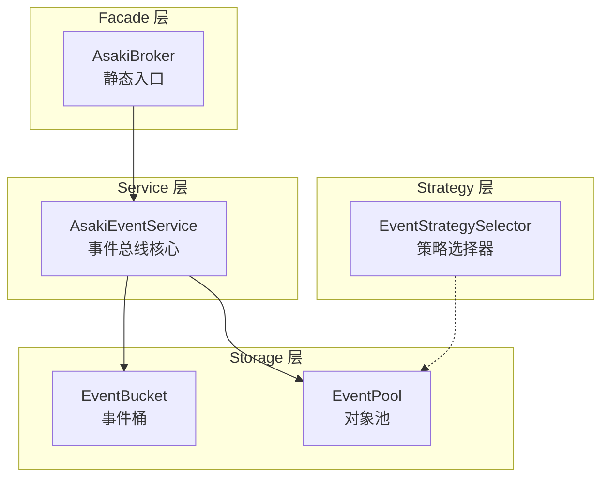
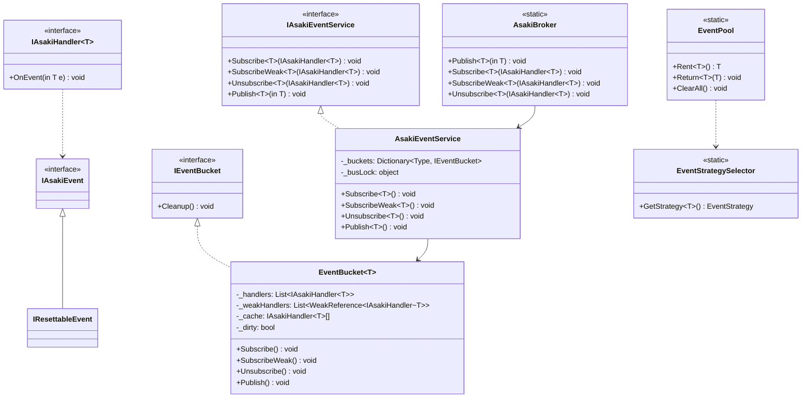
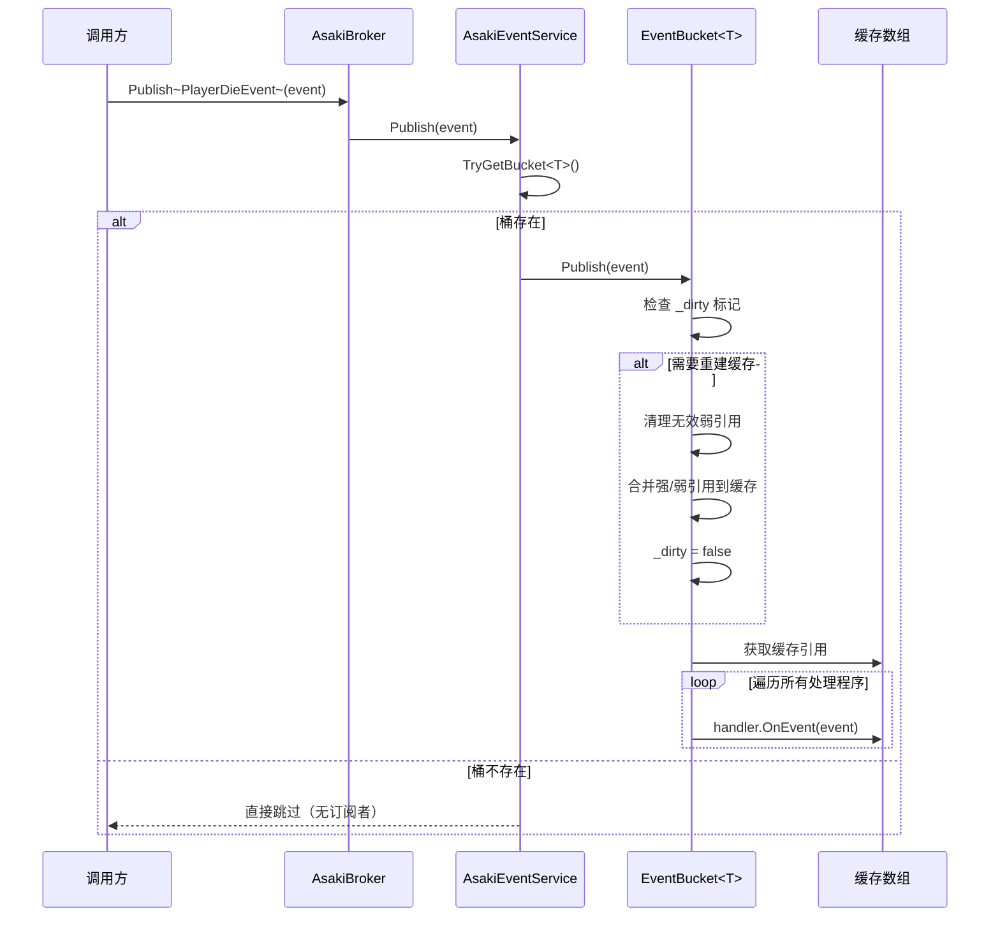
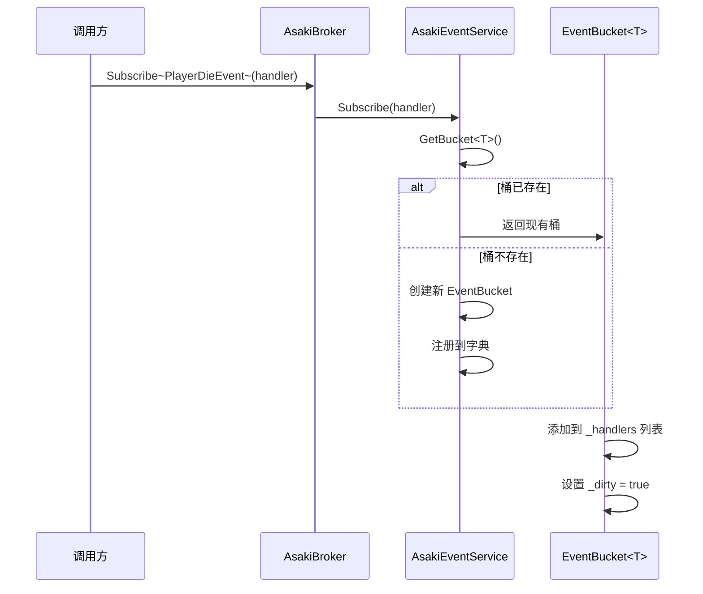

# Asaki Broker 事件总线架构文档

## 目录

1. [概述](#1-概述)
2. [设计理念](#2-设计理念)
3. [软件架构](#3-软件架构)
4. [API 参考](#4-api-参考)
5. [好的示例](#5-好的示例)
6. [坏的示例](#6-坏的示例)
7. [性能优化指南](#7-性能优化指南)
8. [常见问题](#8-常见问题)

---

## 1. 概述

### 1.1 模块定位

Asaki Broker 是 Asaki Unity 框架的**事件总线系统**，负责模块间的通信。它采用**桶策略（Bucket Strategy）**实现高性能事件发布/订阅，支持**弱引用订阅**和**对象池复用**，是框架内部模块解耦的核心基础设施。

### 1.2 核心特性

| 特性             | 描述                                       |
| ---------------- | ------------------------------------------ |
| **桶策略**       | 每个事件类型独立订阅列表，避免全局锁竞争   |
| **Facade 模式**  | 静态入口，解决 IL2CPP 静态构造函数热更问题 |
| **零 GC 发布**   | 极速遍历缓存数组，发布路径零分配           |
| **弱引用订阅**   | 自动清理 GC 回收的处理程序，避免内存泄漏   |
| **对象池复用**   | 大事件类复用，减少 GC 压力                 |
| **策略自动选择** | 自动选择 Struct/ClassPool 策略             |

### 1.3 模块结构

```
Assets/Asaki/Core/Broker/
├── AsakiBroker.cs              # [Facade] 静态入口
├── AsakiEventService.cs        # [Implementation] 事件总线核心实现
├── IAsakiEventService.cs       # [Interface] 事件服务接口
├── IAsakiEvent.cs              # [Interface] 事件基础接口
├── IResettableEvent.cs         # [Interface] 可重置事件接口
├── EventPool.cs                # [Feature] 事件对象池管理器
├── EventStrategySelector.cs    # [Feature] 事件策略选择器
├── AsakiListenerAttribute.cs   # [Attribute] 监听器特性
└── LargeEventAttribute.cs       # [Attribute] 大事件/小事件特性
```

---

## 2. 设计理念

### 2.1 为什么选择 Facade 模式

#### 2.1.1 IL2CPP 热更问题

在 Unity 的 IL2CPP 编译模式下，静态构造函数存在以下致命缺陷：

1. **无法热更**：静态构造函数在程序集加载时执行，热更后无法重新初始化
2. **无法重置**：静态状态在游戏运行时无法清理，导致切换场景时内存泄漏
3. **全局状态污染**：静态实例持有引用，阻止对象 GC

#### 2.1.2 AsakiBroker 解决方案

AsakiBroker 采用**懒加载 + 双重检查锁定**模式，将静态入口与动态实例分离：

```csharp
public static class AsakiBroker
{
    private static IAsakiEventService GetOrRegisterBus()
    {
        // 从 AsakiContext 获取已有实例（热更时可重新注入）
        return AsakiContext.TryGet(out IAsakiEventService bus)
            ? bus
            : AsakiContext.GetOrRegister<IAsakiEventService>(() => new AsakiEventService());
    }
}
```

**优势**：

- 静态方法仅作为入口，不持有任何状态
- 实际业务逻辑在 `AsakiEventService` 实例中，可随时替换
- 热更时只需替换 `AsakiContext` 中的实例即可

### 2.2 桶策略的设计动机

#### 2.2.1 传统事件总线的问题

传统单列表事件总线存在以下问题：

```csharp
// ❌ 传统实现：全局锁 + 线性搜索
public class BadEventBus
{
    private readonly List<IHandler> _allHandlers = new();
    private readonly object _lock = new();

    public void Publish(IEvent e)
    {
        lock (_lock)  // 全局锁，所有事件共享
        {
            foreach (var handler in _allHandlers)  // 线性搜索
            {
                handler.Handle(e);
            }
        }
    }
}
```

**问题**：

- 所有事件类型共享同一个锁，高并发时严重阻塞
- 每次发布都要遍历所有处理程序，即使没有订阅者
- 添加/移除订阅时影响所有事件类型

#### 2.2.2 桶策略优势

```csharp
// ✅ Asaki 实现：每个事件类型独立桶
private readonly Dictionary<Type, IEventBucket> _buckets = new();

// 桶内使用细粒度锁
private class EventBucket<T>
{
    private readonly List<IAsakiHandler<T>> _handlers = new();
    private readonly object _bucketLock = new();
}
```

**优势**：

- 不同事件类型使用不同锁，无锁竞争
- 只遍历对应桶的处理程序，无多余检查
- 添加/移除订阅仅影响特定类型

### 2.3 零 GC 发布路径的性能优势

#### 2.3.1 Copy-On-Write 缓存策略

AsakiEventService 使用**写时复制（Copy-On-Write）**策略优化读取路径：

```csharp
public void Publish(in T e)
{
    // 1. 双检锁定：仅在订阅列表变化时更新缓存
    if (_dirty)
    {
        lock (_bucketLock)
        {
            if (_dirty)
            {
                // 重建缓存数组
                _cache = RebuildCache();
                _dirty = false;
            }
        }
    }

    // 2. 极速遍历：无锁读取缓存数组 (Zero GC)
    var array = _cache;
    int count = array.Length;
    for (int i = 0; i < count; i++)
    {
        array[i].OnEvent(e);
    }
}
```

**性能优势**：

| 指标       | 传统实现       | Asaki 实现   |
| ---------- | -------------- | ------------ |
| 发布分配   | 每帧分配 new[] | 零分配       |
| 遍历方式   | List 枚举      | 数组索引     |
| 锁竞争     | 全局锁         | 细粒度桶锁   |
| 弱引用清理 | 每次遍历       | 仅订阅变化时 |

#### 2.3.2 引用传递优化

使用 `in` 关键字避免结构体复制：

```csharp
// ✅ 正确：使用 in 关键字，避免结构体复制
public void Publish<T>(in T e) where T : IAsakiEvent

// ❌ 错误：值传递会导致结构体复制
public void Publish<T>(T e) where T : IAsakiEvent
```

### 2.4 弱引用机制的必要性

在 Unity 游戏中，处理程序的生命周期往往难以控制：

```csharp
public class PlayerController : MonoBehaviour
{
    private void OnEnable()
    {
        // 订阅事件
        AsakiBroker.Subscribe<PlayerDieEvent>(this);
    }

    // ❌ 常见错误：未取消订阅
    // 当 PlayerController 被销毁后，
    // 订阅关系仍然存在，导致内存泄漏
}
```

**解决方案**：使用弱引用订阅

```csharp
// ✅ 正确：使用弱引用订阅
AsakiBroker.SubscribeWeak<PlayerDieEvent>(this);

// 当 PlayerController 被 GC 回收后，
// 订阅自动失效，无需手动取消订阅
```

---

## 3. 软件架构

### 3.1 架构分层

Asaki Broker 采用经典的**三层架构**设计：



### 3.2 核心类图



### 3.3 事件发布/订阅流程

#### 3.3.1 发布流程



#### 3.3.2 订阅流程



### 3.4 线程安全设计

#### 3.4.1 双重检查锁定模式

```csharp
[MethodImpl(MethodImplOptions.AggressiveInlining)]
private EventBucket<T> GetBucket<T>() where T : IAsakiEvent
{
    // 快速检查：无锁读取
    if (TryGetBucket<T>(out var bucket))
        return bucket;

    // 慢速创建：加锁
    lock (_busLock)
    {
        // 双重检查：防止并发创建
        if (TryGetBucket(out bucket))
            return bucket;

        bucket = new EventBucket<T>();
        _buckets[typeof(T)] = bucket;
        return bucket;
    }
}
```

#### 3.4.2 桶内读写分离

```csharp
public void Publish(in T e)
{
    // 读取路径：无锁（仅读取缓存数组引用）
    if (_dirty)
    {
        lock (_bucketLock)  // 仅在需要更新时加锁
        {
            // ...重建缓存
        }
    }

    // 读取缓存数组（无锁）
    var array = _cache;
    for (int i = 0; i < array.Length; i++)
    {
        array[i].OnEvent(e);
    }
}
```

---

## 4. API 参考

### 4.1 AsakiBroker 静态入口

AsakiBroker 是事件的静态入口点，提供发布、订阅和取消订阅的便捷方法。

#### 4.1.1 Publish<T> 发布事件

```csharp
public static void Publish<T>(in T e) where T : IAsakiEvent
```

**参数说明**：

| 参数 | 类型   | 描述                           |
| ---- | ------ | ------------------------------ |
| `e`  | `in T` | 要发布的事件实例，只读引用传递 |

**使用示例**：

```csharp
// 定义事件
public struct PlayerDieEvent : IAsakiEvent
{
    public int PlayerId;
    public string Reason;
}

// 发布事件
var event = new PlayerDieEvent { PlayerId = 1001, Reason = "被怪物击杀" };
AsakiBroker.Publish(event);
```

**性能提示**：使用 `in` 关键字避免结构体复制。

---

#### 4.1.2 Subscribe<T> 订阅事件

```csharp
public static void Subscribe<T>(IAsakiHandler<T> handler) where T : IAsakiEvent
```

**参数说明**：

| 参数      | 类型               | 描述                 |
| --------- | ------------------ | -------------------- |
| `handler` | `IAsakiHandler<T>` | 要订阅的事件处理程序 |

**异常**：

| 异常类型                | 触发条件        |
| ----------------------- | --------------- |
| `ArgumentNullException` | handler 为 null |

**使用示例**：

```csharp
public class GameOverHandler : IAsakiHandler<PlayerDieEvent>
{
    public void OnEvent(in PlayerDieEvent e)
    {
        Debug.Log($"玩家 {e.PlayerId} 死亡: {e.Reason}");
    }
}

// 订阅事件
var handler = new GameOverHandler();
AsakiBroker.Subscribe<PlayerDieEvent>(handler);
```

---

#### 4.1.3 SubscribeWeak<T> 弱引用订阅

```csharp
public static void SubscribeWeak<T>(IAsakiHandler<T> handler) where T : IAsakiEvent
```

**参数说明**：

| 参数      | 类型               | 描述                           |
| --------- | ------------------ | ------------------------------ |
| `handler` | `IAsakiHandler<T>` | 要订阅的事件处理程序（弱引用） |

**使用场景**：

- 处理程序生命周期不确定
- 无法保证及时取消订阅
- 避免内存泄漏

**使用示例**：

```csharp
public class PlayerController : MonoBehaviour, IAsakiHandler<PlayerDieEvent>
{
    private void OnEnable()
    {
        // 使用弱引用订阅，销毁时自动失效
        AsakiBroker.SubscribeWeak<PlayerDieEvent>(this);
    }

    public void OnEvent(in PlayerDieEvent e)
    {
        Debug.Log($"玩家 {e.PlayerId} 死亡");
    }
}
```

---

#### 4.1.4 Unsubscribe<T> 取消订阅

```csharp
public static void Unsubscribe<T>(IAsakiHandler<T> handler) where T : IAsakiEvent
```

**参数说明**：

| 参数      | 类型               | 描述                     |
| --------- | ------------------ | ------------------------ |
| `handler` | `IAsakiHandler<T>` | 要取消订阅的事件处理程序 |

**说明**：

- 如果事件总线不存在，直接忽略（未订阅过）
- 如果处理程序不在订阅列表中，无操作

**使用示例**：

```csharp
public class PlayerController : MonoBehaviour, IAsakiHandler<PlayerDieEvent>
{
    private void OnEnable()
    {
        AsakiBroker.Subscribe<PlayerDieEvent>(this);
    }

    private void OnDisable()
    {
        // 手动取消订阅
        AsakiBroker.Unsubscribe<PlayerDieEvent>(this);
    }

    public void OnEvent(in PlayerDieEvent e)
    {
        // 处理事件
    }
}
```

---

### 4.2 IAsakiEventService 接口

事件服务的核心接口，定义事件订阅、取消订阅和发布的方法。

#### 4.2.1 方法总览

| 方法                                 | 描述               |
| ------------------------------------ | ------------------ |
| `Subscribe<T>(IAsakiHandler<T>)`     | 订阅事件（强引用） |
| `SubscribeWeak<T>(IAsakiHandler<T>)` | 订阅事件（弱引用） |
| `Unsubscribe<T>(IAsakiHandler<T>)`   | 取消订阅           |
| `Publish<T>(in T)`                   | 发布事件           |
| `Dispose()`                          | 释放事件总线资源   |

#### 4.2.2 Subscribe<T> 方法

```csharp
void Subscribe<T>(IAsakiHandler<T> handler) where T : IAsakiEvent
```

**参数说明**：

| 参数      | 类型               | 描述                 |
| --------- | ------------------ | -------------------- |
| `handler` | `IAsakiHandler<T>` | 要订阅的事件处理程序 |

**说明**：

- 将处理程序添加到对应事件类型的订阅列表
- 如果处理程序已存在，不重复添加

---

#### 4.2.3 SubscribeWeak<T> 方法

```csharp
void SubscribeWeak<T>(IAsakiHandler<T> handler) where T : IAsakiEvent
```

**说明**：

- 使用弱引用存储处理程序
- 当处理程序被 GC 回收后，订阅自动失效
- 性能略低于强引用订阅

---

#### 4.2.4 Unsubscribe<T> 方法

```csharp
void Unsubscribe<T>(IAsakiHandler<T> handler) where T : IAsakiEvent
```

**说明**：

- 从订阅列表中移除处理程序
- 同时检查强引用和弱引用列表

---

#### 4.2.5 Publish<T> 方法

```csharp
void Publish<T>(in T e) where T : IAsakiEvent
```

**参数说明**：

| 参数 | 类型   | 描述             |
| ---- | ------ | ---------------- |
| `e`  | `in T` | 要发布的事件实例 |

**异常处理**：

- 不捕获异常，让异常冒泡到调用者
- 如果任一 handler 抛出异常，后续 handler 将不会被执行

---

### 4.3 IAsakiEvent 接口

所有事件的基接口。

```csharp
public interface IAsakiEvent { }
```

**使用示例**：

```csharp
// 简单事件（结构体）
public struct DamageEvent : IAsakiEvent
{
    public int SourceId;
    public int TargetId;
    public int Damage;
}

// 复杂事件（类）
[LargeEvent]
public class QuestCompleteEvent : IAsakiEvent
{
    public int QuestId;
    public string QuestName;
    public List<Reward> Rewards;
}
```

---

### 4.4 IAsakiHandler<T> 接口

事件处理程序的接口。

```csharp
public interface IAsakiHandler<T> where T : IAsakiEvent
{
    void OnEvent(in T e);
}
```

**泛型约束**：

| 约束                    | 说明                                 |
| ----------------------- | ------------------------------------ |
| `where T : IAsakiEvent` | 泛型类型 T 必须实现 IAsakiEvent 接口 |

**使用示例**：

```csharp
// 方式1：实现接口
public class DamageHandler : IAsakiHandler<DamageEvent>
{
    public void OnEvent(in DamageEvent e)
    {
        Debug.Log($"造成 {e.Damage} 点伤害");
    }
}

// 方式2：使用 lambda（注意：无法取消订阅）
AsakiBroker.Subscribe<DamageEvent>(new DamageHandler());

// 方式3：MonoBehaviour 实现
public class Player : MonoBehaviour, IAsakiHandler<DamageEvent>
{
    public void OnEvent(in DamageEvent e)
    {
        if (e.TargetId == GetInstanceID())
        {
            // 受到伤害
        }
    }
}
```

---

### 4.5 IResettableEvent 接口

可重置事件接口，用于对象池中的事件清理。

```csharp
public interface IResettableEvent : IAsakiEvent
{
    void Reset();
}
```

**使用示例**：

```csharp
[LargeEvent]
public class SpawnEvent : IAsakiEvent, IResettableEvent
{
    public Vector3 Position;
    public int PrefabId;
    public float Delay;

    public void Reset()
    {
        Position = Vector3.zero;
        PrefabId = 0;
        Delay = 0f;
    }
}
```

---

### 4.6 EventPool 事件对象池

事件对象池管理器，用于管理大事件类的复用。

#### 4.6.1 Rent<T> 租借对象

```csharp
public static T Rent<T>() where T : class, new()
```

**返回值**：从池中获取的对象实例，如果没有可用对象则创建新实例。

---

#### 4.6.2 Return<T> 归还对象

```csharp
public static void Return<T>(T obj) where T : class, new()
```

**参数说明**：

| 参数  | 类型 | 描述             |
| ----- | ---- | ---------------- |
| `obj` | `T`  | 要归还的对象实例 |

**泛型约束**：

| 约束              | 说明                            |
| ----------------- | ------------------------------- |
| `where T : class` | 泛型类型 T 必须是引用类型       |
| `where T : new()` | 泛型类型 T 必须具有无参构造函数 |

**说明**：

- 如果对象实现了 `IResettableEvent`，自动调用 `Reset()`
- 池满时对象被丢弃，等待 GC

---

#### 4.6.3 ClearAll 清空所有池

```csharp
public static void ClearAll()
```

**说明**：

- 清空所有事件类型的对象池
- 调用每个池的 `Dispose()` 方法

**异常处理**：

- 如果池中的对象 `Dispose()` 方法抛出异常，会被捕获并记录，但不会阻止其他池的清理
- 建议在调用 `ClearAll()` 前确保没有正在使用的事件对象

---

### 4.7 EventStrategySelector 事件策略选择器

自动选择事件类型策略（结构体 vs 类+对象池）。

#### 4.7.1 EventStrategy 枚举

```csharp
public enum EventStrategy
{
    Auto,       // 自动选择
    Struct,     // 使用结构体
    ClassPool,  // 使用类+对象池
}
```

#### 4.7.2 GetStrategy<T> 方法

```csharp
public static EventStrategy GetStrategy<T>()
```

**策略计算规则**：

1. **显式标记优先**：
    - 标记 `[LargeEvent]` → ClassPool
    - 标记 `[SmallEvent]` → Struct

2. **类型判断**：
    - 引用类型（class）→ ClassPool

3. **大小估算**（仅对结构体）：
    - 大于阈值（默认32字节）→ ClassPool
    - 小于等于阈值 → Struct

#### 4.7.3 ClearCache 方法

```csharp
public static void ClearCache()
```

**说明**：

- 清除所有事件类型的策略缓存
- 强制重新计算策略，适用于运行时动态加载程序集的场景

**使用场景**：

- 热更后重新计算事件策略
- 动态加载新事件类型后刷新缓存

**示例**：

```csharp
// 热更后清除缓存
EventStrategySelector.ClearCache();
```

---

### 4.8 AsakiListenerAttribute 特性

标记方法为事件监听器（用于代码生成）。

```csharp
[AttributeUsage(AttributeTargets.Method, AllowMultiple = false, Inherited = false)]
public sealed class AsakiListenerAttribute : Attribute { }
```

**使用场景**：

- 配合 Roslyn 代码生成器
- 自动将标记的方法注册为事件处理程序

---

### 4.9 LargeEventAttribute 特性

标记事件为大事件，强制使用类+对象池模式。

```csharp
[AttributeUsage(AttributeTargets.Struct | AttributeTargets.Class, AllowMultiple = false)]
public sealed class LargeEventAttribute : Attribute
{
    /// <summary>
    /// 估算的事件大小（字节），可选
    /// </summary>
    public int EstimatedSize { get; set; }

    public LargeEventAttribute() { }

    public LargeEventAttribute(int estimatedSize)
    {
        EstimatedSize = estimatedSize;
    }
}
```

**属性说明**：

| 属性            | 类型  | 描述                                                     |
| --------------- | ----- | -------------------------------------------------------- |
| `EstimatedSize` | `int` | 估算的事件大小（字节），用于策略选择。可选，默认值为 0。 |

**使用示例**：

```csharp
// 强制使用类+对象池
[LargeEvent(EstimatedSize = 128)]
public struct BigEvent : IAsakiEvent
{
    public byte[] Data;
    public Dictionary<string, object> Extra;
}
```

---

### 4.10 SmallEventAttribute 特性

标记事件为小事件，强制使用结构体模式。

```csharp
[AttributeUsage(AttributeTargets.Struct | AttributeTargets.Class, AllowMultiple = false)]
public sealed class SmallEventAttribute : Attribute { }
```

**说明**：

- 标记后即使事件类型是 class，也会强制使用结构体策略
- 适用于需要零 GC 发布但类型定义为类的特殊情况

**使用示例**：

```csharp
// 强制使用结构体
[SmallEvent]
public struct SmallEvent : IAsakiEvent
{
    public int Id;
    public bool Flag;
}

// 强制类也使用结构体策略（特殊情况）
[SmallEvent]
public class SmallClassEvent : IAsakiEvent
{
    public int Value;
}
```

---

## 5. 好的示例

### 5.1 基本发布/订阅示例

#### 5.1.1 定义事件

```csharp
using Asaki.Core.Broker;

// 方式1：结构体事件（推荐小事件）
public struct PlayerDieEvent : IAsakiEvent
{
    public int PlayerId;
    public string Reason;
    public Vector3 Position;
}

// 方式2：类事件（用于大事件）
[LargeEvent]
public class QuestCompleteEvent : IAsakiEvent
{
    public int QuestId;
    public string QuestName;
    public List<string> Rewards;
}
```

#### 5.1.2 定义处理程序

```csharp
using Asaki.Core.Broker;

// 实现 IAsakiHandler 接口
public class GameOverHandler : IAsakiHandler<PlayerDieEvent>
{
    public void OnEvent(in PlayerDieEvent e)
    {
        Debug.Log($"玩家 {e.PlayerId} 在 {e.Position} 死亡: {e.Reason}");
    }
}
```

#### 5.1.3 订阅和发布

```csharp
public class GameManager : MonoBehaviour
{
    private GameOverHandler _handler;

    private void Start()
    {
        // 创建处理程序实例
        _handler = new GameOverHandler();

        // 订阅事件
        AsakiBroker.Subscribe<PlayerDieEvent>(_handler);
    }

    private void OnDestroy()
    {
        // 取消订阅（重要！）
        AsakiBroker.Unsubscribe<PlayerDieEvent>(_handler);
    }

    // 在适当的时机发布事件
    public void OnPlayerDead(int playerId, string reason)
    {
        var evt = new PlayerDieEvent
        {
            PlayerId = playerId,
            Reason = reason,
            Position = Vector3.zero
        };

        AsakiBroker.Publish(evt);
    }
}
```

### 5.2 MonoBehaviour 实现示例

```csharp
using UnityEngine;
using Asaki.Core.Broker;

public class PlayerController : MonoBehaviour, IAsakiHandler<QuestCompleteEvent>
{
    private void OnEnable()
    {
        // 在 OnEnable 中订阅
        AsakiBroker.SubscribeWeak<QuestCompleteEvent>(this);
    }

    private void OnDisable()
    {
        // 在 OnDisable 中取消订阅
        AsakiBroker.Unsubscribe<QuestCompleteEvent>(this);
    }

    public void OnEvent(in QuestCompleteEvent e)
    {
        Debug.Log($"完成任务: {e.QuestName}");
        // 处理任务完成逻辑
    }
}
```

### 5.3 结构体事件 vs 类事件

#### 5.3.1 小事件（使用结构体）

```csharp
// 推荐：小于32字节的事件使用结构体
public struct GameStartEvent : IAsakiEvent
{
    public int LevelId;
    public float TimeLimit;
}

public struct GamePauseEvent : IAsakiEvent
{
    public bool IsPaused;
}

// 使用：Zero GC，栈分配
var evt = new GameStartEvent { LevelId = 1, TimeLimit = 60f };
AsakiBroker.Publish(evt);  // 无分配
```

#### 5.3.2 大事件（使用类 + 对象池）

```csharp
// 大于32字节的事件使用类+对象池
[LargeEvent]
public class LargeDataEvent : IAsakiEvent, IResettableEvent
{
    public byte[] Data;
    public Dictionary<string, object> Metadata;

    public void Reset()
    {
        Data = null;
        Metadata?.Clear();
    }
}

// 使用：从对象池租借
var evt = EventPool.Rent<LargeDataEvent>();
evt.Data = new byte[1024];
evt.Metadata = new Dictionary<string, object>();

AsakiBroker.Publish(evt);

// 归还到对象池
EventPool.Return(evt);
```

### 5.4 使用对象池的正确方式

```csharp
using UnityEngine;
using Asaki.Core.Broker;

public class NetworkManager : MonoBehaviour
{
    private class NetworkEventHandler : IAsakiHandler<NetworkMessageEvent>
    {
        public void OnEvent(in NetworkMessageEvent e)
        {
            Debug.Log($"收到消息: {e.MessageType}");
        }
    }

    private NetworkEventHandler _handler;

    private void Start()
    {
        _handler = new NetworkEventHandler();
        AsakiBroker.Subscribe<NetworkMessageEvent>(_handler);
    }

    // 发布大事件时使用对象池
    public void OnNetworkMessage(string messageType, byte[] data)
    {
        // 从对象池租借
        var evt = EventPool.Rent<NetworkMessageEvent>();
        evt.MessageType = messageType;
        evt.Data = data;

        AsakiBroker.Publish(evt);

        // 立即归还（事件已处理完毕）
        EventPool.Return(evt);
    }

    private void OnDestroy()
    {
        AsakiBroker.Unsubscribe<NetworkMessageEvent>(_handler);
    }
}

// 大事件定义
[LargeEvent]
public class NetworkMessageEvent : IAsakiEvent, IResettableEvent
{
    public string MessageType;
    public byte[] Data;

    public void Reset()
    {
        MessageType = null;
        Data = null;
    }
}
```

### 5.5 弱引用订阅示例

```csharp
using UnityEngine;
using Asaki.Core.Broker;

// 当处理程序生命周期不确定时，使用弱引用订阅
public class DebugLogger : MonoBehaviour, IAsakiHandler<PlayerDieEvent>
{
    private void OnEnable()
    {
        // 弱引用订阅：销毁后自动失效，无需手动取消订阅
        AsakiBroker.SubscribeWeak<PlayerDieEvent>(this);
    }

    // 无需实现 OnDisable！
    // 当 DebugLogger 被销毁后，订阅自动失效

    public void OnEvent(in PlayerDieEvent e)
    {
        Debug.LogWarning($"[DEBUG] 玩家死亡: {e.PlayerId}");
    }
}
```

---

## 6. 坏的示例

### 6.1 内存泄漏：未取消订阅

#### 6.1.1 错误示例

```csharp
public class BadPlayerController : MonoBehaviour, IAsakiHandler<PlayerDieEvent>
{
    private void OnEnable()
    {
        // ❌ 错误：订阅后从未取消订阅
        AsakiBroker.Subscribe<PlayerDieEvent>(this);
    }

    // ❌ 错误：未实现 OnDisable
    // 当 PlayerController 被 Destroy 后，
    // 订阅关系仍然存在，导致内存泄漏

    public void OnEvent(in PlayerDieEvent e)
    {
        // 处理事件
    }
}
```

**问题**：

- 订阅关系阻止 GC 回收 PlayerController 对象
- 每次场景切换，旧的 PlayerController 无法被释放
- 长期运行后内存持续增长

#### 6.1.2 正确示例

```csharp
public class GoodPlayerController : MonoBehaviour
{
    private void OnEnable()
    {
        // ✅ 正确：订阅
        AsakiBroker.Subscribe<PlayerDieEvent>(this);
    }

    private void OnDisable()
    {
        // ✅ 正确：取消订阅
        AsakiBroker.Unsubscribe<PlayerDieEvent>(this);
    }

    public void OnEvent(in PlayerDieEvent e)
    {
        // 处理事件
    }
}
```

#### 6.1.3 替代方案：弱引用订阅

```csharp
public class GoodPlayerController : MonoBehaviour
{
    private void OnEnable()
    {
        // ✅ 正确：使用弱引用订阅，无需手动取消
        AsakiBroker.SubscribeWeak<PlayerDieEvent>(this);
    }

    // 无需 OnDisable，销毁后自动失效

    public void OnEvent(in PlayerDieEvent e)
    {
        // 处理事件
    }
}
```

### 6.2 线程安全问题

#### 6.2.1 错误示例：在非主线程发布事件

```csharp
public class NetworkClient
{
    private void OnReceiveData(byte[] data)
    {
        // ❌ 错误：在工作线程直接发布事件
        // Unity 对象只能在主线程访问
        var evt = new NetworkDataEvent { Data = data };
        AsakiBroker.Publish(evt);
    }
}

// ❌ 错误：在 Update 外部修改共享状态
public class BadExample : MonoBehaviour
{
    private int _score;

    private void Start()
    {
        // 工作线程调用
        Task.Run(() =>
        {
            // ❌ 错误：多线程竞争 _score
            _score += 100;
            AsakiBroker.Publish(new ScoreChangedEvent { Score = _score });
        });
    }
}
```

#### 6.2.2 正确示例：主线程调度

```csharp
public class NetworkClient : MonoBehaviour
{
    private Queue<NetworkDataEvent> _eventQueue = new();

    private void OnReceiveData(byte[] data)
    {
        // ✅ 正确：工作线程只负责入队
        lock (_eventQueue)
        {
            _eventQueue.Enqueue(new NetworkDataEvent { Data = data });
        }
    }

    private void Update()
    {
        // ✅ 正确：主线程处理
        while (_eventQueue.Count > 0)
        {
            NetworkDataEvent evt;
            lock (_eventQueue)
            {
                evt = _eventQueue.Dequeue();
            }
            AsakiBroker.Publish(evt);
        }
    }
}
```

### 6.3 性能陷阱

#### 6.3.1 错误示例：每帧创建新事件对象

```csharp
public class BadPerformanceExample : MonoBehaviour
{
    private void Update()
    {
        // ❌ 错误：每帧创建新事件对象
        var evt = new PlayerMoveEvent
        {
            Position = transform.position,
            Rotation = transform.rotation
        };
        AsakiBroker.Publish(evt);
    }
}

// ✅ 正确：使用结构体栈分配
public struct PlayerMoveEvent : IAsakiEvent
{
    public Vector3 Position;
    public Quaternion Rotation;
}
```

#### 6.3.2 错误示例：在事件处理中执行耗时操作

```csharp
public class BadHandler : IAsakiHandler<PlayerDieEvent>
{
    public void OnEvent(in PlayerDieEvent e)
    {
        // ❌ 错误：在事件处理中执行耗时操作
        // 会阻塞其他处理程序的执行
        Thread.Sleep(1000);  // 模拟耗时操作
        SaveToDatabase();    // 耗时IO操作
    }
}

// ✅ 正确：异步处理
public class GoodHandler : IAsakiHandler<PlayerDieEvent>
{
    public void OnEvent(in PlayerDieEvent e)
    {
        // ✅ 正确：快速返回，异步执行
        _ = Task.Run(() => SaveToDatabase(e));
    }

    private async Task SaveToDatabase(PlayerDieEvent e)
    {
        // 异步保存
        await Task.Delay(1000);
    }
}
```

#### 6.3.3 错误示例：频繁创建小类事件

```csharp
// ❌ 错误：频繁创建类事件，导致 GC 压力
public class BadSmallEvent : IAsakiEvent
{
    public int Value;
}

// ✅ 正确：小事件使用结构体
public struct GoodSmallEvent : IAsakiEvent
{
    public int Value;
}
```

### 6.4 常见错误汇总

| 错误类型 | 错误代码             | 正确代码               | 后果               |
| -------- | -------------------- | ---------------------- | ------------------ |
| 内存泄漏 | 未取消订阅           | `OnDisable` 中取消订阅 | 内存持续增长       |
| 线程安全 | 工作线程发布         | 主线程调度             | Unity 对象访问异常 |
| 性能问题 | 每帧 new 类          | 使用结构体             | GC 压力增大        |
| 性能问题 | 处理中耗时操作       | 异步处理               | 帧率下降           |
| 空引用   | handler = null       | 参数校验               | 抛出异常           |
| 泛型约束 | 忘记 `: IAsakiEvent` | 添加约束               | 编译错误           |

---

## 7. 性能优化指南

### 7.1 事件类型选择

| 场景             | 推荐类型             | 原因         |
| ---------------- | -------------------- | ------------ |
| 小于32字节       | struct               | 栈分配，零GC |
| 大于32字节       | class + [LargeEvent] | 减少复制成本 |
| 频繁发布（每帧） | struct               | 避免GC       |
| 携带大数据       | class + EventPool    | 复用减少分配 |

### 7.2 订阅方式选择

| 场景                  | 推荐方式                     | 原因         |
| --------------------- | ---------------------------- | ------------ |
| MonoBehaviour生命周期 | SubscribeWeak                | 自动失效     |
| 明确生命周期          | Subscribe + Unsubscribe      | 更高性能     |
| 临时订阅              | Subscribe + 及时 Unsubscribe | 避免内存泄漏 |

### 7.3 发布优化技巧

1. **使用 `in` 关键字**：

    ```csharp
    // ✅ 正确
    AsakiBroker.Publish(in myEvent);

    // ❌ 错误
    AsakiBroker.Publish(myEvent);
    ```

2. **避免在发布时创建闭包**：

    ```csharp
    // ❌ 错误：闭包捕获变量
    int capturedValue = 100;
    AsakiBroker.Publish(new Event { Value = capturedValue });  // 每次创建新委托

    // ✅ 正确：预先创建事件
    var evt = new Event { Value = 100 };
    AsakiBroker.Publish(in evt);
    ```

3. **使用对象池处理大事件**：
    ```csharp
    // ✅ 正确：使用对象池
    var evt = EventPool.Rent<BigEvent>();
    // ... 设置属性
    AsakiBroker.Publish(in evt);
    EventPool.Return(evt);
    ```

---

## 8. 常见问题

### 8.1 Q: 事件总线和 Unity EventSystem 的区别？

**答**：
| 特性 | Asaki Broker | Unity EventSystem |
|------|---------------|-------------------|
| 性能 | 零GC，高性能 | 有GC开销 |
| 泛型支持 | 强类型 | 运行时类型检查 |
| 弱引用 | 支持 | 不支持 |
| 对象池 | 支持 | 不支持 |

### 8.2 Q: 如何调试事件发布/订阅？

**答**：

```csharp
// 在发布前添加日志
Debug.Log($"发布事件: {typeof(T).Name}");
AsakiBroker.Publish(in evt);
```

### 8.3 Q: 事件处理顺序如何确定？

**答**：

- 订阅顺序决定处理顺序（先订阅先处理）
- 建议使用 `IComparer<T>` 或自定义优先级系统实现有序处理

### 8.4 Q: 如何实现事件的全链路追踪？

**答**：

```csharp
// 自定义包装器
public class TracedEventService : IAsakiEventService
{
    private readonly IAsakiEventService _inner;

    public void Publish<T>(in T e) where T : IAsakiEvent
    {
        Debug.Log($"[TRACE] Publish {typeof(T).Name}");
        _inner.Publish(e);
    }

    // ... 其他方法包装
}
```

---

## 附录

### A. 相关文件路径

| 文件                  | 路径                                                |
| --------------------- | --------------------------------------------------- |
| AsakiBroker           | `Assets/Asaki/Core/Broker/AsakiBroker.cs`           |
| AsakiEventService     | `Assets/Asaki/Core/Broker/AsakiEventService.cs`     |
| IAsakiEventService    | `Assets/Asaki/Core/Broker/IAsakiEventService.cs`    |
| EventPool             | `Assets/Asaki/Core/Broker/EventPool.cs`             |
| EventStrategySelector | `Assets/Asaki/Core/Broker/EventStrategySelector.cs` |

### B. 参考资料

- [Unity 事件系统最佳实践](https://docs.unity3d.com/Manual/event-system.html)
- [C# 内存模型与线程安全](https://docs.microsoft.com/zh-cn/dotnet/csharp/language-reference/language-specification/memory-model)
- [对象池模式](https://en.wikipedia.org/wiki/Object_pool_pattern)

---

_文档版本: 1.0.0_
_最后更新: 2026-03-03_
