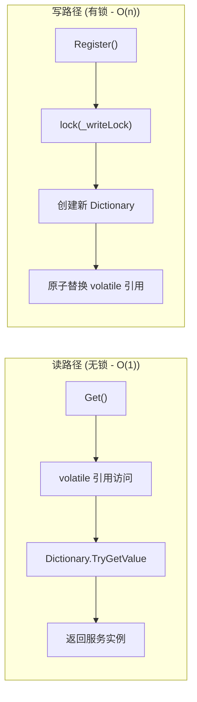
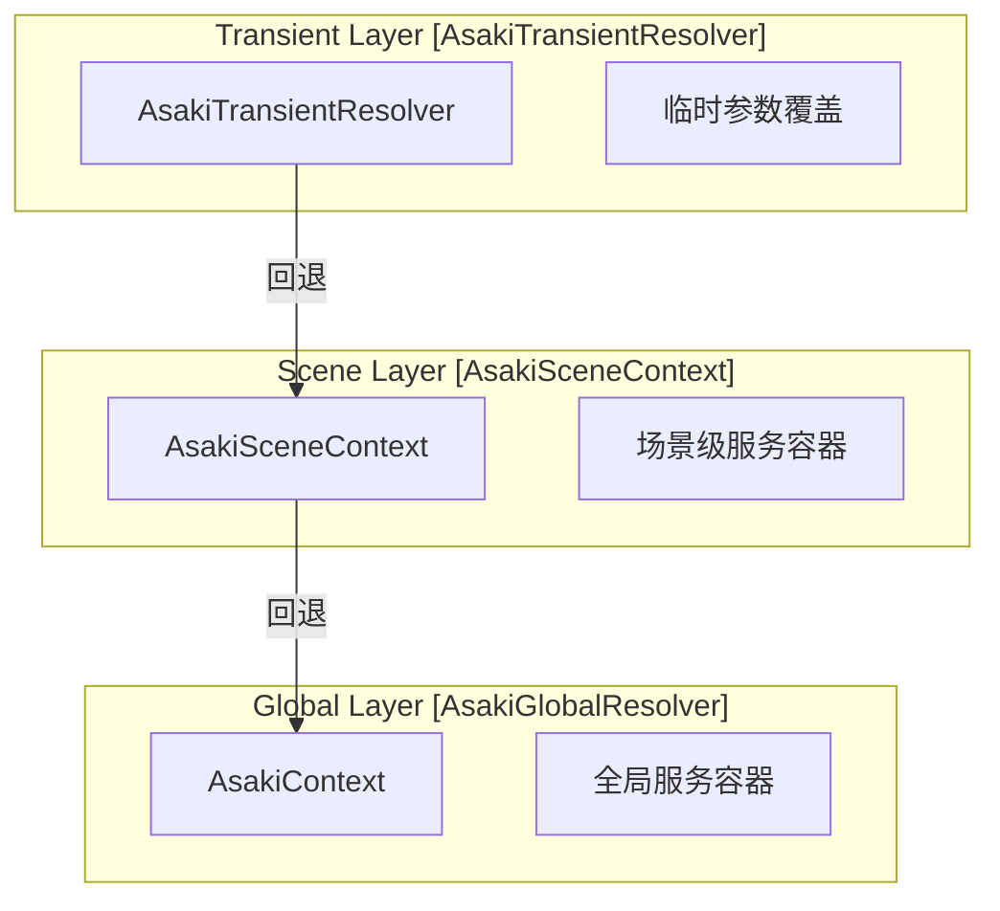
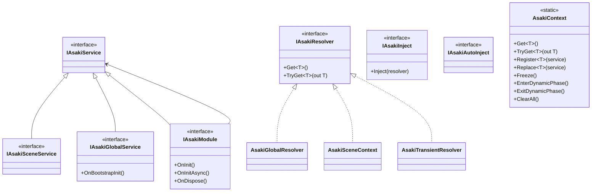
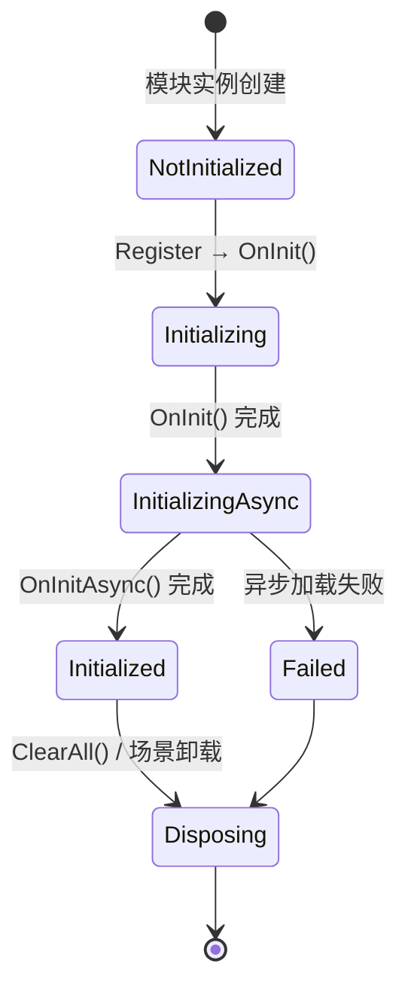
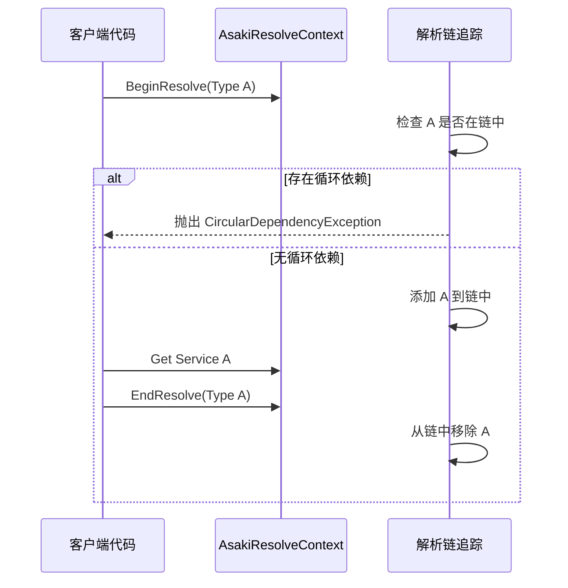
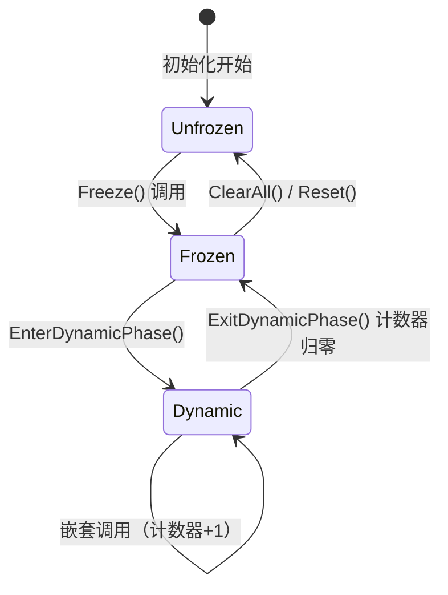
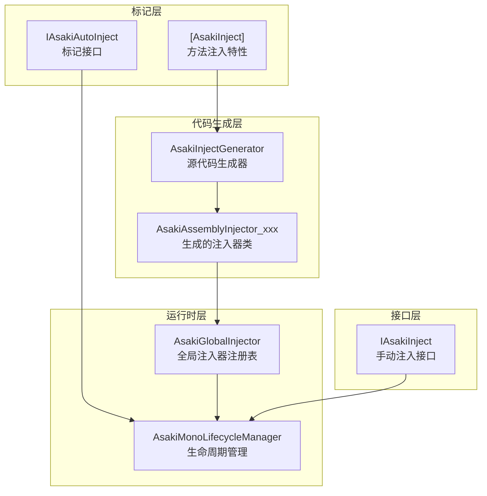

# Asaki Context 模块架构文档

## 1. 设计理念 (Design Philosophy)

### 1.1 为什么选择 Copy-On-Write 架构

传统的依赖注入容器在读取服务时通常需要加锁，这会导致严重的性能开销。特别是在游戏开发中，依赖解析（Get）操作非常频繁，每一帧可能调用数百甚至数千次。

**Copy-On-Write（写时复制）架构的核心思想**：

- **读操作（Get）**：完全无锁，直接读取 volatile 字典引用，开销等同于原生 Dictionary 查找（O(1)）
- **写操作（Register）**：需要加锁，但创建新字典并原子替换引用（O(n)，n 为服务数量）

这种架构非常适合游戏开发的实际场景：



### 1.2 无锁读架构的性能优势

在 Unity 游戏的主线程（Update/LateUpdate）中，服务解析是热路径（Hot Path）。传统的加锁方案会产生以下问题：

| 指标       | 加锁方案      | Copy-On-Write 方案 |
| ---------- | ------------- | ------------------ |
| Get 操作   | O(1) + 锁开销 | O(1) 纯内存访问    |
| 并发读     | 线程阻塞      | 完全并行           |
| GC 压力    | 低            | 极低（仅写时分配） |
| 延迟稳定性 | 受锁竞争影响  | 确定性低延迟       |

### 1.3 与传统 DI 容器的对比

| 特性         | Unity Zenject | Microsoft DI | Asaki Context              |
| ------------ | ------------- | ------------ | -------------------------- |
| 读取性能     | 加锁          | 加锁         | **无锁**                   |
| 写入频率     | 任意时期      | 任意时期     | 启动期/热更新              |
| 循环依赖检测 | 支持          | 支持         | **AsyncLocal 支持**        |
| 三层解析     | 不支持        | 不支持       | **Global/Scene/Transient** |
| 容器冻结     | 不支持        | 不支持       | **Freeze() 机制**          |
| 动态阶段     | 不支持        | 不支持       | **EnterDynamicPhase**      |

## 2. 软件架构 (Software Architecture)

### 2.1 架构分层概述

Asaki Context 采用三层解析体系，支持从全局到场景再到临时的服务作用域管理：



**解析顺序**：Transient → Scene → Global

### 2.2 核心类继承关系



### 2.3 三层解析体系详解

#### 2.3.1 全局层 (Global Layer)

全局层由 [AsakiContext](file:///e:\Projects\UnityGame\Asaki\Assets\Asaki\Core\Context\AsakiContext.cs#L19-L405) 静态类管理，提供应用程序级别的服务。

**特点**：

- 整个应用程序生命周期内存在
- Copy-On-Write 无锁读架构
- 支持容器冻结 (Freeze) 防止运行时随意注册
- 支持动态阶段 (Dynamic Phase) 允许特定时期临时注册

#### 2.3.2 场景层 (Scene Layer)

场景层由 [AsakiSceneContext](file:///e:\Projects\UnityGame\Asaki\Assets\Asaki\Core\Context\Resolvers\AsakiSceneContext.cs#L55-L569) MonoBehaviour 管理，提供场景级别的服务。

**特点**：

- 与 Unity 场景生命周期同步
- 支持纯 C# 服务和预制体服务混合注册
- 延迟 Build() 到框架就绪事件后执行
- 失败状态追踪 (BuildState 枚举)

#### 2.3.3 临时层 (Transient Layer)

临时层由 [AsakiTransientResolver](file:///e:\Projects\UnityGame\Asaki\Assets\Asaki\Core\Context\Resolvers\AsakiTransientResolver.cs#L15-L164) 结构体实现，提供临时参数覆盖。

**特点**：

- 优先使用临时参数解析服务
- 临时参数不匹配时回退到父解析器
- 适合初始化参数传递场景

### 2.4 模块生命周期管理

Asaki 模块采用三阶段生命周期：



| 阶段       | 方法                                                                                               | 时机               | 职责                       |
| ---------- | -------------------------------------------------------------------------------------------------- | ------------------ | -------------------------- |
| 同步初始化 | [OnInit()](file:///e:\Projects\UnityGame\Asaki\Assets\Asaki\Core\Context\IAsakiModule.cs#L23)      | 注册后立即调用     | 获取配置、依赖、注册子服务 |
| 异步初始化 | [OnInitAsync()](file:///e:\Projects\UnityGame\Asaki\Assets\Asaki\Core\Context\IAsakiModule.cs#L30) | 所有 OnInit 完成后 | 资源加载、网络连接         |
| 销毁       | [OnDispose()](file:///e:\Projects\UnityGame\Asaki\Assets\Asaki\Core\Context\IAsakiModule.cs#L37)   | ClearAll/场景卸载  | 清理非托管资源             |

### 2.5 循环依赖检测机制

Asaki 使用 AsyncLocal 实现线程隔离的循环依赖检测：



**关键特性**：

- 使用 [AsyncLocal](file:///e:\Projects\UnityGame\Asaki\Assets\Asaki\Core\Context\IAsakiResolver.cs#L92) 确保异步上下文隔离
- 同时使用 HashSet 和 Stack 进行快速检测和错误信息生成
- 完整的依赖链记录，便于定位问题

### 2.6 容器冻结机制

容器冻结是 Asaki 架构的核心保护机制：

```csharp
// 冻结后禁止新服务注册
AsakiContext.Freeze();

// 动态阶段可以临时解冻
AsakiContext.EnterDynamicPhase();
AsakiContext.Register<INewService>(newService);  // 允许
AsakiContext.ExitDynamicPhase();  // 自动重新冻结
```

**状态转换**：



## 3. API 使用 (API Reference)

### 3.1 AsakiContext 静态方法

#### 3.1.1 服务解析

| 方法                                                                                                            | 描述                                        | 性能        | 线程安全 |
| --------------------------------------------------------------------------------------------------------------- | ------------------------------------------- | ----------- | -------- |
| [Get<T>()](file:///e:\Projects\UnityGame\Asaki\Assets\Asaki\Core\Context\AsakiContext.cs#L78)                   | 获取服务实例，失败抛出 KeyNotFoundException | O(1) 无锁   | 是       |
| [TryGet<T>(out T)](file:///e:\Projects\UnityGame\Asaki\Assets\Asaki\Core\Context\AsakiContext.cs#L113)          | 尝试获取服务，安全版本                      | O(1) 无锁   | 是       |
| [Get(Type)](file:///e:\Projects\UnityGame\Asaki\Assets\Asaki\Core\Context\AsakiContext.cs#L97)                  | 非泛型版本，用于运行时反射                  | O(1) 无锁   | 是       |
| [GetOrRegister<T>(Func<T>)](file:///e:\Projects\UnityGame\Asaki\Assets\Asaki\Core\Context\AsakiContext.cs#L244) | 获取或注册，懒加载模式                      | O(1) + O(n) | 是       |

#### 3.1.2 服务注册

| 方法                                                                                                 | 描述         | 性能      | 注意事项   |
| ---------------------------------------------------------------------------------------------------- | ------------ | --------- | ---------- |
| [Register<T>(T)](file:///e:\Projects\UnityGame\Asaki\Assets\Asaki\Core\Context\AsakiContext.cs#L135) | 注册新服务   | O(n) 有锁 | 冻结后失败 |
| [Replace<T>(T)](file:///e:\Projects\UnityGame\Asaki\Assets\Asaki\Core\Context\AsakiContext.cs#L158)  | 替换现有服务 | O(n) 有锁 | 允许热更新 |

#### 3.1.3 架构控制

| 方法                                                                                                      | 描述                       |
| --------------------------------------------------------------------------------------------------------- | -------------------------- |
| [Freeze()](file:///e:\Projects\UnityGame\Asaki\Assets\Asaki\Core\Context\AsakiContext.cs#L318)            | 冻结容器，禁止新注册       |
| [EnterDynamicPhase()](file:///e:\Projects\UnityGame\Asaki\Assets\Asaki\Core\Context\AsakiContext.cs#L276) | 进入动态阶段，允许临时注册 |
| [ExitDynamicPhase()](file:///e:\Projects\UnityGame\Asaki\Assets\Asaki\Core\Context\AsakiContext.cs#L294)  | 退出动态阶段               |
| [ClearAll()](file:///e:\Projects\UnityGame\Asaki\Assets\Asaki\Core\Context\AsakiContext.cs#L335)          | 清空并销毁所有服务         |
| [Reset()](file:///e:\Projects\UnityGame\Asaki\Assets\Asaki\Core\Context\AsakiContext.cs#L396)             | 重置容器（不销毁服务）     |

#### 3.1.4 状态查询

| 属性                                                                                                | 描述             |
| --------------------------------------------------------------------------------------------------- | ---------------- |
| [IsReady](file:///e:\Projects\UnityGame\Asaki\Assets\Asaki\Core\Context\AsakiContext.cs#L50)        | 框架是否就绪     |
| [IsDynamicPhase](file:///e:\Projects\UnityGame\Asaki\Assets\Asaki\Core\Context\AsakiContext.cs#L56) | 是否处于动态阶段 |

### 3.2 IAsakiResolver 接口

[接口定义](file:///e:\Projects\UnityGame\Asaki\Assets\Asaki\Core\Context\IAsakiResolver.cs#L227-L246)：

```csharp
public interface IAsakiResolver
{
    /// <summary>
    /// 获取指定类型的服务实例
    /// </summary>
    T Get<T>() where T : class, IAsakiService;

    /// <summary>
    /// 尝试获取指定类型的服务实例
    /// </summary>
    bool TryGet<T>(out T service) where T : class, IAsakiService;
}
```

**实现类**：

| 实现                                                                                                                            | 描述       |
| ------------------------------------------------------------------------------------------------------------------------------- | ---------- |
| [AsakiGlobalResolver](file:///e:\Projects\UnityGame\Asaki\Assets\Asaki\Core\Context\Resolvers\AsakiGlobalResolver.cs#L15)       | 全局解析器 |
| [AsakiSceneContext](file:///e:\Projects\UnityGame\Asaki\Assets\Asaki\Core\Context\Resolvers\AsakiSceneContext.cs#L55)           | 场景解析器 |
| [AsakiTransientResolver](file:///e:\Projects\UnityGame\Asaki\Assets\Asaki\Core\Context\Resolvers\AsakiTransientResolver.cs#L15) | 临时解析器 |

### 3.3 IAsakiService 接口体系

[核心接口定义](file:///e:\Projects\UnityGame\Asaki\Assets\Asaki\Core\Context\IAsakiService.cs)：

| 接口                                                                                                             | 描述                           |
| ---------------------------------------------------------------------------------------------------------------- | ------------------------------ |
| [IAsakiService](file:///e:\Projects\UnityGame\Asaki\Assets\Asaki\Core\Context\IAsakiService.cs#L10)              | 服务标记接口，所有服务必须实现 |
| [IAsakiSceneService](file:///e:\Projects\UnityGame\Asaki\Assets\Asaki\Core\Context\IAsakiService.cs#L19)         | 场景级服务标记                 |
| [IAsakiGlobalService](file:///e:\Projects\UnityGame\Asaki\Assets\Asaki\Core\Context\IAsakiService.cs#L28)        | 全局 MonoBehaviour 服务        |
| [IAsakiThreadSafeDisposable](file:///e:\Projects\UnityGame\Asaki\Assets\Asaki\Core\Context\IAsakiService.cs#L48) | 线程安全销毁接口               |

**IAsakiGlobalService 接口详解**：

```csharp
public interface IAsakiGlobalService : IAsakiService
{
    /// <summary>
    /// 在引导程序初始化阶段调用的方法。
    /// </summary>
    void OnBootstrapInit();
}
```

**调用时机**：`OnBootstrapInit()` 方法由 [AsakiBootstrapper](file:///e:\Projects\UnityGame\Asaki\Assets\Asaki\Unity\Bootstrapper\AsakiBootstrapper.cs#L434) 在 Phase 2 引导初始化阶段统一调用。

**典型用途**：

- 执行需要在 Unity 生命周期早期完成的设置
- 在服务注册后、框架完全就绪前进行初始化
- 例如：启动协程服务、注册全局事件监听器

**实现示例**：

```csharp
using UnityEngine;
using Asaki.Core.Context;

public class MyGlobalService : MonoBehaviour, IAsakiGlobalService
{
    public void OnBootstrapInit()
    {
        // 在引导阶段执行的初始化逻辑
        Debug.Log("MyGlobalService 引导初始化完成");
    }
}
```

### 3.4 依赖注入体系

Asaki 提供了三套互补的依赖注入机制，通过代码生成器实现零反射的高性能注入。

#### 3.4.1 注入机制概览



#### 3.4.2 [AsakiInject] 方法注入特性

[特性定义](file:///e:\Projects\UnityGame\Asaki\Assets\Asaki\Core\Attributes\AsakiInjectAttribute.cs#L5-L10)：

```csharp
[AttributeUsage(AttributeTargets.Method, Inherited = false, AllowMultiple = false)]
public sealed class AsakiInjectAttribute : Attribute { }
```

**核心特点**：

- **方法注入**：标记在方法上，而非属性或字段
- **代码生成**：编译时自动生成注入逻辑，零反射开销
- **O(1) 查找**：生成的注入器使用 `Dictionary<Type, Action>` 实现快速查找

**工作原理**：

[AsakiInjectGenerator](file:///e:\Projects\UnityGame\Asaki\CodeGenerator\CodeGenerator\Generators\AsakiInjectGenerator.cs) 代码生成器会：

1. 扫描所有带有 `[AsakiInject]` 特性的方法
2. 为每个程序集生成 `AsakiAssemblyInjector_{AssemblyName}` 类
3. 在静态构造函数中创建类型到注入委托的映射
4. 使用 `[RuntimeInitializeOnLoadMethod]` 自动注册到全局注入器

**生成的代码结构**：

```csharp
// 自动生成的注入器类
public class AsakiAssemblyInjector_Game_Assembly : IAsakiInjector
{
    // O(1) 字典查找
    private static readonly Dictionary<Type, Action<object, IAsakiResolver>> _injectMap = new();

    static AsakiAssemblyInjector_Game_Assembly()
    {
        // 为每个 [AsakiInject] 方法生成注入委托
        _injectMap[typeof(PlayerController)] = (target, resolver) =>
            ((PlayerController)target).Inject(resolver.Get<IGameConfig>());
    }

    [RuntimeInitializeOnLoadMethod]
    private static void AutoRegister() => AsakiGlobalInjector.Register(new AsakiAssemblyInjector_Game_Assembly());

    public void Inject(object target, IAsakiResolver resolver, HashSet<Type> injectedTypes)
    {
        if (_injectMap.TryGetValue(target.GetType(), out var action))
            action(target, resolver);
    }
}
```

**使用示例**：

```csharp
using Asaki.Core.Attributes;
using Asaki.Core.Context;

public class PlayerController : MonoBehaviour, IAsakiAutoInject
{
    private IGameConfig _config;
    private IAudioManager _audio;

    [AsakiInject]  // 标记此方法，代码生成器会自动生成注入逻辑
    private void InjectDependencies(IGameConfig config, IAudioManager audio)
    {
        _config = config;
        _audio = audio;
    }
}
```

**可选参数支持**：

```csharp
public class OptionalInjection : MonoBehaviour, IAsakiAutoInject
{
    private IGameConfig _config;
    private IOptionalService? _optional;  // 可空类型 = 可选注入

    [AsakiInject]
    private void Inject(IGameConfig config, IOptionalService? optional = null)
    {
        _config = config;
        _optional = optional;  // 如果服务未注册，则为 null
    }
}
```

| 可选参数标记方式    | 说明                     |
| ------------------- | ------------------------ |
| `T?` (可空引用类型) | C# 8.0+ 可空引用类型注解 |
| `Nullable<T>`       | 可空值类型               |
| `[ANull]` 特性      | 显式标记参数为可选       |

#### 3.4.3 IAsakiAutoInject 标记接口

[接口定义](file:///e:\Projects\UnityGame\Asaki\Assets\Asaki\Core\Context\IAsakiAutoInject.cs#L12-L13)：

```csharp
public interface IAsakiAutoInject { }
```

**用途**：指示类需要自动依赖注入。`AsakiMonoLifecycleManager` 会自动检测并处理实现了此接口的组件。

**配合使用**：

| 组合方式                                              | 注入方式     | 适用场景           |
| ----------------------------------------------------- | ------------ | ------------------ |
| `IAsakiAutoInject` + `[AsakiInject]`                  | 代码生成注入 | 推荐，零反射开销   |
| `IAsakiAutoInject` + `IAsakiInject`                   | 手动注入     | 需要自定义注入逻辑 |
| `IAsakiAutoInject` + `[AsakiInject]` + `IAsakiInject` | 混合注入     | 复杂场景           |

#### 3.4.4 IAsakiInject 手动注入接口

[接口定义](file:///e:\Projects\UnityGame\Asaki\Assets\Asaki\Core\Context\IAsakiInject.cs#L12-L20)：

```csharp
public interface IAsakiInject
{
    void Inject(IAsakiResolver resolver = null);
}
```

**使用场景**：

- 需要自定义注入逻辑
- 需要在注入时执行额外操作
- 不想依赖代码生成器

**实现示例**：

```csharp
public class CustomInjection : MonoBehaviour, IAsakiAutoInject, IAsakiInject
{
    private IGameConfig _config;

    public void Inject(IAsakiResolver resolver = null)
    {
        var effectiveResolver = resolver ?? AsakiGlobalResolver.Instance;
        _config = effectiveResolver.Get<IGameConfig>();

        // 自定义注入后逻辑
        OnDependenciesInjected();
    }

    private void OnDependenciesInjected() { /* ... */ }
}
```

#### 3.4.5 注入优先级

代码生成器根据程序集名称自动计算注入优先级：

| 程序集          | 优先级 | 说明             |
| --------------- | ------ | ---------------- |
| Asaki.Core      | 100    | 核心层，最先注入 |
| Asaki.Unity     | 200    | Unity 适配层     |
| Asaki.Plugin.\* | 500    | 插件层           |
| Game.\*         | 1000   | 游戏逻辑层       |
| 其他            | 1000+  | 基于哈希计算     |

**优先级规则**：数值越小越早执行，确保核心服务先于游戏逻辑注入。

### 3.5 IAsakiModule 接口

[模块生命周期接口](file:///e:\Projects\UnityGame\Asaki\Assets\Asaki\Core\Context\IAsakiModule.cs#L10-L38)：

**重要提示**：实现 `IAsakiModule` 接口的类必须同时标记 `[AsakiModule]` 特性，该特性来自 `Asaki.Core.Attributes` 命名空间。

```csharp
using Asaki.Core.Attributes;  // 必须引入特性命名空间

[AsakiModule]  // 必须标记此特性
public class MyModule : IAsakiModule
{
    // 模块实现
}
```

**[AsakiModule] 特性说明**：

| 属性           | 类型     | 默认值 | 描述                                            |
| -------------- | -------- | ------ | ----------------------------------------------- |
| `Priority`     | `int`    | 1000   | 启动优先级，值越小越早初始化                    |
| `Dependencies` | `Type[]` | 空数组 | 强依赖列表，确保依赖项先于本模块初始化          |
| `Optional`     | `bool`   | false  | 是否为可选模块，true 时初始化失败不阻止系统启动 |
| `TimeoutMs`    | `int`    | 30000  | 初始化超时时间（毫秒）                          |

**[AsakiModule] 使用示例**：

```csharp
// 无依赖，使用默认优先级
[AsakiModule]
public class ModuleA : IAsakiModule { }

// 指定优先级
[AsakiModule(Priority = 100)]
public class ModuleB : IAsakiModule { }

// 声明依赖关系（依赖项会先于本模块初始化）
[AsakiModule(Dependencies = new[] { typeof(ModuleA) })]
public class ModuleC : IAsakiModule { }

// 可选模块，带超时设置
[AsakiModule(Optional = true, TimeoutMs = 60000)]
public class OptionalModule : IAsakiModule { }
```

**接口定义**：

```csharp
public interface IAsakiModule : IAsakiService
{
    /// <summary>
    /// 同步初始化阶段 - 注册后立即调用
    /// </summary>
    void OnInit();

    /// <summary>
    /// 异步初始化阶段 - 所有 OnInit 完成后调用
    /// </summary>
    UniTask OnInitAsync();

    /// <summary>
    /// 销毁阶段 - ClearAll 或场景卸载时调用
    /// </summary>
    void OnDispose();
}
```

### 3.6 AsakiInjectFactory 类

[工厂类](file:///e:\Projects\UnityGame\Asaki\Assets\Asaki\Core\Context\IAsakiInject.cs#L92-L498) 提供 Prefab 实例化 + 注入一体化操作：

**支持的重载**：

| 方法                                                   | 描述               |
| ------------------------------------------------------ | ------------------ |
| `Instantiate<T>(T prefab)`                             | 无参数实例化       |
| `Instantiate<T, TArg1>(T prefab, TArg1 arg1)`          | 1 参数实例化       |
| `Instantiate<T, TArg1, TArg2>(T prefab, TArg1, TArg2)` | 2 参数实例化       |
| ...                                                    | 最多支持 10 个参数 |

**重载变体**：

- 带位置旋转：`Instantiate<T>(Vector3 position, Quaternion rotation, ...)`

### 3.7 AsakiGlobalInjector 类

[全局注入器注册表](file:///e:\Projects\UnityGame\Asaki\Assets\Asaki\Core\Context\AsakiGlobalInjector.cs#L36-L214)：

| 方法                                                                                                                        | 描述                   |
| --------------------------------------------------------------------------------------------------------------------------- | ---------------------- |
| [Register(IAsakiInjector, int?)](file:///e:\Projects\UnityGame\Asaki\Assets\Asaki\Core\Context\AsakiGlobalInjector.cs#L54)  | 注册注入器，支持优先级 |
| [Inject(object, IAsakiResolver)](file:///e:\Projects\UnityGame\Asaki\Assets\Asaki\Core\Context\AsakiGlobalInjector.cs#L103) | 执行全量注入           |

**IAsakiInjector 接口**：

```csharp
public interface IAsakiInjector
{
    /// <summary>
    /// 注入优先级（数值越小越早执行）
    /// </summary>
    int Priority => 1000;

    /// <summary>
    /// 尝试注入依赖
    /// </summary>
    void Inject(object target, IAsakiResolver resolver = null, HashSet<Type> injectedTypes = null);
}
```

### 3.8 AsakiResolveContext 循环依赖检测

[静态类](file:///e:\Projects\UnityGame\Asaki\Assets\Asaki\Core\Context\IAsakiResolver.cs#L70-L218)：

| 方法                                                                                                        | 描述                   |
| ----------------------------------------------------------------------------------------------------------- | ---------------------- |
| [BeginResolve(Type)](file:///e:\Projects\UnityGame\Asaki\Assets\Asaki\Core\Context\IAsakiResolver.cs#L133)  | 开始解析，检查循环依赖 |
| [EndResolve(Type)](file:///e:\Projects\UnityGame\Asaki\Assets\Asaki\Core\Context\IAsakiResolver.cs#L153)    | 结束解析，移除链       |
| [GetCurrentChain()](file:///e:\Projects\UnityGame\Asaki\Assets\Asaki\Core\Context\IAsakiResolver.cs#L123)   | 获取当前解析链快照     |
| [SetSourceType(Type)](file:///e:\Projects\UnityGame\Asaki\Assets\Asaki\Core\Context\IAsakiResolver.cs#L197) | 设置解析源类型         |
| [Clear()](file:///e:\Projects\UnityGame\Asaki\Assets\Asaki\Core\Context\IAsakiResolver.cs#L172)             | 清空解析链             |

### 3.9 AsakiSceneContext 场景上下文

[MonoBehaviour 组件](file:///e:\Projects\UnityGame\Asaki\Assets\Asaki\Core\Context\Resolvers\AsakiSceneContext.cs#L55-L569)：

**序列化字段**：

| 字段                  | 类型                       | 描述           |
| --------------------- | -------------------------- | -------------- |
| `_pureCSharpServices` | `List<IAsakiSceneService>` | 纯 C# 场景服务 |
| `_servicePrefabs`     | `GameObject[]`             | 服务预制体数组 |
| `_instanceParent`     | `Transform`                | 实例化父对象   |

**公共属性**：

| 属性             | 描述                  |
| ---------------- | --------------------- |
| `State`          | 构建状态 (BuildState) |
| `BuildException` | 构建失败时的异常      |
| `IsBuilt`        | 是否已构建完成        |

**公共方法**：

| 方法                     | 描述             |
| ------------------------ | ---------------- |
| `Build()`                | 执行依赖注入构建 |
| `Register<T>(T service)` | 注册场景服务     |

### 3.10 框架事件

[事件定义](file:///e:\Projects\UnityGame\Asaki\Assets\Asaki\Core\Context\AsakiFrameworkEvents.cs)：

| 事件                          | 描述           |
| ----------------------------- | -------------- |
| `OnAsakiFrameworkReadyEvent`  | 框架就绪事件   |
| `OnAsakiContextClearingEvent` | 容器清理前事件 |

### 3.11 IAsakiModuleDiscovery 接口

[模块发现接口](file:///e:\Projects\UnityGame\Asaki\Assets\Asaki\Core\Context\IAsakiModuleDiscovery.cs#L10-L17)：

**重要说明**：此接口是 **Core 层定义的抽象需求**，具体的模块发现实现由 Unity 层负责（通过反射扫描或代码生成）。这种设计实现了物理隔离，Core 层不依赖 Unity 特定 API。

```csharp
public interface IAsakiModuleDiscovery
{
    /// <summary>
    /// 获取所有符合条件的模块类型。
    /// </summary>
    /// <returns>带有 [AsakiModule] 标记且实现了 IAsakiModule 的类型集合。</returns>
    IEnumerable<Type> GetModuleTypes();
}
```

**职责**：

- 扫描程序集，查找所有标记了 `[AsakiModule]` 特性且实现了 `IAsakiModule` 接口的类型
- 返回符合条件的类型集合，供模块加载器使用

**实现说明**：

- Core 层只定义接口契约，不包含具体实现
- Unity 层（如 `AsakiBootstrapper`）负责实现此接口
- 实现方式可以是反射扫描、代码生成或配置文件

## 4. 好的示例 (Good Examples)

### 4.1 服务注册示例

#### 4.1.1 注册全局服务

```csharp
using Asaki.Core.Context;

public class GameBootstrapper
{
    [RuntimeInitializeOnLoadMethod(RuntimeInitializeLoadType.BeforeSceneLoad)]
    private static void Bootstrap()
    {
        // 注册核心服务
        AsakiContext.Register<IGameConfig>(new GameConfig());
        AsakiContext.Register<IResourceManager>(new ResourceManager());
        AsakiContext.Register<IAudioManager>(new AudioManager());

        // 注册模块
        AsakiContext.Register<IModule>(new GameModule());

        // 标记框架就绪
        AsakiContext.SetReady();
        AsakiContext.Freeze();
    }
}
```

#### 4.1.2 注册模块服务

```csharp
using Asaki.Core.Context;
using Cysharp.Threading.Tasks;

[AsakiModule]
public class GameModule : IAsakiModule
{
    private IGameConfig _config;
    private IResourceManager _resources;

    public void OnInit()
    {
        // 获取依赖配置
        _config = AsakiContext.Get<IGameConfig>();

        // 获取其他已就绪模块
        _resources = AsakiContext.Get<IResourceManager>();

        // 注册此模块的子服务
        AsakiContext.Register<IGameState>(new GameState());
    }

    public async UniTask OnInitAsync()
    {
        // 异步资源预加载
        await _resources.PreloadAsync(_config.AssetBundlePaths);
    }

    public void OnDispose()
    {
        // 清理资源
        _resources.ReleaseAll();
    }
}
```

### 4.2 依赖注入示例

#### 4.2.1 实现 IAsakiInject 接口

```csharp
using UnityEngine;
using Asaki.Core.Context;

public class PlayerController : MonoBehaviour, IAsakiInject
{
    private IGameConfig _config;
    private IAudioManager _audio;
    private IResourceManager _resources;

    // 实现注入方法
    public void Inject(IAsakiResolver resolver = null)
    {
        // 使用传入的解析器或全局解析器
        var effectiveResolver = resolver ?? AsakiGlobalResolver.Instance;

        _config = effectiveResolver.Get<IGameConfig>();
        _audio = effectiveResolver.Get<IAudioManager>();
        _resources = effectiveResolver.Get<IResourceManager>();
    }

    private void Update()
    {
        // 使用注入的服务
    }
}
```

#### 4.2.2 使用 AsakiInjectFactory 实例化

```csharp
using Asaki.Core.Context;

// 无参数实例化 + 注入
var playerPrefab = Resources.Load<PlayerController>("Player");
var player = AsakiInjectFactory.Instantiate(playerPrefab);

// 带参数实例化 + 注入
var player = AsakiInjectFactory.Instantiate<PlayerController, Vector3, Quaternion>(
    playerPrefab,
    spawnPosition,
    spawnRotation
);
```

#### 4.2.3 使用 AsakiSceneContext

```csharp
using UnityEngine;
using Asaki.Core.Context;

// 1. 在场景中创建 GameObject，添加 AsakiSceneContext 组件
// 2. 在 Inspector 中配置纯 C# 服务或服务预制体
// 3. 框架就绪后自动执行 Build()
public class SceneServiceExample : MonoBehaviour, IAsakiInject
{
    public void Inject(IAsakiResolver resolver)
    {
        // 解析场景级服务
        var sceneService = resolver.Get<ISceneService>();
    }
}
```

### 4.3 模块开发示例

#### 4.3.1 创建自定义模块

```csharp
using Asaki.Core.Context;
using Asaki.Core.Attributes;
using Cysharp.Threading.Tasks;

// 模块必须标记 [AsakiModule] 特性
[AsakiModule]
public class UIModule : IAsakiModule, IUIManager
{
    private IUIManager _uiManager;

    // 模块可以实现它提供的服务接口，方便直接转换为服务类型
    IUIManager IService => _uiManager;

    public void OnInit()
    {
        // 初始化 UI 管理器
        _uiManager = new UIManager();
        // 正确的做法：将模块实例注册到容器
        // 模块加载器会自动注册，这里不需要手动处理
    }

    public async UniTask OnInitAsync()
    {
        // 预加载 UI 资源
        await _uiManager.PreloadAssets();
    }

    public void OnDispose()
    {
        _uiManager.DestroyAllPanels();
    }
}

// 定义服务接口
public interface IUIManager
{
    UniTask PreloadAssets();
    void DestroyAllPanels();
}

// UI 管理器实现
public class UIManager : IUIManager
{
    public async UniTask PreloadAssets()
    {
        // 实现资源预加载
    }

    public void DestroyAllPanels()
    {
        // 实现面板销毁
    }
}
```

**说明**：

- 模块类实现服务接口（如 `IUIManager`）可以简化类型转换
- 不需要在 `OnInit()` 中手动注册模块本身，加载器会自动处理
- 使用 `[AsakiModule]` 特性声明模块及其依赖关系

#### 4.3.2 使用动态阶段

```csharp
public class DLCService : IAsakiService
{
    public void LoadDLC()
    {
        // 进入动态阶段，允许临时注册
        AsakiContext.EnterDynamicPhase();

        try
        {
            // 动态注册 DLC 服务
            AsakiContext.Register<IDLCContent>(new DLCContent());
        }
        finally
        {
            // 退出动态阶段，自动重新冻结
            AsakiContext.ExitDynamicPhase();
        }
    }
}
```

### 4.4 自定义注入器示例

```csharp
using System;
using System.Collections.Generic;
using System.Reflection;
using Asaki.Core.Context;
using Asaki.Core.Attributes;

public class FieldInjectionInjector : IAsakiInjector
{
    public int Priority => 100; // 高优先级，先执行

    public void Inject(object target, IAsakiResolver resolver, HashSet<Type> injectedTypes)
    {
        var type = target.GetType();
        var fields = type.GetFields(BindingFlags.Public | BindingFlags.NonPublic | BindingFlags.Instance);

        foreach (var field in fields)
        {
            // 检查字段是否有 [AsakiInjectField] 属性（自定义特性）
            if (field.IsDefined(typeof(AsakiInjectFieldAttribute), false))
            {
                if (typeof(IAsakiService).IsAssignableFrom(field.FieldType))
                {
                    var service = resolver.Get(field.FieldType);
                    field.SetValue(target, service);
                    injectedTypes.Add(field.FieldType);
                }
            }
        }
    }
}

// 在启动时注册
[RuntimeInitializeOnLoadMethod]
private static void Register()
{
    AsakiGlobalInjector.Register(new FieldInjectionInjector());
}
```

## 5. 坏的示例 (Bad Examples)

### 5.1 循环依赖错误

#### 5.1.1 直接循环依赖

```csharp
// 错误示例：ServiceA 和 ServiceB 相互依赖
public class ServiceA : IAsakiService
{
    public ServiceA()
    {
        // 在构造函数中获取依赖 - 危险！
        _b = AsakiContext.Get<ServiceB>();
    }
}

public class ServiceB : IAsakiService
{
    public ServiceB()
    {
        // ServiceB 依赖 ServiceA，形成循环
        _a = AsakiContext.Get<ServiceA>();
    }
}

// 使用时抛出 CircularDependencyException
AsakiContext.Register<ServiceA>(new ServiceA());  // 触发异常
```

**正确做法**：使用依赖注入而非主动获取

```csharp
// 正确示例：构造函数注入
public class ServiceA : IAsakiService
{
    private ServiceB _b;

    public void Inject(IAsakiResolver resolver)
    {
        _b = resolver.Get<ServiceB>();
    }
}
```

#### 5.1.2 隐式循环依赖

```csharp
// 错误示例：通过多个服务形成循环
public class ServiceA : IAsakiService
{
    public void OnInit()
    {
        var b = AsakiContext.Get<ServiceB>();  // 依赖 B
    }
}

public class ServiceB : IAsakiService
{
    public void OnInit()
    {
        var c = AsakiContext.Get<ServiceC>();  // 依赖 C
    }
}

public class ServiceC : IAsakiService
{
    public void OnInit()
    {
        var a = AsakiContext.Get<ServiceA>();  // 依赖 A，形成循环 A→B→C→A
    }
}
```

### 5.2 Freeze 后注册错误

#### 5.2.1 运行时错误注册

```csharp
// 错误示例：容器冻结后尝试注册新服务
AsakiContext.Freeze();

// 在游戏运行时尝试注册
public class SomeFeature : MonoBehaviour
{
    private void OnEnable()
    {
        // 错误：容器已冻结
        AsakiContext.Register<INewService>(new NewService());  // 抛出 InvalidOperationException
    }
}
```

**正确做法**：使用 Replace 或动态阶段

```csharp
// 正确示例 1：使用 Replace 热更新
AsakiContext.Replace<IExistingService>(new UpdatedService());

// 正确示例 2：使用动态阶段
AsakiContext.EnterDynamicPhase();
try
{
    AsakiContext.Register<INewService>(new NewService());
}
finally
{
    AsakiContext.ExitDynamicPhase();
}
```

#### 5.2.2 模块内重复注册

```csharp
// 错误示例：模块 OnInit 中注册自身
public class BadModule : IAsakiModule
{
    public void OnInit()
    {
        // 错误！不应在 OnInit 中注册模块本身
        AsakiContext.Register<BadModule>(this);

        // 正确做法：让引导程序处理注册
    }
}
```

### 5.3 性能陷阱

#### 5.3.1 在 Update 中频繁 Get

```csharp
// 错误示例：每帧都 Get 服务
public class BadPerformance : MonoBehaviour
{
    private void Update()
    {
        // 每次 Update 都执行 Get，虽然无锁但仍有开销
        var service = AsakiContext.Get<ISomeService>();
        service.DoSomething();
    }
}

// 正确示例：缓存引用
public class GoodPerformance : MonoBehaviour
{
    private ISomeService _service;

    private void Awake()
    {
        _service = AsakiContext.Get<ISomeService>();
    }

    private void Update()
    {
        _service.DoSomething();  // 使用缓存
    }
}
```

#### 5.3.2 使用非泛型 Get

```csharp
// 错误示例：使用反射 + 非泛型 Get
public class BadReflection : MonoBehaviour
{
    private void Start()
    {
        var type = Type.GetType("SomeService");
        // 非泛型版本有额外开销
        var service = AsakiContext.Get(type);
    }
}

// 正确示例：使用泛型
public class GoodReflection : MonoBehaviour
{
    private void Start()
    {
        var service = AsakiContext.Get<SomeService>();
    }
}
```

#### 5.3.3 频繁创建 TransientResolver

```csharp
// 错误示例：每帧创建新的 TransientResolver
public class BadTransient : MonoBehaviour
{
    private void Update()
    {
        // 每次创建新实例，有 GC 开销
        var resolver = new AsakiTransientResolver(
            AsakiGlobalResolver.Instance,
            _temporaryParam
        );
        var service = resolver.Get<IService>();
    }
}

// 正确示例：复用解析器或使用缓存
public class GoodTransient : MonoBehaviour
{
    private AsakiTransientResolver _resolver;
    private object _cachedParam;

    private void Awake()
    {
        _resolver = new AsakiTransientResolver(AsakiGlobalResolver.Instance, null);
    }

    private void Update()
    {
        // 更改参数而非重建
        // 注意：AsakiTransientResolver 参数不可变，需要重建
        // 考虑使用场景级服务替代
    }
}
```

### 5.4 常见错误模式

#### 5.4.1 空值注入

```csharp
// 错误示例：注册空服务
AsakiContext.Register<INullableService>(null);  // 抛出 ArgumentNullException
```

#### 5.4.2 类型不匹配

```csharp
// 错误示例：服务类型不匹配
public class Implementor : IAsakiService { }
AsakiContext.Register<IAnotherInterface>(new Implementor());  // 抛出 ArgumentException
```

#### 5.4.3 在 OnInitAsync 中等待同一模块

```csharp
// 错误示例：在异步初始化中等待自己
public class BadModule : IAsakiModule
{
    public async UniTask OnInitAsync()
    {
        // 错误！等待尚未初始化完成的自己
        await AsakiContext.Get<BadModule>().SomeAsyncOperation();
    }
}
```

#### 5.4.4 忘记调用父类方法

```csharp
// 错误示例：继承时忘记调用基类注入
public class DerivedService : BaseService, IAsakiInject
{
    public void Inject(IAsakiResolver resolver = null)
    {
        // 忘记调用 base.Inject(resolver)
        // 导致基类依赖未注入
    }
}
```

## 附录

### A. 命名空间

```csharp
using Asaki.Core.Context;
using Asaki.Core.Context.Resolvers;
```

### B. 相关文件

| 文件                   | 路径                                                            |
| ---------------------- | --------------------------------------------------------------- |
| AsakiContext           | `Assets/Asaki/Core/Context/AsakiContext.cs`                     |
| IAsakiResolver         | `Assets/Asaki/Core/Context/IAsakiResolver.cs`                   |
| IAsakiService          | `Assets/Asaki/Core/Context/IAsakiService.cs`                    |
| IAsakiModule           | `Assets/Asaki/Core/Context/IAsakiModule.cs`                     |
| IAsakiInject           | `Assets/Asaki/Core/Context/IAsakiInject.cs`                     |
| AsakiGlobalInjector    | `Assets/Asaki/Core/Context/AsakiGlobalInjector.cs`              |
| AsakiGlobalResolver    | `Assets/Asaki/Core/Context/Resolvers/AsakiGlobalResolver.cs`    |
| AsakiSceneContext      | `Assets/Asaki/Core/Context/Resolvers/AsakiSceneContext.cs`      |
| AsakiTransientResolver | `Assets/Asaki/Core/Context/Resolvers/AsakiTransientResolver.cs` |

### C. 异常类型

| 异常                          | 描述                   |
| ----------------------------- | ---------------------- |
| `KeyNotFoundException`        | 服务未找到时抛出       |
| `CircularDependencyException` | 检测到循环依赖时抛出   |
| `InvalidOperationException`   | 容器冻结时尝试注册抛出 |

### D. 性能基准参考

#### D.1 核心操作性能

| 操作             | 实测耗时       | 说明                           |
| ---------------- | -------------- | ------------------------------ |
| Get<T>()         | ~106ns/call    | 100万次读取测试                |
| Get<T>() (10K次) | ~125ns/call    | 单次读取平均耗时               |
| TryGet<T>(out T) | ~5077ns/call   | 反射调用开销较大               |
| Register<T>(T)   | ~34μs/register | 500个服务注册测试              |
| Replace<T>(T)    | ~1ms           | 热更新单次替换                 |
| Freeze()         | ~166ns         | DynamicPhase 进入/退出平均耗时 |

#### D.2 并发性能

| 场景               | 实测结果           | 说明                   |
| ------------------ | ------------------ | ---------------------- |
| 4线程并发读取      | 20,000 reads/ms    | 100,000次读取耗时5ms   |
| 读写混合 (3读+1写) | 143ms / 100 writes | 读操作无锁，写操作有锁 |
| GetOrRegister 并发 | 800次成功获取      | 8线程×100次，线程安全  |

#### D.3 内存分配

| 操作           | 内存分配        | 说明                   |
| -------------- | --------------- | ---------------------- |
| Get<T>()       | 0 bytes         | 10,000次读取无GC分配   |
| Register<T>(T) | ~1,393 bytes/次 | Copy-On-Write 字典复制 |
| ClearAll()     | 释放 ~4KB       | 100个服务清理测试      |

#### D.4 与原生 Dictionary 对比

| 对比项             | Dictionary | AsakiContext | 比值  |
| ------------------ | ---------- | ------------ | ----- |
| 100,000次 Get 查找 | 8ms        | 10ms         | 1.21x |

#### D.5 测试环境

| 项目  | 配置                                   |
| ----- | -------------------------------------- |
| Unity | 6000.0.23f1                            |
| OS    | Windows 11 25H2 (Build 26200.7840)     |
| CPU   | AMD Ryzen 7 6800H with Radeon Graphics |
| RAM   | 16.0 GB (15.2 GB 可用)                 |
| 架构  | 64位操作系统, 基于 x64 的处理器        |

#### D.6 性能特征总结

**Copy-On-Write 架构优势验证**：

1. **Get<T> 无锁读取**：实测 ~106ns/call，与原生 Dictionary 比值仅 1.21x，验证了无锁架构的高效性
2. **零 GC 分配**：10,000次 Get 操作产生 0 字节 GC 分配，适合高频调用场景
3. **高并发吞吐**：4线程并发读取达到 20,000 reads/ms，读操作完全无锁
4. **Register 有锁开销**：~34μs/register，包含 Copy-On-Write 字典复制开销，适合启动期批量注册

**注意事项**：

- TryGet 通过反射调用时开销较大（~5077ns），建议在热路径使用泛型版本
- Register 操作会触发字典复制，服务数量越多开销越大（O(n)）
- 实际性能可能因硬件、Unity 版本和运行时环境有所差异

**数据来源**：[AsakiContextPerformanceTests](file:///e:\Projects\UnityGame\Asaki\Assets\Asaki\Tests\Context\AsakiContextPerformanceTests.cs)

---

**文档版本**: 1.1
**更新日期**: 2026-03-03
**适用版本**: Asaki Framework v5.1+
