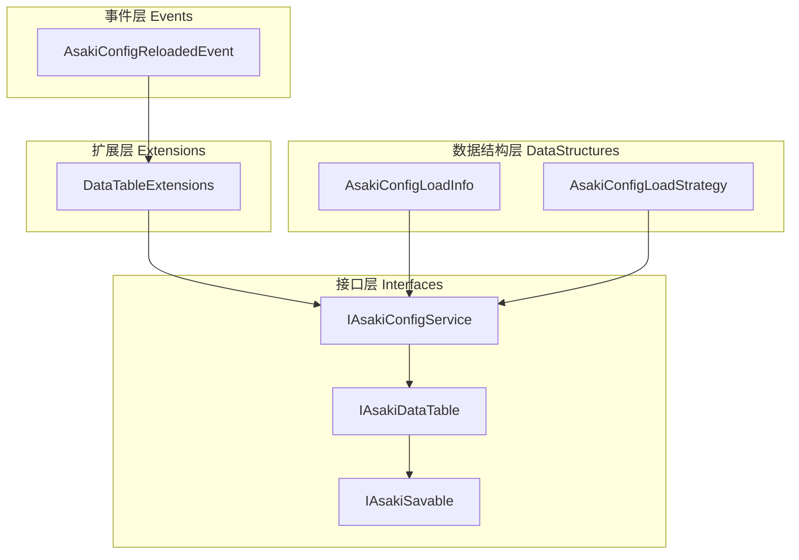
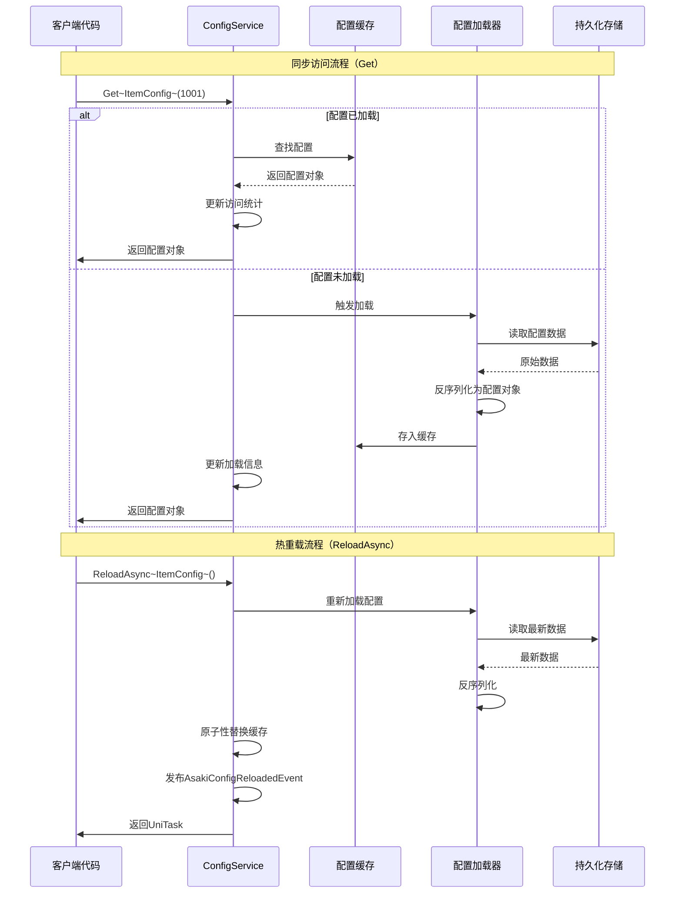
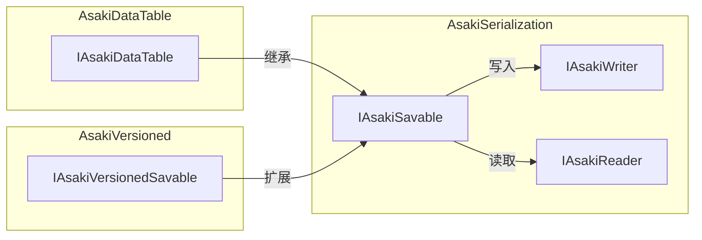
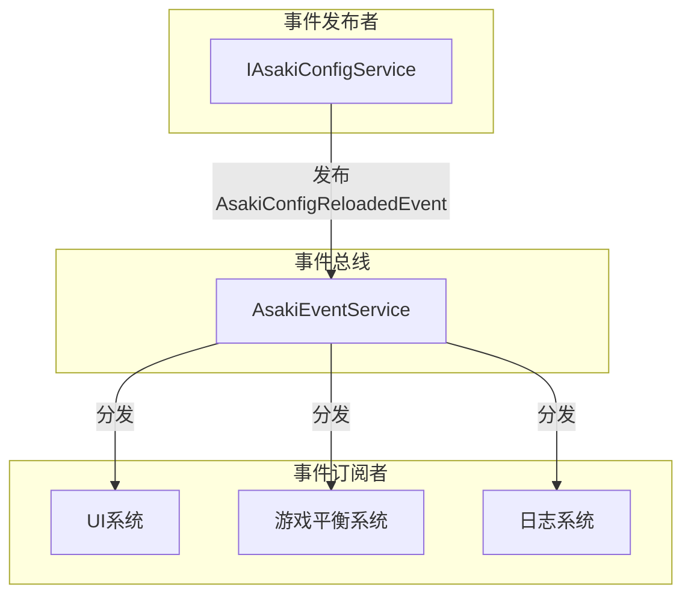

# Asaki Core/DataTable 模块架构文档

## 目录

1. [设计理念](#1-设计理念)
2. [软件架构](#2-软件架构)
3. [API参考](#3-api参考)
4. [好的示例](#4-好的示例)
5. [坏的示例](#5-坏的示例)

---

## 1. 设计理念

### 1.1 为什么需要配置表系统

在Unity游戏开发中，配置表（DataTable）是游戏数据管理的核心组件，用于存储和检索游戏中的各种静态或半静态数据：

- **游戏平衡数据**：如角色属性、伤害公式、掉落概率等
- **资源数据**：如道具信息、装备属性、商店定价等
- **内容定义**：如关卡配置、任务数据、NPC对话等
- **UI配置**：如界面布局、动画参数、文本内容等

传统方式直接读取CSV、JSON或XML文件存在以下问题：

- **频繁IO**：每次访问配置都读取文件，性能开销巨大
- **内存浪费**：多个模块可能重复加载同一份配置
- **类型不安全**：使用Dictionary或Hashtable存储，缺乏编译时类型检查
- **热更新困难**：配置变更需要重启游戏才能生效

Asaki DataTable模块通过统一的配置加载策略、内存缓存、类型安全访问和热重载机制，解决了上述问题。

### 1.2 类型安全的配置访问设计

Asaki DataTable模块的核心设计理念是**类型安全**。通过泛型接口和强类型配置类：

- 开发者可以像访问集合一样使用`configService.Get<ItemConfig>(1001)`
- 编译器会检查类型是否实现了`IAsakiDataTable`接口
- 配置对象可以直接使用其特定属性，如`itemConfig.StackSize`

这种方法确保了：
- 配置访问不会因为字符串键拼写错误而失败
- IDE可以提供完整的代码补全和重构支持
- 配置访问可以在性能关键路径上保持高效

### 1.3 加载策略的分层设计

不同类型的配置有不同的加载需求：

| 配置类型 | 示例 | 推荐策略 |
|---------|------|----------|
| 核心平衡配置 | 伤害公式、升级经验 | Preload |
| 启动必要配置 | 主界面UI文本、初始道具 | Preload |
| 场景特定配置 | 当前关卡敌人配置 | OnDemand |
| 大型配置 | 完整物品数据库 | OnDemand |
| DLC/活动配置 | 节日活动道具 | Manual |
| 运行时可编辑配置 | 游戏难度设置 | Preload + Reload |

Asaki通过`AsakiConfigLoadStrategy`枚举提供四种加载策略，通过配置优先级、内存预算等因素实现智能调度。

### 1.4 热重载机制的设计意图

游戏运营中经常需要在不重启游戏的情况下更新配置：

- **紧急修复**：修复数值bug无需重新打包
- **运营活动**：开启/结束限时活动
- **A/B测试**：动态切换不同配置进行测试
- **开发调试**：开发过程中频繁调整配置

Asaki DataTable通过`ReloadAsync<T>()`方法实现配置的原子性替换，并通过`AsakiConfigReloadedEvent`事件通知相关系统刷新状态。

---

## 2. 软件架构

### 2.1 模块层次架构

Asaki DataTable模块采用清晰的分层架构设计：



### 2.2 核心类图

```mermaid
classDiagram
    class IAsakiModule {
        <<interface>>
        +OnInit()
        +OnInitAsync() UniTask
        +OnDispose()
    }

    class IAsakiConfigService {
        <<interface>>
        +LoadAllAsync() UniTask
        +Get~T~(int id) T
        +GetAll~T~() IReadOnlyList~T~
        +GetAllStreamAsync~T~() IAsyncEnumerable~T~
        +ReloadAsync~T~() UniTask
        +Find~T~(Predicate~T~) T
        +Where~T~(Func~T, bool~) IReadOnlyList~T~
        +Exists~T~(Predicate~T~) bool
        +GetBatch~T~(IEnumerable~int~) IReadOnlyList~T~
        +GetCount~T~() int
        +IsLoaded~T~() bool
        +IsLoaded(Type) bool
        +GetSourcePath~T~() string
        +GetLastModifiedTime~T~() DateTime
        +GetAsync~T~(int id) UniTask~T~
        +PreloadAsync~T~() UniTask
        +PreloadAsync(Type) UniTask
        +PreloadBatchAsync(params Type[]) UniTask
        +Unload~T~() void
        +Unload(Type) void
        +GetLoadInfo~T~() AsakiConfigLoadInfo
    }

    class IAsakiDataTable {
        <<interface>>
        +Id { get; }
        +AllowConfigSerialization(string)
        +CloneConfig() IAsakiDataTable
    }

    class IAsakiSavable {
        <<interface>>
        +Serialize(IAsakiWriter)
        +Deserialize(IAsakiReader)
    }

    class AsakiConfigLoadStrategy {
        <<enumeration>>
        +Auto = 0
        +Preload = 1
        +OnDemand = 2
        +Manual = 3
    }

    class AsakiConfigLoadInfo {
        <<struct>>
        +ConfigName string
        +IsLoaded bool
        +Strategy AsakiConfigLoadStrategy
        +Priority int
        +Unloadable bool
        +EstimatedSize long
        +AccessCount int
        +LastAccessTime DateTime
    }

    class AsakiConfigReloadedEvent {
        <<struct>>
        +ConfigType Type
    }

    IAsakiModule <|.. IAsakiConfigService
    IAsakiDataTable --|> IAsakiSavable
    IAsakiConfigService --> AsakiConfigLoadInfo
    IAsakiConfigService --> AsakiConfigLoadStrategy
    AsakiConfigReloadedEvent ..> IAsakiEvent
```

### 2.3 配置访问流程



### 2.4 序列化体系依赖

Asaki DataTable模块继承Asaki序列化系统的能力：



| 接口 | 职责 |
|------|------|
| `IAsakiSavable` | 基础序列化接口，定义Serialize/Deserialize方法 |
| `IAsakiWriter` | 序列化写入器，支持多种数据类型写入 |
| `IAsakiReader` | 序列化读取器，支持多种数据类型读取 |
| `IAsakiVersionedSavable` | 版本控制接口，支持数据迁移 |

### 2.5 事件驱动机制

配置重载后，系统通过事件总线通知相关模块：



---

## 3. API参考

### 3.1 IAsakiConfigService 接口

配置服务的主接口，提供配置的加载、访问、查询和管理功能。

| 方法 | 描述 | 参数 | 返回值 |
|------|------|------|--------|
| `LoadAllAsync` | 异步加载所有已注册的配置 | 无 | `UniTask` |
| `Get<T>` | 根据ID获取配置对象（同步） | `id`: 配置主键 | `T`（未找到时返回null） |
| `GetAsync<T>` | 根据ID获取配置对象（异步） | `id`: 配置主键 | `UniTask<T>` |
| `GetAll<T>` | 获取指定类型的所有配置 | 无 | `IReadOnlyList<T>` |
| `GetAllStreamAsync<T>` | 异步流式获取所有配置 | 无 | `IAsyncEnumerable<T>` |
| `ReloadAsync<T>` | 异步重载指定配置 | 无 | `UniTask` |
| `Find<T>` | 根据条件查找单个配置 | `predicate`: 查找条件 | `T`（未找到时返回null） |
| `Where<T>` | 根据条件查找多个配置 | `predicate`: 筛选条件 | `IReadOnlyList<T>` |
| `Exists<T>` | 检查是否存在符合条件的配置 | `predicate`: 筛选条件 | `bool` |
| `GetBatch<T>` | 批量获取多个配置 | `ids`: 配置ID集合 | `IReadOnlyList<T>` |
| `GetCount<T>` | 获取配置数量 | 无 | `int` |
| `IsLoaded<T>` | 检查配置是否已加载 | 无 | `bool` |
| `IsLoaded` | 检查指定类型配置是否已加载 | `type`: 配置类型 | `bool` |
| `GetSourcePath<T>` | 获取配置数据源路径 | 无 | `string` |
| `GetLastModifiedTime<T>` | 获取配置最后修改时间 | 无 | `DateTime` |
| `PreloadAsync<T>` | 预加载指定配置 | 无 | `UniTask` |
| `PreloadAsync` | 预加载指定类型配置 | `type`: 配置类型 | `UniTask` |
| `PreloadBatchAsync` | 批量预加载多个配置 | `configTypes`: 配置类型数组 | `UniTask` |
| `Unload<T>` | 卸载指定配置 | 无 | `void` |
| `Unload` | 卸载指定类型配置 | `configType`: 配置类型 | `void` |
| `GetLoadInfo<T>` | 获取配置的加载信息 | 无 | `AsakiConfigLoadInfo` |

### 3.2 IAsakiDataTable 接口

配置表数据对象的核心接口，所有配置数据类必须实现此接口。

| 属性/方法 | 类型 | 描述 |
|-----------|------|------|
| `Id` | `int` | 配置表的主键ID，在同类型配置中唯一 |
| `Serialize` | `void` | 序列化方法，将对象数据写入writer |
| `Deserialize` | `void` | 反序列化方法，从reader读取数据 |
| `AllowConfigSerialization` | `void` | 授权配置序列化操作，用于安全检查 |
| `CloneConfig` | `IAsakiDataTable` | 创建配置的深拷贝副本 |

#### IAsakiSavable 继承方法

| 方法 | 描述 |
|------|------|
| `Serialize(IAsakiWriter writer)` | 将对象数据序列化到写入器 |
| `Deserialize(IAsakiReader reader)` | 从读取器反序列化数据 |

### 3.3 AsakiConfigLoadStrategy 枚举

定义配置的加载策略，影响配置在生命周期中的加载时机。

| 枚举值 | 值 | 描述 |
|--------|-----|------|
| `Auto` | 0 | 自动决策：框架根据配置大小、访问频率和内存动态选择 |
| `Preload` | 1 | 预加载：在启动阶段立即加载 |
| `OnDemand` | 2 | 按需加载：首次访问时自动加载 |
| `Manual` | 3 | 手动加载：必须显式调用PreloadAsync加载 |

### 3.4 AsakiConfigLoadInfo 结构体

配置加载信息的结构化表示，包含配置的运行时状态和元数据。

| 属性 | 类型 | 描述 |
|------|------|------|
| `ConfigName` | `string` | 配置的逻辑名称 |
| `IsLoaded` | `bool` | 配置是否已加载 |
| `Strategy` | `AsakiConfigLoadStrategy` | 加载策略 |
| `Priority` | `int` | 加载优先级（0-100） |
| `Unloadable` | `bool` | 是否允许卸载 |
| `EstimatedSize` | `long` | 预估内存占用（字节） |
| `AccessCount` | `int` | 访问次数统计 |
| `LastAccessTime` | `DateTime` | 最后访问时间 |

### 3.5 AsakiConfigReloadedEvent 事件

配置重载成功后发布的事件，用于通知相关系统刷新状态。

| 属性 | 类型 | 描述 |
|------|------|------|
| `ConfigType` | `Type` | 已重载的配置类型 |

---

## 4. 好的示例

### 4.1 基础配置定义与访问

```csharp
using System;
using Asaki.Core.DataTable;
using Asaki.Core.Serialization;
using Asaki.Core.Context;
using Asaki.Unity;
using UnityEngine;

/// <summary>
/// 物品配置 - 实现IAsakiDataTable接口
/// </summary>
[Serializable]
public class ItemConfig : IAsakiDataTable
{
    public int Id { get; set; }
    public string Name { get; set; }
    public string Description { get; set; }
    public int StackSize { get; set; }
    public int Price { get; set; }
    public ItemQuality Quality { get; set; }
    public string IconPath { get; set; }

    // 序列化实现
    public void Serialize(IAsakiWriter writer)
    {
        writer.WriteInt(nameof(Id), Id);
        writer.WriteString(nameof(Name), Name);
        writer.WriteString(nameof(Description), Description);
        writer.WriteInt(nameof(StackSize), StackSize);
        writer.WriteInt(nameof(Price), Price);
        writer.WriteInt(nameof(Quality), (int)Quality);
        writer.WriteString(nameof(IconPath), IconPath);
    }

    public void Deserialize(IAsakiReader reader)
    {
        Id = reader.ReadInt(nameof(Id));
        Name = reader.ReadString(nameof(Name));
        Description = reader.ReadString(nameof(Description));
        StackSize = reader.ReadInt(nameof(StackSize));
        Price = reader.ReadInt(nameof(Price));
        Quality = (ItemQuality)reader.ReadInt(nameof(Quality));
        IconPath = reader.ReadString(nameof(IconPath));
    }

    public IAsakiDataTable CloneConfig() => new ItemConfig
    {
        Id = Id,
        Name = Name,
        Description = Description,
        StackSize = StackSize,
        Price = Price,
        Quality = Quality,
        IconPath = IconPath
    };

    public void AllowConfigSerialization(string permissionKey)
    {
        // 安全检查逻辑
    }
}

public enum ItemQuality
{
    Common = 0,
    Uncommon = 1,
    Rare = 2,
    Epic = 3,
    Legendary = 4
}

/// <summary>
/// 物品管理器 - 使用配置服务
/// </summary>
public class ItemManager : AsakiMono, IAsakiAutoInject
{
    private IAsakiConfigService _configService;

    void IAsakiInject<IAsakiConfigService>.Inject(IAsakiConfigService configService)
    {
        _configService = configService;
    }

    protected override void OnStart()
    {
        // 同步获取配置（配置必须已加载）
        ItemConfig sword = _configService.Get<ItemConfig>(1001);
        if (sword != null)
        {
            Debug.Log($"物品名称: {sword.Name}, 价格: {sword.Price}");
        }
    }

    /// <summary>
    /// 根据ID获取物品配置
    /// </summary>
    public ItemConfig GetItem(int itemId)
    {
        return _configService.Get<ItemConfig>(itemId);
    }

    /// <summary>
    /// 获取所有物品配置
    /// </summary>
    public IReadOnlyList<ItemConfig> GetAllItems()
    {
        return _configService.GetAll<ItemConfig>();
    }

    /// <summary>
    /// 根据品质筛选物品
    /// </summary>
    public IReadOnlyList<ItemConfig> GetItemsByQuality(ItemQuality quality)
    {
        return _configService.Where<ItemConfig>(item => item.Quality == quality);
    }

    /// <summary>
    /// 批量获取物品配置
    /// </summary>
    public IReadOnlyList<ItemConfig> GetItemsBatch(IEnumerable<int> itemIds)
    {
        return _configService.GetBatch<ItemConfig>(itemIds);
    }
}
```

### 4.2 配置重载响应示例

```csharp
using Asaki.Core.Broker;
using Asaki.Core.DataTable;
using Asaki.Unity;

/// <summary>
/// 游戏难度系统 - 响应配置热重载
/// </summary>
public class GameDifficultySystem : AsakiMono, IAsakiAutoInject, IAsakiHandler<AsakiConfigReloadedEvent>
{
    private IAsakiConfigService _configService;
    private IAsakiEventService _eventService;

    void IAsakiInject<IAsakiConfigService>.Inject(IAsakiConfigService configService)
    {
        _configService = configService;
    }

    void IAsakiInject<IAsakiEventService>.Inject(IAsakiEventService eventService)
    {
        _eventService = eventService;
    }

    protected override void OnStart()
    {
        // 订阅配置重载事件
        _eventService.Subscribe<AsakiConfigReloadedEvent>(this);
    }

    protected override void OnDestroy()
    {
        // 取消订阅，避免内存泄漏
        _eventService.Unsubscribe<AsakiConfigReloadedEvent>(this);
        base.OnDestroy();
    }

    /// <summary>
    /// 配置重载事件处理
    /// </summary>
    public void OnEvent(in AsakiConfigReloadedEvent e)
    {
        if (e.ConfigType == typeof(DifficultyConfig))
        {
            // 重新应用难度设置
            ApplyDifficultySettings();
        }
    }

    /// <summary>
    /// 应用难度设置到游戏系统
    /// </summary>
    private void ApplyDifficultySettings()
    {
        // 获取最新的难度配置并应用到游戏
        DifficultyConfig config = _configService.Get<DifficultyConfig>(1);
        if (config != null)
        {
            Debug.Log($"应用难度: {config.DifficultyName}, 敌人生命值倍率: {config.EnemyHpMultiplier}");
        }
    }
}
```

### 4.3 异步配置访问示例

```csharp
using Asaki.Core.DataTable;
using Asaki.Core.Context;
using Asaki.Unity;
using Cysharp.Threading.Tasks;
using UnityEngine;

/// <summary>
/// 关卡配置管理器 - 异步加载场景配置
/// </summary>
public class LevelConfigManager : AsakiMono, IAsakiAutoInject
{
    private IAsakiConfigService _configService;

    void IAsakiInject<IAsakiConfigService>.Inject(IAsakiConfigService configService)
    {
        _configService = configService;
    }

    protected override void OnStart()
    {
        // 异步预加载关卡配置
        PreloadLevelConfigs().Forget();
    }

    /// <summary>
    /// 异步预加载关卡配置
    /// </summary>
    private async UniTask PreloadLevelConfigs()
    {
        await _configService.PreloadAsync<LevelConfig>();
        Debug.Log("关卡配置加载完成");
    }

    /// <summary>
    /// 异步获取关卡配置
    /// </summary>
    public async UniTask<LevelConfig> GetLevelConfigAsync(int levelId)
    {
        return await _configService.GetAsync<LevelConfig>(levelId);
    }

    /// <summary>
    /// 异步流式处理所有关卡配置
    /// </summary>
    public async UniTask ProcessAllLevels()
    {
        await foreach (var levelConfig in _configService.GetAllStreamAsync<LevelConfig>())
        {
            Debug.Log($"处理关卡: {levelConfig.LevelName}");
            // 逐个处理关卡配置
        }
    }

    /// <summary>
    /// 加载指定关卡（异步）
    /// </summary>
    public async UniTask LoadLevel(int levelId)
    {
        var levelConfig = await GetLevelConfigAsync(levelId);
        if (levelConfig != null)
        {
            Debug.Log($"加载关卡: {levelConfig.LevelName}");
            // 执行关卡加载逻辑
        }
    }
}
```

### 4.4 配置查询示例

```csharp
using Asaki.Core.DataTable;
using Asaki.Core.Context;
using Asaki.Unity;
using System.Linq;

/// <summary>
/// 商店系统 - 使用配置查询功能
/// </summary>
public class ShopSystem : AsakiMono, IAsakiAutoInject
{
    private IAsakiConfigService _configService;

    void IAsakiInject<IAsakiConfigService>.Inject(IAsakiConfigService configService)
    {
        _configService = configService;
    }

    /// <summary>
    /// 查找指定价格的物品
    /// </summary>
    public ItemConfig FindItemByPrice(int maxPrice)
    {
        return _configService.Find<ItemConfig>(item => item.Price <= maxPrice);
    }

    /// <summary>
    /// 获取所有可购买的物品
    /// </summary>
    public IReadOnlyList<ItemConfig> GetPurchasableItems()
    {
        return _configService.Where<ItemConfig>(item => item.Price > 0);
    }

    /// <summary>
    /// 检查是否存在指定名称的物品
    /// </summary>
    public bool HasItem(string itemName)
    {
        return _configService.Exists<ItemConfig>(item => item.Name == itemName);
    }

    /// <summary>
    /// 获取物品总数
    /// </summary>
    public int GetTotalItemCount()
    {
        return _configService.GetCount<ItemConfig>();
    }

    /// <summary>
    /// 获取配置加载信息（用于调试）
    /// </summary>
    public AsakiConfigLoadInfo GetItemConfigLoadInfo()
    {
        return _configService.GetLoadInfo<ItemConfig>();
    }
}
```

### 4.5 使用AsakiConfigLoadStrategy配置加载策略

```csharp
using Asaki.Core.DataTable;
using Asaki.Core.Serialization;
using Asaki.Core.Attributes;

/// <summary>
/// 游戏难度配置 - 使用Preload策略
/// </summary>
[AsakiConfig(LoadStrategy = AsakiConfigLoadStrategy.Preload, Priority = 50)]
public class DifficultyConfig : IAsakiDataTable
{
    public int Id { get; set; }
    public string DifficultyName { get; set; }
    public float EnemyHpMultiplier { get; set; }
    public float EnemyDamageMultiplier { get; set; }
    public float DropRateMultiplier { get; set; }

    public void Serialize(IAsakiWriter writer)
    {
        writer.WriteInt(nameof(Id), Id);
        writer.WriteString(nameof(DifficultyName), DifficultyName);
        writer.WriteFloat(nameof(EnemyHpMultiplier), EnemyHpMultiplier);
        writer.WriteFloat(nameof(EnemyDamageMultiplier), EnemyDamageMultiplier);
        writer.WriteFloat(nameof(DropRateMultiplier), DropRateMultiplier);
    }

    public void Deserialize(IAsakiReader reader)
    {
        Id = reader.ReadInt(nameof(Id));
        DifficultyName = reader.ReadString(nameof(DifficultyName));
        EnemyHpMultiplier = reader.ReadFloat(nameof(EnemyHpMultiplier));
        EnemyDamageMultiplier = reader.ReadFloat(nameof(EnemyDamageMultiplier));
        DropRateMultiplier = reader.ReadFloat(nameof(DropRateMultiplier));
    }

    public IAsakiDataTable CloneConfig() => new DifficultyConfig
    {
        Id = Id,
        DifficultyName = DifficultyName,
        EnemyHpMultiplier = EnemyHpMultiplier,
        EnemyDamageMultiplier = EnemyDamageMultiplier,
        DropRateMultiplier = DropRateMultiplier
    };

    public void AllowConfigSerialization(string permissionKey) { }
}

/// <summary>
/// 关卡配置 - 使用OnDemand策略
/// </summary>
[AsakiConfig(LoadStrategy = AsakiConfigLoadStrategy.OnDemand, Priority = 10)]
public class LevelConfig : IAsakiDataTable
{
    public int Id { get; set; }
    public string LevelName { get; set; }
    public int EnemyCount { get; set; }
    public float TimeLimit { get; set; }

    public void Serialize(IAsakiWriter writer)
    {
        writer.WriteInt(nameof(Id), Id);
        writer.WriteString(nameof(LevelName), LevelName);
        writer.WriteInt(nameof(EnemyCount), EnemyCount);
        writer.WriteFloat(nameof(TimeLimit), TimeLimit);
    }

    public void Deserialize(IAsakiReader reader)
    {
        Id = reader.ReadInt(nameof(Id));
        LevelName = reader.ReadString(nameof(LevelName));
        EnemyCount = reader.ReadInt(nameof(EnemyCount));
        TimeLimit = reader.ReadFloat(nameof(TimeLimit));
    }

    public IAsakiDataTable CloneConfig() => new LevelConfig
    {
        Id = Id,
        LevelName = LevelName,
        EnemyCount = EnemyCount,
        TimeLimit = TimeLimit
    };

    public void AllowConfigSerialization(string permissionKey) { }
}
```

---

## 5. 坏的示例

### 5.1 访问未加载的配置

```csharp
// 错误示例：在配置未加载时访问
public class BadExample1 : AsakiMono, IAsakiAutoInject
{
    private IAsakiConfigService _configService;

    void IAsakiInject<IAsakiConfigService>.Inject(IAsakiConfigService configService)
    {
        _configService = configService;
    }

    protected override void OnStart()
    {
        // 问题：使用OnDemand策略的配置可能尚未加载
        // Get方法返回null，可能导致后续空引用异常
        ItemConfig item = _configService.Get<ItemConfig>(1001);
        
        // 没有空检查就直接使用
        Debug.Log(item.Name); // NullReferenceException!
    }

    // 正确示例：先检查配置是否已加载
    protected override void OnStartCorrect()
    {
        if (_configService.IsLoaded<ItemConfig>())
        {
            ItemConfig item = _configService.Get<ItemConfig>(1001);
            if (item != null)
            {
                Debug.Log(item.Name);
            }
        }
    }

    // 或者使用异步预加载
    protected override void OnStartAsync()
    {
        // 在使用前先确保配置已加载
        _configService.PreloadAsync<ItemConfig>().ContinueWith(() =>
        {
            ItemConfig item = _configService.Get<ItemConfig>(1001);
            Debug.Log(item?.Name);
        }).Forget();
    }
}
```

### 5.2 同步访问大量配置导致卡顿

```csharp
// 错误示例：在Update中频繁同步访问配置
public class BadExample2 : AsakiMono
{
    private IAsakiConfigService _configService;

    void IAsakiInject<IAsakiConfigService>.Inject(IAsakiConfigService configService)
    {
        _configService = configService;
    }

    private void Update()
    {
        // 问题：每帧同步遍历所有配置
        // 如果配置数量大或未预加载，会造成严重卡顿
        var allItems = _configService.GetAll<ItemConfig>();
        foreach (var item in allItems)
        {
            // 业务逻辑
            ProcessItem(item);
        }
    }

    // 正确示例：缓存配置引用，减少重复访问
    private IReadOnlyList<ItemConfig> _cachedItems;
    private float _cacheTimer;
    private const float CACHE_INTERVAL = 5f;

    private void UpdateCorrect()
    {
        _cacheTimer += Time.deltaTime;
        if (_cacheTimer >= CACHE_INTERVAL || _cachedItems == null)
        {
            _cachedItems = _configService.GetAll<ItemConfig>();
            _cacheTimer = 0f;
        }

        // 使用缓存的数据
        foreach (var item in _cachedItems)
        {
            ProcessItem(item);
        }
    }
}
```

### 5.3 配置修改后未发布事件

```csharp
// 错误示例：直接修改配置对象未通知相关系统
public class BadExample3 : AsakiMono, IAsakiAutoInject
{
    private IAsakiConfigService _configService;

    void IAsakiInject<IAsakiConfigService>.Inject(IAsakiConfigService configService)
    {
        _configService = configService;
    }

    /// <summary>
    /// 错误：直接修改缓存中的配置对象
    /// </summary>
    public void ModifyItemPrice(int itemId, int newPrice)
    {
        ItemConfig item = _configService.Get<ItemConfig>(itemId);
        if (item != null)
        {
            // 问题：直接修改了配置，但没有触发重载事件
            // 其他系统不知道配置已变更
            item.Price = newPrice;
        }
    }

    // 正确示例：使用Reload触发事件通知
    public async UniTask ModifyItemPriceCorrect(int itemId, int newPrice)
    {
        // 注意：实际应用中应该修改数据源文件
        // 然后调用ReloadAsync重新加载
        await _configService.ReloadAsync<ItemConfig>();
        
        // ReloadAsync会发布AsakiConfigReloadedEvent
        // 订阅该事件的系统会自动刷新
    }
}
```

### 5.4 未正确实现序列化导致数据错误

```csharp
// 错误示例：序列化/反序列化顺序不一致
[Serializable]
public class BadItemConfig : IAsakiDataTable
{
    public int Id { get; set; }
    public string Name { get; set; }
    public int Price { get; set; }

    public void Serialize(IAsakiWriter writer)
    {
        // 写入顺序：Id -> Name -> Price
        writer.WriteInt(nameof(Id), Id);
        writer.WriteString(nameof(Name), Name);
        writer.WriteInt(nameof(Price), Price);
    }

    public void Deserialize(IAsakiReader reader)
    {
        // 问题：读取顺序与写入顺序不一致！
        // 会导致数据错位
        Id = reader.ReadInt(nameof(Id));
        Price = reader.ReadInt(nameof(Price)); // 错误：应该是Name
        Name = reader.ReadString(nameof(Name));
    }

    public IAsakiDataTable CloneConfig() => new BadItemConfig
    {
        Id = Id,
        Name = Name,
        Price = Price
    };

    public void AllowConfigSerialization(string permissionKey) { }
}

// 正确示例：保持序列化顺序一致
[Serializable]
public class GoodItemConfig : IAsakiDataTable
{
    public int Id { get; set; }
    public string Name { get; set; }
    public int Price { get; set; }

    public void Serialize(IAsakiWriter writer)
    {
        writer.WriteInt(nameof(Id), Id);
        writer.WriteString(nameof(Name), Name);
        writer.WriteInt(nameof(Price), Price);
    }

    public void Deserialize(IAsakiReader reader)
    {
        // 读取顺序与写入顺序完全一致
        Id = reader.ReadInt(nameof(Id));
        Name = reader.ReadString(nameof(Name));
        Price = reader.ReadInt(nameof(Price));
    }

    public IAsakiDataTable CloneConfig() => new GoodItemConfig
    {
        Id = Id,
        Name = Name,
        Price = Price
    };

    public void AllowConfigSerialization(string permissionKey) { }
}
```

### 5.5 忽略配置加载状态导致逻辑错误

```csharp
// 错误示例：未检查配置是否已加载
public class BadExample5 : AsakiMono, IAsakiAutoInject
{
    private IAsakiConfigService _configService;
    private int _totalItems;

    void IAsakiInject<IAsakiConfigService>.Inject(IAsakiConfigService configService)
    {
        _configService = configService;
    }

    protected override void OnStart()
    {
        // 问题：未检查配置是否已加载
        // GetCount可能返回0，因为配置尚未加载
        _totalItems = _configService.GetCount<ItemConfig>();
        
        // 后续逻辑基于错误的数量值
        Debug.Log($"物品总数: {_totalItems}"); // 输出0，但实际有100+物品
    }

    // 正确示例：检查加载状态后再操作
    protected override void OnStartCorrect()
    {
        if (_configService.IsLoaded<ItemConfig>())
        {
            _totalItems = _configService.GetCount<ItemConfig>();
            Debug.Log($"物品总数: {_totalItems}");
        }
        else
        {
            Debug.LogWarning("物品配置尚未加载");
            // 等待配置加载
            _configService.PreloadAsync<ItemConfig>().ContinueWith(() =>
            {
                _totalItems = _configService.GetCount<ItemConfig>();
                Debug.Log($"物品总数: {_totalItems}");
            }).Forget();
        }
    }
}
```

### 5.6 内存泄漏 - 未取消事件订阅

```csharp
// 错误示例：未取消事件订阅导致内存泄漏
public class BadExample6 : AsakiMono, IAsakiAutoInject, IAsakiHandler<AsakiConfigReloadedEvent>
{
    private IAsakiConfigService _configService;
    private IAsakiEventService _eventService;

    void IAsakiInject<IAsakiConfigService>.Inject(IAsakiConfigService configService)
    {
        _configService = configService;
    }

    void IAsakiInject<IAsakiEventService>.Inject(IAsakiEventService eventService)
    {
        _eventService = eventService;
    }

    protected override void OnStart()
    {
        // 问题：订阅了事件但未在OnDestroy中取消订阅
        // 即使脚本销毁，事件处理方法仍然被引用，导致内存泄漏
        _eventService.Subscribe<AsakiConfigReloadedEvent>(this);
    }

    // 缺少OnDestroy取消订阅

    public void OnEvent(in AsakiConfigReloadedEvent e)
    {
        // 事件处理逻辑
    }

    // 正确示例：务必在OnDestroy中取消订阅
    protected override void OnDestroy()
    {
        // 在销毁时取消订阅
        if (_eventService != null)
        {
            _eventService.Unsubscribe<AsakiConfigReloadedEvent>(this);
        }
        base.OnDestroy();
    }
}
```

---

## 附录

### 相关文件路径

- 配置服务接口: [IAsakiConfigService.cs](file:///e:/Projects/UnityGame/Asaki/Assets/Asaki/Core/DataTable/IAsakiConfigService.cs)
- 数据表接口: [IAsakiDataTable.cs](file:///e:/Projects/UnityGame/Asaki/Assets/Asaki/Core/DataTable/IAsakiDataTable.cs)
- 加载信息: [AsakiConfigLoadInfo.cs](file:///e:/Projects/UnityGame/Asaki/Assets/Asaki/Core/DataTable/AsakiConfigLoadInfo.cs)
- 加载策略: [AsakiConfigLoadStrategy.cs](file:///e:/Projects/UnityGame/Asaki/Assets/Asaki/Core/DataTable/AsakiConfigLoadStrategy.cs)
- 重载事件: [AsakiConfigReloadedEvent.cs](file:///e:/Projects/UnityGame/Asaki/Assets/Asaki/Core/DataTable/AsakiConfigReloadedEvent.cs)

### 相关依赖

- 序列化接口: [IAsakiSavable.cs](file:///e:/Projects/UnityGame/Asaki/Assets/Asaki/Core/Serialization/IAsakiSavable.cs)
- 序列化写入器: [IAsakiWriter.cs](file:///e:/Projects/UnityGame/Asaki/Assets/Asaki/Core/Serialization/IAsakiWriter.cs)
- 序列化读取器: [IAsakiReader.cs](file:///e:/Projects/UnityGame/Asaki/Assets/Asaki/Core/Serialization/IAsakiReader.cs)
- 事件系统: [IAsakiEventService.cs](file:///e:/Projects/UnityGame/Asaki/Assets/Asaki/Core/Broker/IAsakiEventService.cs)
- 事件处理接口: [IAsakiEvent.cs](file:///e:/Projects/UnityGame/Asaki/Assets/Asaki/Core/Broker/IAsakiEvent.cs)

---

_文档生成时间: 2026-03-03_
