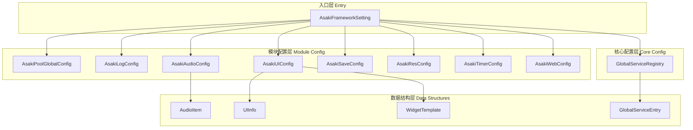
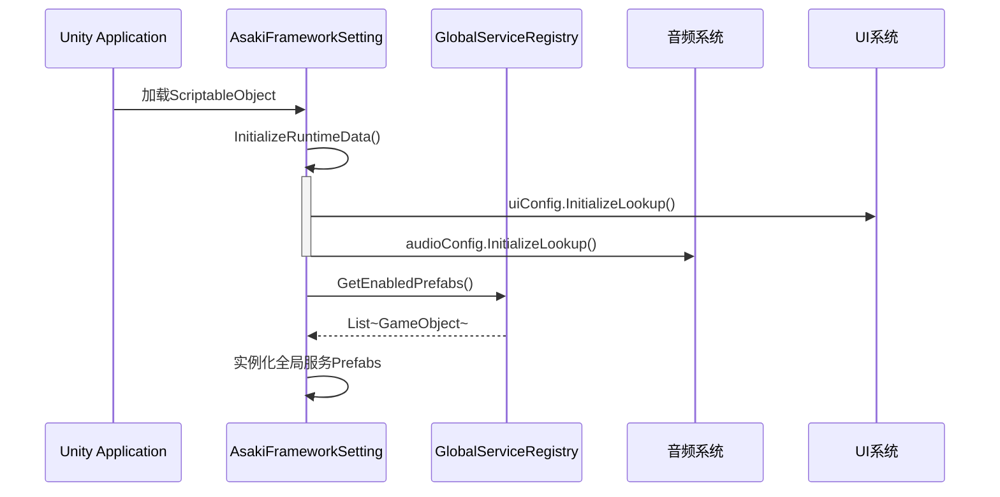
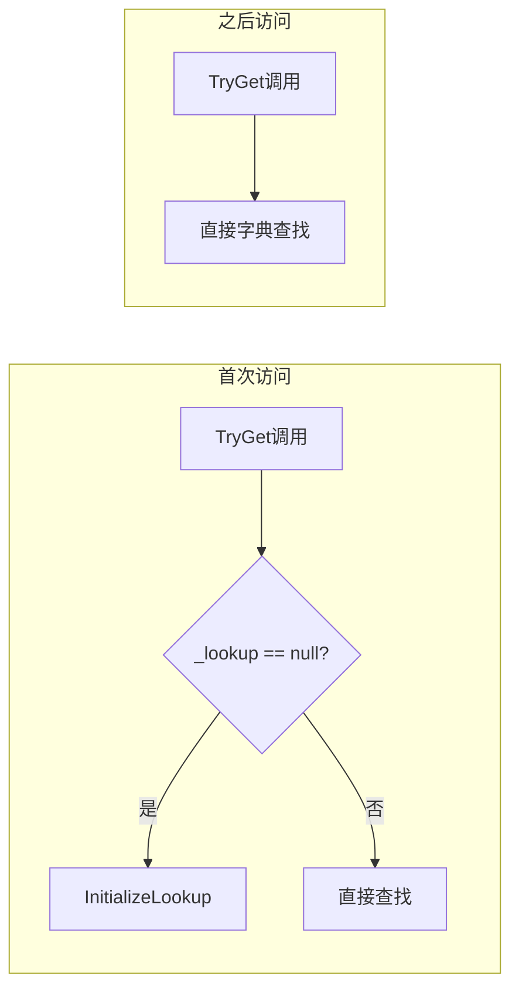

# Asaki Core/FrameworkSettings 模块架构文档

## 目录

1. [设计理念](#1-设计理念)
2. [软件架构](#2-软件架构)
3. [API参考](#3-api参考)
4. [好的示例](#4-好的示例)
5. [坏的示例](#5-坏的示例)

---

## 1. 设计理念

### 1.1 为什么需要框架配置系统

在Unity游戏开发中，游戏项目通常包含数十个子系统：对象池、日志、资源加载、音频、UI、网络、存档、定时器等。每个子系统都需要配置参数来控制其行为。传统方式是将配置分散在各模块内部，导致以下问题：

- **配置分散**：每个模块各自定义配置，难以统一管理和查看
- **序列化困难**：普通类无法在Unity Inspector中序列化，ScriptableObject又过于零散
- **耦合问题**：模块直接依赖具体配置类，难以进行单元测试
- **运行时修改不便**：无法在不重新编译的情况下调整参数

Asaki FrameworkSettings模块采用**集中式配置架构**，通过统一的入口类管理所有子模块配置，提供设计时和运行时双重配置能力。

### 1.2 ScriptableObject配置中心的优势

FrameworkSettings选用ScriptableObject作为配置载体，具有以下优势：

| 特性 | 说明 |
|------|------|
| **Inspector可视化** | 可直接在Unity编辑器中配置参数 |
| **版本控制友好** | 作为Asset文件可提交到版本库 |
| **运行时加载** | 支持Resources.Load或直接引用 |
| **可继承扩展** | 支持创建子类配置覆盖默认行为 |
| **序列化支持** | 原生支持Unity的序列化系统 |

### 1.3 全局服务注册表的设计意图

GlobalServiceRegistry用于集中管理全局服务的预制体注册。传统做法是在场景中手动拖拽或使用单例模式，导致：

- 场景文件臃肿
- 服务初始化顺序难以控制
- 难以动态添加/移除服务

GlobalServiceRegistry通过以下设计解决这些问题：

1. **优先级加载**：支持按Priority排序，确保依赖服务先初始化
2. **按需启用**：Enabled标志可动态开关服务
3. **版本控制**：内置版本号和最后修改时间，便于追踪变更
4. **运行时扩展**：支持代码动态添加服务条目

### 1.4 POCO配置类的设计

除AsakiFrameworkSetting和GlobalServiceRegistry外，其他配置类均设计为POCO（Plain Old C# Object）：

- 使用[Serializable]特性实现序列化
- 不继承任何基类，便于JSON/YAML等格式转换
- 可嵌入到ScriptableObject中统一管理
- 支持默认值和运行时修改

---

## 2. 软件架构

### 2.1 模块层次结构



### 2.2 核心类图

```mermaid
classDiagram
    class IAsakiService {
        <<interface>>
    }

    class AsakiFrameworkSetting {
        +ScriptableObject
        +IAsakiService
        +TickRate: int
        +DefaultPoolSize: int
        +GlobalServiceRegistry: GlobalServiceRegistry
        +LogConfig: AsakiLogConfig
        +ResConfig: AsakiResConfig
        +AudioConfig: AsakiAudioConfig
        +UIConfig: AsakiUIConfig
        +WebConfig: AsakiWebConfig
        +SaveConfig: AsakiSaveConfig
        +PoolGlobalConfig: AsakiPoolGlobalConfig
        +TimerConfig: AsakiTimerConfig
        +InitializeRuntimeData()
        +GetGlobalServicePrefabs(): List~GameObject~
    }

    class GlobalServiceRegistry {
        +ScriptableObject
        +ServiceEntries: List~GlobalServiceEntry~
        +ValidateOnStart: bool
        +Version: int
        +AddServiceEntry(entry)
        +RemoveServiceEntry(index)
        +GetEnabledPrefabs(): List~GameObject~
        +SortByPriority()
    }

    class GlobalServiceEntry {
        +Prefab: GameObject
        +Enabled: bool
        +Description: string
        +Priority: int
    }

    class AsakiPoolGlobalConfig {
        +DefaultInitialSize: int
        +DefaultMaxSize: int
        +DefaultEnableValidation: bool
        +DefaultIdleTimeout: float
        +EventPoolDefaultThreshold: int
        +AudioPoolDefaultInitialSize: int
        +Instance: AsakiPoolGlobalConfig
        +FromJson(json): AsakiPoolGlobalConfig
        +ToJson(): string
    }

    class AsakiLogConfig {
        +MinLogLevel: AsakiLogLevel
        +MaxFileSizeKB: int
        +MaxHistoryFiles: int
        +FilePrefix: string
    }

    class AsakiAudioConfig {
        +AsakiSoundAgentPrefab: GameObject
        +InitialPoolSize: int
        +MaxPoolSize: int
        +Items: List~AudioItem~
        +InitializeLookup()
        +TryGet(id, out item): bool
    }

    class AudioItem {
        +Key: string
        +ID: int
        +Clip: AudioClip
        +AssetPath: string
        +Volume: float
        +Pitch: float
        +Loop: bool
        +Group: AsakiAudioGroup
        +ToParams(): AsakiAudioParams
    }

    class AsakiUIConfig {
        +ReferenceResolution: Vector2
        +MatchWidthOrHeight: float
        +UIList: List~UIInfo~
        +Templates: List~WidgetTemplate~
        +ResourceReleaseDelaySeconds: float
        +InitializeLookup()
        +TryGet(id, out info): bool
    }

    class UIInfo {
        +Name: string
        +ID: int
        +Layer: AsakiUILayer
        +AssetPath: string
        +UsePool: bool
    }

    class WidgetTemplate {
        +Type: AsakiUIWidgetType
        +Prefab: GameObject
    }

    class AsakiSaveConfig {
        +SaveDirectoryName: string
        +CustomSavePath: string
        +MaxSlots: int
        +AutoSaveSlotIndex: int
        +EnableBackup: bool
        +OperationTimeout: float
        +GetSaveRootPath(): string
        +GetBackupPath(): string
    }

    class AsakiResConfig {
        +Mode: AsakiResKitMode
        +TimeoutSeconds: int
    }

    class AsakiTimerConfig {
        +DefaultInitialCapacity: int
        +MaxLoopIterations: int
    }

    class AsakiWebConfig {
        +BaseUrl: string
        +TimeoutSeconds: int
        +InitialInterceptors: IAsakiWebInterceptor[]
    }

    IAsakiService <|.. AsakiFrameworkSetting
    AsakiFrameworkSetting --> GlobalServiceRegistry
    AsakiFrameworkSetting --> AsakiPoolGlobalConfig
    AsakiFrameworkSetting --> AsakiLogConfig
    AsakiFrameworkSetting --> AsakiAudioConfig
    AsakiFrameworkSetting --> AsakiUIConfig
    AsakiFrameworkSetting --> AsakiSaveConfig
    AsakiFrameworkSetting --> AsakiResConfig
    AsakiFrameworkSetting --> AsakiTimerConfig
    AsakiFrameworkSetting --> AsakiWebConfig

    GlobalServiceRegistry --> GlobalServiceEntry
    AsakiAudioConfig --> AudioItem
    AsakiUIConfig --> UIInfo
    AsakiUIConfig --> WidgetTemplate
```



### 2.3 配置初始化流程



### 2.4 配置查找优化

AudioConfig和UIConfig都实现了延迟初始化的查找表机制：



---

## 3. API参考

### 3.1 AsakiFrameworkSetting 框架设置主类

作为所有配置的入口点，实现了IAsakiService接口。

| 属性 | 类型 | 描述 |
|------|------|------|
| `TickRate` | int | 模拟tick率，默认60 |
| `DefaultPoolSize` | int | 默认对象池大小，默认128 |
| `GlobalServiceRegistry` | GlobalServiceRegistry | 全局服务注册表 |
| `LogConfig` | AsakiLogConfig | 日志模块配置 |
| `ResConfig` | AsakiResConfig | 资源模块配置 |
| `AudioConfig` | AsakiAudioConfig | 音频模块配置 |
| `UIConfig` | AsakiUIConfig | UI模块配置 |
| `WebConfig` | AsakiWebConfig | 网络模块配置 |
| `SaveConfig` | AsakiSaveConfig | 存档模块配置 |
| `PoolGlobalConfig` | AsakiPoolGlobalConfig | 对象池全局配置 |
| `TimerConfig` | AsakiTimerConfig | 定时器模块配置 |

| 方法 | 描述 | 参数 | 返回值 |
|------|------|------|--------|
| `InitializeRuntimeData` | 初始化运行时查找表 | 无 | void |
| `GetGlobalServicePrefabs` | 获取所有启用的服务预制体 | 无 | List<GameObject> |

### 3.2 GlobalServiceRegistry 全局服务注册表

管理全局服务预制体的注册和加载。

| 属性 | 类型 | 描述 |
|------|------|------|
| `ServiceEntries` | IReadOnlyList<GlobalServiceEntry> | 服务条目列表 |
| `ValidateOnStart` | bool | 启动时是否验证预制体 |
| `Version` | int | 配置版本号 |
| `Count` | int | 服务条目数量 |

| 方法 | 描述 | 参数 | 返回值 |
|------|------|------|--------|
| `AddServiceEntry` | 添加服务条目 | `entry: GlobalServiceEntry` | void |
| `RemoveServiceEntry` | 移除服务条目 | `index: int` | void |
| `RemoveServiceEntry` | 移除服务条目 | `entry: GlobalServiceEntry` | bool |
| `MoveEntry` | 移动服务条目位置 | `fromIndex: int, toIndex: int` | void |
| `SortByPriority` | 按优先级排序 | 无 | void |
| `GetEnabledEntries` | 获取所有启用的条目 | 无 | List<GlobalServiceEntry> |
| `GetEnabledPrefabs` | 获取所有启用的预制体 | 无 | List<GameObject> |
| `ClearAll` | 清空所有条目 | 无 | void |

### 3.3 AsakiPoolGlobalConfig 对象池全局配置

集中管理所有对象池相关配置。

| 属性 | 类型 | 默认值 | 描述 |
|------|------|--------|------|
| `DefaultInitialSize` | int | 10 | 默认初始对象数量 |
| `DefaultMaxSize` | int | 100 | 默认最大对象数量 |
| `DefaultEnableValidation` | bool | true | 默认启用对象验证 |
| `DefaultEnableCollectionCheck` | bool | true | 默认启用重复归还检测 |
| `DefaultAllowSyncCreation` | bool | false | 默认允许同步创建 |
| `DefaultOperationTimeout` | float | 0 | 默认操作超时(秒) |
| `DefaultPrewarmItemsPerFrame` | int | 5 | 默认预热速率 |
| `DefaultEnableAutoShrink` | bool | true | 默认启用自动收缩 |
| `DefaultCheckInterval` | float | 30 | 默认检查间隔(秒) |
| `DefaultIdleTimeout` | float | 60 | 默认闲置超时(秒) |
| `DefaultKeepMinSize` | int | 5 | 默认保底数量 |
| `DefaultShrinkRatio` | float | 0.5 | 默认收缩比例 |
| `EventPoolDefaultThreshold` | int | 32 | 事件池类型切换阈值 |
| `EventPoolMaxSize` | int | 1000 | 事件池最大尺寸 |
| `DefaultPoolCapacity` | int | 10 | 默认对象池容量 |
| `StringBuilderPoolInitialCapacity` | int | 20 | StringBuilder池初始容量 |
| `StringBuilderMaxRetainCapacity` | int | 256 | StringBuilder池最大保留容量 |
| `StringBuilderInitialCapacity` | int | 128 | StringBuilder初始容量 |
| `LogCommandPoolMaxSize` | int | 200 | 日志命令池最大尺寸 |
| `ArchitecturePoolInitialSize` | int | 10 | 架构对象池初始大小 |
| `ArchitecturePoolMaxSize` | int | 100 | 架构对象池最大大小 |
| `ArchitecturePoolEnableValidation` | bool | true | 架构池启用验证 |
| `ArchitecturePoolEnableCollectionCheck` | bool | true | 架构池启用重复检测 |
| `ArchitecturePoolAllowSyncCreation` | bool | false | 架构池允许同步创建 |
| `AudioPoolDefaultActiveAgentCapacity` | int | 32 | 音频池活跃Agent容量 |
| `AudioPoolDefaultInitialSize` | int | 16 | 音频池初始大小 |
| `AudioPoolDefaultMaxSize` | int | 100 | 音频池最大大小 |
| `LightWeightPoolDefaultMaxSize` | int | 50 | 轻量池默认最大尺寸 |

| 方法 | 描述 | 参数 | 返回值 |
|------|------|------|--------|
| `Instance` | 获取全局单例 | 无 | AsakiPoolGlobalConfig |
| `FromJson` | 从JSON加载配置 | `json: string` | AsakiPoolGlobalConfig |
| `ToJson` | 序列化为JSON | 无 | string |
| `ResetToDefaults` | 重置为默认值 | 无 | void |
| `Apply` | 应用为全局实例 | 无 | void |

### 3.4 AsakiLogConfig 日志配置

| 属性 | 类型 | 默认值 | 描述 |
|------|------|--------|------|
| `MinLogLevel` | AsakiLogLevel | Debug | 最低日志等级 |
| `MaxFileSizeKB` | int | 2048 | 单个日志文件最大尺寸(KB) |
| `MaxHistoryFiles` | int | 10 | 保留的历史文件数量 |
| `FilePrefix` | string | "GameLog" | 日志文件名前缀 |
| `OutputToUnityConsole` | bool | true | [仅编辑器]输出到Unity控制台 |
| `DashboardRefreshInterval` | float | 0.05 | [仅编辑器]Dashboard刷新间隔 |

### 3.5 AsakiAudioConfig 音频配置

| 属性 | 类型 | 描述 |
|------|------|------|
| `AsakiSoundAgentPrefab` | GameObject | 音频Agent预制体 |
| `InitialPoolSize` | int | 音频池初始大小 |
| `MaxPoolSize` | int | 音频池最大大小 |
| `Items` | List<AudioItem> | 音频资源注册表 |

| 方法 | 描述 | 参数 | 返回值 |
|------|------|------|--------|
| `InitializeLookup` | 初始化ID查找表 | 无 | void |
| `TryGet` | 根据ID获取音频项 | `id: int, out item: AudioItem` | bool |

### 3.6 AudioItem 音频项

| 属性 | 类型 | 描述 |
|------|------|------|
| `Key` | string | 音频键名 |
| `ID` | int | 音频唯一ID |
| `Clip` | AudioClip | 直接引用的AudioClip |
| `AssetPath` | string | 资源加载路径 |
| `Volume` | float | 音量(0-1) |
| `Pitch` | float | 音调(0.1-3) |
| `Loop` | bool | 是否循环 |
| `RandomPitch` | bool | 是否随机音调 |
| `Group` | AsakiAudioGroup | 音频分组 |
| `SpatialBlend` | float | 2D/3D混合(0-1) |
| `Priority` | int | 优先级(0最高) |

| 方法 | 描述 | 返回值 |
|------|------|--------|
| `ToParams` | 转换为播放参数 | AsakiAudioParams |

### 3.7 AsakiUIConfig UI配置

| 属性 | 类型 | 默认值 | 描述 |
|------|------|--------|------|
| `ReferenceResolution` | Vector2 | (1920,1080) | 参考分辨率 |
| `MatchWidthOrHeight` | float | 0.5 | 宽高匹配比例 |
| `UIList` | List<UIInfo> | - | UI注册表 |
| `Templates` | List<WidgetTemplate> | - | 小部件模板 |
| `ResourceReleaseDelaySeconds` | float | 5 | 资源释放延迟(秒) |

| 方法 | 描述 | 参数 | 返回值 |
|------|------|------|--------|
| `GetTemplate` | 获取小部件模板 | `type: AsakiUIWidgetType` | GameObject |
| `InitializeLookup` | 初始化ID查找表 | 无 | void |
| `TryGet` | 根据ID获取UI信息 | `id: int, out info: UIInfo` | bool |

### 3.8 UIInfo UI信息

| 属性 | 类型 | 描述 |
|------|------|------|
| `Name` | string | UI名称 |
| `ID` | int | UI唯一标识 |
| `Layer` | AsakiUILayer | UI层级 |
| `AssetPath` | string | 资源路径 |
| `UsePool` | bool | 是否使用对象池 |

### 3.9 AsakiSaveConfig 存档配置

| 属性 | 类型 | 默认值 | 描述 |
|------|------|--------|------|
| `SaveDirectoryName` | string | "Saves" | 存档目录名 |
| `CustomSavePath` | string | "" | 自定义存档路径 |
| `MaxSlots` | int | 99 | 最大存档槽位数 |
| `AutoSaveSlotIndex` | int | 0 | 自动存档槽位 |
| `QuickSaveSlotIndex` | int | 1 | 快速存档槽位 |
| `EnableBackup` | bool | true | 启用备份 |
| `BackupDirectoryName` | string | "Backups" | 备份目录名 |
| `MaxBackupCount` | int | 3 | 最大备份数量 |
| `EnableDebugMode` | bool | true | 启用调试模式 |
| `VerboseLogging` | bool | false | 详细日志 |
| `OperationTimeout` | float | 30 | 操作超时(秒) |
| `EnableCompression` | bool | false | 启用压缩 |
| `CompressionLevel` | int | 6 | 压缩级别(1-9) |

| 方法 | 描述 | 返回值 |
|------|------|--------|
| `GetSaveRootPath` | 获取存档根路径 | string |
| `GetBackupPath` | 获取备份路径 | string |
| `IsValidSlotIndex` | 验证槽位索引是否有效 | bool |
| `ValidateSlotIndices` | 修正槽位索引范围 | void |

### 3.10 AsakiResConfig 资源配置

| 属性 | 类型 | 默认值 | 描述 |
|------|------|--------|------|
| `Mode` | AsakiResKitMode | Resources | 资源加载模式 |
| `TimeoutSeconds` | int | 60 | 资源释放超时(秒) |

### 3.11 AsakiTimerConfig 定时器配置

| 属性 | 类型 | 默认值 | 描述 |
|------|------|--------|------|
| `DefaultInitialCapacity` | int | 64 | 定时器列表初始容量 |
| `MaxLoopIterations` | int | 10 | 单帧最大循环次数 |
| `GlobalTimeScale` | float | 1 | [仅编辑器]全局时间缩放 |
| `EnableDebugLog` | bool | false | [仅编辑器]启用调试日志 |

### 3.12 AsakiWebConfig 网络配置

| 属性 | 类型 | 描述 |
|------|------|------|
| `BaseUrl` | string | 网络请求基础URL |
| `TimeoutSeconds` | int | 请求超时时间(秒) |
| `InitialInterceptors` | IAsakiWebInterceptor[] | 初始拦截器数组 |

---

## 4. 好的示例

### 4.1 在AsakiMono中访问配置

```csharp
using Asaki.Core.FrameworkSettings;
using Asaki.Core.Architecture;
using UnityEngine;

/// <summary>
/// 游戏设置管理器示例
/// </summary>
public class GameSettingsManager : AsakiMono, IAsakiAutoInject
{
    private AsakiFrameworkSetting _frameworkSetting;

    void IAsakiInject<AsakiFrameworkSetting>.Inject(AsakiFrameworkSetting setting)
    {
        _frameworkSetting = setting;
    }

    protected override void OnStart()
    {
        // 通过注入的配置访问各模块配置
        var logLevel = _frameworkSetting.LogConfig.MinLogLevel;
        var poolSize = _frameworkSetting.DefaultPoolSize;
        var savePath = _frameworkSetting.SaveConfig.GetSaveRootPath();

        Debug.Log($"Log Level: {logLevel}, Pool Size: {poolSize}, Save Path: {savePath}");
    }
}
```

### 4.2 使用音频配置播放音效

```csharp
using Asaki.Core.FrameworkSettings;
using Asaki.Core.Audio;
using UnityEngine;

/// <summary>
/// 音效管理器示例
/// </summary>
public class SoundEffectManager : AsakiMono, IAsakiAutoInject
{
    private AsakiAudioConfig _audioConfig;

    void IAsakiInject<AsakiAudioConfig>.Inject(AsakiAudioConfig config)
    {
        _audioConfig = config;
    }

    protected override void OnStart()
    {
        // 确保查找表已初始化
        _audioConfig.InitializeLookup();
    }

    public void PlaySoundById(int soundId)
    {
        if (_audioConfig.TryGet(soundId, out var item))
        {
            // 使用配置项播放音频
            var audioService = AsakiArchitecture.GetSystem<IAsakiAudioService>();
            audioService.Play(item.Clip, item.ToParams());
        }
    }
}
```

### 4.3 使用UI配置打开界面

```csharp
using Asaki.Core.FrameworkSettings;
using Asaki.Core.UI;
using UnityEngine;

/// <summary>
/// UI导航器示例
/// </summary>
public class UINavigator : AsakiMono, IAsakiAutoInject
{
    private AsakiUIConfig _uiConfig;

    void IAsakiInject<AsakiUIConfig>.Inject(AsakiUIConfig config)
    {
        _uiConfig = config;
    }

    protected override void OnStart()
    {
        // 初始化查找表
        _uiConfig.InitializeLookup();
    }

    public async void OpenUI(int uiId)
    {
        if (_uiConfig.TryGet(uiId, out var info))
        {
            var uiService = AsakiArchitecture.GetSystem<IAsakiUIService>();

            if (info.UsePool)
            {
                // 从池中获取UI
                await uiService.ShowFromPoolAsync(info.Layer, info.AssetPath);
            }
            else
            {
                // 直接加载UI
                await uiService.ShowAsync(info.Layer, info.AssetPath);
            }
        }
    }
}
```

### 4.4 使用全局服务注册表

```csharp
using Asaki.Core.FrameworkSettings;
using UnityEngine;

/// <summary>
/// 全局服务初始化器示例
/// </summary>
public class GlobalServiceInitializer : AsakiMono, IAsakiAutoInject
{
    private GlobalServiceRegistry _serviceRegistry;

    void IAsakiInject<GlobalServiceRegistry>.Inject(GlobalServiceRegistry registry)
    {
        _serviceRegistry = registry;
    }

    protected override void OnStart()
    {
        // 获取所有启用的服务预制体
        var prefabs = _serviceRegistry.GetEnabledPrefabs();

        foreach (var prefab in prefabs)
        {
            // 实例化并保持常驻
            var instance = Instantiate(prefab);
            DontDestroyOnLoad(instance);
        }
    }
}
```

### 4.5 动态创建和修改配置

```csharp
using Asaki.Core.FrameworkSettings;
using UnityEngine;

/// <summary>
/// 运行时配置修改示例
/// </summary>
public class RuntimeConfigDemo : AsakiMono
{
    public void ModifyConfigAtRuntime()
    {
        // 获取配置单例
        var poolConfig = AsakiPoolGlobalConfig.Instance;

        // 修改参数
        poolConfig.DefaultInitialSize = 20;
        poolConfig.DefaultMaxSize = 200;
        poolConfig.DefaultIdleTimeout = 120f;

        // 应用更改
        poolConfig.Apply();
    }

    public void ExportConfigToJson()
    {
        var poolConfig = AsakiPoolGlobalConfig.Instance;
        string json = poolConfig.ToJson();
        Debug.Log(json);
    }

    public void LoadConfigFromJson(string json)
    {
        var poolConfig = AsakiPoolGlobalConfig.FromJson(json);
        poolConfig.Apply();
    }
}
```

### 4.6 使用存档配置验证槽位

```csharp
using Asaki.Core.FrameworkSettings;

/// <summary>
/// 存档槽位验证示例
/// </summary>
public class SaveSlotValidator
{
    private AsakiSaveConfig _saveConfig;

    public SaveSlotValidator(AsakiSaveConfig config)
    {
        _saveConfig = config;
    }

    public bool ValidateAndFixSlotIndex(ref int slotIndex)
    {
        // 验证槽位索引是否有效
        if (!_saveConfig.IsValidSlotIndex(slotIndex))
        {
            // 自动修正到有效范围
            _saveConfig.ValidateSlotIndices();
            slotIndex = Mathf.Clamp(slotIndex, 0, _saveConfig.MaxSlots - 1);
            return false; // 表示进行了修正
        }
        return true; // 表示索引有效
    }
}
```

---

## 5. 坏的示例

### 5.1 未初始化查找表导致空引用

```csharp
// 错误示例：直接访问未初始化的查找表
public class BadExample1 : MonoBehaviour
{
    private AsakiAudioConfig _audioConfig;

    public void PlaySound(int id)
    {
        // 问题：_lookup为null，未调用InitializeLookup()
        var item = _audioConfig.Items.Find(x => x.ID == id); // 效率低下

        // 或者更糟糕：
        if (_audioConfig.TryGet(id, out var item2)) // TryGet内部会检查null，但频繁调用有开销
        {
            // ...
        }
    }

    // 正确示例：确保在使用前初始化
    public void PlaySoundFixed(int id)
    {
        _audioConfig.InitializeLookup(); // 只需调用一次

        if (_audioConfig.TryGet(id, out var item))
        {
            // ...
        }
    }
}
```

### 5.2 直接修改静态配置未调用Apply

```csharp
// 错误示例：修改配置但未应用
public class BadExample2 : MonoBehaviour
{
    private void ModifyPoolConfig()
    {
        var config = AsakiPoolGlobalConfig.Instance;
        config.DefaultInitialSize = 50;
        // 问题：未调用Apply()，Instance属性下次访问时会重新加载
    }

    // 正确示例：修改后调用Apply
    private void ModifyPoolConfigFixed()
    {
        var config = AsakiPoolGlobalConfig.Instance;
        config.DefaultInitialSize = 50;
        config.Apply(); // 应用更改到全局实例
    }
}
```

### 5.3 在Update中频繁创建配置对象

```csharp
// 错误示例：每帧创建新的配置对象
public class BadExample3 : MonoBehaviour
{
    private void Update()
    {
        // 问题：每次都解析JSON，浪费性能
        var config = AsakiPoolGlobalConfig.FromJson(_someJsonString);
        // 使用config...
    }

    // 正确示例：缓存配置对象
    private AsakiPoolGlobalConfig _cachedConfig;

    private void Start()
    {
        // 在Start中一次性加载
        _cachedConfig = AsakiPoolGlobalConfig.FromJson(_someJsonString);
    }

    private void Update()
    {
        // 使用缓存的配置
        var size = _cachedConfig.DefaultMaxSize;
    }
}
```

### 5.4 忽略配置验证

```csharp
// 错误示例：未验证配置值导致运行时错误
public class BadExample4 : MonoBehaviour
{
    public void CreatePoolWithBadConfig()
    {
        // 问题：传入无效配置值
        var config = new AsakiPoolGlobalConfig
        {
            DefaultInitialSize = -10,    // 负数
            DefaultMaxSize = 0,          // 0表示无限制，可能导致内存爆炸
            DefaultIdleTimeout = -5f    // 负数超时
        };
    }

    // 正确示例：使用全局配置的默认值或验证输入
    private AsakiPoolConfig CreateValidConfig()
    {
        var globalConfig = AsakiPoolGlobalConfig.Instance;
        return new AsakiPoolConfig
        {
            DefaultInitialSize = Mathf.Max(0, globalConfig.DefaultInitialSize),
            DefaultMaxSize = Mathf.Max(1, globalConfig.DefaultMaxSize),
            DefaultIdleTimeout = Mathf.Max(0, globalConfig.DefaultIdleTimeout)
        };
    }
}
```

### 5.5 在非主线程访问配置

```csharp
// 错误示例：在后台线程访问配置
public class BadExample5 : MonoBehaviour
{
    private void Start()
    {
        // 问题：在ThreadPool线程中访问配置
        System.Threading.ThreadPool.QueueUserWorkItem(_ =>
        {
            var config = AsakiPoolGlobalConfig.Instance;
            // 在某些Unity版本中可能出现问题
            Debug.Log(config.DefaultMaxSize);
        });
    }

    // 正确示例：主线程缓存，后台线程使用缓存副本
    private AsakiPoolGlobalConfig _configCache;

    private void Start()
    {
        _configCache = AsakiPoolGlobalConfig.Instance;
        System.Threading.ThreadPool.QueueUserWorkItem(_ =>
        {
            // 使用缓存副本
            Debug.Log(_configCache.DefaultMaxSize);
        });
    }
}
```

### 5.6 忽略GlobalServiceRegistry的优先级

```csharp
// 错误示例：未按优先级排序服务
public class BadExample6 : MonoBehaviour
{
    private GlobalServiceRegistry _registry;

    private void AddServices()
    {
        // 问题：添加顺序混乱，可能导致依赖服务未初始化
        _registry.AddServiceEntry(new GlobalServiceEntry { Prefab = serviceB, Priority = 10 });
        _registry.AddServiceEntry(new GlobalServiceEntry { Prefab = serviceA, Priority = 1 }); // 依赖serviceB
    }

    // 正确示例：添加后自动排序
    private void AddServicesFixed()
    {
        _registry.AddServiceEntry(new GlobalServiceEntry { Prefab = serviceA, Priority = 1 });
        _registry.AddServiceEntry(new GlobalServiceEntry { Prefab = serviceB, Priority = 10 });
        _registry.SortByPriority(); // 显式排序（AddServiceEntry内部已调用）
        // 或者确保AddServiceEntry内部调用SortByPriority
    }
}
```

---

## 附录

### 相关文件路径

- 框架设置主类: [AsakiFrameworkSetting.cs](file:///e:/Projects/UnityGame/Asaki/Assets/Asaki/Core/FrameworkSettings/AsakiFrameworkSetting.cs)
- 全局服务注册表: [GlobalServiceRegistry.cs](file:///e:/Projects/UnityGame/Asaki/Assets/Asaki/Core/FrameworkSettings/GlobalServiceRegistry.cs)
- 对象池配置: [AsakiPoolConfig.cs](file:///e:/Projects/UnityGame/Asaki/Assets/Asaki/Core/FrameworkSettings/AsakiPoolConfig.cs)
- 日志配置: [AsakiLogConfig.cs](file:///e:/Projects/UnityGame/Asaki/Assets/Asaki/Core/FrameworkSettings/AsakiLogConfig.cs)
- 音频配置: [AsakiAudioConfig.cs](file:///e:/Projects/UnityGame/Asaki/Assets/Asaki/Core/FrameworkSettings/AsakiAudioConfig.cs)
- UI配置: [AsakiUIConfig.cs](file:///e:/Projects/UnityGame/Asaki/Assets/Asaki/Core/FrameworkSettings/AsakiUIConfig.cs)
- 存档配置: [AsakiSaveConfig.cs](file:///e:/Projects/UnityGame/Asaki/Assets/Asaki/Core/FrameworkSettings/AsakiSaveConfig.cs)
- 资源配置: [AsakiResConfig.cs](file:///e:/Projects/UnityGame/Asaki/Assets/Asaki/Core/FrameworkSettings/AsakiResConfig.cs)
- 定时器配置: [AsakiTimerConfig.cs](file:///e:/Projects/UnityGame/Asaki/Assets/Asaki/Core/FrameworkSettings/AsakiTimerConfig.cs)
- 网络配置: [AsakiWebConfig.cs](file:///e:/Projects/UnityGame/Asaki/Assets/Asaki/Core/FrameworkSettings/AsakiWebConfig.cs)

---

_文档生成时间: 2026-03-03_
