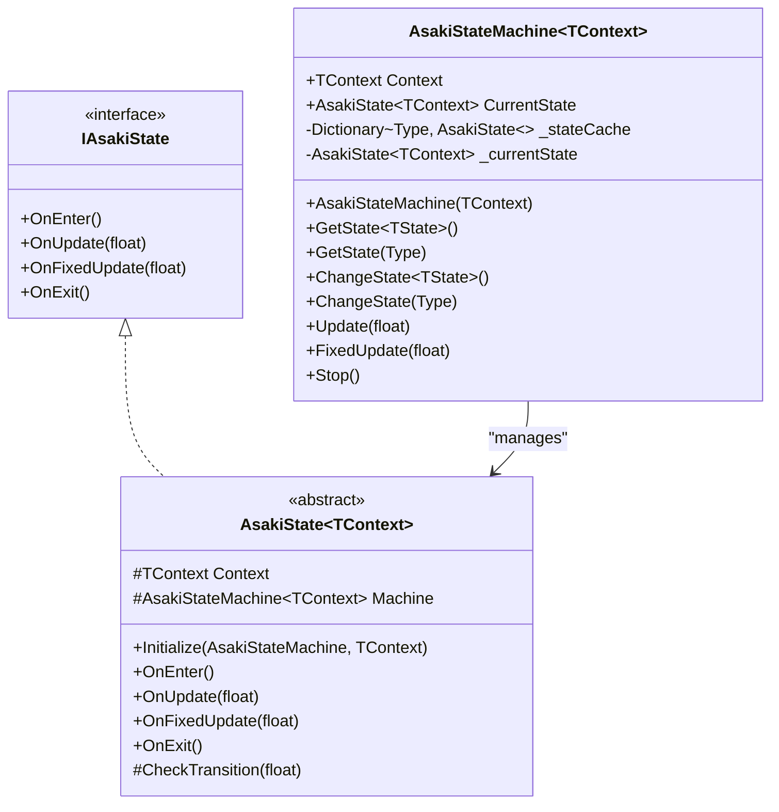
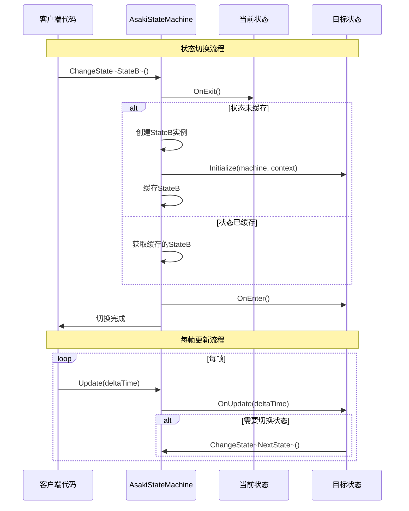
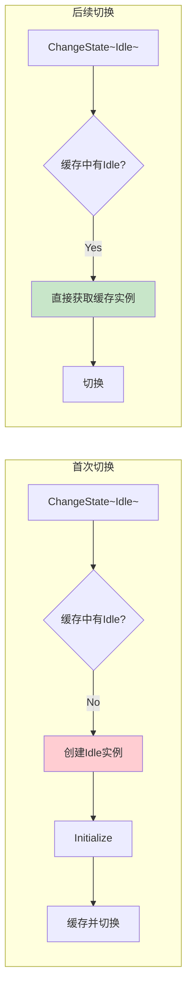

# Asaki Core/FSM 模块架构文档

## 目录

1. [设计理念](#1-设计理念)
2. [软件架构](#2-软件架构)
3. [API参考](#3-api参考)
4. [好的示例](#4-好的示例)
5. [坏的示例](#5-坏的示例)

---

## 1. 设计理念

### 1.1 为什么需要状态机

在Unity游戏开发中，实体（如角色、AI、UI界面）往往需要根据不同条件在不同行为之间切换。传统的if-else或switch-case方式存在以下问题：

- **代码耦合**：状态逻辑与主控制器混合，难以维护
- **扩展困难**：新增状态需要修改现有代码，容易引入bug
- **难以测试**：状态逻辑无法独立测试
- **状态遗漏**：复杂状态转换条件难以覆盖所有组合

状态机（State Machine）通过将每种状态封装为独立对象，清晰定义状态转换规则，解决上述问题。Asaki FSM模块提供了轻量级、高性能的状态机实现。

### 1.2 懒加载缓存的设计动机

传统状态机实现通常在初始化时创建所有状态实例，这在状态数量较多时会浪费内存。Asaki FSM采用**懒加载缓存**策略：

- 状态仅在首次切换到该状态时创建
- 创建后缓存复用，后续切换无分配
- 状态机停止时统一清理

这种方法确保：

- 启动时零状态内存开销
- 运行时零GC状态切换
- 内存使用与实际活跃状态数成正比

### 1.3 泛型与类型擦除的双轨设计

Asaki FSM同时支持泛型方法和类型擦除方法：

| 模式 | 方法 | 适用场景 |
|------|------|----------|
| 泛型 | `ChangeState<TState>()` | 编译时确定状态类型，性能最优 |
| 类型擦除 | `ChangeState(Type)` | 运行时动态决定状态，灵活度高 |

类型擦除方法内部进行完整的类型安全验证，确保只有有效的状态类型才能被使用。

### 1.4 Unity生命周期集成

状态机设计为与Unity的MonoBehaviour生命周期无缝配合：

- `Update(float deltaTime)` → MonoBehaviour.Update
- `FixedUpdate(float fixedDeltaTime)` → MonoBehaviour.FixedUpdate

这种设计让状态逻辑可以自然地融入现有的Unity开发模式，同时保持状态代码的独立性和可测试性。

---

## 2. 软件架构

### 2.1 架构概览

Asaki FSM模块采用简洁的两层架构设计：

```mermaid
graph TB
    subgraph "实现层 Implementation"
        ASM[AsakiStateMachine~TContext~]
        AS[AsakiState~TContext~]
    end

    subgraph "接口层 Interfaces"
        IAS[IAsakiState]
    end

    ASM --> AS
    AS ..|> IAS
```

### 2.2 核心类图



### 2.3 状态生命周期流程



### 2.4 状态缓存机制



### 2.5 泛型类型安全

```mermaid
graph LR
    subgraph "泛型方法"
        G1[ChangeState~TState~]
        G2[编译时类型检查]
        G3[无运行时验证开销]
    end

    subgraph "类型擦除方法"
        T1[ChangeState(Type)]
        T2[运行时类型验证]
        T3[Activator.CreateInstance]
    end

    G1 --> G2
    T1 --> T2 --> T3
```

---

## 3. API参考

### 3.1 IAsakiState 接口

状态机状态的核心接口，定义状态的生命周期方法。

| 方法 | 描述 | 参数 | 返回值 |
|------|------|------|--------|
| `OnEnter` | 当状态机进入此状态时调用 | 无 | `void` |
| `OnUpdate` | 每帧更新时调用，与Update同步 | `deltaTime`: 帧间隔时间(秒) | `void` |
| `OnFixedUpdate` | 固定时间间隔调用，与FixedUpdate同步 | `fixedDeltaTime`: 固定帧间隔 | `void` |
| `OnExit` | 当状态机退出此状态时调用 | 无 | `void` |

### 3.2 AsakiState<TContext> 泛型基类

所有具体状态类的基类，提供状态的基础实现和上下文访问。

#### 属性

| 属性 | 类型 | 描述 | 访问级别 |
|------|------|------|----------|
| `Context` | `TContext` | 状态持有者的上下文实例 | `protected` |
| `Machine` | `AsakiStateMachine<TContext>` | 所属的状态机实例 | `protected` |

#### 方法

| 方法 | 描述 | 参数 | 返回值 |
|------|------|------|--------|
| `Initialize` | 初始化状态实例 | `machine`: 状态机实例<br>`context`: 上下文实例 | `void` |
| `OnEnter` | 状态进入时调用（虚方法） | 无 | `void` |
| `OnUpdate` | 每帧更新时调用（虚方法） | `deltaTime`: 帧间隔 | `void` |
| `OnFixedUpdate` | 固定更新时调用（虚方法） | `fixedDeltaTime`: 固定间隔 | `void` |
| `OnExit` | 状态退出时调用（虚方法） | 无 | `void` |
| `CheckTransition` | 检查状态转换条件（虚方法） | `deltaTime`: 帧间隔 | `void` |

### 3.3 AsakiStateMachine<TContext> 状态机主类

管理状态的切换和生命周期。

#### 属性

| 属性 | 类型 | 描述 |
|------|------|------|
| `Context` | `TContext` | 状态持有者的上下文实例（只读） |
| `CurrentState` | `AsakiState<TContext>` | 当前运行的状态实例 |

#### 构造方法

| 方法 | 描述 | 参数 | 返回值 |
|------|------|------|--------|
| `AsakiStateMachine` | 初始化状态机新实例 | `context`: 上下文实例 | 状态机实例 |

#### 核心方法

| 方法 | 描述 | 参数 | 返回值 |
|------|------|------|--------|
| `GetState<TState>` | 获取泛型状态实例 | `TState`: 状态类型 (需满足 `where TState : AsakiState<TContext>, new()`) | `TState` |
| `GetState` | 通过Type获取状态实例 | `stateType`: 状态类型 | `AsakiState<TContext>` |
| `ChangeState<TState>` | 切换到泛型指定的状态 | `TState`: 状态类型 (需满足 `where TState : AsakiState<TContext>, new()`) | `void` |
| `ChangeState` | 通过Type切换状态 | `stateType`: 状态类型 | `void` |
| `Update` | 执行当前状态每帧更新 | `deltaTime`: 帧间隔 | `void` |
| `FixedUpdate` | 执行当前状态物理更新 | `fixedDeltaTime`: 固定间隔 | `void` |
| `Stop` | 停止状态机并清理 | 无 | `void` |

#### 泛型约束说明

- `TContext`：状态持有者类型，无约束
- `TState`：必须继承自`AsakiState<TContext>`，必须提供无参构造函数

---

## 4. 好的示例

### 4.1 基础状态机使用

```csharp
using Asaki.Core.FSM;
using UnityEngine;

/// <summary>
/// 玩家控制器示例
/// </summary>
public class PlayerController : AsakiMono
{
    private AsakiStateMachine<PlayerController> _stateMachine;

    protected override void OnStart()
    {
        // 创建状态机，传入自身作为上下文
        _stateMachine = new AsakiStateMachine<PlayerController>(this);

        // 启动初始状态
        _stateMachine.ChangeState<IdleState>();
    }

    protected override void OnUpdate()
    {
        // 将Unity生命周期传入状态机
        _stateMachine.Update(Time.deltaTime);
    }

    protected override void OnFixedUpdate()
    {
        _stateMachine.FixedUpdate(Time.fixedDeltaTime);
    }

    protected override void Cleanup()
    {
        // 清理状态机
        _stateMachine?.Stop();
    }

    // 供状态类调用的公共方法
    public void Move(Vector3 direction)
    {
        // 移动逻辑实现
    }

    public void PlayAnimation(string animationName)
    {
        // 动画播放逻辑
    }
}

/// <summary>
/// 空闲状态
/// </summary>
public class IdleState : AsakiState<PlayerController>
{
    public override void OnEnter()
    {
        // 进入空闲状态时播放空闲动画
        Context.PlayAnimation("Idle");
    }

    protected override void CheckTransition(float deltaTime)
    {
        // 检查是否应该切换到移动状态
        // 注意：这里使用Machine切换状态
        if (Input.GetKey(KeyCode.W) || Input.GetKey(KeyCode.A) ||
            Input.GetKey(KeyCode.S) || Input.GetKey(KeyCode.D))
        {
            Machine.ChangeState<RunState>();
        }
    }
}

/// <summary>
/// 移动状态
/// </summary>
public class RunState : AsakiState<PlayerController>
{
    public override void OnEnter()
    {
        Context.PlayAnimation("Run");
    }

    public override void OnUpdate(float deltaTime)
    {
        // 处理输入并移动
        Vector3 direction = Vector3.zero;
        if (Input.GetKey(KeyCode.W)) direction.z = 1;
        if (Input.GetKey(KeyCode.S)) direction.z = -1;
        if (Input.GetKey(KeyCode.A)) direction.x = -1;
        if (Input.GetKey(KeyCode.D)) direction.x = 1;

        if (direction != Vector3.zero)
        {
            Context.Move(direction.normalized);
        }
        else
        {
            // 无输入时返回空闲状态
            Machine.ChangeState<IdleState>();
        }
    }

    public override void OnExit()
    {
        // 离开移动状态时停止移动
    }
}
```

### 4.2 AI状态机示例

```csharp
using Asaki.Core.FSM;
using UnityEngine;

/// <summary>
/// 敌人AI控制器
/// </summary>
public class EnemyAI : AsakiMono
{
    private AsakiStateMachine<EnemyAI> _stateMachine;

    protected override void OnStart()
    {
        _stateMachine = new AsakiStateMachine<EnemyAI>(this);
        _stateMachine.ChangeState<PatrolState>();
    }

    protected override void OnUpdate()
    {
        _stateMachine.Update(Time.deltaTime);
    }

    protected override void OnFixedUpdate()
    {
        _stateMachine.FixedUpdate(Time.fixedDeltaTime);
    }

    // AI行为方法
    public void Patrol() { /* 巡逻逻辑 */ }
    public void Chase(Transform target) { /* 追击逻辑 */ }
    public void Attack(Transform target) { /* 攻击逻辑 */ }
    public void ReturnToSpawn() { /* 返回生成点 */ }

    public Transform FindNearestPlayer()
    {
        // 查找最近玩家
        return null;
    }

    protected override void Cleanup()
    {
        _stateMachine?.Stop();
    }
}

/// <summary>
/// 巡逻状态
/// </summary>
public class PatrolState : AsakiState<EnemyAI>
{
    private float _patrolTimer;

    public override void OnEnter()
    {
        _patrolTimer = 0f;
    }

    public override void OnUpdate(float deltaTime)
    {
        _patrolTimer += deltaTime;

        // 执行巡逻行为
        Context.Patrol();

        // 检测到玩家则切换到追击状态
        var player = Context.FindNearestPlayer();
        if (player != null && Vector3.Distance(Context.transform.position, player.position) < 10f)
        {
            Machine.ChangeState<ChaseState>();
        }
    }
}

/// <summary>
/// 追击状态
/// </summary>
public class ChaseState : AsakiState<EnemyAI>
{
    private Transform _targetPlayer;

    public override void OnEnter()
    {
        _targetPlayer = Context.FindNearestPlayer();
    }

    public override void OnUpdate(float deltaTime)
    {
        if (_targetPlayer == null)
        {
            // 玩家丢失，返回巡逻
            Machine.ChangeState<PatrolState>();
            return;
        }

        float distance = Vector3.Distance(Context.transform.position, _targetPlayer.position);

        if (distance < 2f)
        {
            // 距离足够近，切换到攻击状态
            Machine.ChangeState<AttackState>();
        }
        else if (distance > 20f)
        {
            // 玩家跑太远，返回巡逻
            Machine.ChangeState<PatrolState>();
        }
        else
        {
            // 继续追击
            Context.Chase(_targetPlayer);
        }
    }
}

/// <summary>
/// 攻击状态
/// </summary>
public class AttackState : AsakiState<EnemyAI>
{
    private float _attackCooldown;

    public override void OnEnter()
    {
        _attackCooldown = 0f;
    }

    public override void OnUpdate(float deltaTime)
    {
        _attackCooldown -= deltaTime;

        var player = Context.FindNearestPlayer();
        float distance = player != null ? Vector3.Distance(Context.transform.position, player.position) : float.MaxValue;

        if (distance > 3f)
        {
            // 玩家离开攻击范围，返回追击
            Machine.ChangeState<ChaseState>();
            return;
        }

        if (_attackCooldown <= 0f)
        {
            // 执行攻击
            Context.Attack(player);
            _attackCooldown = 1f; // 1秒冷却
        }
    }
}
```

### 4.3 使用类型擦除动态切换状态

```csharp
using Asaki.Core.FSM;
using UnityEngine;

/// <summary>
/// 配置驱动的状态机示例
/// </summary>
public class ConfigDrivenFSM : AsakiMono
{
    [SerializeField] private TextAsset _stateConfig; // JSON配置文件

    private AsakiStateMachine<ConfigDrivenFSM> _stateMachine;

    protected override void OnStart()
    {
        _stateMachine = new AsakiStateMachine<ConfigDrivenFSM>(this);

        // 从配置读取初始状态
        var initialState = GetInitialStateFromConfig();
        _stateMachine.ChangeState(initialState);
    }

    protected override void OnUpdate()
    {
        _stateMachine.Update(Time.deltaTime);
    }

    private Type GetInitialStateFromConfig()
    {
        // 模拟从配置读取状态类型
        return typeof(IdleState);
    }

    /// <summary>
    /// 供外部调用的动态状态切换
    /// </summary>
    public void SwitchToState(string stateName)
    {
        Type stateType = GetStateTypeByName(stateName);
        if (stateType != null)
        {
            _stateMachine.ChangeState(stateType);
        }
    }

    private Type GetStateTypeByName(string name)
    {
        // 状态名称映射
        return name switch
        {
            "Idle" => typeof(IdleState),
            "Run" => typeof(RunState),
            "Jump" => typeof(JumpState),
            "Attack" => typeof(AttackState),
            _ => null
        };
    }
}
```

### 4.4 物理状态示例

```csharp
using Asaki.Core.FSM;
using UnityEngine;

/// <summary>
/// 跳跃状态 - 展示FixedUpdate的使用
/// </summary>
public class JumpState : AsakiState<PlayerController>
{
    private Rigidbody _rb;
    private bool _isGrounded;

    public override void OnEnter()
    {
        // 获取刚体组件（从Context获取）
        _rb = Context.GetComponent<Rigidbody>();
        if (_rb != null)
        {
            // 施加跳跃力
            _rb.AddForce(Vector3.up * 10f, ForceMode.Impulse);
        }
    }

    /// <summary>
    /// 物理更新 - 用于处理刚体相关逻辑
    /// </summary>
    public override void OnFixedUpdate(float fixedDeltaTime)
    {
        // 检查是否落地
        if (_rb != null)
        {
            _isGrounded = Physics.CheckSphere(
                Context.transform.position + Vector3.down * 0.5f,
                0.2f
            );

            // 落地后切换回地面状态
            if (_isGrounded && _rb.velocity.y < 0.1f)
            {
                Machine.ChangeState<IdleState>();
            }
        }
    }

    public override void OnUpdate(float deltaTime)
    {
        // 可以在Update中处理非物理逻辑
        // 例如：播放跳跃动画
    }

    public override void OnExit()
    {
        // 清理刚体速度（如果需要）
        if (_rb != null)
        {
            _rb.velocity = new Vector3(_rb.velocity.x, 0, _rb.velocity.z);
        }
    }
}
```

---

## 5. 坏的示例

### 5.1 状态切换逻辑放在Unity生命周期中

```csharp
// 错误示例：在Update中混合状态转换逻辑
public class BadExample1 : MonoBehaviour
{
    private void Update()
    {
        if (isIdle && Input.GetKeyDown(KeyCode.Space))
        {
            // 问题：状态逻辑与主控制器耦合
            // 状态切换散落在各处，难以维护
            isIdle = false;
            isJumping = true;
            PlayAnimation("Jump");
        }

        if (isJumping && IsGrounded())
        {
            // 另一个状态转换点
            isJumping = false;
            isIdle = true;
        }
    }
}

// 正确示例：使用状态机封装状态逻辑
public class GoodExample1 : AsakiMono
{
    private AsakiStateMachine<Player> _stateMachine;

    protected override void OnUpdate()
    {
        // 状态转换逻辑封装在状态类中
        _stateMachine.Update(Time.deltaTime);
    }
}
```

### 5.2 在状态中直接创建其他状态实例

```csharp
// 错误示例：手动创建状态实例
public class BadExample2 : AsakiState<PlayerController>
{
    public override void OnUpdate(float deltaTime)
    {
        if (shouldSwitch)
        {
            // 问题：手动创建实例绕过了状态机的缓存机制
            // 每次切换都会创建新对象，导致GC问题
            var newState = new RunState();
            newState.Initialize(Machine, Context);
            Machine.ChangeState<RunState>();
        }
    }
}

// 正确示例：通过状态机切换
public class GoodExample2 : AsakiState<PlayerController>
{
    protected override void CheckTransition(float deltaTime)
    {
        if (shouldSwitch)
        {
            // 状态机自动处理缓存
            Machine.ChangeState<RunState>();
        }
    }
}
```

### 5.3 忘记调用基类方法

```csharp
// 错误示例：忘记调用base.OnEnter()
public class BadExample3 : AsakiState<PlayerController>
{
    public override void OnEnter()
    {
        // 问题：没有调用base.OnEnter()
        // 基类的初始化逻辑被跳过，可能导致Context为null
        Context.PlayAnimation("CustomAnimation");
    }

    public override void OnUpdate(float deltaTime)
    {
        // 问题：没有调用base.OnUpdate()
        // CheckTransition()不会被调用，状态永远不会自动切换
        DoCustomLogic();
    }
}

// 正确示例：正确调用基类方法
public class GoodExample3 : AsakiState<PlayerController>
{
    public override void OnEnter()
    {
        base.OnEnter(); // 先调用基类
        Context.PlayAnimation("CustomAnimation");
    }

    public override void OnUpdate(float deltaTime)
    {
        base.OnUpdate(deltaTime); // 先调用基类，会触发CheckTransition
        DoCustomLogic();
    }
}
```

### 5.4 在OnEnter中进行长时间操作

```csharp
// 错误示例：在OnEnter中执行耗时操作
public class BadExample4 : AsakiState<PlayerController>
{
    public override void OnEnter()
    {
        // 问题：OnEnter应该快速返回
        // 耗时操作会阻塞状态切换
        LoadHeavyResource();
        InitializeComplexData();
    }
}

// 正确示例：使用异步初始化
public class GoodExample4 : AsakiState<PlayerController>
{
    private bool _isInitialized;

    public override void OnEnter()
    {
        // 快速返回，标记需要初始化
        _isInitialized = false;
    }

    public override void OnUpdate(float deltaTime)
    {
        if (!_isInitialized)
        {
            // 在Update中分帧初始化
            InitializeAsync().Forget();
            _isInitialized = true;
        }
    }

    private async UniTask InitializeAsync()
    {
        await LoadHeavyResourceAsync();
    }
}
```

### 5.5 循环状态切换

```csharp
// 错误示例：在OnUpdate中无限循环切换状态
public class BadExample5 : AsakiState<PlayerController>
{
    public override void OnUpdate(float deltaTime)
    {
        // 问题：每帧都切换状态
        // 导致状态机无法执行任何实际逻辑
        if (Context.HasTarget())
        {
            Machine.ChangeState<ChaseState>();
        }
        else
        {
            Machine.ChangeState<IdleState>();
        }
    }
}

// 正确示例：添加切换条件判断
public class GoodExample5 : AsakiState<PlayerController>
{
    protected override void CheckTransition(float deltaTime)
    {
        // 只有状态真正改变时才切换
        bool hasTarget = Context.HasTarget();
        bool shouldChase = hasTarget && !Context.IsInAttackRange();

        if (shouldChase && Machine.CurrentState.GetType() != typeof(ChaseState))
        {
            Machine.ChangeState<ChaseState>();
        }
        else if (!hasTarget && Machine.CurrentState.GetType() != typeof(IdleState))
        {
            Machine.ChangeState<IdleState>();
        }
    }
}
```

### 5.6 状态机未正确清理

```csharp
// 错误示例：未清理状态机导致内存泄漏
public class BadExample6 : MonoBehaviour
{
    private AsakiStateMachine<PlayerController> _stateMachine;

    private void OnDestroy()
    {
        // 问题：状态机未清理
        // 状态缓存中的引用可能导致对象无法被GC回收
    }
}

// 正确示例：正确清理状态机
public class GoodExample6 : AsakiMono
{
    private AsakiStateMachine<PlayerController> _stateMachine;

    protected override void Cleanup()
    {
        // 停止并清理状态机
        _stateMachine?.Stop();
    }
}
```

---

## 附录

### 相关文件路径

- 状态接口: [IAsakiState.cs](file:///e:/Projects/UnityGame/Asaki/Assets/Asaki/Core/FSM/IAsakiState.cs)
- 状态基类: [AsakiState.cs](file:///e:/Projects/UnityGame/Asaki/Assets/Asaki/Core/FSM/AsakiState.cs)
- 状态机实现: [AsakiStateMachine.cs](file:///e:/Projects/UnityGame/Asaki/Assets/Asaki/Core/FSM/AsakiStateMachine.cs)

### 依赖关系

- AsakiStateMachine 依赖 AsakiState
- AsakiState 实现 IAsakiState 接口

---

_文档生成时间: 2026-03-03_
