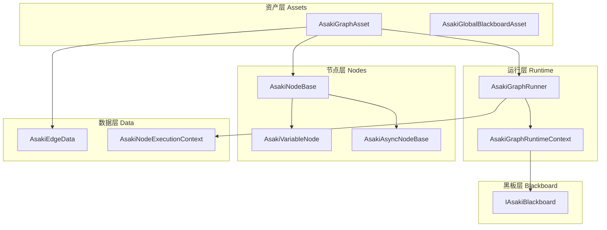
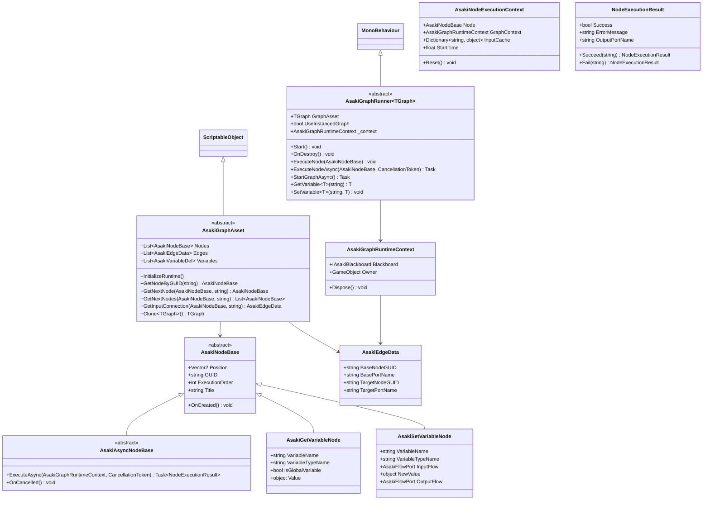
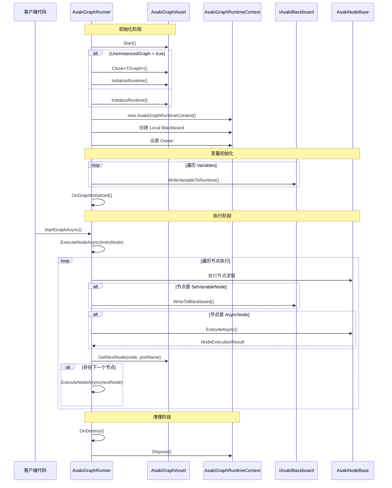
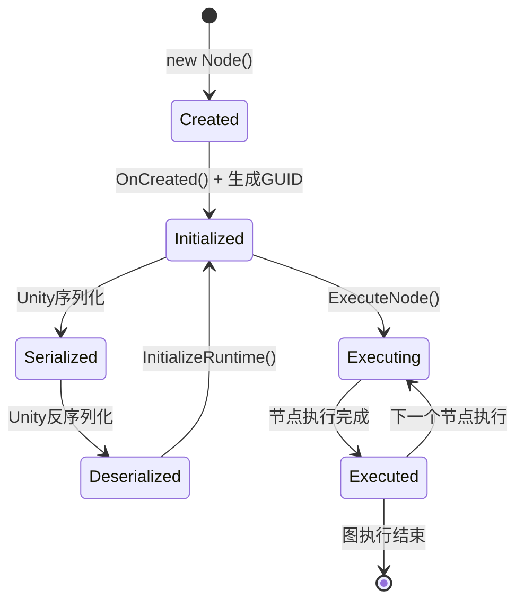

# Asaki Core/Graphs 模块架构文档

## 目录

1. [设计理念](#1-设计理念)
2. [软件架构](#2-软件架构)
3. [API参考](#3-api参考)
4. [好的示例](#4-好的示例)
5. [坏的示例](#5-坏的示例)

---

## 1. 设计理念

### 1.1 为什么需要图结构

在游戏开发中，许多系统天然具有图状的数据结构：

- **行为树（Behavior Tree）**：Selector、Sequence、Condition、Action 等节点构成树形结构
- **对话系统（Dialog Graph）**：对话节点、分支选项、事件触发器形成有向图
- **剧情编辑器（Quest Graph）**：任务节点、依赖关系、奖励发放形成复杂的流程图
- **AI 状态机（State Machine）**：状态节点与转换条件构成有向图

传统的代码实现方式（硬编码 if-else、switch-case）面临以下挑战：

- **逻辑难以可视化**：设计师难以直观理解代码逻辑
- **修改成本高**：调整流程需要修改代码、重新编译
- **复用困难**：类似逻辑难以在不同项目间迁移

Asaki Graphs 模块提供**运行时图执行框架**，支持：

- 节点序列化与反序列化（基于 ScriptableObject）
- 编辑器友好的图结构（节点位置、GUID 稳定引用）
- 运行时高效的拓扑查询（O(1) 缓存）
- 灵活的执行模型（同步/异步）

### 1.2 数据流与控制流分离设计

图执行有两种典型模式：

| 模式 | 描述 | 适用场景 |
|------|------|----------|
| **控制流（Control Flow）** | 节点按连接顺序执行，前一个节点完成后执行下一个 | 行为树、对话树 |
| **数据流（Data Flow）** | 节点按依赖关系计算，值变化时触发下游更新 | 表达式求值、属性绑定 |

Asaki Graphs 采用**混合模式**：

- **Flow 端口**：白色菱形，表示控制流方向（执行顺序）
- **Value 端口**：彩色圆形，表示数据流动（值传递）

这种设计允许：
- 简单流程使用顺序执行（控制流主导）
- 复杂逻辑使用依赖传播（数据流主导）
- 两者可自由组合

### 1.3 运行时缓存设计

图资源在 Unity 中序列化时，节点和边以线性列表存储：

```csharp
Nodes = [NodeA, NodeB, NodeC, ...]      // List<AsakiNodeBase>
Edges = [Edge1, Edge2, Edge3, ...]    // List<AsakiEdgeData>
```

直接遍历这些列表查询连接关系会达到 O(N) 或 O(E) 复杂度。Asaki Graphs 在运行时构建三层缓存：

| 缓存 | 作用 | 时间复杂度 |
|------|------|-----------|
| `_nodeLookup` | GUID → 节点实例 | O(1) |
| `_outgoingCache` | 源节点 → 端口 → 目标节点列表 | O(1) |
| `_incomingCache` | 目标节点 → 端口 → 边数据 | O(1) |

**延迟初始化策略**：缓存在 `InitializeRuntime()` 时构建，而非反序列化时立即构建，原因包括：

- Unity 反序列化可能在非主线程执行，复杂字典操作不安全
- 避免编辑器加载资源时的即时性能开销
- 支持 Lazy Load，按需构建

### 1.4 黑板系统集成

Asaki Graphs 与 Asaki Blackboard 深度集成：

- **图局部黑板（Local Blackboard）**：每个图实例拥有独立的变量空间
- **全局黑板（Global Blackboard）**：跨图共享的系统级变量
- **作用域链**：Local 变量遮蔽同名的 Global 变量

这种设计支持：

- 同一图资源的多个实例拥有独立状态（如多个 AI 敌人）
- 全局配置（如难度等级、玩家状态）可被所有图访问
- 变量类型安全与运行时验证

---

## 2. 软件架构

### 2.1 架构概览



### 2.2 核心类图



### 2.3 图执行流程



### 2.4 节点生命周期



### 2.5 异步执行模型

Asaki Graphs 支持两种执行模式：

| 模式 | 方法 | 适用场景 |
|------|------|----------|
| 同步执行 | `ExecuteNode(AsakiNodeBase)` | 轻量级逻辑、无等待 |
| 异步执行 | `ExecuteNodeAsync(AsakiNodeBase, CancellationToken)` | 异步操作（IO、网络、加载） |

异步节点继承 `AsakiAsyncNodeBase`，返回 `NodeExecutionResult`：

```csharp
public struct NodeExecutionResult
{
    public bool Success;           // 执行是否成功
    public string ErrorMessage;    // 错误信息
    public string OutputPortName;  // 输出端口名（Success→"Out", Failure→"Error"）
}
```

**执行端口约定**：

- `"Out"`：正常执行完成
- `"Error"`：执行失败

---

## 3. API参考

### 3.1 AsakiGraphAsset 核心方法

图资源的抽象基类，管理节点、边和变量的运行时生命周期。

| 方法 | 描述 | 参数 | 返回值 |
|------|------|------|--------|
| `InitializeRuntime` | 构建运行时拓扑缓存 | 无 | `void` |
| `GetNodeByGUID` | 通过GUID查找节点 | `guid`: 节点GUID | `AsakiNodeBase` 或 `null` |
| `GetNextNode` | 获取从指定端口连接的第一个目标节点 | `current`: 源节点<br>`portName`: 端口名 | `AsakiNodeBase` 或 `null` |
| `GetNextNodes` | 获取从指定端口连接的所有目标节点 | `current`: 源节点<br>`portName`: 端口名 | `List<AsakiNodeBase>` |
| `GetInputConnection` | 获取连接到目标节点指定输入端口的边 | `targetNode`: 目标节点<br>`inputPortName`: 端口名 | `AsakiEdgeData` 或 `null` |
| `GetEntryNode<T>` | 获取图的入口节点 | 类型参数 `T` | `T` 或 `null` |
| `Clone<TGraph>` | 深拷贝图资源 | 类型参数 `TGraph` | `TGraph` |

### 3.2 AsakiGraphRunner<TGraph> 核心方法

图运行器，管理图的执行和变量访问。

| 方法 | 描述 | 参数 | 返回值 |
|------|------|------|--------|
| `StartGraphAsync` | 异步启动图执行 | 无 | `Task` |
| `ExecuteNode` | 同步执行单个节点 | `node`: 节点实例 | `void` |
| `ExecuteNodeAsync` | 异步执行单个节点 | `node`: 节点实例<br>`ct`: 取消令牌 | `Task` |
| `StopToken` | 停止图执行并释放取消令牌 | 无 | `void` |
| `GetVariable<T>` | 读取黑板变量 | `key`: 变量名 | `T` |
| `SetVariable<T>` | 写入黑板变量 | `key`: 变量名<br>`value`: 值 | `void` |
| `ResetAllVariablesToDefault` | 重置所有变量到默认值 | 无 | `void` |
| `ResetVariable` | 重置单个变量到默认值 | `key`: 变量名 | `void` |
| `BatchUpdateVariables` | 批量更新变量 | `updates`: 更新操作 | `void` |
| `GetRuntimeGraph` | 获取运行时图实例 | 无 | `TGraph` |

### 3.3 AsakiNodeBase 节点基类

所有节点的基类，定义基础数据属性。

| 属性 | 类型 | 描述 |
|------|------|------|
| `Position` | `Vector2` | 节点在编辑器中的位置 |
| `GUID` | `string` | 节点的全局唯一标识符 |
| `ExecutionOrder` | `int` | 节点执行顺序 |
| `Title` | `string` | 节点显示标题 |

| 方法 | 描述 |
|------|------|
| `OnCreated` | 节点创建时的回调，用于初始化 |

### 3.4 AsakiAsyncNodeBase 异步节点基类

支持异步执行的节点基类。

| 方法 | 描述 | 参数 | 返回值 |
|------|------|------|--------|
| `ExecuteAsync` | 异步执行节点逻辑 | `context`: 运行时上下文<br>`cancellationToken`: 取消令牌 | `Task<NodeExecutionResult>` |
| `OnCancelled` | 取消时的回调 | 无 | `void` |

### 3.5 AsakiVariableNode 变量节点

#### AsakiGetVariableNode

读取黑板变量的节点。

| 属性 | 类型 | 描述 |
|------|------|------|
| `VariableName` | `string` | 要读取的变量名 |
| `VariableTypeName` | `string` | 变量类型名称 |
| `IsGlobalVariable` | `bool` | 是否读取全局黑板 |
| `Value` | `object` | 输出端口值 |

#### AsakiSetVariableNode

写入黑板变量的节点。

| 属性 | 类型 | 描述 |
|------|------|------|
| `VariableName` | `string` | 要写入的变量名 |
| `VariableTypeName` | `string` | 变量类型名称 |
| `InputFlow` | `AsakiFlowPort` | 输入Flow端口 |
| `NewValue` | `object` | 输入值端口 |
| `OutputFlow` | `AsakiFlowPort` | 输出Flow端口 |

### 3.6 AsakiGraphRuntimeContext 运行时上下文

图执行期间的运行时环境封装。

| 属性 | 类型 | 描述 |
|------|------|------|
| `Blackboard` | `IAsakiBlackboard` | 运行时黑板实例 |
| `Owner` | `GameObject` | 拥有此Runner的GameObject |

| 方法 | 描述 |
|------|------|
| `Dispose` | 释放上下文资源 |

### 3.7 AsakiEdgeData 边数据

表示节点之间的连接关系。

| 属性 | 类型 | 描述 |
|------|------|------|
| `BaseNodeGUID` | `string` | 源节点GUID |
| `BasePortName` | `string` | 源节点输出端口名 |
| `TargetNodeGUID` | `string` | 目标节点GUID |
| `TargetPortName` | `string` | 目标节点输入端口名 |

### 3.8 NodeExecutionResult 节点执行结果

异步节点的执行结果封装。

| 属性 | 类型 | 描述 |
|------|------|------|
| `Success` | `bool` | 执行是否成功 |
| `ErrorMessage` | `string` | 错误信息 |
| `OutputPortName` | `string` | 输出端口名 |

| 静态方法 | 描述 | 参数 | 返回值 |
|----------|------|------|--------|
| `Succeed` | 创建成功结果 | `outputPort`: 输出端口名 | `NodeExecutionResult` |
| `Fail` | 创建失败结果 | `error`: 错误信息 | `NodeExecutionResult` |

---

## 4. 好的示例

### 4.1 基础图运行器

```csharp
using System.Threading;
using System.Threading.Tasks;
using Asaki.Core.Context;
using Asaki.Core.Graphs;
using Asaki.Unity;
using Cysharp.Threading.Tasks;
using UnityEngine;

/// <summary>
/// 行为树运行器示例
/// </summary>
/// <remarks>
/// AsakiGraphRunner 继承自 MonoBehaviour，是图执行的入口点
/// 如需使用 AsakiMono 的依赖注入和生命周期功能，可使用组合模式
/// </remarks>
public class BehaviorTreeRunner : AsakiGraphRunner<BehaviorTreeGraph>
{
    private IAsakiGraphService _graphService;

    void IAsakiInject<IAsakiGraphService>.Inject(IAsakiGraphService graphService)
    {
        _graphService = graphService;
    }

    /// <summary>
    /// 图初始化完成后的回调（由 AsakiGraphRunner 提供）
    /// </summary>
    protected override void OnGraphInitialized()
    {
        // 可以在这里注册事件或额外初始化
        Debug.Log("[BehaviorTreeRunner] Graph initialized");
    }

    /// <summary>
    /// 启动图执行
    /// </summary>
    public async void StartExecution()
    {
        // 使用 async UniTask + .Forget() 方式启动异步执行
        await StartGraphAsync();
    }

    /// <summary>
    /// 停止图执行
    /// </summary>
    public void StopExecution()
    {
        StopToken();
    }

    /// <summary>
    /// 执行自定义节点类型的逻辑
    /// </summary>
    protected override void OnExecuteCustomNode(AsakiNodeBase node)
    {
        // 根据节点类型执行对应逻辑
        // 可以使用 switch 或策略模式扩展
    }
}

/// <summary>
/// 行为树图资源
/// </summary>
[CreateAssetMenu(menuName = "Asaki/Behavior Tree")]
public class BehaviorTreeGraph : AsakiGraphAsset
{
    // 可在此添加行为树特定配置
}
```

### 4.2 异步节点实现

```csharp
using System;
using System.Threading;
using System.Threading.Tasks;
using Asaki.Core.Graphs;
using UnityEngine;

namespace Asaki.CustomNodes
{
    /// <summary>
    /// 等待指定时间的异步节点
    /// </summary>
    [Serializable]
    public class WaitNode : AsakiAsyncNodeBase
    {
        /// <summary>
        /// 等待时长（秒）
        /// </summary>
        public float Duration = 1.0f;

        /// <summary>
        /// 节点显示标题
        /// </summary>
        public override string Title => $"Wait {Duration}s";

        /// <summary>
        /// 异步执行节点逻辑
        /// </summary>
        public override async Task<NodeExecutionResult> ExecuteAsync(
            AsakiGraphRuntimeContext context,
            CancellationToken cancellationToken = default
        )
        {
            try
            {
                // 等待指定时间
                await Task.Delay(TimeSpan.FromSeconds(Duration), cancellationToken);

                // 返回成功结果，从 Out 端口继续
                return NodeExecutionResult.Succeed("Out");
            }
            catch (OperationCanceledException)
            {
                // 被取消时调用取消回调
                OnCancelled();
                return NodeExecutionResult.Fail("Cancelled");
            }
        }

        /// <summary>
        /// 节点创建时的初始化
        /// </summary>
        public override void OnCreated()
        {
            if (string.IsNullOrEmpty(GUID))
            {
                GUID = Guid.NewGuid().ToString();
            }
        }
    }

    /// <summary>
    /// 条件判断节点
    /// </summary>
    [Serializable]
    public class ConditionNode : AsakiAsyncNodeBase
    {
        /// <summary>
        /// 要检查的变量名
        /// </summary>
        public string VariableName;

        /// <summary>
        /// 期望值
        /// </summary>
        public string ExpectedValue;

        public override string Title => $"Check: {VariableName}";

        public override async Task<NodeExecutionResult> ExecuteAsync(
            AsakiGraphRuntimeContext context,
            CancellationToken cancellationToken = default
        )
        {
            // 同步逻辑也通过异步方式执行
            // 这样可以统一执行流程

            if (context.Blackboard == null)
            {
                return NodeExecutionResult.Fail("Blackboard is null");
            }

            // 读取变量值并比较
            string actualValue = context.Blackboard.GetValue<string>(VariableName);

            if (actualValue == ExpectedValue)
            {
                return NodeExecutionResult.Succeed("Out");
            }
            else
            {
                // 条件不满足，从 Failure 端口继续
                return NodeExecutionResult.Succeed("Failure");
            }
        }
    }
}
```

### 4.3 图服务与依赖注入

```csharp
using Asaki.Core.Context;
using Asaki.Core.Graphs;
using Asaki.Unity;

/// <summary>
/// 图服务接口
/// </summary>
public interface IAsakiGraphService
{
    void RegisterRunner(string graphId, AsakiGraphRunner runner);
    AsakiGraphRunner GetRunner(string graphId);
    void UnregisterRunner(string graphId);
}

/// <summary>
/// 图服务实现
/// </summary>
public class AsakiGraphService : AsakiMono, IAsakiGraphService, IAsakiGlobalService
{
    private readonly Dictionary<string, AsakiGraphRunner> _runners = new();

    public void RegisterRunner(string graphId, AsakiGraphRunner runner)
    {
        if (_runners.ContainsKey(graphId))
        {
            Debug.LogWarning($"[AsakiGraphService] Runner '{graphId}' already registered, overwriting.");
        }
        _runners[graphId] = runner;
    }

    public AsakiGraphRunner GetRunner(string graphId)
    {
        return _runners.GetValueOrDefault(graphId);
    }

    public void UnregisterRunner(string graphId)
    {
        _runners.Remove(graphId);
    }

    protected override void OnStart() { }

    protected override void OnUpdate() { }
}

/// <summary>
/// 使用图服务的组件
/// </summary>
public class GraphUserComponent : AsakiMono, IAsakiAutoInject
{
    private IAsakiGraphService _graphService;

    void IAsakiInject<IAsakiGraphService>.Inject(IAsakiGraphService graphService)
    {
        _graphService = graphService;
    }

    protected override void OnStart()
    {
        // 注册运行器
        var runner = GetComponent<BehaviorTreeRunner>();
        _graphService?.RegisterRunner("PlayerAI", runner);
    }
}
```

### 4.4 变量操作示例

```csharp
using Asaki.Core.Graphs;
using Asaki.Unity;
using UnityEngine;

/// <summary>
/// 通过代码操作图的变量
/// </summary>
public class VariableOperationsExample : AsakiMono
{
    [SerializeField] private BehaviorTreeRunner _runner;

    protected override void OnStart()
    {
        // 读取变量
        int health = _runner.GetVariable<int>("PlayerHealth");
        Vector3 position = _runner.GetVariable<Vector3>("PlayerPosition");

        // 写入变量
        _runner.SetVariable("GameDifficulty", "Hard");
        _runner.SetVariable("Score", 100);

        // 批量更新变量
        _runner.BatchUpdateVariables(blackboard =>
        {
            blackboard.SetValue("PlayerHealth", 100);
            blackboard.SetValue("IsInvincible", false);
        });

        // 重置变量到默认值
        _runner.ResetAllVariablesToDefault();

        // 重置单个变量
        _runner.ResetVariable("Score");
    }

    private void Update()
    {
        // 持续读取变量
        if (_runner != null)
        {
            bool isGamePaused = _runner.GetVariable<bool>("IsPaused");
            if (isGamePaused)
            {
                Time.timeScale = 0f;
            }
        }
    }
}
```

### 4.5 创建自定义图资产

```csharp
using Asaki.Core.Graphs;
using UnityEngine;

/// <summary>
/// 对话图资产
/// </summary>
[CreateAssetMenu(menuName = "Asaki/Dialog Graph")]
public class DialogGraph : AsakiGraphAsset
{
    /// <summary>
    /// 对话图特定的入口节点获取逻辑
    /// </summary>
    public new DialogEntryNode GetEntryNode<T>() where T : DialogEntryNode
    {
        // 查找标记为入口的节点
        foreach (var node in Nodes)
        {
            if (node is DialogEntryNode entryNode)
            {
                return entryNode;
            }
        }
        return base.GetEntryNode<DialogEntryNode>();
    }
}

/// <summary>
/// 对话入口节点
/// </summary>
[System.Serializable]
public class DialogEntryNode : AsakiNodeBase
{
    public string SpeakerName;

    public override string Title => $"Start: {SpeakerName}";

    public override void OnCreated()
    {
        if (string.IsNullOrEmpty(GUID))
        {
            GUID = System.Guid.NewGuid().ToString();
        }
    }
}

/// <summary>
/// 对话文本节点
/// </summary>
[System.Serializable]
public class DialogTextNode : AsakiNodeBase
{
    public string Text = "Hello!";

    public override string Title => $"Say: {(string.IsNullOrEmpty(Text) ? "" : Text.Substring(0, Mathf.Min(10, Text.Length)))}...";
}
```

---

## 5. 坏的示例

### 5.1 在非主线程访问图

```csharp
// 错误示例：在后台线程尝试执行图
public class BadExample1 : MonoBehaviour
{
    private BehaviorTreeRunner _runner;

    private void Start()
    {
        // 错误：在 Task.Run 中访问 Unity 对象
        Task.Run(() =>
        {
            // 这会导致崩溃或未定义行为
            _runner.SetVariable("ThreadData", "value");
        });
    }
}

// 正确示例：使用 UniTask 在主线程执行
public class GoodExample1 : MonoBehaviour
{
    private BehaviorTreeRunner _runner;

    private void Start()
    {
        // 使用 UniTask 切换到主线程
        LoadDataAsync().Forget();
    }

    private async UniTask LoadDataAsync()
    {
        // 模拟异步操作
        await UniTask.Delay(1000);

        // 在主线程安全地访问
        _runner?.SetVariable("DataLoaded", true);
    }
}
```

### 5.2 忘记初始化图

```csharp
// 错误示例：未调用 InitializeRuntime 就访问图
public class BadExample2 : MonoBehaviour
{
    [SerializeField] private BehaviorTreeGraph _graph;

    private void Start()
    {
        // 错误：直接访问图但未初始化
        var node = _graph.GetNodeByGUID("some-guid");
    }
}

// 正确示例：显式初始化
public class GoodExample2 : MonoBehaviour
{
    [SerializeField] private BehaviorTreeGraph _graph;

    private void Start()
    {
        // 初始化运行时缓存
        _graph.InitializeRuntime();

        // 现在可以安全访问
        var node = _graph.GetNodeByGUID("some-guid");
    }
}
```

### 5.3 未正确处理取消令牌

```csharp
// 错误示例：忽略取消令牌，导致资源泄漏
public class BadNetworkNode : AsakiAsyncNodeBase
{
    public string Url;

    public override async Task<NodeExecutionResult> ExecuteAsync(
        AsakiGraphRuntimeContext context,
        CancellationToken cancellationToken = default
    )
    {
        // 错误：没有传递取消令牌
        var result = await FetchDataAsync(Url);

        return NodeExecutionResult.Succeed("Out");
    }

    private async Task<string> FetchDataAsync(string url)
    {
        using var client = new HttpClient();
        var response = await client.GetStringAsync(url);
        return response;
    }
}

// 正确示例：正确传递取消令牌
public class GoodNetworkNode : AsakiAsyncNodeBase
{
    public string Url;

    public override async Task<NodeExecutionResult> ExecuteAsync(
        AsakiGraphRuntimeContext context,
        CancellationToken cancellationToken = default
    )
    {
        try
        {
            // 正确：传递取消令牌
            var result = await FetchDataAsync(Url, cancellationToken);
            return NodeExecutionResult.Succeed("Out");
        }
        catch (OperationCanceledException)
        {
            OnCancelled();
            return NodeExecutionResult.Fail("Cancelled");
        }
        catch (Exception ex)
        {
            return NodeExecutionResult.Fail(ex.Message);
        }
    }

    private async Task<string> FetchDataAsync(string url, CancellationToken ct)
    {
        using var client = new HttpClient();
        var response = await client.GetStringAsync(url, ct);
        return response;
    }
}
```

### 5.4 未释放运行时上下文

```csharp
// 错误示例：未在 OnDestroy 中释放上下文
public class BadRunner : AsakiGraphRunner<BehaviorTreeGraph>
{
    private void OnDestroy()
    {
        // 错误：没有释放上下文资源
        // 会导致黑板订阅者内存泄漏
    }
}

// 正确示例：正确释放资源
public class GoodRunner : AsakiGraphRunner<BehaviorTreeGraph>
{
    // Unity 会自动调用基类的 OnDestroy
    // 基类已经正确实现了资源释放
    protected override void OnDestroy()
    {
        // 停止异步执行
        StopToken();

        // 基类会正确释放 _context
        base.OnDestroy();
    }
}
```

### 5.5 使用 async void 而不是 UniTask

```csharp
// 错误示例：使用 async void
public class BadExample : MonoBehaviour
{
    private BehaviorTreeRunner _runner;

    private async void Start()
    {
        // async void 风险：无法捕获异常，无法取消
        await _runner.StartGraphAsync();
    }
}

// 正确示例：使用 async UniTask + .Forget()
public class GoodExample : MonoBehaviour
{
    private BehaviorTreeRunner _runner;

    protected override void OnStart()
    {
        // 正确：使用 UniTask 并在适当时候调用 .Forget()
        StartGraphExecutionAsync().Forget();
    }

    private async UniTask StartGraphExecutionAsync()
    {
        try
        {
            await _runner.StartGraphAsync();
        }
        catch (Exception ex)
        {
            Debug.LogError($"Graph execution failed: {ex}");
        }
    }
}
```

### 5.6 修改序列化后的图

```csharp
// 错误示例：修改原始图资源
public class BadExample : MonoBehaviour
{
    [SerializeField] private BehaviorTreeGraph _originalGraph;

    private void Start()
    {
        // 错误：直接修改原始资源，影响所有引用
        _originalGraph.Nodes.Add(new CustomNode());
    }
}

// 正确示例：使用实例化图
public class GoodExample : MonoBehaviour
{
    [SerializeField] private BehaviorTreeGraph _graphAsset;
    [SerializeField] private bool _useInstancedGraph = true;

    private BehaviorTreeRunner _runner;

    private void Start()
    {
        // Runner 会自动克隆图（如果 UseInstancedGraph = true）
        // 原始资源不会被修改
    }
}

// 另一种正确做法：手动克隆
public class GoodExample2 : MonoBehaviour
{
    [SerializeField] private BehaviorTreeGraph _originalGraph;

    private void Start()
    {
        // 显式克隆后再修改
        var instance = _originalGraph.Clone<BehaviorTreeGraph>();
        instance.InitializeRuntime();

        // 修改实例，不影响原始资源
        instance.Nodes.Add(new CustomNode());
    }
}
```

---

## 附录

### 相关文件路径

- 图资源基类: [AsakiGraphAsset.cs](file:///e:/Projects/UnityGame/Asaki/Assets/Asaki/Core/Graphs/AsakiGraphAsset.cs)
- 图运行器: [AsakiGraphRunner.cs](file:///e:/Projects/UnityGame/Asaki/Assets/Asaki/Core/Graphs/AsakiGraphRunner.cs)
- 节点基类: [AsakiNodeBase.cs](file:///e:/Projects/UnityGame/Asaki/Assets/Asaki/Core/Graphs/AsakiNodeBase.cs)
- 变量节点: [AsakiVariableNode.cs](file:///e:/Projects/UnityGame/Asaki/Assets/Asaki/Core/Graphs/AsakiVariableNode.cs)
- 异步节点基类: [AsakiAsyncNodeBase.cs](file:///e:/Projects/UnityGame/Asaki/Assets/Asaki/Core/Graphs/AsakiAsyncNodeBase.cs)
- 边数据: [AsakiEdgeData.cs](file:///e:/Projects/UnityGame/Asaki/Assets/Asaki/Core/Graphs/AsakiEdgeData.cs)
- 运行时上下文: [AsakiGraphRuntimeContext.cs](file:///e:/Projects/UnityGame/Asaki/Assets/Asaki/Core/Graphs/AsakiGraphRuntimeContext.cs)
- 节点执行上下文: [AsakiNodeExecutionContext.cs](file:///e:/Projects/UnityGame/Asaki/Assets/Asaki/Core/Graphs/AsakiNodeExecutionContext.cs)

### 相关模块

- [Blackboard 模块文档](file:///e:/Projects/UnityGame/Asaki/Assets/Asaki/Doc/modules/core/blackboard/architecture.md)
- [Context 模块文档](file:///e:/Projects/UnityGame/Asaki/Assets/Asaki/Doc/modules/core/context/architecture.md)
- [Pooling 模块文档](file:///e:/Projects/UnityGame/Asaki/Assets/Asaki/Doc/modules/core/pooling/architecture.md)

---

_文档生成时间: 2026-03-03_
