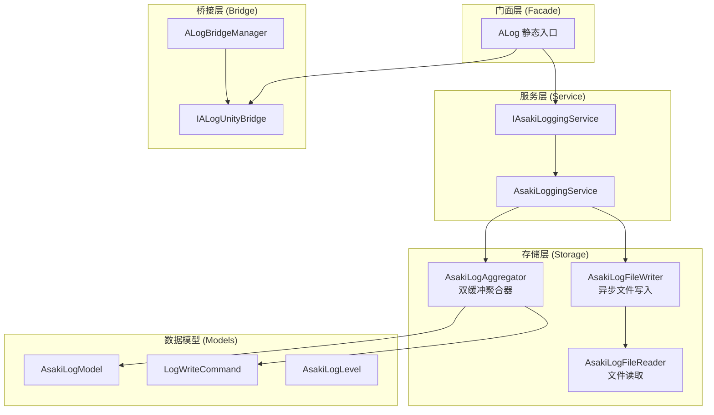
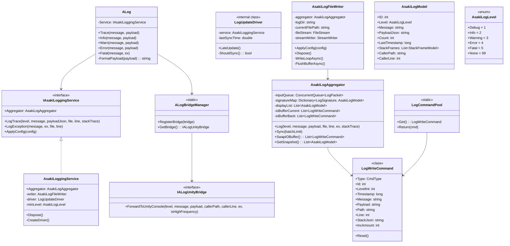
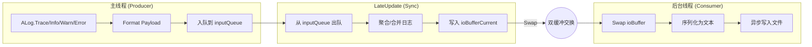
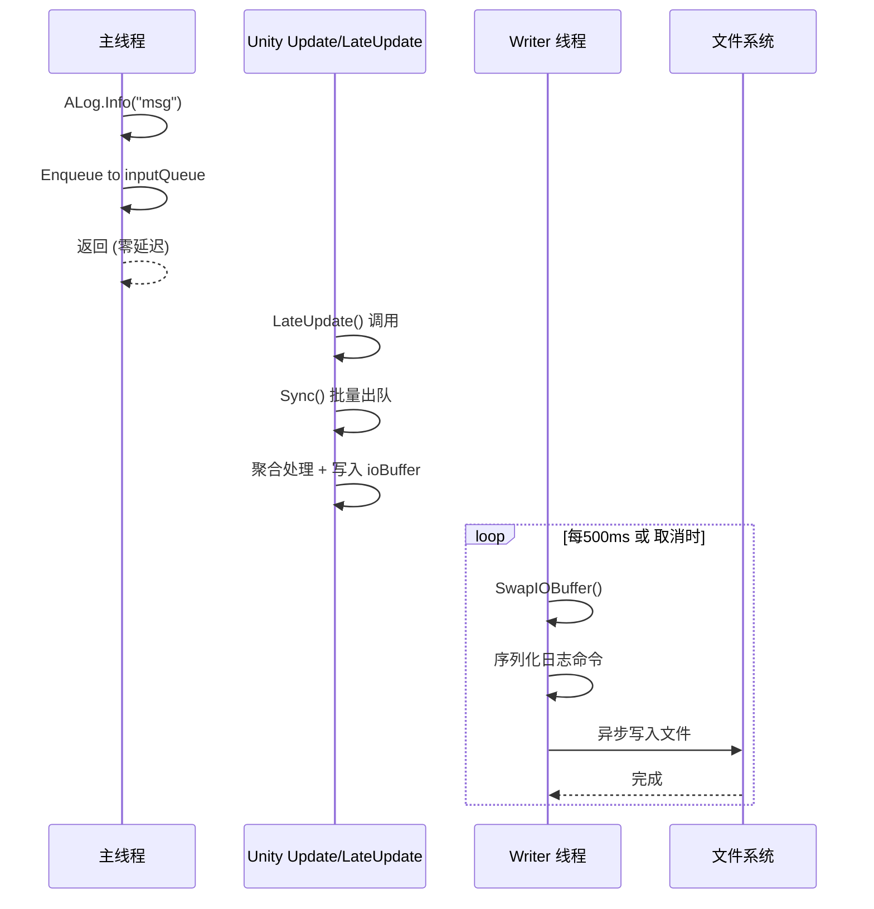

# Asaki Core/Logging 模块架构文档

## 1. 设计理念 (Design Philosophy)

### 1.1 为什么选择生产者-消费者模型

在游戏开发中，日志系统面临一个核心矛盾：**高频写入与低延迟要求之间的冲突**。Unity 的主线程非常宝贵，任何阻塞性 I/O 操作都会直接导致帧率下降或卡顿。传统的同步日志实现（如直接写入文件）在高并发场景下会产生严重的性能问题。

Asaki Logging 采用了经典的生产者-消费者模型来解决这一矛盾：

- **生产者（主线程）**：所有日志调用（`ALog.Info()`、`ALog.Warn()` 等）作为生产者，将日志数据快速放入无锁队列，然后立即返回。生产者永远不会等待 I/O 完成。
- **消费者（后台线程）**：独立的异步写入线程负责从队列中取出日志数据，执行文件 I/O 操作。由于消费者运行在独立线程，主线程永远不会因日志写入而阻塞。

这种模型的优势在于**生产者和消费者的速度可以不同**。即使写入速度暂时跟不上生产速度，队列会暂时积压（背压），但主线程始终保持流畅。队列积压时系统会智能丢弃低优先级日志（Trace/Info），保证核心业务不受影响。

### 1.2 零 GC 设计的技术实现

Unity 游戏对 GC（垃圾回收）非常敏感，因为 GC 会导致帧率突变（帧时间 spikes）。Asaki Logging 从设计之初就将零 GC 作为核心目标，通过以下技术手段实现：

**对象池技术（Object Pool）**

日志写入命令（`LogWriteCommand`）是高频创建的对象。传统的做法是每次日志调用都 `new` 一个命令对象，这会产生大量 GC。Asaki 实现了 `LogCommandPool` 对象池：

```csharp
// 从池中获取命令对象（零分配）
var cmd = LogCommandPool.Get();
cmd.Type = LogWriteCommand.CmdType.Def;
cmd.Id = logId;
// ... 填充数据
_ioBufferCurrent.Add(cmd);
// 写入完成后归还到池中（零分配）
LogCommandPool.Return(cmd);
```

对象池使用 `ConcurrentStack<T>` 实现无锁的并发获取与归还，性能接近零开销。

**ThreadLocal StringBuilder**

字符串拼接是另一个 GC 高发区。ALog 使用 `ThreadLocal<StringBuilder>` 为每个线程缓存一个 StringBuilder 实例：

```csharp
[ThreadStatic]
private static StringBuilder _tlsStringBuilder;

private static StringBuilder StringBuilderInstance
{
    get
    {
        if (_tlsStringBuilder == null)
            _tlsStringBuilder = new StringBuilder(256);
        return _tlsStringBuilder;
    }
}
```

这样在格式化 Vector3、Quaternion 等 Unity 类型时，无需分配新字符串。

**条件编译**

Trace/Info 级别的调试日志在 Release build 中完全无用，却会消耗性能。ALog 使用 C# 条件编译特性：

```csharp
[Conditional("UNITY_EDITOR")]
[Conditional("DEVELOPMENT_BUILD")]
[MethodImpl(MethodImplOptions.AggressiveInlining)]
public static void Trace(string message, object payload = null, ...)
```

在 Release 版本的发布构建中，`ALog.Trace()` 和 `ALog.Info()` 调用会被完全移除，连方法调用代码都不会生成。

**不同构建下的行为差异**：

| 构建类型 | UNITY_EDITOR | DEVELOPMENT_BUILD | Trace/Info 调用 |
|----------|--------------|-------------------|-----------------|
| Editor 开发 | 启用 | 启用 | 完整保留 |
| Development Build | 禁用 | 启用 | 完整保留 |
| Release Build (发布) | 禁用 | 禁用 | 完全移除（零开销） |
| Master/Release Build | 禁用 | 禁用 | 完全移除（零开销） |

这意味着在发布版本中，高频的追踪日志不会产生任何性能开销，因为编译器根本不会生成这些方法调用的 IL 代码。

### 1.3 与 Unity Debug.Log 的区别和优势

| 特性 | Unity Debug.Log | Asaki ALog |
|------|-----------------|------------|
| 性能影响 | 高（同步 I/O） | 极低（异步队列） |
| GC 分配 | 每条日志分配字符串 | 零 GC 设计 |
| 日志聚合 | 无 | 智能合并重复日志 |
| 文件持久化 | 无 | 异步写入 + 文件轮转 |
| 运行时配置 | 无 | 支持热更新 |
| 日志级别过滤 | 无 | 多级别精确控制 |
| Unity 集成 | 原生 | 桥接模式，保留控制台功能 |

Unity 的 `Debug.Log` 设计初衷是调试辅助工具，适用于开发阶段。但对于正式发布的游戏产品，Asaki ALog 提供了生产级别的日志能力，且保留了编辑器下的 Unity 控制台输出体验。

---

## 2. 软件架构 (Software Architecture)

### 2.1 架构分层

Asaki Logging 采用经典的三层架构设计：



**各层职责**：

- **门面层**：提供极简的静态 API（`ALog.Info()`、`ALog.Warn()` 等），是业务代码的唯一入口。
- **服务层**：封装核心业务逻辑，协调聚合器与文件写入器，提供配置管理和生命周期控制。
- **存储层**：负责日志数据的缓冲、聚合、持久化和读取。
- **数据模型**：定义日志相关的数据结构。
- **桥接层**：解决 Asaki.Core 与 Asaki.Unity 之间的循环依赖。

### 2.2 核心类图和继承关系



### 2.3 数据流设计

Asaki Logging 的数据流遵循**生产者-消费者模型**和**双缓冲机制**：



**详细数据流步骤**：

1. **日志调用（主线程）**：`ALog.Info("Player login", payload)` 被调用
2. **Payload 格式化**：如果是 Vector3/Quaternion 等类型，使用 ThreadLocal StringBuilder 格式化；其他类型使用 JsonUtility
3. **入队**：将日志数据封装为 `LogPacket` 加入 `inputQueue`（无锁 `ConcurrentQueue`，O(1) 操作）
4. **同步（LateUpdate）**：`LogUpdateDriver.LateUpdate()` 每帧调用 `Aggregator.Sync()`
5. **聚合处理**：从 `inputQueue` 批量取出日志，通过 `LogSignature` 合并重复日志
6. **双缓冲交换**：将 `ioBufferCurrent` 与 `ioBufferBack` 交换（加锁）
7. **异步写入（后台线程）**：`AsakiLogFileWriter` 从 `ioBufferBack` 取出数据，序列化为文本格式，写入文件

### 2.4 线程模型设计



**线程安全保证**：

- **inputQueue**：使用 `ConcurrentQueue<T>`，无锁并发读写
- **聚合状态（signatureMap、displayList）**：使用 `ReaderWriterLockSlim` 保护
- **IO 缓冲区**：使用简单 `lock` 保护交换操作
- **配置更新**：使用 `volatile` + `lock` 确保可见性和原子性

---

## 3. API 使用 (API Reference)

### 3.1 ALog 静态方法

ALog 是日志系统的极简入口，所有日志调用都通过这个静态类完成：

```csharp
using Asaki.Core.Logging;
```

| 方法 | 描述 | 条件编译 | 备注 |
|------|------|----------|------|
| `Trace(message, payload?)` | 高频追踪日志 | EDITOR/DEVELOPMENT_BUILD | Update/FixedUpdate 专用 |
| `Info(message, payload?)` | 常规信息日志 | EDITOR/DEVELOPMENT_BUILD | 记录关键步骤和状态 |
| `Warn(message, payload?)` | 警告日志 | 始终启用 | 非预期但可继续运行 |
| `Error(message, payload?)` | 错误日志 | 始终启用 | 普通错误，无异常 |
| `Error(message, ex)` | 错误日志 | 始终启用 | 带异常对象的错误 |
| `Fatal(message, ex?)` | 致命错误 | 始终启用 | 导致程序崩溃的错误 |
| `Reset()` | 重置缓存的服务实例 | 始终启用 | 重新初始化时调用 |
| `Init()` | 框架初始化 | 始终启用 | 由 `[RuntimeInitializeOnLoadMethod]` 自动调用 |

**参数说明**：

- `message`：日志消息内容，必填
- `payload`：附带的载荷数据，支持基础类型（int/float/bool）、Unity 类型（Vector3/Quaternion/Color）和复杂对象
- `ex`：`Exception` 对象，用于记录异常详情
- `[CallerFilePath]` / `[CallerLineNumber]`：由编译器自动填充，用于定位代码位置

**ALog.Init() 方法**：

使用 `[RuntimeInitializeOnLoadMethod(RuntimeInitializeLoadType.SubsystemRegistration)]` 标记的初始化方法，在 Unity 运行时自动调用，用于初始化日志系统的内部状态。

**ALog.Reset() 方法**：

重置缓存的服务实例。当需要重新初始化日志系统或切换日志配置时调用此方法清除缓存，迫使系统下次调用时重新获取服务实例。

### 3.2 IAsakiLoggingService 接口

日志服务的核心接口，定义日志记录和配置管理的契约：

```csharp
public interface IAsakiLoggingService : IAsakiService, IDisposable
{
    /// <summary>
    /// 获取聚合器实例，用于 Editor Dashboard 零延迟调试
    /// </summary>
    AsakiLogAggregator Aggregator { get; }
    
    /// <summary>
    /// 记录追踪日志 (Trace/Info/Warn/Error 无异常版)
    /// </summary>
    void LogTrace(
        AsakiLogLevel level,
        string message,
        string payloadJson,
        string file,
        int line,
        StackTrace stackTrace = null
    );
    
    /// <summary>
    /// 记录异常日志 (Exception)
    /// </summary>
    void LogException(string message, Exception ex, string file, int line);
    
    /// <summary>
    /// 应用日志配置
    /// </summary>
    void ApplyConfig(AsakiLogConfig serviceLogConfig);
}
```

### 3.2.1 LogUpdateDriver 内部类

**LogUpdateDriver** 是 `AsakiLoggingService` 的内部类，负责在 Unity 的 LateUpdate 周期中同步日志数据：

- **位置**：`AsakiLoggingService` 内部私有类
- **职责**：管理日志聚合器的同步时机，控制同步频率，避免每帧同步带来的性能开销
- **调用时机**：在 Unity 的 `LateUpdate` 生命周期中由框架自动调用
- **同步策略**：通过 `ShouldSync()` 方法判断是否需要同步，通常基于时间间隔或队列积压数量

```csharp
internal class LogUpdateDriver
{
    private readonly AsakiLoggingService _service;
    private double _lastSyncTime;
    
    /// <summary>
    /// 每帧 LateUpdate 调用，执行日志同步
    /// </summary>
    public void LateUpdate();
    
    /// <summary>
    /// 判断当前是否应该执行同步操作
    /// </summary>
    private bool ShouldSync();
}
```

### 3.3 AsakiLogModel / StackFrameModel 数据模型

**AsakiLogModel** - 日志数据单元：

```csharp
[Serializable]
public class AsakiLogModel
{
    /// 运行时唯一ID
    public int ID;
    
    /// 日志级别
    public AsakiLogLevel Level;
    
    /// 日志消息
    public string Message;
    
    /// 载荷 JSON
    public string PayloadJson;
    
    /// 聚合计数（同一位置重复日志的次数）
    public int Count;
    
    /// 最后一次发生时间（UTC Ticks）
    public long LastTimestamp;
    
    /// 已刷新次数（写入文件的次数，用于去重显示）
    public int FlushedCount;
    
    /// 智能堆栈（用于UI展示）
    public List<StackFrameModel> StackFrames;
    
    /// 调用者文件路径
    public string CallerPath;
    
    /// 调用者行号
    public int CallerLine;
    
    /// 格式化后的显示时间
    public string DisplayTime => new DateTime(LastTimestamp)
        .ToLocalTime().ToString("HH:mm:ss");
}
```

**StackFrameModel** - 堆栈帧信息：

```csharp
[Serializable]
public struct StackFrameModel
{
    /// 声明类型（类名）
    public string DeclaringType;
    
    /// 方法名
    public string MethodName;
    
    /// 文件路径
    public string FilePath;
    
    /// 行号
    public int LineNumber;
    
    /// 是否是用户代码
    public bool IsUserCode;
}
```

### 3.4 AsakiLogFileWriter / Reader 文件操作

**AsakiLogFileWriter** - 异步持久化：

```csharp
public class AsakiLogFileWriter : IDisposable
{
    /// <summary>
    /// 应用运行时配置（支持热更新）
    /// </summary>
    public void ApplyConfig(AsakiLogConfig config);
    
    /// <summary>
    /// 释放资源
    /// </summary>
    public void Dispose();
}
```

**AsakiLogFileReader** - 文件加载：

```csharp
public static class AsakiLogFileReader
{
    /// <summary>
    /// 从文件加载日志列表
    /// </summary>
    /// <param name="path">日志文件路径</param>
    /// <returns>日志模型列表</returns>
    public static List<AsakiLogModel> LoadFile(string path);
}
```

### 3.5 LogCommandPool 对象池

```csharp
public static class LogCommandPool
{
    /// <summary>
    /// 从池中获取命令对象
    /// </summary>
    /// <returns>可复用的命令对象或新实例</returns>
    public static LogWriteCommand Get();
    
    /// <summary>
    /// 归还命令对象到池中
    /// </summary>
    /// <param name="cmd">要归还的命令</param>
    public static void Return(LogWriteCommand cmd);
}
```

**对象池容量限制**：

LogCommandPool 使用全局配置 `AsakiPoolGlobalConfig.Instance.LogCommandPoolMaxSize` 限制池的最大容量。当池中对象数量达到上限时，归还的对象会被直接丢弃而非放回池中，以防止无限增长导致的内存问题。

```csharp
// 获取全局配置中的池大小限制
int maxPoolSize = AsakiPoolGlobalConfig.Instance.LogCommandPoolMaxSize;
```

### 3.6 AsakiLogConfig 配置

```csharp
[Serializable]
public class AsakiLogConfig
{
    /// 最低日志等级
    public AsakiLogLevel MinLogLevel = AsakiLogLevel.Debug;
    
    /// 单个文件最大尺寸 (KB)
    public int MaxFileSizeKB = 2048;
    
    /// 保留的历史文件数量
    public int MaxHistoryFiles = 10;
    
    /// 文件名前缀
    public string FilePrefix = "GameLog";
    
#if UNITY_EDITOR
    /// 是否输出到 Unity 控制台
    public bool OutputToUnityConsole = true;
    
    /// Dashboard 刷新间隔 (秒)
    public float DashboardRefreshInterval = 0.05f;
#endif
}
```

---

## 4. 好的示例 (Good Examples)

### 4.1 服务初始化示例

正确的初始化方式是创建 `AsakiLoggingService` 实例并应用配置：

```csharp
using Asaki.Core.Logging;
using Asaki.Core.FrameworkSettings;

public class GameManager : MonoBehaviour
{
    private IAsakiLoggingService _loggingService;
    
    void Awake()
    {
        // 创建日志服务实例
        _loggingService = new AsakiLoggingService();
        
        // 应用运行时配置
        _loggingService.ApplyConfig(new AsakiLogConfig
        {
            MinLogLevel = AsakiLogLevel.Info,
            MaxFileSizeKB = 5120,        // 5MB
            MaxHistoryFiles = 10,
            FilePrefix = "GameSession"
        });
        
        // 注意：AsakiLogConfig 位于 Asaki.Core.FrameworkSettings 命名空间
        
        ALog.Info("游戏日志系统初始化完成", new { Version = "1.0.0" });
    }
    
    void OnDestroy()
    {
        // 正确释放资源
        _loggingService?.Dispose();
    }
}
```

### 4.2 ALog 基本用法

**基础信息日志**：

```csharp
// 记录玩家登录事件
ALog.Info("玩家登录成功", new { UserId = playerId, UserName = playerName });
```

**警告日志**：

```csharp
// 检测到异常状态但可继续运行
ALog.Warn("内存使用率较高", new { UsedMB = usedMemory, ThresholdMB = threshold });
```

**错误日志（带异常）**：

```csharp
try
{
    var data = LoadPlayerData(playerId);
}
catch (FileNotFoundException ex)
{
    ALog.Error("加载玩家数据失败", ex);
}
catch (Exception ex)
{
    ALog.Error("未预期的异常", ex);
}
```

**致命错误日志**：

```csharp
// 严重错误，可能导致游戏崩溃
// 注意：由于 ALog.Fatal 使用了 CallerFilePath 和 CallerLineNumber 属性，
// 无需手动传递 file 和 line 参数，编译器会自动填充
ALog.Fatal("网络连接严重异常", ex);
```

### 4.3 Payload 类型使用

ALog 支持多种 Payload 类型，编辑器下自动优化：

```csharp
// 基础类型
ALog.Info("玩家得分", 1500);
ALog.Info("移动速度", 5.5f);
ALog.Info("是否可见", true);

// Unity 特有类型（自动格式化）
ALog.Info("玩家位置", player.transform.position);  // 输出: (1.23, 0.00, 4.56)
ALog.Info("玩家旋转", player.transform.rotation);  // 输出: (0.000, 0.707, 0.000, 0.707)
ALog.Info("对象颜色", renderer.material.color);   // 输出: RGBA(255, 128, 0, 255)

// 匿名对象（JSON 序列化）
ALog.Info("装备变化", new 
{ 
    ItemId = 1001, 
    ItemName = "圣剑", 
    Quantity = 1,
    BeforeQuantity = 0
});

// 字符串（直接传递）
ALog.Info("调试信息", "Player is idle for 30 seconds");
```

### 4.4 运行时配置热更新

支持在不重启服务的情况下调整日志配置：

```csharp
public class DebugConsole : MonoBehaviour
{
    private IAsakiLoggingService _loggingService;
    
    // UI 按钮：开启详细日志
    public void EnableVerboseLogging()
    {
        _loggingService.ApplyConfig(new AsakiLogConfig
        {
            MinLogLevel = AsakiLogLevel.Debug
        });
        ALog.Warn("日志级别已调整为 Debug");
    }
    
    // UI 按钮：降低日志级别以提升性能
    public void EnableProductionMode()
    {
        _loggingService.ApplyConfig(new AsakiLogConfig
        {
            MinLogLevel = AsakiLogLevel.Warning
        });
        ALog.Warn("日志级别已调整为 Warning");
    }
    
    // UI 按钮：调整文件大小
    public void SetLargeFileSize()
    {
        _loggingService.ApplyConfig(new AsakiLogConfig
        {
            MaxFileSizeKB = 10240  // 10MB
        });
    }
}
```

---

## 5. 坏的示例 (Bad Examples)

### 5.1 服务未就绪时的错误处理

**错误做法**：在服务未初始化时进行冗长的错误处理

```csharp
// 错误：不必要的空检查和降级处理
public void OnPlayerLogin(Player player)
{
    if (AsakiContext.TryGet(out IAsakiLoggingService service))
    {
        service.Info("玩家登录", new { PlayerId = player.Id });
    }
    else
    {
        Debug.LogWarning("日志服务未就绪，玩家登录事件未记录");  // 多余的警告
    }
}
```

**正确做法**：ALog 内部已有完善的降级处理，业务代码无需关注

```csharp
// 正确：直接调用 ALog，内部自动处理
public void OnPlayerLogin(Player player)
{
    ALog.Info("玩家登录", new { PlayerId = player.Id });
}
```

### 5.2 性能陷阱

**错误做法**：在 Update 中使用字符串拼接或复杂对象

```csharp
void Update()
{
    // 错误：每帧都进行字符串拼接
    ALog.Trace("Player position: " + transform.position.ToString());
    
    // 错误：每次创建新的匿名对象
    ALog.Trace("Frame update", new { Time = Time.time, Delta = Time.deltaTime });
}
```

**正确做法**：使用值类型或空 payload，利用 Unity 类型的内置格式化

```csharp
void Update()
{
    // 正确：直接传递 Unity 类型，自动零 GC 格式化
    ALog.Trace("Player position", transform.position);
    
    // 正确：如果必须传复杂数据，使用静态配置或条件编译
#if UNITY_EDITOR
    ALog.Trace("Frame update", new { Time = Time.time });
#endif
}
```

### 5.3 常见错误用法

**错误1：忘记释放服务**

```csharp
// 错误：OnDestroy 中未释放
void OnDestroy()
{
    // 日志服务资源泄漏
}
```

```csharp
// 正确：始终释放
void OnDestroy()
{
    _loggingService?.Dispose();
}
```

**错误2：配置对象修改后未重新应用**

```csharp
// 错误：修改配置对象后未调用 ApplyConfig
var config = new AsakiLogConfig { MinLogLevel = AsakiLogLevel.Info };
// ... 某处修改了 config.MinLogLevel = AsakiLogLevel.Debug
// 配置变更未生效！
```

```csharp
// 正确：修改后立即应用
var config = new AsakiLogConfig { MinLogLevel = AsakiLogLevel.Info };
_loggingService.ApplyConfig(config);
// ... 某处修改配置
config.MinLogLevel = AsakiLogLevel.Debug;
_loggingService.ApplyConfig(config);  // 重新应用
```

**错误3：Payload 使用不当导致序列化失败**

```csharp
// 错误：包含循环引用的对象
public class Player
{
    public Inventory Inventory;
}

public class Inventory
{
    public Player Owner;  // 循环引用
}

// 这会导致 JsonUtility 抛出异常
ALog.Info("Player data", player);  // 错误！
```

```csharp
// 正确：使用扁平化的 DTO 或手动序列化
public class PlayerDto
{
    public int Id;
    public string Name;
    public int Gold;
}

ALog.Info("Player data", new PlayerDto 
{ 
    Id = player.Id, 
    Name = player.Name,
    Gold = player.Gold
});
```

---

## 6. 文件格式说明

### 6.1 日志文件结构

Asaki 日志使用自定义的文本格式，兼顾可读性和性能：

```
#VERSION:2.3
#SESSION:2024-01-15 14:30:25
$DEF|1|2|1705329025000|玩家登录成功|{"UserId":1001}|Assets/Scripts/GameManager.cs:42|[{"DeclaringType":"GameManager","MethodName":"OnPlayerLogin",...}]
$INC|1|5
$DEF|2|4|1705329025100|加载资源失败|System.IO.FileNotFoundException|Assets/Loader/AssetLoader.cs:128|[{"DeclaringType":"AssetLoader","MethodName":"Load",...}]
$INC|2|1
```

**格式说明**：

- `#` 开头：元数据行（版本、会话信息）
- `$DEF`：定义新的日志条目
- `$INC`：递增已有日志的计数
- `|` 分隔符（消息和 Payload 中的 `|` 被转义为 `¦`）
- `\n` 被转义为空格

### 6.2 文件轮转机制

当日志文件大小达到 `MaxFileSizeKB` 时，自动创建新文件：

- 文件命名格式：`{Prefix}_{yyyyMMdd_HHmmss_fff}_{Guid}.asakilog`
- 历史文件清理：保留最新的 `MaxHistoryFiles` 个文件
- 异步清理：不阻塞主线程和写入线程

---

## 7. 常见问题排查

### 7.1 日志未写入文件

排查步骤：

1. 检查日志级别配置：`MinLogLevel` 是否高于日志级别
2. 检查服务是否正确初始化：`_loggingService` 是否为 `null`
3. 检查文件目录权限：`Application.persistentDataPath/Logs` 是否可写
4. 检查是否调用了 `Dispose()`：服务被释放后不再写入

### 7.2 内存占用过高

可能原因：

1. 队列积压过多：生产速度长期大于消费速度
2. 对象池未归还：`LogWriteCommand` 泄漏
3. 聚合数据过多：日志消息过于多样化导致无法有效聚合

### 7.3 Unity 控制台无输出

仅在编辑器下可用，检查：

1. 是否注册了桥接器：`ALogBridgeManager.HasBridge` 应为 `true`
2. `AsakiLogConfig.OutputToUnityConsole` 是否为 `true`

---

## 8. 相关文档

- [Asaki Context 模块架构文档](./context/architecture.md)
- [Asaki Broker 事件总线架构文档](./broker/architecture.md)

---

*文档版本：1.0.0*  
*最后更新：2024-01-15*  
*模块版本：AsakiLogging V2*
