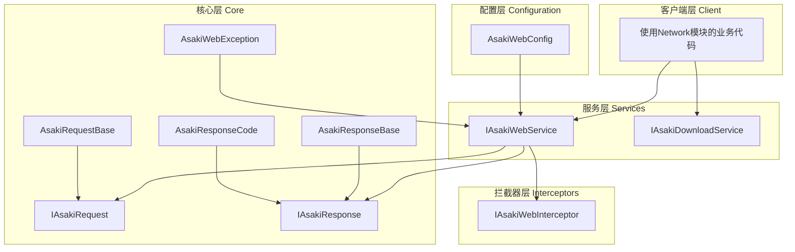
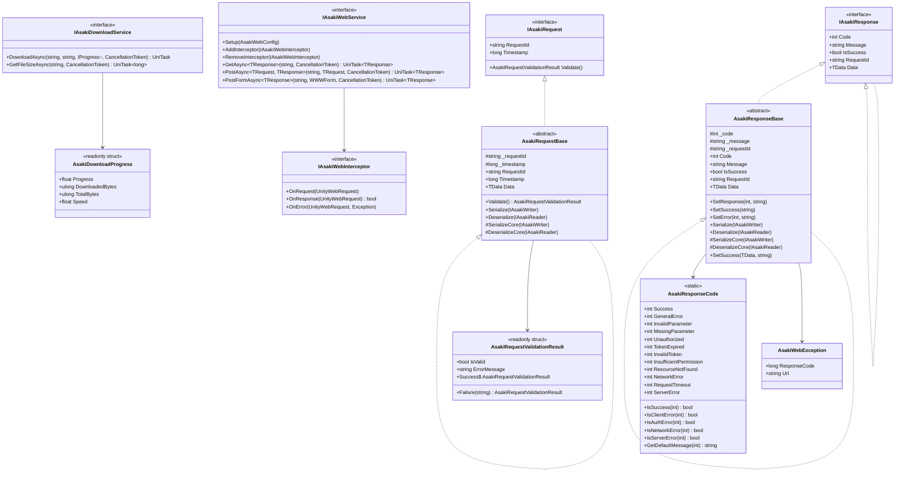
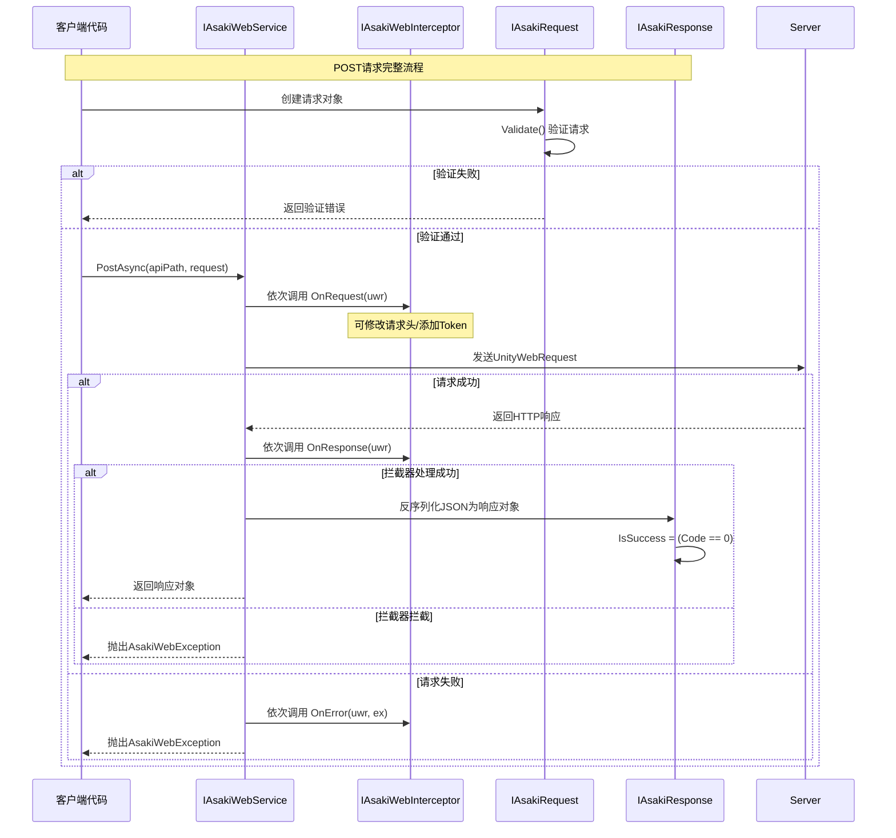
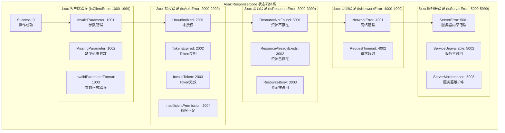

# Asaki Core/Network 模块架构文档

## 目录

1. [设计理念](#1-设计理念)
2. [软件架构](#2-软件架构)
3. [API参考](#3-api参考)
4. [好的示例](#4-好的示例)
5. [坏的示例](#5-坏的示例)

---

## 1. 设计理念

### 1.1 为什么需要网络模块

在Unity游戏开发中，网络通信是现代游戏的核心能力之一。无论是玩家数据同步、排行榜更新、道具购买还是多人游戏，都需要可靠的网络请求能力。Asaki Network模块应运而生，旨在提供：

- **统一的请求/响应模型**：标准化的请求和响应基类，确保前后端数据结构一致
- **灵活的拦截器机制**：通过拦截器实现认证、日志、错误处理等横切关注点
- **完整的错误处理**：统一的异常类型和响应码体系，便于调试和问题追踪
- **下载服务支持**：文件下载能力，包含进度监控和断点续传预留

### 1.2 请求/响应模型的设计动机

传统的网络请求往往存在以下问题：

1. **数据格式不统一**：每个API团队自行定义请求/响应结构，导致前端适配困难
2. **状态码混乱**：HTTP状态码和业务状态码混用，难以区分网络错误和业务错误
3. **序列化繁琐**：手动处理JSON序列化/反序列化，代码冗余
4. **请求追踪困难**：缺少请求ID，无法关联请求和响应

Asaki Network采用**约定优于配置**的设计理念：

- 定义标准响应格式：`{ code: 0, message: "成功", data: {...} }`
- 业务状态码与HTTP状态码分离，便于精确处理
- 实现`IAsakiSavable`接口，自动支持序列化/反序列化
- 每个请求自动生成唯一`RequestId`，便于追踪和日志

### 1.3 拦截器机制的设计意图

拦截器（Interceptor）是Asaki Network的核心扩展机制，允许开发者在请求发送前和响应返回后注入自定义逻辑：

1. **请求前拦截（OnRequest）**：修改请求头、添加认证Token、记录请求日志
2. **响应后拦截（OnResponse）**：统一错误处理、响应缓存、特殊状态码处理
3. **异常处理拦截（OnError）**：网络错误重试、错误上报、降级处理

设计原则：

- 拦截器可链式叠加，顺序执行
- 拦截器独立模块化，可按需组合
- 支持运行时动态添加/移除

### 1.4 下载服务的设计考量

文件下载是游戏常见需求（资源更新、DLC、补丁等），Asaki DownloadService提供：

- **进度监控**：通过`IProgress<AsakiDownloadProgress>`回调实时通知下载进度
- **零GC设计**：`AsakiDownloadProgress`采用`readonly struct`，避免内存分配
- **流式写入**：支持大文件边下载边写入磁盘，避免内存溢出
- **断点续传预留**：通过UnityWebRequest的`SetDownloadProgress`支持

---

## 2. 软件架构

### 2.1 模块架构概览



### 2.2 核心类图



### 2.3 请求生命周期流程



### 2.4 状态码体系



---

## 3. API参考

### 3.1 IAsakiWebService 接口

Web服务核心接口，提供HTTP请求的发送和拦截器管理功能。

| 方法 | 描述 | 参数 | 返回值 |
|------|------|------|--------|
| `Setup` | 初始化并配置Web服务 | `config`: AsakiWebConfig配置对象 | `void` |
| `AddInterceptor` | 添加请求/响应拦截器 | `interceptor`: IAsakiWebInterceptor实例 | `void` |
| `RemoveInterceptor` | 移除已注册的拦截器 | `interceptor`: 要移除的拦截器实例 | `void` |
| `GetAsync<TResponse>` | 发送HTTP GET请求 | `apiPath`: API路径<br>`token`: 取消令牌 (默认default) | `UniTask<TResponse>` |
| `PostAsync<TRequest, TResponse>` | 发送HTTP POST请求（JSON） | `apiPath`: API路径<br>`body`: 请求体对象<br>`token`: 取消令牌 (默认default) | `UniTask<TResponse>` |
| `PostFormAsync<TResponse>` | 发送HTTP POST请求（表单） | `apiPath`: API路径<br>`form`: 表单数据<br>`token`: 取消令牌 (默认default) | `UniTask<TResponse>` |

### 3.2 IAsakiDownloadService 接口

文件下载服务接口，提供异步下载和进度监控功能。

| 方法 | 描述 | 参数 | 返回值 |
|------|------|------|--------|
| `DownloadAsync` | 异步下载文件 | `url`: 远程URL<br>`localPath`: 本地保存路径<br>`progress`: 进度回调 (默认default)<br>`token`: 取消令牌 (默认default) | `UniTask` |
| `GetFileSizeAsync` | 获取远程文件大小 | `url`: 目标文件URL<br>`token`: 取消令牌 (默认default) | `UniTask<long>` |

### 3.3 AsakiDownloadProgress 结构体

下载进度信息结构体，采用值类型实现，零GC分配。

| 属性 | 类型 | 描述 |
|------|------|------|
| `Progress` | `float` | 下载进度 (0.0 - 1.0) |
| `DownloadedBytes` | `ulong` | 已下载字节数 |
| `TotalBytes` | `ulong` | 文件总字节数 (未知为0) |
| `Speed` | `float` | 下载速度 (Bytes/s) |

### 3.4 IAsakiWebInterceptor 接口

网络请求拦截器接口，用于注入自定义请求/响应处理逻辑。

| 方法 | 描述 | 参数 | 返回值 |
|------|------|------|--------|
| `OnRequest` | 请求发送前调用 | `uwr`: UnityWebRequest实例 | `void` |
| `OnResponse` | 响应返回后调用 | `uwr`: UnityWebRequest实例 | `bool` (是否继续处理) |
| `OnError` | 请求发生异常时调用 | `uwr`: UnityWebRequest实例<br>`ex`: 异常对象 | `void` |

### 3.5 IAsakiRequest 接口

网络请求基础接口，定义请求的统一契约。

| 属性 | 类型 | 描述 |
|------|------|------|
| `RequestId` | `string` | 请求唯一标识符 |
| `Timestamp` | `long` | 请求时间戳 (Unix毫秒) |

| 方法 | 描述 | 返回值 |
|------|------|--------|
| `Validate` | 验证请求数据有效性 | `AsakiRequestValidationResult` |

### 3.6 IAsakiResponse 接口

网络响应基础接口，定义响应的统一契约。

| 属性 | 类型 | 描述 |
|------|------|------|
| `Code` | `int` | 业务状态码 (0=成功) |
| `Message` | `string` | 响应消息 |
| `IsSuccess` | `bool` | 请求是否成功 |
| `RequestId` | `string` | 关联的请求ID |

### 3.7 IAsakiResponse<TData> 接口

泛型响应接口，包含具体的数据载荷。

| 属性 | 类型 | 描述 |
|------|------|------|
| `Data` | `TData` | 响应数据载荷 |

### 3.8 AsakiRequestBase 抽象类

请求基类，提供统一的请求ID生成、时间戳管理和序列化支持。

| 属性 | 类型 | 描述 |
|------|------|------|
| `RequestId` | `string` | 请求唯一标识符 (只读) |
| `Timestamp` | `long` | 请求时间戳 (只读) |

| 方法 | 描述 | 访问级别 |
|------|------|----------|
| `Validate` | 验证请求数据 | `public virtual` |
| `Serialize` | 序列化请求对象 | `public` |
| `Deserialize` | 反序列化请求对象 | `public` |
| `GenerateRequestId` | 生成请求ID | `protected virtual` |
| `SerializeCore` | 序列化子类数据 | `protected abstract` |
| `DeserializeCore` | 反序列化子类数据 | `protected abstract` |

### 3.9 AsakiRequestBase<TData> 泛型类

带数据的请求基类，继承自`AsakiRequestBase`，支持泛型数据载荷。

| 属性 | 类型 | 描述 |
|------|------|------|
| `Data` | `TData` | 请求数据对象 |

### 3.10 AsakiResponseBase 抽象类

响应基类，提供统一的状态码管理和序列化支持。

| 属性 | 类型 | 描述 |
|------|------|------|
| `Code` | `int` | 业务状态码 (只读) |
| `Message` | `string` | 响应消息 (只读) |
| `IsSuccess` | `bool` | 是否成功 (只读) |
| `RequestId` | `string` | 关联的请求ID (只读) |

| 方法 | 描述 | 访问级别 |
|------|------|----------|
| `SetResponse` | 设置响应状态 | `protected` |
| `SetSuccess` | 设置成功响应 | `protected` |
| `SetError` | 设置错误响应 | `protected` |
| `Serialize` | 序列化响应对象 | `public` |
| `Deserialize` | 反序列化响应对象 | `public` |
| `SerializeCore` | 序列化子类数据 | `protected abstract` |
| `DeserializeCore` | 反序列化子类数据 | `protected abstract` |

### 3.11 AsakiResponseBase<TData> 泛型类

带数据的响应基类，继承自`AsakiResponseBase`，支持泛型数据载荷。

| 属性 | 类型 | 描述 |
|------|------|------|
| `Data` | `TData` | 响应数据载荷 (只读) |

| 方法 | 描述 |
|------|------|
| `SetSuccess(TData, string)` | 设置成功响应及数据 |

### 3.12 AsakiResponseCode 静态类

标准响应状态码定义，提供业务状态码常量和辅助方法。

#### 状态码常量

| 常量 | 值 | 描述 |
|------|-----|------|
| `Success` | 0 | 操作成功 |
| `GeneralError` | 1 | 通用错误 |
| `InvalidParameter` | 1001 | 参数错误 |
| `MissingParameter` | 1002 | 缺少必要参数 |
| `InvalidParameterFormat` | 1003 | 参数格式错误 |
| `Unauthorized` | 2001 | 未授权 |
| `TokenExpired` | 2002 | Token过期 |
| `InvalidToken` | 2003 | Token无效 |
| `InsufficientPermission` | 2004 | 权限不足 |
| `ResourceNotFound` | 3001 | 资源不存在 |
| `ResourceAlreadyExists` | 3002 | 资源已存在 |
| `ResourceBusy` | 3003 | 资源被占用 |
| `NetworkError` | 4001 | 网络错误 |
| `RequestTimeout` | 4002 | 请求超时 |
| `ServerError` | 5001 | 服务器内部错误 |
| `ServiceUnavailable` | 5002 | 服务不可用 |
| `ServerMaintenance` | 5003 | 服务器维护中 |

#### 辅助方法

| 方法 | 描述 | 返回值 |
|------|------|--------|
| `IsSuccess(int)` | 判断是否成功 | `bool` |
| `IsClientError(int)` | 判断是否客户端错误 (1xxx) | `bool` |
| `IsAuthError(int)` | 判断是否授权错误 (2xxx) | `bool` |
| `IsResourceError(int)` | 判断是否资源错误 (3xxx) | `bool` |
| `IsNetworkError(int)` | 判断是否网络错误 (4xxx) | `bool` |
| `IsServerError(int)` | 判断是否服务器错误 (5xxx) | `bool` |
| `GetDefaultMessage(int)` | 获取默认描述 | `string` |

### 3.13 AsakiWebException 异常类

网络请求异常类，封装HTTP请求错误信息。

| 属性 | 类型 | 描述 |
|------|------|------|
| `ResponseCode` | `long` | HTTP响应状态码 |
| `Url` | `string` | 请求URL |

### 3.14 AsakiRequestValidationResult 结构体

请求验证结果结构体，采用值类型实现。

| 属性 | 类型 | 描述 |
|------|------|------|
| `IsValid` | `bool` | 验证是否通过 |
| `ErrorMessage` | `string` | 错误信息 |

| 静态属性/方法 | 描述 |
|---------------|------|
| `Success` | 成功的验证结果 (静态属性) |
| `Failure(string errorMessage)` | 失败的验证结果 (静态方法) |

### 3.15 AsakiWebConfig 配置类

网络服务配置类，可序列化为Unity资源。

| 属性 | 类型 | 描述 |
|------|------|------|
| `BaseUrl` | `string` | API基础URL |
| `TimeoutSeconds` | `int` | 请求超时时间 (秒) |
| `InitialInterceptors` | `IAsakiWebInterceptor[]` | 初始拦截器数组 |

---

## 4. 好的示例

### 4.1 基础Web服务使用

```csharp
using Asaki.Core.Network;
using Asaki.Core.FrameworkSettings;
using Asaki.Core.Architecture;
using Cysharp.Threading.Tasks;
using UnityEngine;

/// <summary>
/// API管理器示例 - 展示Web服务的基础用法
/// </summary>
public class ApiManager : AsakiMono, IAsakiAutoInject
{
    private IAsakiWebService _webService;

    /// <summary>
    /// 通过依赖注入获取Web服务
    /// </summary>
    void IAsakiInject<IAsakiWebService>.Inject(IAsakiWebService webService)
    {
        _webService = webService;
    }

    /// <summary>
    /// 初始化Web服务配置
    /// </summary>
    protected override void OnStart()
    {
        // 配置Web服务
        var config = new AsakiWebConfig
        {
            BaseUrl = "https://api.example.com",
            TimeoutSeconds = 30,
            InitialInterceptors = null
        };

        _webService.Setup(config);

        // 添加自定义拦截器
        _webService.AddInterceptor(new AuthInterceptor());
    }

    /// <summary>
    /// 获取玩家信息
    /// </summary>
    public async void GetPlayerInfo()
    {
        try
        {
            var response = await _webService.GetAsync<PlayerInfoResponse>("/api/player/info");
            if (response.IsSuccess)
            {
                Debug.Log($"玩家等级: {response.Data.Level}");
            }
            else
            {
                Debug.LogError($"获取失败: {response.Code} - {response.Message}");
            }
        }
        catch (AsakiWebException ex)
        {
            Debug.LogError($"网络错误: {ex.ResponseCode} - {ex.Message}");
        }
    }

    /// <summary>
    /// 登录请求
    /// </summary>
    public async void Login(string username, string password)
    {
        var request = new LoginRequest(username, password);

        // 验证请求
        var validation = request.Validate();
        if (!validation.IsValid)
        {
            Debug.LogWarning($"请求验证失败: {validation.ErrorMessage}");
            return;
        }

        try
        {
            var response = await _webService.PostAsync<LoginRequest, LoginResponse>(
                "/api/auth/login",
                request
            );

            if (response.IsSuccess)
            {
                Debug.Log($"登录成功, Token: {response.Data.Token}");
            }
        }
        catch (AsakiWebException ex)
        {
            Debug.LogError($"登录失败: {ex.Message}");
        }
    }
}

/// <summary>
/// 玩家信息响应
/// </summary>
public class PlayerInfoResponse : AsakiResponseBase<PlayerInfoData> { }

/// <summary>
/// 玩家信息数据
/// </summary>
public class PlayerInfoData : IAsakiSavable
{
    public string Nickname { get; set; }
    public int Level { get; set; }
    public int Exp { get; set; }

    public void Serialize(IAsakiWriter writer)
    {
        writer.WriteString("nickname", Nickname);
        writer.WriteInt("level", Level);
        writer.WriteInt("exp", Exp);
    }

    public void Deserialize(IAsakiReader reader)
    {
        Nickname = reader.ReadString("nickname");
        Level = reader.ReadInt("level");
        Exp = reader.ReadInt("exp");
    }
}
```

### 4.2 自定义拦截器示例

```csharp
using UnityEngine.Networking;
using Asaki.Core.Network;

/// <summary>
/// 认证拦截器 - 自动添加Token到请求头
/// </summary>
public class AuthInterceptor : IAsakiWebInterceptor
{
    private string _authToken;

    /// <summary>
    /// 设置认证Token
    /// </summary>
    public void SetToken(string token)
    {
        _authToken = token;
    }

    /// <summary>
    /// 请求发送前 - 添加Authorization头
    /// </summary>
    public void OnRequest(UnityWebRequest uwr)
    {
        if (!string.IsNullOrEmpty(_authToken))
        {
            uwr.SetRequestHeader("Authorization", $"Bearer {_authToken}");
        }

        // 添加公共请求头
        uwr.SetRequestHeader("X-Client-Version", Application.version);
        uwr.SetRequestHeader("X-Platform", Application.platform.ToString());
    }

    /// <summary>
    /// 响应返回后 - 检查业务状态码
    /// </summary>
    public bool OnResponse(UnityWebRequest uwr)
    {
        // 检查HTTP状态码
        if (uwr.result != UnityWebRequest.Result.Success)
        {
            Debug.LogWarning($"请求失败: {uwr.error}");
            return false;
        }

        return true; // 继续正常处理
    }

    /// <summary>
    /// 发生错误 - 处理特定错误码
    /// </summary>
    public void OnError(UnityWebRequest uwr, System.Exception ex)
    {
        Debug.LogError($"网络错误: {ex.Message}");

        // 如果是401错误，清除Token
        if (uwr.responseCode == 401)
        {
            _authToken = null;
            // 触发重新登录逻辑...
        }
    }
}
```

### 4.3 文件下载示例

```csharp
using Asaki.Core.Network;
using Cysharp.Threading.Tasks;
using UnityEngine;

/// <summary>
/// 资源下载管理器示例
/// </summary>
public class ResourceDownloadManager : AsakiMono, IAsakiAutoInject
{
    private IAsakiDownloadService _downloadService;

    void IAsakiInject<IAsakiDownloadService>.Inject(IAsakiDownloadService downloadService)
    {
        _downloadService = downloadService;
    }

    /// <summary>
    /// 下载更新资源
    /// </summary>
    public async void DownloadUpdate()
    {
        string url = "https://cdn.example.com/resources/bundle.unity3d";
        string localPath = Application.persistentDataPath + "/bundle.unity3d";

        // 创建进度回调
        var progress = new Progress<AsakiDownloadProgress>(p =>
        {
            Debug.Log($"下载进度: {p.Progress * 100:F1}% " +
                      $"(已下载 {FormatBytes(p.DownloadedBytes)} / {FormatBytes(p.TotalBytes)}) " +
                      $"- 速度: {FormatBytes((ulong)p.Speed)}/s");
        });

        try
        {
            await _downloadService.DownloadAsync(url, localPath, progress);
            Debug.Log("下载完成!");
        }
        catch (AsakiWebException ex)
        {
            Debug.LogError($"下载失败: {ex.Message}");
        }
    }

    /// <summary>
    /// 获取文件大小
    /// </summary>
    public async void CheckFileSize()
    {
        try
        {
            long size = await _downloadService.GetFileSizeAsync(
                "https://cdn.example.com/resources/bundle.unity3d"
            );
            Debug.Log($"文件大小: {FormatBytes((ulong)size)}");
        }
        catch (AsakiWebException ex)
        {
            Debug.LogError($"获取文件大小失败: {ex.Message}");
        }
    }

    /// <summary>
    /// 格式化字节数显示
    /// </summary>
    private static string FormatBytes(ulong bytes)
    {
        string[] sizes = { "B", "KB", "MB", "GB" };
        double len = bytes;
        int order = 0;
        while (len >= 1024 && order < sizes.Length - 1)
        {
            order++;
            len /= 1024;
        }
        return $"{len:0.##} {sizes[order]}";
    }
}
```

### 4.4 自定义请求响应类

```csharp
using Asaki.Core.Network;
using Asaki.Core.Serialization;

/// <summary>
/// 获取排行榜请求
/// </summary>
public class GetLeaderboardRequest : AsakiRequestBase<LeaderboardFilterData>
{
    /// <summary>
    /// 无参构造函数 - 反序列化时使用
    /// </summary>
    public GetLeaderboardRequest() { }

    /// <summary>
    /// 带参构造函数
    /// </summary>
    public GetLeaderboardRequest(int page, int pageSize)
    {
        Data = new LeaderboardFilterData
        {
            Page = page,
            PageSize = pageSize
        };
    }

    /// <summary>
    /// 自定义验证逻辑
    /// </summary>
    public override AsakiRequestValidationResult Validate()
    {
        if (Data.Page < 1)
            return AsakiRequestValidationResult.Failure("页码必须大于0");

        if (Data.PageSize < 1 || Data.PageSize > 100)
            return AsakiRequestValidationResult.Failure("每页数量必须在1-100之间");

        return AsakiRequestValidationResult.Success;
    }

    protected override void SerializeCore(IAsakiWriter writer)
    {
        // 基类已自动序列化Data，此处可添加额外字段
    }

    protected override void DeserializeCore(IAsakiReader reader)
    {
        // 基类已自动反序列化Data
    }
}

/// <summary>
/// 排行榜筛选数据
/// </summary>
public class LeaderboardFilterData : IAsakiSavable
{
    public int Page { get; set; }
    public int PageSize { get; set; }

    public void Serialize(IAsakiWriter writer)
    {
        writer.WriteInt("page", Page);
        writer.WriteInt("pageSize", PageSize);
    }

    public void Deserialize(IAsakiReader reader)
    {
        Page = reader.ReadInt("page");
        PageSize = reader.ReadInt("pageSize");
    }
}

/// <summary>
/// 排行榜响应
/// </summary>
public class LeaderboardResponse : AsakiResponseBase<LeaderboardData>
{
    /// <summary>
    /// 创建成功响应 - 工厂方法
    /// </summary>
    public static LeaderboardResponse Success(LeaderboardData data)
    {
        var response = new LeaderboardResponse();
        response.SetSuccess(data);
        return response;
    }

    /// <summary>
    /// 创建失败响应 - 工厂方法
    /// </summary>
    public static LeaderboardResponse Failure(int code, string message = null)
    {
        var response = new LeaderboardResponse();
        response.SetError(code, message);
        return response;
    }
}

/// <summary>
/// 排行榜数据
/// </summary>
public class LeaderboardData : IAsakiSavable
{
    public List<LeaderboardEntry> Entries { get; set; }
    public int TotalCount { get; set; }

    public void Serialize(IAsakiWriter writer)
    {
        writer.WriteList("entries", Entries);
        writer.WriteInt("totalCount", TotalCount);
    }

    public void Deserialize(IAsakiReader reader)
    {
        Entries = reader.ReadList<LeaderboardEntry>("entries");
        TotalCount = reader.ReadInt("totalCount");
    }
}

/// <summary>
/// 排行榜条目
/// </summary>
public class LeaderboardEntry : IAsakiSavable
{
    public string UserId { get; set; }
    public string Nickname { get; set; }
    public int Score { get; set; }
    public int Rank { get; set; }

    public void Serialize(IAsakiWriter writer)
    {
        writer.WriteString("userId", UserId);
        writer.WriteString("nickname", Nickname);
        writer.WriteInt("score", Score);
        writer.WriteInt("rank", Rank);
    }

    public void Deserialize(IAsakiReader reader)
    {
        UserId = reader.ReadString("userId");
        Nickname = reader.ReadString("nickname");
        Score = reader.ReadInt("score");
        Rank = reader.ReadInt("rank");
    }
}
```

---

## 5. 坏的示例

### 5.1 未验证请求数据

```csharp
using Asaki.Core.Network;

// 错误示例：直接发送请求，未进行验证
public class BadExample1 : AsakiMono
{
    private IAsakiWebService _webService;

    public void SendRequest(string username, string password)
    {
        // 问题：直接创建请求对象并发送，未验证
        var request = new LoginRequest(username, password);
        _webService.PostAsync<LoginRequest, LoginResponse>("/api/login", request)
            .Forget(); // Fire and forget，但未处理可能的验证问题
    }
}

// 正确示例：先验证再发送
public class GoodExample1 : AsakiMono
{
    private IAsakiWebService _webService;

    public async void SendRequest(string username, string password)
    {
        var request = new LoginRequest(username, password);

        // 先验证请求数据
        var validation = request.Validate();
        if (!validation.IsValid)
        {
            Debug.LogWarning($"请求验证失败: {validation.ErrorMessage}");
            return;
        }

        // 验证通过后再发送
        await _webService.PostAsync<LoginRequest, LoginResponse>("/api/login", request);
    }
}
```

### 5.2 忽略响应状态码

```csharp
using Asaki.Core.Network;

// 错误示例：未检查响应状态码直接使用数据
public class BadExample2 : AsakiMono
{
    public void ProcessResponse(LoginResponse response)
    {
        // 问题：未检查IsSuccess，直接访问Data
        Debug.Log($"Token: {response.Data.Token}"); // 可能抛出空引用异常
    }
}

// 正确示例：先检查响应状态
public class GoodExample2 : AsakiMono
{
    public void ProcessResponse(LoginResponse response)
    {
        if (response.IsSuccess)
        {
            Debug.Log($"Token: {response.Data.Token}");
        }
        else
        {
            Debug.LogError($"请求失败: {response.Code} - {response.Message}");
        }
    }
}
```

### 5.3 缺少异常处理

```csharp
using Asaki.Core.Network;

// 错误示例：网络请求未捕获异常
public class BadExample3 : AsakiMono
{
    public async void FetchData()
    {
        // 问题：未处理可能抛出的AsakiWebException
        var response = await _webService.GetAsync<DataResponse>("/api/data");
        ProcessResponse(response);
    }
}

// 正确示例：完整的异常处理
public class GoodExample3 : AsakiMono
{
    public async void FetchData()
    {
        try
        {
            var response = await _webService.GetAsync<DataResponse>("/api/data");
            ProcessResponse(response);
        }
        catch (AsakiWebException ex)
        {
            // 处理网络异常
            Debug.LogError($"网络错误 [{ex.ResponseCode}]: {ex.Message}");
            HandleNetworkError(ex);
        }
        catch (System.Exception ex)
        {
            // 处理其他异常
            Debug.LogError($"未知错误: {ex.Message}");
        }
    }

    private void HandleNetworkError(AsakiWebException ex)
    {
        switch (ex.ResponseCode)
        {
            case 404:
                Debug.Log("资源不存在");
                break;
            case 500:
                Debug.Log("服务器错误");
                break;
            default:
                Debug.Log("网络连接失败");
                break;
        }
    }
}
```

### 5.4 async void 的不当使用

```csharp
using Asaki.Core.Network;

// 错误示例：async void导致异常无法捕获
public class BadExample4 : AsakiMono
{
    // 问题：async void的异常会导致游戏崩溃且难以调试
    private async void OnButtonClick()
    {
        var response = await _webService.GetAsync<DataResponse>("/api/data");
        // 如果这里抛异常，游戏会直接崩溃
    }
}

// 正确示例：使用 async UniTask + .Forget()
public class GoodExample4 : AsakiMono
{
    // OnStart是同步虚方法，安全的地方启动异步任务
    protected override void OnStart()
    {
        // 使用.FireAndForget()或.Foreget()安全地忽略UniTask
        FetchData().Forget();
    }

    private async UniTask FetchData()
    {
        try
        {
            var response = await _webService.GetAsync<DataResponse>("/api/data");
            // 处理响应
        }
        catch (AsakiWebException ex)
        {
            // 异常可以被正确捕获和处理
            Debug.LogError($"请求失败: {ex.Message}");
        }
    }
}
```

### 5.5 拦截器顺序不当

```csharp
using Asaki.Core.Network;
using Asaki.Core.Architecture;

// 错误示例：拦截器依赖顺序不正确
public class BadExample5 : AsakiMono
{
    public void SetupWebService()
    {
        var webService = AsakiArchitecture.GetSystem<IAsakiWebService>();

        // 问题：日志拦截器在认证拦截器之前，导致日志记录不到Token
        webService.AddInterceptor(new LoggingInterceptor());
        webService.AddInterceptor(new AuthInterceptor()); // 认证应该在日志之前
    }
}

// 正确示例：合理的拦截器顺序
public class GoodExample5 : AsakiMono
{
    public void SetupWebService()
    {
        var webService = AsakiArchitecture.GetSystem<IAsakiWebService>();

        // 顺序：认证 -> 日志
        // 认证拦截器先添加Token，然后日志拦截器记录完整请求
        webService.AddInterceptor(new AuthInterceptor());
        webService.AddInterceptor(new LoggingInterceptor());
    }
}
```

### 5.6 下载进度回调使用不当

```csharp
using Asaki.Core.Network;

// 错误示例：每次创建新的委托，频繁GC
public class BadExample6 : AsakiMono
{
    public async void DownloadWithProgress(string url, string path)
    {
        // 问题：每次都创建新的Progress对象，增加GC压力
        await _downloadService.DownloadAsync(url, path, new Progress<AsakiDownloadProgress>(p =>
        {
            Debug.Log(p.Progress);
        }));
    }
}

// 正确示例：缓存进度回调或使用结构体
public class GoodExample6 : AsakiMono
{
    // 缓存回调实例，避免重复分配
    private Progress<AsakiDownloadProgress> _cachedProgress;

    private void Start()
    {
        // 只创建一个Progress实例
        _cachedProgress = new Progress<AsakiDownloadProgress>(OnDownloadProgress);
    }

    public async void DownloadWithProgress(string url, string path)
    {
        await _downloadService.DownloadAsync(url, path, _cachedProgress);
    }

    private void OnDownloadProgress(AsakiDownloadProgress p)
    {
        Debug.Log($"进度: {p.Progress * 100:F1}%");
    }
}
```

### 5.7 响应码判断错误

```csharp
using Asaki.Core.Network;

// 错误示例：错误地混合HTTP状态码和业务状态码
public class BadExample7 : AsakiMono
{
    public void HandleResponse(LoginResponse response)
    {
        // 问题：混淆了HTTP状态码(200)和业务Code(0)
        if (response.Code == 200) // 错误！Code是业务状态码
        {
            // 永远不会执行
        }

        // 正确做法
        if (response.IsSuccess) // 或者 response.Code == AsakiResponseCode.Success
        {
            // 处理成功
        }
    }
}

// 正确示例：使用IsSuccess或正确的状态码常量
public class GoodExample7 : AsakiMono
{
    public void HandleResponse(LoginResponse response)
    {
        if (response.IsSuccess)
        {
            Debug.Log($"登录成功: {response.Data.Token}");
        }
        else if (AsakiResponseCode.IsAuthError(response.Code))
        {
            Debug.Log("认证失败，需要重新登录");
        }
        else if (AsakiResponseCode.IsNetworkError(response.Code))
        {
            Debug.Log("网络错误");
        }
    }
}
```

---

## 附录

### 相关文件路径

- Web服务接口: [IAsakiWebService.cs](file:///e:/Projects/UnityGame/Asaki/Assets/Asaki/Core/Network/IAsakiWebService.cs)
- 下载服务接口: [IAsakiDownloadService.cs](file:///e:/Projects/UnityGame/Asaki/Assets/Asaki/Core/Network/IAsakiDownloadService.cs)
- 请求接口: [IAsakiRequest.cs](file:///e:/Projects/UnityGame/Asaki/Assets/Asaki/Core/Network/IAsakiRequest.cs)
- 响应接口: [IAsakiResponse.cs](file:///e:/Projects/UnityGame/Asaki/Assets/Asaki/Core/Network/IAsakiResponse.cs)
- 请求基类: [AsakiRequestBase.cs](file:///e:/Projects/UnityGame/Asaki/Assets/Asaki/Core/Network/AsakiRequestBase.cs)
- 响应基类: [AsakiResponseBase.cs](file:///e:/Projects/UnityGame/Asaki/Assets/Asaki/Core/Network/AsakiResponseBase.cs)
- 响应码: [AsakiResponseCode.cs](file:///e:/Projects/UnityGame/Asaki/Assets/Asaki/Core/Network/AsakiResponseCode.cs)
- Web异常: [AsakiWebException.cs](file:///e:/Projects/UnityGame/Asaki/Assets/Asaki/Core/Network/AsakiWebException.cs)
- 网络配置: [AsakiWebConfig.cs](file:///e:/Projects/UnityGame/Asaki/Assets/Asaki/Core/FrameworkSettings/AsakiWebConfig.cs)

### 示例代码

- 请求响应示例: [NetworkRequestResponseExample.cs](file:///e:/Projects/UnityGame/Asaki/Assets/Asaki/Core/Network/Examples/NetworkRequestResponseExample.cs)

---

_文档生成时间: 2026-03-03_
