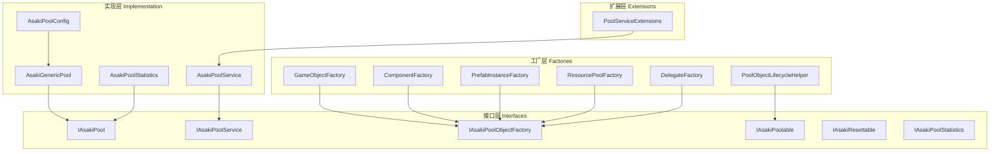
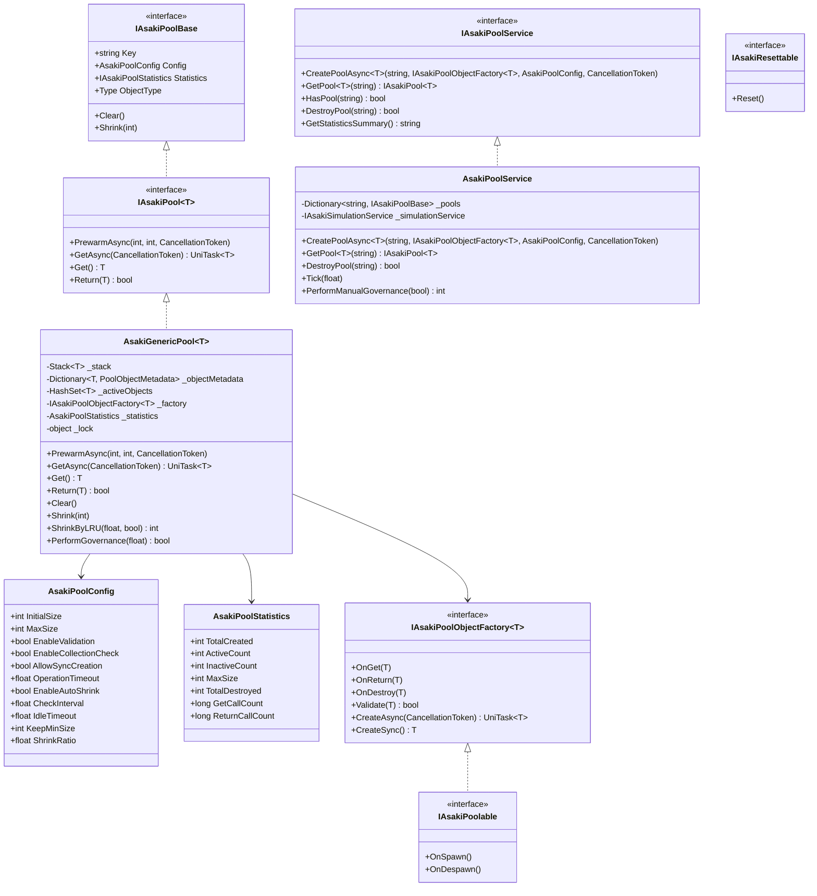
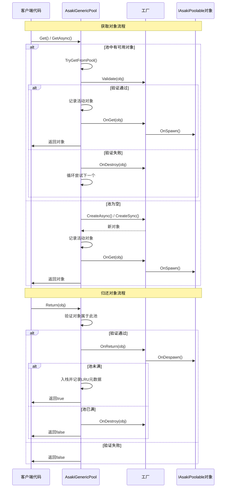
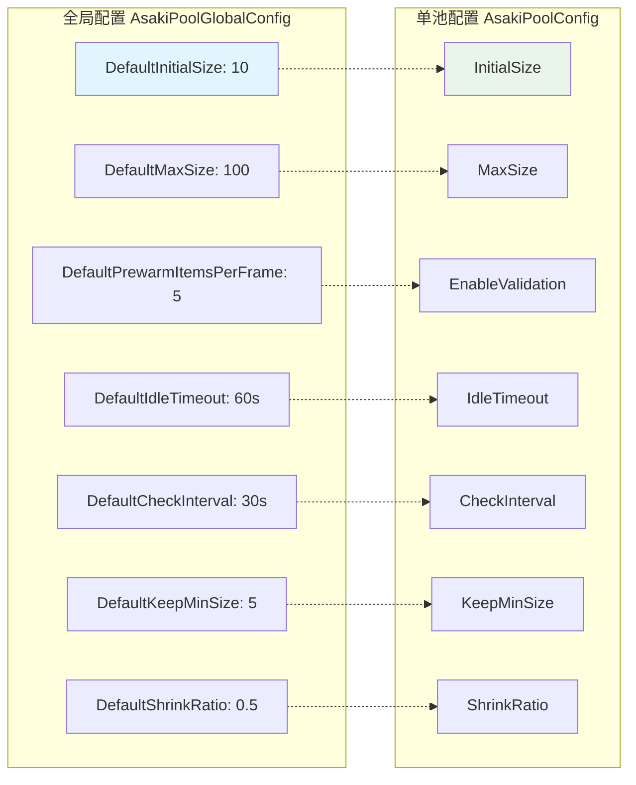

# Asaki Core/Pooling 模块架构文档

## 目录

1. [设计理念](#1-设计理念)
2. [软件架构](#2-软件架构)
3. [API参考](#3-api参考)
4. [好的示例](#4-好的示例)
5. [坏的示例](#5-坏的示例)

---

## 1. 设计理念

### 1.1 为什么需要对象池

在Unity游戏开发中，频繁创建和销毁游戏对象（如子弹、特效、UI元素）会带来严重的性能问题：

- **GC压力**：大量临时对象会导致频繁的垃圾回收，引发游戏卡顿
- **CPU开销**：对象实例化和销毁涉及内存分配、构造函数调用等操作
- **内存碎片**：频繁的分配和释放会导致堆内存碎片化

对象池（Object Pool）通过复用已创建的对象来解决这些问题。Asaki Pooling模块提供了企业级的对象池实现，支持LRU淘汰、自动治理、多种工厂模式等高级特性。

### 1.2 LRU淘汰策略的设计动机

传统的对象池通常采用固定大小或简单的"满即销毁"策略，这在实际应用中会遇到以下问题：

1. **内存浪费**：游戏场景切换后，池中仍保留大量不再需要的对象
2. **内存峰值**：突发大量对象创建时，池可能无限膨胀
3. **资源争用**：多个池同时扩张导致内存竞争

Asaki Pooling采用**LRU（Least Recently Used）最近最少使用**淘汰策略：

- 基于时间戳记录每个对象的最后使用时间
- 优先销毁闲置时间超过`IdleTimeout`的对象
- 使用全局序列号打破时间戳相同时的确定性
- 支持强制收缩到保底数量`KeepMinSize`

这种方法确保：

- 活跃对象永远不会被意外销毁
- 闲置对象会自动释放归还内存
- 系统内存压力下有可控的回收行为

### 1.3 自动治理机制的设计意图

手动管理大量对象池既繁琐又容易出错。Asaki Pooling实现了**自动治理（Auto-Governance）**机制：

1. **帧级检查**：通过`IAsakiTickable`接口集成到游戏循环，每帧可选择执行治理检查
2. **可配置间隔**：`CheckInterval`参数控制检查频率，避免频繁遍历
3. **低内存响应**：监听`Application.lowMemory`事件，紧急情况下强制收缩所有池
4. **手动触发**：提供`PerformManualGovernance()`API供特殊情况使用

设计原则：

- 默认启用，用户可选择关闭
- 渐进式释放，避免一次性大规模GC
- 记录详细日志便于调试

---

## 2. 软件架构

### 2.1 四层架构概览

Asaki Pooling模块采用清晰的四层架构设计：



### 2.2 核心类图



### 2.3 对象生命周期流程



### 2.4 线程安全设计

Asaki Pooling模块采用以下线程安全策略：

| 机制              | 应用场景           | 实现方式     |
| ----------------- | ------------------ | ------------ |
| `lock` 关键字     | 栈操作、字典读写   | 临界区保护   |
| `Interlocked`     | 序列号生成、计数器 | 原子操作     |
| `volatile`        | disposed标志       | 防止指令重排 |
| `CompareExchange` | 计数器的安全增减   | CAS无锁算法  |

关键设计点：

- 时间戳和序列号在锁外生成，减少锁持有时间
- 双重检查模式防止竞态条件
- HashSet检测重复归还需要加锁

### 2.5 配置体系



---

## 3. API参考

### 3.1 IAsakiPool 接口

对象池的核心接口，提供同步/异步获取和归还功能。

#### 泛型接口 `IAsakiPool<T>`

| 方法           | 描述         | 参数                                                                              | 返回值                                                                |
| -------------- | ------------ | --------------------------------------------------------------------------------- | --------------------------------------------------------------------- |
| `PrewarmAsync` | 异步预热池   | `count`: 预热数量<br>`itemsPerFrame`: 每帧创建数(-1使用默认)<br>`token`: 取消令牌 | `UniTask`                                                             |
| `GetAsync`     | 异步获取对象 | `token`: 取消令牌                                                                 | `UniTask<T>`                                                          |
| `Get`          | 同步获取对象 | 无                                                                                | `T`（当AllowSyncCreation=false且池为空时返回null）                    |
| `Return`       | 归还对象到池 | `item`: 要归还的对象                                                              | `bool`: 是否成功（当EnableCollectionCheck=true时，重复归还返回false） |

#### 基础接口 `IAsakiPoolBase`

| 属性         | 类型                   | 描述           |
| ------------ | ---------------------- | -------------- |
| `Key`        | `string`               | 池的唯一标识符 |
| `Config`     | `AsakiPoolConfig`      | 池配置         |
| `Statistics` | `IAsakiPoolStatistics` | 统计信息       |
| `ObjectType` | `Type`                 | 对象类型       |

| 方法                     | 描述             |
| ------------------------ | ---------------- |
| `Clear()`                | 清空池中所有对象 |
| `Shrink(int targetSize)` | 收缩池到指定大小 |

### 3.2 IAsakiPoolService 接口

池服务接口，提供池的创建、管理和销毁功能。

| 方法                                              | 描述             | 参数                                                                                   | 返回值                                            |
| ------------------------------------------------- | ---------------- | -------------------------------------------------------------------------------------- | ------------------------------------------------- |
| `CreatePoolAsync<T>(key, factory, config, token)` | 异步创建对象池   | `key`: 池标识符<br>`factory`: 对象工厂<br>`config`: 池配置<br>`token`: 取消令牌        | `UniTask<IAsakiPool<T>>`                          |
| `GetPool<T>(key)`                                 | 获取指定类型的池 | `key`: 池标识符                                                                        | `IAsakiPool<T>` 或 `null`（类型不匹配或不存在时） |
| `HasPool(key)`                                    | 检查池是否存在   | `key`: 池标识符                                                                        | `bool`                                            |
| `DestroyPool(key)`                                | 销毁指定池       | `key`: 池标识符                                                                        | `bool`                                            |
| `GetStatisticsSummary()`                          | 获取统计信息摘要 | 无                                                                                     | `string`                                          |
| `GetAllPoolKeys()`                                | 获取所有池的键   | 无                                                                                     | `IEnumerable<string>`                             |
| `PerformManualGovernance(force)`                  | 手动执行池治理   | `force`: 是否强制收缩到KeepMinSize（true=强制收缩，false=仅回收超过IdleTimeout的对象） | `int`: 总共销毁的对象数量                         |

### 3.3 工厂接口体系

#### IAsakiPoolObjectFactoryBase<T>

所有工厂的基接口，定义生命周期回调。

| 方法               | 描述                 |
| ------------------ | -------------------- |
| `OnGet(T obj)`     | 对象从池中获取时调用 |
| `OnReturn(T obj)`  | 对象归还到池时调用   |
| `OnDestroy(T obj)` | 对象被销毁时调用     |
| `Validate(T obj)`  | 验证对象是否有效     |

#### IAsakiAsyncPoolObjectFactory<T>

异步工厂接口，适用于需要资源加载的场景。

| 方法                 | 描述         |
| -------------------- | ------------ |
| `CreateAsync(token)` | 异步创建对象 |

#### IAsakiSyncPoolObjectFactory<T>

同步工厂接口，适用于轻量级对象。

| 方法           | 描述         |
| -------------- | ------------ |
| `CreateSync()` | 同步创建对象 |

#### IAsakiPoolObjectFactory<T>

完整工厂接口，同时支持异步和同步创建。

### 3.4 IAsakiPoolable 接口

可池化对象接口，实现此接口的对象可接收生命周期回调。

| 方法          | 描述                 |
| ------------- | -------------------- |
| `OnSpawn()`   | 对象从池中获取时调用 |
| `OnDespawn()` | 对象归还到池时调用   |

### 3.5 IAsakiResettable 接口

可重置对象接口，用于自动重置对象状态。

| 方法      | 描述         |
| --------- | ------------ |
| `Reset()` | 重置对象状态 |

### 3.6 AsakiGenericPool 核心实现

泛型池的核心实现类，主要方法详解：

#### 预热方法 `PrewarmAsync`

```csharp
public async UniTask PrewarmAsync(
    int count,
    int itemsPerFrame = -1,
    CancellationToken token = default
)
```

**特性**：

- 分批创建对象，每批后让出主线程
- 默认每帧创建5个对象（可配置）
- 预热期间工厂返回null会记录警告但不中断
- 预热创建的对象直接入栈，不触发OnReturn

#### LRU收缩方法 `ShrinkByLRU`

```csharp
public int ShrinkByLRU(float currentTime, bool force = false)
```

**特性**：

- 按最后使用时间排序，最早使用的先销毁
- 序列号用于打破时间相同时的确定性
- force=true时强制收缩到KeepMinSize
- 返回实际销毁的对象数量

#### 治理检查 `PerformGovernance`

```csharp
public bool PerformGovernance(float currentTime)
```

**特性**：

- 检查是否到达CheckInterval
- 调用ShrinkByLRU执行实际收缩
- 返回是否执行了收缩操作

### 3.7 AsakiPoolConfig 配置参数

| 参数                    | 类型  | 默认值 | 描述                   |
| ----------------------- | ----- | ------ | ---------------------- |
| `InitialSize`           | int   | 10     | 初始对象数量           |
| `MaxSize`               | int   | 100    | 最大对象数量(0=无限制) |
| `EnableValidation`      | bool  | true   | 是否启用对象验证       |
| `EnableCollectionCheck` | bool  | true   | 是否启用重复归还检测   |
| `AllowSyncCreation`     | bool  | false  | 是否允许同步创建       |
| `OperationTimeout`      | float | 0      | 操作超时(秒,0=无超时)  |
| `EnableAutoShrink`      | bool  | true   | 是否启用自动收缩       |
| `CheckInterval`         | float | 30     | 检查间隔(秒)           |
| `IdleTimeout`           | float | 60     | 闲置超时(秒)           |
| `KeepMinSize`           | int   | 5      | 收缩保底数量           |
| `ShrinkRatio`           | float | 0.5    | 每次收缩比例(0-1)      |

### 3.8 AsakiPoolStatistics 统计信息

| 属性              | 类型 | 描述               |
| ----------------- | ---- | ------------------ |
| `TotalCreated`    | int  | 总创建数量         |
| `ActiveCount`     | int  | 当前活动对象数量   |
| `InactiveCount`   | int  | 当前非活动对象数量 |
| `MaxSize`         | int  | 最大大小限制       |
| `TotalDestroyed`  | int  | 总销毁数量         |
| `GetCallCount`    | long | 获取调用次数       |
| `ReturnCallCount` | long | 归还调用次数       |

---

## 4. 好的示例

### 4.1 基础对象池使用

```csharp
using Asaki.Core.Pooling;
using Asaki.Core.Pooling.Interfaces;
using Asaki.Core.Pooling.Factories;
using Cysharp.Threading.Tasks;
using UnityEngine;

/// <summary>
/// 子弹管理器示例
/// </summary>
public class BulletManager : AsakiMono, IAsakiAutoInject
{
    private IAsakiPool<Bullet> _bulletPool;
    private IAsakiPoolService _poolService;
    [SerializeField] private Bullet _bulletPrefab;

    void IAsakiInject<IAsakiPoolService>.Inject(IAsakiPoolService poolService)
    {
        _poolService = poolService;
    }

    protected override async void OnStart()
    {
        // 通过服务获取池
        // 创建Prefab实例工厂 - 通过预制体创建对象
        var factory = new PrefabInstanceFactory<Bullet>(
            prefab: _bulletPrefab,
            onGet: bullet => bullet.Initialize(),
            onReturn: bullet => bullet.Reset(),
            validate: bullet => bullet != null
        );

        // 创建池配置
        var config = new AsakiPoolConfig
        {
            InitialSize = 20,
            MaxSize = 100,
            EnableValidation = true,
            EnableCollectionCheck = true,
            AllowSyncCreation = true
        };

        // 创建池
        _bulletPool = await _poolService.CreatePoolAsync("BulletPool", factory, config);

        // 预热池
        await _bulletPool.PrewarmAsync(10);
    }

    public async UniTask Fire(Vector3 position, Vector3 direction)
    {
        // 异步获取
        var bullet = await _bulletPool.GetAsync();
        if (bullet != null)
        {
            bullet.transform.position = position;
            bullet.Launch(direction);
        }
    }

    public void ReturnBullet(Bullet bullet)
    {
        // 归还到池
        _bulletPool.Return(bullet);
    }
}

/// <summary>
/// 子弹类
/// </summary>
public class Bullet : AsakiMono, IAsakiPoolable
{
    private Rigidbody _rigidbody;

    public void Initialize()
    {
        _rigidbody = GetComponent<Rigidbody>();
    }

    public void Launch(Vector3 direction)
    {
        _rigidbody.velocity = direction * 10f;
    }

    public void Reset()
    {
        _rigidbody.velocity = Vector3.zero;
        transform.position = Vector3.zero;
        transform.rotation = Quaternion.identity;
    }

    // IAsakiPoolable 生命周期回调
    public void OnSpawn()
    {
        // 对象被获取时触发
        gameObject.SetActive(true);
    }

    public void OnDespawn()
    {
        // 对象被归还时触发
        gameObject.SetActive(false);
    }
}
```

### 4.2 GameObject池化示例

```csharp
using Asaki.Core.Pooling;
using Asaki.Core.Pooling.Interfaces;
using Asaki.Core.Pooling.Factories;
using Cysharp.Threading.Tasks;
using UnityEngine;

/// <summary>
/// 特效管理器示例
/// </summary>
public class EffectManager : AsakiMono, IAsakiAutoInject
{
    private IAsakiPool<GameObject> _effectPool;
    private IAsakiPoolService _poolService;

    void IAsakiInject<IAsakiPoolService>.Inject(IAsakiPoolService poolService)
    {
        _poolService = poolService;
    }

    protected override async void OnStart()
    {
        // 加载预制体（实际项目中可能从Resources或Addressable加载）
        GameObject effectPrefab = Resources.Load<GameObject>("Effects/Explosion");

        // 使用GameObjectFactory
        var factory = new GameObjectFactory(
            prefab: effectPrefab,
            parent: transform,
            worldPositionStays: false
        );

        // 使用ForGameObject快捷配置
        var config = AsakiPoolConfig.ForGameObject(
            initialSize: 10,
            maxSize: 50
        );

        _effectPool = await _poolService.CreatePoolAsync("EffectPool", factory, config);
    }

    public async UniTask PlayEffect(Vector3 position)
    {
        var effect = await _effectPool.GetAsync();
        if (effect != null)
        {
            effect.transform.position = position;
            await PlayAndReturn(effect);
        }
    }

    private async UniTask PlayAndReturn(GameObject effect)
    {
        var particles = effect.GetComponent<ParticleSystem>();
        particles.Play();
        await UniTask.WaitUntil(() => !particles.isPlaying);
        _effectPool.Return(effect);
    }
}
```

### 4.3 自定义工厂示例

```csharp
using Asaki.Core.Pooling.Interfaces;
using Cysharp.Threading.Tasks;
using UnityEngine;

/// <summary>
/// 自定义对象工厂 - 复用已存在的对象
/// </summary>
public class ReusingObjectFactory : IAsakiPoolObjectFactory<MyObject>
{
    private readonly MyObject _prefab;

    public ReusingObjectFactory(MyObject prefab)
    {
        _prefab = prefab;
    }

    public async UniTask<MyObject> CreateAsync(CancellationToken token = default)
    {
        return CreateSync();
    }

    public MyObject CreateSync()
    {
        // 从预制体实例化
        MyObject obj = GameObject.Instantiate(_prefab);
        obj.name = $"{_prefab.name}_pooled";
        return obj;
    }

    public void OnGet(MyObject obj)
    {
        obj.gameObject.SetActive(true);
        // 触发自定义获取逻辑
        obj.OnSpawned();
    }

    public void OnReturn(MyObject obj)
    {
        obj.gameObject.SetActive(false);
        // 触发自定义归还逻辑
        obj.OnReturned();
    }

    public void OnDestroy(MyObject obj)
    {
        GameObject.Destroy(obj.gameObject);
    }

    public bool Validate(MyObject obj)
    {
        return obj != null && obj.gameObject != null;
    }
}

/// <summary>
/// 可池化对象示例
/// </summary>
public class MyObject : MonoBehaviour, IAsakiPoolable
{
    public void OnSpawned() { /* 获取时的初始化 */ }
    public void OnReturned() { /* 归还时的清理 */ }

    public void OnSpawn()
    {
        transform.localScale = Vector3.one;
    }

    public void OnDespawn()
    {
        transform.localScale = Vector3.zero;
    }
}
```

### 4.4 使用扩展方法简化池创建

```csharp
using Asaki.Core.Pooling.Extensions;
using Asaki.Core.Architecture;

// 使用扩展方法简化创建
var poolService = AsakiArchitecture.GetSystem<IAsakiPoolService>();
var resourceService = AsakiArchitecture.GetSystem<IAsakiResourceService>();

// 快捷创建GameObject池
var gameObjectPool = await poolService.CreateGameObjectPoolAsync(
    key: "ExplosionEffects",
    resourcePath: "Prefabs/Effects/Explosion",
    resourceService: resourceService,
    parent: effectContainer,
    config: AsakiPoolConfig.ForGameObject(5, 30)
);

// 快捷创建组件池
var particlePool = await poolService.CreateComponentPoolAsync<ParticleSystem>(
    key: "ParticleSystems",
    resourcePath: "Prefabs/Effects/Particle",
    resourceService: resourceService
);
```

---

## 5. 坏的示例

### 5.1 内存泄漏 - 未归还对象

```csharp
// 错误示例：获取对象后未归还
public class BadExample1 : MonoBehaviour
{
    private IAsakiPool<Bullet> _pool;

    public async void Fire()
    {
        var bullet = await _pool.GetAsync();
        // 问题：没有在适当时机归还，导致对象永久占用
        bullet.transform.position = transform.position;
    }
    // 正确做法：在对象不再需要时调用 _pool.Return(bullet);
}

// 正确示例
public class GoodExample1 : MonoBehaviour
{
    private IAsakiPool<Bullet> _pool;

    public async void Fire()
    {
        var bullet = await _pool.GetAsync();
        try
        {
            bullet.transform.position = transform.position;
            // 使用逻辑...
        }
        finally
        {
            // 始终在finally中归还
            _pool.Return(bullet);
        }
    }
}
```

### 5.2 性能陷阱 - 同步创建阻塞主线程

```csharp
// 错误示例：在Update中频繁调用可能阻塞的同步获取
public class BadExample2 : MonoBehaviour
{
    private IAsakiPool<GameObject> _pool;

    private void Update()
    {
        if (Input.GetMouseButtonDown(0))
        {
            // 问题：Get()在池为空且AllowSyncCreation=false时会返回null
            // 或者如果AllowSyncCreation=true，会尝试同步创建，可能导致卡顿
            var obj = _pool.Get();  // 可能的性能问题

            // 正确做法：优先使用异步获取
            _ = GetObjectAsync();
        }
    }

    private async UniTask GetObjectAsync()
    {
        var obj = await _pool.GetAsync();
        // 处理对象...
    }
}
```

### 5.3 常见错误用法 - 重复归还

```csharp
// 错误示例：同一对象重复归还
public class BadExample3 : MonoBehaviour
{
    private IAsakiPool<Bullet> _pool;
    private Bullet _currentBullet;

    public void Fire()
    {
        _currentBullet = _pool.Get();
        // ... 使用子弹
    }

    public void OnCollisionEnter(Collision collision)
    {
        // 问题：碰撞时归还，但如果稍后还有其他地方也会调用Return
        // 会导致"Invalid object returned"警告
        _pool.Return(_currentBullet);
        _currentBullet = null;  // 没有设置为null

        // 某处可能再次调用
        // _pool.Return(_currentBullet); // 重复归还！
    }

    // 正确示例：使用nullable检查
    public void SafeReturn()
    {
        if (_currentBullet != null)
        {
            _pool.Return(_currentBullet);
            _currentBullet = null;  // 立即置空防止重复归还
        }
    }
}
```

### 5.4 配置不当导致的问题

```csharp
// 错误示例：配置不合理
var badConfig = new AsakiPoolConfig
{
    InitialSize = 10000,    // 过大：启动时创建大量对象
    MaxSize = 0,           // 无限制：可能无限增长
    EnableAutoShrink = false, // 禁用自动治理
    EnableCollectionCheck = false // 禁用了重复归还检测
};

// 正确示例：合理配置
var goodConfig = new AsakiPoolConfig
{
    InitialSize = 10,      // 适度预热
    MaxSize = 100,         // 合理上限
    EnableAutoShrink = true, // 启用自动治理
    EnableCollectionCheck = true, // 启用安全检查
    IdleTimeout = 30f,     // 30秒无活动回收
    CheckInterval = 10f,   // 每10秒检查一次
    KeepMinSize = 5,       // 至少保留5个
    ShrinkRatio = 0.3f     // 每次回收30%
};
```

### 5.5 生命周期问题 - 池已销毁仍使用

```csharp
// 错误示例：在池销毁后仍使用
public class BadExample4 : MonoBehaviour
{
    private IAsakiPool<GameObject> _pool;

    private void OnDestroy()
    {
        // 问题：在OnDestroy中调用，但池可能已被销毁
        // Return方法会检测disposed状态，直接销毁对象而不是归还
        if (_pool != null && _obj != null)
        {
            _pool.Return(_obj);  // 此时可能已无效
        }
    }

    // 正确示例：使用try-catch或状态检查
    private void SafeReturn()
    {
        try
        {
            if (_pool != null && _obj != null)
            {
                _pool.Return(_obj);
                _obj = null;
            }
        }
        catch (ObjectDisposedException)
        {
            // 池已销毁，直接销毁对象
            Destroy(_obj?.gameObject);
        }
    }
}
```

### 5.6 线程安全问题

```csharp
// 错误示例：多线程环境下不安全地访问池
public class BadExample5 : MonoBehaviour
{
    private IAsakiPool<ThreadData> _pool;

    private void Start()
    {
        // 错误：在非主线程直接调用Get/Return
        new Thread(() =>
        {
            var data = _pool.Get();  // 不安全！
            // ... 处理数据
            _pool.Return(data);      // 不安全！
        }).Start();
    }
}

// 正确示例：需要主线程调用
public class GoodExample5 : MonoBehaviour
{
    private IAsakiPool<ThreadData> _pool;
    private readonly object _syncLock = new object();

    private void Update()
    {
        // 使用主线程队列处理跨线程请求
        while (_pendingReturns.Count > 0)
        {
            ThreadData data;
            lock (_syncLock)
            {
                if (_pendingReturns.Count > 0)
                    data = _pendingReturns.Dequeue();
                else
                    break;
            }
            _pool.Return(data);
        }
    }
}
```

---

## 附录

### 相关文件路径

- 核心实现: [AsakiGenericPool.cs](file:///e:/Projects/UnityGame/Asaki/Assets/Asaki/Core/Pooling/AsakiGenericPool.cs)
- 池服务: [AsakiPoolService.cs](file:///e:/Projects/UnityGame/Asaki/Assets/Asaki/Core/Pooling/AsakiPoolService.cs)
- 池配置: [AsakiPoolConfig.cs](file:///e:/Projects/UnityGame/Asaki/Assets/Asaki/Core/Pooling/AsakiPoolConfig.cs)
- 全局配置: [AsakiPoolConfig.cs](file:///e:/Projects/UnityGame/Asaki/Assets/Asaki/Core/FrameworkSettings/AsakiPoolConfig.cs)
- 统计信息: [AsakiPoolStatistics.cs](file:///e:/Projects/UnityGame/Asaki/Assets/Asaki/Core/Pooling/AsakiPoolStatistics.cs)

### 接口定义

- [IAsakiPool.cs](file:///e:/Projects/UnityGame/Asaki/Assets/Asaki/Core/Pooling/Interfaces/IAsakiPool.cs)
- [IAsakiPoolService.cs](file:///e:/Projects/UnityGame/Asaki/Assets/Asaki/Core/Pooling/Interfaces/IAsakiPoolService.cs)
- [IAsakiPoolObjectFactory.cs](file:///e:/Projects/UnityGame/Asaki/Assets/Asaki/Core/Pooling/Interfaces/IAsakiPoolObjectFactory.cs)
- [IAsakiPoolable.cs](file:///e:/Projects/UnityGame/Asaki/Assets/Asaki/Core/Pooling/Interfaces/IAsakiPoolable.cs)
- [IAsakiResettable.cs](file:///e:/Projects/UnityGame/Asaki/Assets/Asaki/Core/Pooling/Interfaces/IAsakiResettable.cs)
- [IAsakiPoolStatistics.cs](file:///e:/Projects/UnityGame/Asaki/Assets/Asaki/Core/Pooling/Interfaces/IAsakiPoolStatistics.cs)

### 工厂实现

- [GameObjectFactory.cs](file:///e:/Projects/UnityGame/Asaki/Assets/Asaki/Core/Pooling/Factories/GameObjectFactory.cs)
- [ComponentFactory.cs](file:///e:/Projects/UnityGame/Asaki/Assets/Asaki/Core/Pooling/Factories/ComponentFactory.cs)
- [PrefabInstanceFactory.cs](file:///e:/Projects/UnityGame/Asaki/Assets/Asaki/Core/Pooling/Factories/PrefabInstanceFactory.cs)
- [ResourcePoolFactory.cs](file:///e:/Projects/UnityGame/Asaki/Assets/Asaki/Core/Pooling/Factories/ResourcePoolFactory.cs)
- [DelegateFactory.cs](file:///e:/Projects/UnityGame/Asaki/Assets/Asaki/Core/Pooling/Factories/DelegateFactory.cs)

### 扩展方法

- [PoolServiceExtensions.cs](file:///e:/Projects/UnityGame/Asaki/Assets/Asaki/Core/Pooling/Extensions/PoolServiceExtensions.cs)

---

_文档生成时间: 2026-03-03_
