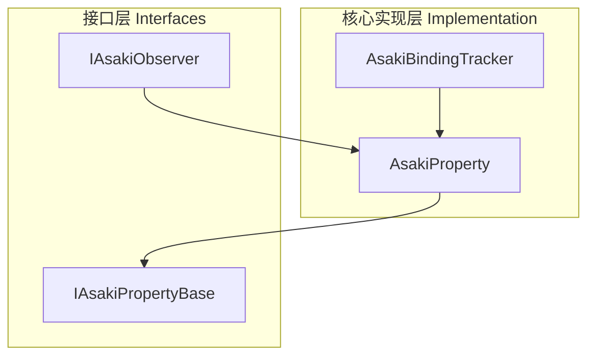
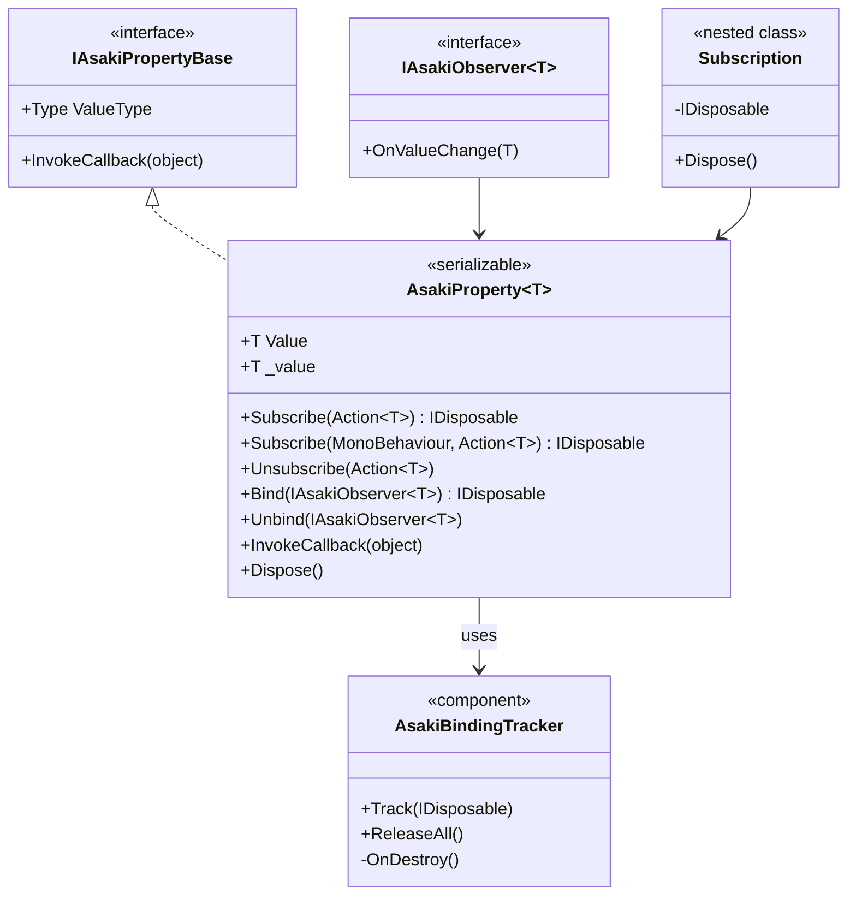
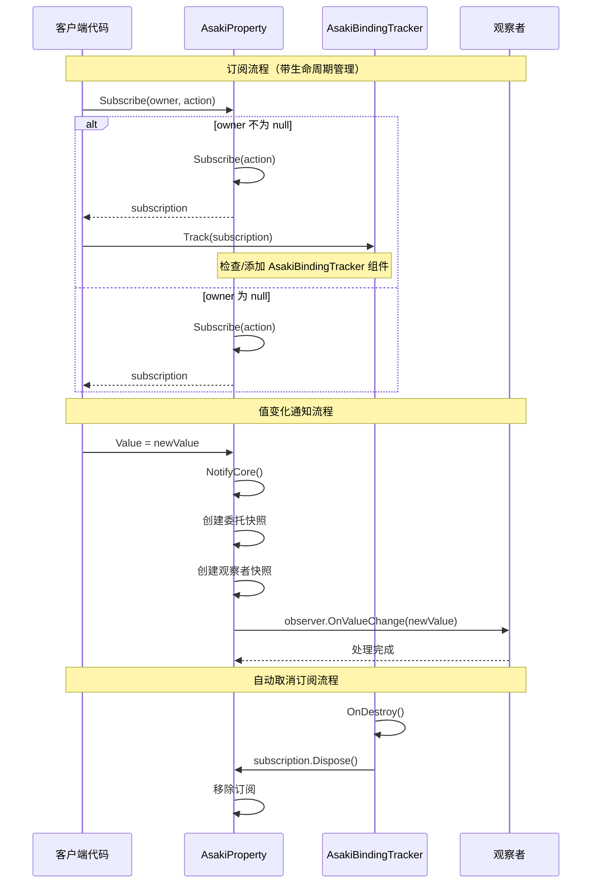
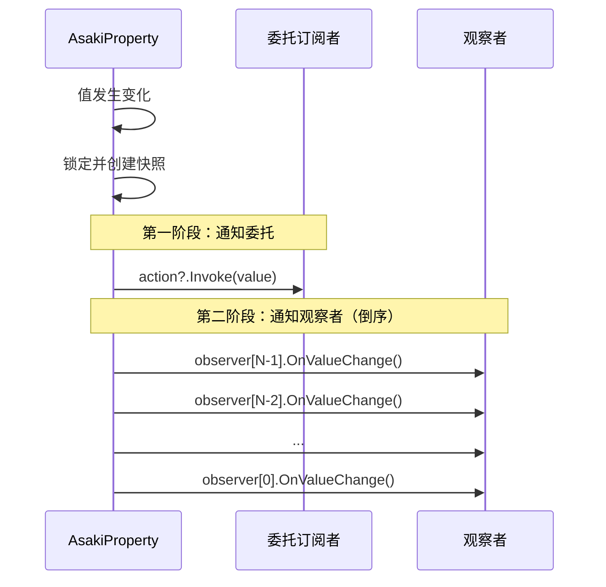

# Asaki Core/Reactive 模块架构文档

## 目录

1. [设计理念](#1-设计理念)
2. [软件架构](#2-软件架构)
3. [API参考](#3-api参考)
4. [好的示例](#4-好的示例)
5. [坏的示例](#5-坏的示例)

---

## 1. 设计理念

### 1.1 为什么需要响应式属性

在 Unity 游戏开发中，数据驱动架构已成为现代游戏设计的主流范式。传统的命令式编程模式要求开发者手动追踪数据变化并更新相关的 UI、游戏逻辑等，这种方式存在以下问题：

- **耦合度高**：数据变化时需要显式调用多个更新方法，代码高度耦合
- **维护困难**：新增一个观察者需要修改数据源代码，违反开闭原则
- **容易遗漏**：手动通知容易出现遗漏，导致 UI 不同步等问题
- **状态追踪困难**：难以追踪数据的历史变化和依赖关系

Asaki Reactive 模块实现了**观察者设计模式（Observer Pattern）**，为 Unity 开发者提供了一套简洁而强大的响应式编程框架。

### 1.2 观察者模式的设计意图

Asaki Reactive 模块的核心设计基于经典的观察者模式，但针对 Unity 做了深度优化：

1. **双重订阅机制**：支持委托（Action）和接口（IAsakiObserver）两种订阅方式，兼顾灵活性和类型安全
2. **自动生命周期管理**：通过 AsakiBindingTracker 自动追踪 MonoBehaviour 的生命周期，防止内存泄漏
3. **值相等性优化**：使用 EqualityComparer 检查值变化，避免不必要的通知开销
4. **快照机制**：通知过程中使用数组快照，支持在通知回调中修改订阅列表

### 1.3 序列化支持的设计考量

AsakiProperty<T> 标记了 [Serializable] 属性，使其可以在 Unity Inspector 中显示和序列化。这一设计使得：

- 可观察属性可以直接作为组件字段使用
- 支持 Unity 的 Prefab 机制和场景保存
- 可以在 Inspector 中查看和编辑初始值

但需要注意的是，委托和观察者列表标记了 [NonSerialized]，确保序列化安全：

- 订阅关系在运行时动态建立，不应持久化
- 避免反序列化后出现悬挂引用

### 1.4 线程安全设计

AsakiProperty 在单线程环境下设计，但考虑了未来的扩展性：

- 使用 lock 保护订阅列表的并发访问
- 快照机制确保通知过程中集合修改的安全性
- Unity 主线程模型下，属性更新和通知通常在同一帧内完成

---

## 2. 软件架构

### 2.1 模块架构概览

Asaki Reactive 模块采用简洁的两层架构设计：



### 2.2 核心类图



### 2.3 订阅生命周期流程



### 2.4 通知执行顺序



倒序遍历的设计目的是支持在通知回调中安全地解除绑定。

---

## 3. API参考

### 3.1 IAsakiObserver<T> 接口

观察者接口，用于接收可观察对象的值变化通知。

| 方法 | 描述 | 参数 | 返回值 |
|------|------|------|--------|
| `OnValueChange` | 当值发生变化时调用的方法 | `value`: 变化后的新值 | `void` |

### 3.2 IAsakiPropertyBase 接口

可观察属性的非泛型基接口，提供类型擦除后的统一访问能力。

| 属性 | 类型 | 描述 |
|------|------|------|
| `ValueType` | `Type` | 属性值的类型 |

| 方法 | 描述 | 参数 | 返回值 |
|------|------|------|--------|
| `InvokeCallback` | 使用类型擦除方式触发值变化回调 | `value`: 新的属性值 | `void` |

### 3.3 AsakiProperty<T> 核心实现

Asaki Reactive 框架的核心可观察属性类。

#### 属性

| 属性 | 类型 | 描述 |
|------|------|------|
| `Value` | `T` | 属性的值，设置时会自动通知所有订阅者 |
| `_value` | `T` | 存储属性的实际值（EditorBrowsable 隐藏） |
| `ValueType` | `Type` | 只读，返回 `typeof(T)` |

#### 订阅方法

| 方法 | 描述 | 参数 | 返回值 |
|------|------|------|--------|
| `Subscribe(Action<T>)` | 订阅值变化事件（普通方式） | `action`: 值变化回调 | `IDisposable` |
| `Subscribe(MonoBehaviour, Action<T>)` | 订阅值变化事件（带生命周期管理） | `owner`: 所属 MonoBehaviour<br>`action`: 值变化回调 | `IDisposable` |
| `Unsubscribe(Action<T>)` | 取消订阅 | `action`: 要取消的回调 | `void` |
| `Bind(IAsakiObserver<T>)` | 绑定观察者 | `observer`: 观察者实例 | `IDisposable` |
| `Unbind(IAsakiObserver<T>)` | 解绑观察者 | `observer`: 要解绑的观察者 | `void` |

#### 生命周期方法

| 方法 | 描述 |
|------|------|
| `Dispose()` | 释放所有订阅和观察者 |

#### 相等性运算符

| 运算符 | 描述 |
|--------|------|
| `operator ==` | 比较两个 AsakiProperty 是否相等（基于值） |
| `operator !=` | 比较两个 AsakiProperty 是否不相等 |
| `operator ==(T, AsakiProperty<T>)` | T 类型值与属性比较 |
| `operator ==(AsakiProperty<T>, T)` | 属性与 T 类型值比较 |
| `implicit operator T` | 隐式转换为 T 类型 |

#### 订阅行为说明

- **首次订阅立即调用**：订阅时会立即用当前值调用一次回调，确保订阅者获得最新状态
- **值相等不触发通知**：使用 `EqualityComparer<T>.Default` 检查值变化，相等时不触发通知
- **线程安全**：内部使用 lock 保护订阅列表，支持安全的并发订阅

### 3.4 AsakiBindingTracker 组件

绑定生命周期追踪器，用于自动管理订阅的生命周期。

| 方法 | 描述 | 参数 | 返回值 |
|------|------|------|--------|
| `Track` | 追踪一个订阅，使其在 MonoBehaviour 销毁时自动释放 | `subscription`: 要追踪的订阅 | `void` |
| `ReleaseAll` | 停止追踪并释放所有订阅 | 无 | `void` |

#### 重要特性

- 自动附加到订阅者的 GameObject 上
- 在 MonoBehaviour 的 OnDestroy 时自动释放所有订阅
- 防止内存泄漏

---

## 4. 好的示例

### 4.1 基础响应式属性使用

```csharp
using Asaki.Core.Reactive;
using UnityEngine;

/// <summary>
/// 玩家状态管理器示例
/// </summary>
public class PlayerStateManager : AsakiMono
{
    // 公开的可观察属性
    public AsakiProperty<int> Health = new AsakiProperty<int>(100);
    public AsakiProperty<int> Score = new AsakiProperty<int>(0);
    public AsakiProperty<bool> IsAlive = new AsakiProperty<bool>(true);

    protected override void OnStart()
    {
        // 订阅值变化
        Health.Subscribe(OnHealthChanged);
        Score.Subscribe(OnScoreChanged);
    }

    private void OnHealthChanged(int value)
    {
        Debug.Log($"生命值变化: {value}");
        if (value <= 0)
        {
            IsAlive.Value = false;
        }
    }

    private void OnScoreChanged(int value)
    {
        Debug.Log($"分数变化: {value}");
    }

    public void TakeDamage(int damage)
    {
        // 值相等时不会触发通知
        Health.Value = Mathf.Max(0, Health.Value - damage);
    }
}
```

### 4.2 使用接口绑定的观察者模式

```csharp
using Asaki.Core.Reactive;
using UnityEngine;

/// <summary>
/// 玩家生命值观察者 - 实现 IAsakiObserver 接口
/// </summary>
public class HealthObserver : IAsakiObserver<int>
{
    private readonly PlayerHealthUI _ui;

    public HealthObserver(PlayerHealthUI ui)
    {
        _ui = ui;
    }

    public void OnValueChange(int value)
    {
        if (_ui != null)
        {
            _ui.UpdateHealthBar(value);
        }
    }
}

/// <summary>
/// UI 组件示例
/// </summary>
public class PlayerHealthUI : AsakiMono
{
    [SerializeField] private UnityEngine.UI.Slider _healthSlider;
    [SerializeField] private UnityEngine.UI.Text _healthText;

    public void UpdateHealthBar(int health)
    {
        if (_healthSlider != null)
            _healthSlider.value = health;
        if (_healthText != null)
            _healthText.text = $"{health}/100";
    }
}

/// <summary>
/// 使用依赖注入和接口绑定的示例
/// </summary>
public class PlayerHUD : AsakiMono
{
    private AsakiProperty<int> _healthProperty;
    private HealthObserver _healthObserver;
    private IDisposable _healthBinding;

    protected override void OnStart()
    {
        // 直接创建属性（AsakiProperty通常不通过依赖注入获取）
        _healthProperty = new AsakiProperty<int>(100);

        if (_healthProperty != null)
        {
            // 使用接口绑定方式
            var ui = new PlayerHealthUI();
            _healthObserver = new HealthObserver(ui);
            _healthBinding = _healthProperty.Bind(_healthObserver);
        }
    }

    protected override void OnDestroy()
    {
        // 使用 using 或手动释放
        _healthBinding?.Dispose();
    }
}
```

### 4.3 使用生命周期管理的自动取消订阅

```csharp
using Asaki.Core.Reactive;
using UnityEngine;

/// <summary>
/// 玩家属性视图 - 自动管理订阅生命周期
/// </summary>
public class PlayerPropertyView : AsakiMono
{
    // 依赖注入的属性
    private AsakiProperty<int> _playerHealth;
    private AsakiProperty<string> _playerName;
    private AsakiProperty<Vector3> _playerPosition;

    private UnityEngine.UI.Text _healthText;
    private UnityEngine.UI.Text _nameText;
    private UnityEngine.UI.Text _positionText;

    void IAsakiInject<AsakiProperty<int>>.Inject(AsakiProperty<int> health)
    {
        _playerHealth = health;
    }

    void IAsakiInject<AsakiProperty<string>>.Inject(AsakiProperty<string> name)
    {
        _playerName = name;
    }

    void IAsakiInject<AsakiProperty<Vector3>>.Inject(AsakiProperty<Vector3> position)
    {
        _playerPosition = position;
    }

    protected override void OnStart()
    {
        // 获取 UI 组件引用（示例）
        _healthText = GetComponentInChildren<UnityEngine.UI.Text>();

        // 使用 this (MonoBehaviour) 自动管理生命周期
        // 当 PlayerPropertyView 被销毁时，自动取消所有订阅
        if (_playerHealth != null)
        {
            _playerHealth.Subscribe(this, OnHealthChanged);
        }

        if (_playerName != null)
        {
            _playerName.Subscribe(this, OnNameChanged);
        }

        if (_playerPosition != null)
        {
            _playerPosition.Subscribe(this, OnPositionChanged);
        }
    }

    private void OnHealthChanged(int value)
    {
        if (_healthText != null)
            _healthText.text = $"HP: {value}";
    }

    private void OnNameChanged(string value)
    {
        // 处理名称变化
    }

    private void OnPositionChanged(Vector3 value)
    {
        // 处理位置变化
    }

    // 无需手动取消订阅！
    // AsakiBindingTracker 会在 OnDestroy 时自动处理
}
```

### 4.4 计算属性和响应式链

```csharp
using Asaki.Core.Reactive;
using UnityEngine;

/// <summary>
/// 游戏状态 - 展示响应式链式更新
/// </summary>
public class GameState : AsakiMono
{
    public AsakiProperty<int> Gold = new AsakiProperty<int>(0);
    public AsakiProperty<int> Exp = new AsakiProperty<int>(0);
    public AsakiProperty<int> Level = new AsakiProperty<int>(1);
    public AsakiProperty<bool> IsLevelUp = new AsakiProperty<bool>(false);

    protected override void OnStart()
    {
        // 监听经验变化，达到阈值时升级
        Exp.Subscribe(this, OnExpChanged);
    }

    private void OnExpChanged(int exp)
    {
        int newLevel = CalculateLevel(exp);
        if (newLevel > Level.Value)
        {
            Level.Value = newLevel;
            IsLevelUp.Value = true;
            Debug.Log($"升级到 {newLevel} 级！");
        }
    }

    private int CalculateLevel(int exp)
    {
        // 简单的等级计算：每 100 经验升一级
        return Mathf.FloorToInt(exp / 100f) + 1;
    }
}
```

### 4.5 使用 IDisposable 进行确定性资源管理

```csharp
using Asaki.Core.Reactive;
using UnityEngine;

/// <summary>
/// 临时订阅示例 - 使用 using 块确定性管理生命周期
/// </summary>
public class TemporarySubscriptionExample : AsakiMono
{
    private AsakiProperty<float> _temperature;

    void IAsakiInject<AsakiProperty<float>>.Inject(AsakiProperty<float> temperature)
    {
        _temperature = temperature;
    }

    protected override void OnStart()
    {
        // 临时订阅：在 using 块结束时自动取消订阅
        using (var subscription = _temperature.Subscribe(OnTemperatureChanged))
        {
            // 初始值会被立即调用
            // 进行一些临时检查...
            CheckTemperature();
        }
        // 离开 using 块后，订阅自动取消

        // 或者在特定条件下取消
        using (var subscription = _temperature.Subscribe(OnTemperatureChanged))
        {
            // 模拟一些逻辑
            if (_temperature.Value > 100f)
            {
                // 条件满足，订阅会在 using 结束时取消
                Debug.Log("温度过高！");
            }
        }
    }

    private void OnTemperatureChanged(float value)
    {
        Debug.Log($"温度: {value}");
    }

    private void CheckTemperature()
    {
        // 使用当前值进行一些检查
    }
}
```

---

## 5. 坏的示例

### 5.1 内存泄漏 - 未取消订阅

```csharp
using Asaki.Core.Reactive;
using Asaki.Core.Context;
using System.Collections.Generic;

// 错误示例：未取消订阅导致内存泄漏
public class BadExample1 : AsakiMono
{
    private AsakiProperty<int> _score;

    void IAsakiInject<AsakiProperty<int>>.Inject(AsakiProperty<int> score)
    {
        _score = score;
    }

    protected override void OnStart()
    {
        // 问题：订阅后未保存 IDisposable，也未使用带 owner 的重载
        // 导致 AsakiProperty 持有了此 MonoBehaviour 的引用
        _score.Subscribe(OnScoreChanged);
        // 即使 MonoBehaviour 被销毁，订阅仍然存在
    }

    private void OnScoreChanged(int value)
    {
        // 处理分数变化
    }

    // 正确做法：使用以下方式之一
    // 1. 使用带 owner 的订阅：_score.Subscribe(this, OnScoreChanged);
    // 2. 保存 IDisposable 并在 OnDestroy 中调用 Dispose();
}
```

### 5.2 错误示例 - 使用 async void

```csharp
// 错误示例：在响应式回调中使用 async void
public class BadExample2 : AsakiMono
{
    private AsakiProperty<int> _data;

    protected override void OnStart()
    {
        _data.Subscribe(this, async value =>
        {
            // 错误：async void 会导致异常无法捕获，且可能导致内存泄漏
            await LoadDataAsync(value);
        });
    }

    private async UniTask LoadDataAsync(int value)
    {
        // 异步操作...
    }

    // 正确做法：使用 async UniTask + .Forget()
    // 或者在同步回调中处理
    private void OnDataChanged(int value)
    {
        // 同步处理，或使用 .Forget() 忽略返回值
        LoadDataAsync(value).Forget();
    }
}
```

### 5.3 错误示例 - 在通知回调中修改订阅列表

```csharp
using Asaki.Core.Reactive;
using Asaki.Core.Context;
using System.Collections.Generic;

// 错误示例：在通知回调中不当修改订阅列表
public class BadExample3 : AsakiMono
{
    private AsakiProperty<int> _counter = new AsakiProperty<int>(0);
    private List<Action<int>> _callbacks = new List<Action<int>>();

    protected override void OnStart()
    {
        _counter.Subscribe(this, OnCounterChanged);
    }

    private void OnCounterChanged(int value)
    {
        // 问题：在回调中尝试修改委托链
        // 虽然 AsakiProperty 使用了快照机制，但仍可能导致问题
        _counter.Unsubscribe(OnCounterChanged);
        _counter.Value = value + 1; // 再次触发通知
    }

    // 正确做法：使用倒序遍历后，再进行需要的操作
    private void SafeOnCounterChanged(int value)
    {
        // 如果需要取消订阅，可以在回调外处理
        // 或者使用延迟执行
        StartCoroutine(SafeUnsubscribeRoutine());
    }

    private System.Collections.IEnumerator SafeUnsubscribeRoutine()
    {
        yield return null;
        // 下一帧再取消订阅
    }
}
```

### 5.4 错误示例 - 值类型与引用类型的相等性混淆

```csharp
using Asaki.Core.Reactive;
using Asaki.Core.Context;

// 错误示例：对引用类型使用值相等性检查
public class BadExample4 : AsakiMono
{
    private AsakiProperty<PlayerData> _playerData;

    protected override void OnStart()
    {
        _playerData.Subscribe(this, OnPlayerDataChanged);
    }

    private void OnPlayerDataChanged(PlayerData data)
    {
        // 问题：PlayerData 是引用类型
        // 默认使用 EqualityComparer<T>.Default 进行相等性检查
        // 这只会检查引用相等，而不是内容相等
    }

    // 如果需要深度比较，应该自定义 EqualityComparer
    // 或者在设置值时创建新实例
    public void UpdatePlayerName(string newName)
    {
        var current = _playerData.Value;
        var updated = new PlayerData
        {
            Name = newName,
            Level = current.Level
        };
        _playerData.Value = updated; // 新实例，引用不同，触发通知
    }
}

// 正确做法：使用不可变数据模式
public readonly struct PlayerData
{
    public string Name { get; init; }
    public int Level { get; init; }
}
```

### 5.5 错误示例 - 订阅 null 值

```csharp
using Asaki.Core.Reactive;
using Asaki.Core.Context;

// 错误示例：订阅可能为 null 的属性
public class BadExample5 : AsakiMono
{
    private AsakiProperty<SomeData> _dataProperty;

    void IAsakiInject<AsakiProperty<SomeData>>.Inject(AsakiProperty<SomeData> data)
    {
        _dataProperty = data;
    }

    // 正确做法：添加 null 检查
    protected override void OnStart()
    {
        if (_dataProperty != null)
        {
            _dataProperty.Subscribe(this, OnDataChanged);
        }
    }
}
```

### 5.6 错误示例：序列化后订阅丢失

```csharp
using Asaki.Core.Reactive;
using Asaki.Core.Context;

// 错误示例：期望序列化保持订阅关系
[System.Serializable]
public class BadExample6 : AsakiMono
{
    // 可序列化，但订阅关系不会被序列化！
    public AsakiProperty<int> Score = new AsakiProperty<int>(0);

    protected override void OnStart()
    {
        // 订阅
        Score.Subscribe(this, OnScoreChanged);
    }

    // 问题：如果这个 MonoBehaviour 被序列化（例如保存到 Prefab）
    // 然后反序列化，订阅关系会丢失！
    // 因为 _onValueChangedAction 和 _observers 都标记了 [NonSerialized]

    // 正确做法：在 OnEnable 或反序列化后重新建立订阅
    private void OnEnable()
    {
        // 确保订阅已建立
        if (_onValueChangedAction == null && _observers == null)
        {
            Score.Subscribe(this, OnScoreChanged);
        }
    }
}
```

### 5.7 错误示例：线程安全问题

```csharp
using Asaki.Core.Reactive;
using Asaki.Core.Context;

// 错误示例：在非主线程环境下访问属性
public class BadExample7 : AsakiMono
{
    private AsakiProperty<int> _value = new AsakiProperty<int>(0);

    protected override void OnStart()
    {
        // 错误：在子线程中直接访问和修改 AsakiProperty
        // Unity 的 DOM 相关的属性不是线程安全的
        new System.Threading.Thread(() =>
        {
            _value.Value = 100; // 不安全！
            Debug.Log(_value.Value); // 不安全！
        }).Start();
    }

    // 正确做法：在主线程中执行
    private System.Collections.Concurrent.ConcurrentQueue<Action> _mainThreadQueue =
        new System.Collections.Concurrent.ConcurrentQueue<Action>();

    private void Update()
    {
        while (_mainThreadQueue.TryDequeue(out var action))
        {
            action?.Invoke();
        }
    }

    private void SafeUpdateFromThread(int newValue)
    {
        // 将操作加入主线程队列
        _mainThreadQueue.Enqueue(() =>
        {
            _value.Value = newValue;
        });
    }
}
```

---

## 附录

### 相关文件路径

- 核心实现: [AsakiProperty.cs](file:///e:/Projects/UnityGame/Asaki/Assets/Asaki/Core/Reactive/AsakiProperty.cs)
- 绑定追踪器: [AsakiBindTracker.cs](file:///e:/Projects/UnityGame/Asaki/Assets/Asaki/Core/Reactive/AsakiBindTracker.cs)

### 接口定义

- [IAsakiObserver.cs](file:///e:/Projects/UnityGame/Asaki/Assets/Asaki/Core/Reactive/IAsakiObserver.cs)
- [IAsakiPropertyBase.cs](file:///e:/Projects/UnityGame/Asaki/Assets/Asaki/Core/Reactive/IAsakiPropertyBase.cs)

---

_文档生成时间: 2026-03-03_
