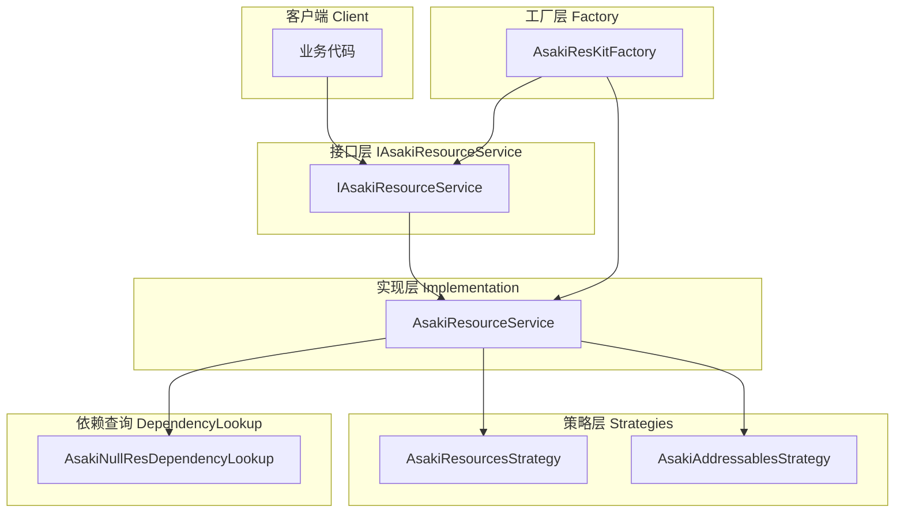
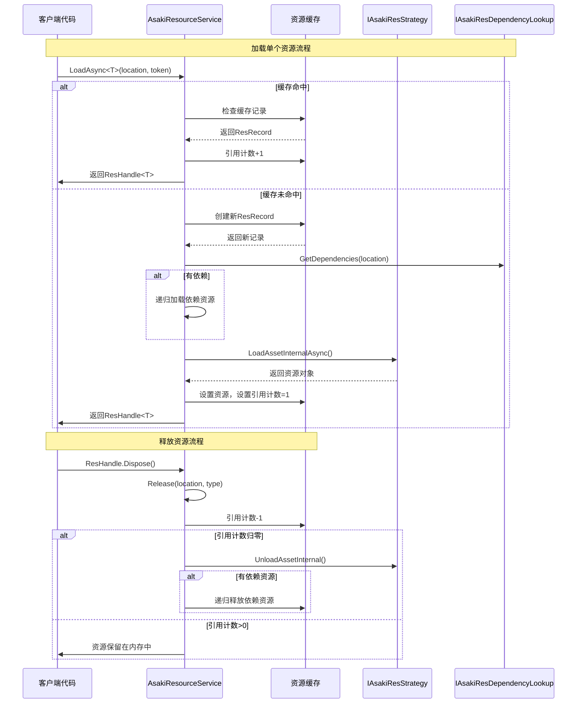
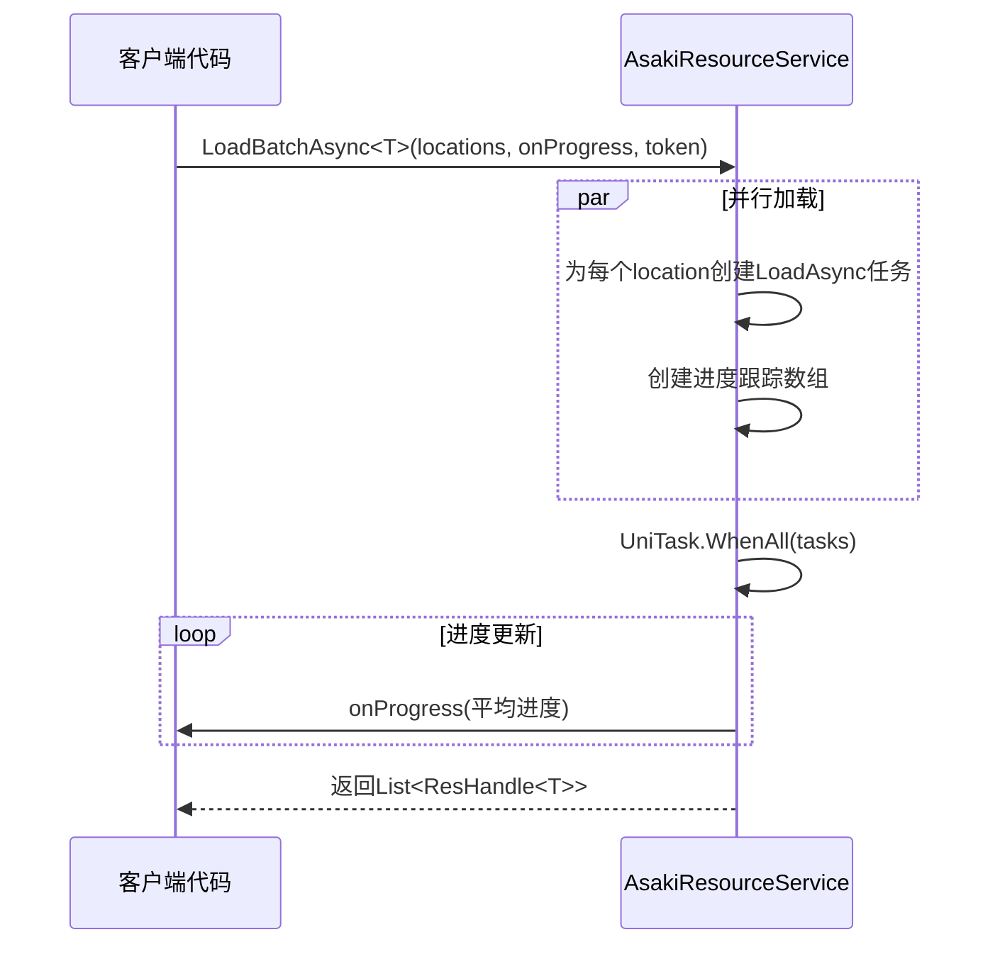
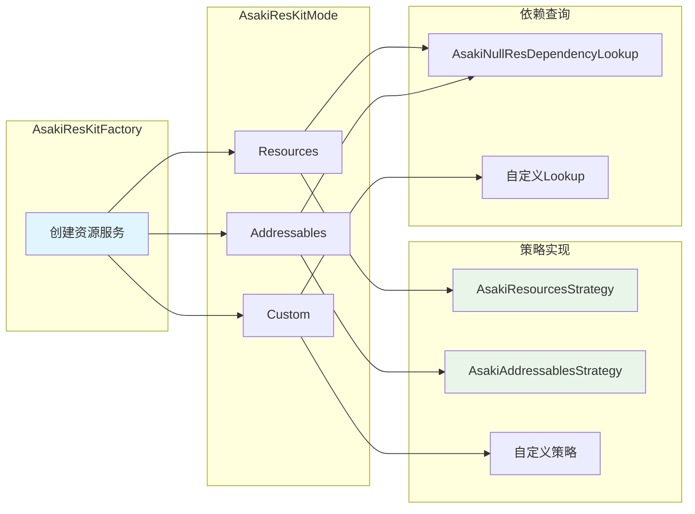

# Asaki Core/Resources 模块架构文档

## 目录

1. [设计理念](#1-设计理念)
2. [软件架构](#2-软件架构)
3. [API参考](#3-api参考)
4. [好的示例](#4-好的示例)
5. [坏的示例](#5-坏的示例)

---

## 1. 设计理念

### 1.1 为什么需要统一的资源管理

在Unity游戏开发中，资源加载是影响游戏性能和开发效率的关键因素。开发者经常面临以下挑战：

- **加载方式不统一**：Resources、Addressables、AssetBundle各有API，切换成本高
- **生命周期管理复杂**：手动管理资源引用容易导致内存泄漏
- **依赖处理繁琐**：AssetBundle需要手动处理依赖关系
- **进度反馈缺失**：同步加载无法提供进度反馈，影响用户体验

Asaki Resources模块通过**策略模式**和**引用计数机制**，提供了一套统一、优雅的资源管理解决方案。

### 1.2 策略模式的设计意图

Asaki Resources采用策略模式实现底层的解耦：

```
┌─────────────────────────────────────────────────────────┐
│                   IAsakiResourceService                 │
│            (统一的资源加载、释放、批量操作接口)           │
└──────────────────────────┬──────────────────────────────┘
                           │
                           ▼
┌─────────────────────────────────────────────────────────┐
│                   IAsakiResStrategy                     │
│              (资源加载策略抽象接口)                       │
└──────────┬──────────────────────┬───────────────────────┘
           │                      │
           ▼                      ▼
┌──────────────────┐    ┌────────────────────────┐
│ Resources策略   │    │ Addressables策略       │
│ (开发期)         │    │ (生产环境)             │
└──────────────────┘    └────────────────────────┘
```

这种设计确保：

- **无缝切换**：开发期使用Resources，生产环境切换到Addressables，只需修改一处配置
- **可扩展性**：通过实现接口可以支持任意自定义加载方式
- **关注点分离**：业务代码无需关心底层实现细节

### 1.3 引用计数与生命周期管理

传统的资源管理需要开发者手动追踪资源引用，容易出现泄漏或过早卸载的问题。Asaki Resources实现了自动引用计数：

```
加载资源 ──> 引用计数+1 ──> ResHandle.Dispose() ──> 引用计数-1 ──> 计数为0时卸载
```

关键设计点：

- **ResHandle模式**：封装资源引用，支持using语句自动释放
- **级联依赖释放**：主资源释放时，自动释放其依赖资源
- **线程安全**：使用ConcurrentDictionary和分段锁实现高并发支持

### 1.4 异步编程范式

Asaki Resources全面采用异步编程，基于UniTask实现：

- **非阻塞加载**：所有IO操作均为异步，不会卡死主线程
- **取消支持**：CancellationToken支持优雅取消
- **超时控制**：可配置加载超时，避免无限等待
- **进度反馈**：支持单个和批量加载的进度回调

---

## 2. 软件架构

### 2.1 整体架构图



### 2.2 核心类图

```mermaid
classDiagram
    class IAsakiResourceService {
        <<interface>>
        +LoadAsync&lt;T&gt;(string, Action&lt;float&gt;, CancellationToken) UniTask~ResHandle~T~~
        +LoadAsync(string, Type, Action&lt;float&gt;, CancellationToken) UniTask~ResHandle~Object~~
        +Release(string, Type) void
        +LoadBatchAsync&lt;T&gt;(IEnumerable&lt;string&gt;, Action&lt;float&gt;, CancellationToken) UniTask~List~ResHandle~T~~
        +ReleaseBatch&lt;T&gt;(IEnumerable&lt;string&gt;) void
        +UnloadUnusedAssets(CancellationToken) UniTask
        +SetTimeoutSeconds(int) void
    }

    class ResHandle&lt;T&gt; {
        <<class>>
        +string Location
        +T Asset
        +bool IsValid
        +Dispose() void
    }

    class IAsakiResStrategy {
        <<interface>>
        +string StrategyName
        +InitializeAsync() UniTask
        +LoadAssetInternalAsync(string, Type, Action&lt;float&gt;, CancellationToken) UniTask~Object~
        +UnloadAssetInternal(string, Object) void
        +UnloadUnusedAssets(CancellationToken) UniTask
    }

    class IAsakiResDependencyLookup {
        <<interface>>
        +GetDependencies(string) IEnumerable~string~
    }

    class AsakiResourceService {
        -IAsakiResStrategy _strategy
        -IAsakiAsyncService _asyncService
        -IAsakiResDependencyLookup _dependencyLookup
        -ConcurrentDictionary~int, ResRecord~ _cache
    }

    class AsakiResKitFactory {
        +RegisterCustom(Func~IAsakiResStrategy~, Func~IAsakiResDependencyLookup~) void
        +Create(AsakiResKitMode, IAsakiAsyncService, IAsakiEventService) IAsakiResourceService
    }

    class AsakiResourcesStrategy {
        -IAsakiAsyncService _asyncService
        +StrategyName string
    }

    class AsakiAddressablesStrategy {
        -IAsakiAsyncService _asyncService
        +StrategyName string
    }

    class AsakiResKitMode {
        <<enum>>
        +Resources
        +Addressables
        +Custom
    }

    IAsakiResourceService <|.. ResHandle
    IAsakiResourceService <|.. AsakiResourceService
    IAsakiResStrategy <|.. AsakiResourcesStrategy
    IAsakiResStrategy <|.. AsakiAddressablesStrategy
    AsakiResourceService --> IAsakiResStrategy
    AsakiResourceService --> IAsakiResDependencyLookup
    AsakiResKitFactory ..> AsakiResourceService
    AsakiResKitFactory ..> AsakiResKitMode
```

### 2.3 资源加载流程



### 2.4 批量加载流程



### 2.5 线程安全设计

Asaki Resources模块采用以下线程安全策略：

| 机制 | 应用场景 | 实现方式 |
|------|----------|----------|
| `ConcurrentDictionary` | 资源缓存 | 无锁并发读写 |
| 分段锁(Segment Locks) | 高并发缓存访问 | 16个独立锁对象 |
| `Interlocked` | 引用计数操作 | 原子增减 |
| `Volatile` | 引用计数读取 | 防止指令重排 |
| `TaskCompletionSource` | 异步加载状态 | 线程安全的结果通知 |

关键设计点：

- **分段锁策略**：将缓存分为16个段，减少锁竞争
- **双重检查锁定**：GetOrCreateRecord中先检查后加锁
- **异步加载统一化**：所有加载都通过TaskCompletionSource统一结果传递

### 2.6 配置体系



---

## 3. API参考

### 3.1 IAsakiResourceService 接口

资源服务的核心接口，定义资源加载、释放、批量操作的标准契约。

#### 泛型加载方法 `LoadAsync<T>`

| 方法 | 描述 | 参数 | 返回值 |
|------|------|------|--------|
| `LoadAsync<T>(location, token)` | 异步加载资源（无进度回调） | `location`: 资源路径<br>`token`: 取消令牌 | `UniTask<ResHandle<T>>` |
| `LoadAsync<T>(location, onProgress, token)` | 异步加载资源（带进度回调） | `location`: 资源路径<br>`onProgress`: 进度回调(0.0~1.0)<br>`token`: 取消令牌 | `UniTask<ResHandle<T>>` |

#### 非泛型加载方法

| 方法 | 描述 | 参数 | 返回值 |
|------|------|------|--------|
| `LoadAsync(location, type, onProgress, token)` | 运行时类型不确定时使用 | `location`: 资源路径<br>`type`: 资源类型<br>`onProgress`: 进度回调<br>`token`: 取消令牌 | `UniTask<ResHandle<Object>>` |

#### 释放方法

| 方法 | 描述 | 参数 | 返回值 |
|------|------|------|--------|
| `Release(location, type)` | 释放单个资源引用 | `location`: 资源路径<br>`type`: 资源类型 | `void` |
| `ReleaseBatch<T>(locations)` | 批量释放资源 | `locations`: 资源路径集合 | `void` |

#### 批量加载方法

| 方法 | 描述 | 参数 | 返回值 |
|------|------|------|--------|
| `LoadBatchAsync<T>(locations, token)` | 批量异步加载（无进度回调） | `locations`: 资源路径集合<br>`token`: 取消令牌 | `UniTask<List<ResHandle<T>>>` |
| `LoadBatchAsync<T>(locations, onProgress, token)` | 批量异步加载（带进度回调） | `locations`: 资源路径集合<br>`onProgress`: 整体进度回调<br>`token`: 取消令牌 | `UniTask<List<ResHandle<T>>>` |

#### 卸载与配置

| 方法 | 描述 | 参数 | 返回值 |
|------|------|------|--------|
| `UnloadUnusedAssets(token)` | 卸载未使用的资源 | `token`: 取消令牌 | `UniTask` |
| `SetTimeoutSeconds(timeoutSeconds)` | 设置加载超时 | `timeoutSeconds`: 超时秒数(最小1秒) | `void` |

### 3.2 ResHandle<T> 资源句柄

封装资源引用的核心类，实现IDisposable模式。

| 属性 | 类型 | 描述 |
|------|------|------|
| `Location` | `string` | 资源定位地址 |
| `Asset` | `T` | 加载的资源实例 |
| `IsValid` | `bool` | 句柄是否有效（资源非空） |

| 方法 | 描述 |
|------|------|
| `Dispose()` | 释放资源引用，减少引用计数 |
| `implicit operator T` | 隐式转换为资源实例 |

### 3.3 IAsakiResStrategy 接口

资源加载策略接口，定义底层加载行为的抽象。

| 属性/方法 | 类型 | 描述 |
|-----------|------|------|
| `StrategyName` | `string` | 策略名称，用于日志和调试 |
| `InitializeAsync()` | `UniTask` | 初始化策略（如加载） |
| `LoadAssetInternalAsync(location, type, onProgress, token)` | `UniTask<Object>` | 加载资源 |
| `UnloadAssetInternal(location, asset)` | `void` | 卸载单个资源 |
| `UnloadUnusedAssets(token)` | `UniTask` | 卸载未使用资源 |

### 3.4 IAsakiResDependencyLookup 接口

资源依赖查询接口，用于获取资源的依赖项。

| 方法 | 描述 | 返回值 |
|------|------|--------|
| `GetDependencies(location)` | 获取指定资源的依赖项列表 | `IEnumerable<string>` 或 `null` |

返回值的语义：
- `null`：底层系统自动处理依赖，无需应用层干预
- 空集合：该资源无依赖
- 非空集合：返回依赖资源的地址列表

### 3.5 AsakiResKitMode 枚举

资源管理的运行模式。

| 值 | 描述 | 适用场景 |
|----|------|----------|
| `Resources` | Unity原生Resources模式 | 开发期、原型期 |
| `Addressables` | Unity Addressables模式 | 生产环境、热更新 |
| `Custom` | 自定义加载模式 | 特殊需求、AssetBundle |

### 3.6 SerializableResourceType 体系

用于Inspector中配置资源类型的可序列化抽象类。

#### 内置类型

| 类名 | TypeName | 资源类型 |
|------|----------|----------|
| `GameObjectResourceType` | "GameObject" | GameObject预制体 |
| `Texture2DResourceType` | "Texture2D" | 2D纹理 |
| `SpriteResourceType` | "Sprite" | 精灵图片 |
| `MaterialResourceType` | "Material" | 材质 |
| `AudioClipResourceType` | "AudioClip" | 音频片段 |
| `TextAssetResourceType` | "TextAsset" | 文本资源 |
| `AnimationClipResourceType` | "AnimationClip" | 动画片段 |
| `ScriptableObjectResourceType` | "ScriptableObject" | ScriptableObject |
| `ShaderResourceType` | "Shader" | 着色器 |
| `MeshResourceType` | "Mesh" | 网格 |
| `CustomResourceType` | "Custom (类型全名)" | 自定义类型 |

### 3.7 AsakiResKitFactory 工厂类

创建资源服务的工厂类。

| 方法 | 描述 | 参数 | 返回值 |
|------|------|------|--------|
| `RegisterCustom(strategyBuilder, lookupBuilder)` | 注册自定义策略 | `strategyBuilder`: 策略创建委托<br>`lookupBuilder`: 依赖查询创建委托（可选） | `void` |
| `ClearCustom()` | 清除自定义策略注册 | 无 | `void` |
| `Create(mode, asyncService, eventService)` | 创建资源服务实例 | `mode`: 运行模式<br>`asyncService`: 异步服务<br>`eventService`: 事件服务 | `IAsakiResourceService` |

---

## 4. 好的示例

### 4.1 基础资源加载

```csharp
using Asaki.Core.Resources;
using Asaki.Unity;
using Cysharp.Threading.Tasks;
using UnityEngine;

/// <summary>
/// 玩家管理器示例 - 展示基础资源加载
/// </summary>
public class PlayerManager : AsakiMono, IAsakiAutoInject
{
    private IAsakiResourceService _resourceService;

    /// <summary>
    /// 玩家预制体路径
    /// </summary>
    [SerializeField] private string playerPrefabPath = "Prefabs/Character/Player";

    void IAsakiInject<IAsakiResourceService>.Inject(IAsakiResourceService resourceService)
    {
        _resourceService = resourceService;
    }

    protected override void OnStart()
    {
        LoadPlayerAsync().Forget();
    }

    /// <summary>
    /// 异步加载玩家预制体
    /// </summary>
    private async UniTask LoadPlayerAsync()
    {
        // 使用using语句确保资源正确释放
        using (var handle = await _resourceService.LoadAsync<GameObject>(playerPrefabPath))
        {
            if (handle.IsValid)
            {
                // 实例化玩家
                Instantiate(handle.Asset, Vector3.zero, Quaternion.identity);
            }
        }
        // handle.Dispose() 自动调用，引用计数-1
    }
}
```

### 4.2 带进度回调的资源加载

```csharp
using Asaki.Core.Resources;
using Asaki.Unity;
using Cysharp.Threading.Tasks;
using UnityEngine;
using UnityEngine.UI;

/// <summary>
/// 资源预加载器示例 - 展示进度回调
/// </summary>
public class ResourcePreloader : AsakiMono, IAsakiAutoInject
{
    private IAsakiResourceService _resourceService;
    [SerializeField] private Slider loadingSlider;
    [SerializeField] private Text loadingText;

    private readonly string[] _preloadPaths = new[]
    {
        "Prefabs/Level/Map01",
        "Prefabs/Level/Map02",
        "Prefabs/Character/Hero",
        "Prefabs/Character/Enemy",
        "Audio/Music/BGM_Main",
        "Audio/Sound/Attack"
    };

    void IAsakiInject<IAsakiResourceService>.Inject(IAsakiResourceService resourceService)
    {
        _resourceService = resourceService;
    }

    protected override void OnStart()
    {
        PreloadResourcesAsync().Forget();
    }

    /// <summary>
    /// 批量异步加载资源，带进度反馈
    /// </summary>
    private async UniTask PreloadResourcesAsync()
    {
        // 批量加载资源，带进度反馈
        var handles = await _resourceService.LoadBatchAsync<GameObject>(
            _preloadPaths,
            progress =>
            {
                // 更新UI进度条
                if (loadingSlider != null)
                {
                    loadingSlider.value = progress;
                }
                if (loadingText != null)
                {
                    loadingText.text = $"加载中... {(progress * 100):F0}%";
                }
            }
        );

        // 所有资源加载完成
        if (loadingText != null)
        {
            loadingText.text = "加载完成!";
        }
    }
}
```

### 4.3 使用Addressables模式

```csharp
using Asaki.Core.Resources;
using Asaki.Unity;
using Cysharp.Threading.Tasks;
using UnityEngine;

/// <summary>
/// 动态关卡加载器示例 - 展示Addressables模式
/// </summary>
public class LevelLoader : AsakiMono, IAsakiAutoInject
{
    private IAsakiResourceService _resourceService;

    void IAsakiInject<IAsakiResourceService>.Inject(IAsakiResourceService resourceService)
    {
        _resourceService = resourceService;
    }

    protected override void OnStart()
    {
        // 设置依赖加载超时为10秒
        _resourceService.SetTimeoutSeconds(10);
    }

    public async UniTask LoadLevelAsync(string levelAddress)
    {
        using (var handle = await _resourceService.LoadAsync<GameObject>(levelAddress))
        {
            if (handle.IsValid)
            {
                var level = Instantiate(handle.Asset);
                // 初始化关卡...
            }
        }
    }

    public async UniTask UnloadLevelAsync()
    {
        // 触发未使用资源卸载
        await _resourceService.UnloadUnusedAssets();
    }
}
```

### 4.4 自定义资源类型配置

```csharp
using Asaki.Core.Resources;
using UnityEngine;

/// <summary>
/// 资源配置示例 - 展示SerializableResourceType使用
/// </summary>
public class ResourceConfig : ScriptableObject
{
    [Tooltip("资源路径")]
    public string resourcePath;

    [Tooltip("资源类型选择")]
    [SerializeReference]
    public SerializableResourceType resourceType;

    // 使用示例
    private void OnValidate()
    {
        // 在Inspector中选择资源类型后，可以这样使用
        if (resourceType != null)
        {
            Type actualType = resourceType.GetResourceType();
            Debug.Log($"选择的资源类型: {actualType.FullName}");
        }
    }
}

// 创建配置菜单
#if UNITY_EDITOR
using UnityEditor;
public class ResourceConfigCreator
{
    [MenuItem("Asaki/Create Resource Config")]
    public static void Create()
    {
        var config = ScriptableObject.CreateInstance<ResourceConfig>();
        AssetDatabase.CreateAsset(config, "Assets/Configs/ResourceConfig.asset");
    }
}
#endif
```

### 4.5 注册自定义策略

```csharp
using Asaki.Core.Resources;
using Asaki.Core.Async;
using System;

/// <summary>
/// 自定义策略示例 - 用于AssetBundle加载
/// </summary>
public class MyAssetBundleStrategy : IAsakiResStrategy
{
    public string StrategyName => "AssetBundle (Custom)";

    public UniTask InitializeAsync()
    {
        // 初始化AssetBundleManifest等
        return UniTask.CompletedTask;
    }

    public async UniTask<UnityEngine.Object> LoadAssetInternalAsync(
        string location,
        Type type,
        Action<float> onProgress,
        CancellationToken token
    )
    {
        // 自定义AssetBundle加载逻辑
        // ...
        throw new NotImplementedException();
    }

    public void UnloadAssetInternal(string location, UnityEngine.Object asset)
    {
        // 自定义卸载逻辑
    }

    public async UniTask UnloadUnusedAssets(CancellationToken token)
    {
        // 卸载未使用的AssetBundle
    }
}

/// <summary>
/// 自定义依赖查询实现
/// </summary>
public class MyAssetBundleLookup : IAsakiResDependencyLookup
{
    public IEnumerable<string> GetDependencies(string location)
    {
        // 实现依赖查询逻辑
        return null;
    }
}

/// <summary>
/// 自定义资源设置类 - 展示如何注册和使用自定义策略
/// </summary>
public class CustomResourceSetup
{
    public static void Setup()
    {
        // 注册自定义策略
        AsakiResKitFactory.RegisterCustom(
            () => new MyAssetBundleStrategy(),
            () => new MyAssetBundleLookup()
        );

        // 从服务容器获取所需的服务实例
        // 注意：实际项目中应通过依赖注入获取
        var asyncService = AsakiServiceContainer.GetService<IAsakiAsyncService>();
        var eventService = AsakiServiceContainer.GetService<IAsakiEventService>();

        // 之后可以通过Custom模式创建服务
        var service = AsakiResKitFactory.Create(
            AsakiResKitMode.Custom,
            asyncService,
            eventService
        );
    }
}
```

---

## 5. 坏的示例

### 5.1 内存泄漏 - 未释放资源

```csharp
// 错误示例：资源加载后未释放
public class BadExample1 : AsakiMono, IAsakiAutoInject
{
    private IAsakiResourceService _resourceService;
    private GameObject _playerPrefab;

    void IAsakiInject<IAsakiResourceService>.Inject(IAsakiResourceService resourceService)
    {
        _resourceService = resourceService;
    }

    protected override async void OnStart()
    {
        // 问题：加载后未使用using语句，也未手动释放
        var handle = await _resourceService.LoadAsync<GameObject>("Prefabs/Player");
        _playerPrefab = handle.Asset;
        // handle未释放，引用计数永不归零！
    }

    // 正确做法：
    // 1. 使用using语句
    // 2. 或者手动调用handle.Dispose()
}
```

### 5.2 引用计数误解

```csharp
// 错误示例：认为Instantiate后原资源会自动释放
public class BadExample2 : AsakiMono, IAsakiAutoInject
{
    private IAsakiResourceService _resourceService;

    void IAsakiInject<IAsakiResourceService>.Inject(IAsakiResourceService resourceService)
    {
        _resourceService = resourceService;
    }

    protected override async void OnStart()
    {
        using (var handle = await _resourceService.LoadAsync<GameObject>("Prefabs/Enemy"))
        {
            // Instantiate创建的是实例，原资源仍在内存中
            var enemy = Instantiate(handle.Asset);
        }
        // handle.Dispose()后，原资源引用计数-1

        // 问题：如果enemy实例仍在场景中，原资源不能被卸载
        // 这是正确的行为，引用计数管理的是源资源，非实例
    }
}
```

### 5.3 批量加载误用

```csharp
// 错误示例：在Update中频繁调用批量加载
public class BadExample3 : AsakiMono, IAsakiAutoInject
{
    private IAsakiResourceService _resourceService;

    void IAsakiInject<IAsakiResourceService>.Inject(IAsakiResourceService resourceService)
    {
        _resourceService = resourceService;
    }

    private void Update()
    {
        if (Input.GetKeyDown(KeyCode.Space))
        {
            // 问题：每次按键都创建新的批量加载任务
            // 正确做法：预加载或使用单例缓存
            _ = LoadRandomAssetAsync();
        }
    }

    private async UniTask LoadRandomAssetAsync()
    {
        var paths = new[] { "Prefabs/A", "Prefabs/B", "Prefabs/C" };
        await _resourceService.LoadBatchAsync<GameObject>(paths);
    }
}

// 正确示例：预加载+缓存
public class GoodExample3 : AsakiMono, IAsakiAutoInject
{
    private IAsakiResourceService _resourceService;
    private GameObject _cachedPrefab;

    void IAsakiInject<IAsakiResourceService>.Inject(IAsakiResourceService resourceService)
    {
        _resourceService = resourceService;
    }

    protected override async void OnStart()
    {
        // 预加载需要的资源
        using (var handle = await _resourceService.LoadAsync<GameObject>("Prefabs/Cached"))
        {
            _cachedPrefab = handle.Asset;
        }
    }
}
```

### 5.4 类型不匹配

```csharp
// 错误示例：类型参数与实际资源类型不匹配
public class BadExample4 : AsakiMono, IAsakiAutoInject
{
    private IAsakiResourceService _resourceService;

    void IAsakiInject<IAsakiResourceService>.Inject(IAsakiResourceService resourceService)
    {
        _resourceService = resourceService;
    }

    protected override async void OnStart()
    {
        // 问题：加载的是Texture，但用GameObject泛型
        // 这会导致InvalidCastException
        try
        {
            using (var handle = await _resourceService.LoadAsync<GameObject>("Textures/Player"))
            {
                // 永远不会执行到这里
            }
        }
        catch (InvalidCastException ex)
        {
            Debug.LogError($"类型错误: {ex.Message}");
        }

        // 正确做法：使用正确的类型
        using (var handle = await _resourceService.LoadAsync<Texture2D>("Textures/Player"))
        {
            // 正确
        }
    }
}
```

### 5.5 取消令牌未传递

```csharp
// 错误示例：忽略取消令牌
public class BadExample5 : AsakiMono, IAsakiAutoInject
{
    private IAsakiResourceService _resourceService;
    private CancellationTokenSource _cts;

    void IAsakiInject<IAsakiResourceService>.Inject(IAsakiResourceService resourceService)
    {
        _resourceService = resourceService;
    }

    protected override void OnDestroy()
    {
        // 问题：没有取消正在进行的加载
        // 资源可能仍在加载，导致不必要的CPU和内存开销

        // 正确做法：
        _cts?.Cancel();
        _cts?.Dispose();
    }

    public async UniTask LoadWithCancellation()
    {
        _cts = new CancellationTokenSource();

        // 问题：这里传入了token，但可能其他地方调用时没有传入
        // 导致无法取消
        var handle = await _resourceService.LoadAsync<GameObject>("Prefabs/Heavy", _cts.Token);

        // 正确做法：始终传递取消令牌
    }
}
```

### 5.6 路径格式错误

```csharp
// 错误示例：Resources路径包含扩展名
public class BadExample6 : AsakiMono, IAsakiAutoInject
{
    private IAsakiResourceService _resourceService;

    void IAsakiInject<IAsakiResourceService>.Inject(IAsakiResourceService resourceService)
    {
        _resourceService = resourceService;
    }

    protected override async void OnStart()
    {
        // 问题1：Resources模式不应包含扩展名
        // Resources.Load("Prefabs/Player.prefab") 是错误的
        // 应该是 Resources.Load("Prefabs/Player")
        using (var handle = await _resourceService.LoadAsync<GameObject>("Prefabs/Player.prefab"))
        {
        }

        // 问题2：路径使用了反斜杠
        using (var handle = await _resourceService.LoadAsync<GameObject>("Prefabs\\Player"))
        {
        }

        // 正确做法：使用正斜杠，不含扩展名
        using (var handle = await _resourceService.LoadAsync<GameObject>("Prefabs/Player"))
        {
        }
    }
}
```

### 5.7 异步方法在同步上下文调用

```csharp
// 错误示例：在非异步方法中调用异步加载
public class BadExample7 : AsakiMono, IAsakiAutoInject
{
    private IAsakiResourceService _resourceService;

    void IAsakiInject<IAsakiResourceService>.Inject(IAsakiResourceService resourceService)
    {
        _resourceService = resourceService;
    }

    // 问题：在构造函数或同步初始化方法中调用异步方法
    public BadExample7()
    {
        // 错误：构造函数中不能使用await
        // _resourceService.LoadAsync<GameObject>("Prefabs/Test");
    }

    private void Start()
    {
        // 错误：Start是同步方法，不能直接await
        // await _resourceService.LoadAsync<GameObject>("Prefabs/Test");

        // 正确做法：使用UniTask.Void或FireAndForget
        _ = LoadAsync();
    }

    private async UniTask LoadAsync()
    {
        using (var handle = await _resourceService.LoadAsync<GameObject>("Prefabs/Test"))
        {
            // 处理...
        }
    }
}
```

---

## 附录

### 相关文件路径

- 资源服务接口: [IAsakiResourceService.cs](file:///e:/Projects/UnityGame/Asaki/Assets/Asaki/Core/Resources/IAsakiResourceService.cs)
- 资源策略接口: [IAsakiResStrategy.cs](file:///e:/Projects/UnityGame/Asaki/Assets/Asaki/Core/Resources/IAsakiResStrategy.cs)
- 依赖查询接口: [IAsakiResDependencyLookup.cs](file:///e:/Projects/UnityGame/Asaki/Assets/Asaki/Core/Resources/IAsakiResDependencyLookup.cs)
- 运行模式枚举: [AsakiResKitMode.cs](file:///e:/Projects/UnityGame/Asaki/Assets/Asaki/Core/Resources/AsakiResKitMode.cs)
- 可序列化资源类型: [SerializableResourceType.cs](file:///e:/Projects/UnityGame/Asaki/Assets/Asaki/Core/Resources/SerializableResourceType.cs)

### 实现文件

- 资源服务实现: [AsakiResourceService.cs](file:///e:/Projects/UnityGame/Asaki/Assets/Asaki/Unity/Services/Resources/AsakiResourceService.cs)
- 资源服务工厂: [AsakiResKitFactory.cs](file:///e:/Projects/UnityGame/Asaki/Assets/Asaki/Unity/Services/Resources/AsakiResKitFactory.cs)
- Resources策略: [AsakiResourcesStrategy.cs](file:///e:/Projects/UnityGame/Asaki/Assets/Asaki/Unity/Services/Resources/Strategies/AsakiResourcesStrategy.cs)
- Addressables策略: [AsakiAddressablesStrategy.cs](file:///e:/Projects/UnityGame/Asaki/Assets/Asaki/Unity/Services/Resources/Strategies/AsakiAddressablesStrategy.cs)

### 相关模块

- 对象池模块: [pooling/architecture.md](file:///e:/Projects/UnityGame/Asaki/Assets/Asaki/Doc/modules/core/pooling/architecture.md)
- 异步服务模块: [async/architecture.md](file:///e:/Projects/UnityGame/Asaki/Assets/Asaki/Doc/modules/core/async/architecture.md)

---

_文档生成时间: 2026-03-03_
