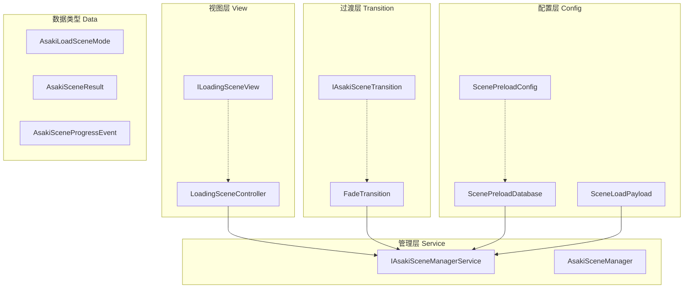
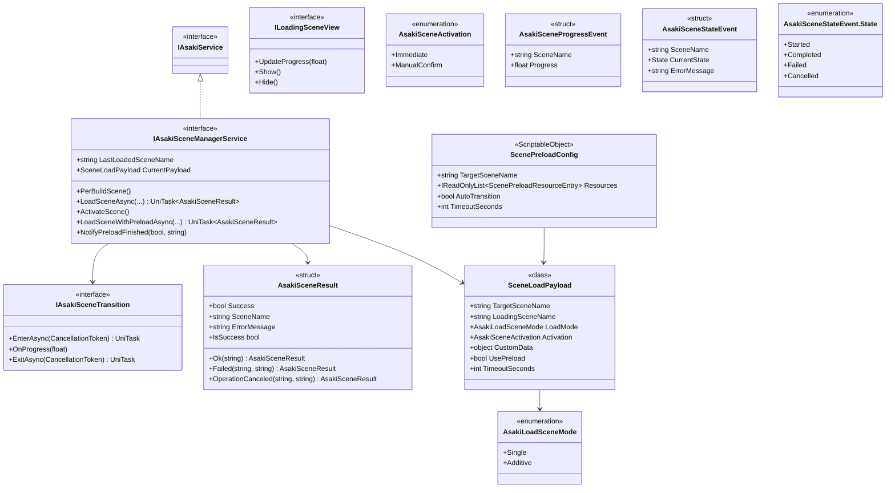
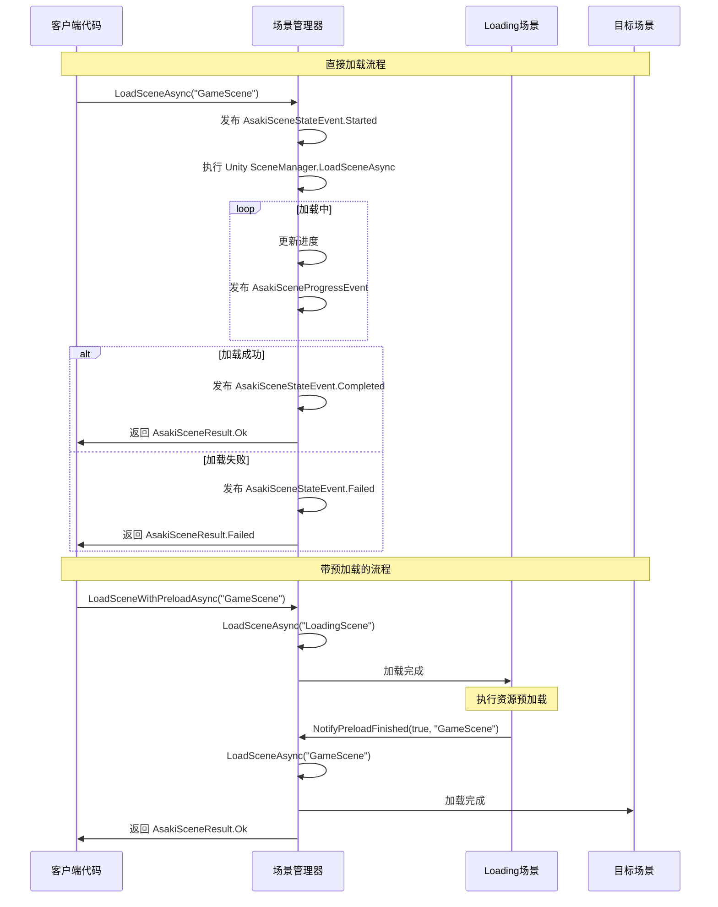
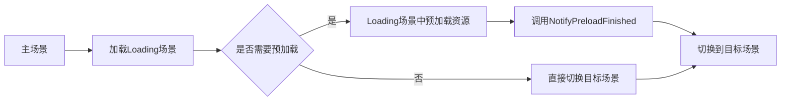
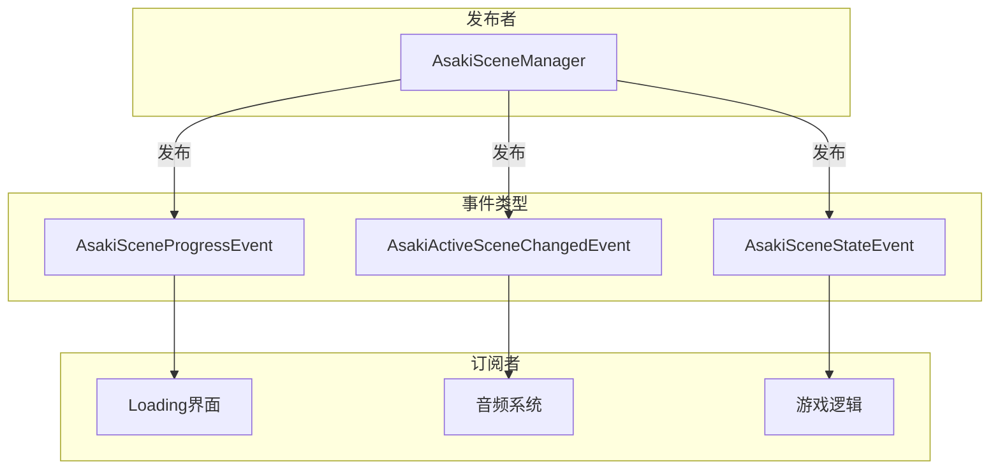

# Asaki Core/Scene 模块架构文档

## 目录

1. [设计理念](#1-设计理念)
2. [软件架构](#2-软件架构)
3. [API参考](#3-api参考)
4. [好的示例](#4-好的示例)
5. [坏的示例](#5-坏的示例)

---

## 1. 设计理念

### 1.1 为什么需要场景管理

在Unity游戏开发中，场景管理是核心功能之一。传统的 `SceneManager` API 虽然可用，但在复杂项目中存在以下问题：

- **加载体验差**：使用 `LoadSceneAsync` 时缺乏统一的进度回调机制
- **过渡效果难实现**：没有标准的方式插入转场动画
- **预加载支持不足**：无法方便地在加载目标场景前预加载资源
- **状态反馈缺失**：加载成功或失败没有统一的结果封装
- **激活时机控制有限**：无法精确控制场景激活时机

Asaki Scene 模块通过接口抽象和统一的事件系统，解决了上述问题，提供了一套完整的场景管理解决方案。

### 1.2 异步优先的设计原则

Asaki Scene 模块遵循**异步优先**的设计原则：

- 所有场景加载操作都返回 `UniTask<T>`，不阻塞主线程
- 支持 `CancellationToken` 实现可取消的加载操作
- 内部使用 Unity 的 `AsyncOperation` 实现真正的异步加载

这种设计确保了：
- 加载过程不会导致游戏卡顿
- 玩家可以在加载过程中看到进度反馈
- 可以在加载中途取消操作，避免资源浪费

### 1.3 预加载机制的设计意图

在实际游戏开发中，加载时间往往不仅包含场景本身的加载，还包括场景内资源的加载。如果等到场景切换后才开始加载资源，玩家会看到较长的黑屏时间。

Asaki Scene 实现了 **A -> LoadingScene -> TargetScene** 的三阶段流程：

1. **阶段一 (A -> LoadingScene)**：先加载专门的过渡场景（LoadingScene）
2. **阶段二 (预加载)**：在过渡场景中并行加载目标场景需要的资源
3. **阶段三 (LoadingScene -> TargetScene)**：资源加载完成后，切换到目标场景

这样做的好处：
- 过渡场景可以显示动态的加载界面（进度条、动画等）
- 资源预加载与场景加载并行进行，减少等待时间
- 用户始终看到有意义的反馈，而不是长时间黑屏

### 1.4 解耦的设计思想

Asaki Scene 模块非常注重解耦：

- **接口抽象**：使用 `IAsakiSceneManagerService` 抽象场景管理实现，便于单元测试
- **视图解耦**：`ILoadingSceneView` 接口将 Loading 界面与具体实现分离
- **过渡动画解耦**：`IAsakiSceneTransition` 接口允许自定义任意转场效果
- **配置与逻辑分离**：`ScenePreloadConfig` 和 `ScenePreloadDatabase` 将预加载配置外部化

---

## 2. 软件架构

### 2.1 模块架构概览



### 2.2 核心类图



### 2.3 场景加载流程



### 2.4 预加载流程图



### 2.5 事件系统架构

Asaki Scene 模块通过事件总线实现进度和状态的通知：



---

## 3. API参考

### 3.1 IAsakiSceneManagerService 接口

场景管理服务的核心接口，提供场景加载、预加载、激活等全部功能。

#### 属性

| 属性 | 类型 | 描述 |
|------|------|------|
| `LastLoadedSceneName` | `string` | 最近一次加载成功的场景名称 |
| `CurrentPayload` | `SceneLoadPayload` | 当前待处理的场景加载参数 |

#### 方法

| 方法 | 描述 | 参数 | 返回值 |
|------|------|------|--------|
| `PerBuildScene` | 预构建场景缓存 | 无 | `void` |
| `LoadSceneAsync` | 异步加载场景 | `sceneName`: 场景名称<br>`mode`: 加载模式<br>`activation`: 激活方式<br>`transition`: 过渡动画<br>`token`: 取消令牌 | `UniTask<AsakiSceneResult>` |
| `ActivateScene` | 手动激活场景 | 无 | `void` |
| `LoadSceneWithPreloadAsync` | 带预加载的场景切换 | `targetSceneName`: 目标场景<br>`loadingSceneName`: 过渡场景<br>`token`: 取消令牌 | `UniTask<AsakiSceneResult>` |
| `NotifyPreloadFinished` | 通知预加载完成 | `success`: 是否成功<br>`sceneName`: 场景名称 | `void` |

### 3.2 IAsakiSceneTransition 接口

场景过渡动画接口，用于实现自定义的转场效果。

| 方法 | 描述 | 参数 | 返回值 |
|------|------|------|--------|
| `EnterAsync` | 进入过渡动画 | `ct`: 取消令牌 | `UniTask` |
| `OnProgress` | 进度更新回调 | `normalizedProgress`: 进度值(0-1) | `void` |
| `ExitAsync` | 退出过渡动画 | `ct`: 取消令牌 | `UniTask` |

### 3.3 ILoadingSceneView 接口

加载场景视图接口，用于解耦 Loading 界面与具体实现。

| 方法 | 描述 | 参数 |
|------|------|------|
| `UpdateProgress` | 更新加载进度 | `progress`: 进度值(0-1) |
| `Show` | 显示加载视图 | 无参数 |
| `Hide` | 隐藏加载视图 | 无参数 |

### 3.4 AsakiLoadSceneMode 枚举

场景加载模式定义。

| 值 | 描述 |
|----|------|
| `Single` | 单场景模式，加载新场景时卸载当前所有场景 |
| `Additive` | 叠加模式，保留当前场景，叠加新场景 |

### 3.5 AsakiSceneActivation 枚举

场景激活方式定义。

| 值 | 描述 |
|----|------|
| `Immediate` | 加载完成后立即激活场景 |
| `ManualConfirm` | 等待手动确认（如"按任意键继续"）后激活 |

### 3.6 AsakiSceneResult 结构体

场景加载操作的结果封装。

| 属性 | 类型 | 描述 |
|------|------|------|
| `Success` | `bool` | 是否加载成功 |
| `SceneName` | `string` | 加载的场景名称 |
| `ErrorMessage` | `string` | 错误信息（如有） |
| `IsSuccess` | `bool` | Success 的只读别名 |

| 静态方法 | 描述 |
|----------|------|
| `Ok(sceneName)` | 创建成功结果 |
| `Failed(sceneName, errorMessage)` | 创建失败结果 |
| `OperationCanceled(sceneName, errorMessage)` | 创建取消结果 |

### 3.7 AsakiSceneProgressEvent 结构体

场景加载进度事件。

| 属性 | 类型 | 描述 |
|------|------|------|
| `SceneName` | `string` | 场景名称 |
| `Progress` | `float` | 进度值(0-1) |

### 3.8 AsakiSceneStateEvent 结构体

场景加载状态事件。

| 属性 | 类型 | 描述 |
|------|------|------|
| `SceneName` | `string` | 场景名称 |
| `CurrentState` | `State` | 当前状态(Started/Completed/Failed/Cancelled) |
| `ErrorMessage` | `string` | 错误信息（如有） |

#### State 嵌套枚举

AsakiSceneStateEvent 内部包含一个嵌套的 State 枚举，用于表示场景加载的不同状态。

| 值 | 描述 |
|----|------|
| `Started` | 场景加载已开始 |
| `Completed` | 场景加载已成功完成 |
| `Failed` | 场景加载失败 |
| `Cancelled` | 场景加载已取消 |

### 3.9 SceneLoadPayload 类

场景加载参数封装。

| 属性 | 类型 | 默认值 | 描述 |
|------|------|--------|------|
| `TargetSceneName` | `string` | - | 目标场景名称 |
| `LoadingSceneName` | `string` | "LoadingScene" | 过渡场景名称 |
| `LoadMode` | `AsakiLoadSceneMode` | Single | 加载模式 |
| `Activation` | `AsakiSceneActivation` | Immediate | 激活方式 |
| `CustomData` | `object` | null | 自定义数据 |
| `UsePreload` | `bool` | true | 是否使用预加载 |
| `TimeoutSeconds` | `int` | 30 | 超时时间(秒) |

| 静态方法 | 描述 |
|----------|------|
| `Create(targetSceneName, loadingSceneName)` | 创建带预加载的参数 |
| `CreateWithoutPreload(targetSceneName)` | 创建不带预加载的参数 |

### 3.10 ScenePreloadConfig 类

场景预加载配置（ScriptableObject）。

| 属性 | 类型 | 描述 |
|------|------|------|
| `TargetSceneName` | `string` | 目标场景名称 |
| `Resources` | `IReadOnlyList<ScenePreloadResourceEntry>` | 预加载资源列表 |
| `AutoTransition` | `bool` | 预加载完成后是否自动切换 |
| `TimeoutSeconds` | `int` | 加载超时时间 |

### 3.11 ScenePreloadDatabase 类

场景预加载配置数据库（ScriptableObject）。

| 方法 | 描述 | 返回类型 |
|------|------|----------|
| `GetConfig(sceneName)` | 获取指定场景的配置 | `ScenePreloadConfig` |
| `HasConfig(sceneName)` | 检查是否存在配置 | `bool` |
| `GetRegisteredSceneNames()` | 获取所有已注册的场景名称 | `IEnumerable<string>` |
| `RegisterConfig(config)` | 注册配置 | `void` |
| `UnregisterConfig(sceneName)` | 移除配置 | `void` |

---

## 4. 好的示例

### 4.1 基础场景加载

```csharp
using Asaki.Core.Scene;
using Asaki.Core.Context;
using Asaki.Unity;
using Cysharp.Threading.Tasks;

/// <summary>
/// 游戏关卡管理器示例
/// </summary>
public class LevelManager : AsakiMono, IAsakiAutoInject
{
    private IAsakiSceneManagerService _sceneManager;

    /// <summary>
    /// 显式接口实现依赖注入
    /// </summary>
    void IAsakiInject<IAsakiSceneManagerService>.Inject(IAsakiSceneManagerService sceneManager)
    {
        _sceneManager = sceneManager;
    }

    /// <summary>
    /// 使用 OnStart() 虚方法进行初始化（同步）
    /// </summary>
    protected override void OnStart()
    {
        // 预构建场景缓存
        _sceneManager.PerBuildScene();
    }

    /// <summary>
    /// 加载游戏关卡
    /// </summary>
    public async void LoadLevel(string levelName)
    {
        var result = await _sceneManager.LoadSceneAsync(
            sceneName: levelName,
            mode: AsakiLoadSceneMode.Single,
            activation: AsakiSceneActivation.Immediate
        );

        if (result.IsSuccess)
        {
            Debug.Log($"场景 {levelName} 加载成功");
        }
        else
        {
            Debug.LogError($"场景加载失败: {result.ErrorMessage}");
        }
    }
}
```

### 4.2 带过渡动画的场景切换

```csharp
using Asaki.Core.Scene;
using Asaki.Core.Context;
using Asaki.Unity;
using Cysharp.Threading.Tasks;
using UnityEngine;

/// <summary>
/// 自定义过渡动画实现示例
/// </summary>
public class FadeTransition : MonoBehaviour, IAsakiSceneTransition
{
    [SerializeField] private CanvasGroup _canvasGroup;
    [SerializeField] private float _fadeDuration = 0.5f;

    private CancellationTokenSource _cts;

    /// <summary>
    /// 进入过渡动画（黑屏淡入）
    /// </summary>
    public async UniTask EnterAsync(CancellationToken ct)
    {
        _cts = CancellationTokenSource.CreateLinkedTokenSource(ct);
        await FadeCanvasGroup(0f, 1f, _cts.Token);
    }

    /// <summary>
    /// 更新进度回调
    /// </summary>
    public void OnProgress(float normalizedProgress)
    {
        // 可以根据进度更新UI元素
        // 例如: progressBar.value = normalizedProgress;
    }

    /// <summary>
    /// 退出过渡动画（黑屏淡出）
    /// </summary>
    public async UniTask ExitAsync(CancellationToken ct)
    {
        _cts = CancellationTokenSource.CreateLinkedTokenSource(ct);
        await FadeCanvasGroup(1f, 0f, _cts.Token);
    }

    /// <summary>
    /// 释放资源
    /// </summary>
    public void Dispose()
    {
        _cts?.Cancel();
        _cts?.Dispose();
    }

    /// <summary>
    /// CanvasGroup 淡入淡出辅助方法
    /// </summary>
    private async UniTask FadeCanvasGroup(float from, float to, CancellationToken ct)
    {
        _canvasGroup.alpha = from;
        float elapsed = 0f;

        while (elapsed < _fadeDuration)
        {
            elapsed += Time.deltaTime;
            _canvasGroup.alpha = Mathf.Lerp(from, to, elapsed / _fadeDuration);
            await UniTask.Yield(ct);
        }

        _canvasGroup.alpha = to;
    }
}

/// <summary>
/// 使用过渡动画的场景管理器
/// </summary>
public class TransitionSceneManager : AsakiMono, IAsakiAutoInject
{
    private IAsakiSceneManagerService _sceneManager;

    void IAsakiInject<IAsakiSceneManagerService>.Inject(IAsakiSceneManagerService sceneManager)
    {
        _sceneManager = sceneManager;
    }

    protected override void OnStart()
    {
        _sceneManager.PerBuildScene();
    }

    /// <summary>
    /// 带过渡动画的场景切换
    /// </summary>
    public async void LoadWithTransition(string sceneName)
    {
        var transition = new FadeTransition
        {
            _canvasGroup = FindObjectOfType<CanvasGroup>(),
            _fadeDuration = 0.5f
        };

        await _sceneManager.LoadSceneAsync(
            sceneName: sceneName,
            mode: AsakiLoadSceneMode.Single,
            activation: AsakiSceneActivation.Immediate,
            transition: transition
        );
    }
}
```

### 4.3 监听加载进度和状态

```csharp
using Asaki.Core.Scene;
using Asaki.Core.Broker;
using Asaki.Unity;
using UnityEngine;
using UnityEngine.UI;

/// <summary>
/// 加载界面控制器示例
/// </summary>
public class LoadingUIController : AsakiMono
{
    [SerializeField] private Slider _progressBar;
    [SerializeField] private Text _progressText;
    [SerializeField] private GameObject _loadingPanel;

    private bool _isSubscribed;

    /// <summary>
    /// 在 OnStart 中订阅事件
    /// </summary>
    protected override void OnStart()
    {
        SubscribeEvents();
    }

    /// <summary>
    /// 订阅场景加载相关事件
    /// </summary>
    private void SubscribeEvents()
    {
        if (_isSubscribed) return;

        // 订阅进度事件
        this.AsakiSubscribe<AsakiSceneProgressEvent>(OnProgress);

        // 订阅状态事件
        this.AsakiSubscribe<AsakiSceneStateEvent>(OnStateChanged);

        _isSubscribed = true;
    }

    /// <summary>
    /// 处理进度更新
    /// </summary>
    private void OnProgress(AsakiSceneProgressEvent evt)
    {
        _progressBar.value = evt.Progress;
        _progressText.text = $"{evt.Progress * 100:F0}%";
    }

    /// <summary>
    /// 处理状态变化
    /// </summary>
    private void OnStateChanged(AsakiSceneStateEvent evt)
    {
        switch (evt.CurrentState)
        {
            case AsakiSceneStateEvent.State.Started:
                _loadingPanel.SetActive(true);
                _progressBar.value = 0f;
                _progressText.text = "0%";
                Debug.Log($"开始加载场景: {evt.SceneName}");
                break;

            case AsakiSceneStateEvent.State.Completed:
                Debug.Log($"场景加载完成: {evt.SceneName}");
                // 延迟隐藏加载界面，让玩家看到100%
                Invoke(nameof(HideLoading), 0.5f);
                break;

            case AsakiSceneStateEvent.State.Failed:
                Debug.LogError($"场景加载失败: {evt.SceneName}, 错误: {evt.ErrorMessage}");
                ShowErrorUI(evt.ErrorMessage);
                break;

            case AsakiSceneStateEvent.State.Cancelled:
                Debug.LogWarning($"场景加载已取消: {evt.SceneName}");
                _loadingPanel.SetActive(false);
                break;
        }
    }

    private void HideLoading()
    {
        _loadingPanel.SetActive(false);
    }

    private void ShowErrorUI(string errorMessage)
    {
        _progressText.text = $"加载失败: {errorMessage}";
    }

    /// <summary>
    /// 在 Cleanup 中取消订阅
    /// </summary>
    protected override void Cleanup()
    {
        this.AsakiUnsubscribe<AsakiSceneProgressEvent>(OnProgress);
        this.AsakiUnsubscribe<AsakiSceneStateEvent>(OnStateChanged);
        _isSubscribed = false;
    }
}
```

### 4.4 手动确认模式（按任意键继续）

```csharp
using Asaki.Core.Scene;
using Asaki.Core.Context;
using Asaki.Unity;
using Cysharp.Threading.Tasks;
using UnityEngine;

/// <summary>
/// 手动确认模式示例
/// </summary>
public class ManualConfirmSceneManager : AsakiMono, IAsakiAutoInject
{
    private IAsakiSceneManagerService _sceneManager;

    void IAsakiInject<IAsakiSceneManagerService>.Inject(IAsakiSceneManagerService sceneManager)
    {
        _sceneManager = sceneManager;
    }

    /// <summary>
    /// 使用手动确认模式加载场景
    /// </summary>
    public async UniTask LoadSceneWithConfirmation(string sceneName)
    {
        // 使用 ManualConfirm 模式，不会立即激活场景
        await _sceneManager.LoadSceneAsync(
            sceneName: sceneName,
            mode: AsakiLoadSceneMode.Single,
            activation: AsakiSceneActivation.ManualConfirm
        );

        // 显示"按任意键继续"提示
        await ShowPressAnyKeyPrompt();

        // 用户按键后手动激活场景
        _sceneManager.ActivateScene();
    }

    /// <summary>
    /// 显示按任意键继续提示
    /// </summary>
    private async UniTask ShowPressAnyKeyPrompt()
    {
        Debug.Log("按任意键继续...");
        // 实际项目中这里会显示UI提示
        await UniTask.WaitUntil(() => Input.anyKeyDown);
    }
}
```

### 4.5 带预加载的场景切换

```csharp
using Asaki.Core.Scene;
using Asaki.Core.Scene.SceneManagement;
using Asaki.Core.Context;
using Asaki.Unity;
using Cysharp.Threading.Tasks;
using UnityEngine;

/// <summary>
/// 预加载场景管理器示例
/// </summary>
public class PreloadSceneManager : AsakiMono, IAsakiAutoInject
{
    private IAsakiSceneManagerService _sceneManager;

    void IAsakiInject<IAsakiSceneManagerService>.Inject(IAsakiSceneManagerService sceneManager)
    {
        _sceneManager = sceneManager;
    }

    /// <summary>
    /// 使用预加载机制加载关卡
    /// 流程: 当前场景 -> LoadingScene -> 预加载资源 -> 目标场景
    /// </summary>
    public async UniTask LoadLevelWithPreload(string targetLevel)
    {
        var result = await _sceneManager.LoadSceneWithPreloadAsync(
            targetSceneName: targetLevel,
            loadingSceneName: "LoadingScene"
        );

        if (result.IsSuccess)
        {
            Debug.Log($"关卡 {targetLevel} 加载成功");
        }
        else
        {
            Debug.LogError($"加载失败: {result.ErrorMessage}");
        }
    }
}
```

### 4.6 自定义 Loading 视图实现

```csharp
using Asaki.Core.Scene;
using UnityEngine;
using UnityEngine.UI;

/// <summary>
/// 自定义 Loading 视图实现示例
/// </summary>
public class CustomLoadingView : MonoBehaviour, ILoadingSceneView
{
    [SerializeField] private Slider _progressBar;
    [SerializeField] private Text _tipText;
    [SerializeField] private CanvasGroup _canvasGroup;

    private void Awake()
    {
        // 初始隐藏
        Hide();
    }

    /// <summary>
    /// 更新加载进度
    /// </summary>
    public void UpdateProgress(float progress)
    {
        _progressBar.value = progress;

        // 根据进度显示不同提示
        if (progress < 0.3f)
            _tipText.text = "正在加载资源...";
        else if (progress < 0.7f)
            _tipText.text = "正在初始化场景...";
        else
            _tipText.text = "即将进入游戏...";
    }

    /// <summary>
    /// 显示加载视图
    /// </summary>
    public void Show()
    {
        _canvasGroup.alpha = 1f;
        _canvasGroup.blocksRaycasts = true;
    }

    /// <summary>
    /// 隐藏加载视图
    /// </summary>
    public void Hide()
    {
        _canvasGroup.alpha = 0f;
        _canvasGroup.blocksRaycasts = false;
    }
}
```

---

## 5. 坏的示例

### 5.1 在 OnStart 中使用 async void

```csharp
// 错误示例：使用 async void OnStart
public class BadExample1 : AsakiMono, IAsakiAutoInject
{
    private IAsakiSceneManagerService _sceneManager;

    void IAsakiInject<IAsakiSceneManagerService>.Inject(IAsakiSceneManagerService sceneManager)
    {
        _sceneManager = sceneManager;
    }

    // 错误：async void 会导致异常无法被捕获，且无法跟踪任务状态
    protected async void OnStart()
    {
        var result = await _sceneManager.LoadSceneAsync("GameScene");
        // 异常会在这里丢失
    }
}

// 正确示例：使用 OnStart() 同步方法，内部使用 async UniTask + .Forget()
public class GoodExample1 : AsakiMono, IAsakiAutoInject
{
    private IAsakiSceneManagerService _sceneManager;

    void IAsakiInject<IAsakiSceneManagerService>.Inject(IAsakiSceneManagerService sceneManager)
    {
        _sceneManager = sceneManager;
    }

    protected override void OnStart()
    {
        LoadSceneAsync().Forget();
    }

    private async UniTask LoadSceneAsync()
    {
        try
        {
            var result = await _sceneManager.LoadSceneAsync("GameScene");
            // 正确处理结果
        }
        catch (System.Exception ex)
        {
            Debug.LogError($"加载失败: {ex.Message}");
        }
    }
}
```

### 5.2 未处理取消令牌

```csharp
// 错误示例：忽略 CancellationToken
public class BadExample2 : AsakiMono
{
    private IAsakiSceneManagerService _sceneManager;

    public void LoadSceneWithoutCancel()
    {
        // 错误：没有传递 CancellationToken，无法取消
        _sceneManager.LoadSceneAsync("GameScene");
    }
}

// 正确示例：妥善处理取消令牌
public class GoodExample2 : AsakiMono
{
    private IAsakiSceneManagerService _sceneManager;
    private CancellationTokenSource _loadCts;

    protected override void OnStart()
    {
        _loadCts = new CancellationTokenSource();
    }

    protected override void Cleanup()
    {
        // 在组件销毁时取消正在进行的加载
        _loadCts?.Cancel();
        _loadCts?.Dispose();
    }

    public void LoadSceneWithCancel()
    {
        _loadCts.Cancel();
        _loadCts = new CancellationTokenSource();

        _sceneManager.LoadSceneAsync(
            "GameScene",
            token: _loadCts.Token
        ).Forget();
    }

    public void CancelLoading()
    {
        _loadCts?.Cancel();
    }
}
```

### 5.3 未订阅事件导致内存泄漏

```csharp
// 错误示例：未正确取消订阅事件
public class BadExample3 : AsakiMono
{
    private bool _isSubscribed;

    protected override void OnStart()
    {
        // 订阅事件
        this.AsakiSubscribe<AsakiSceneProgressEvent>(OnProgress);
        _isSubscribed = true;
    }

    // 错误：没有在 Cleanup 中取消订阅
    // protected override void Cleanup() { }  // 缺失！

    private void OnProgress(AsakiSceneProgressEvent evt)
    {
        // 处理进度
    }
}

// 正确示例：始终在 Cleanup 中取消订阅
public class GoodExample3 : AsakiMono
{
    private bool _isSubscribed;

    protected override void OnStart()
    {
        this.AsakiSubscribe<AsakiSceneProgressEvent>(OnProgress);
        _isSubscribed = true;
    }

    protected override void Cleanup()
    {
        // 始终取消订阅，防止内存泄漏
        if (_isSubscribed)
        {
            this.AsakiUnsubscribe<AsakiSceneProgressEvent>(OnProgress);
            _isSubscribed = false;
        }
    }

    private void OnProgress(AsakiSceneProgressEvent evt)
    {
        // 处理进度
    }
}
```

### 5.4 过渡动画未实现 IDisposable

```csharp
// 错误示例：过渡动画未实现 IDisposable
public class BadTransition : AsakiMono, IAsakiSceneTransition
{
    private AsyncOperation _asyncOp;

    public async UniTask EnterAsync(CancellationToken ct)
    {
        _asyncOp = UnityEngine.SceneManagement.SceneManager.LoadSceneAsync("LoadingScene");
        await UniTask.WaitUntil(() => _asyncOp.isDone, cancellationToken: ct);
    }

    public void OnProgress(float normalizedProgress) { }

    public async UniTask ExitAsync(CancellationToken ct)
    {
        // 没有实现 Dispose，可能导致资源泄漏
    }

    // 缺失：public void Dispose() { }
}

// 正确示例：实现完整的 IDisposable
public class GoodTransition : AsakiMono, IAsakiSceneTransition
{
    private AsyncOperation _asyncOp;
    private CancellationTokenSource _cts;

    public async UniTask EnterAsync(CancellationToken ct)
    {
        _cts = CancellationTokenSource.CreateLinkedTokenSource(ct);
        _asyncOp = UnityEngine.SceneManagement.SceneManager.LoadSceneAsync("LoadingScene");
        await UniTask.WaitUntil(() => _asyncOp.isDone, cancellationToken: _cts.Token);
    }

    public void OnProgress(float normalizedProgress) { }

    public async UniTask ExitAsync(CancellationToken ct)
    {
        _cts = CancellationTokenSource.CreateLinkedTokenSource(ct);
        // 执行淡出动画
        await UniTask.Delay(500, cancellationToken: _cts.Token);
    }

    /// <summary>
    /// 正确实现 Dispose，释放资源
    /// </summary>
    public void Dispose()
    {
        _cts?.Cancel();
        _cts?.Dispose();
    }
}
```

### 5.5 未检查场景存在性就加载

```csharp
// 错误示例：直接加载不存在的场景
public class BadExample5 : AsakiMono
{
    private IAsakiSceneManagerService _sceneManager;

    public void LoadNonExistentScene()
    {
        // 错误：直接加载，可能导致运行时错误
        _sceneManager.LoadSceneAsync("NonExistentScene");
    }
}

// 正确示例：使用 PerBuildScene 预加载场景名称
public class GoodExample5 : AsakiMono
{
    private IAsakiSceneManagerService _sceneManager;
    private HashSet<string> _validScenes;

    protected override void OnStart()
    {
        // 先调用 PerBuildScene 缓存场景名称
        _sceneManager.PerBuildScene();
    }

    public async UniTask SafeLoadScene(string sceneName)
    {
        // 验证场景名称是否有效
        if (string.IsNullOrEmpty(sceneName))
        {
            Debug.LogWarning("场景名称无效");
            return;
        }

        var result = await _sceneManager.LoadSceneAsync(sceneName);

        if (!result.IsSuccess)
        {
            Debug.LogError($"加载失败: {result.ErrorMessage}");
        }
    }
}
```

### 5.6 在 Update 中调用异步加载

```csharp
// 错误示例：在 Update 中频繁触发异步加载
public class BadExample6 : AsakiMono
{
    private IAsakiSceneManagerService _sceneManager;
    private bool _isLoading;

    private void Update()
    {
        if (Input.GetKeyDown(KeyCode.Space) && !_isLoading)
        {
            // 错误：在 Update 中直接调用 async 方法
            _isLoading = true;
            LoadScene();
        }
    }

    private async void LoadScene()
    {
        await _sceneManager.LoadSceneAsync("GameScene");
        _isLoading = false;
    }
}

// 正确示例：使用防抖或状态检查
public class GoodExample6 : AsakiMono
{
    private IAsakiSceneManagerService _sceneManager;
    private bool _isLoading;

    private void Update()
    {
        if (Input.GetKeyDown(KeyCode.Space) && !_isLoading)
        {
            LoadScene().Forget();
        }
    }

    private async UniTask LoadScene()
    {
        if (_isLoading) return;

        _isLoading = true;
        try
        {
            var result = await _sceneManager.LoadSceneAsync("GameScene");
            if (!result.IsSuccess)
            {
                Debug.LogError($"加载失败: {result.ErrorMessage}");
            }
        }
        finally
        {
            _isLoading = false;
        }
    }
}
```

### 5.7 预加载配置未检查空引用

```csharp
// 错误示例：未检查预加载配置是否为空
public class BadExample7 : AsakiMono
{
    [SerializeField] private ScenePreloadDatabase _database;

    public void LoadWithConfig(string sceneName)
    {
        // 错误：未检查 _database 是否为 null
        var config = _database.GetConfig(sceneName);

        // 如果 config 为 null，后续访问会抛出 NullReferenceException
        Debug.Log(config.TimeoutSeconds);
    }
}

// 正确示例：始终检查空引用
public class GoodExample7 : AsakiMono
{
    [SerializeField] private ScenePreloadDatabase _database;

    public void LoadWithConfig(string sceneName)
    {
        if (_database == null)
        {
            Debug.LogWarning("预加载数据库未配置");
            return;
        }

        var config = _database.GetConfig(sceneName);

        if (config == null)
        {
            Debug.LogWarning($"场景 {sceneName} 没有预加载配置");
            return;
        }

        Debug.Log($"超时时间: {config.TimeoutSeconds}");
    }
}
```

---

## 附录

### 相关文件路径

- 场景管理器服务接口: [IAsakiSceneManagerService.cs](file:///e:/Projects/UnityGame/Asaki/Assets/Asaki/Core/Scene/IAsakiSceneManagerService.cs)
- 场景过渡接口: [IAsakiSceneTransition.cs](file:///e:/Projects/UnityGame/Asaki/Assets/Asaki/Core/Scene/IAsakiSceneTransition.cs)
- 加载模式枚举: [AsakiLoadSceneMode.cs](file:///e:/Projects/UnityGame/Asaki/Assets/Asaki/Core/Scene/AsakiLoadSceneMode.cs)
- 加载结果: [AsakiSceneResult.cs](file:///e:/Projects/UnityGame/Asaki/Assets/Asaki/Core/Scene/AsakiSceneResult.cs)
- 进度事件: [AsakiSceneProgressEvent.cs](file:///e:/Projects/UnityGame/Asaki/Assets/Asaki/Core/Scene/AsakiSceneProgressEvent.cs)
- 加载视图接口: [ILoadingSceneView.cs](file:///e:/Projects/UnityGame/Asaki/Assets/Asaki/Core/Scene/ILoadingSceneView.cs)
- 场景加载载荷: [SceneLoadPayload.cs](file:///e:/Projects/UnityGame/Asaki/Assets/Asaki/Core/Scene/SceneManagement/SceneLoadPayload.cs)
- 预加载配置: [ScenePreloadConfig.cs](file:///e:/Projects/UnityGame/Asaki/Assets/Asaki/Core/Scene/SceneManagement/ScenePreloadConfig.cs)
- 预加载数据库: [ScenePreloadDatabase.cs](file:///e:/Projects/UnityGame/Asaki/Assets/Asaki/Core/Scene/SceneManagement/ScenePreloadDatabase.cs)

### 框架依赖

- Asaki.Core.Context (IAsakiService, IAsakiInject)
- Asaki.Core.Broker (IAsakiEvent, AsakiBroker)
- Cysharp.Threading.Tasks (UniTask, UniTask<T>)

---

_文档生成时间: 2026-03-03_
