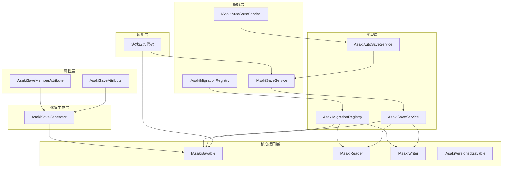
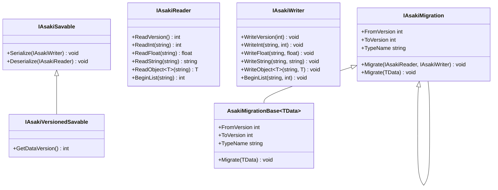
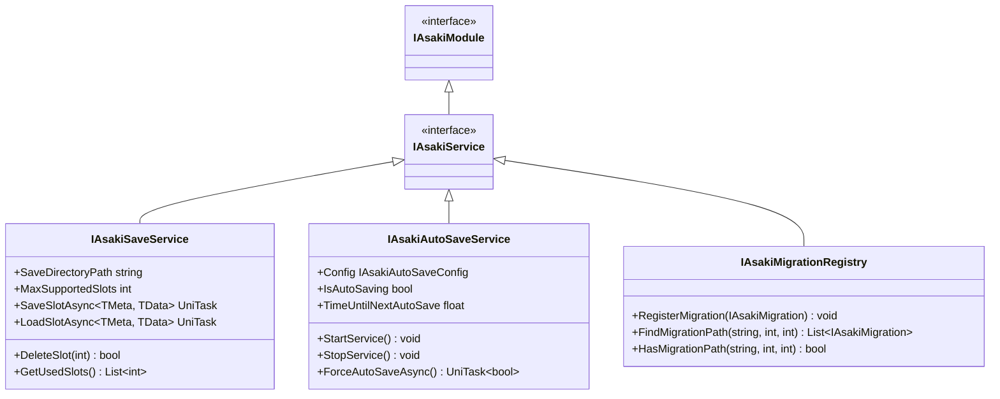
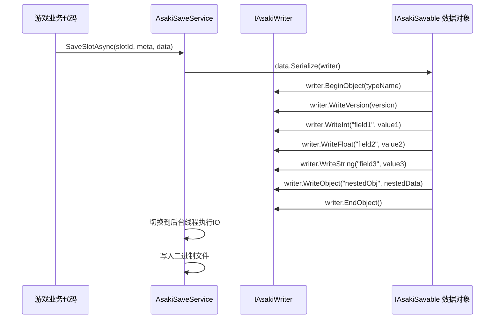
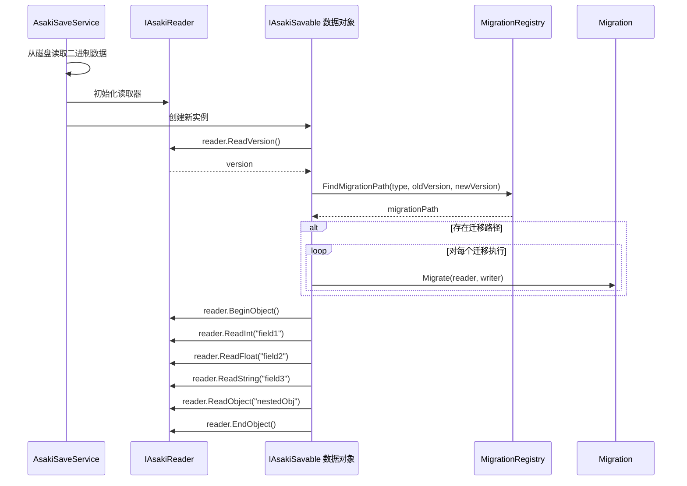
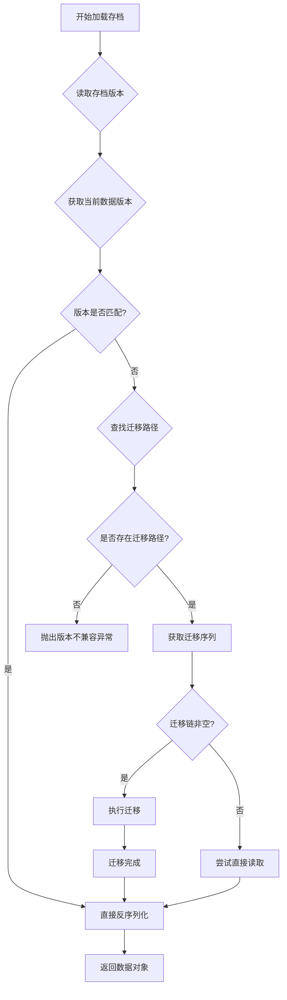

# Core/Serialization 模块架构文档

## 概述

Core/Serialization 模块是 Asaki Unity 框架的核心组成部分，提供了一套完整的游戏数据序列化与存档管理解决方案。该模块采用紧凑的二进制格式实现高效的数据持久化，支持版本控制和自动迁移，并集成了基于 Roslyn 编译器平台的源代码生成技术，显著简化了序列化代码的编写工作。

本模块的设计理念围绕三个核心目标展开：第一，提供类型安全且高性能的二进制序列化能力，确保游戏数据在不同版本之间保持兼容性；第二，构建灵活的 Slot-based 存档管理系统，支持多存档槽位、快速保存和加载操作；第三，通过自动化代码生成技术，消除手写序列化代码的重复性工作，同时保证序列化逻辑的正确性。

---

## 1. 设计理念

### 1.1 序列化系统的核心目标

游戏开发中的数据持久化面临诸多挑战，包括数据结构演进带来的兼容性问题、性能与存储空间的权衡、以及跨版本迁移的复杂性。Asaki 序列化系统的设计旨在系统性地解决这些问题。

传统的 Unity 序列化方案如 BinaryFormatter 存在安全风险且缺乏版本控制能力，而 Unity 自带的 Inspector 序列化虽然使用方便但无法处理复杂的数据结构且效率有限。JsonUtility 虽然解决了部分问题，但在处理循环引用和大量数据时表现不佳。针对这些痛点，Asaki 序列化系统采用了以下核心策略：

**紧凑二进制格式**：通过自定义的二进制序列化格式，实现高效的数据压缩。与文本格式相比，二进制格式在存储空间和读写性能上都具有显著优势，特别适合移动设备等资源受限的平台。写入器（IAsakiWriter）和读取器（IAsakiReader）接口的设计允许灵活替换底层实现，以适应不同的序列化格式需求。

**严格的类型安全**：所有需要序列化的类必须显式实现 IAsakiSavable 接口，这种设计确保了序列化过程的完全可控性。与隐式序列化不同，显式实现要求开发者明确指定哪些数据需要持久化，以及如何进行序列化和反序列化操作。这种方式虽然增加了初始开发工作量，但极大地提高了代码的可维护性和安全性。

**版本控制与迁移**：游戏上线后不可避免地需要更新数据结构。IAsakiVersionedSavable 接口和 Migration 系统的设计使得旧版本存档能够自动迁移到新版本，确保玩家的存档不会因游戏更新而丢失。

### 1.2 Slot-based 存档管理模型

游戏存档管理是用户体验的重要组成部分。一个设计良好的存档系统应当支持多个独立的存档槽位，允许玩家创建不同的游戏进度备份，同时提供便捷的存档信息展示和操作接口。

Asaki 框架采用了 Slot-based（槽位式）存档管理模型。每个槽位代表一个独立的游戏进度实例，包含以下核心组件：元数据（IAsakiSaveSlot）存储存档的附加信息，如存档名称、游玩时长、进度百分比、缩略图等；游戏数据（IAsakiSavable）存储实际的游戏状态，包括玩家属性、物品栏、场景状态等。

槽位模型的核心优势在于其清晰的数据隔离性。每个槽位的数据相互独立，删除或覆盖一个槽位不会影响其他槽位。同时，元数据与游戏数据的分离设计允许在不完全加载游戏数据的情况下快速获取存档列表信息，这对于实现存档选择界面至关重要。

### 1.3 版本迁移的重要性

游戏上线后的每一次内容更新都可能导致数据结构的变化。如果没有完善的版本迁移机制，旧版本玩家更新游戏后将无法继续使用他们的存档，这将严重影响玩家体验和游戏口碑。

Asaki Migration 系统采用了声明式的迁移注册机制，开发者可以通过实现 IAsakiMigration 接口定义从特定版本到另一个版本的迁移逻辑。系统会自动分析已注册的迁移，构建版本迁移图，并使用 BFS（广度优先搜索）算法找到从旧版本到新版本的最短迁移路径。

这种设计的优势在于：迁移逻辑与业务代码解耦，迁移可以在独立的模块中定义和维护；支持多版本的链式迁移，例如从版本 1 直接迁移到版本 5 会自动执行 1→2、2→3、3→4、4→5 的所有迁移步骤；迁移过程透明，开发者无需关心具体执行了多少个迁移步骤。

---

## 2. 软件架构

### 2.1 分层架构概览

Asaki Serialization 模块采用了清晰的分层架构设计，从底层到高层依次为：核心接口层定义了序列化操作的基本抽象，包括数据读写接口、版本控制接口和服务接口；属性与标记层提供了声明式的序列化配置能力，通过特性（Attribute）指定序列化和版本控制选项；服务实现层提供了具体的服务实现，包括核心保存服务、自动保存服务和迁移注册服务；代码生成层通过 Roslyn 编译器技术实现自动化的序列化代码生成。



### 2.2 核心类图与继承关系

序列化系统的核心接口定义了数据流动的抽象边界。以下是主要接口之间的类图关系：



服务层接口定义了存档管理的操作契约：



### 2.3 序列化流程

序列化流程涉及数据的写入和读取两个主要阶段。理解这两个阶段的流程对于正确实现 IAsakiSavable 接口至关重要。

**序列化阶段（Serialize）**：



**反序列化阶段（Deserialize）**：



### 2.4 版本迁移流程

版本迁移是 Asaki 序列化系统的重要组成部分。当加载的存档版本与当前代码的版本不一致时，系统会自动查找并执行相应的迁移逻辑。



迁移注册采用 BFS 算法查找最短路径。假设存在版本 1 到 5 的迁移定义：1→2、2→3、3→4、4→5 以及 1→5，当从版本 1 迁移到版本 5 时，系统会优先选择直接的 1→5 迁移而不是链式的 1→2→3→4→5。

---

## 3. Roslyn 代码生成器详解

### 3.1 AsakiSaveGenerator 工作原理

AsakiSaveGenerator 是 Asaki 框架的代码生成组件，基于 Roslyn 编译器平台构建。它能够在编译时自动分析标记了 [AsakiSave] 特性的类，并生成完整的 IAsakiSavable 接口实现代码。这种编译时代码生成方式相比运行时反射具有显著的性能优势。

代码生成器的工作流程分为以下几个阶段：

**候选者识别阶段**：在编译开始时，生成器会扫描项目中的所有类型声明，筛选出标记了 [AsakiSave] 或 [AsakiSaveAttribute] 特性的类或结构体。这一筛选过程通过检查类型的 Attribute 元数据实现。

**语义分析阶段**：对于每个候选类型，生成器使用 Roslyn 的语义模型（SemanticModel）获取类型的完整信息，包括命名空间、类型名称、成员列表、接口实现情况等。这一阶段还会判断类型是否实现了 IAsakiDataTable 接口，以便生成特殊的安全保护代码。

**成员提取阶段**：生成器扫描类型的所有成员（包括字段和属性），筛选出标记了 [AsakiSaveMember] 或 [AsakiSaveMemberAttribute] 特性的成员。这些成员将被包含在生成的序列化代码中。

**代码生成阶段**：根据提取的信息，生成器构建完整的 Serialize 和 Deserialize 方法代码，并添加版本控制、Config 安全保护、Clone 方法等辅助功能。

### 3.2 生成的代码结构

对于一个典型的可序列化类，生成的代码包含以下核心部分：

```csharp
// 生成的代码示例
[AsakiSave(Version = 1)]
public partial class PlayerData : IAsakiSavable, IAsakiVersionedSavable
{
    // Config 安全保护代码（仅对 IAsakiDataTable 实现类生成）
    private bool _allowConfigSerialization = false;

    public void AllowConfigSerialization(string permissionKey)
    {
        if (permissionKey == "ASAKI_SYS_KEY_9482_ACCESS")
        {
            _allowConfigSerialization = true;
        }
    }

    // 版本方法
    public int GetDataVersion() => 1;

    // 序列化方法
    public void Serialize(IAsakiWriter writer)
    {
        writer.BeginObject("PlayerData");
        writer.WriteInt("playerId", this.playerId);
        writer.WriteString("playerName", this.playerName);
        writer.WriteFloat("health", this.health);
        writer.WriteVector3("position", this.position);
        // ... 其他成员
        writer.EndObject();
    }

    // 反序列化方法
    public void Deserialize(IAsakiReader reader)
    {
        this.playerId = reader.ReadInt("playerId");
        this.playerName = reader.ReadString("playerName");
        this.health = reader.ReadFloat("health");
        this.position = reader.ReadVector3("position");
        // ... 其他成员
    }

    // Clone 方法
    public PlayerData Clone()
    {
        var target = new PlayerData();
        target.playerId = this.playerId;
        target.playerName = this.playerName;
        target.health = this.health;
        // ... 其他成员
        return target;
    }
}
```

### 3.3 字段排序逻辑

二进制序列化对字段顺序非常敏感。序列化时写入的顺序必须与反序列化时读取的顺序完全一致，否则将导致数据错位和解析错误。AsakiSaveGenerator 实现了智能的字段排序逻辑来解决这个问题。

排序规则如下：首先按照 [AsakiSaveMember] 特性的 Order 参数升序排序；Order 相同的情况下，按照成员名称的字母顺序排序；未标记 Order 的成员会被放在序列的末尾。

这种设计带来了极大的灵活性。开发者可以通过设置 Order 值来精确控制字段的序列化顺序，这对于需要与旧格式兼容的场景尤为重要。当新增字段时，只需将 Order 值设置为现有字段之后，即可确保新字段不会破坏旧格式的解析。

```csharp
[AsakiSave(Version = 2)]
public partial class PlayerData
{
    [AsakiSaveMember(order: 0)]
    public int playerId;

    [AsakiSaveMember(order: 1)]
    public string playerName;

    [AsakiSaveMember(order: 2)]
    public float health;

    // 新增字段，Order 为 3，确保不会影响旧版本的读取
    [AsakiSaveMember(order: 3)]
    public int maxHealth;
}
```

### 3.4 Config 类型的特殊处理

Asaki 框架的设计中，Config（配置）数据和 Save（存档）数据是两种不同的概念。Config 通常在游戏启动时从资源文件加载，是全局共享的数据；而 Save 数据是玩家独有的进度数据。将 Config 数据混入存档可能导致数据混乱和意外覆盖。

为了防止这种问题的发生，AsakiSaveGenerator 为实现了 IAsakiDataTable 接口的类型生成了特殊的保护代码：

```csharp
// Config 类型的序列化方法会包含安全检查
public void Serialize(IAsakiWriter writer)
{
    if (!_allowConfigSerialization)
    {
        throw new InvalidOperationException(
            "Security Violation: Configuration object 'PlayerConfig' cannot be serialized without explicit system permission.");
    }
    // ... 正常序列化逻辑
}
```

这种设计确保了即使开发者在代码中误将 Config 对象传递给保存服务，也会在运行时抛出明确的异常，而不是静默地保存错误的或不完整的数据。同时，系统提供了通过口令解锁序列化能力的安全机制：

```csharp
// 系统内部通过特定口令解锁 Config 序列化
configObject.AllowConfigSerialization("ASAKI_SYS_KEY_9482_ACCESS");
```

#### 安全机制详解

**设计原理**：

1. **数据隔离**：Config 数据是从资源文件（如 CSV、JSON、Excel 配置表）加载的静态数据，通常在整个游戏进程中保持不变。存档数据是玩家在游戏过程中产生的动态数据，需要持久化保存。

2. **防止误用**：如果允许 Config 对象被序列化到存档中，每次保存都会包含大量冗余的 Config 数据，浪费存储空间。更严重的是，这可能导致配置文件被意外覆盖，破坏游戏平衡。

3. **运行时保护**：通过生成的安全检查代码，即使开发者疏忽将 Config 对象传递给保存服务，也会在运行时捕获错误，而不是产生难以追踪的数据问题。

**系统密钥机制**：

框架内部使用特定的系统密钥（`ASAKI_SYS_KEY_9482_ACCESS`）来解锁 Config 序列化能力。这个密钥仅供框架内部使用，开发者不应手动调用。系统会在以下场景自动解锁：

- 导出 Config 数据到独立文件时
- Config 服务执行批量序列化操作时

**推荐做法**：

正确的做法是只序列化 Config 的 ID（整数值），而不是整个 Config 对象：

```csharp
[AsakiSave(Version = 1)]
public partial class PlayerData : IAsakiSavable
{
    // 存储 Config 的 ID，而不是 Config 对象本身
    [AsakiSaveMember(order: 0)]
    public int weaponConfigId;

    [AsakiSaveMember(order: 1)]
    public int skillConfigId;

    // 运行时引用（不参与序列化）
    private IAsakiDataTable _weaponConfig;
    private IAsakiDataTable _skillConfig;

    public void Deserialize(IAsakiReader reader)
    {
        weaponConfigId = reader.ReadInt("weaponConfigId");
        skillConfigId = reader.ReadInt("skillConfigId");
    }

    // 在反序列化后调用此方法解析引用
    public void ResolveConfigReferences(IAsakiConfigService configService)
    {
        _weaponConfig = configService.Get<IAsakiDataTable>(weaponConfigId);
        _skillConfig = configService.Get<IAsakiDataTable>(skillConfigId);
    }
}
```

通过这种方式，存档中只存储 Config 的 ID（通常是 4 字节的整数），而在运行时通过 Config 服务重新解析为实际的 Config 对象引用。

### 3.5 Clone 方法与引用解析

序列化过程中存在一个常见问题：当对象引用了 Config 对象时，直接序列化 Config 实例会导致存档中包含大量冗余的 Config 数据。Asaki 的解决方案是将 Config 引用序列化为 Config ID（整数值），然后在反序列化后通过 ID 重新解析引用。

AsakiSaveGenerator 自动生成的代码实现了这一逻辑：

**序列化阶段**：对于 Config 类型的字段，生成器会生成写入 Config.Id 而不是 Config 实例本身的代码；对于 Config 列表，生成器会遍历列表并写入每个 Config 的 Id。

**反序列化阶段**：首先读取 Config Id 到临时变量，然后通过 ResolveConfigReferences 方法调用 Config 服务根据 Id 重新获取 Config 实例。

**Clone 方法**：生成器还会自动创建深拷贝版本的 Clone 方法，用于创建存档数据的独立副本，防止后续修改影响原始存档。

---

## 4. API 参考

### 4.1 序列化属性

#### AsakiSaveAttribute

标记类或结构体需要自动生成 IAsakiSavable 实现。

```csharp
[AttributeUsage(AttributeTargets.Class | AttributeTargets.Struct, Inherited = false)]
public class AsakiSaveAttribute : Attribute
{
    // 版本号，用于版本控制和迁移
    public int Version { get; set; }

    public AsakiSaveAttribute(int version = 1);
}
```

使用示例：

```csharp
[AsakiSave(Version = 3)]
public partial class GameSaveData : IAsakiSavable, IAsakiVersionedSavable
{
    // 成员定义...
}
```

#### AsakiSaveMemberAttribute

标记字段或属性需要被序列化。

```csharp
[AttributeUsage(AttributeTargets.Field | AttributeTargets.Property, Inherited = true)]
public class AsakiSaveMemberAttribute : Attribute
{
    // 序列化时的键名（仅用于调试目的，二进制模式下无效）
    public string Key { get; set; }

    // 序列化顺序（数字越小越靠前）
    public int Order { get; set; }

    public AsakiSaveMemberAttribute(string key = null, int order = 0);
}
```

使用示例：

```csharp
[AsakiSave(Version = 1)]
public partial class PlayerData
{
    [AsakiSaveMember(order: 0)]
    public int playerId;

    [AsakiSaveMember(order: 1)]
    public string playerName;

    [AsakiSaveMember(order: 2)]
    public float health;
}
```

### 4.2 核心接口

#### IAsakiSavable

可序列化对象的核心接口。

```csharp
public interface IAsakiSavable
{
    /// <summary>
    /// 将对象序列化到写入器
    /// </summary>
    void Serialize(IAsakiWriter writer);

    /// <summary>
    /// 从读取器反序列化对象
    /// </summary>
    void Deserialize(IAsakiReader reader);
}
```

#### IAsakiVersionedSavable

扩展接口，为可序列化对象添加版本控制支持。

```csharp
public interface IAsakiVersionedSavable : IAsakiSavable
{
    /// <summary>
    /// 获取当前数据版本号
    /// </summary>
    int GetDataVersion();
}
```

#### IAsakiReader

定义从存档读取数据的接口。

| 方法 | 描述 |
|------|------|
| ReadVersion() | 读取版本号 |
| ReadByte(key) | 读取字节 |
| ReadInt(key) | 读取整数 |
| ReadLong(key) | 读取长整数 |
| ReadFloat(key) | 读取浮点数 |
| ReadDouble(key) | 读取双精度浮点数 |
| ReadString(key) | 读取字符串 |
| ReadBool(key) | 读取布尔值 |
| ReadUInt(key) | 读取无符号整数 |
| ReadULong(key) | 读取无符号长整数 |
| ReadVector2(key) | 读取 Vector2 |
| ReadVector3(key) | 读取 Vector3 |
| ReadVector4(key) | 读取 Vector4 |
| ReadVector2Int(key) | 读取 Vector2Int |
| ReadVector3Int(key) | 读取 Vector3Int |
| ReadQuaternion(key) | 读取 Quaternion |
| ReadBounds(key) | 读取 Bounds |
| ReadObject<T>(key) | 读取可序列化对象（泛型） |
| ReadObject(key) | 读取可序列化对象（非泛型） |
| BeginList(key) | 开始读取列表 |
| EndList() | 结束读取列表 |

#### IAsakiWriter

定义向存档写入数据的接口。

| 方法 | 描述 |
|------|------|
| WriteVersion(version) | 写入版本号 |
| WriteByte(key, value) | 写入字节 |
| WriteInt(key, value) | 写入整数 |
| WriteLong(key, value) | 写入长整数 |
| WriteFloat(key, value) | 写入浮点数 |
| WriteDouble(key, value) | 写入双精度浮点数 |
| WriteString(key, value) | 写入字符串 |
| WriteBool(key, value) | 写入布尔值 |
| WriteUInt(key, value) | 写入无符号整数 |
| WriteULong(key, value) | 写入无符号长整数 |
| WriteVector2(key, value) | 写入 Vector2 |
| WriteVector3(key, value) | 写入 Vector3 |
| WriteVector4(key, value) | 写入 Vector4 |
| WriteVector2Int(key, value) | 写入 Vector2Int |
| WriteVector3Int(key, value) | 写入 Vector3Int |
| WriteQuaternion(key, value) | 写入 Quaternion |
| WriteBounds(key, value) | 写入 Bounds |
| WriteObject<T>(key, value) | 写入可序列化对象（泛型） |
| WriteObject(key, value) | 写入可序列化对象（非泛型） |
| BeginList(key, count) | 开始写入列表 |
| EndList() | 结束写入列表 |
| BeginObject(key) | 开始写入对象 |
| EndObject() | 结束写入对象 |

### 4.3 服务接口

#### IAsakiSaveService

保存服务的核心接口。

```csharp
public interface IAsakiSaveService : IAsakiModule
{
    // 存档目录路径
    string SaveDirectoryPath { get; }

    // 最大支持的槽位数
    int MaxSupportedSlots { get; }

    // 异步保存数据到槽位
    UniTask SaveSlotAsync<TMeta, TData>(
        int slotId,
        TMeta meta,
        TData data,
        CancellationToken cancellationToken = default
    ) where TMeta : IAsakiSlotMeta where TData : IAsakiSavable;

    // 异步保存数据到槽位并返回详细结果
    UniTask<AsakiSaveResult> SaveSlotWithResultAsync<TMeta, TData>(
        int slotId,
        TMeta meta,
        TData data,
        CancellationToken cancellationToken = default
    ) where TMeta : IAsakiSlotMeta where TData : IAsakiSavable;

    // 异步加载槽位数据
    UniTask<(TMeta Meta, TData Data)> LoadSlotAsync<TMeta, TData>(
        int slotId,
        CancellationToken cancellationToken = default
    ) where TMeta : IAsakiSlotMeta, new() where TData : IAsakiSavable, new();

    // 异步加载槽位数据并返回详细结果
    UniTask<AsakiLoadResult<TMeta, TData>> LoadSlotWithResultAsync<TMeta, TData>(
        int slotId,
        CancellationToken cancellationToken = default
    ) where TMeta : IAsakiSlotMeta, new() where TData : IAsakiSavable, new();

    // 尝试加载槽位（不存在返回 null）
    UniTask<(TMeta Meta, TData Data)?> TryLoadSlotAsync<TMeta, TData>(
        int slotId,
        CancellationToken cancellationToken = default
    );

    // 删除槽位
    bool DeleteSlot(int slotId);

    // 批量删除多个槽位
    int DeleteSlots(IEnumerable<int> slotIds);

    // 获取所有已使用的槽位 ID
    List<int> GetUsedSlots();

    // 获取所有槽位信息
    IReadOnlyList<AsakiSaveSlotInfo> GetAllSlotInfos();

    // 检查槽位是否存在
    bool SlotExists(int slotId);

    // 获取槽位文件大小（字节）
    long GetSlotFileSize(int slotId);

    // 获取槽位最后修改时间（Unix时间戳）
    long GetSlotLastModifiedTime(int slotId);

    // 复制槽位
    UniTask<bool> CopySlotAsync(int sourceSlotId, int targetSlotId, CancellationToken cancellationToken = default);

    // 导出槽位到文件
    UniTask<bool> ExportSlotAsync(int slotId, string exportPath, CancellationToken cancellationToken = default);

    // 从文件导入槽位
    UniTask<bool> ImportSlotAsync(string importPath, int targetSlotId, CancellationToken cancellationToken = default);

    // 获取槽位目录路径
    string GetSlotDirectory(int slotId);

    // 获取槽位数据文件路径
    string GetSlotDataPath(int slotId);

    // 获取槽位元数据文件路径
    string GetSlotMetaPath(int slotId);
}
```

#### IAsakiAutoSaveService

自动保存服务接口。

```csharp
public interface IAsakiAutoSaveService : IAsakiModule
{
    // 当前配置
    IAsakiAutoSaveConfig Config { get; }

    // 是否正在自动保存
    bool IsAutoSaving { get; }

    // 距离下次自动保存的时间（秒）
    float TimeUntilNextAutoSave { get; }

    // 上次自动保存的时间戳（Unix时间戳）
    long LastAutoSaveTime { get; }

    // 自动保存计数（当前会话）
    int AutoSaveCount { get; }

    // 事件：配置变更
    event Action<IAsakiAutoSaveConfig> OnConfigChanged;

    // 事件：自动保存开始
    event Action<AsakiAutoSaveEventArgs> OnAutoSaveBegin;

    // 事件：自动保存完成
    event Action<AsakiAutoSaveEventArgs> OnAutoSaveComplete;

    // 事件：自动保存倒计时开始
    event Action<float> OnCountdownBegin;

    // 事件：自动保存倒计时更新
    event Action<float> OnCountdownUpdate;

    // 事件：自动保存倒计时取消
    event Action OnCountdownCancelled;

    // 设置配置
    void SetConfig(IAsakiAutoSaveConfig config);

    // 注册数据提供者
    void RegisterDataProvider<TData>(Func<TData> provider) where TData : IAsakiSavable;

    // 启动/停止服务
    void StartService();
    void StopService();

    // 暂停自动保存
    void Pause();

    // 恢复自动保存
    void Resume();

    // 强制执行自动保存
    UniTask<bool> ForceAutoSaveAsync(
        AsakiAutoSaveTrigger trigger = AsakiAutoSaveTrigger.Manual,
        CancellationToken token = default
    );

    // 触发检查点保存
    UniTask<bool> TriggerCheckpointSaveAsync(string checkpointName = null, CancellationToken token = default);

    // 触发场景切换保存
    UniTask<bool> TriggerSceneSaveAsync(string sceneName, bool isEnter, CancellationToken token = default);

    // 取消当前倒计时
    void CancelCountdown();

    // 重置计时器
    void ResetTimer();

    // 检查是否可以自动保存
    bool CanAutoSave();

    // 获取下次自动保存的预估时间
    DateTime? GetNextAutoSaveTime();
}
```

自动保存触发类型（AsakiAutoSaveTrigger）：

| 枚举值 | 描述 |
|--------|------|
| None | 禁用 |
| TimeInterval | 按时间间隔触发 |
| Checkpoint | 检查点触发 |
| SceneChange | 场景切换触发 |
| ApplicationPause | 应用进入后台触发 |
| Manual | 手动触发 |
| All | 所有触发条件 |

### 4.4 Migration 接口

#### IAsakiMigration

数据迁移接口。

```csharp
public interface IAsakiMigration
{
    // 源版本号
    int FromVersion { get; }

    // 目标版本号
    int ToVersion { get; }

    // 数据类型名称
    string TypeName { get; }

    // 执行迁移
    void Migrate(IAsakiReader reader, IAsakiWriter writer);
}
```

#### IAsakiMigration<TData>

强类型数据迁移接口。

```csharp
public interface IAsakiMigration<TData> : IAsakiMigration
    where TData : IAsakiSavable
{
    // 执行强类型迁移
    void Migrate(TData data);
}
```

#### AsakiMigrationBase<TData>

迁移基类，简化强类型迁移的实现。

```csharp
public abstract class AsakiMigrationBase<TData> : IAsakiMigration<TData>
    where TData : IAsakiSavable, new()
{
    // 源版本号
    public abstract int FromVersion { get; }

    // 目标版本号
    public abstract int ToVersion { get; }

    // 数据类型名称
    public virtual string TypeName => typeof(TData).FullName;

    // 执行强类型迁移
    public abstract void Migrate(TData data);
}
```

#### IAsakiMigrationRegistry

迁移注册表接口。

```csharp
public interface IAsakiMigrationRegistry : IAsakiService
{
    // 注册迁移
    void RegisterMigration(IAsakiMigration migration);

    // 查找迁移路径
    List<IAsakiMigration> FindMigrationPath(
        string typeName,
        int fromVersion,
        int toVersion
    );

    // 检查是否存在迁移路径
    bool HasMigrationPath(string typeName, int fromVersion, int toVersion);

    // 获取指定类型的所有迁移
    List<IAsakiMigration> GetMigrations(string typeName);
}
```

### 4.5 存档槽位接口

#### IAsakiSlotMeta

存档元数据基础接口。

```csharp
public interface IAsakiSlotMeta : IAsakiSavable
{
    /// <summary>槽位ID</summary>
    int SlotId { get; set; }

    /// <summary>最后保存时间（Unix时间戳，秒）</summary>
    long LastSaveTime { get; set; }

    /// <summary>存档名称</summary>
    string SaveName { get; set; }
}
```

#### IAsakiSaveSlot

存档槽位详细信息接口，扩展自 IAsakiSlotMeta。

```csharp
public interface IAsakiSaveSlot : IAsakiSlotMeta
{
    /// <summary>槽位状态</summary>
    AsakiSaveSlotStatus Status { get; }

    /// <summary>游戏总时长（秒）</summary>
    long PlayTimeSeconds { get; set; }

    /// <summary>游戏进度百分比（0-100）</summary>
    float ProgressPercent { get; set; }

    /// <summary>当前关卡/章节名称</summary>
    string CurrentLevel { get; set; }

    /// <summary>玩家等级</summary>
    int PlayerLevel { get; set; }

    /// <summary>玩家显示名称</summary>
    string PlayerName { get; set; }

    /// <summary>存档缩略图数据</summary>
    byte[] ThumbnailData { get; set; }

    /// <summary>游戏版本号</summary>
    string GameVersion { get; set; }

    /// <summary>云同步ID</summary>
    string CloudSyncId { get; set; }

    /// <summary>最后修改时间（Unix时间戳）</summary>
    long LastModifyTime { get; set; }

    /// <summary>文件大小（字节）</summary>
    long FileSize { get; }

    /// <summary>自定义标签</summary>
    string[] Tags { get; set; }

    /// <summary>存档描述/备注</summary>
    string Description { get; set; }

    /// <summary>槽位是否为空</summary>
    bool IsEmpty { get; }

    /// <summary>槽位是否有效</summary>
    bool IsValid { get; }

    /// <summary>获取格式化后的游戏时长</summary>
    string GetFormattedPlayTime();

    /// <summary>获取格式化后的保存时间</summary>
    string GetFormattedSaveTime();
}
```

#### AsakiSaveSlotStatus

槽位状态枚举。

| 枚举值 | 描述 |
|--------|------|
| Empty | 空槽位（未使用） |
| Occupied | 槽位已被占用 |
| Corrupted | 槽位数据已损坏 |
| Locked | 槽位被锁定（无法覆盖） |

### 4.6 操作结果结构体

#### AsakiSaveResult

保存操作结果结构体。

```csharp
public struct AsakiSaveResult
{
    /// <summary>是否成功</summary>
    public bool Success;

    /// <summary>错误信息（如果失败）</summary>
    public string ErrorMessage;

    /// <summary>保存的槽位ID</summary>
    public int SlotId;

    /// <summary>文件大小（字节）</summary>
    public long FileSize;

    /// <summary>保存耗时（毫秒）</summary>
    public long ElapsedMilliseconds;

    /// <summary>创建成功结果</summary>
    public static AsakiSaveResult Successful(int slotId, long fileSize = 0, long elapsedMs = 0);

    /// <summary>创建失败结果</summary>
    public static AsakiSaveResult Failed(string errorMessage, int slotId = -1);
}
```

#### AsakiLoadResult<TMeta, TData>

加载操作结果结构体。

```csharp
public struct AsakiLoadResult<TMeta, TData>
    where TMeta : IAsakiSlotMeta, new()
    where TData : IAsakiSavable, new()
{
    /// <summary>是否成功</summary>
    public bool Success;

    /// <summary>错误信息（如果失败）</summary>
    public string ErrorMessage;

    /// <summary>加载的元数据</summary>
    public TMeta Meta;

    /// <summary>加载的数据</summary>
    public TData Data;

    /// <summary>加载耗时（毫秒）</summary>
    public long ElapsedMilliseconds;

    /// <summary>创建成功结果</summary>
    public static AsakiLoadResult<TMeta, TData> Successful(TMeta meta, TData data, long elapsedMs = 0);

    /// <summary>创建失败结果</summary>
    public static AsakiLoadResult<TMeta, TData> Failed(string errorMessage);
}
```

#### AsakiSaveSlotInfo

存档槽位简要信息结构体。

```csharp
public struct AsakiSaveSlotInfo
{
    /// <summary>槽位ID</summary>
    public int SlotId;

    /// <summary>是否存在有效存档</summary>
    public bool Exists;

    /// <summary>最后保存时间（Unix时间戳）</summary>
    public long LastSaveTime;

    /// <summary>文件大小（字节）</summary>
    public long FileSize;

    /// <summary>存档名称</summary>
    public string SaveName;
}
```

### 4.7 事件类型

#### AsakiAutoSaveEventArgs

自动保存事件参数。

```csharp
public struct AsakiAutoSaveEventArgs
{
    /// <summary>触发的槽位信息</summary>
    public IAsakiSaveSlot Slot { get; set; }

    /// <summary>触发原因</summary>
    public AsakiAutoSaveTrigger Trigger { get; set; }

    /// <summary>是否成功</summary>
    public bool Success { get; set; }

    /// <summary>错误信息（如果失败）</summary>
    public string ErrorMessage { get; set; }

    /// <summary>保存耗时（毫秒）</summary>
    public long ElapsedMilliseconds { get; set; }
}
```

---

## 5. 好的示例

### 5.1 基础序列化类示例

以下示例展示了如何使用 Asaki 序列化属性定义一个完整的游戏存档数据结构：

```csharp
using Asaki.Core.Attributes;
using Asaki.Core.Serialization;
using UnityEngine;

namespace MyGame.SaveData
{
    /// <summary>
    /// 玩家存档数据
    /// </summary>
    [AsakiSave(Version = 2)]
    public partial class PlayerSaveData : IAsakiSavable, IAsakiVersionedSavable
    {
        // 按 Order 排序的序列化成员
        [AsakiSaveMember(order: 0)]
        public int playerId;

        [AsakiSaveMember(order: 1)]
        public string playerName;

        [AsakiSaveMember(order: 2)]
        public Vector3 position;

        [AsakiSaveMember(order: 3)]
        public Quaternion rotation;

        [AsakiSaveMember(order: 4)]
        public float health;

        [AsakiSaveMember(order: 5)]
        public float maxHealth;

        [AsakiSaveMember(order: 6)]
        public int level;

        [AsakiSaveMember(order: 7)]
        public long experience;

        [AsakiSaveMember(order: 8)]
        public int gold;

        [AsakiSaveMember(order: 9)]
        public List<ItemData> inventory;

        [AsakiSaveMember(order: 10)]
        public List<string> completedQuests;

        [AsakiSaveMember(order: 11)]
        public Dictionary<string, int> questProgress;

        // 不会序列化的运行时数据（未标记特性）
        [System.NonSerialized]
        public GameObject runtimeObject; // 仅运行时使用
    }

    /// <summary>
    /// 物品数据
    /// </summary>
    [AsakiSave(Version = 1)]
    public partial class ItemData : IAsakiSavable
    {
        [AsakiSaveMember(order: 0)]
        public int itemId;

        [AsakiSaveMember(order: 1)]
        public string itemName;

        [AsakiSaveMember(order: 2)]
        public int quantity;

        [AsakiSaveMember(order: 3)]
        public int slotIndex;
    }
}
```

### 5.2 使用 Roslyn 代码生成

要使用自动代码生成，只需在类声明中添加 partial 关键字和 [AsakiSave] 特性。代码生成器会在编译时自动生成所需的接口实现：

```csharp
using Asaki.Core.Attributes;

// 关键：必须使用 partial 关键字
[AsakiSave(Version = 1)]
public partial class GameLevelData : IAsakiSavable
{
    [AsakiSaveMember(order: 0)]
    public int levelId;

    [AsakiSaveMember(order: 1)]
    public string levelName;

    [AsakiSaveMember(order: 2)]
    public bool isUnlocked;

    [AsakiSaveMember(order: 3)]
    public int bestScore;

    [AsakiSaveMember(order: 4)]
    public float bestTime;

    [AsakiSaveMember(order: 5)]
    public int starCount;
}
```

编译后，生成器会自动创建 `GameLevelData_AsakiSave.g.cs` 文件，包含完整的 Serialize 和 Deserialize 方法实现。

### 5.3 版本迁移示例

当游戏数据结构需要变更时，使用 Migration 系统保持向后兼容：

```csharp
using Asaki.Core.Serialization;
using Asaki.Core.Serialization.Migration;

// 版本 1 到版本 2 的迁移：添加了新字段 maxHealth
public class PlayerSaveDataMigrationV1ToV2
    : AsakiMigrationBase<PlayerSaveData>
{
    public override int FromVersion => 1;
    public override int ToVersion => 2;

    public override void Migrate(PlayerSaveData data)
    {
        // 版本 2 新增了 maxHealth 字段
        // 如果旧数据没有这个字段，给予默认值
        if (data.maxHealth <= 0)
        {
            data.maxHealth = 100f; // 默认值
        }
    }
}

// 注册迁移的方式取决于具体框架实现
// 方式1: 通过模块初始化（如果使用Asaki模块系统）
public class MyGameModule : IAsakiModule
{
    public void OnInit()
    {
        var registry = AsakiContext.Get<IAsakiMigrationRegistry>();
        registry.RegisterMigration(new PlayerSaveDataMigrationV1ToV2());
    }
}

// 方式2: 通过静态注册方法（简化使用）
public static class MigrationBootstrapper
{
    public static void RegisterAllMigrations(IAsakiMigrationRegistry registry)
    {
        registry.RegisterMigration(new PlayerSaveDataMigrationV1ToV2());
    }
}
```

### 5.4 完整的使用流程

以下示例展示了从创建存档数据到保存和加载的完整流程：

```csharp
using Asaki.Core.Serialization;
using Cysharp.Threading.Tasks;
using UnityEngine;

public class GameManager : MonoBehaviour
{
    private IAsakiSaveService _saveService;

    private void Start()
    {
        // 通过依赖注入获取服务
        _saveService = AsakiContext.Get<IAsakiSaveService>();
    }

    // 保存游戏
    public async UniTask SaveGameAsync(int slotId)
    {
        var meta = new AsakiSaveSlot
        {
            SlotId = slotId,
            SaveName = $"存档 {slotId}",
            PlayTimeSeconds = (long)Time.realtimeSinceStartup,
            ProgressPercent = CalculateProgress(),
            PlayerLevel = 10,
            PlayerName = "Hero",
            GameVersion = Application.version
        };

        var data = new PlayerSaveData
        {
            playerId = 1,
            playerName = "Hero",
            position = transform.position,
            rotation = transform.rotation,
            health = 80f,
            maxHealth = 100f,
            level = 10,
            experience = 5000,
            gold = 1000
        };

        await _saveService.SaveSlotAsync(slotId, meta, data);
        Debug.Log($"游戏已保存到槽位 {slotId}");
    }

    // 加载游戏
    public async UniTask<bool> LoadGameAsync(int slotId)
    {
        var result = await _saveService.LoadSlotWithResultAsync<AsakiSaveSlot, PlayerSaveData>(slotId);

        if (!result.Success)
        {
            Debug.LogError($"加载失败: {result.ErrorMessage}");
            return false;
        }

        var meta = result.Meta;
        var data = result.Data;

        Debug.Log($"加载存档: {meta.SaveName}");
        Debug.Log($"玩家等级: {data.level}");

        // 恢复游戏状态
        transform.position = data.position;
        transform.rotation = data.rotation;

        return true;
    }

    private float CalculateProgress()
    {
        // 计算游戏进度百分比
        return 50f;
    }
}
```

---

## 6. 坏的示例

### 6.1 字段顺序不匹配

这是最常见的序列化错误。序列化时的字段写入顺序必须与反序列化时的读取顺序完全一致：

```csharp
// 错误示例：字段顺序不一致
[AsakiSave(Version = 1)]
public partial class BadExample : IAsakiSavable
{
    [AsakiSaveMember(order: 0)]
    public int id;

    [AsakiSaveMember(order: 1)]
    public string name;

    // 错误的 Serialize 实现：先写 name 再写 id
    public void Serialize(IAsakiWriter writer)
    {
        writer.WriteString("name", name);  // 错误：顺序错了
        writer.WriteInt("id", id);
    }

    // 正确的 Deserialize 实现：先读 id 再读 name
    public void Deserialize(IAsakiReader reader)
    {
        id = reader.ReadInt("id");
        name = reader.ReadString("name");
    }
}
```

**后果**：保存时写入的顺序是 name→id，但读取时期望的顺序是 id→name。这会导致数据完全错位，id 会读到 name 的值，name 会读到无效数据。

**正确做法**：使用 Roslyn 代码生成器自动处理序列化逻辑，或者确保手写的 Serialize 和 Deserialize 方法使用完全一致的顺序。

### 6.2 缺少版本号处理

版本控制是保持存档兼容性的关键。忽略版本号会导致无法进行数据迁移：

```csharp
// 错误示例：未实现版本控制
[AsakiSave(Version = 2)]
public partial class NoVersion : IAsakiSavable, IAsakiVersionedSavable
{
    [AsakiSaveMember(order: 0)]
    public int fieldA;

    [AsakiSaveMember(order: 1)]
    public int fieldB;

    // 错误：没有写入版本号
    public void Serialize(IAsakiWriter writer)
    {
        writer.WriteInt("fieldA", fieldA);
        writer.WriteInt("fieldB", fieldB);
    }

    // 错误：没有读取版本号
    public void Deserialize(IAsakiReader reader)
    {
        fieldA = reader.ReadInt("fieldA");
        fieldB = reader.ReadInt("fieldB");
    }

    // 错误：GetDataVersion 未实现或返回错误值
    public int GetDataVersion() => 1; // 应该是 2
}
```

**后果**：当数据结构从版本 1 升级到版本 2 时，加载旧存档不知道数据的原始版本，无法执行正确的迁移逻辑。

**正确做法**：始终在 Serialize 方法开头调用 WriteVersion，在 Deserialize 方法开头调用 ReadVersion，并正确实现 GetDataVersion 方法返回当前版本号。

### 6.3 Config 类型错误使用

尝试将 Config 对象直接序列化到存档中是常见的安全问题：

```csharp
using Asaki.Core.Configuration;

// 错误示例：将 Config 类型用于存档
[AsakiSave(Version = 1)]
public partial class GameData : IAsakiSavable
{
    [AsakiSaveMember(order: 0)]
    public SomeConfigType settings; // 这是一个 Config 类型

    // 错误示例：直接序列化 Config 对象
    public void Serialize(IAsakiWriter writer)
    {
        writer.WriteObject("settings", settings); // 会抛出异常！
    }
}

// 正确做法：只序列化 Config ID
[AsakiSave(Version = 1)]
public partial class GameData : IAsakiSavable
{
    [AsakiSaveMember(order: 0)]
    public int settingsId; // 存储 Config 的 ID

    private SomeConfigType _settings;

    public void Serialize(IAsakiWriter writer)
    {
        writer.WriteInt("settingsId", settingsId);
    }

    public void Deserialize(IAsakiReader reader)
    {
        settingsId = reader.ReadInt("settingsId");
        // 之后通过 Config 服务解析
    }

    public void ResolveConfigReferences(IAsakiConfigService configService)
    {
        _settings = configService.Get<SomeConfigType>(settingsId);
    }
}
```

**后果**：尝试序列化 Config 对象会触发安全异常，因为 Config 设计为只读共享数据，不应混入玩家存档。

**正确做法**：只序列化 Config 的 ID（整数值），然后在反序列化后通过 Config 服务重新解析引用。

### 6.4 手动实现而非使用代码生成

手动编写序列化代码容易出错且难以维护：

```csharp
// 错误示例：手动实现而不是使用代码生成
[AsakiSave(Version = 1)]
public class ManualSerialization : IAsakiSavable
{
    public int id;
    public string name;
    public float health;
    public Vector3 position;
    public List<Item> items;

    // 错误：手动实现容易出错
    public void Serialize(IAsakiWriter writer)
    {
        writer.BeginObject("ManualSerialization");
        writer.WriteVersion(1);

        // 容易漏掉字段或顺序错误
        writer.WriteInt("id", id);
        writer.WriteString("name", name);
        writer.WriteFloat("health", health);

        // Vector3 需要手动展开
        writer.WriteFloat("posX", position.x);
        writer.WriteFloat("posY", position.y);
        writer.WriteFloat("posZ", position.z);

        // List 需要手动遍历
        writer.BeginList("items", items != null ? items.Count : 0);
        if (items != null)
        {
            foreach (var item in items)
            {
                writer.WriteObject("item", item);
            }
        }
        writer.EndList();

        writer.EndObject();
    }

    public void Deserialize(IAsakiReader reader)
    {
        int version = reader.ReadVersion();
        id = reader.ReadInt("id");
        name = reader.ReadString("name");
        health = reader.ReadFloat("health");

        position = new Vector3(
            reader.ReadFloat("posX"),
            reader.ReadFloat("posY"),
            reader.ReadFloat("posZ")
        );

        int count = reader.BeginList("items");
        items = new List<Item>(count);
        for (int i = 0; i < count; i++)
        {
            items.Add(reader.ReadObject<Item>("item"));
        }
        reader.EndList();
    }
}

// 正确做法：使用 partial 类和代码生成
[AsakiSave(Version = 1)]
public partial class AutoGeneratedSerialization : IAsakiSavable
{
    public int id;
    public string name;
    public float health;
    public Vector3 position;
    public List<Item> items;

    // Serialize 和 Deserialize 由生成器自动生成
}
```

**后果**：手动实现需要处理大量样板代码，容易遗漏字段、出现顺序错误或边界情况处理不当。每次数据结构变更都需要手动更新序列化代码。

**正确做法**：使用 AsakiSaveGenerator 自动生成序列化代码，确保正确性和一致性。

---

## 7. 总结

Core/Serialization 模块为 Asaki Unity 框架提供了强大而灵活的数据持久化能力。其核心优势包括：

**高效性**：紧凑的二进制格式确保了最小的存储空间占用和最快的读写速度。针对 Unity 常用类型（Vector3、Quaternion 等）的特殊优化进一步提升了性能。

**安全性**：严格的类型安全机制和 Config 保护设计防止了常见的数据序列化错误。口令验证机制确保了配置数据不会被意外序列化。

**可维护性**：基于 Roslyn 的代码生成技术消除了手写序列化代码的负担，开发者可以专注于业务逻辑而非样板代码。自动生成的代码经过优化，确保了正确性和性能。

**兼容性**：完善的版本控制和迁移系统确保了游戏更新后玩家存档的可用性。BFS 路径查找算法保证了迁移过程的最优性。

通过遵循本文档提供的设计模式和最佳实践，开发者可以充分利用 Asaki 序列化系统的能力，构建可靠、高效且易于维护的游戏存档系统。
