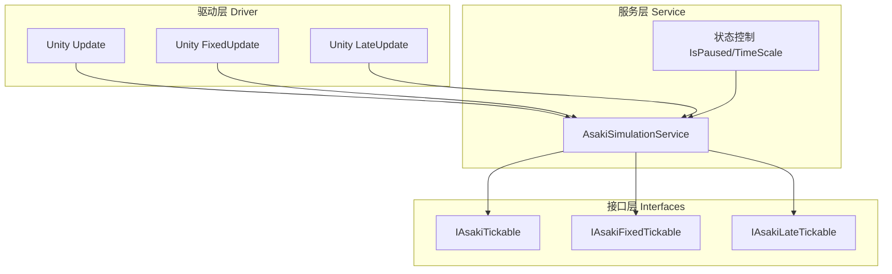
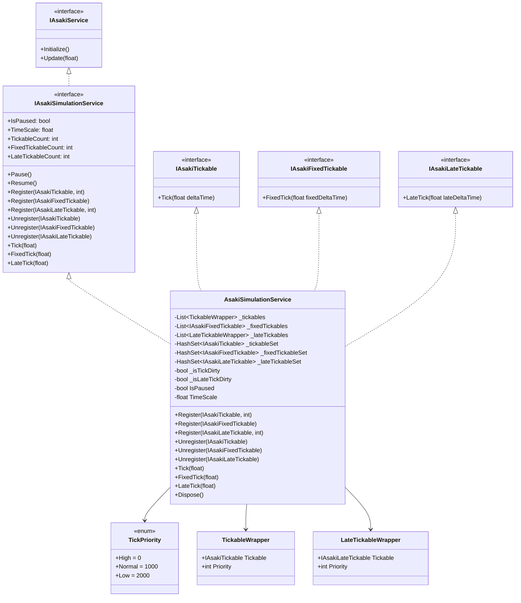
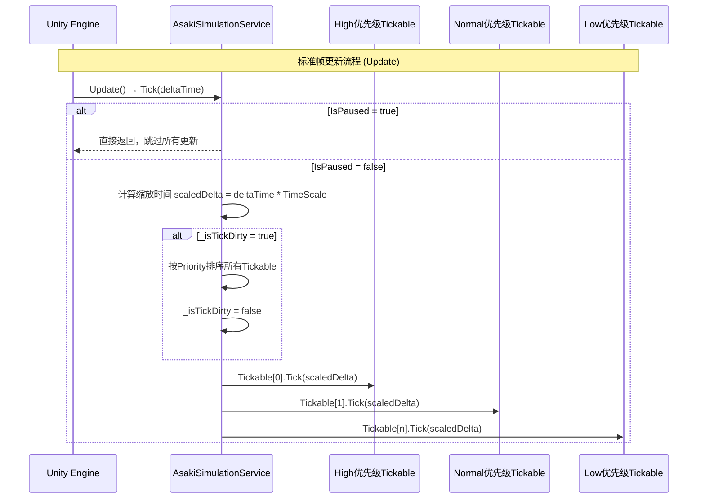

# Asaki Core/Simulation 模块架构文档

## 目录

1. [设计理念](#1-设计理念)
2. [软件架构](#2-软件架构)
3. [API参考](#3-api参考)
4. [好的示例](#4-好的示例)
5. [坏的示例](#5-坏的示例)

---

## 1. 设计理念

### 1.1 为什么需要统一的仿真时间管理

在Unity游戏开发中，Update、FixedUpdate和LateUpdate是三类核心的帧更新回调：

- **Update**：标准帧更新，用于大多数游戏逻辑、AI、动画等
- **FixedUpdate**：固定时间间隔更新，用于物理模拟
- **LateUpdate**：延迟帧更新，用于摄像机跟随、特效同步等

直接使用Unity原生回调存在以下问题：

1. **执行顺序不可控**：无法精确控制不同模块之间的执行顺序
2. **全局状态管理困难**：暂停、物理速率、时间缩放等需要全局协调
3. **依赖耦合混乱**：各系统直接引用Time类，难以模拟测试
4. **性能优化受限**：无法批量处理或跳过某些更新

Asaki Simulation模块提供了企业级的仿真时间管理解决方案，通过统一的接口抽象和优先级系统，实现精细化的帧更新控制。

### 1.2 优先级系统的设计动机

不同游戏系统对更新时机的要求各不相同：

- **输入系统**需要在所有逻辑之前处理，以确保响应及时
- **AI和状态机**需要在输入之后、渲染之前完成决策
- **UI系统**需要在所有逻辑完成后更新，避免画面闪烁
- **音频系统**需要与视觉同步，通常在LateUpdate处理

Asaki Simulation采用**数值越小优先级越高**的设计：

```csharp
public enum TickPriority
{
    High = 0,      // Input, Sensors - 最先执行
    Normal = 1000, // Game Logic, FSM - 常规逻辑
    Low = 2000,    // UI, Audio, View Sync - 最后执行
}
```

这种方式确保：
- 高优先级系统永远不会因为低优先级系统阻塞而延迟执行
- 同一优先级的系统按注册顺序执行
- 支持运行时动态调整优先级（通过重新注册）

### 1.3 时间缩放与暂停机制

游戏中的时间控制是常见需求：

- **子弹时间**：减慢时间流逝，让玩家做出反应
- **游戏暂停**：完全停止时间流逝
- **慢动作回放**：逐帧回放关键瞬间

Asaki Simulation通过两个核心属性实现：

- **IsPaused**：完全暂停所有更新，包括Tick、FixedTick、LateTick
- **TimeScale**：时间缩放因子，1.0为正常速度，0.5为半速，0为静止

设计特点：
- 缩放后的deltaTime会在驱动时自动计算，无需各系统处理
- 物理更新使用fixedDeltaTime进行缩放，保持物理一致性
- 暂停时跳过所有更新，但保持注册状态

### 1.4 脏标记与排序优化

每次注册/注销都重新排序会导致O(n log n)的性能开销。Asaki Simulation采用**脏标记（Dirty Flag）模式**：

```csharp
private bool _isTickDirty = false;

// 注册时标记脏
public void Register(IAsakiTickable tickable, int priority)
{
    _tickables.Add(new TickableWrapper { Tickable = tickable, Priority = priority });
    _isTickDirty = true;
}

// 驱动时仅在脏时排序
public void Tick(float deltaTime)
{
    if (_isTickDirty)
    {
        _tickables.Sort((a, b) => a.Priority.CompareTo(b.Priority));
        _isTickDirty = false;
    }
    // ... 执行更新
}
```

这种设计确保：
- 注册/注销操作是O(1)或O(n)线性遍历
- 排序只在必要时执行，通常每帧一次
- 大幅降低频繁注册/注销场景的性能开销

---

## 2. 软件架构

### 2.1 模块架构概览

Asaki Simulation模块采用清晰的三层架构设计：



### 2.2 核心类图



### 2.3 更新流程图



### 2.4 数据结构设计

```mermaid
graph TB
    subgraph "Tickables存储"
        HS1[HashSet~IAsakiTickable~]
        L1[List~TickableWrapper~]
    end
    
    subgraph "FixedTickables存储"
        HS2[HashSet~IAsakiFixedTickable~]
        L2[List~IAsakiFixedTickable~]
    end
    
    subgraph "LateTickables存储"
        HS3[HashSet~IAsakiLateTickable~]
        L3[List~LateTickableWrapper~]
    end

    HS1 -.->|"O(1) 重复检测"| L1
    HS2 -.->|"O(1) 重复检测"| L2
    HS3 -.->|"O(1) 重复检测"| L3

    style HS1 fill:#e1f5fe
    style L1 fill:#e8f5e8
    style HS2 fill:#e1f5fe
    style L2 fill:#e8f5e8
    style HS3 fill:#e1f5fe
    style L3 fill:#e8f5e8
```



Asaki Simulation使用双重数据结构：

- **HashSet**：用于O(1)快速检测重复注册
- **List**：用于存储实际执行顺序，支持优先级排序

这种设计确保：
- 重复注册不会导致重复执行
- 查找和删除操作高效
- 支持优先级的动态调整

### 2.5 线程安全说明

Asaki Simulation的设计假设在Unity主线程中运行，因此：

| 操作 | 线程安全性 | 说明 |
|------|-----------|------|
| Register | 不安全 | 应在主线程调用 |
| Unregister | 不安全 | 应在主线程调用 |
| Tick/FixedTick/LateTick | 不安全 | Unity主线程驱动 |
| IsPaused/TimeScale | 不安全 | 建议在主线程修改 |

如需跨线程操作，请使用Unity的Main Thread Dispatcher或类似机制。

---

## 3. API参考

### 3.1 IAsakiSimulationService 接口

仿真时间管理服务的核心接口，提供统一的帧更新生命周期管理。

#### 状态控制属性

| 属性 | 类型 | 描述 |
|------|------|------|
| `IsPaused` | `bool` | 暂停状态，true时暂停所有更新 |
| `TimeScale` | `float` | 时间缩放因子，1.0为正常速度，0为静止 |

#### 统计信息属性

| 属性 | 类型 | 描述 |
|------|------|------|
| `TickableCount` | `int` | 已注册的标准帧更新对象数量 |
| `FixedTickableCount` | `int` | 已注册的物理帧更新对象数量 |
| `LateTickableCount` | `int` | 已注册的延迟帧更新对象数量 |

#### 方法

| 方法 | 描述 | 参数 | 返回值 |
|------|------|------|--------|
| `Pause` | 暂停所有更新 | 无 | `void` |
| `Resume` | 恢复所有更新 | 无 | `void` |
| `Register` | 注册标准帧更新对象 | `tickable`: 可更新对象<br>`priority`: 优先级(默认Normal) | `void` |
| `Register` | 注册物理帧更新对象 | `tickable`: 可更新对象 | `void` |
| `Register` | 注册延迟帧更新对象 | `tickable`: 可更新对象<br>`priority`: 优先级(默认Normal) | `void` |
| `Unregister` | 注销标准帧更新对象 | `tickable`: 可更新对象 | `void` |
| `Unregister` | 注销物理帧更新对象 | `tickable`: 可更新对象 | `void` |
| `Unregister` | 注销延迟帧更新对象 | `tickable`: 可更新对象 | `void` |
| `Tick` | 驱动标准帧更新 | `deltaTime`: 时间增量 | `void` |
| `FixedTick` | 驱动物理帧更新 | `fixedDeltaTime`: 固定时间增量 | `void` |
| `LateTick` | 驱动延迟帧更新 | `lateDeltaTime`: 延迟时间增量 | `void` |

### 3.2 Tickable接口体系

#### IAsakiTickable

标准帧更新接口，对应Unity Update。

```csharp
public interface IAsakiTickable
{
    /// <summary>
    /// 标准帧更新回调
    /// </summary>
    /// <param name="deltaTime">经过TimeScale缩放的时间增量</param>
    void Tick(float deltaTime);
}
```

#### IAsakiFixedTickable

物理帧更新接口，对应Unity FixedUpdate。

```csharp
public interface IAsakiFixedTickable
{
    /// <summary>
    /// 物理帧更新回调
    /// </summary>
    /// <param name="fixedDeltaTime">经过TimeScale缩放的固定时间增量</param>
    void FixedTick(float fixedDeltaTime);
}
```

#### IAsakiLateTickable

延迟帧更新接口，对应Unity LateUpdate。

```csharp
public interface IAsakiLateTickable
{
    /// <summary>
    /// 延迟帧更新回调
    /// </summary>
    /// <param name="lateDeltaTime">经过TimeScale缩放的时间增量</param>
    void LateTick(float lateDeltaTime);
}
```

### 3.3 TickPriority 枚举

定义更新优先级的常量，数值越小优先级越高。

| 值 | 常量 | 典型用途 |
|----|------|----------|
| 0 | `High` | 输入系统、传感器 |
| 1000 | `Normal` | 游戏逻辑、FSM、AI |
| 2000 | `Low` | UI、音频、视图同步 |

### 3.4 IAsakiAutoInject 接口

自动依赖注入标记接口，用于通知架构自动注入依赖的服务实例。

#### 基本概念

实现 `IAsakiAutoInject` 接口的类会被 Asaki 架构自动注入其声明的依赖服务。注入实现采用显式接口实现模式，避免与类的公共成员冲突。

#### IAsakiInject 接口

配合 `IAsakiAutoInject` 使用，用于定义具体的注入方法。

```csharp
/// <summary>
/// 自动依赖注入标记接口
/// </summary>
public interface IAsakiAutoInject { }

/// <summary>
/// 依赖注入方法定义接口
/// </summary>
public interface IAsakiInject<T>
{
    /// <summary>
    /// 注入服务实例
    /// </summary>
    /// <param name="service">服务实例</param>
    void Inject(T service);
}
```

#### 使用示例

```csharp
public class MyClass : AsakiMono, IAsakiAutoInject
{
    // 声明依赖服务字段
    private IAsakiSimulationService _simulationService;
    private IAsakiEventService _eventService;

    // 使用显式接口实现注入方法
    void IAsakiInject<IAsakiSimulationService>.Inject(IAsakiSimulationService service)
    {
        _simulationService = service;
    }

    void IAsakiInject<IAsakiEventService>.Inject(IAsakiEventService service)
    {
        _eventService = service;
    }

    protected override void OnStart()
    {
        // 此时依赖已经被自动注入
        _simulationService.Register(this);
    }
}
```

#### 注意事项

1. **显式接口实现**：必须使用显式接口实现 `void IAsakiInject<T>.Inject(T service)`，不能使用公共方法
2. **参数命名**：建议参数名不要与成员变量同名，例如 `_simulationService` 字段对应 `simulationService` 参数
3. **注入时机**：依赖注入在 `OnInject` 生命周期方法中完成，早于 `OnStart`
4. **可注入类型**：可以是接口、抽象类或具体类

### 3.5 AsakiSimulationService 核心实现

#### 驱动方法详解

**Tick方法**

```csharp
public void Tick(float deltaTime)
{
    if (IsPaused)
        return;

    float scaledDelta = deltaTime * _timeScale;

    if (_isTickDirty)
    {
        _tickables.Sort((a, b) => a.Priority.CompareTo(b.Priority));
        _isTickDirty = false;
    }

    for (int i = 0; i < _tickables.Count; i++)
    {
        _tickables[i].Tickable.Tick(scaledDelta);
    }
}
```

**特性**：
- 暂停时直接返回，不执行任何更新
- 自动应用TimeScale缩放
- 脏标记模式下仅在必要时排序
- 缩放后的deltaTime传递给所有注册对象

**FixedTick方法**

```csharp
public void FixedTick(float fixedDeltaTime)
{
    if (IsPaused)
        return;

    float scaledDelta = fixedDeltaTime * _timeScale;

    for (int i = 0; i < _fixedTickables.Count; i++)
    {
        _fixedTickables[i].FixedTick(scaledDelta);
    }
}
```

**特性**：
- FixedTick不支持优先级，因为物理模拟需要确定性顺序
- 保持Unity FixedUpdate的固定时间间隔语义

**LateTick方法**

```csharp
public void LateTick(float lateDeltaTime)
{
    if (IsPaused)
        return;

    float scaledDelta = lateDeltaTime * _timeScale;

    if (_isLateTickDirty)
    {
        _lateTickables.Sort((a, b) => a.Priority.CompareTo(b.Priority));
        _isLateTickDirty = false;
    }

    for (int i = 0; i < _lateTickables.Count; i++)
    {
        _lateTickables[i].Tickable.LateTick(scaledDelta);
    }
}
```

**特性**：
- 与Tick类似的优先级排序机制
- 适合摄像机跟随、后期处理等需要在所有Update之后执行的逻辑

#### 内部数据结构

**TickableWrapper结构**

```csharp
public struct TickableWrapper
{
    public IAsakiTickable Tickable;
    public int Priority;
}
```

**LateTickableWrapper结构**

```csharp
public struct LateTickableWrapper
{
    public IAsakiLateTickable Tickable;
    public int Priority;
}
```

---

## 4. 好的示例

### 4.1 在AsakiMono中实现Tickable

使用AsakiMono作为基类，并通过重写OnUpdate虚方法实现定时逻辑：

```csharp
using Asaki.Core.Simulation;
using Asaki.Core.Architecture;
using UnityEngine;

/// <summary>
/// 示例：使用AsakiMono的Update虚方法
/// </summary>
public class ExampleUpdate : AsakiMono
{
    [SerializeField] private float moveSpeed = 5f;
    private Vector3 _targetPosition;

    /// <summary>
    /// 同步初始化方法
    /// </summary>
    protected override void OnStart()
    {
        _targetPosition = transform.position;
    }

    /// <summary>
    /// 重写OnUpdate虚方法，实现每帧逻辑
    /// 注意：AsakiMono的OnUpdate无参数，需要自行获取Time.deltaTime
    /// </summary>
    protected override void OnUpdate()
    {
        float deltaTime = Time.deltaTime;
        
        // 平滑移动到目标位置
        transform.position = Vector3.MoveTowards(
            transform.position,
            _targetPosition,
            moveSpeed * deltaTime
        );
    }
}
```

### 4.2 手动注册Tickable实现自定义优先级

```csharp
using Asaki.Core.Simulation;
using Asaki.Core.Architecture;
using Asaki.Core.Context;
using UnityEngine;

/// <summary>
/// 示例：手动注册Tickable实现输入响应
/// </summary>
public class InputHandler : AsakiMono, IAsakiAutoInject, IAsakiTickable
{
    private IAsakiSimulationService _simulationService;

    /// <summary>
    /// 依赖注入实现
    /// </summary>
    void IAsakiInject<IAsakiSimulationService>.Inject(IAsakiSimulationService simulationService)
    {
        _simulationService = simulationService;
    }

    /// <summary>
    /// 同步初始化 - 注册Tickable
    /// </summary>
    protected override void OnStart()
    {
        // 注册为高优先级，确保在所有游戏逻辑之前处理输入
        _simulationService.Register(this, (int)TickPriority.High);
    }

    /// <summary>
    /// 实现Tick接口
    /// </summary>
    public void Tick(float deltaTime)
    {
        // 处理输入逻辑
        if (Input.GetKeyDown(KeyCode.Space))
        {
            Debug.Log("Space pressed!");
        }
    }

    /// <summary>
    /// OnDestroy中注销，防止内存泄漏
    /// </summary>
    protected override void OnDestroy()
    {
        base.OnDestroy();
        _simulationService?.Unregister(this);
    }
}
```

### 4.3 使用FixedUpdate实现物理逻辑

```csharp
using Asaki.Core.Simulation;
using Asaki.Core.Architecture;
using Asaki.Core.Context;
using UnityEngine;

/// <summary>
/// 示例：使用FixedTick实现物理运动
/// </summary>
public class PhysicsMovement : AsakiMono, IAsakiAutoInject, IAsakiFixedTickable
{
    private IAsakiSimulationService _simulationService;
    [SerializeField] private float forceAmount = 10f;
    private Rigidbody _rigidbody;

    void IAsakiInject<IAsakiSimulationService>.Inject(IAsakiSimulationService simulationService)
    {
        _simulationService = simulationService;
    }

    protected override void OnStart()
    {
        _rigidbody = GetComponent<Rigidbody>();
        
        // 注册FixedTick，不需要优先级（物理更新顺序固定）
        _simulationService.Register(this);
    }

    /// <summary>
    /// 物理帧更新 - 用于力施加
    /// </summary>
    public void FixedTick(float fixedDeltaTime)
    {
        if (Input.GetKey(KeyCode.W))
        {
            _rigidbody.AddForce(Vector3.forward * forceAmount, ForceMode.Acceleration);
        }
    }

    protected override void OnDestroy()
    {
        base.OnDestroy();
        _simulationService?.Unregister(this);
    }
}
```

### 4.4 摄像机跟随 - 使用LateTick

```csharp
using Asaki.Core.Simulation;
using Asaki.Core.Architecture;
using Asaki.Core.Context;
using UnityEngine;

/// <summary>
/// 示例：使用LateTick实现摄像机跟随
/// 确保在所有对象移动后跟随
/// </summary>
public class CameraFollow : AsakiMono, IAsakiAutoInject, IAsakiLateTickable
{
    private IAsakiSimulationService _simulationService;
    [SerializeField] private Transform target;
    [SerializeField] private float smoothSpeed = 0.125f;
    [SerializeField] private Vector3 offset = new Vector3(0, 5, -10);

    void IAsakiInject<IAsakiSimulationService>.Inject(IAsakiSimulationService simulationService)
    {
        _simulationService = simulationService;
    }

    protected override void OnStart()
    {
        // 注册为低优先级，确保在其他逻辑之后执行
        _simulationService.Register(this, (int)TickPriority.Low);
    }

    /// <summary>
    /// 延迟帧更新 - 所有游戏逻辑完成后执行
    /// </summary>
    public void LateTick(float lateDeltaTime)
    {
        if (target == null)
            return;

        Vector3 desiredPosition = target.position + offset;
        Vector3 smoothedPosition = Vector3.Lerp(
            transform.position,
            desiredPosition,
            smoothSpeed
        );
        transform.position = smoothedPosition;
        
        transform.LookAt(target);
    }

    protected override void OnDestroy()
    {
        base.OnDestroy();
        _simulationService?.Unregister(this);
    }
}
```

### 4.5 游戏暂停和时间缩放

```csharp
using Asaki.Core.Simulation;
using Asaki.Core.Architecture;
using Asaki.Core.Context;
using UnityEngine;

/// <summary>
/// 示例：游戏暂停和时间控制
/// </summary>
public class GameTimeController : AsakiMono, IAsakiAutoInject
{
    private IAsakiSimulationService _simulationService;

    void IAsakiInject<IAsakiSimulationService>.Inject(IAsakiSimulationService simulationService)
    {
        _simulationService = simulationService;
    }

    /// <summary>
    /// 重写OnUpdate实现时间控制逻辑
    /// 注意：AsakiMono的OnUpdate无参数
    /// </summary>
    protected override void OnUpdate()
    {
        // 按P键切换暂停
        if (Input.GetKeyDown(KeyCode.P))
        {
            if (_simulationService.IsPaused)
            {
                _simulationService.Resume();
                Debug.Log("Game Resumed");
            }
            else
            {
                _simulationService.Pause();
                Debug.Log("Game Paused");
            }
        }

        // 按O键进入子弹时间
        if (Input.GetKeyDown(KeyCode.O))
        {
            _simulationService.TimeScale = 0.2f; // 20%速度
            Debug.Log($"Time Scale: {_simulationService.TimeScale}");
        }

        // 按I键恢复正常时间
        if (Input.GetKeyDown(KeyCode.I))
        {
            _simulationService.TimeScale = 1.0f;
            Debug.Log($"Time Scale: {_simulationService.TimeScale}");
        }
    }
}
```

### 4.6 多优先级系统协同

```csharp
using Asaki.Core.Simulation;
using Asaki.Core.Architecture;
using Asaki.Core.Context;
using UnityEngine;

/// <summary>
/// 输入系统 - 高优先级
/// </summary>
public class InputSystem : AsakiMono, IAsakiAutoInject, IAsakiTickable
{
    private IAsakiSimulationService _simulationService;
    public Vector2 MoveInput { get; private set; }

    void IAsakiInject<IAsakiSimulationService>.Inject(IAsakiSimulationService simulationService)
    {
        _simulationService = simulationService;
    }

    protected override void OnStart()
    {
        _simulationService.Register(this, (int)TickPriority.High);
    }

    public void Tick(float deltaTime)
    {
        MoveInput = new Vector2(Input.GetAxis("Horizontal"), Input.GetAxis("Vertical"));
    }

    protected override void OnDestroy()
    {
        _simulationService?.Unregister(this);
    }
}

/// <summary>
/// 游戏逻辑系统 - 正常优先级
/// </summary>
public class GameLogicSystem : AsakiMono, IAsakiAutoInject, IAsakiTickable
{
    private IAsakiSimulationService _simulationService;
    private InputSystem _inputSystem;

    void IAsakiInject<IAsakiSimulationService>.Inject(IAsakiSimulationService simulationService)
    {
        _simulationService = simulationService;
    }

    // 另一个依赖注入
    void IAsakiInject<InputSystem>.Inject(InputSystem inputSystem)
    {
        _inputSystem = inputSystem;
    }

    protected override void OnStart()
    {
        _simulationService.Register(this, (int)TickPriority.Normal);
    }

    public void Tick(float deltaTime)
    {
        // 此时InputSystem已经处理完输入
        Vector3 moveDir = new Vector3(_inputSystem.MoveInput.x, 0, _inputSystem.MoveInput.y);
        // 应用移动逻辑...
    }

    protected override void OnDestroy()
    {
        _simulationService?.Unregister(this);
    }
}

/// <summary>
/// UI系统 - 低优先级
/// </summary>
public class UISystem : AsakiMono, IAsakiAutoInject, IAsakiTickable
{
    private IAsakiSimulationService _simulationService;

    void IAsakiInject<IAsakiSimulationService>.Inject(IAsakiSimulationService simulationService)
    {
        _simulationService = simulationService;
    }

    protected override void OnStart()
    {
        _simulationService.Register(this, (int)TickPriority.Low);
    }

    public void Tick(float deltaTime)
    {
        // 游戏逻辑完成后更新UI
        // 此时数据已经是最新的
    }

    protected override void OnDestroy()
    {
        _simulationService?.Unregister(this);
    }
}
```

---

## 5. 坏的示例

### 5.1 重复注册导致重复执行

```csharp
// 错误示例：OnStart中重复注册
public class BadExample1 : AsakiMono, IAsakiAutoInject, IAsakiTickable
{
    private IAsakiSimulationService _simulationService;

    void IAsakiInject<IAsakiSimulationService>.Inject(IAsakiSimulationService simulationService)
    {
        _simulationService = simulationService;
    }

    protected override void OnStart()
    {
        // 问题：每次OnStart都注册，可能导致重复执行
        _simulationService.Register(this);
        _simulationService.Register(this); // 重复注册！
    }

    public void Tick(float deltaTime)
    {
        Debug.Log("Tick executed");
    }

    // 正确做法：确保只注册一次
    // AsakiSimulationService内部使用HashSet检测重复
    // 重复Register会被静默忽略，但应该避免这种代码
}
```

### 5.2 未注销导致内存泄漏

```csharp
// 错误示例：未在OnDestroy中注销
public class BadExample2 : AsakiMono, IAsakiAutoInject, IAsakiTickable
{
    private IAsakiSimulationService _simulationService;

    void IAsakiInject<IAsakiSimulationService>.Inject(IAsakiSimulationService simulationService)
    {
        _simulationService = simulationService;
    }

    protected override void OnStart()
    {
        _simulationService.Register(this);
    }

    public void Tick(float deltaTime)
    {
        // 逻辑...
    }

    // 问题：未实现OnDestroy注销
    // 当对象销毁后，Service仍然持有引用，无法被GC回收
    
    // 正确做法
    protected override void OnDestroy()
    {
        base.OnDestroy();
        _simulationService?.Unregister(this);
    }
}
```

### 5.3 在Tick中执行耗时操作

```csharp
// 错误示例：在Tick中进行耗时操作
public class BadExample3 : AsakiMono, IAsakiAutoInject, IAsakiTickable
{
    private IAsakiSimulationService _simulationService;

    void IAsakiInject<IAsakiSimulationService>.Inject(IAsakiSimulationService simulationService)
    {
        _simulationService = simulationService;
    }

    protected override void OnStart()
    {
        _simulationService.Register(this);
    }

    public void Tick(float deltaTime)
    {
        // 问题：在每帧更新中执行耗时操作，会导致帧率下降
        for (int i = 0; i < 10000; i++)
        {
            // 模拟耗时计算
            var result = Mathf.Sqrt(i);
        }

        // 正确做法：
        // 1. 使用UniTask在后台执行
        // 2. 分帧处理
        // 3. 使用Job System
    }

    protected override void OnDestroy()
    {
        base.OnDestroy();
        _simulationService?.Unregister(this);
    }
}
```

### 5.4 错误理解TimeScale的作用范围

```csharp
// 错误示例：手动缩放deltaTime
public class BadExample4 : AsakiMono, IAsakiTickable
{
    [SerializeField] private float moveSpeed = 5f;
    private IAsakiSimulationService _simulationService;

    public void Tick(float deltaTime)
    {
        // 错误：simulationService已经缩放了deltaTime
        // 再次缩放会导致双重减速
        float actualDelta = deltaTime * _simulationService.TimeScale;
        
        transform.Translate(Vector3.forward * moveSpeed * actualDelta);
    }

    // 正确做法：直接使用传入的deltaTime
    public void TickCorrect(float deltaTime)
    {
        // simulationService已经应用了TimeScale
        // 直接使用即可
        transform.Translate(Vector3.forward * moveSpeed * deltaTime);
    }
}
```

### 5.5 物理更新中错误的暂停处理

```csharp
// 错误示例：在FixedTick中忽略暂停状态
public class BadExample5 : AsakiMono, IAsakiAutoInject, IAsakiFixedTickable
{
    private IAsakiSimulationService _simulationService;
    private Rigidbody _rigidbody;

    void IAsakiInject<IAsakiSimulationService>.Inject(IAsakiSimulationService simulationService)
    {
        _simulationService = simulationService;
    }

    protected override void OnStart()
    {
        _rigidbody = GetComponent<Rigidbody>();
        _simulationService.Register(this);
    }

    public void FixedTick(float fixedDeltaTime)
    {
        // 问题：传入的fixedDeltaTime已经在IsPaused=true时被跳过
        // 但如果手动处理物理，可能会忽略这个状态
        
        // 错误做法：手动检查并应用力
        _rigidbody.AddForce(Vector3.forward * 10f); // 即使暂停也会施加力
        
        // 正确做法：不需要额外处理
        // AsakiSimulationService在暂停时根本不会调用FixedTick
    }

    protected override void OnDestroy()
    {
        base.OnDestroy();
        _simulationService?.Unregister(this);
    }
}
```

### 5.6 在错误的线程调用API

```csharp
// 错误示例：在非主线程调用Register/Unregister
public class BadExample6 : AsakiMono, IAsakiAutoInject, IAsakiTickable
{
    private IAsakiSimulationService _simulationService;

    void IAsakiInject<IAsakiSimulationService>.Inject(IAsakiSimulationService simulationService)
    {
        _simulationService = simulationService;
    }

    protected override void OnStart()
    {
        // 问题：在后台线程调用，这些操作不是线程安全的
        new System.Threading.Thread(() =>
        {
            _simulationService.Register(this); // 不安全！
        }).Start();
    }

    public void Tick(float deltaTime)
    {
        // 逻辑...
    }

    protected override void OnDestroy()
    {
        base.OnDestroy();
        _simulationService?.Unregister(this);
    }

    // 正确做法：使用主线程调度
    protected void CorrectUsage()
    {
        // 在Unity主线程中调用
        _simulationService.Register(this);
    }
}
```

### 5.7 优先级数值设置错误

```csharp
// 错误示例：优先级数值设置不当
public class BadExample7 : AsakiMono, IAsakiAutoInject, IAsakiTickable
{
    private IAsakiSimulationService _simulationService;

    void IAsakiInject<IAsakiSimulationService>.Inject(IAsakiSimulationService simulationService)
    {
        _simulationService = simulationService;
    }

    protected override void OnStart()
    {
        // 问题：使用了错误的优先级值
        // 数值越大优先级越高（这是错误理解）
        _simulationService.Register(this, 9999); // 以为这会最后执行
        
        // 正确理解：数值越小优先级越高
        // High=0, Normal=1000, Low=2000
        // 9999会比Low(2000)更后执行，但这不是推荐的做法
    }

    public void Tick(float deltaTime) { }

    protected override void OnDestroy()
    {
        base.OnDestroy();
        _simulationService?.Unregister(this);
    }
}
```

---

## 附录

### 相关文件路径

- 核心实现: [AsakiSimulationService.cs](file:///e:/Projects/UnityGame/Asaki/Assets/Asaki/Core/Simulation/AsakiSimulationService.cs)
- 服务接口: [IAsakiSimulationService.cs](file:///e:/Projects/UnityGame/Asaki/Assets/Asaki/Core/Simulation/IAsakiSimulationService.cs)
- Tickable接口: [IAsakiTickable.cs](file:///e:/Projects/UnityGame/Asaki/Assets/Asaki/Core/Simulation/IAsakiTickable.cs)

---

_文档生成时间: 2026-03-03_
