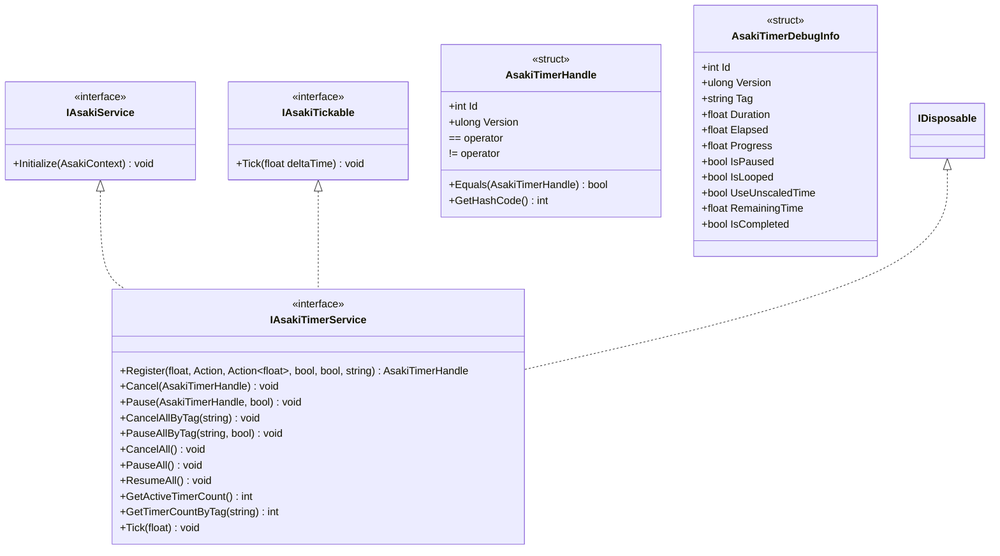
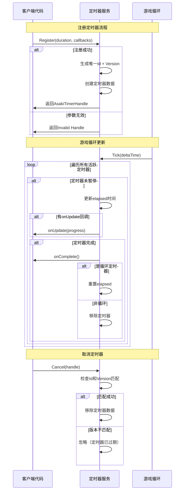
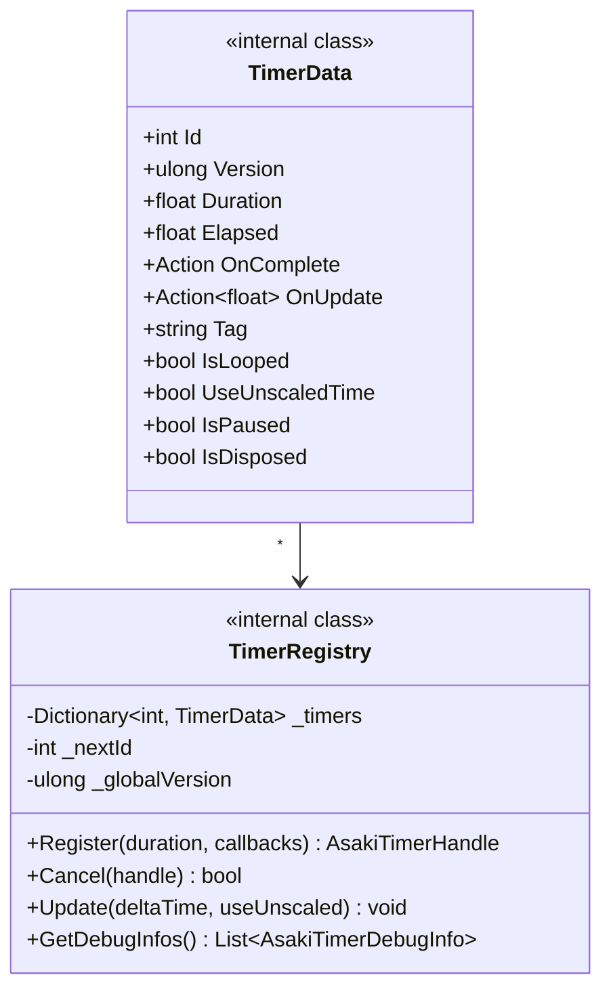

# Asaki Core/Time 模块架构文档

## 目录

1. [设计理念](#1-设计理念)
2. [软件架构](#2-软件架构)
3. [API参考](#3-api参考)
4. [好的示例](#4-好的示例)
5. [坏的示例](#5-坏的示例)

---

## 1. 设计理念

### 1.1 为什么需要定时器服务

在Unity游戏开发中，延迟执行和定时任务是常见需求：

- **技能冷却**：玩家释放技能后需要等待冷却时间
- **动画同步**：控制动画播放节奏和事件触发
- **状态超时**：AI行为状态需要在一定时间后切换
- **UI反馈**：提示信息的自动隐藏
- **游戏事件**：回合制游戏的倒计时

传统的实现方式存在诸多问题：

| 传统方式 | 问题描述 |
| -------- | -------- |
| `Invoke` / `InvokeRepeating` | 无法精确控制、难以暂停恢复、无法获取进度 |
| `Coroutines` | 每个调用者需要持有Coroutine引用、管理复杂、取消不便 |
| `Update` + 手动计时 | 代码重复、易遗漏边界情况、性能开销大 |

Asaki Timer模块提供了**统一的定时器服务**，解决了以上所有问题。

### 1.2 句柄机制的设计动机

Asaki Timer采用**句柄（Handle）机制**而非直接对象引用，这是经过深思熟虑的设计决策：

1. **值类型安全**：`AsakiTimerHandle`是结构体（值类型），不会产生堆内存分配，避免了GC压力

2. **版本号防误取消**：
   - 每次创建定时器时生成唯一ID + 递增版本号
   - 取消时检查版本号是否匹配
   - 解决了"定时器已过期但回调仍被执行"的经典bug

3. **生命周期隔离**：
   - 句柄可以在组件销毁后仍然存在
   - 取消操作通过版本号检测自动失效
   - 避免了空引用异常

4. **便于传递和存储**：
   - 句柄可以安全地存入字典、列表等容器
   - 可以在网络同步中传递

### 1.3 标签系统的设计意图

通过标签（Tag）实现定时器的分组管理：

```csharp
// 技能系统可以为所有技能定时器打标签
timerService.Register(5f, () => SkillReady(), null, false, false, "Skill");

// 一次性取消所有技能相关定时器
timerService.CancelAllByTag("Skill");
```

这种设计适用于：

- 场景切换时清理特定类型的定时器
- 玩家死亡时清除AI相关定时器
- 暂停界面的全局定时器管理

### 1.4 时间缩放支持

定时器服务支持两种时间模式：

| 模式 | 说明 | 适用场景 |
| ---- | ---- | -------- |
| `useUnscaledTime = false` | 受TimeScale影响 | 游戏正常流程、战斗逻辑 |
| `useUnscaledTime = true` | 不受TimeScale影响 | UI动画、过场动画、暂停菜单 |

此外，编辑器模式下还支持全局时间缩放调试，便于测试各种时间相关的逻辑。

---

## 2. 软件架构

### 2.1 模块结构概览

```mermaid
graph TB
    subgraph "核心层 Core"
        TS[IAsakiTimerService]
        TH[AsakiTimerHandle]
        TDI[AsakiTimerDebugInfo]
    end

    subgraph "服务接口层 Interfaces"
        IService[IAsakiService]
        ITick[IAsakiTickable]
        IDisp[IDisposable]
    end

    subgraph "依赖层 Dependencies"
        ISim[IAsakiSimulationService]
        Ctx[AsakiContext]
    end

    IService <|.. TS
    ITick <|.. TS
    IDisp <|.. TS
    TS --> ISim
    TS --> Ctx
    TH -.-> TS
    TDI -.-> TS
```

### 2.2 核心类图



### 2.3 定时器生命周期流程



### 2.4 内部数据结构设计



关键设计点：

- 使用`Dictionary<int, TimerData>`存储所有定时器，O(1)查找
- 全局版本号递增，解决ID复用问题
- 定时器数据标记`IsDisposed`，避免已取消定时器被错误执行

---

## 3. API参考

### 3.1 IAsakiTimerService 接口

定时器服务主接口，提供完整的定时器生命周期管理功能。

#### 注册定时器 `Register`

| 参数 | 类型 | 默认值 | 描述 |
| ---- | ---- | ------ | ---- |
| `duration` | `float` | 必填 | 定时器持续时间（秒） |
| `onComplete` | `Action` | 必填 | 定时器完成时的回调 |
| `onUpdate` | `Action<float>` | null | 每帧更新的回调，参数为剩余比例（0~1） |
| `isLooped` | `bool` | false | 是否循环执行 |
| `useUnscaledTime` | `bool` | false | 是否使用未缩放时间 |
| `tag` | `string` | "" | 定时器标签，用于分组管理 |

| 返回值 | 描述 |
| ------ | ---- |
| `AsakiTimerHandle` | 定时器句柄，用于后续的暂停、取消操作 |

#### 取消定时器 `Cancel`

| 参数 | 类型 | 描述 |
| ---- | ---- | ---- |
| `handle` | `AsakiTimerHandle` | 要取消的定时器句柄 |

#### 暂停/恢复定时器 `Pause`

| 参数 | 类型 | 描述 |
| ---- | ---- | ---- |
| `handle` | `AsakiTimerHandle` | 定时器句柄 |
| `isPaused` | `bool` | true=暂停，false=恢复 |

#### 标签管理方法

| 方法 | 描述 |
| ---- | ---- |
| `CancelAllByTag(string tag)` | 取消指定标签的所有定时器 |
| `PauseAllByTag(string tag, bool isPaused)` | 暂停/恢复指定标签的所有定时器 |

#### 全局管理方法

| 方法 | 描述 |
| ---- | ---- |
| `CancelAll()` | 取消所有定时器 |
| `PauseAll()` | 暂停所有定时器 |
| `ResumeAll()` | 恢复所有定时器 |

#### 查询方法

| 方法 | 描述 | 返回值 |
| ---- | ---- | ------ |
| `GetActiveTimerCount()` | 获取当前活跃定时器数量 | `int` |
| `GetTimerCountByTag(string tag)` | 获取指定标签的定时器数量 | `int` |

#### 调试方法（编辑器专用）

| 方法 | 描述 |
| ---- | ---- |
| `GetAllTimerDebugInfos()` | 获取所有定时器的调试信息列表 |
| `ForceComplete(AsakiTimerHandle handle)` | 强制完成指定定时器 |
| `SetGlobalTimeScale(float scale)` | 设置全局时间缩放 |
| `GetGlobalTimeScale()` | 获取全局时间缩放 |

### 3.2 AsakiTimerHandle 结构体

值类型定时器句柄，用于唯一标识和操作定时器。

| 属性 | 类型 | 描述 |
| ---- | ---- | ---- |
| `Id` | `int` | 定时器唯一ID |
| `Version` | `ulong` | 版本号，用于防止误取消 |

| 静态属性 | 描述 |
| -------- | ---- |
| `Invalid` | 无效句柄常量 |

| 方法 | 描述 |
| ---- | ---- |
| `Equals(AsakiTimerHandle other)` | 比较两个句柄是否相等 |
| `GetHashCode()` | 获取哈希码 |

### 3.3 AsakiTimerDebugInfo 结构体

调试信息结构体，仅在编辑器模式下可用。

| 属性 | 类型 | 描述 |
| ---- | ---- | ---- |
| `Id` | `int` | 定时器ID |
| `Version` | `ulong` | 版本号 |
| `Tag` | `string` | 标签 |
| `Duration` | `float` | 总时长（秒） |
| `Elapsed` | `float` | 已经过的时间（秒） |
| `Progress` | `float` | 进度（0~1） |
| `IsPaused` | `bool` | 是否暂停 |
| `IsLooped` | `bool` | 是否循环 |
| `UseUnscaledTime` | `bool` | 是否使用未缩放时间 |
| `HasCompleteCallback` | `bool` | 是否有完成回调 |
| `HasUpdateCallback` | `bool` | 是否有更新回调 |
| `CallbackTargetType` | `string` | 回调目标类型名称 |

| 计算属性 | 类型 | 描述 |
| -------- | ---- | ---- |
| `RemainingTime` | `float` | 剩余时间（Duration - Elapsed），只读计算属性 |
| `IsCompleted` | `bool` | 是否已完成（Elapsed >= Duration），只读计算属性 |

---

## 4. 好的示例

### 4.1 基础定时器使用

```csharp
using Asaki.Core.Time;
using Asaki.Core.Context;
using Asaki.Unity;
using UnityEngine;

/// <summary>
/// 简单的延迟执行示例
/// </summary>
public class DelayedActionExample : AsakiMono, IAsakiAutoInject
{
    private IAsakiTimerService _timerService;

    void IAsakiInject<IAsakiTimerService>.Inject(IAsakiTimerService timerService)
    {
        _timerService = timerService;
    }

    protected override void OnStart()
    {
        // 注册一个3秒后执行的定时器
        var handle = _timerService.Register(
            duration: 3.0f,
            onComplete: () =>
            {
                Debug.Log("3秒后执行的操作");
            }
        );

        Debug.Log($"定时器已注册，ID: {handle.Id}, Version: {handle.Version}");
    }
}
```

### 4.2 带进度更新的定时器

```csharp
using Asaki.Core.Time;
using Asaki.Unity;
using UnityEngine;
using UnityEngine.UI;

/// <summary>
/// 进度条倒计时示例
/// </summary>
public class CountdownExample : AsakiMono, IAsakiAutoInject
{
    private IAsakiTimerService _timerService;
    [SerializeField] private Text _countdownText;
    [SerializeField] private Image _progressBar;

    void IAsakiInject<IAsakiTimerService>.Inject(IAsakiTimerService timerService)
    {
        _timerService = timerService;
    }

    protected override void OnStart()
    {
        // 注册一个5秒的倒计时，带进度更新
        _timerService.Register(
            duration: 5.0f,
            onComplete: OnCountdownComplete,
            onUpdate: OnCountdownUpdate,
            isLooped: false,
            useUnscaledTime: false,
            tag: "Countdown"
        );
    }

    /// <summary>
    /// 每帧更新回调，progress 从 1 递减到 0
    /// </summary>
    private void OnCountdownUpdate(float progress)
    {
        // progress 表示剩余比例：1.0 = 刚启动，0.0 = 即将完成
        float remainingSeconds = progress * 5.0f;
        _countdownText.text = remainingSeconds.ToString("F1") + "秒";
        _progressBar.fillAmount = progress;
    }

    /// <summary>
    /// 倒计时完成回调
    /// </summary>
    private void OnCountdownComplete()
    {
        _countdownText.text = "开始!";
        Debug.Log("倒计时结束");
    }
}
```

### 4.3 循环定时器 - 技能冷却

```csharp
using Asaki.Core.Time;
using Asaki.Unity;
using UnityEngine;

/// <summary>
/// 技能系统示例 - 循环定时器用于周期性操作
/// </summary>
public class SkillCooldownExample : AsakiMono, IAsakiAutoInject
{
    private IAsakiTimerService _timerService;
    private float _tickDamage = 10f;
    private int _maxTicks = 5;

    void IAsakiInject<IAsakiTimerService>.Inject(IAsakiTimerService timerService)
    {
        _timerService = timerService;
    }

    /// <summary>
    /// 施放一个周期性伤害技能
    /// </summary>
    public void CastPeriodicDamage()
    {
        int currentTick = 0;

        // 每1秒执行一次，共5次
        _timerService.Register(
            duration: 1.0f,
            onComplete: () =>
            {
                currentTick++;
                Debug.Log($"周期性伤害Tick: {currentTick}/{_maxTicks}");

                if (currentTick >= _maxTicks)
                {
                    Debug.Log("技能结束");
                }
            },
            onUpdate: null,
            isLooped: true,  // 循环执行
            useUnscaledTime: false,
            tag: "Skill_DoT"
        );
    }

    /// <summary>
    /// 取消所有技能相关定时器（例如玩家死亡）
    /// </summary>
    public void OnPlayerDeath()
    {
        _timerService.CancelAllByTag("Skill_DoT");
        Debug.Log("已取消所有技能定时器");
    }
}
```

### 4.4 使用UnscaledTime的UI动画

```csharp
using Asaki.Core.Time;
using Asaki.Unity;
using UnityEngine;

/// <summary>
/// UI淡入淡出示例 - 使用UnscaledTime
/// </summary>
public class UIFadeExample : AsakiMono, IAsakiAutoInject
{
    private IAsakiTimerService _timerService;
    [SerializeField] private CanvasGroup _canvasGroup;

    void IAsakiInject<IAsakiTimerService>.Inject(IAsakiTimerService timerService)
    {
        _timerService = timerService;
    }

    protected override void OnStart()
    {
        // 游戏暂停时也应该能完成的UI动画，使用UnscaledTime
        FadeIn(0.5f);
    }

    /// <summary>
    /// 淡入效果
    /// </summary>
    public void FadeIn(float duration)
    {
        _canvasGroup.alpha = 0f;
        _canvasGroup.interactable = false;

        float startTime = Time.unscaledTime;

        _timerService.Register(
            duration: duration,
            onComplete: () =>
            {
                _canvasGroup.alpha = 1f;
                _canvasGroup.interactable = true;
            },
            onUpdate: progress =>
            {
                // progress 从 1 递减到 0，所以用 1 - progress 获取淡入进度
                _canvasGroup.alpha = 1f - progress;
            },
            isLooped: false,
            useUnscaledTime: true,  // 不受TimeScale影响
            tag: "UI_Fade"
        );
    }

    /// <summary>
    /// 淡出效果
    /// </summary>
    public void FadeOut(float duration)
    {
        _canvasGroup.interactable = false;

        _timerService.Register(
            duration: duration,
            onComplete: () =>
            {
                _canvasGroup.alpha = 0f;
                gameObject.SetActive(false);
            },
            onUpdate: progress =>
            {
                _canvasGroup.alpha = progress;  // 从1递减到0
            },
            isLooped: false,
            useUnscaledTime: true,
            tag: "UI_Fade"
        );
    }

    /// <summary>
    /// 场景切换时清理所有UI动画
    /// </summary>
    public void OnSceneChange()
    {
        _timerService.CancelAllByTag("UI_Fade");
    }
}
```

### 4.5 暂停和恢复功能

```csharp
using Asaki.Core.Time;
using Asaki.Unity;
using UnityEngine;

/// <summary>
/// 定时器暂停/恢复示例
/// </summary>
public class PauseResumeExample : AsakiMono, IAsakiAutoInject
{
    private IAsakiTimerService _timerService;
    private AsakiTimerHandle _currentTimerHandle;

    void IAsakiInject<IAsakiTimerService>.Inject(IAsakiTimerService timerService)
    {
        _timerService = timerService;
    }

    protected override void OnStart()
    {
        // 注册一个10秒的定时器
        _currentTimerHandle = _timerService.Register(
            duration: 10f,
            onComplete: OnTimerComplete,
            onUpdate: progress =>
            {
                Debug.Log($"剩余时间: {progress * 10f:F1}秒");
            },
            isLooped: false,
            useUnscaledTime: false,
            tag: "Pauseable"
        );
    }

    /// <summary>
    /// 暂停游戏时暂停定时器
    /// </summary>
    private void OnApplicationPause(bool isPaused)
    {
        if (_currentTimerHandle != AsakiTimerHandle.Invalid)
        {
            _timerService.Pause(_currentTimerHandle, isPaused);
            Debug.Log(isPaused ? "定时器已暂停" : "定时器已恢复");
        }
    }

    private void OnTimerComplete()
    {
        Debug.Log("定时器完成!");
        _currentTimerHandle = AsakiTimerHandle.Invalid;
    }
}
```

### 4.6 异步操作结合定时器

```csharp
using Asaki.Core.Time;
using Asaki.Unity;
using Cysharp.Threading.Tasks;
using UnityEngine;

/// <summary>
/// 定时器与异步操作结合示例
/// </summary>
public class AsyncTimerExample : AsakiMono, IAsakiAutoInject
{
    private IAsakiTimerService _timerService;

    void IAsakiInject<IAsakiTimerService>.Inject(IAsakiTimerService timerService)
    {
        _timerService = timerService;
    }

    protected override void OnStart()
    {
        // 使用异步UniTask方式
        LoadDataWithTimeout().Forget();
    }

    /// <summary>
    /// 带超时保护的异步加载
    /// </summary>
    private async UniTask LoadDataWithTimeout()
    {
        var timeoutHandle = _timerService.Register(
            duration: 5f,
            onComplete: () => Debug.LogWarning("加载超时"),
            isLooped: false,
            useUnscaledTime: true,
            tag: "Network"
        );

        try
        {
            // 模拟异步加载
            await LoadDataAsync();

            // 加载成功，取消超时定时器
            _timerService.Cancel(timeoutHandle);
            Debug.Log("数据加载成功");
        }
        catch (System.Exception ex)
        {
            Debug.LogError($"加载失败: {ex.Message}");
        }
    }

    private async UniTask LoadDataAsync()
    {
        // 模拟网络请求
        await UniTask.Delay(1000);
        Debug.Log("数据已返回");
    }
}
```

---

## 5. 坏的示例

### 5.1 句柄未保存导致无法取消

```csharp
using Asaki.Core.Time;
using Asaki.Unity;

// 错误示例：没有保存定时器句柄，无法取消
public class BadExample1 : AsakiMono, IAsakiAutoInject
{
    private IAsakiTimerService _timerService;

    void IAsakiInject<IAsakiTimerService>.Inject(IAsakiTimerService timerService)
    {
        _timerService = timerService;
    }

    protected override void OnStart()
    {
        // 问题：没有保存返回的句柄
        _timerService.Register(3f, () => Debug.Log("Delayed"));

        // 后续无法取消这个定时器！
    }

    private void OnDestroy()
    {
        // 想取消但没有句柄
        // _timerService.Cancel(???);  // 无法实现
    }
}

// 正确示例：保存句柄
public class GoodExample1 : AsakiMono, IAsakiAutoInject
{
    private IAsakiTimerService _timerService;
    private AsakiTimerHandle _delayHandle;  // 保存句柄

    void IAsakiInject<IAsakiTimerService>.Inject(IAsakiTimerService timerService)
    {
        _timerService = timerService;
    }

    protected override void OnStart()
    {
        _delayHandle = _timerService.Register(3f, () => Debug.Log("Delayed"));
    }

    private void OnDestroy()
    {
        // 在销毁时取消定时器
        if (_delayHandle != AsakiTimerHandle.Invalid)
        {
            _timerService.Cancel(_delayHandle);
        }
    }
}
```

### 5.2 在回调中修改定时器配置

```csharp
using Asaki.Core.Time;
using Asaki.Unity;

// 错误示例：在回调中不当修改导致问题
public class BadExample2 : AsakiMono, IAsakiAutoInject
{
    private IAsakiTimerService _timerService;
    private int _tickCount = 0;

    void IAsakiInject<IAsakiTimerService>.Inject(IAsakiTimerService timerService)
    {
        _timerService = timerService;
    }

    protected override void OnStart()
    {
        _timerService.Register(
            duration: 1f,
            onComplete: () =>
            {
                _tickCount++;
                Debug.Log($"Tick: {_tickCount}");

                // 问题：在回调中再次注册相同定时器
                // 可能导致无限循环或内存泄漏
                // 注意：这种做法没有保存句柄，无法取消，可能导致无限循环
            },
            onUpdate: null,
            isLooped: true,
            tag: "Loop"
        );
    }
}

// 正确示例：使用单一循环定时器
public class GoodExample2 : AsakiMono, IAsakiAutoInject
{
    private IAsakiTimerService _timerService;
    private AsakiTimerHandle _loopHandle;
    private int _tickCount = 0;
    private const int MaxTicks = 10;

    void IAsakiInject<IAsakiTimerService>.Inject(IAsakiTimerService timerService)
    {
        _timerService = timerService;
    }

    protected override void OnStart()
    {
        _loopHandle = _timerService.Register(
            duration: 1f,
            onComplete: OnTick,
            isLooped: true,
            tag: "Loop"
        );
    }

    private void OnTick()
    {
        _tickCount++;
        Debug.Log($"Tick: {_tickCount}");

        // 达到上限后取消
        if (_tickCount >= MaxTicks)
        {
            _timerService.Cancel(_loopHandle);
        }
    }
}
```

### 5.3 使用已销毁组件的回调

```csharp
using Asaki.Core.Time;
using Asaki.Unity;

// 错误示例：组件销毁后定时器回调仍然执行
public class BadExample3 : AsakiMono, IAsakiAutoInject
{
    private IAsakiTimerService _timerService;
    private AsakiTimerHandle _handle;

    void IAsakiInject<IAsakiTimerService>.Inject(IAsakiTimerService timerService)
    {
        _timerService = timerService;
    }

    protected override void OnStart()
    {
        // 注册一个较长的定时器
        _handle = _timerService.Register(10f, OnTimerComplete, tag: "Test");
    }

    private void OnTimerComplete()
    {
        // 问题：如果此GameObject已被销毁，此方法仍会被调用
        // 导致空引用异常
        Debug.Log(_gameObject.transform.position);  // NullReferenceException!
    }

    private void OnDestroy()
    {
        // 错误：虽然取消了定时器，但可能已经触发
        if (_handle != AsakiTimerHandle.Invalid)
        {
            _timerService.Cancel(_handle);
        }
    }
}

// 正确示例：使用Enable标志或IsDestroyed检查
public class GoodExample3 : AsakiMono, IAsakiAutoInject
{
    private IAsakiTimerService _timerService;
    private AsakiTimerHandle _handle;
    private bool _isDestroyed = false;

    void IAsakiInject<IAsakiTimerService>.Inject(IAsakiTimerService timerService)
    {
        _timerService = timerService;
    }

    protected override void OnStart()
    {
        _handle = _timerService.Register(10f, OnTimerComplete, tag: "Test");
    }

    private void OnTimerComplete()
    {
        // 检查组件是否已销毁
        if (_isDestroyed) return;

        // 安全访问
        Debug.Log(transform.position);
    }

    private void OnDestroy()
    {
        _isDestroyed = true;  // 先设置标志

        if (_handle != AsakiTimerHandle.Invalid)
        {
            _timerService.Cancel(_handle);
        }
    }
}
```

### 5.4 标签使用不当导致误取消

```csharp
using Asaki.Core.Time;
using Asaki.Unity;

// 错误示例：使用过于通用的标签
public class BadExample4 : AsakiMono, IAsakiAutoInject
{
    private IAsakiTimerService _timerService;

    void IAsakiInject<IAsakiTimerService>.Inject(IAsakiTimerService timerService)
    {
        _timerService = timerService;
    }

    protected override void OnStart()
    {
        // 问题：多个系统使用相同标签
        _timerService.Register(5f, () => Debug.Log("System A"), tag: "Timer");
        _timerService.Register(3f, () => Debug.Log("System B"), tag: "Timer");
        _timerService.Register(10f, () => Debug.Log("System C"), tag: "Timer");
    }

    private void OnSceneChange()
    {
        // 错误：取消"Timer"标签会取消所有三个系统的定时器
        _timerService.CancelAllByTag("Timer");
    }
}

// 正确示例：使用明确的标签
public class GoodExample4 : AsakiMono, IAsakiAutoInject
{
    private IAsakiTimerService _timerService;

    void IAsakiInject<IAsakiTimerService>.Inject(IAsakiTimerService timerService)
    {
        _timerService = timerService;
    }

    protected override void OnStart()
    {
        // 使用明确的标签
        _timerService.Register(5f, () => Debug.Log("System A"), tag: "Scene_Specific_A");
        _timerService.Register(3f, () => Debug.Log("System B"), tag: "Scene_Specific_B");
        _timerService.Register(10f, () => Debug.Log("System C"), tag: "Scene_Global");
    }

    private void OnSceneChange()
    {
        // 只取消特定场景的定时器
        _timerService.CancelAllByTag("Scene_Specific_A");
        _timerService.CancelAllByTag("Scene_Specific_B");

        // 保留全局定时器
        // _timerService.CancelAllByTag("Scene_Global");
    }
}
```

### 5.5 内存泄漏 - 定时器未清理

```csharp
using Asaki.Core.Time;
using Asaki.Unity;

// 错误示例：场景切换时未清理定时器
public class BadExample5 : AsakiMono, IAsakiAutoInject
{
    private IAsakiTimerService _timerService;

    void IAsakiInject<IAsakiTimerService>.Inject(IAsakiTimerService timerService)
    {
        _timerService = timerService;
    }

    protected override void OnStart()
    {
        // 注册多个定时器
        for (int i = 0; i < 10; i++)
        {
            _timerService.Register(60f * i, () => Debug.Log(i), tag: "Leak", isLooped: false);
        }

        // 问题：切换场景时没有取消
        // 这些定时器会继续运行，造成内存泄漏
    }
}

// 正确示例：使用OnDestroy或专门的清理方法
public class GoodExample5 : AsakiMono, IAsakiAutoInject
{
    private IAsakiTimerService _timerService;
    private const string Tag = "MyFeature";

    void IAsakiInject<IAsakiTimerService>.Inject(IAsakiTimerService timerService)
    {
        _timerService = timerService;
    }

    protected override void OnStart()
    {
        for (int i = 0; i < 10; i++)
        {
            _timerService.Register(60f * i, () => Debug.Log(i), tag: Tag, isLooped: false);
        }
    }

    private void OnDestroy()
    {
        // 场景切换或对象销毁时清理
        if (_timerService != null)
        {
            _timerService.CancelAllByTag(Tag);
        }
    }

    // 或者提供专门的清理接口
    public void Cleanup()
    {
        _timerService?.CancelAllByTag(Tag);
    }
}
```

### 5.6 线程安全问题

```csharp
using Asaki.Core.Time;
using Asaki.Unity;

// 错误示例：在非主线程访问Unity对象
public class BadExample6 : AsakiMono, IAsakiAutoInject
{
    private IAsakiTimerService _timerService;

    void IAsakiInject<IAsakiTimerService>.Inject(IAsakiTimerService timerService)
    {
        _timerService = timerService;
    }

    protected override void OnStart()
    {
        _timerService.Register(1f, () =>
        {
            // 错误：在定时器回调中访问主线程对象
            transform.position = Vector3.zero;  // 不安全！

            // 正确做法：使用UniTask在主线程执行
        }, tag: "Unsafe");
    }
}

// 正确示例：结合UniTask确保主线程执行
public class GoodExample6 : AsakiMono, IAsakiAutoInject
{
    private IAsakiTimerService _timerService;

    void IAsakiInject<IAsakiTimerService>.Inject(IAsakiTimerService timerService)
    {
        _timerService = timerService;
    }

    protected override void OnStart()
    {
        _timerService.Register(1f, async () =>
        {
            // 切换到主线程
            await UniTask.SwitchToMainThread();

            // 安全访问
            transform.position = Vector3.zero;
        }, tag: "Safe");
    }
}
```

---

## 附录

### 相关文件路径

- 定时器服务接口: [IAsakiTimerService.cs](file:///e:/Projects/UnityGame/Asaki/Assets/Asaki/Core/Time/IAsakiTimerService.cs)
- 定时器句柄: [AsakiTimerHandle.cs](file:///e:/Projects/UnityGame/Asaki/Assets/Asaki/Core/Time/AsakiTimerHandle.cs)
- 调试信息: [AsakiTimerDebugInfo.cs](file:///e:/Projects/UnityGame/Asaki/Assets/Asaki/Core/Time/AsakiTimerDebugInfo.cs)

### 依赖接口

- [IAsakiService.cs](file:///e:/Projects/UnityGame/Asaki/Assets/Asaki/Core/Context/IAsakiService.cs)
- [IAsakiTickable.cs](file:///e:/Projects/UnityGame/Asaki/Assets/Asaki/Core/Simulation/IAsakiTickable.cs)
- [IAsakiInject.cs](file:///e:/Projects/UnityGame/Asaki/Assets/Asaki/Core/Context/IAsakiInject.cs)

---

_文档生成时间: 2026-03-03_
