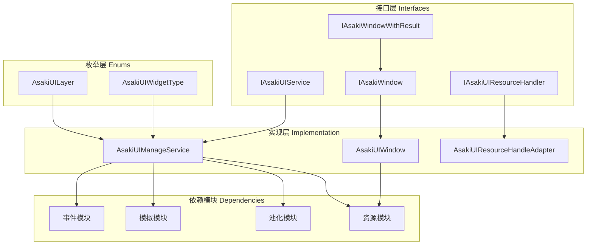
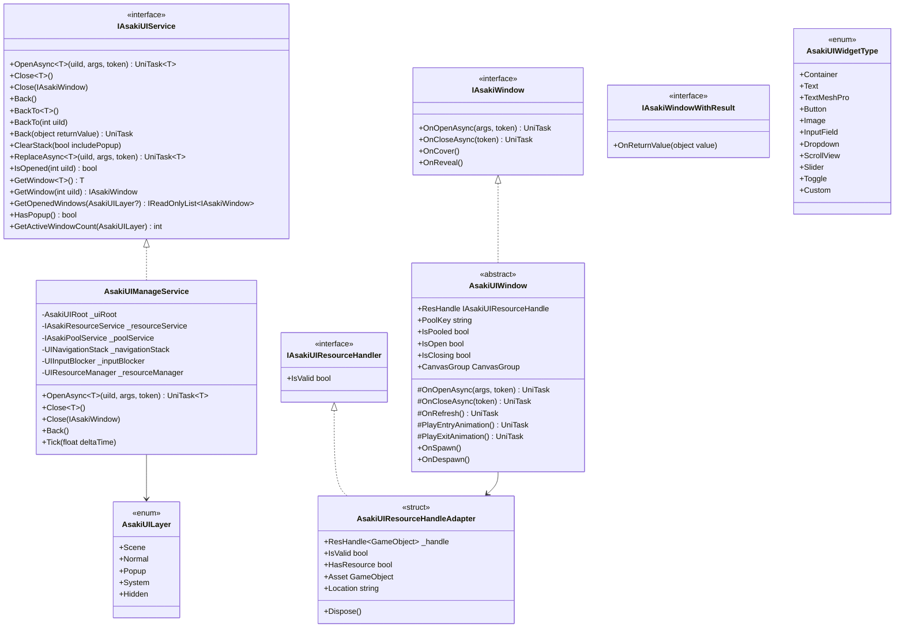
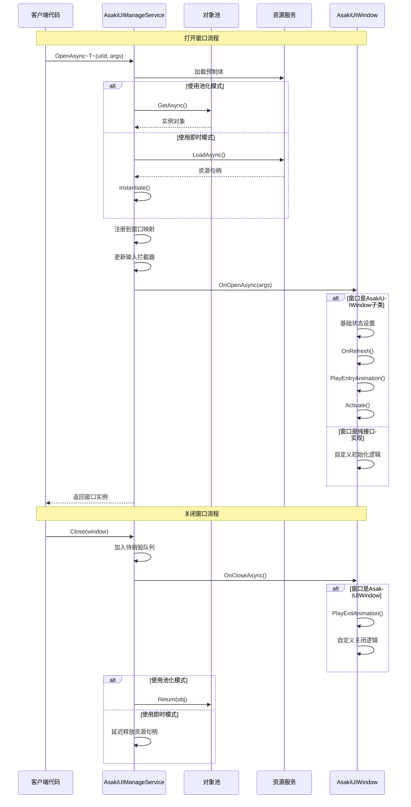
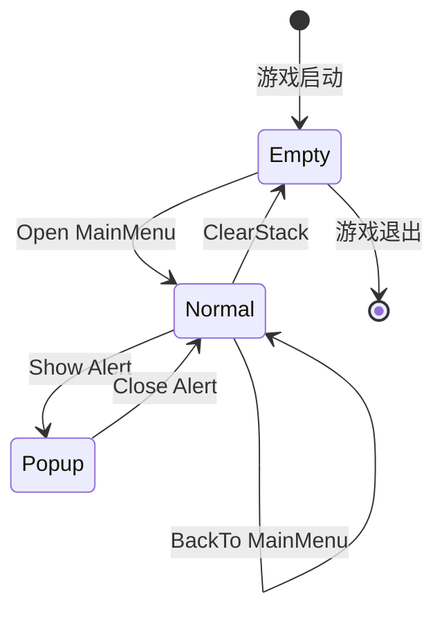
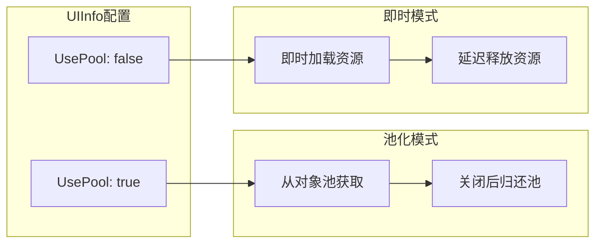

# Asaki Core/UI 模块架构文档

## 目录

1. [设计理念](#1-设计理念)
2. [软件架构](#2-软件架构)
3. [API参考](#3-api参考)
4. [好的示例](#4-好的示例)
5. [坏的示例](#5-坏的示例)

---

## 1. 设计理念

### 1.1 为什么需要专门的UI系统

在Unity游戏开发中，UI管理是每个项目都必须面对的核心问题。传统的UI实现方式存在以下痛点：

- **生命周期混乱**：窗口的创建、显示、隐藏、销毁缺乏统一规范
- **资源管理不当**：频繁创建和销毁UI预制体导致GC压力和内存碎片
- **导航逻辑复杂**：多窗口之间的跳转、返回、替换需要手动编写大量胶水代码
- **层级管理困难**：Popup、System、Normal等不同层级的窗口缺少统一管理

Asaki UI模块通过声明式的窗口定义、自动化的资源池化、导航栈管理来解决这些问题。

### 1.2 窗口池化的设计动机

UI窗口通常会频繁打开和关闭，例如设置面板、物品详情、背包界面等。如果每次打开都重新实例化预制体，会造成：

1. **GC压力**：大量临时UI对象触发垃圾回收
2. **加载延迟**：从Resources或Addressables加载资源需要时间
3. **内存抖动**：频繁的创建和销毁导致堆内存碎片

Asaki UI采用混合资源管理策略：

- **池化模式**：适合高频打开/关闭的窗口（如弹出框、提示信息）
- **复用模式**：适合需要保留状态的窗口（如设置面板）
- **即时模式**：适合一次性使用的窗口（如加载界面）

通过配置 `UsePool` 属性，开发者可以根据窗口的使用频率选择最优策略。

### 1.3 导航栈的设计意图

传统UI导航通常采用硬编码的回调方式，导致：

- 窗口之间的耦合度高
- 返回逻辑难以维护
- 状态传递不透明

Asaki UI实现了类似移动端导航的栈式管理：

- **Push**：打开新窗口压入栈顶
- **Pop**：关闭栈顶窗口
- **BackTo**：返回到指定窗口，关闭其上方的所有窗口
- **Replace**：替换栈顶窗口

这种设计使得：

- 返回按钮逻辑自动处理
- 窗口层级关系清晰可见
- 支持返回值传递（如选择道具后返回选中结果）

### 1.4 层级管理策略

Asaki UI定义了五种UI层级，每种层级有不同的交互特性和显示优先级：

| 层级 | 用途 | 交互特点 |
|------|------|----------|
| Scene | 场景内的HUD元素 | 始终可见，可被其他UI覆盖 |
| Normal | 常规界面 | 压入导航栈，参与返回导航 |
| Popup | 弹窗提示 | 不压入导航栈，点击外部关闭 |
| System | 系统公告、版本信息 | 最高优先级，阻断输入 |
| Hidden | 隐藏层 | 不可见，用于预加载 |

层级之间通过Canvas和Render Mode实现视觉隔离，通过输入拦截器实现交互控制。

---

## 2. 软件架构

### 2.1 架构概览



### 2.2 核心类图



### 2.3 窗口生命周期流程



### 2.4 导航栈状态机



### 2.5 资源管理模式



---

## 3. API参考

### 3.1 IAsakiUIService 接口

UI服务的核心接口，提供窗口管理和导航控制功能。

#### 窗口操作

| 方法 | 描述 | 参数 | 返回值 |
|------|------|------|--------|
| `OpenAsync<T>` | 异步打开指定ID的UI窗口 | `uiId`: UI配置ID<br>`args`: 传递给窗口的参数<br>`token`: 取消令牌 | `UniTask<T>`: 打开的窗口实例 |
| `Close<T>` | 关闭指定类型的窗口 | `T`: 窗口类型 | void |
| `Close` | 关闭指定的窗口实例 | `window`: 窗口实例 | void |
| `ReplaceAsync<T>` | 替换栈顶窗口 | `uiId`: 新窗口ID<br>`args`: 参数<br>`token`: 取消令牌 | `UniTask<T>`: 新窗口实例 |

#### 导航操作

| 方法 | 描述 | 参数 | 返回值 |
|------|------|------|--------|
| `Back()` | 返回到上一级窗口 | 无 | void |
| `BackTo<T>` | 返回到指定类型的窗口 | `T`: 目标窗口类型 | void |
| `BackTo` | 返回到指定ID的窗口 | `uiId`: 目标窗口ID | void |
| `Back(object returnValue)` | 返回并传递返回值 | `returnValue`: 返回值对象 | `UniTask` |
| `ClearStack` | 清空导航栈 | `includePopup`: 是否包含Popup层 | void |

#### 查询操作

| 方法 | 描述 | 参数 | 返回值 |
|------|------|------|--------|
| `IsOpened` | 检查窗口是否已打开 | `uiId`: 窗口ID | `bool` |
| `GetWindow<T>` | 获取指定类型的窗口 | 无 | `T` 或 `null` |
| `GetWindow` | 获取指定ID的窗口 | `uiId`: 窗口ID | `IAsakiWindow` 或 `null` |
| `GetOpenedWindows` | 获取所有已打开窗口 | `layer`: 可选的层级过滤 | `IReadOnlyList<IAsakiWindow>` |
| `HasPopup` | 检查是否存在Popup窗口 | 无 | `bool` |
| `GetActiveWindowCount` | 获取指定层级的窗口数量 | `layer`: 目标层级 | `int` |

### 3.2 IAsakiWindow 接口

窗口的生命周期接口，所有UI窗口必须实现此接口。

| 方法 | 描述 | 参数 | 返回值 |
|------|------|------|--------|
| `OnOpenAsync` | 窗口打开时异步调用 | `args`: 打开参数<br>`token`: 取消令牌 | `UniTask` |
| `OnCloseAsync` | 窗口关闭时异步调用 | `token`: 取消令牌 | `UniTask` |
| `OnCover` | 窗口被覆盖时调用 | 无 | void |
| `OnReveal` | 窗口重新显示时调用 | 无 | void |

### 3.3 IAsakiWindowWithResult 接口

支持返回值的窗口接口。

| 方法 | 描述 | 参数 | 返回值 |
|------|------|------|--------|
| `OnReturnValue` | 接收返回的值 | `value`: 返回值对象 | void |

### 3.4 AsakiUILayer 枚举

UI层级定义。

| 值 | 描述 |
|----|------|
| `Scene` | 场景层，用于HUD元素 |
| `Normal` | 常规层，用于主界面 |
| `Popup` | 弹窗层，用于提示框 |
| `System` | 系统层，用于系统公告 |
| `Hidden` | 隐藏层，用于预加载 |

### 3.5 AsakiUIWidgetType 枚举

UI控件类型定义。

| 值 | 描述 |
|----|------|
| `Container` | 空容器 |
| `Text` | 旧版文本 |
| `TextMeshPro` | TMP文本 |
| `Button` | 按钮 |
| `Image` | 图片 |
| `InputField` | 输入框 |
| `Dropdown` | 下拉菜单 |
| `ScrollView` | 滚动视图 |
| `Slider` | 滑动条 |
| `Toggle` | 开关 |
| `Custom` | 自定义类型 |

### 3.6 IAsakiUIResourceHandler 接口

UI资源句柄接口。

| 属性 | 类型 | 描述 |
|------|------|------|
| `IsValid` | `bool` | 句柄是否有效 |

### 3.7 AsakiUIResourceHandleAdapter 结构体

资源句柄适配器，实现零GC的句柄转换。

| 属性 | 类型 | 描述 |
|------|------|------|
| `IsValid` | `bool` | 句柄是否有效且未释放 |
| `HasResource` | `bool` | 是否持有资源 |
| `Asset` | `GameObject` | 原始资源对象 |
| `Location` | `string` | 资源位置标识 |
| `IsDisposed` | `bool` | 是否已被释放 |

| 方法 | 描述 |
|------|------|
| `Dispose` | 释放资源句柄 |

### 3.8 AsakiUIWindow 抽象类

窗口的基类，提供完整的生命周期管理和动画支持。

#### 属性

| 属性 | 类型 | 描述 |
|------|------|------|
| `ResHandle` | `IAsakiUIResourceHandle` | 资源句柄 |
| `PoolKey` | `string` | 对象池键 |
| `IsPooled` | `bool` | 是否池化对象 |
| `IsOpen` | `bool` | 窗口是否已打开 |
| `IsClosing` | `bool` | 窗口是否正在关闭 |
| `CanvasGroup` | `CanvasGroup` | CanvasGroup组件 |

#### 生命周期方法（子类可重写）

| 方法 | 描述 |
|------|------|
| `OnOpenAsync` | 窗口打开时的异步初始化 |
| `OnCloseAsync` | 窗口关闭时的异步清理 |
| `OnRefresh` | 窗口数据刷新 |
| `PlayEntryAnimation` | 进入动画 |
| `PlayExitAnimation` | 退出动画 |

#### IAsakiPoolable 实现

| 方法 | 描述 |
|------|------|
| `OnSpawn` | 从池中取出时调用 |
| `OnDespawn` | 归还到池时调用 |

---

## 4. 好的示例

### 4.1 基础窗口实现

```csharp
using Asaki.Core.UI;
using Asaki.Unity;
using Cysharp.Threading.Tasks;
using UnityEngine;
using UnityEngine.UI;

/// <summary>
/// 设置窗口示例
/// </summary>
public class SettingsWindow : AsakiUIWindow
{
    [Header("Settings UI")]
    [SerializeField] private Slider _musicVolumeSlider;
    [SerializeField] private Slider _sfxVolumeSlider;
    [SerializeField] private Toggle _vibrationToggle;
    [SerializeField] private Button _closeButton;

    private const int MusicVolumeUiId = 1001;
    private const int SfxVolumeUiId = 1002;
    private const int VibrationUiId = 1003;

    /// <summary>
    /// 窗口打开时的异步初始化
    /// </summary>
    protected override async UniTask OnOpenAsync(object args, CancellationToken token)
    {
        // 调用基类基础设置
        await base.OnOpenAsync(args, token);

        // 加载保存的设置
        LoadSettings();

        // 绑定事件
        _musicVolumeSlider.onValueChanged.AddListener(OnMusicVolumeChanged);
        _sfxVolumeSlider.onValueChanged.AddListener(OnSfxVolumeChanged);
        _vibrationToggle.onValueChanged.AddListener(OnVibrationChanged);
        _closeButton.onClick.AddListener(OnCloseButtonClicked);
    }

    /// <summary>
    /// 窗口关闭时的清理
    /// </summary>
    protected override async UniTask OnCloseAsync(CancellationToken token)
    {
        // 解除事件绑定
        _musicVolumeSlider.onValueChanged.RemoveListener(OnMusicVolumeChanged);
        _sfxVolumeSlider.onValueChanged.RemoveListener(OnSfxVolumeChanged);
        _vibrationToggle.onValueChanged.RemoveListener(OnVibrationChanged);
        _closeButton.onClick.RemoveListener(OnCloseButtonClicked);

        // 保存设置
        SaveSettings();

        await base.OnCloseAsync(token);
    }

    private void LoadSettings()
    {
        _musicVolumeSlider.value = PlayerPrefs.GetFloat("MusicVolume", 0.5f);
        _sfxVolumeSlider.value = PlayerPrefs.GetFloat("SfxVolume", 0.5f);
        _vibrationToggle.isOn = PlayerPrefs.GetInt("Vibration", 1) == 1;
    }

    private void SaveSettings()
    {
        PlayerPrefs.SetFloat("MusicVolume", _musicVolumeSlider.value);
        PlayerPrefs.SetFloat("SfxVolume", _sfxVolumeSlider.value);
        PlayerPrefs.SetInt("Vibration", _vibrationToggle.isOn ? 1 : 0);
        PlayerPrefs.Save();
    }

    private void OnMusicVolumeChanged(float value)
    {
        // 处理音乐音量变化
    }

    private void OnSfxVolumeChanged(float value)
    {
        // 处理音效音量变化
    }

    private void OnVibrationChanged(bool value)
    {
        // 处理振动开关变化
    }

    private void OnCloseButtonClicked()
    {
        // 关闭当前窗口
        var uiService = AsakiContext.Get<IAsakiUIService>();
        uiService.Close(this);
    }
}
```

### 4.2 使用依赖注入获取UI服务

```csharp
using Asaki.Core.Context;
using Asaki.Core.UI;
using Asaki.Unity;
using Cysharp.Threading.Tasks;
using UnityEngine;

/// <summary>
/// 游戏主菜单管理器
/// </summary>
public class MainMenuManager : AsakiMono, IAsakiInject<IAsakiUIService>
{
    private IAsakiUIService _uiService;

    /// <summary>
    /// 通过依赖注入接收UI服务
    /// </summary>
    void IAsakiInject<IAsakiUIService>.Inject(IAsakiUIService uiService)
    {
        _uiService = uiService;
    }

    /// <summary>
    /// 初始化完成后打开主菜单
    /// </summary>
    protected override void OnStart()
    {
        base.OnStart();
        // 打开主菜单界面
        _ = OpenMainMenuAsync();
    }

    private async UniTask OpenMainMenuAsync()
    {
        // 假设UI配置ID为1
        var mainMenu = await _uiService.OpenAsync<MainMenuWindow>(1);
        if (mainMenu != null)
        {
            Debug.Log("主菜单打开成功");
        }
    }

    /// <summary>
    /// 打开设置界面
    /// </summary>
    public async UniTask OpenSettings()
    {
        await _uiService.OpenAsync<SettingsWindow>(2);
    }

    /// <summary>
    /// 打开背包界面
    /// </summary>
    public async UniTask OpenBackpack(object args)
    {
        // 可以传递参数到窗口
        await _uiService.OpenAsync<BackpackWindow>(3, args);
    }
}
```

### 4.3 带返回值的窗口示例

```csharp
using Asaki.Core.UI;
using Asaki.Unity;
using Cysharp.Threading.Tasks;
using UnityEngine;
using UnityEngine.UI;

/// <summary>
/// 道具选择窗口 - 支持返回值
/// </summary>
public class ItemSelectWindow : AsakiUIWindow, IAsakiWindowWithResult
{
    [SerializeField] private Button[] _itemButtons;
    [SerializeField] private Button _cancelButton;

    private ItemData _selectedItem;

    protected override async UniTask OnOpenAsync(object args, CancellationToken token)
    {
        await base.OnOpenAsync(args, token);

        // 如果传入的是道具数据列表，则显示
        if (args is ItemSelectArgs selectArgs)
        {
            UpdateItemDisplay(selectArgs.Items);
        }

        _cancelButton.onClick.AddListener(OnCancelClicked);
    }

    protected override async UniTask OnCloseAsync(CancellationToken token)
    {
        _cancelButton.onClick.RemoveListener(OnCancelClicked);
        await base.OnCloseAsync(token);
    }

    /// <summary>
    /// 实现返回值接口
    /// </summary>
    public void OnReturnValue(object value)
    {
        // 接收上一个窗口传递的返回值
        Debug.Log($"收到返回值: {value}");
    }

    private void OnItemClicked(ItemData item)
    {
        _selectedItem = item;
        // 返回选中结果并关闭窗口
        var uiService = AsakiContext.Get<IAsakiUIService>();
        uiService.Back(item);  // 会调用目标窗口的 OnReturnValue
    }

    private void OnCancelClicked()
    {
        var uiService = AsakiContext.Get<IAsakiUIService>();
        uiService.Back(null);  // 取消选择
    }

    private void UpdateItemDisplay(ItemData[] items)
    {
        // 更新道具显示...
    }
}

/// <summary>
/// 背包窗口 - 接收选择结果
/// </summary>
public class BackpackWindow : AsakiUIWindow, IAsakiWindowWithResult
{
    [SerializeField] private Transform _itemGrid;
    [SerializeField] private Button _selectItemButton;

    private ItemSelectArgs _itemSelectArgs;

    protected override async UniTask OnOpenAsync(object args, CancellationToken token)
    {
        await base.OnOpenAsync(args, token);

        if (args is ItemSelectArgs selectArgs)
        {
            _itemSelectArgs = selectArgs;
        }

        _selectItemButton.onClick.AddListener(OnSelectItemClicked);
    }

    protected override async UniTask OnCloseAsync(CancellationToken token)
    {
        _selectItemButton.onClick.RemoveListener(OnSelectItemClicked);
        await base.OnCloseAsync(token);
    }

    /// <summary>
    /// 接收返回的值
    /// </summary>
    public void OnReturnValue(object value)
    {
        if (value is ItemData selectedItem)
        {
            Debug.Log($"选择了道具: {selectedItem.Name}");
            // 处理选中的道具...
        }
    }

    private async void OnSelectItemClicked()
    {
        var uiService = AsakiContext.Get<IAsakiUIService>();
        // 打开选择窗口并等待返回结果
        await uiService.OpenAsync<ItemSelectWindow>(10, _itemSelectArgs);
    }
}

/// <summary>
/// 道具选择参数
/// </summary>
public class ItemSelectArgs
{
    public ItemData[] Items { get; set; }
    public int MaxSelectCount { get; set; }
}

/// <summary>
/// 道具数据
/// </summary>
public class ItemData
{
    public int Id { get; set; }
    public string Name { get; set; }
}
```

### 4.4 使用导航栈控制

```csharp
using Asaki.Core.Context;
using Asaki.Core.UI;
using Asaki.Unity;

/// <summary>
/// 导航控制示例
/// </summary>
public class NavigationExample : AsakiMono, IAsakiInject<IAsakiUIService>
{
    private IAsakiUIService _uiService;

    void IAsakiInject<IAsakiUIService>.Inject(IAsakiUIService uiService)
    {
        _uiService = uiService;
    }

    /// <summary>
    /// 普通打开 - 压入栈顶
    /// </summary>
    public async void OpenNormalWindow()
    {
        // 栈: [Main] -> [Settings]
        await _uiService.OpenAsync<SettingsWindow>(2);
    }

    /// <summary>
    /// 返回上一级
    /// </summary>
    public void GoBack()
    {
        // 关闭栈顶窗口
        _uiService.Back();
    }

    /// <summary>
    /// 返回到指定窗口
    /// </summary>
    public void GoBackToMain()
    {
        // 关闭Settings和任何在其上方的窗口，只保留Main
        _uiService.BackTo<MainMenuWindow>();
    }

    /// <summary>
    /// 替换栈顶窗口
    /// </summary>
    public async void ReplaceTopWindow()
    {
        // 先关闭当前栈顶，再打开新窗口
        await _uiService.ReplaceAsync<ConfirmDialogWindow>(99);
    }

    /// <summary>
    /// 清空导航栈
    /// </summary>
    public void ClearAllWindows()
    {
        // 关闭所有Normal层窗口
        _uiService.ClearStack(includePopup: false);
    }

    /// <summary>
    /// 打开弹窗
    /// </summary>
    public async void ShowPopup()
    {
        // Popup不压入导航栈
        await _uiService.OpenAsync<AlertWindow>(50);
    }
}
```

### 4.5 使用对象池的窗口

```csharp
using Asaki.Core.UI;
using Asaki.Unity;
using Cysharp.Threading.Tasks;
using UnityEngine;

/// <summary>
/// 提示消息窗口 - 适合池化
/// </summary>
public class ToastWindow : AsakiUIWindow
{
    [SerializeField] private Text _messageText;
    [SerializeField] private float _displayDuration = 2f;

    private CancellationTokenSource _cts;

    /// <summary>
    /// 池化窗口的OnOpenAsync需要处理重复打开
    /// </summary>
    protected override async UniTask OnOpenAsync(object args, CancellationToken token)
    {
        // 防止重复打开
        if (IsOpen)
        {
            return;
        }

        await base.OnOpenAsync(args, token);

        if (args is string message)
        {
            _messageText.text = message;
        }

        // 自动关闭
        _cts = new CancellationTokenSource();
        try
        {
            await UniTask.Delay(
                (int)(_displayDuration * 1000),
                cancellationToken: _cts.Token
            );
        }
        catch (OperationCanceledException)
        {
            // 主动取消，忽略
        }

        // 自动关闭
        var uiService = AsakiContext.Get<IAsakiUIService>();
        uiService.Close(this);
    }

    /// <summary>
    /// 池化窗口的OnCloseAsync需要取消自动关闭
    /// </summary>
    protected override async UniTask OnCloseAsync(CancellationToken token)
    {
        _cts?.Cancel();
        _cts?.Dispose();
        _cts = null;

        await base.OnCloseAsync(token);
    }

    /// <summary>
    /// 从池中取出时的初始化
    /// </summary>
    public override void OnSpawn()
    {
        base.OnSpawn();
        // 重置窗口状态
        _messageText.text = string.Empty;
    }

    /// <summary>
    /// 归还到池时的清理
    /// </summary>
    public override void OnDespawn()
    {
        base.OnDespawn();
        // 清理不需要保留的状态
    }
}
```

---

## 5. 坏的示例

### 5.1 在OnStart中进行异步操作

```csharp
// 错误示例：在OnStart中使用async void
public class BadWindowExample1 : AsakiUIWindow
{
    protected override void OnStart()
    {
        base.OnStart();

        // 错误：async void 会导致异常无法捕获，且无法等待
        async void LoadDataAsync()
        {
            var data = await LoadFromServerAsync();
            // 处理数据...
        }
        LoadDataAsync();
    }

    private async UniTask<SomeData> LoadFromServerAsync()
    {
        await UniTask.Delay(1000);
        return new SomeData();
    }
}

// 正确示例：使用OpenAsync进行异步初始化
public class GoodOnWindowExample1 : AsakiUIWindow
{
    protected override async UniTask OnOpenAsync(object args, CancellationToken token)
    {
        await base.OnOpenAsync(args, token);

        // 正确：在OnOpenAsync中进行异步操作
        var data = await LoadFromServerAsync(token);
        // 处理数据...
    }

    private async UniTask<SomeData> LoadFromServerAsync(CancellationToken token)
    {
        await UniTask.Delay(1000, cancellationToken: token);
        return new SomeData();
    }
}
```

### 5.2 未正确处理窗口取消

```csharp
// 错误示例：未检查取消令牌
public class BadWindowExample2 : AsakiUIWindow
{
    protected override async UniTask OnOpenAsync(object args, CancellationToken token)
    {
        await base.OnOpenAsync(args, token);

        // 错误：没有检查 token.IsCancellationRequested
        var data = await LoadDataAsync();
        // 继续使用已取消的操作结果...
    }

    private async UniTask<Data> LoadDataAsync()
    {
        await UniTask.Delay(2000);
        return new Data();
    }
}

// 正确示例：始终检查取消状态
public class GoodWindowExample2 : AsakiUIWindow
{
    protected override async UniTask OnOpenAsync(object args, CancellationToken token)
    {
        await base.OnOpenAsync(args, token);

        // 正确：传递token并检查取消状态
        var data = await LoadDataAsync(token);

        // 再次检查，因为可能在等待期间被取消
        if (token.IsCancellationRequested)
        {
            return;
        }

        // 处理数据...
    }

    private async UniTask<Data> LoadDataAsync(CancellationToken token)
    {
        await UniTask.Delay(2000, cancellationToken: token);
        return new Data();
    }
}
```

### 5.3 事件监听未正确解除

```csharp
// 错误示例：事件监听未解除
public class BadWindowExample3 : AsakiUIWindow
{
    [SerializeField] private Button _confirmButton;

    protected override async UniTask OnOpenAsync(object args, CancellationToken token)
    {
        await base.OnOpenAsync(args, token);

        // 问题：每次打开都会添加监听器，导致多次触发
        _confirmButton.onClick.AddListener(OnConfirmClicked);
    }

    private void OnConfirmClicked()
    {
        Debug.Log("确认 clicked");
    }
}

// 正确示例：在OnCloseAsync中解除监听
public class GoodWindowExample3 : AsakiUIWindow
{
    [SerializeField] private Button _confirmButton;

    protected override async UniTask OnOpenAsync(object args, CancellationToken token)
    {
        await base.OnOpenAsync(args, token);
        _confirmButton.onClick.AddListener(OnConfirmClicked);
    }

    protected override async UniTask OnCloseAsync(CancellationToken token)
    {
        // 正确：关闭时解除监听
        _confirmButton.onClick.RemoveListener(OnConfirmClicked);
        await base.OnCloseAsync(token);
    }

    private void OnConfirmClicked()
    {
        Debug.Log("确认 clicked");
    }
}
```

### 5.4 未使用依赖注入获取服务

```csharp
// 错误示例：直接使用静态方法获取服务
public class BadWindowExample4 : AsakiUIWindow
{
    private IAsakiUIService _uiService;

    protected override void OnStart()
    {
        base.OnStart();

        // 问题：在OnStart中获取服务，而不是使用依赖注入
        _uiService = AsakiContext.Get<IAsakiUIService>();
    }

    private void OnButtonClicked()
    {
        // 每次都重新获取，效率低
        var service = AsakiContext.Get<IAsakiUIService>();
        service.Close(this);
    }
}

// 正确示例：使用依赖注入
public class GoodWindowExample4 : AsakiUIWindow, IAsakiInject<IAsakiUIService>
{
    private IAsakiUIService _uiService;

    /// <summary>
    /// 通过框架注入服务
    /// </summary>
    void IAsakiInject<IAsakiUIService>.Inject(IAsakiUIService uiService)
    {
        _uiService = uiService;
    }

    private void OnButtonClicked()
    {
        // 使用已注入的服务
        _uiService.Close(this);
    }
}
```

### 5.5 窗口状态未正确管理

```csharp
// 错误示例：重复打开已打开的窗口
public class BadWindowExample5 : AsakiMono, IAsakiInject<IAsakiUIService>
{
    private IAsakiUIService _uiService;

    void IAsakiInject<IAsakiUIService>.Inject(IAsakiUIService uiService)
    {
        _uiService = uiService;
    }

    public void OnOpenSettingsClicked()
    {
        // 问题：每次点击都尝试打开，不检查是否已打开
        _uiService.OpenAsync<SettingsWindow>(2).Forget();
    }
}

// 正确示例：检查窗口状态
public class GoodWindowExample5 : AsakiMono, IAsakiInject<IAsakiUIService>
{
    private IAsakiUIService _uiService;

    void IAsakiInject<IAsakiUIService>.Inject(IAsakiUIService uiService)
    {
        _uiService = uiService;
    }

    public void OnOpenSettingsClicked()
    {
        // 正确：先检查窗口是否已打开
        if (_uiService.IsOpened(2))
        {
            // 已打开则聚焦
            var window = _uiService.GetWindow<SettingsWindow>();
            // 聚焦逻辑...
            return;
        }

        _uiService.OpenAsync<SettingsWindow>(2).Forget();
    }
}
```

### 5.6 池化窗口中存储状态

```csharp
// 错误示例：在池化窗口中存储不应保留的状态
public class BadPooledWindow : AsakiUIWindow
{
    [SerializeField] private InputField _userNameInput;

    // 问题：这些数据在窗口关闭后不应保留
    private string _tempData;
    private List<ItemData> _selectedItems = new List<ItemData>();

    protected override async UniTask OnOpenAsync(object args, CancellationToken token)
    {
        await base.OnOpenAsync(args, token);

        // 从输入框获取数据存储
        _tempData = _userNameInput.text;
    }

    // 问题：OnSpawn只清理了显示，没有清理业务数据
    public override void OnSpawn()
    {
        base.OnSpawn();
        gameObject.SetActive(true);
        // _tempData 和 _selectedItems 没有被清理！
    }

    public override void OnDespawn()
    {
        // 问题：窗口归还到池时没有清理临时数据
        // 下次打开时可能看到之前的数据
        base.OnDespawn();
    }
}

// 正确示例：正确清理池化窗口的状态
public class GoodPooledWindow : AsakiUIWindow
{
    [SerializeField] private InputField _userNameInput;

    // 只存储需要在窗口生命周期内保持的临时数据
    private string _cachedInput;

    protected override async UniTask OnOpenAsync(object args, CancellationToken token)
    {
        await base.OnOpenAsync(args, token);
        _cachedInput = _userNameInput.text;
    }

    protected override async UniTask OnCloseAsync(CancellationToken token)
    {
        _cachedInput = null;  // 清理临时数据
        await base.OnCloseAsync(token);
    }

    public override void OnSpawn()
    {
        base.OnSpawn();

        // 重置UI状态
        _userNameInput.text = string.Empty;

        // 重置业务数据
        _cachedInput = null;

        gameObject.SetActive(true);
    }

    public override void OnDespawn()
    {
        // 确保所有临时状态都被清理
        _cachedInput = null;

        base.OnDespawn();
    }
}
```

### 5.7 未正确处理资源释放

```csharp
// 错误示例：非池化窗口未正确管理资源句柄
public class BadResourceWindow : AsakiUIWindow
{
    private ResHandle<GameObject> _preloadHandle;

    protected override async UniTask OnOpenAsync(object args, CancellationToken token)
    {
        await base.OnOpenAsync(args, token);

        var resourceService = AsakiContext.Get<IAsakiResourceService>();

        // 问题：手动加载资源但没有保存句柄或管理生命周期
        var handle = await resourceService.LoadAsync<GameObject>("Path/To/Prefab", token);

        // 没有保存handle，也没有在关闭时释放
    }

    // 正确：基类已通过ResHandle属性自动处理资源释放
    // 只需要在窗口组件上添加对ResHandle的引用即可
}
```

---

## 附录

### 相关文件路径

#### 核心接口

- [IAsakiUIService.cs](file:///e:/Projects/UnityGame/Asaki/Assets/Asaki/Core/UI/IAsakiUIService.cs)
- [IAsakiWindow.cs](file:///e:/Projects/UnityGame/Asaki/Assets/Asaki/Core/UI/IAsakiWindow.cs)
- [AsakiUILayer.cs](file:///e:/Projects/UnityGame/Asaki/Assets/Asaki/Core/UI/AsakiUILayer.cs)
- [AsakiUIWidgetType.cs](file:///e:/Projects/UnityGame/Asaki/Assets/Asaki/Core/UI/AsakiUIWidgetType.cs)
- [IAsakiUIResourceHandler.cs](file:///e:/Projects/UnityGame/Asaki/Assets/Asaki/Core/UI/IAsakiUIResourceHandler.cs)

#### 实现类

- [AsakiUIManageService.cs](file:///e:/Projects/UnityGame/Asaki/Assets/Asaki/Unity/Services/UI/AsakiUIManageService.cs)
- [AsakiUIWindow.cs](file:///e:/Projects/UnityGame/Asaki/Assets/Asaki/Unity/Services/UI/AsakiUIWindow.cs)
- [AsakiUIResourceHandleAdapter.cs](file:///e:/Projects/UnityGame/Asaki/Assets/Asaki/Core/UI/AsakiUIResourceHandleAdapter.cs)

#### 模块定义

- [AsakiUIModule.cs](file:///e:/Projects/UnityGame/Asaki/Assets/Asaki/Unity/Modules/AsakiUIModule.cs)

### 依赖模块

- Asaki Core/Context - 模块系统和依赖注入
- Asaki Core/Pooling - 对象池服务
- Asaki Core/Resources - 资源加载服务
- Asaki Core/Simulation - 帧更新系统
- Asaki Core/Broker - 事件系统

---

_文档生成时间: 2026-03-03_
