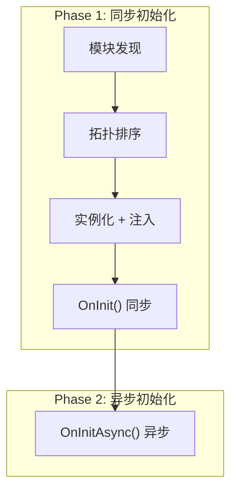
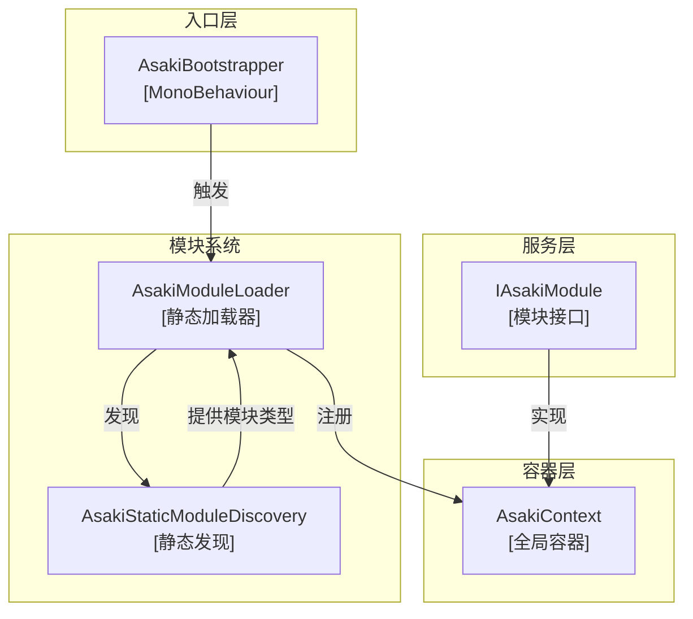
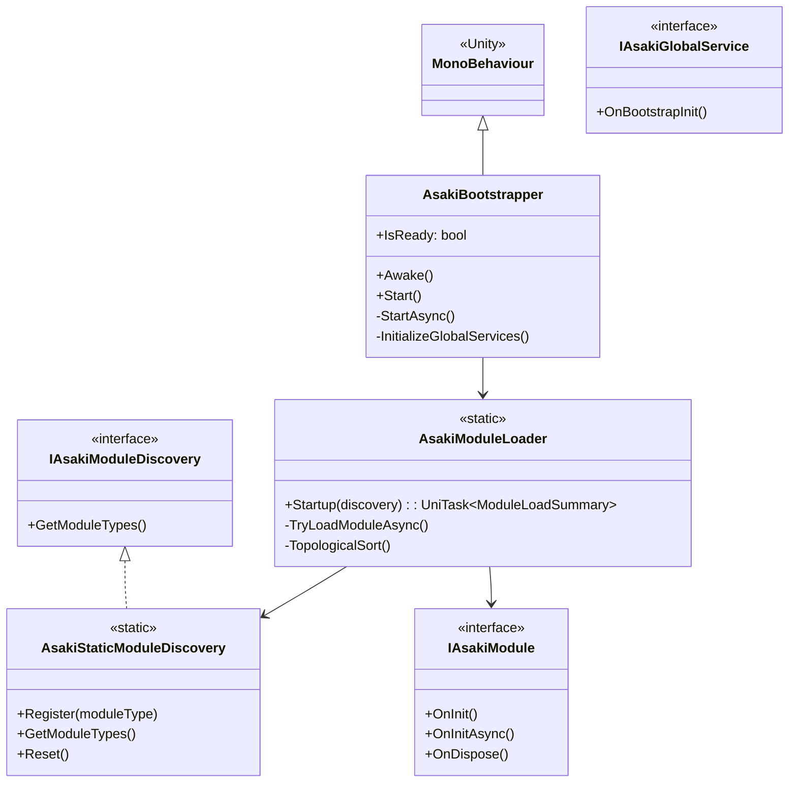
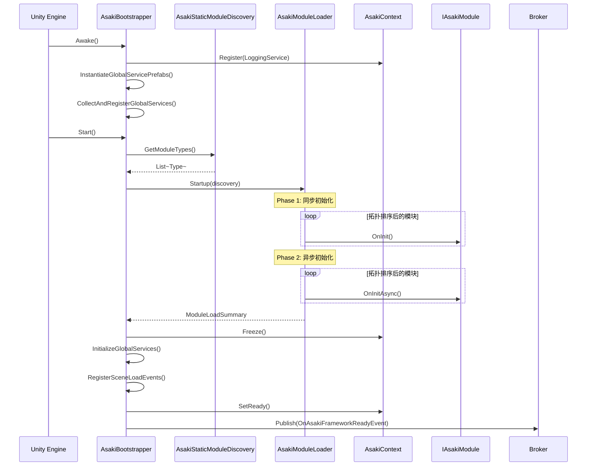
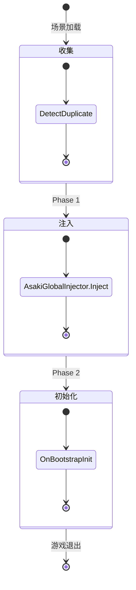

# Asaki Bootstrapper 模块架构文档

## 1. 设计理念 (Design Philosophy)

### 1.1 模块化启动架构的核心目标

Asaki Bootstrapper 是整个框架的启动引擎，负责在游戏启动时完成核心服务的初始化和模块的加载编排。其设计理念围绕以下几个核心目标：

- **确定性初始化顺序**：通过拓扑排序（DAG）确保模块依赖关系正确，避免未初始化的依赖被访问
- **错误隔离与容错**：可选模块失败不会阻断框架启动，必需模块失败则快速失败
- **零反射运行时**：配合 Roslyn 代码生成器，实现编译期模块注册，消除运行时反射开销
- **分层初始化**：支持同步初始化（OnInit）和异步初始化（OnInitAsync）两阶段，确保关键服务尽快可用

### 1.2 为什么选择两阶段初始化

游戏启动时需要加载大量资源和服务，如果全部使用异步会导致：

1. **用户体验问题**：玩家看到黑屏等待时间过长
2. **依赖链断裂**：某些服务需要同步就绪后才能提供功能

因此框架采用两阶段初始化策略：



**Phase 1（同步）**：确保核心服务（如日志、配置、上下文）尽快可用
**Phase 2（异步）**：处理耗时操作（资源加载、网络连接、数据库预热）

### 1.3 与传统启动器的对比

| 特性 | Unity Start() | Asaki Bootstrapper |
| ---- | ------------- | ------------------ |
| 依赖解析 | 手动管理 | 自动拓扑排序 |
| 初始化顺序 | 脚本执行顺序不可控 | DAG 确定性顺序 |
| 错误处理 | 难以捕获 | 完整错误隔离 |
| 异步支持 | 手动协程 | 原生 UniTask 支持 |
| 模块化 | 无 | 插件化架构 |

## 2. 软件架构 (Software Architecture)

### 2.1 架构分层概述

Bootstrapper 模块采用分层架构，各组件职责清晰：



### 2.2 核心类继承关系



### 2.3 启动流程详解

#### 2.3.1 完整启动序列



#### 2.3.2 关键时序点

| 时序点 | 执行内容 | 注意事项 |
| ------ | -------- | -------- |
| Awake | 加载配置、初始化日志、收集全局服务 | 此时 Context 尚未 Freeze |
| Start | 触发模块发现和加载 | 异步执行，不阻塞主线程 |
| Phase 1 | 同步初始化 OnInit | 核心服务就绪 |
| Phase 2 | 异步初始化 OnInitAsync | 处理耗时操作 |
| Freeze | 冻结 Context 容器 | 之后注册新服务会报错 |
| OnFrameworkReady | 事件发布 | 场景中的脚本可开始初始化 |

### 2.4 模块依赖管理

#### 2.4.1 依赖声明方式

模块通过 `[AsakiModule]` 特性声明依赖：

```csharp
using Asaki.Core;
using Asaki.Core.Attributes;

[AsakiModule(
    Dependencies = new[] { typeof(AsakiLogModule), typeof(AsakiConfigModule) },
    Priority = 100
)]
public class MyModule : IAsakiModule
{
    public void OnInit() { /* ... */ }
    public UniTask OnInitAsync() { /* ... */ }
    public void OnDispose() { /* ... */ }
}
```

#### 2.4.2 拓扑排序算法

框架使用 Kahn 算法解决模块依赖顺序：

1. **构建有向图**：根据 `Dependencies` 特性构建依赖边
2. **计算入度**：统计每个模块的依赖数量
3. **队列初始化**：将所有入度为 0 的模块加入队列（按 Priority 排序）
4. **顺序输出**：依次出队，将依赖者入度 -1，重复直到队列为空
5. **循环检测**：如果输出数量不等于模块总数，说明存在循环依赖

### 2.5 全局服务管理

#### 2.5.1 全局服务生命周期

全局服务在 Bootstrapper 中经历三个阶段：



#### 2.5.2 重复实例检测

框架会检测重复的全局服务实例，防止意外创建多个单例：

```csharp
// 检测逻辑
private static bool DetectDuplicateGlobalService(IAsakiGlobalService service)
{
    var serviceType = service.GetType();
    if (_globalServiceTypes.Contains(serviceType))
    {
        ALog.Warn($"Duplicate global service detected: {serviceType.Name}");
        return true; // 重复，跳过
    }
    _globalServiceTypes.Add(serviceType);
    return false;
}
```

## 3. API 参考 (API Reference)

### 3.1 AsakiBootstrapper

框架启动器主类，负责协调整个启动过程。

#### 属性

| 属性 | 类型 | 描述 |
| ---- | ---- | ---- |
| `IsReady` | `static bool` | 框架是否已完成启动 |

#### 内部方法

> 以下为私有方法，仅供框架内部使用。

| 方法 | 描述 | 执行时机 |
| ---- | ---- | -------- |
| `Awake()` | 加载配置、初始化日志、收集全局服务 | Unity 生命周期 |
| `Start()` | 触发异步启动流程 | Unity 生命周期 |
| `StartAsync()` | 执行模块加载两阶段初始化 | Start 中调用 |
| `InitializeGlobalServices()` | 初始化全局服务（注入 + OnBootstrapInit） | 框架就绪后 |
| `RegisterSceneLoadEvents()` | 注册场景加载事件 | 框架就绪后 |

### 3.2 AsakiModuleLoader

静态模块加载器，负责模块的发现、排序和初始化。

#### 方法

| 方法 | 描述 | 返回值 |
| ---- | ---- | ------ |
| `Startup(IAsakiModuleDiscovery)` | 启动模块系统 | `UniTask<ModuleLoadSummary>` |
| `TopologicalSort(List<Type>)` | 拓扑排序算法 | `List<Type>` |

#### 模块加载结果

```csharp
public sealed class ModuleLoadResult
{
    public string ModuleName { get; }
    public bool Success { get; }
    public Exception Exception { get; }
    public bool IsOptional { get; }
    public long ElapsedMs { get; }
    public Type ModuleType { get; }

    public static ModuleLoadResult Succeeded(...);
    public static ModuleLoadResult Failed(...);
}

public sealed class ModuleLoadSummary
{
    public List<ModuleLoadResult> Modules { get; }
    public int SuccessCount { get; }
    public int FailCount { get; }
    public long TotalElapsedMs { get; }
    public bool IsAllSuccess { get; }
    public bool HasRequiredFailure { get; }

    public IEnumerable<ModuleLoadResult> GetFailedModules();
    public IEnumerable<ModuleLoadResult> GetSucceededModules();
}
```

### 3.3 AsakiStaticModuleDiscovery

静态模块发现服务，配合 Roslyn 代码生成器实现零反射注册。

#### 方法

| 方法 | 描述 |
| ---- | ---- |
| `Register(Type)` | 供生成的代码调用，注册模块类型 |
| `GetModuleTypes()` | 获取所有已注册的模块类型 |
| `Reset()` | 清理静态状态（仅用于调试） |

#### 生成的注册代码示例

Roslyn 生成器会为每个模块生成如下代码：

```csharp
// AsakiModuleRegistry.g.cs
static partial class AsakiModuleRegistry
{
    static AsakiModuleRegistry()
    {
        AsakiStaticModuleDiscovery.Register(typeof(AsakiLogModule));
        AsakiStaticModuleDiscovery.Register(typeof(AsakiConfigModule));
        AsakiStaticModuleDiscovery.Register(typeof(AsakiPoolModule));
        // ... 其他模块
    }
}
```

### 3.4 IAsakiModule 接口

模块生命周期契约，所有框架模块必须实现此接口。

```csharp
public interface IAsakiModule : IAsakiService
{
    /// <summary>
    /// [同步初始化阶段]
    /// 时机：模块实例被创建并注册到容器后立即调用
    /// </summary>
    void OnInit();

    /// <summary>
    /// [异步初始化阶段]
    /// 时机：所有模块完成 OnInit 后，按 DAG 顺序依次调用
    /// </summary>
    UniTask OnInitAsync();

    /// <summary>
    /// [销毁阶段]
    /// 时机：游戏退出或重启时调用
    /// </summary>
    void OnDispose();
}
```

### 3.5 IAsakiGlobalService 接口

全局服务生命周期契约，用于实现全局单例服务。

```csharp
public interface IAsakiGlobalService
{
    /// <summary>
    /// 在框架启动完成后调用
    /// 此时所有模块已完成初始化
    /// </summary>
    void OnBootstrapInit();
}
```

## 4. 使用指南 (Usage Guide)

### 4.1 创建自定义模块

#### 4.1.1 基本模块模板

```csharp
using Asaki.Core;
using Asaki.Core.Attributes;
using Cysharp.Threading.Tasks;

namespace MyGame.Modules
{
    /// <summary>
    /// 我的自定义模块
    /// </summary>
    [AsakiModule(
        Dependencies = new[] { typeof(AsakiLogModule) },  // 可选：声明依赖
        Priority = 100,                                    // 可选：优先级（越小越先执行）
        Optional = false                                   // 可选：是否为可选模块
    )]
    public class MyCustomModule : IAsakiModule
    {
        // 使用 IAsakiInject<T> 显式接口实现依赖注入
        private IAsakiInject<AsakiLogModule> _logModule;
        private IAsakiInject<IAsakiConfigService> _configService;

        public void OnInit()
        {
            // 同步初始化阶段
            // 获取依赖模块
            var log = AsakiContext.Get<AsakiLogModule>();
            var config = AsakiContext.Get<IAsakiConfigService>();

            // 注册此模块提供的服务
            AsakiContext.Register<IMyService>(new MyServiceImplementation());
        }

        public async UniTask OnInitAsync()
        {
            // 异步初始化阶段
            // 处理耗时操作，如资源加载、网络请求

            await LoadResourcesAsync();
        }

        public void OnDispose()
        {
            // 清理资源
        }

        private async UniTask LoadResourcesAsync()
        {
            // 异步资源加载
            await UniTask.Delay(100);
        }
    }
}
```

#### 4.1.2 依赖注入的正确方式

**推荐：使用 AsakiContext.Get<T>()**

```csharp
// 推荐：在 OnInit 中获取依赖
public void OnInit()
{
    var logModule = AsakiContext.Get<AsakiLogModule>();
    logModule.Info("Module initialized");
}
```

**推荐：使用 IAsakiInject<T> 显式接口（AsakiMono）**

```csharp
using Asaki.Core;
using Asaki.Unity;

public class MyComponent : AsakiMono
{
    // 显式接口实现依赖注入
    private IAsakiInject<AsakiLogModule> _logModule;
    private IAsakiInject<IAsakiConfigService> _configService;

    protected override void OnStart()
    {
        // 在 OnStart 中使用注入的服务
        _logModule.Value.Info("Component started");
    }
}
```

### 4.2 创建全局服务

#### 4.2.1 基本全局服务模板

```csharp
using Asaki.Core;
using UnityEngine;

namespace MyGame.Services
{
    /// <summary>
    /// 全局单例服务示例
    /// </summary>
    public class MyGlobalService : MonoBehaviour, IAsakiGlobalService
    {
        public static MyGlobalService Instance { get; private set; }

        private void Awake()
        {
            if (Instance != null && Instance != this)
            {
                Destroy(gameObject);
                return;
            }
            Instance = this;
            DontDestroyOnLoad(gameObject);
        }

        public void OnBootstrapInit()
        {
            // 框架就绪后执行初始化
            ALog.Info("MyGlobalService bootstrap init");

            // 注册到 Context
            AsakiContext.Register<IMyGlobalService>(this);
        }

        public void MyMethod()
        {
            // 服务方法
        }
    }
}
```

### 4.3 配置全局服务

#### 4.3.1 通过 AsakiFrameworkSetting 配置

在 `Resources/AsakiFrameworkSetting.asset` 中配置：

```csharp
[CreateAssetMenu(fileName = "AsakiFrameworkSetting")]
public class AsakiFrameworkSetting : ScriptableObject
{
    [Header("Global Service Registry")]
    public List<GameObject> GlobalServicePrefabs;
}
```

### 4.4 使用 OnStart() 生命周期

在 AsakiMono 中使用同步的 `OnStart()` 而不是 `async void Start()`：

#### 4.4.1 正确的异步初始化方式

```csharp
using Asaki.Core;
using Asaki.Unity;
using Cysharp.Threading.Tasks;

public class MyComponent : AsakiMono
{
    protected override void OnStart()
    {
        // 同步初始化
        InitializeAsync().Forget();
    }

    private async UniTaskVoid InitializeAsync()
    {
        // 异步操作使用 async UniTask + .Forget()
        await LoadDataAsync();
        // 继续处理
    }

    private async UniTask LoadDataAsync()
    {
        await UniTask.Delay(100);
    }
}
```

#### 4.4.2 错误示例

```csharp
// 错误：async void Start() 会导致异常无法捕获
public class WrongComponent : AsakiMono
{
    private async void Start()  // 不要这样做！
    {
        await LoadDataAsync();
    }
}
```

## 5. 最佳实践与反模式 (Best Practices & Anti-Patterns)

### 5.1 最佳实践

#### 5.1.1 模块设计原则

1. **单一职责**：每个模块只负责一个功能领域
2. **显式依赖**：通过 `[AsakiModule(Dependencies = ...)]` 声明依赖
3. **快速失败**：在 OnInit 中进行关键检查，失败则抛异常
4. **资源清理**：在 OnDispose 中正确释放资源

```csharp
// 好的示例：清晰的依赖声明
[AsakiModule(
    Dependencies = new[] {
        typeof(AsakiLogModule),
        typeof(AsakiConfigModule),
        typeof(AsakiPoolModule)
    },
    Priority = 50
)]
public class MyModule : IAsakiModule { /* ... */ }
```

#### 5.1.2 错误处理

```csharp
public void OnInit()
{
    try
    {
        var config = AsakiContext.Get<IAsakiConfigService>();
        ValidateConfiguration(config);
        AsakiContext.Register<IMyService>(new MyService());
    }
    catch (ConfigurationException ex)
    {
        // 必需模块失败应该抛异常
        throw new ModuleLoadException(
            nameof(MyModule),
            typeof(MyModule),
            false,
            ex
        );
    }
}
```

### 5.2 反模式

#### 5.2.1 在 OnInit 中执行耗时操作

```csharp
// 反模式：OnInit 是同步阶段，不应该做耗时操作
public void OnInit()
{
    // 错误：在同步阶段加载大量资源
    var texture = Resources.Load<Texture2D>("huge_texture");
}
```

**正确做法**：将耗时操作移到 OnInitAsync

```csharp
public async UniTask OnInitAsync()
{
    // 正确：在异步阶段加载资源
    var texture = await Resources.LoadAsync<Texture2D>("huge_texture");
}
```

#### 5.2.2 循环依赖

```csharp
// 反模式：模块 A 依赖 B，B 又依赖 A
[AsakiModule(Dependencies = new[] { typeof(ModuleB) })]
public class ModuleA : IAsakiModule { }

[AsakiModule(Dependencies = new[] { typeof(ModuleA) })]
public class ModuleB : IAsakiModule { }  // 会导致初始化失败
```

#### 5.2.3 在构造函数中访问 Context

```csharp
// 反模式：构造函数中访问 Context 时机过早
public class BadModule : IAsakiModule
{
    public BadModule()
    {
        // 错误：此时模块尚未注册到 Context
        var log = AsakiContext.Get<AsakiLogModule>();  // 可能返回 null
    }
}
```

**正确做法**：在 OnInit 中访问

```csharp
public void OnInit()
{
    // 正确：此时模块已注册
    var log = AsakiContext.Get<AsakiLogModule>();
}
```

#### 5.2.4 遗漏依赖声明

```csharp
// 反模式：隐式依赖但未声明
[AsakiModule]  // 没有声明 Dependencies
public class MyModule : IAsakiModule
{
    public void OnInit()
    {
        // 运行时依赖 AsakiPoolModule，但未声明
        var pool = AsakiContext.Get<AsakiPoolModule>();
    }
}
```

**正确做法**：显式声明所有依赖

```csharp
[AsakiModule(Dependencies = new[] { typeof(AsakiPoolModule) })]
public class MyModule : IAsakiModule { /* ... */ }
```

## 6. 故障排查 (Troubleshooting)

### 6.1 常见错误

| 错误 | 原因 | 解决方案 |
| ---- | ---- | -------- |
| `Module 'X' failed to load` | 必需模块初始化失败 | 查看日志中的具体异常信息 |
| `Circular dependency detected` | 模块之间存在循环依赖 | 检查 `[AsakiModule(Dependencies = ...)]` 声明 |
| `Type 'X' does not implement IAsakiModule` | 模块未实现正确接口 | 确保类实现了 `IAsakiModule` |
| 框架启动但功能不可用 | 可选模块加载失败 | 检查日志中的警告信息 |

### 6.2 调试技巧

#### 6.2.1 启用详细日志

```csharp
// 在 AsakiFrameworkSetting 中配置日志级别
frameworkSetting.LogConfig.LogLevel = LogLevel.Debug;
```

#### 6.2.2 查看模块加载报告

框架会在启动后输出加载报告：

```
== [Asaki] Initialization Report ==
  Total Modules: 15
  Success: 14
  Failed:  1
  Total Time: 234ms
== Failed Modules ==
  - MyOptionalModule [Optional]: Resource not found
== *Asaki Framework Ready (with optional module failures)* ==
```

## 7. 相关文档 (See Also)

- [Asaki Context 模块架构文档](file:///e:/Projects/UnityGame/Asaki/Assets/Asaki/Doc/modules/core/context/architecture.md)
- [Asaki Modules 模块架构文档](file:///e:/Projects/UnityGame/Asaki/Assets/Asaki/Doc/modules/unity/modules/architecture.md)
- [Asaki Framework Settings 架构文档](file:///e:/Projects/UnityGame/Asaki/Assets/Asaki/Doc/modules/core/frameworksettings/architecture.md)

---

*文档版本：1.0.0*
*最后更新：2026-03-03*
