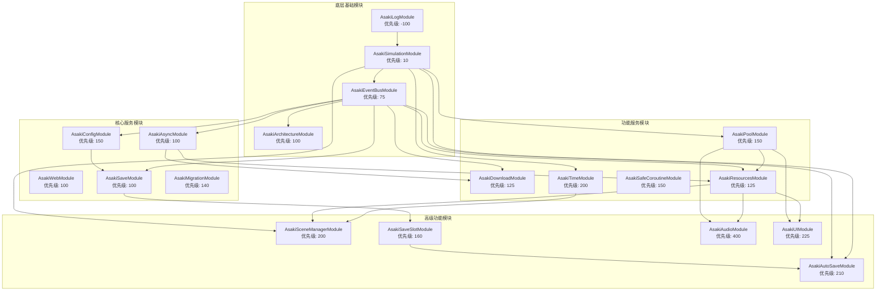
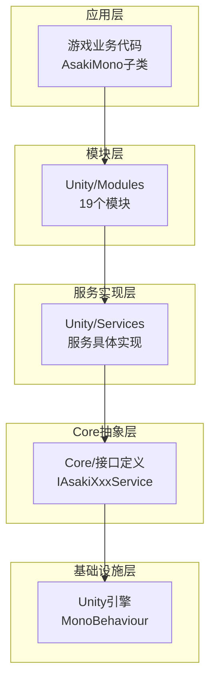

# Unity/Modules 模块架构文档

## 概述

Unity/Modules 模块是 Asaki Unity 框架的核心组成部分，提供了 19 个功能模块的集成层，负责在 Unity 运行时环境中初始化和管理框架的各项服务。这些模块作为桥梁，将 Core 层的抽象接口与 Unity 层的具体实现连接起来，形成了一个完整的服务生态系统。

本模块集合的设计理念围绕三个核心目标展开：第一，构建统一的模块化架构，通过声明式特性（Attribute）实现模块的自动发现、依赖解析和有序初始化；第二，提供高度可扩展的服务注册机制，允许开发者在运行时动态注册或替换服务实现；第三，实现零GC（Garbage Collection）的高性能设计，在关键路径上避免不必要的内存分配。

Unity/Modules 的每个模块都遵循统一的生命周期管理模式：OnInit() 用于同步初始化，OnInitAsync() 用于异步初始化，OnDispose() 用于资源释放。这种设计确保了模块在游戏启动时能够按照正确的依赖顺序加载，在游戏结束时能够优雅地清理资源。

---

## 1. 设计理念

### 1.1 模块化架构设计原则

Asaki 框架的模块系统借鉴了现代软件工程中的微内核架构思想，将框架的核心功能拆分为多个独立的服务模块。每个模块只关注自身的核心职责，通过接口与其他模块进行通信。这种设计带来了三个显著的优势：首先是可测试性，由于模块之间通过接口耦合，可以方便地用 mock 对象替换真实实现进行单元测试；其次是可维护性，模块之间的边界清晰，修改一个模块不会意外影响其他模块；最后是可扩展性，新增功能只需创建新的模块并注册到系统中，无需修改现有代码。

模块化设计的核心是 IAsakiModule 接口，它定义了所有模块必须实现的生命周期方法。OnInit() 方法在游戏启动时同步执行，用于创建服务实例和注册到上下文；OnInitAsync() 方法允许模块执行异步初始化操作，如加载配置文件或预加载资源；OnDispose() 方法在游戏退出时调用，用于释放模块持有的资源。通过合理的优先级设置和依赖声明，框架能够自动解决模块之间的初始化顺序问题。

### 1.2 依赖注入与服务定位

Asaki 框架采用了依赖注入（Dependency Injection）作为模块之间协作的主要方式。每个模块可以通过声明 IAsakiInject<T> 接口来接收框架自动注入的依赖服务。这种设计模式的优势在于：模块不再需要关心依赖服务的创建过程，只需要声明自己需要什么服务，框架会自动在初始化时将满足条件的实例注入进来。

在 Unity/Modules 中，依赖注入通过 [AsakiInject] 特性标记的方法实现。当模块初始化时，框架会扫描模块中标记了 [AsakiInject] 的方法，解析方法参数中声明的服务接口类型，然后从 AsakiContext 中查找对应的服务实例并调用该方法。下面的代码展示了 AsakiAudioModule 如何通过依赖注入获取资源服务和对象池服务：

```csharp
[AsakiInject]
public void Inject(IAsakiResourceService resource, IAsakiPoolService poolService)
{
    _resourceService = resource;
    _poolService = poolService;
}
```

这种设计使得模块之间的耦合度降到最低，同时也使得服务的替换和扩展变得非常简单。例如，如果需要为特定平台实现不同的资源加载策略，只需创建一个新的服务实现并在模块中注册，框架就会自动使用新的实现。

> **注意**：依赖注入方法需要实现 `IAsakiInject<T1, T2, ...>` 接口，框架才能正确识别并调用该方法进行注入。

### 1.3 异步优先的设计哲学

Asaki 框架在设计之初就将异步操作作为一等公民。现代游戏开发中，异步操作无处不在：资源加载、网络请求、场景切换等都涉及耗时的 IO 操作。如果这些操作在主线程同步执行，将导致游戏画面卡顿，严重影响玩家体验。

框架采用了 Cysharp.Threading.Tasks（UniTask）作为异步编程的基础。UniTask 是专为 Unity 设计的轻量级异步编程库，相比传统的 async/await 和协程，它具有更好的性能表现和更简洁的代码风格。在模块设计中，所有可能涉及耗时操作的初始化都应当放在 OnInitAsync() 方法中执行，避免阻塞主线程。

需要特别强调的是，Asaki 框架不推荐使用 async void 方法作为入口点。async void 方法无法被 await，无法获取执行结果，也无法处理异常。在 AsakiMono 基类中，推荐使用 OnStart() 虚方法作为同步初始化的入口，如果需要执行异步操作，应当使用 async UniTask + .Forget() 的方式。

### 1.4 性能优化策略

游戏开发中，性能是一个永恒的话题。Asaki 框架在模块设计中贯彻了多项性能优化策略，以确保框架本身不会成为游戏的性能瓶颈。

首先是零GC设计。在热路径（Hot Path）上，框架避免创建任何不必要的托管对象。所有可能频繁调用的方法都采用了 struct 传递、对象池复用、缓存等技术。以对象池模块为例，AsakiPoolModule 提供了双向映射的零GC对象池，实现了对象的预分配和复用，避免了在游戏运行时频繁进行内存分配和垃圾回收。

其次是延迟初始化。框架中的许多服务只在首次被请求时才进行真正的初始化。这种设计使得游戏启动时只需要加载必要的服务，大大缩短了启动时间。例如，如果游戏中没有使用音频功能，音频服务就不会被真正创建和初始化。

最后是缓存机制。框架在多个层面实现了缓存：组件缓存、查询结果缓存、反射结果缓存等。这些缓存机制显著减少了重复计算的开销，提高了框架的整体性能。

---

## 2. 软件架构

### 2.1 模块依赖关系图

Unity/Modules 包含 19 个功能模块，它们之间存在复杂的依赖关系。理解这些依赖关系对于理解框架的工作原理至关重要。下图展示了模块之间的依赖拓扑结构：



### 2.2 初始化顺序与优先级

模块的初始化顺序由两个因素决定：首先是依赖关系，被依赖的模块总是先于依赖它的模块初始化；其次是优先级，在满足依赖关系的前提下，优先级越低的模块越先初始化。下表展示了各模块的初始化优先级和直接依赖：

| 模块名称 | 优先级 | 依赖模块 | 功能描述 |
|---------|-------|----------|---------|
| AsakiLogModule | -100 | 无 | 日志服务，框架最早初始化 |
| AsakiSimulationModule | 10 | 无 | 模拟服务，提供帧更新驱动 |
| AsakiEventBusModule | 75 | 无 | 事件总线，全局事件系统 |
| AsakiArchitectureModule | 100 | 无 | 架构注册，CQRS支持 |
| AsakiAsyncModule | 100 | 无 | 异步服务，UniTask封装 |
| AsakiWebModule | 100 | 无 | 网络服务，HTTP请求封装 |
| AsakiSaveModule | 100 | EventBusModule, ConfigModule | 存档服务，数据序列化 |
| AsakiMigrationModule | 140 | 无 | 数据迁移，版本兼容 |
| AsakiConfigModule | 150 | EventBus | 配置服务，CSV/JSON加载 |
| AsakiDownloadModule | 125 | EventBusModule, AsyncModule | 下载服务，文件下载 |
| AsakiResourcesModule | 125 | Async, EventBus | 资源服务，Addressables |
| AsakiPoolModule | 150 | Resources, Simulation | 对象池，零GC管理 |
| AsakiSafeCoroutineModule | 150 | 无 | 安全协程，统一协程管理 |
| AsakiSaveSlotModule | 160 | Save | 存档槽位，多槽位管理 |
| AsakiTimeModule | 200 | Simulation | 定时器服务 |
| AsakiSceneManagerModule | 200 | EventBus, Async, Resources | 场景管理，加载切换 |
| AsakiAutoSaveModule | 210 | SaveSlot, EventBus, Simulation | 自动存档 |
| AsakiUIModule | 225 | Resources, Pool, EventBus, Simulation | UI管理，窗口系统 |
| AsakiAudioModule | 400 | Resources, Pool, EventBus | 音频服务，音效音乐 |

### 2.3 核心接口与类图

模块系统的核心接口是 IAsakiModule，它定义了所有模块必须实现的契约。以下是核心接口的定义和模块类图：

```mermaid
classDiagram
    class IAsakiModule {
        +OnInit() void
        +OnInitAsync() UniTask
        +OnDispose() void
    }

    class AsakiModuleAttribute {
        +Priority int
        +Type[] Dependencies
    }

    class IAsakiInject~T~ {
        // 标记接口，用于依赖注入
    }

    IAsakiModule <|-- AsakiLogModule
    IAsakiModule <|-- AsakiSimulationModule
    IAsakiModule <|-- AsakiEventBusModule
    IAsakiModule <|-- AsakiAsyncModule
    IAsakiModule <|-- AsakiWebModule
    IAsakiModule <|-- AsakiSaveModule
    IAsakiModule <|-- AsakiMigrationModule
    IAsakiModule <|-- AsakiConfigModule
    IAsakiModule <|-- AsakiDownloadModule
    IAsakiModule <|-- AsakiResourcesModule
    IAsakiModule <|-- AsakiPoolModule
    IAsakiModule <|-- AsakiSafeCoroutineModule
    IAsakiModule <|-- AsakiSaveSlotModule
    IAsakiModule <|-- AsakiTimeModule
    IAsakiModule <|-- AsakiSceneManagerModule
    IAsakiModule <|-- AsakiAutoSaveModule
    IAsakiModule <|-- AsakiUIModule
    IAsakiModule <|-- AsakiAudioModule
    IAsakiModule <|-- AsakiArchitectureModule

    AsakiAudioModule ..> IAsakiInject
    AsakiUIModule ..> IAsakiInject
    AsakiPoolModule ..> IAsakiInject
```



### 2.4 分层架构

Unity/Modules 采用了清晰的分层架构设计，不同层次的组件承担不同的职责：



应用层是使用框架的游戏业务代码，通常继承自 AsakiMono 基类；模块层负责初始化和管理各类服务，是框架的核心粘合剂；服务实现层提供了具体的业务逻辑实现，如 AsakiAudioService、AsakiUIManageService 等；Core 抽象层定义了所有服务的接口契约，确保各层之间的松耦合；基础设施层是 Unity 引擎本身，框架在其基础上构建了各种高级功能。

---

## 3. 核心模块详解

### 3.1 AsakiLogModule - 日志模块

AsakiLogModule 是框架中最早初始化的模块，优先级为 -100，确保在其他任何模块之前运行。它的主要职责是初始化日志服务，为整个框架提供统一的日志输出能力。

日志模块支持多种输出目标，包括控制台输出、文件输出和远程日志聚合。在运行时，可以通过配置类 AsakiLogConfig 调整日志级别、输出格式和目标位置。模块会检查 AsakiContext 中是否已经存在日志服务实例，如果存在则复用现有实例，否则创建新服务。这种设计允许开发者在模块初始化之前自行配置日志服务，实现高度定制化。

在性能方面，日志模块采用了分级日志策略，只有当请求的日志级别大于等于配置的日志级别时，才会执行实际的日志输出操作。这意味着在发布版本中禁用详细日志后，不会产生任何性能开销。

### 3.2 AsakiSimulationModule - 模拟服务模块

AsakiSimulationModule 是框架的时间驱动核心，优先级为 10，在日志模块之后最早初始化。它创建了一个专门的 GameObject "[Asaki.Driver]" 来承载模拟服务，并使用 DontDestroyOnLoad 确保该对象在场景切换时保持存在。

模拟服务是框架的帧更新驱动系统，它提供了统一的 Update、LateUpdate 和 FixedUpdate 入口。所有需要响应帧更新的服务都可以注册到模拟服务中，由模拟服务统一管理调用顺序。这种设计避免了直接在各个 MonoBehaviour 中编写 Update 方法，使代码更加模块化。

模拟服务还支持时间缩放功能，通过修改时间缩放因子，可以实现子弹时间、暂停游戏等效果。所有依赖模拟服务的功能（如定时器、动画、物理）都会自动受到影响，无需额外处理。

### 3.3 AsakiEventBusModule - 事件总线模块

AsakiEventBusModule 是框架的事件通信中枢，优先级为 75。它实现了类型安全的事件总线系统，支持全局事件的发布和订阅。

事件总线采用了发布-订阅模式，允许组件之间进行松耦合的通信。发布者不需要知道订阅者的存在，订阅者也不需要关心消息的来源。这种设计特别适合处理跨模块、跨系统的通信需求。

模块在初始化时会检查 AsakiContext 中是否已经存在事件服务实例。如果存在（可能是懒加载模式预先注册的），模块会采用"收编"策略，将现有实例纳入模块化管理；否则创建新实例并注册。这种设计确保了框架的灵活性，不会强制覆盖用户预先配置的服务。

### 3.4 AsakiAsyncModule - 异步服务模块

AsakiAsyncModule 负责初始化异步服务，封装了 UniTask 的使用，提供了更加友好的异步编程接口。模块优先级为 100，与架构模块和 Web 模块相同。

异步服务封装了 Unity 环境下的常见异步操作，包括协程管理、延迟执行、异步等待等。通过统一的接口，开发人员可以使用链式调用的方式编写异步代码，大大提高了代码的可读性和可维护性。

异步模块还提供了取消令牌（CancellationToken）的统一管理，确保异步操作可以被正确取消，避免内存泄漏和野指针问题。

### 3.5 AsakiPoolModule - 对象池模块

AsakiPoolModule 实现了零GC的对象池系统，优先级为 150，依赖资源模块和模拟模块。对象池是游戏性能优化的关键技术，通过预分配和复用对象，避免了在游戏运行时频繁进行内存分配和垃圾回收。

对象池支持双向映射，既可以通过类型快速查找可用对象，也可以通过对象实例反向查找其类型信息。模块使用 AsakiSimulationService 进行对象更新，确保对象池的操作与游戏帧率同步。

### 3.6 AsakiResourcesModule - 资源管理模块

AsakiResourcesModule 提供了统一的资源加载接口，优先级为 125，依赖异步模块和事件总线模块。模块支持两种资源加载模式：传统的 Resources 方式和现代的 Addressables 方式，可以通过配置自由切换。

资源服务采用了工厂模式创建，AsakiResKitFactory 根据配置创建相应模式的实现。这种设计使得资源加载逻辑与具体的加载方式解耦，可以方便地添加新的加载策略。

### 3.7 AsakiUIModule - UI管理模块

AsakiUIModule 是框架的 UI 管理系统，优先级为 225，依赖资源模块、对象池模块、事件总线模块和模拟模块。它提供了完整的窗口生命周期管理、层级控制和资源加载能力。

UI 模块支持多种窗口显示模式，包括普通窗口、弹窗、Toast 提示等。通过配置可以指定每个 UI 的层级、是否使用对象池、加载路径等信息。模块内部使用 AsakiUIManageService 进行窗口管理，使用 AsakiUIWindow 表示具体的窗口实例。

### 3.8 AsakiAudioModule - 音频模块

AsakiAudioModule 负责音频服务的初始化，优先级为 400，是所有功能模块中初始化最晚的。模块依赖资源模块、对象池模块和事件总线模块，确保在音频资源加载前所有依赖服务都已就绪。

音频服务支持音效播放、音乐播放、音量控制、混响等功能。所有音频实例都通过对象池管理，避免了频繁创建和销毁 AudioSource 带来的性能开销。

### 3.9 AsakiSaveModule / AsakiSaveSlotModule - 存档模块

这两个模块共同构成了完整的存档系统。AsakiSaveModule 负责基础的数据序列化功能，优先级为 100；AsakiSaveSlotModule 在其基础上增加了多槽位管理能力，优先级为 160。

存档模块支持二进制和 JSON 两种序列化格式，通过 IAsakiSavable 接口实现类型安全的序列化。模块还集成了深度克隆功能，用于实现游戏状态的快速保存和恢复。

### 3.10 AsakiSceneManagerModule - 场景管理模块

AsakiSceneManagerModule 提供了场景加载和管理功能，优先级为 200，依赖事件总线、异步服务和资源服务。模块封装了 Unity 的 SceneManager，提供了更友好的异步加载接口和加载进度回调。

场景管理服务支持预加载、场景切换过渡、场景卸载回调等功能。通过事件系统，模块会在场景加载开始、完成、失败时发布相应的事件，允许其他模块做出响应。

### 3.11 AsakiWebModule / AsakiDownloadModule - 网络模块

AsakiWebModule 负责初始化 Web 请求服务，优先级为 100。AsakiDownloadModule 负责文件下载服务，优先级为 125，依赖事件总线和异步服务。

Web 服务封装了 HTTP 请求的常见操作，包括 GET、POST、文件上传下载等。下载服务支持断点续传、多线程下载、进度回调等高级功能。

---

## 4. API使用指南

### 4.1 模块声明与初始化

在 Asaki 框架中声明一个新模块非常简单。首先需要创建一个继承自 IAsakiModule 的类，然后使用 [AsakiModule] 特性标记它。以下是创建自定义模块的基本结构：

```csharp
using Asaki.Core.Attributes;
using Asaki.Core.Context;
using Cysharp.Threading.Tasks;

namespace Asaki.Unity.Modules
{
    /// <summary>
    /// 自定义模块示例
    /// </summary>
    /// <remarks>
    /// 优先级为 150，依赖事件总线和异步服务
    /// </remarks>
    [AsakiModule(150, typeof(AsakiEventBusModule), typeof(AsakiAsyncModule))]
    public class CustomModule : IAsakiModule, IAsakiInject<IAsakiEventService, IAsakiAsyncService>
    {
        // 依赖服务通过字段保存
        private IAsakiEventService _eventService;
        private IAsakiAsyncService _asyncService;

        /// <summary>
        /// 依赖注入方法，框架会自动调用
        /// </summary>
        /// <param name="eventService">事件服务</param>
        /// <param name="asyncService">异步服务</param>
        [AsakiInject]
        public void Inject(IAsakiEventService eventService, IAsakiAsyncService asyncService)
        {
            _eventService = eventService;
            _asyncService = asyncService;
        }

        /// <summary>
        /// 同步初始化，在主线程执行
        /// </summary>
        public void OnInit()
        {
            // 在这里创建服务实例并注册到上下文
            // 注意：不要在这里执行耗时的异步操作
        }

        /// <summary>
        /// 异步初始化，可以执行耗时的异步操作
        /// </summary>
        /// <returns>异步任务</returns>
        public async UniTask OnInitAsync()
        {
            // 可以安全地执行异步操作
            // 例如加载配置文件、预加载资源等
            await UniTask.CompletedTask;
        }

        /// <summary>
        /// 释放资源，在游戏退出时调用
        /// </summary>
        public void OnDispose()
        {
            // 清理持有的资源，取消订阅的事件等
            _eventService = null;
            _asyncService = null;
        }
    }
}
```

### 4.2 服务使用方式

框架中的服务通过 AsakiContext 进行统一管理。在运行时，可以通过泛型方法 Get<T>() 获取已注册的服务实例：

```csharp
// 获取音频服务
var audioService = AsakiContext.Get<IAsakiAudioService>();

// 尝试获取可能不存在的服务
if (AsakiContext.TryGet<IAsakiUIService>(out var uiService))
{
    // 服务存在，可以安全使用
}
```

### 4.3 事件订阅与发布

事件总线是模块间通信的主要方式。以下是事件订阅和发布的基本用法：

```csharp
// 订阅事件
_eventService.Subscribe<PlayerHealthChangedEvent>(OnPlayerHealthChanged);

// 发布事件
_eventService.Publish(new PlayerHealthChangedEvent { CurrentHealth = 50 });

// 取消订阅
_eventService.Unsubscribe<PlayerHealthChangedEvent>(OnPlayerHealthChanged);

// 事件处理方法
private void OnPlayerHealthChanged(PlayerHealthChangedEvent evt)
{
    Debug.Log($"玩家生命值变化: {evt.CurrentHealth}");
}
```

---

## 5. 代码示例

### 5.1 正确示例：遵循框架规范的组件

下面的示例展示了如何正确地使用 Asaki 框架编写一个游戏组件。这个示例遵循了框架的所有最佳实践：使用 AsakiMono 作为基类、使用 OnStart() 进行初始化、使用依赖注入获取服务、使用 async UniTask + .Forget() 处理异步操作。

```csharp
using Asaki.Core.Broker;
using Asaki.Core.Context;
using Asaki.Core.Audio;
using Cysharp.Threading.Tasks;
using UnityEngine;

namespace Game.Components
{
    /// <summary>
    /// 玩家生命值管理组件
    /// </summary>
    /// <remarks>
    /// 展示 Asaki 框架的正确使用方式
    /// </remarks>
    public class PlayerHealth : AsakiMono, IAsakiInject<IAsakiAudioService, IAsakiEventService>
    {
        // 使用 SerializeField 暴露给 Inspector
        [SerializeField] private int maxHealth = 100;
        
        // 服务依赖通过接口声明
        private IAsakiAudioService _audioService;
        private IAsakiEventService _eventService;
        
        // 当前生命值
        public int CurrentHealth { get; private set; }
        
        // 生命值变化事件
        public event System.Action<int> OnHealthChanged;

        /// <summary>
        /// 依赖注入方法
        /// </summary>
        /// <param name="audioService">音频服务</param>
        /// <param name="eventService">事件服务</param>
        public void Inject(IAsakiAudioService audioService, IAsakiEventService eventService)
        {
            _audioService = audioService;
            _eventService = eventService;
        }

        /// <summary>
        /// 同步初始化，使用 OnStart 虚方法
        /// </summary>
        protected override void OnStart()
        {
            base.OnStart();
            
            // 初始化生命值
            CurrentHealth = maxHealth;
            
            // 订阅事件
            _eventService?.Subscribe<DamageEvent>(OnDamageReceived);
            
            Debug.Log($"[PlayerHealth] 初始化完成，最大生命值: {maxHealth}");
        }

        /// <summary>
        /// 处理受到的伤害事件
        /// </summary>
        private void OnDamageReceived(DamageEvent evt)
        {
            TakeDamage(evt.Damage);
        }

        /// <summary>
        /// 受到伤害
        /// </summary>
        /// <param name="damage">伤害值</param>
        public void TakeDamage(int damage)
        {
            if (damage <= 0) return;
            
            CurrentHealth = Mathf.Max(0, CurrentHealth - damage);
            
            // 播放受伤音效
            _audioService?.PlayOneShot("hit");
            
            // 触发事件
            OnHealthChanged?.Invoke(CurrentHealth);
            
            // 发布全局事件
            _eventService?.Publish(new PlayerHealthChangedEvent
            {
                CurrentHealth = CurrentHealth,
                MaxHealth = maxHealth
            });
            
            // 检查是否死亡
            if (CurrentHealth <= 0)
            {
                OnPlayerDeath();
            }
        }

        /// <summary>
        /// 玩家死亡处理
        /// </summary>
        private void OnPlayerDeath()
        {
            Debug.Log("[PlayerHealth] 玩家死亡");
            _eventService?.Publish(new PlayerDeathEvent());
        }

        /// <summary>
        /// 异步治疗方法示例
        /// </summary>
        /// <param name="healAmount">治疗量</param>
        public async UniTask HealAsync(int healAmount)
        {
            if (healAmount <= 0) return;
            
            // 模拟治疗延迟（如播放动画）
            await UniTask.Delay(500);
            
            int oldHealth = CurrentHealth;
            CurrentHealth = Mathf.Min(maxHealth, CurrentHealth + healAmount);
            int actualHealed = CurrentHealth - oldHealth;
            
            Debug.Log($"[PlayerHealth] 治疗了 {actualHealed} 点生命值");
            
            // 使用 .Forget() 避免编译器警告
        }

        /// <summary>
        /// 释放资源
        /// </summary>
        protected override void OnDestroy()
        {
            // 取消事件订阅，防止内存泄漏
            _eventService?.Unsubscribe<DamageEvent>(OnDamageReceived);
            
            base.OnDestroy();
        }
    }
}
```

### 5.2 错误示例：违反框架规范的做法

下面的示例展示了几种常见的错误做法，这些做法会导致性能问题、内存泄漏或难以调试的bug：

```csharp
using Asaki.Core.Context;
using Cysharp.Threading.Tasks;
using UnityEngine;

// ❌ 错误示例 1: 直接继承 MonoBehaviour 而不是 AsakiMono
public class BadPlayerController : MonoBehaviour
{
    private IAsakiAudioService _audioService;
    
    private void Start()
    {
        // ❌ 每次 Start 都从 Context 获取服务，性能低下
        _audioService = AsakiContext.Get<IAsakiAudioService>();
    }
}

// ❌ 错误示例 2: 使用 async void 作为入口点
public class BadAsyncExample : MonoBehaviour
{
    // ❌ async void 无法被 await，无法处理异常
    private async void Start()
    {
        await LoadDataAsync();
    }
    
    private async UniTask LoadDataAsync()
    {
        // 这里如果发生异常，将无法被捕获
        await UniTask.Delay(1000);
    }
}

// ❌ 错误示例 3: 在 Update 中创建新对象，导致 GC 压力
public class BadPerformanceExample : MonoBehaviour
{
    private void Update()
    {
        // ❌ 每帧创建新字符串，产生 GC 分配
        string message = "Frame: " + Time.frameCount;
        
        // ❌ 每帧创建新数组
        var items = new[] { 1, 2, 3 };
    }
}

// ❌ 错误示例 4: 不正确的资源释放，导致内存泄漏
public class BadResourceExample : MonoBehaviour
{
    private IAsakiEventService _eventService;
    
    private void Start()
    {
        // 订阅事件
        _eventService = AsakiContext.Get<IAsakiEventService>();
        _eventService.Subscribe<SomeEvent>(OnEventHandler);
        
        // ❌ 没有在 OnDestroy 中取消订阅，导致内存泄漏
    }
    
    private void OnEventHandler(SomeEvent evt)
    {
        // 处理事件
    }
    
    // ❌ 缺少 OnDestroy 中的清理代码
}

// ❌ 错误示例 5: 在构造函数中进行依赖注入
public class BadConstructorInjection : MonoBehaviour
{
    private IAsakiAudioService _audioService;
    
    // ❌ MonoBehaviour 的构造函数不会在运行时被调用
    // 依赖注入应该通过 [AsakiInject] 标记的方法实现
    public BadConstructorInjection(IAsakiAudioService audioService)
    {
        _audioService = audioService;
    }
}

// ❌ 错误示例 6: 同步方法中执行耗时操作
public class BadBlockingOperation : MonoBehaviour
{
    private void Start()
    {
        // ❌ 在主线程执行耗时操作，阻塞游戏
        for (int i = 0; i < 1000000; i++)
        {
            // 模拟耗时计算
        }
    }
}
```

### 5.3 好的示例：UI 组件

```csharp
using Asaki.Core.Broker;
using Asaki.Core.Context;
using Asaki.Core.UI;
using Cysharp.Threading.Tasks;
using UnityEngine;
using UnityEngine.UI;

namespace Game.UI
{
    /// <summary>
    /// 主菜单窗口示例
    /// </summary>
    public class MainMenuWindow : AsakiUIWindow, IAsakiInject<IAsakiEventService, IAsakiSceneManagerService>
    {
        // UI 组件引用
        [SerializeField] private Button startButton;
        [SerializeField] private Button settingsButton;
        [SerializeField] private Button quitButton;
        [SerializeField] private Text titleText;
        
        // 服务依赖
        private IAsakiEventService _eventService;
        private IAsakiSceneManagerService _sceneService;
        
        /// <summary>
        /// 依赖注入
        /// </summary>
        public void Inject(
            IAsakiEventService eventService,
            IAsakiSceneManagerService sceneService)
        {
            _eventService = eventService;
            _sceneService = sceneService;
        }

        /// <summary>
        /// 窗口显示时调用
        /// </summary>
        protected override void OnShow()
        {
            base.OnShow();
            
            // 绑定按钮事件
            startButton?.onClick.AddListener(OnStartButtonClicked);
            settingsButton?.onClick.AddListener(OnSettingsButtonClicked);
            quitButton?.onClick.AddListener(OnQuitButtonClicked);
            
            // 更新界面数据
            if (titleText != null)
            {
                titleText.text = "游戏标题";
            }
        }

        /// <summary>
        /// 开始游戏按钮点击
        /// </summary>
        private void OnStartButtonClicked()
        {
            Debug.Log("[MainMenu] 开始游戏");
            
            // 切换到游戏场景
            _sceneService?.LoadSceneAsync("GameScene").Forget();
            
            // 关闭当前窗口
            Hide();
        }

        /// <summary>
        /// 设置按钮点击
        /// </summary>
        private void OnSettingsButtonClicked()
        {
            Debug.Log("[MainMenu] 打开设置");
            _eventService?.Publish(new OpenWindowEvent { WindowName = "Settings" });
        }

        /// <summary>
        /// 退出按钮点击
        /// </summary>
        private void OnQuitButtonClicked()
        {
            Debug.Log("[MainMenu] 退出游戏");
#if UNITY_EDITOR
            UnityEditor.EditorApplication.isPlaying = false;
#else
            Application.Quit();
#endif
        }

        /// <summary>
        /// 窗口隐藏时调用
        /// </summary>
        protected override void OnHide()
        {
            // 解除按钮绑定，防止内存泄漏
            startButton?.onClick.RemoveListener(OnStartButtonClicked);
            settingsButton?.onClick.RemoveListener(OnSettingsButtonClicked);
            quitButton?.onClick.RemoveListener(OnQuitButtonClicked);
            base.OnHide();
        }
    }
}
```

---

## 6. 模块依赖详解

### 6.1 依赖链分析

理解模块之间的依赖链对于解决初始化问题和进行模块替换非常重要。以下是主要依赖链的详细分析：

**核心依赖链（Log → Simulation → EventBus）**：这是框架最底层的基础设施，所有其他模块都间接依赖这条链。日志模块最早初始化，提供日志输出能力；模拟服务次之，提供帧更新驱动；事件总线第三，为模块间通信提供基础。

**资源加载依赖链（Async/EventBus → Resources → Pool/Audio/UI/Scene）**：资源模块依赖异步服务和事件总线，确保资源加载可以异步执行且加载过程可被事件通知。对象池、音频、UI、场景管理等模块都依赖资源模块，因为它们需要加载资源才能正常工作。

**存档依赖链（EventBus/Config → Save → Migration/SaveSlot → AutoSave）**：存档模块依赖事件总线和配置服务。迁移模块独立于存档模块运行，在数据加载时提供版本迁移支持。存档槽位模块依赖基础存档服务，自动存档模块进一步依赖槽位管理。

### 6.2 循环依赖检测与避免

框架在启动时会检测循环依赖，如果发现循环依赖将抛出异常。为了避免循环依赖，应当遵循以下原则：

首先，依赖关系应当是单向的。如果模块 A 依赖模块 B，不应当让模块 B 反向依赖模块 A。如果确实需要双向通信，应当通过事件总线进行，而不是直接依赖。

其次，使用事件总线解耦。如果两个模块需要相互通信但不应当有直接的依赖关系，可以通过事件总线进行发布-订阅模式的通信。

最后，利用懒加载。对于某些确实需要相互引用的模块，可以采用懒加载的方式，在首次使用时才创建依赖，而不是在初始化时。

---

## 7. 最佳实践

### 7.1 模块开发规范

在开发新的 Asaki 模块时，应当遵循以下规范：

**使用声明式配置**：通过 [AsakiModule] 特性声明模块的优先级和依赖，而不是在代码中硬编码初始化顺序。

**实现依赖注入**：使用 [AsakiInject] 特性声明依赖注入方法，让框架自动处理依赖解析。

**分离同步和异步初始化**：将快速的同步初始化放在 OnInit() 中，将耗时的异步操作放在 OnInitAsync() 中。

**正确释放资源**：在 OnDispose() 方法中取消所有订阅、释放所有引用，确保没有内存泄漏。

### 7.2 服务使用规范

使用框架服务时，应当遵循以下规范：

**避免重复获取服务**：在组件的 OnStart() 中获取一次服务并缓存，而不是在每个方法中都调用 AsakiContext.Get<T>()。

**使用 TryGet 模式**：对于可能不存在的服务，使用 TryGet 方法进行安全获取，而不是直接调用 Get 方法。

**正确处理空服务**：在使用服务前检查服务是否为空，避免空引用异常。

### 7.3 性能优化建议

为了获得最佳的性能表现，应当遵循以下建议：

**避免在 Update 中分配内存**：将需要在 Update 中使用的对象预先分配好并复用，而不是每帧创建新对象。

**使用对象池**：对于频繁创建和销毁的对象，使用对象池进行管理，避免 GC 压力。

**减少字符串拼接**：使用 StringBuilder 或格式化方法代替频繁的字符串拼接。

**合理使用缓存**：对于计算结果需要多次使用的场景，使用缓存避免重复计算。

---

## 8. 常见问题

### 8.1 模块初始化失败

如果模块初始化失败，首先检查日志输出。AsakiLogModule 是最早初始化的模块，它的日志输出可以帮助定位问题。常见的原因包括：依赖的模块未正确初始化、服务注册失败、异步初始化中的异常未捕获等。

### 8.2 服务获取为空

如果在运行时获取服务返回空，检查以下几项：服务所属的模块是否已正确初始化、服务接口是否与服务实现类型匹配、是否有其他模块覆盖了服务注册。

### 8.3 事件不触发

如果事件订阅后未触发，检查以下几项：事件发布者和订阅者是否在同一个事件服务实例上、订阅方法是否是正确的事件处理签名、是否在组件销毁前取消了订阅。

---

## 9. 相关文档

- [Core/Architecture 架构文档](../core/architecture/architecture.md) - CQRS 架构系统
- [Core/Context 架构文档](../core/context/architecture.md) - 依赖注入与上下文管理
- [Core/Broker 架构文档](../core/broker/architecture.md) - 事件总线系统
- [Core/Pooling 架构文档](../core/pooling/architecture.md) - 对象池系统
- [Core/Resources 架构文档](../core/resources/architecture.md) - 资源管理系统
- [Core/Serialization 架构文档](../core/serialization/architecture.md) - 序列化与存档
- [Core/UI 架构文档](../core/ui/architecture.md) - UI服务接口定义

---

*文档版本: 1.0*
*最后更新: 2026-03-03*
