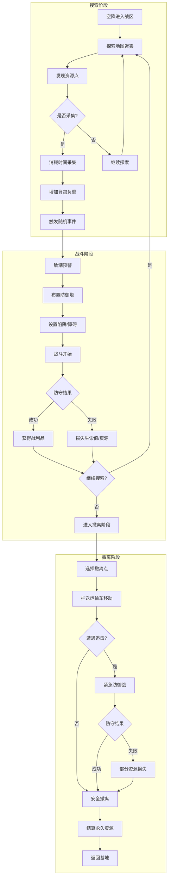
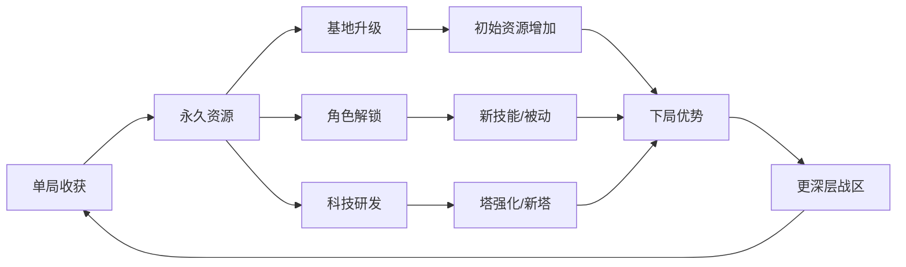
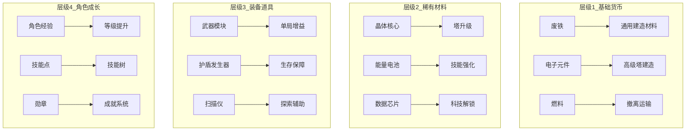

# 《撤离前线》- 俯视角塔防Roguelike游戏策划案

**版本**: v1.0  
**日期**: 2026-02-13  
**类型**: 俯视角2D / 塔防 / Roguelike / 搜打撤  
**平台**: PC / 移动端  
**目标用户**: 18-35岁，喜欢策略深度与紧张节奏的核心玩家

---

## 1. 游戏概述（30秒电梯陈述）

《撤离前线》是一款融合"搜打撤"玩法的俯视角塔防Roguelike游戏。玩家扮演战场指挥官，在随机生成的战区中**搜索资源、布置防线、击退敌潮、安全撤离**。每局游戏都是一次高风险的战术行动——搜得越多，战利品越丰厚，但撤离难度也随之攀升。死亡意味着失去本局所有收获，唯有成功撤离才能将资源永久保存。

**核心体验关键词**: 紧张决策、风险博弈、战术深度、成长爽感

---

## 2. 核心玩法循环

### 2.1 三阶段循环概览



### 2.2 单局循环详解

#### 搜索阶段（约3-8分钟）

| 环节 | 设计要点 | 玩家心理 |
|------|----------|----------|
| 空降进入 | 选择降落点，不同区域资源密度/危险等级不同 | "这次去哪冒险？" |
| 迷雾探索 | 战争迷雾遮挡视野，需逐步解锁 | "前方有什么？" |
| 资源采集 | 每个资源点有采集时间（5-15秒），期间无法移动 | "值得冒险吗？" |
| 负重管理 | 背包有容量上限，资源有重量，超重降低移动速度 | "带什么走？" |
| 随机事件 | 发现幸存者、触发警报、遭遇伏击、发现隐藏宝箱 | "惊喜还是惊吓？" |

**关键决策点**:
- 采集高级资源 = 消耗更多时间 = 敌潮更快到来
- 背包满载 = 移动缓慢 = 撤离更危险
- 探索更多区域 = 更多战利品 = 更高暴露风险

#### 战斗/塔防阶段（约2-5分钟/波）

| 环节 | 设计要点 | 玩家心理 |
|------|----------|----------|
| 敌潮预警 | 30秒倒计时，显示敌人数量/类型/来袭方向 | "准备好了吗？" |
| 塔位选择 | 地图预设塔位，不同位置覆盖范围不同 | "怎么布防？" |
| 塔类型选择 | 机枪塔/火焰塔/冰冻塔/电磁塔/导弹塔，各有优劣 | "什么组合最有效？" |
| 资源分配 | 建塔消耗本局资源，需平衡防守与携带 | "花多少防守？" |
| 战斗执行 | 塔自动攻击，玩家可使用技能/道具支援 | "能守住吗？" |

**塔类型设计**:

| 塔类型 | 伤害 | 攻速 | 射程 | 特殊效果 | 建造成本 |
|--------|------|------|------|----------|----------|
| 机枪塔 | 中 | 快 | 中 | 无 | 100 |
| 火焰塔 | 低 | 持续 | 短 | 燃烧DoT | 120 |
| 冰冻塔 | 极低 | 中 | 中 | 减速50% | 80 |
| 电磁塔 | 中 | 慢 | 长 | 麻痹1秒 | 150 |
| 导弹塔 | 高 | 极慢 | 极长 | 范围伤害 | 200 |

#### 撤离阶段（约1-3分钟）

| 环节 | 设计要点 | 玩家心理 |
|------|----------|----------|
| 撤离点选择 | 3个撤离点，距离/安全度/追击强度不同 | "走哪条路？" |
| 运输车护送 | 运输车自动移动，玩家需保护 | "别让它被毁！" |
| 追击战 | 撤离途中遭遇追击敌潮，需紧急防守 | "最后冲刺！" |
| 撤离结算 | 根据存活状态结算资源，死亡损失50% | "值得吗？" |

**撤离点设计**:

| 撤离点类型 | 距离 | 追击强度 | 特殊条件 | 推荐策略 |
|------------|------|----------|----------|----------|
| 近路撤离点 | 短 | 高 | 无 | 资源少时快速撤离 |
| 远路撤离点 | 长 | 中 | 无 | 平衡选择 |
| 隐蔽撤离点 | 中 | 低 | 需探索解锁 | 资源多时首选 |

### 2.3 永久循环（局与局之间）



---

## 3. 资源系统设计

### 3.1 资源层级架构



### 3.2 资源总表

| 资源名称 | 图标颜色 | 堆叠上限 | 单位重量 | 主要产出 | 主要消耗 | 存储上限 |
|----------|----------|----------|----------|----------|----------|----------|
| 废铁 | #8B8B8B | 99 | 1 | 普通资源点 | 基础塔建造 | 无限 |
| 电子元件 | #00BFFF | 50 | 2 | 科技建筑 | 高级塔建造 | 无限 |
| 燃料 | #FFA500 | 30 | 3 | 加油站 | 撤离运输 | 无限 |
| 晶体核心 | #FF00FF | 20 | 5 | Boss/宝箱 | 塔升级 | 200 |
| 能量电池 | #00FF00 | 30 | 2 | 能源站 | 技能强化 | 300 |
| 数据芯片 | #FFFF00 | 15 | 1 | 实验室 | 科技解锁 | 100 |
| 武器模块 | #FF4444 | 5 | 10 | 军火库 | 单局增益 | 50 |
| 护盾发生器 | #4444FF | 3 | 8 | 研究所 | 生存保障 | 30 |

### 3.3 资源产出与消耗锚点

**单局资源产出模型**（以中等难度战区为例）:

| 资源类型 | 最小产出 | 平均产出 | 最大产出 | 产出条件 |
|----------|----------|----------|----------|----------|
| 废铁 | 50 | 150 | 300 | 探索资源点 |
| 电子元件 | 10 | 40 | 100 | 科技建筑 |
| 燃料 | 5 | 15 | 30 | 加油站 |
| 晶体核心 | 0 | 2 | 5 | Boss击杀 |
| 能量电池 | 3 | 10 | 25 | 能源站 |

**单局资源消耗模型**:

| 消费类型 | 废铁 | 电子元件 | 燃料 | 说明 |
|----------|------|----------|------|------|
| 基础防线 | 50-100 | 10-20 | 0 | 2-3座基础塔 |
| 强化防线 | 100-200 | 30-50 | 0 | 4-5座混合塔 |
| 撤离成本 | 0 | 0 | 10-20 | 根据距离 |
| 应急道具 | 20-50 | 5-10 | 0 | 地雷/修复包 |

### 3.4 背包与负重系统

**背包规则**:
- 初始容量: 100单位
- 超重阈值: 80% (80单位) - 移动速度降低20%
- 严重超重: 100% (100单位) - 移动速度降低50%，无法奔跑
- 容量扩展: 通过基地升级或装备道具提升

**背包UI设计**:
- 网格布局: 8x6格子
- 快捷栏: 底部4格，用于常用道具
- 筛选功能: 按类型/重量/价值排序
- 一键丢弃: 快速丢弃低价值物品

---

## 4. 角色成长与Roguelike元素

### 4.1 角色成长维度

| 维度 | 成长内容 | 投放节奏 | 上限 | 付费点 |
|------|----------|----------|------|--------|
| 等级 | 基础属性提升 | 每局获得经验 | 50级 | 经验加成道具 |
| 技能树 | 主动/被动技能解锁 | 升级获得技能点 | 30个技能 | 技能重置道具 |
| 装备 | 武器/护甲/饰品 | 战区掉落/制作 | 6个装备槽 | 装备皮肤 |
| 天赋 | 永久被动加成 | 完成成就解锁 | 20个天赋 | 天赋扩展槽 |
| 外貌 | 角色/载具皮肤 | 成就/付费 | 无限 | 皮肤商店 |

### 4.2 技能树设计

**三大分支**:

```mermaid
flowchart TB
    subgraph 指挥官分支_战术强化
        A1[快速建造] --> A2[塔伤害+10%]
        A2 --> A3[紧急修复]
        A3 --> A4[塔攻速+15%]
        A4 --> A5[超载模式]
    end
    
    subgraph 侦察兵分支_探索强化
        B1[移动速度+10%] --> B2[视野范围+20%]
        B2 --> B3[资源探测]
        B3 --> B4[背包容量+20%]
        B4 --> B5[隐形潜行]
    end
    
    subgraph 工程师分支_建造强化
        C1[建造成本-10%] --> C2[塔耐久+20%]
        C2 --> C3[陷阱大师]
        C3 --> C4[塔射程+15%]
        C4 --> C5[自动修复]
    end
```



**技能点获取**:
- 每升1级获得1技能点
- 完成特定成就获得额外技能点
- 技能重置消耗: 50晶体核心

### 4.3 Roguelike元素设计

#### 单局随机性

| 随机元素 | 随机内容 | 影响范围 | 权重 |
|----------|----------|----------|------|
| 地图生成 | 地形/资源点分布/撤离点位置 | 整局策略 | 高 |
| 敌人配置 | 敌人类型/数量/波次 | 战斗难度 | 高 |
| 随机事件 | 幸存者/伏击/宝箱/天气 | 单次决策 | 中 |
| 战利品 | 资源类型/数量/品质 | 收益预期 | 中 |
| 商人出现 | 是否出现/商品内容 | 补给机会 | 低 |

#### 永久解锁

| 解锁类型 | 解锁条件 | 解锁内容 |
|----------|----------|----------|
| 新角色 | 完成特定成就 | 不同初始属性/技能 |
| 新塔类型 | 科技研发 | 新防御塔 |
| 新战区 | 基地等级提升 | 更高难度/更好奖励 |
| 新道具 | 制作解锁 | 新消耗品 |
| 新天赋 | 成就系统 | 永久被动加成 |

#### 死亡惩罚

| 情况 | 资源损失 | 经验获得 | 其他 |
|------|----------|----------|------|
| 战斗中死亡 | 丢失本局所有资源 | 50%经验 | 无 |
| 撤离失败 | 丢失50%资源 | 100%经验 | 无 |
| 主动放弃 | 丢失30%资源 | 30%经验 | 冷却时间5分钟 |

### 4.4 成长数值模型

**等级经验公式**:
```
所需经验 = 基础值(100) * 等级^1.5
```

**关键里程碑**:

| 等级 | 所需累计经验 | 解锁内容 | 单局平均经验 |
|------|--------------|----------|--------------|
| 5 | 600 | 第一个主动技能 | 100 |
| 10 | 2000 | 第二个技能分支 | 150 |
| 20 | 6500 | 高级战区解锁 | 200 |
| 30 | 15000 | 第三个技能分支 | 250 |
| 50 | 40000 | 终极技能 | 300 |

---

## 5. 敌人与关卡设计

### 5.1 敌人类型设计

#### 基础敌人

| 敌人名称 | 生命值 | 移动速度 | 伤害 | 特殊能力 | 出现波次 |
|----------|--------|----------|------|----------|----------|
| 游荡者 | 50 | 中 | 低 | 无 | 1-3波 |
| 冲锋者 | 30 | 快 | 中 | 冲锋技能 | 2-5波 |
| 重装兵 | 150 | 慢 | 高 | 护甲减伤 | 3波+ |
| 狙击手 | 40 | 慢 | 极高 | 远程攻击 | 4波+ |
| 自爆虫 | 20 | 极快 | 范围高 | 死亡爆炸 | 3波+ |

#### 精英敌人

| 敌人名称 | 生命值 | 特殊能力 | 弱点 | 掉落 |
|----------|--------|----------|------|------|
| 指挥官 | 500 | 召唤小兵 | 头部 | 晶体核心x2 |
| 坦克 | 1000 | 高护甲 | 背部 | 电子元件x10 |
| 隐形刺客 | 200 | 隐身 | 显形后 | 能量电池x5 |

#### Boss设计

| Boss名称 | 生命值 | 阶段数 | 特殊机制 | 出现条件 |
|----------|--------|--------|----------|----------|
| 毁灭者MK-1 | 3000 | 2 | 召唤/护盾 | 第5波 |
| 虚空领主 | 5000 | 3 | 传送/分身 | 第8波 |
| 终极兵器 | 8000 | 4 | 全屏技能 | 第10波 |

### 5.2 关卡/战区设计

#### 战区难度分级

| 战区等级 | 名称 | 敌人强度 | 资源丰富度 | 解锁条件 |
|----------|------|----------|------------|----------|
| 1 | 边境废墟 | 0.8x | 0.8x | 初始解锁 |
| 2 | 工业区 | 1.0x | 1.0x | 等级5 |
| 3 | 军事基地 | 1.3x | 1.2x | 等级10 |
| 4 | 核心城区 | 1.6x | 1.5x | 等级20 |
| 5 | 指挥中心 | 2.0x | 2.0x | 等级30 |

#### 地图元素

| 元素类型 | 功能 | 交互方式 |
|----------|------|----------|
| 资源点 | 产出资源 | 驻留采集 |
| 建筑废墟 | 提供掩体/塔位 | 可破坏 |
| 加油站 | 补充燃料 | 交互 |
| 研究所 | 获得数据芯片 | 解锁小游戏 |
| 军火库 | 获得武器模块 | 战斗挑战 |
| 撤离点 | 结束关卡 | 护送到达 |

#### 地图生成规则

```
地图尺寸: 64x64格
资源点数量: 15-25个
塔位数量: 20-30个
撤离点数量: 3个
障碍物密度: 20-30%
```

### 5.3 波次设计

**波次强度公式**:
```
敌人总生命值 = 基础值(500) * 波次^1.2 * 战区系数
敌人数量 = 基础值(10) + 波次 * 3
```

**波次间隔**:
- 前3波: 90秒
- 4-7波: 75秒
- 8波+: 60秒

**关键波次设计**:

| 波次 | 敌人配置 | 特殊事件 | 奖励 |
|------|----------|----------|------|
| 3 | 精英+小兵 | 无 | 商人出现 |
| 5 | Boss战 | 天气变化 | 晶体核心 |
| 7 | 大规模进攻 | 空袭支援 | 稀有道具 |
| 10 | 终极Boss | 多方向进攻 | 大量资源 |

---

## 6. 美术风格建议

### 6.1 整体风格定位

**风格关键词**: 废土科幻 / 低多边形 / 高对比度 / 信息清晰

**参考作品**:
- 《Into the Breach》- 清晰的战术信息呈现
- 《Brawl Stars》- 俯视角角色设计
- 《Factorio》- 工业风建筑与机械

### 6.2 色彩基调

| 元素类型 | 主色调 | 辅助色 | 说明 |
|----------|--------|--------|------|
| 地面/背景 | #2D3436 深灰 | #636E72 灰 | 低饱和，不干扰视线 |
| 玩家单位 | #00B894 青绿 | #00CEC9 亮青 | 友好、安全 |
| 敌人单位 | #E17055 橙红 | #D63031 深红 | 危险、敌对 |
| 资源/道具 | #FDCB6E 金黄 | #F39C12 橙 | 吸引注意力 |
| UI元素 | #DFE6E9 浅灰 | #B2BEC3 灰白 | 清晰可读 |
| 警告/危险 | #E84393 粉红 | #D63031 红 | 紧急提示 |

### 6.3 角色设计规范

**玩家角色**:
- 风格: 低多边形 + 平滑着色
- 尺寸: 32x32像素（基础），支持2x/4x缩放
- 动画: 待机/移动/建造/受伤/死亡（5-8帧）
- 方向: 8方向移动，需制作8套动画或使用骨骼动画

**敌人设计**:
- 尺寸: 小型24x24，中型32x32，大型48x48，Boss64x64
- 动画: 移动/攻击/受伤/死亡（4-6帧）
- 特效: 攻击特效/死亡爆炸（粒子系统）

### 6.4 建筑与塔设计

**防御塔视觉规范**:

| 塔类型 | 基础尺寸 | 动画需求 | 特效需求 |
|--------|----------|----------|----------|
| 机枪塔 | 48x48 | 旋转炮管 | 枪口火焰 |
| 火焰塔 | 48x48 | 燃烧动画 | 火焰喷射 |
| 冰冻塔 | 48x48 | 旋转晶体 | 冰霜光环 |
| 电磁塔 | 48x48 | 电弧闪烁 | 闪电链 |
| 导弹塔 | 64x64 | 发射动画 | 导弹轨迹+爆炸 |

**建筑废墟**:
- 风格: 损毁的现代建筑
- 尺寸: 64x64 / 128x64 / 64x128
- 状态: 完整/损毁/残骸（三种视觉状态）

### 6.5 UI设计规范

**HUD布局**:
```
+------------------------------------------+
| [资源栏]                    [小地图]     |
| 废铁:150 电子:40           64x64像素    |
|                                          |
|                                          |
|              [游戏主视图]                |
|                                          |
|                                          |
|                                          |
| [技能栏]    [建造菜单]    [状态栏]      |
| [Q][W][E]   [塔][陷阱]    HP:100/100    |
```

**UI元素尺寸**:
- 技能图标: 48x48像素
- 资源图标: 24x24像素
- 按钮最小尺寸: 64x32像素
- 字体大小: 正文16px，标题24px，警告20px

### 6.6 特效设计

| 特效类型 | 粒子数量 | 持续时间 | 颜色 |
|----------|----------|----------|------|
| 枪口火焰 | 5-10 | 0.1秒 | #FFA500 |
| 爆炸 | 20-30 | 0.5秒 | #FF4500 |
| 冰霜 | 15-20 | 1秒 | #00BFFF |
| 闪电 | 10-15 | 0.2秒 | #9370DB |
| 治疗 | 10-15 | 0.5秒 | #00FF00 |

### 6.7 美术资产清单（分级）

#### 必要（MVP）

| 资产类型 | 数量 | 优先级 | 工作量估算 |
|----------|------|--------|------------|
| 玩家角色 | 1 | P0 | 2天 |
| 基础塔 | 3 | P0 | 3天 |
| 基础敌人 | 3 | P0 | 2天 |
| 地面Tile | 10 | P0 | 1天 |
| UI框架 | 1套 | P0 | 2天 |
| 图标 | 30 | P0 | 2天 |

#### 重要（正式版）

| 资产类型 | 数量 | 优先级 | 工作量估算 |
|----------|------|--------|------------|
| 玩家角色变体 | 2 | P1 | 2天 |
| 高级塔 | 2 | P1 | 2天 |
| 精英敌人 | 3 | P1 | 2天 |
| Boss | 1 | P1 | 3天 |
| 建筑废墟 | 5 | P1 | 2天 |
| 特效 | 10 | P1 | 2天 |

#### Nice to Have（完整版）

| 资产类型 | 数量 | 优先级 | 工作量估算 |
|----------|------|--------|------------|
| 角色皮肤 | 5 | P2 | 3天 |
| 环境装饰 | 20 | P2 | 3天 |
| 天气特效 | 3 | P2 | 2天 |
| 过场动画 | 3 | P2 | 5天 |

---

## 7. 程序架构建议

### 7.1 整体架构

```mermaid
flowchart TB
    subgraph 表现层
        A[UI系统] --> B[渲染系统]
        B --> C[特效系统]
        C --> D[音效系统]
    end
    
    subgraph 逻辑层
        E[游戏状态机] --> F[关卡管理器]
        F --> G[波次管理器]
        G --> H[敌人AI系统]
        H --> I[塔防系统]
        I --> J[资源系统]
    end
    
    subgraph 数据层
        K[配置表系统] --> L[存档系统]
        L --> M[成就系统]
        M --> N[统计系统]
    end
    
    subgraph 基础设施
        O[对象池] --> P[事件总线]
        P --> Q[资源加载]
        Q --> R[音频管理]
    end
```



### 7.2 数据驱动配置表设计

#### 关卡配置表 (LevelConfig.csv)

| 字段名 | 类型 | 说明 | 示例 |
|--------|------|------|------|
| LevelId | int | 关卡ID | 1001 |
| LevelName | string | 关卡名称 | 边境废墟 |
| Difficulty | float | 难度系数 | 1.0 |
| MapSize | int | 地图尺寸 | 64 |
| ResourcePointCount | int | 资源点数量 | 20 |
| TowerSlotCount | int | 塔位数量 | 25 |
| WaveCount | int | 波次数量 | 10 |
| UnlockLevel | int | 解锁等级 | 5 |

#### 敌人配置表 (EnemyConfig.csv)

| 字段名 | 类型 | 说明 | 示例 |
|--------|------|------|------|
| EnemyId | int | 敌人ID | 2001 |
| EnemyName | string | 敌人名称 | 游荡者 |
| PrefabPath | string | 预制体路径 | Enemies/Grunt |
| MaxHP | int | 最大生命值 | 50 |
| MoveSpeed | float | 移动速度 | 2.0 |
| Damage | int | 伤害值 | 10 |
| AttackRange | float | 攻击范围 | 1.0 |
| DropTableId | int | 掉落表ID | 3001 |

#### 塔配置表 (TowerConfig.csv)

| 字段名 | 类型 | 说明 | 示例 |
|--------|------|------|------|
| TowerId | int | 塔ID | 4001 |
| TowerName | string | 塔名称 | 机枪塔 |
| PrefabPath | string | 预制体路径 | Towers/MachineGun |
| BuildCost | int | 建造成本 | 100 |
| Damage | int | 伤害值 | 15 |
| AttackSpeed | float | 攻击速度 | 2.0 |
| AttackRange | float | 攻击范围 | 5.0 |
| ProjectileId | int | 弹丸ID | 5001 |

#### 资源配置表 (ResourceConfig.csv)

| 字段名 | 类型 | 说明 | 示例 |
|--------|------|------|------|
| ResourceId | int | 资源ID | 6001 |
| ResourceName | string | 资源名称 | 废铁 |
| IconPath | string | 图标路径 | Icons/Scrap |
| MaxStack | int | 最大堆叠 | 99 |
| Weight | int | 重量 | 1 |
| Rarity | int | 稀有度 | 1 |

### 7.3 核心系统模块

#### 游戏状态机

```
GameState
├── MainMenuState
├── LoadingState
├── ExplorationState (搜索阶段)
├── CombatState (战斗阶段)
├── EvacuationState (撤离阶段)
├── PauseState
└── GameOverState
```

#### 关卡管理器职责

| 职责 | 说明 |
|------|------|
| 地图生成 | 根据配置生成随机地图 |
| 资源点管理 | 初始化/刷新资源点 |
| 塔位管理 | 管理可建造位置 |
| 撤离点管理 | 管理撤离点状态 |
| 事件触发 | 触发随机事件 |

#### 波次管理器职责

| 职责 | 说明 |
|------|------|
| 波次调度 | 控制波次开始/结束 |
| 敌人生成 | 根据配置生成敌人 |
| 难度调整 | 动态调整难度 |
| Boss战管理 | 特殊Boss战逻辑 |

### 7.4 持久化数据结构

#### 玩家存档数据 (PlayerSaveData)

```
PlayerSaveData
├── BasicInfo
│   ├── PlayerId: string
│   ├── PlayerName: string
│   ├── CreateTime: long
│   └── LastLoginTime: long
├── Progress
│   ├── Level: int
│   ├── Exp: long
│   ├── CurrentZone: int
│   └── HighestWave: int
├── Resources
│   └── Dictionary<ResourceId, int>
├── Skills
│   ├── SkillPoints: int
│   └── UnlockedSkills: List<int>
├── Achievements
│   └── List<AchievementId>
└── Statistics
    ├── TotalPlayTime: long
    ├── TotalMissions: int
    ├── SuccessRate: float
    └── EnemiesKilled: long
```

#### 单局快照数据 (MissionSnapshot)

```
MissionSnapshot
├── MissionId: string
├── StartTime: long
├── CurrentPhase: enum
├── Inventory: Dictionary<ResourceId, int>
├── BuiltTowers: List<TowerInstance>
├── CurrentWave: int
├── PlayerHP: int
└── EvacuationProgress: float
```

### 7.5 事件埋点清单

| 事件名称 | 触发时机 | 参数 | 用途 |
|----------|----------|------|------|
| mission_start | 开始任务 | zone_id, player_level | 留存分析 |
| mission_end | 任务结束 | zone_id, result, duration, resources | 难度调整 |
| wave_start | 波次开始 | wave_id, enemy_count | 战斗分析 |
| wave_end | 波次结束 | wave_id, result, damage_taken | 平衡调整 |
| tower_build | 建造塔 | tower_id, position, cost | 策略分析 |
| resource_collect | 采集资源 | resource_id, amount | 经济分析 |
| player_death | 玩家死亡 | wave_id, enemy_type, position | 难点定位 |
| evacuation_start | 开始撤离 | evacuation_id, resources | 风险分析 |
| evacuation_end | 撤离结束 | evacuation_id, result, loss | 撤离平衡 |
| skill_use | 使用技能 | skill_id, situation | 技能平衡 |
| item_use | 使用道具 | item_id, situation | 道具平衡 |

### 7.6 平台差异处理

#### PC版

| 特性 | 配置 |
|------|------|
| 分辨率 | 1920x1080 / 2560x1440 / 3840x2160 |
| 输入方式 | 键盘+鼠标 |
| 帧率目标 | 60fps |
| 存档位置 | 本地文件 + 云存档 |
| UI缩放 | 固定尺寸 |

#### 移动版

| 特性 | 配置 |
|------|------|
| 分辨率 | 适配主流机型 |
| 输入方式 | 触摸+虚拟摇杆 |
| 帧率目标 | 30fps（省电）/ 60fps（性能） |
| 存档位置 | 云存档优先 |
| UI缩放 | 自适应缩放 |
| 性能分级 | 低/中/高三档 |

### 7.7 性能优化建议

#### 渲染优化

| 优化项 | 目标 | 方法 |
|--------|------|------|
| DrawCall | < 100 | 批处理/图集 |
| 三角形数 | < 50k | LOD/剔除 |
| 粒子数量 | < 500 | 对象池/限流 |
| 内存占用 | < 200MB | 资源卸载/压缩 |

#### 逻辑优化

| 优化项 | 目标 | 方法 |
|--------|------|------|
| AI更新频率 | 0.1秒间隔 | 分帧更新 |
| 碰撞检测 | 分区检测 | 空间分区 |
| 路径计算 | 缓存+增量 | 避免每帧计算 |
| 对象创建 | 对象池 | 预加载/复用 |

---

## 8. 风险与迭代计划

### 8.1 核心风险

| 风险项 | 风险等级 | 影响 | 缓解措施 |
|--------|----------|------|----------|
| 三阶段节奏割裂 | 高 | 核心体验 | 统一UI/平滑过渡/共享资源 |
| 撤离阶段挫败感强 | 高 | 留存率 | 部分保留机制/保险道具 |
| Roguelike随机性过强 | 中 | 策略深度 | 保底机制/可控随机 |
| 塔防策略单一 | 中 | 重玩价值 | 塔组合奖励/敌人克制 |
| 移动端操作复杂 | 中 | 平台适配 | 简化操作/智能辅助 |

### 8.2 迭代计划

#### 第一阶段：核心验证（4周）

| 周次 | 目标 | 交付物 |
|------|------|--------|
| 1-2 | 搜索阶段原型 | 可探索地图+资源采集 |
| 3-4 | 战斗阶段原型 | 基础塔防+敌人AI |

#### 第二阶段：循环验证（4周）

| 周次 | 目标 | 交付物 |
|------|------|--------|
| 5-6 | 撤离阶段原型 | 撤离机制+追击战 |
| 7-8 | 完整循环测试 | 三阶段完整流程 |

#### 第三阶段：内容填充（8周）

| 周次 | 目标 | 交付物 |
|------|------|--------|
| 9-12 | 敌人与关卡 | 5种敌人+3个战区 |
| 13-16 | 成长系统 | 技能树+装备系统 |

#### 第四阶段：打磨上线（4周）

| 周次 | 目标 | 交付物 |
|------|------|--------|
| 17-18 | 数值调优 | 平衡性调整 |
| 19-20 | 性能优化+测试 | 上线版本 |

### 8.3 数据验证指标

| 指标 | 目标值 | 说明 |
|------|--------|------|
| 次日留存 | > 40% | 核心循环吸引力 |
| 七日留存 | > 20% | 长期成长动力 |
| 单局时长 | 15-25分钟 | 节奏合理 |
| 撤离成功率 | 40-60% | 难度适中 |
| 付费转化率 | > 3% | 付费设计合理 |

---

## 9. 项目确认信息

| 项目 | 确认内容 |
|------|----------|
| 目标平台 | PC优先 |
| 付费模式 | 买断制 |
| 美术风格 | 废土科幻，需制作概念图验证 |
| 多人模式 | 不考虑，纯单机体验 |
| 开发周期 | 3个月（12周） |
| 团队规模 | 1美术 + 1程序 + 1策划 |
| 技术栈 | 使用现有Asaki框架 |
| AI辅助 | 全程AI辅助开发 |

---

## 10. 修订版开发计划（3个月/3人团队）

> ⚠️ **重要调整**: 原计划内容量（8战区/64种敌人/16种塔）在3个月3人团队条件下难以完成。以下是经过精简的现实可行方案。

### 10.1 首发版本内容精简

| 内容类型 | 原计划 | 修订计划 | 精简理由 |
|----------|--------|----------|----------|
| 战区数量 | 8个 | **3个** | 每个战区需独特美术+关卡设计 |
| 敌人种类 | 64种 | **12种**（8基础+3精英+1Boss） | 保证多样性同时控制美术量 |
| 塔类型 | 16种 | **5种** | 覆盖核心战术组合即可 |
| 技能树 | 3分支30技能 | **2分支15技能** | 精简成长系统 |
| 随机事件 | 10种 | **5种** | 保证核心体验 |

### 10.2 12周开发排期

#### 第1-3周：核心框架搭建

| 周次 | 程序 | 美术 | 策划 |
|------|------|------|------|
| W1 | 项目架构搭建、状态机系统 | 概念图设计（角色+塔+敌人） | 详细系统文档 |
| W2 | 地图生成系统、迷雾系统 | 角色基础动画（待机/移动） | 关卡配置表 |
| W3 | 资源系统、背包系统 | 基础塔模型（3种） | 数值框架 |

**里程碑**: 可探索的地图 + 资源采集

#### 第4-6周：战斗系统

| 周次 | 程序 | 美术 | 策划 |
|------|------|------|------|
| W4 | 塔防系统、塔攻击逻辑 | 基础敌人模型（4种） | 敌人配置表 |
| W5 | 敌人AI、寻路系统 | 敌人动画（移动/攻击） | 波次配置表 |
| W6 | 波次管理器、战斗结算 | UI框架+图标（30个） | UI交互文档 |

**里程碑**: 完整战斗流程

#### 第7-9周：撤离与循环

| 周次 | 程序 | 美术 | 策划 |
|------|------|------|------|
| W7 | 撤离系统、追击战 | 撤离点+运输车 | 撤离机制文档 |
| W8 | 存档系统、成长系统 | 精英敌人+Boss | 成长数值表 |
| W9 | 完整循环联调 | 特效（攻击/爆炸/冰霜） | 教程设计 |

**里程碑**: 完整三阶段循环

#### 第10-12周：内容填充与打磨

| 周次 | 程序 | 美术 | 策划 |
|------|------|------|------|
| W10 | 第2战区、技能系统 | 第2战区美术、技能特效 | 技能配置表 |
| W11 | 第3战区、随机事件 | 第3战区美术、事件图示 | 事件配置表 |
| W12 | Bug修复、性能优化 | UI打磨、音效整合 | 数值调优、测试 |

**里程碑**: 可发布版本

### 10.3 AI辅助开发策略

| 开发环节 | AI辅助方式 | 预期效率提升 |
|----------|------------|--------------|
| 程序开发 | 代码生成、架构设计、Bug修复 | 40-50% |
| 美术创作 | 概念图生成、贴图辅助、特效参考 | 30-40% |
| 策划设计 | 文档撰写、数值计算、配置生成 | 50-60% |
| 测试 | 自动化测试用例生成 | 30% |

### 10.4 风险与应对

| 风险 | 概率 | 应对措施 |
|------|------|----------|
| 美术资源不足 | 高 | 使用AI生成辅助、降低美术精度、复用资源 |
| 程序进度延迟 | 中 | 优先核心功能、砍掉非必要特性 |
| 数值平衡问题 | 中 | 预留调优时间、数据驱动配置 |
| 技术框架问题 | 低 | Asaki框架已验证，风险可控 |

### 10.5 后续版本规划

| 版本 | 时间 | 新增内容 |
|------|------|----------|
| v1.1 | 发售后1个月 | 新增2种塔、3种敌人 |
| v1.2 | 发售后2个月 | 新增第4战区、新技能分支 |
| v1.5 | 发售后半年 | 完整8战区、64种敌人、16种塔 |

---

## 11. 首发版本内容清单（修订版）

### 11.1 战区设计

| 战区 | 主题 | 难度系数 | 特色机制 |
|------|------|----------|----------|
| 边境废墟 | 荒漠废土 | 1.0x | 基础教学 |
| 工业区 | 工厂遗迹 | 1.3x | 狭窄通道、伏击点 |
| 军事基地 | 军事设施 | 1.6x | 高级敌人、Boss战 |

### 11.2 敌人设计

| 类型 | 名称 | 特点 |
|------|------|------|
| 基础 | 游荡者、冲锋者、重装兵、狙击手 | 基础敌人组合 |
| 基础 | 自爆虫、飞行者、护盾兵、召唤师 | 进阶敌人组合 |
| 精英 | 指挥官、坦克、隐形刺客 | 高威胁目标 |
| Boss | 毁灭者MK-1 | 第5波出现 |

### 11.3 塔设计

| 塔类型 | 定位 | 成本 |
|--------|------|------|
| 机枪塔 | 均衡输出 | 100 |
| 火焰塔 | 范围持续伤害 | 120 |
| 冰冻塔 | 减速控制 | 80 |
| 电磁塔 | 单体高伤+麻痹 | 150 |
| 导弹塔 | 远程范围伤害 | 200 |

### 11.4 技能设计（2分支）

**指挥官分支**:
1. 快速建造 - 建造速度+30%
2. 塔伤害+10%
3. 紧急修复 - 恢复塔50%生命值
4. 塔攻速+15%
5. 超载模式 - 短时间塔伤害翻倍

**侦察兵分支**:
1. 移动速度+10%
2. 视野范围+20%
3. 资源探测 - 显示附近资源点
4. 背包容量+20%
5. 隐形潜行 - 短时间隐身

---

**文档结束**

*本文档为游戏设计初稿，已根据3个月/3人团队约束进行精简调整。后续将根据开发进度和测试反馈持续迭代更新。*

*本文档为游戏设计初稿，后续将根据开发进度和测试反馈持续迭代更新。*
